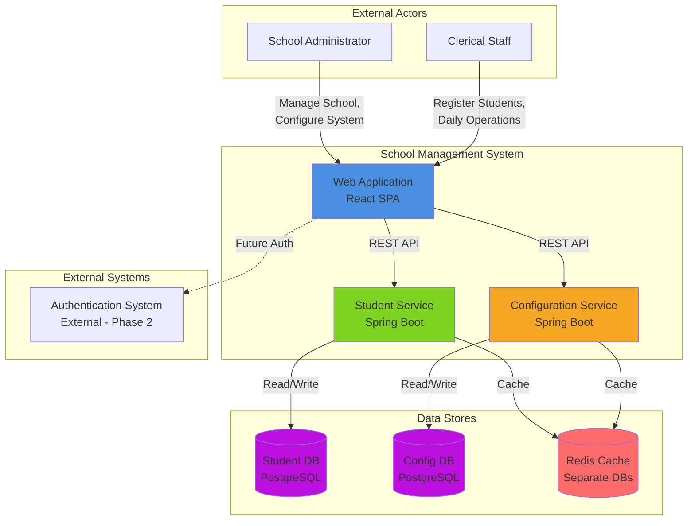
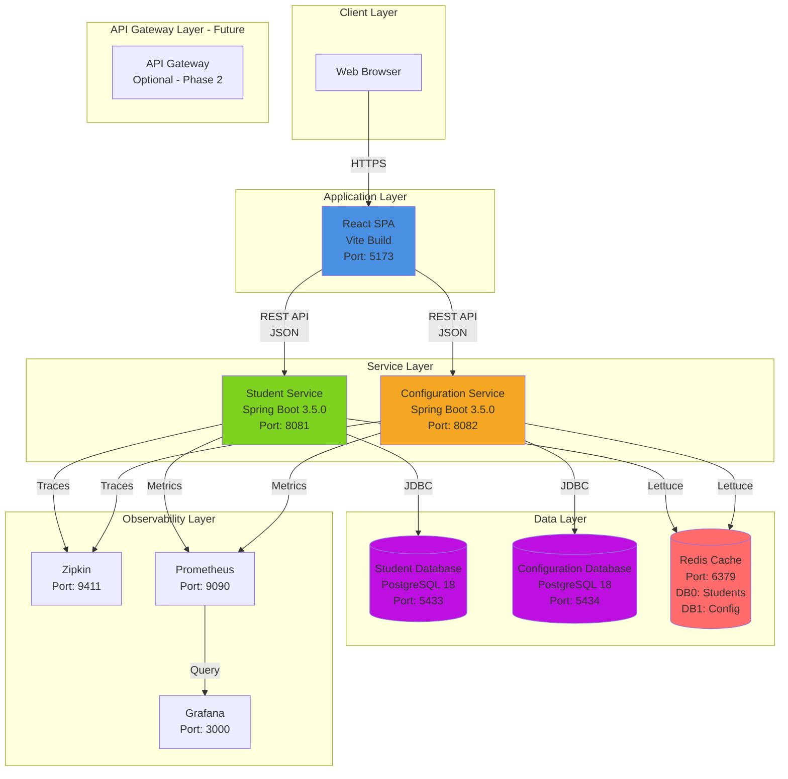
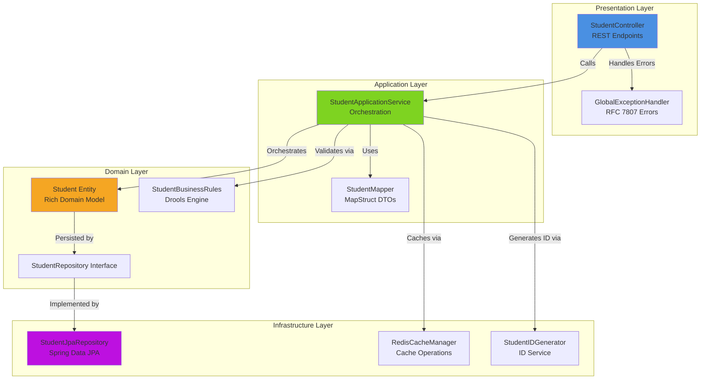

# System Architecture
**School Management System - Phase 1**

**Version**: 1.0
**Date**: January 8, 2026
**Status**: Active

---

## Table of Contents

1. [Overview](#overview)
2. [Architectural Style](#architectural-style)
3. [System Context](#system-context)
4. [Container Architecture](#container-architecture)
5. [Microservices Boundaries](#microservices-boundaries)
6. [Component Architecture](#component-architecture)
7. [Design Principles](#design-principles)
8. [Technology Stack](#technology-stack)
9. [Cross-Cutting Concerns](#cross-cutting-concerns)
10. [Deployment Architecture](#deployment-architecture)

---

## Overview

### Purpose
The School Management System (SMS) is a web-based digital platform designed to automate and optimize administrative workflows within schools. This document defines the production-ready system architecture following Domain-Driven Design (DDD) and microservices patterns.

### Architectural Goals
- **Scalability**: Horizontal scaling for individual services
- **Maintainability**: Clear separation of concerns, SOLID principles
- **Performance**: Sub-200ms API response time (95th percentile)
- **Resilience**: Graceful degradation, circuit breakers
- **Observability**: Comprehensive logging, metrics, tracing

### Scope
- **Phase 1**: Student Registration and School Configuration management
- **Single School Instance**: No multi-tenancy in Phase 1
- **External Authentication**: Auth handled outside this system

---

## Architectural Style

### Primary Pattern: Microservices Architecture with DDD

**Justification**:
- **Business Capability Alignment**: Student and Configuration are distinct bounded contexts
- **Independent Deployment**: Each service can be deployed, scaled, and updated independently
- **Technology Diversity**: Future flexibility to choose optimal tech per service
- **Team Autonomy**: Separate teams can own different services

### Layered Architecture (Per Service)

Each microservice follows a strict 4-layer architecture:

```
┌─────────────────────────────────────────┐
│       Presentation Layer                │  - REST Controllers
│  (API Contracts, DTOs, Error Handlers)  │  - Request/Response mapping
├─────────────────────────────────────────┤
│       Application Layer                 │  - Use Cases / Services
│   (Orchestration, CQRS, Transactions)   │  - Business workflow
├─────────────────────────────────────────┤
│         Domain Layer                    │  - Rich Domain Models
│  (Business Logic, Entities, Rules)      │  - Repository Interfaces
├─────────────────────────────────────────┤
│      Infrastructure Layer               │  - JPA Implementations
│  (Persistence, External APIs, Config)   │  - Cache, Messaging
└─────────────────────────────────────────┘
```

**Layer Responsibilities**:

1. **Presentation Layer**:
   - REST API endpoints (OpenAPI documented)
   - DTO mapping (domain models NEVER exposed)
   - Input validation (basic)
   - HTTP status code management
   - RFC 7807 error responses

2. **Application Layer**:
   - Orchestrate domain operations
   - Transaction boundaries (@Transactional)
   - CQRS separation (Command vs Query methods)
   - DTO to Entity mapping (MapStruct)
   - Cache management

3. **Domain Layer**:
   - Rich domain models with behavior
   - Business rule enforcement (Drools)
   - Repository interfaces (not implementations)
   - Domain events (future)
   - Value objects

4. **Infrastructure Layer**:
   - JPA entity implementations
   - Database access (Spring Data JPA)
   - Redis caching
   - External service integrations
   - Configuration management

---

## System Context

### System Context Diagram (Mermaid)



### External Dependencies

| System | Type | Purpose | Phase |
|--------|------|---------|-------|
| Authentication System | External | User authentication & authorization | Phase 2 |
| PostgreSQL | Infrastructure | Persistent data storage | Phase 1 |
| Redis | Infrastructure | Caching layer | Phase 1 |
| Zipkin | Observability | Distributed tracing | Phase 1 |
| Prometheus | Observability | Metrics collection | Phase 1 |
| Grafana | Observability | Metrics visualization | Phase 1 |

---

## Container Architecture

### Container Diagram (Mermaid)



### Container Responsibilities

**1. React SPA (Web Application)**
- **Technology**: React 18, TypeScript, Vite
- **Port**: 5173 (dev), 80/443 (production)
- **Responsibilities**:
  - User interface rendering
  - Client-side routing
  - Form validation (client-side)
  - API orchestration
  - State management (Context API)
- **Dependencies**: Student Service, Configuration Service

**2. Student Service (Backend Microservice)**
- **Technology**: Spring Boot 3.5.0, Java 21
- **Port**: 8081
- **Responsibilities**:
  - Student CRUD operations
  - Student ID generation (STU-YYYY-NNNNN)
  - Age validation (3-18 years)
  - Mobile number uniqueness enforcement
  - Search and filtering
  - Statistics (active/inactive counts)
- **Database**: Isolated PostgreSQL database (Port 5433)
- **Cache**: Redis DB0

**3. Configuration Service (Backend Microservice)**
- **Technology**: Spring Boot 3.5.0, Java 21
- **Port**: 8082
- **Responsibilities**:
  - Configuration CRUD operations
  - Category-based retrieval
  - Key-value settings management
  - School profile management
- **Database**: Isolated PostgreSQL database (Port 5434)
- **Cache**: Redis DB1

**4. PostgreSQL Databases**
- **Version**: 18+
- **Isolation**: Separate databases per service
- **Configuration**:
  - Optimistic locking enabled
  - Credentials via environment variables
  - Custom port: 5433 (student), 5434 (config)

**5. Redis Cache**
- **Version**: 7.x
- **Configuration**:
  - DB0: Student Service cache
  - DB1: Configuration Service cache
  - Persistence: AOF + RDB
  - Eviction policy: allkeys-lru

---

## Microservices Boundaries

### Bounded Context: Student Management

**Service Name**: `student-service`

**Business Capability**: Complete student lifecycle management

**Aggregate Root**: Student

**Data Ownership**:
- students table (full ownership)
- No shared tables with other services

**API Contracts**:
```
GET    /api/v1/students
GET    /api/v1/students/{id}
GET    /api/v1/students/search?query={q}
POST   /api/v1/students
PATCH  /api/v1/students/{id}
DELETE /api/v1/students/{id}
GET    /api/v1/students/statistics
POST   /api/v1/students/validate-phone
```

**Business Rules Enforced**:
- BR-1: Age must be between 3 and 18 years at registration
- BR-2: Mobile number must be unique across all students
- BR-3: Only firstName, lastName, phone, status can be updated
- BR-4: Student ID auto-generated (STU-YYYY-NNNNN format)

**Cache Strategy**:
- Cache individual student records (TTL: 2 hours)
- Cache search results (TTL: 10 minutes)
- Cache statistics (TTL: 5 minutes)
- Evict on update/delete

---

### Bounded Context: School Configuration

**Service Name**: `configuration-service`

**Business Capability**: School-wide settings and configuration management

**Aggregate Root**: ConfigurationSetting

**Data Ownership**:
- configuration_settings table (full ownership)
- No shared tables with other services

**API Contracts**:
```
GET    /api/v1/configurations
GET    /api/v1/configurations/{id}
GET    /api/v1/configurations?category={category}
POST   /api/v1/configurations
PATCH  /api/v1/configurations/{id}
DELETE /api/v1/configurations/{id}
```

**Business Rules Enforced**:
- BR-5: Key must be unique within category
- BR-6: Valid categories: GENERAL, ACADEMIC, FINANCE, SYSTEM
- BR-7: Value max length 1000 characters

**Cache Strategy**:
- Cache all configurations (TTL: 4 hours - stable data)
- Cache by category (TTL: 4 hours)
- Evict on update/delete

---

### Service Communication

**Phase 1**: No inter-service communication (services are independent)

**Future Phases**:
- Event-driven communication via message broker (RabbitMQ/Kafka)
- Saga pattern for distributed transactions
- API Gateway for client-facing unified endpoint

---

## Component Architecture

### Student Service Components



**Key Components**:

1. **StudentController**:
   - Exposes REST endpoints
   - Request validation (JSR-303)
   - Maps requests to DTOs
   - Returns standardized responses

2. **StudentApplicationService**:
   - Transaction boundaries
   - Orchestrates domain operations
   - Converts DTOs to Entities
   - Manages cache operations
   - Publishes domain events (future)

3. **Student (Domain Entity)**:
   - Rich domain model with behavior
   - Validation logic
   - State management (ACTIVE/INACTIVE)
   - Immutability enforcement

4. **StudentBusinessRules (Drools)**:
   - Age validation (3-18 years)
   - Phone uniqueness check
   - Edit field restrictions
   - Custom validation rules

5. **StudentJpaRepository**:
   - Extends JpaRepository
   - Custom query methods
   - EntityGraph for N+1 prevention
   - Optimistic locking support

6. **RedisCacheManager**:
   - Cache CRUD operations
   - TTL management
   - Eviction strategies
   - Fallback to DB on cache miss

7. **StudentIDGenerator**:
   - Generate unique IDs: STU-YYYY-NNNNN
   - Atomic counter (database sequence)
   - Thread-safe implementation

---

### Configuration Service Components

Similar structure to Student Service:
- ConfigurationController
- ConfigurationApplicationService
- Configuration (Domain Entity)
- ConfigurationRepository
- ConfigurationJpaRepository
- RedisCacheManager

---

## Design Principles

### SOLID Principles

**1. Single Responsibility Principle (SRP)**
- Each class has one reason to change
- Controllers only handle HTTP concerns
- Services only orchestrate business logic
- Repositories only handle data access

**2. Open/Closed Principle (OCP)**
- Extend behavior without modifying existing code
- Interface-based design
- Strategy pattern for validation rules
- Plugin architecture for business rules (Drools)

**3. Liskov Substitution Principle (LSP)**
- Interface implementations are interchangeable
- Repository abstractions can be swapped
- Cache implementations can be replaced

**4. Interface Segregation Principle (ISP)**
- Clients depend on minimal interfaces
- Separate read and write repositories (CQRS)
- Fine-grained service interfaces

**5. Dependency Inversion Principle (DIP)**
- Depend on abstractions, not concretions
- Repository interfaces in domain layer
- Implementations in infrastructure layer
- Inversion of Control (Spring DI)

---

### Separation of Concerns

**Clear Layer Boundaries**:
- No domain logic in controllers
- No persistence logic in domain layer
- No business logic in DTOs
- DTOs never cross into domain layer

**Interface-Based Design**:
- All dependencies via interfaces
- Easy mocking for tests
- Swap implementations without changing clients

---

### API Contract Strictness

**DTO Usage**:
- All API requests/responses use DTOs
- DTOs are immutable (records in Java 21)
- Separate DTOs for Create, Update, Response
- Never expose domain entities directly

**Example**:
```java
// Request DTO
public record CreateStudentRequest(
    String firstName,
    String lastName,
    LocalDate dateOfBirth,
    String adhaarNumber,
    String phone,
    String email,
    String address,
    String guardianName,
    String motherName,
    String identificationMarks
) {}

// Response DTO
public record StudentResponse(
    String id,
    String firstName,
    String lastName,
    LocalDate dateOfBirth,
    int age,
    String adhaarNumber,
    String phone,
    String email,
    String address,
    String guardianName,
    String motherName,
    String identificationMarks,
    StudentStatus status,
    Instant createdAt,
    Instant updatedAt
) {}

// Domain entity stays internal
class Student {
    // Rich domain model with behavior
}
```

---

## Technology Stack

### Backend Services

| Component | Technology | Version | Justification |
|-----------|-----------|---------|---------------|
| **Language** | Java | 21 LTS | Latest LTS, modern features (records, pattern matching) |
| **Framework** | Spring Boot | 3.5.0 | Industry standard, comprehensive ecosystem |
| **Data Access** | Spring Data JPA | 3.5.0 | ORM abstraction, repository pattern |
| **Database** | PostgreSQL | 18+ | ACID compliance, JSON support, performance |
| **Cache** | Redis | 7.x | High-performance in-memory store |
| **Business Rules** | Drools | 9.44.0.Final | Declarative rule engine, easy maintenance |
| **DTO Mapping** | MapStruct | 1.5.x | Compile-time generation, performance |
| **Validation** | Hibernate Validator | 8.x | JSR-303/380 implementation |
| **Tracing** | Zipkin | Latest | Distributed tracing, performance monitoring |
| **Metrics** | Micrometer | 1.x | Vendor-neutral metrics (Prometheus) |
| **API Docs** | SpringDoc OpenAPI | 2.6.x | OpenAPI 3.0 specification generation |
| **Logging** | Logback + SLF4J | 1.4.x | Structured JSON logging |

---

### Frontend Application

| Component | Technology | Version | Justification |
|-----------|-----------|---------|---------------|
| **Library** | React | 18+ | Component-based, hooks, modern |
| **Language** | TypeScript | 5.x | Type safety, better DX |
| **Build Tool** | Vite | 5.x | Fast HMR, optimized builds |
| **Routing** | React Router | 6.x | Standard SPA routing |
| **UI Framework** | Tailwind CSS | 4.x | Utility-first, rapid development |
| **Components** | Shadcn/ui | Latest | Accessible, customizable, Radix UI |
| **Forms** | React Hook Form | 7.x | Performance, validation |
| **HTTP Client** | Axios | 1.x | Interceptors, error handling |
| **State** | Context API | Built-in | Sufficient for current scope |
| **Icons** | Lucide React | Latest | Modern, consistent icons |
| **Notifications** | Sonner | Latest | Toast notifications |

---

### Infrastructure

| Component | Technology | Version | Justification |
|-----------|-----------|---------|---------------|
| **Containerization** | Docker | 24.x | Consistent environments |
| **Orchestration** | Docker Compose | 2.x | Local multi-container setup |
| **Reverse Proxy** | Nginx | Latest | Production web server |
| **Monitoring** | Prometheus | Latest | Time-series metrics DB |
| **Visualization** | Grafana | Latest | Dashboards, alerting |
| **Tracing** | Zipkin | Latest | Request flow visualization |

---

## Cross-Cutting Concerns

### Observability Strategy

**1. Distributed Tracing (Zipkin)**

**Implementation**:
- Add `spring-cloud-starter-zipkin` dependency
- Configure correlation IDs (trace ID, span ID)
- Propagate trace context across service boundaries

**Configuration**:
```yaml
spring:
  zipkin:
    base-url: http://zipkin:9411
    sender:
      type: web
  sleuth:
    sampler:
      probability: 1.0  # 100% sampling in dev, 10% in prod
```

**Correlation ID Pattern**:
- Generate UUID for each request
- Add to MDC (Mapped Diagnostic Context)
- Include in all logs
- Propagate via HTTP headers

**Example Log Entry**:
```json
{
  "timestamp": "2026-01-08T10:30:00.123Z",
  "level": "INFO",
  "service": "student-service",
  "traceId": "abc123def456",
  "spanId": "789ghi012jkl",
  "message": "Student created successfully",
  "studentId": "STU-2026-00001"
}
```

---

**2. Structured Logging**

**Requirements**:
- JSON format for all logs
- Include correlation IDs
- Separate log levels per environment
- Log aggregation (ELK stack - future)

**Log Levels**:
- **ERROR**: Application errors, exceptions
- **WARN**: Business rule violations, deprecated API usage
- **INFO**: Significant events (student created, config updated)
- **DEBUG**: Detailed flow (dev only)
- **TRACE**: Very detailed (dev only)

**Logback Configuration**:
```xml
<configuration>
    <appender name="JSON" class="ch.qos.logback.core.ConsoleAppender">
        <encoder class="net.logstash.logback.encoder.LogstashEncoder">
            <includeMdc>true</includeMdc>
        </encoder>
    </appender>

    <logger name="com.schoolms" level="INFO"/>
    <logger name="org.springframework.web" level="WARN"/>

    <root level="INFO">
        <appender-ref ref="JSON"/>
    </root>
</configuration>
```

---

**3. Metrics Collection (Micrometer + Prometheus)**

**Required Metrics**:

**Application Metrics**:
- `students.registered.total` (Counter) - Total students created
- `students.active.count` (Gauge) - Current active students
- `students.inactive.count` (Gauge) - Current inactive students
- `configurations.total` (Gauge) - Total configurations
- `api.requests.total` (Counter) - API request count by endpoint
- `api.response.time` (Timer) - Response time distribution
- `business.rule.violations.total` (Counter) - Validation failures

**JVM Metrics**:
- `jvm.memory.used` (Gauge)
- `jvm.gc.pause` (Timer)
- `jvm.threads.live` (Gauge)

**Database Metrics**:
- `hikaricp.connections.active` (Gauge)
- `hikaricp.connections.idle` (Gauge)
- `jdbc.query.execution.time` (Timer)

**Cache Metrics**:
- `cache.hits.total` (Counter)
- `cache.misses.total` (Counter)
- `cache.evictions.total` (Counter)
- `cache.hit.ratio` (Gauge) - Target >80%
- `redis.memory.used` (Gauge)

**Configuration**:
```yaml
management:
  endpoints:
    web:
      exposure:
        include: health,metrics,prometheus,info
  metrics:
    export:
      prometheus:
        enabled: true
    tags:
      application: ${spring.application.name}
      environment: ${spring.profiles.active}
```

---

**4. Health Checks**

**Spring Boot Actuator Endpoints**:
- `/actuator/health` - Overall health status
- `/actuator/health/readiness` - Ready to accept traffic
- `/actuator/health/liveness` - Application is alive

**Custom Health Indicators**:
```java
@Component
public class RedisHealthIndicator implements HealthIndicator {
    @Override
    public Health health() {
        try {
            redisTemplate.opsForValue().get("health-check");
            return Health.up()
                .withDetail("redis", "Available")
                .build();
        } catch (Exception e) {
            return Health.down()
                .withDetail("redis", "Unavailable")
                .withException(e)
                .build();
        }
    }
}
```

**Health Check Response**:
```json
{
  "status": "UP",
  "components": {
    "db": {
      "status": "UP",
      "details": {
        "database": "PostgreSQL",
        "validationQuery": "isValid()"
      }
    },
    "redis": {
      "status": "UP",
      "details": {
        "version": "7.2.0"
      }
    },
    "diskSpace": {
      "status": "UP"
    }
  }
}
```

---

### Security (Phase 1 - Minimal)

**Phase 1 Requirements**:
- No authentication (external system)
- Input validation (prevent injection)
- CORS configuration
- SQL injection prevention (Prepared Statements)
- XSS prevention (React escapes by default)

**CORS Configuration**:
```java
@Configuration
public class CorsConfig {
    @Value("${cors.allowed-origins}")
    private String[] allowedOrigins;

    @Bean
    public WebMvcConfigurer corsConfigurer() {
        return new WebMvcConfigurer() {
            @Override
            public void addCorsMappings(CorsRegistry registry) {
                registry.addMapping("/api/**")
                    .allowedOrigins(allowedOrigins)
                    .allowedMethods("GET", "POST", "PATCH", "DELETE")
                    .allowedHeaders("*")
                    .maxAge(3600);
            }
        };
    }
}
```

**Environment-based CORS**:
```yaml
# application-dev.yml
cors:
  allowed-origins:
    - http://localhost:5173
    - http://localhost:3000

# application-prod.yml
cors:
  allowed-origins:
    - https://schoolms.example.com
```

---

### Error Handling

**RFC 7807 Problem Details**

All API errors follow the RFC 7807 standard:

```json
{
  "type": "https://api.schoolms.com/problems/validation-error",
  "title": "Validation Error",
  "status": 400,
  "detail": "Student age must be between 3 and 18 years",
  "instance": "/api/v1/students",
  "timestamp": "2026-01-08T10:30:00.123Z",
  "traceId": "abc123def456",
  "errors": {
    "dateOfBirth": ["Age calculated as 2 years, must be at least 3"]
  }
}
```

**Global Exception Handler**:
```java
@RestControllerAdvice
public class GlobalExceptionHandler {

    @ExceptionHandler(ValidationException.class)
    public ResponseEntity<ProblemDetail> handleValidation(
        ValidationException ex, HttpServletRequest request) {

        ProblemDetail problem = ProblemDetail.forStatusAndDetail(
            HttpStatus.BAD_REQUEST,
            ex.getMessage()
        );
        problem.setType(URI.create("https://api.schoolms.com/problems/validation-error"));
        problem.setTitle("Validation Error");
        problem.setProperty("timestamp", Instant.now());
        problem.setProperty("traceId", MDC.get("traceId"));

        return ResponseEntity.badRequest().body(problem);
    }
}
```

---

### Performance Requirements

**Response Time SLA**:
- **95th percentile**: <200ms
- **99th percentile**: <500ms
- **Max timeout**: 5 seconds

**Optimization Strategies**:

1. **N+1 Query Prevention**:
   ```java
   @EntityGraph(attributePaths = {"guardian", "contact"})
   List<Student> findAll();
   ```

2. **Database Connection Pool (HikariCP)**:
   ```yaml
   spring:
     datasource:
       hikari:
         maximum-pool-size: 20
         minimum-idle: 5
         connection-timeout: 30000
         idle-timeout: 600000
         max-lifetime: 1800000
   ```

3. **Redis Caching**:
   - Cache frequently accessed data
   - Appropriate TTLs
   - Eviction on updates

4. **Batch Processing**:
   - Batch inserts for bulk operations
   - Pagination for large result sets

---

## Deployment Architecture

### Docker Compose Structure

```yaml
version: '3.9'

services:
  # Frontend
  web:
    build: ./frontend
    ports:
      - "80:80"
    depends_on:
      - student-service
      - config-service

  # Backend Services
  student-service:
    build: ./student-service
    ports:
      - "8081:8081"
    environment:
      - SPRING_PROFILES_ACTIVE=prod
      - DB_HOST=student-db
      - REDIS_HOST=redis
    depends_on:
      - student-db
      - redis

  config-service:
    build: ./config-service
    ports:
      - "8082:8082"
    environment:
      - SPRING_PROFILES_ACTIVE=prod
      - DB_HOST=config-db
      - REDIS_HOST=redis
    depends_on:
      - config-db
      - redis

  # Databases
  student-db:
    image: postgres:18
    ports:
      - "5433:5432"
    environment:
      - POSTGRES_DB=studentdb
      - POSTGRES_USER=${DB_USER}
      - POSTGRES_PASSWORD=${DB_PASSWORD}
    volumes:
      - student-data:/var/lib/postgresql/data

  config-db:
    image: postgres:18
    ports:
      - "5434:5432"
    environment:
      - POSTGRES_DB=configdb
      - POSTGRES_USER=${DB_USER}
      - POSTGRES_PASSWORD=${DB_PASSWORD}
    volumes:
      - config-data:/var/lib/postgresql/data

  # Cache
  redis:
    image: redis:7-alpine
    ports:
      - "6379:6379"
    command: redis-server --appendonly yes --maxmemory 256mb --maxmemory-policy allkeys-lru
    volumes:
      - redis-data:/data

  # Observability
  zipkin:
    image: openzipkin/zipkin
    ports:
      - "9411:9411"

  prometheus:
    image: prom/prometheus
    ports:
      - "9090:9090"
    volumes:
      - ./prometheus.yml:/etc/prometheus/prometheus.yml
      - prometheus-data:/prometheus

  grafana:
    image: grafana/grafana
    ports:
      - "3000:3000"
    environment:
      - GF_SECURITY_ADMIN_PASSWORD=admin
    volumes:
      - grafana-data:/var/lib/grafana

volumes:
  student-data:
  config-data:
  redis-data:
  prometheus-data:
  grafana-data:
```

---

### Port Allocation

| Service | Port | Purpose |
|---------|------|---------|
| Frontend (Dev) | 5173 | Vite dev server |
| Frontend (Prod) | 80/443 | Nginx |
| Student Service | 8081 | REST API |
| Configuration Service | 8082 | REST API |
| Student DB | 5433 | PostgreSQL (mapped to 5432 internal) |
| Config DB | 5434 | PostgreSQL (mapped to 5432 internal) |
| Redis | 6379 | Cache |
| Zipkin | 9411 | Tracing UI |
| Prometheus | 9090 | Metrics |
| Grafana | 3000 | Dashboards |

---

### Environment Configuration

**Environment Variables**:
```bash
# Database
DB_USER=schooladmin
DB_PASSWORD=<secure-password>

# Redis
REDIS_HOST=localhost
REDIS_PORT=6379

# Application
SPRING_PROFILES_ACTIVE=dev

# Frontend
VITE_API_BASE_URL=http://localhost:8081
VITE_STUDENT_SERVICE_URL=http://localhost:8081
VITE_CONFIG_SERVICE_URL=http://localhost:8082

# Observability
ZIPKIN_URL=http://localhost:9411
```

---

## Summary

This architecture provides:

1. **Microservices Boundaries**: Clear separation between Student and Configuration domains
2. **Database-per-Service**: Absolute isolation, no shared state
3. **Layered Architecture**: Strict separation of concerns (Presentation, Application, Domain, Infrastructure)
4. **Contract Strictness**: DTOs for all API communication, domain models never exposed
5. **Observability**: Comprehensive logging, metrics, and tracing
6. **Performance**: Caching, connection pooling, N+1 prevention
7. **Scalability**: Stateless services, horizontal scaling ready
8. **Maintainability**: SOLID principles, interface-based design

---

**Next Steps**: Proceed to `02-database-design.md` for detailed entity-relationship diagrams and schema definitions.
