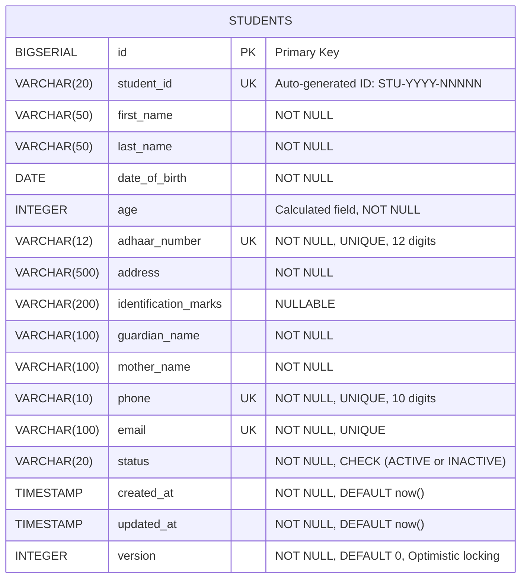
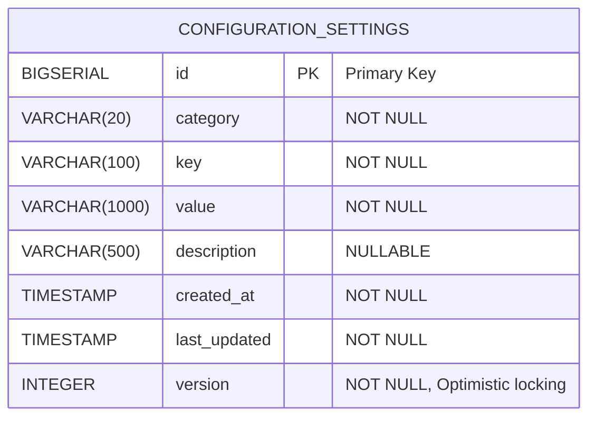

# Database Design
**School Management System - Phase 1**

**Version**: 1.0
**Date**: January 8, 2026
**Status**: Active

---

## Table of Contents

1. [Overview](#overview)
2. [Database-per-Service Pattern](#database-per-service-pattern)
3. [Student Database Schema](#student-database-schema)
4. [Configuration Database Schema](#configuration-database-schema)
5. [Naming Conventions](#naming-conventions)
6. [Data Types and Constraints](#data-types-and-constraints)
7. [Indexing Strategy](#indexing-strategy)
8. [Migration Strategy](#migration-strategy)
9. [Backup and Recovery](#backup-and-recovery)

---

## Overview

### Design Principles

1. **Database Isolation**: Each microservice owns its database exclusively
2. **No Shared Tables**: Absolute prohibition on cross-service table access
3. **Schema Evolution**: Version-controlled migrations (Flyway/Liquibase)
4. **Referential Integrity**: Enforced at database level where possible
5. **Audit Trails**: All tables include created_at, updated_at timestamps
6. **Optimistic Locking**: Version column for concurrency control

### Technology Stack

- **RDBMS**: PostgreSQL 18+
- **Migration Tool**: Flyway (embedded in Spring Boot)
- **Connection Pool**: HikariCP
- **ORM**: Hibernate 6.x (via Spring Data JPA)

---

## Database-per-Service Pattern

### Student Service Database

**Database Name**: `studentdb`
**Port**: 5433 (mapped from Docker)
**Owner**: `student_service` user

**Tables**:
- `students` - Student records

**Access Control**:
- Only `student-service` application can connect
- No cross-database queries allowed
- Foreign keys only within this database

---

### Configuration Service Database

**Database Name**: `configdb`
**Port**: 5434 (mapped from Docker)
**Owner**: `config_service` user

**Tables**:
- `configuration_settings` - Configuration key-value pairs

**Access Control**:
- Only `configuration-service` application can connect
- No cross-database queries allowed
- Independent schema evolution

---

## Student Database Schema

### Entity Relationship Diagram (Mermaid)



### Students Table DDL

```sql
-- Student Service Database: studentdb

CREATE TABLE students (
    -- Primary Key
    id                    BIGSERIAL PRIMARY KEY,

    -- Business Identifier (Auto-generated)
    student_id            VARCHAR(20) NOT NULL UNIQUE,

    -- Personal Information
    first_name            VARCHAR(50) NOT NULL,
    last_name             VARCHAR(50) NOT NULL,
    date_of_birth         DATE NOT NULL,
    age                   INTEGER NOT NULL,
    adhaar_number         VARCHAR(12) NOT NULL UNIQUE,
    address               VARCHAR(500) NOT NULL,
    identification_marks  VARCHAR(200),

    -- Guardian Information
    guardian_name         VARCHAR(100) NOT NULL,
    mother_name           VARCHAR(100) NOT NULL,

    -- Contact Information
    phone                 VARCHAR(10) NOT NULL UNIQUE,
    email                 VARCHAR(100) NOT NULL UNIQUE,

    -- Status
    status                VARCHAR(20) NOT NULL DEFAULT 'ACTIVE',

    -- Audit Fields
    created_at            TIMESTAMP WITH TIME ZONE NOT NULL DEFAULT CURRENT_TIMESTAMP,
    updated_at            TIMESTAMP WITH TIME ZONE NOT NULL DEFAULT CURRENT_TIMESTAMP,

    -- Optimistic Locking
    version               INTEGER NOT NULL DEFAULT 0,

    -- Constraints
    CONSTRAINT chk_status CHECK (status IN ('ACTIVE', 'INACTIVE')),
    CONSTRAINT chk_age CHECK (age >= 3 AND age <= 18),
    CONSTRAINT chk_adhaar_format CHECK (adhaar_number ~ '^\d{12}$'),
    CONSTRAINT chk_phone_format CHECK (phone ~ '^\d{10}$'),
    CONSTRAINT chk_email_format CHECK (email ~* '^[A-Za-z0-9._%+-]+@[A-Za-z0-9.-]+\.[A-Z|a-z]{2,}$'),
    CONSTRAINT chk_dob_not_future CHECK (date_of_birth <= CURRENT_DATE)
);

-- Comments
COMMENT ON TABLE students IS 'Student registration and profile information';
COMMENT ON COLUMN students.student_id IS 'Auto-generated student ID in format STU-YYYY-NNNNN';
COMMENT ON COLUMN students.age IS 'Calculated from date_of_birth, must be 3-18 at registration';
COMMENT ON COLUMN students.adhaar_number IS 'Indian national ID, 12 digits, unique';
COMMENT ON COLUMN students.status IS 'Student status: ACTIVE or INACTIVE';
COMMENT ON COLUMN students.version IS 'Optimistic locking version, incremented on each update';
```

---

### Students Table - Field Specifications

| Column | Type | Constraints | Description | Editable |
|--------|------|-------------|-------------|----------|
| `id` | BIGSERIAL | PK, NOT NULL | Database primary key | No |
| `student_id` | VARCHAR(20) | UNIQUE, NOT NULL | Business ID: STU-YYYY-NNNNN | No |
| `first_name` | VARCHAR(50) | NOT NULL | Student's first name | Yes |
| `last_name` | VARCHAR(50) | NOT NULL | Student's last name | Yes |
| `date_of_birth` | DATE | NOT NULL, <= CURRENT_DATE | Date of birth | No |
| `age` | INTEGER | NOT NULL, 3-18 | Calculated from DOB | No |
| `adhaar_number` | VARCHAR(12) | UNIQUE, NOT NULL, Regex: ^\d{12}$ | Indian national ID | No |
| `address` | VARCHAR(500) | NOT NULL | Full address | No |
| `identification_marks` | VARCHAR(200) | NULLABLE | Physical identification marks | No |
| `guardian_name` | VARCHAR(100) | NOT NULL | Father/Guardian name | No |
| `mother_name` | VARCHAR(100) | NOT NULL | Mother's name | No |
| `phone` | VARCHAR(10) | UNIQUE, NOT NULL, Regex: ^\d{10}$ | Mobile number | Yes |
| `email` | VARCHAR(100) | UNIQUE, NOT NULL, Email format | Email address | No |
| `status` | VARCHAR(20) | NOT NULL, CHECK(ACTIVE/INACTIVE) | Student status | Yes |
| `created_at` | TIMESTAMP TZ | NOT NULL, DEFAULT now() | Record creation timestamp | No |
| `updated_at` | TIMESTAMP TZ | NOT NULL, DEFAULT now() | Last update timestamp | Auto |
| `version` | INTEGER | NOT NULL, DEFAULT 0 | Optimistic lock version | Auto |

**Editable Fields (via PATCH /api/v1/students/{id})**:
- `first_name`
- `last_name`
- `phone` (with uniqueness validation)
- `status`

All other fields are immutable after creation.

---

### Students Table - Indexes

```sql
-- Primary Key Index (automatic)
-- CREATE UNIQUE INDEX students_pkey ON students (id);

-- Unique Constraints (automatic unique indexes)
-- CREATE UNIQUE INDEX students_student_id_key ON students (student_id);
-- CREATE UNIQUE INDEX students_adhaar_number_key ON students (adhaar_number);
-- CREATE UNIQUE INDEX students_phone_key ON students (phone);
-- CREATE UNIQUE INDEX students_email_key ON students (email);

-- Performance Indexes

-- Index for student ID lookups (most common query)
CREATE INDEX idx_students_student_id ON students (student_id);

-- Index for name-based searches
CREATE INDEX idx_students_name ON students (last_name, first_name);

-- Index for guardian search
CREATE INDEX idx_students_guardian ON students (guardian_name);

-- Index for status filtering
CREATE INDEX idx_students_status ON students (status);

-- Composite index for active students list (common query)
CREATE INDEX idx_students_status_created ON students (status, created_at DESC);

-- Partial index for active students only (optimization)
CREATE INDEX idx_students_active ON students (created_at DESC)
WHERE status = 'ACTIVE';

-- Full-text search index for name and guardian (future enhancement)
CREATE INDEX idx_students_search ON students
USING gin(to_tsvector('english',
    first_name || ' ' || last_name || ' ' || guardian_name
));
```

**Index Rationale**:
- **idx_students_student_id**: Fast lookup by business ID
- **idx_students_name**: Support sorting and searching by name
- **idx_students_guardian**: Guardian-based search requirement
- **idx_students_status**: Status filtering (ACTIVE/INACTIVE)
- **idx_students_status_created**: List students by status with pagination
- **idx_students_active**: Optimized for active students (most common filter)
- **idx_students_search**: Full-text search capability

---

### Students Table - Triggers

**Auto-update timestamp trigger**:

```sql
-- Function to update updated_at timestamp
CREATE OR REPLACE FUNCTION update_updated_at_column()
RETURNS TRIGGER AS $$
BEGIN
    NEW.updated_at = CURRENT_TIMESTAMP;
    RETURN NEW;
END;
$$ LANGUAGE plpgsql;

-- Trigger to automatically update updated_at
CREATE TRIGGER trigger_students_updated_at
BEFORE UPDATE ON students
FOR EACH ROW
EXECUTE FUNCTION update_updated_at_column();
```

**Age calculation trigger**:

```sql
-- Function to calculate age from date_of_birth
CREATE OR REPLACE FUNCTION calculate_age()
RETURNS TRIGGER AS $$
BEGIN
    NEW.age = EXTRACT(YEAR FROM AGE(NEW.date_of_birth));
    RETURN NEW;
END;
$$ LANGUAGE plpgsql;

-- Trigger to calculate age on insert/update
CREATE TRIGGER trigger_students_calculate_age
BEFORE INSERT OR UPDATE OF date_of_birth ON students
FOR EACH ROW
EXECUTE FUNCTION calculate_age();
```

---

### Student ID Sequence

**Auto-generation of STU-YYYY-NNNNN format**:

```sql
-- Sequence for student ID counter
CREATE SEQUENCE student_id_seq
    START WITH 1
    INCREMENT BY 1
    NO MAXVALUE
    CACHE 10;

-- Function to generate student ID
CREATE OR REPLACE FUNCTION generate_student_id()
RETURNS VARCHAR(20) AS $$
DECLARE
    current_year VARCHAR(4);
    next_number INTEGER;
    formatted_number VARCHAR(5);
BEGIN
    current_year := EXTRACT(YEAR FROM CURRENT_DATE)::VARCHAR;
    next_number := nextval('student_id_seq');
    formatted_number := LPAD(next_number::VARCHAR, 5, '0');
    RETURN 'STU-' || current_year || '-' || formatted_number;
END;
$$ LANGUAGE plpgsql;

-- Trigger to auto-generate student_id
CREATE OR REPLACE FUNCTION set_student_id()
RETURNS TRIGGER AS $$
BEGIN
    IF NEW.student_id IS NULL OR NEW.student_id = '' THEN
        NEW.student_id := generate_student_id();
    END IF;
    RETURN NEW;
END;
$$ LANGUAGE plpgsql;

CREATE TRIGGER trigger_students_set_student_id
BEFORE INSERT ON students
FOR EACH ROW
EXECUTE FUNCTION set_student_id();
```

**Example generated IDs**:
- `STU-2026-00001`
- `STU-2026-00002`
- `STU-2026-00123`

---

## Configuration Database Schema

### Entity Relationship Diagram (Mermaid)



### Configuration Settings Table DDL

```sql
-- Configuration Service Database: configdb

CREATE TABLE configuration_settings (
    -- Primary Key
    id              BIGSERIAL PRIMARY KEY,

    -- Configuration Data
    category        VARCHAR(20) NOT NULL,
    key             VARCHAR(100) NOT NULL,
    value           VARCHAR(1000) NOT NULL,
    description     VARCHAR(500),

    -- Audit Fields
    created_at      TIMESTAMP WITH TIME ZONE NOT NULL DEFAULT CURRENT_TIMESTAMP,
    last_updated    TIMESTAMP WITH TIME ZONE NOT NULL DEFAULT CURRENT_TIMESTAMP,

    -- Optimistic Locking
    version         INTEGER NOT NULL DEFAULT 0,

    -- Constraints
    CONSTRAINT chk_category CHECK (category IN ('GENERAL', 'ACADEMIC', 'FINANCE', 'SYSTEM')),
    CONSTRAINT uk_category_key UNIQUE (category, key)
);

-- Comments
COMMENT ON TABLE configuration_settings IS 'School-wide configuration key-value pairs';
COMMENT ON COLUMN configuration_settings.category IS 'Configuration category: GENERAL, ACADEMIC, FINANCE, SYSTEM';
COMMENT ON COLUMN configuration_settings.key IS 'Configuration key, unique within category';
COMMENT ON COLUMN configuration_settings.value IS 'Configuration value, max 1000 characters';
COMMENT ON CONSTRAINT uk_category_key ON configuration_settings IS 'Key must be unique within category';
```

---

### Configuration Settings Table - Field Specifications

| Column | Type | Constraints | Description |
|--------|------|-------------|-------------|
| `id` | BIGSERIAL | PK, NOT NULL | Database primary key |
| `category` | VARCHAR(20) | NOT NULL, CHECK | Category: GENERAL, ACADEMIC, FINANCE, SYSTEM |
| `key` | VARCHAR(100) | NOT NULL, UNIQUE per category | Configuration key (e.g., SCHOOL_NAME) |
| `value` | VARCHAR(1000) | NOT NULL | Configuration value |
| `description` | VARCHAR(500) | NULLABLE | Human-readable description |
| `created_at` | TIMESTAMP TZ | NOT NULL, DEFAULT now() | Record creation timestamp |
| `last_updated` | TIMESTAMP TZ | NOT NULL, DEFAULT now() | Last update timestamp |
| `version` | INTEGER | NOT NULL, DEFAULT 0 | Optimistic lock version |

---

### Configuration Settings Table - Indexes

```sql
-- Primary Key Index (automatic)
-- CREATE UNIQUE INDEX configuration_settings_pkey ON configuration_settings (id);

-- Unique Constraint Index (automatic)
-- CREATE UNIQUE INDEX uk_category_key ON configuration_settings (category, key);

-- Performance Indexes

-- Index for category-based retrieval (most common query)
CREATE INDEX idx_config_category ON configuration_settings (category);

-- Index for key lookup within category
CREATE INDEX idx_config_key ON configuration_settings (key);

-- Index for recently updated configurations
CREATE INDEX idx_config_last_updated ON configuration_settings (last_updated DESC);
```

---

### Configuration Settings Table - Triggers

**Auto-update timestamp trigger**:

```sql
-- Reuse the same update_updated_at_column function from student database

-- Trigger to automatically update last_updated
CREATE TRIGGER trigger_config_last_updated
BEFORE UPDATE ON configuration_settings
FOR EACH ROW
EXECUTE FUNCTION update_updated_at_column();

-- Note: Adjust function to update last_updated instead of updated_at
CREATE OR REPLACE FUNCTION update_last_updated_column()
RETURNS TRIGGER AS $$
BEGIN
    NEW.last_updated = CURRENT_TIMESTAMP;
    RETURN NEW;
END;
$$ LANGUAGE plpgsql;

DROP TRIGGER IF EXISTS trigger_config_last_updated ON configuration_settings;

CREATE TRIGGER trigger_config_last_updated
BEFORE UPDATE ON configuration_settings
FOR EACH ROW
EXECUTE FUNCTION update_last_updated_column();
```

---

### Sample Configuration Data

```sql
-- General Settings
INSERT INTO configuration_settings (category, key, value, description) VALUES
('GENERAL', 'SCHOOL_NAME', 'St. Mary''s High School', 'Official school name'),
('GENERAL', 'SCHOOL_CODE', 'SMHS-2026', 'Unique school identifier'),
('GENERAL', 'SCHOOL_ADDRESS', '123 Main Street, City, State - 123456', 'School address'),
('GENERAL', 'CONTACT_EMAIL', 'info@stmarys.edu', 'Primary contact email'),
('GENERAL', 'CONTACT_PHONE', '1234567890', 'Primary contact phone');

-- Academic Settings
INSERT INTO configuration_settings (category, key, value, description) VALUES
('ACADEMIC', 'ACADEMIC_YEAR', '2025-2026', 'Current academic year'),
('ACADEMIC', 'MIN_STUDENT_AGE', '3', 'Minimum student age for registration'),
('ACADEMIC', 'MAX_STUDENT_AGE', '18', 'Maximum student age for registration'),
('ACADEMIC', 'CLASS_CAPACITY', '40', 'Maximum students per class');

-- Finance Settings
INSERT INTO configuration_settings (category, key, value, description) VALUES
('FINANCE', 'CURRENCY', 'INR', 'Currency code'),
('FINANCE', 'REGISTRATION_FEE', '1000', 'Student registration fee');

-- System Settings
INSERT INTO configuration_settings (category, key, value, description) VALUES
('SYSTEM', 'CACHE_TTL_STUDENTS', '7200', 'Student cache TTL in seconds (2 hours)'),
('SYSTEM', 'CACHE_TTL_CONFIG', '14400', 'Config cache TTL in seconds (4 hours)'),
('SYSTEM', 'MAX_SEARCH_RESULTS', '100', 'Maximum search results to return');
```

---

## Naming Conventions

### Table Names
- **Format**: `snake_case`, plural nouns
- **Examples**: `students`, `configuration_settings`

### Column Names
- **Format**: `snake_case`, descriptive
- **Examples**: `first_name`, `date_of_birth`, `guardian_name`

### Primary Keys
- **Name**: `id`
- **Type**: `BIGSERIAL`

### Foreign Keys (when applicable)
- **Format**: `{referenced_table}_id`
- **Example**: `class_id` (if referencing classes table)

### Indexes
- **Format**: `idx_{table}_{column(s)}`
- **Examples**: `idx_students_name`, `idx_students_status_created`

### Constraints
- **Check**: `chk_{column}`
- **Unique**: `uk_{column(s)}`
- **Foreign Key**: `fk_{table}_{referenced_table}`

### Sequences
- **Format**: `{table}_id_seq`
- **Example**: `student_id_seq`

---

## Data Types and Constraints

### Standard Data Types

| Data Type | Usage | Example Columns |
|-----------|-------|-----------------|
| `BIGSERIAL` | Auto-incrementing primary keys | `id` |
| `VARCHAR(n)` | Variable-length text | `first_name`, `email`, `phone` |
| `TEXT` | Unlimited text (use sparingly) | None in Phase 1 |
| `DATE` | Date without time | `date_of_birth` |
| `TIMESTAMP WITH TIME ZONE` | Date and time with timezone | `created_at`, `updated_at` |
| `INTEGER` | Whole numbers | `age`, `version` |
| `BOOLEAN` | True/false (use sparingly) | None (use CHECK constraints for enums) |

### Why VARCHAR over ENUM?

**Decision**: Use `VARCHAR` with `CHECK` constraints instead of PostgreSQL `ENUM` type

**Rationale**:
- Enums are hard to modify (require schema migration)
- VARCHAR with CHECK is more flexible
- Application-level enums (Java) provide type safety
- Database constraint ensures data integrity

---

### Audit Columns (Standard Across All Tables)

```sql
created_at      TIMESTAMP WITH TIME ZONE NOT NULL DEFAULT CURRENT_TIMESTAMP,
updated_at      TIMESTAMP WITH TIME ZONE NOT NULL DEFAULT CURRENT_TIMESTAMP,
version         INTEGER NOT NULL DEFAULT 0
```

**Purpose**:
- **created_at**: Immutable record creation timestamp
- **updated_at**: Auto-updated on every modification
- **version**: Optimistic locking to prevent concurrent update conflicts

---

### Optimistic Locking

**How it works**:

1. **Read**: Application fetches entity with `version = 1`
2. **Modify**: User makes changes locally
3. **Update**: Application sends UPDATE with `WHERE id = ? AND version = 1`
4. **Check**: If rows affected = 0, concurrent modification occurred
5. **Handle**: Throw `OptimisticLockException`, ask user to retry

**JPA Entity Example**:
```java
@Entity
@Table(name = "students")
public class Student {
    @Id
    @GeneratedValue(strategy = GenerationType.IDENTITY)
    private Long id;

    @Version
    private Integer version;

    // Other fields...
}
```

**SQL Update Example**:
```sql
UPDATE students
SET first_name = 'John', version = version + 1
WHERE id = 123 AND version = 1;

-- Returns 1 row if successful, 0 if version mismatch
```

---

## Indexing Strategy

### Index Performance Considerations

**When to Index**:
- Columns used in `WHERE` clauses (status, student_id)
- Columns used in `ORDER BY` (created_at)
- Foreign key columns (future joins)
- Columns used in `UNIQUE` constraints (automatic)

**When NOT to Index**:
- Small tables (<1000 rows) - full table scan is faster
- Columns with very low cardinality (e.g., boolean with 2 values)
- Columns rarely queried
- Write-heavy tables (indexes slow down inserts)

**Index Maintenance**:
```sql
-- Rebuild all indexes on a table
REINDEX TABLE students;

-- Analyze query performance
EXPLAIN ANALYZE SELECT * FROM students WHERE status = 'ACTIVE';

-- Monitor index usage
SELECT schemaname, tablename, indexname, idx_scan
FROM pg_stat_user_indexes
WHERE schemaname = 'public'
ORDER BY idx_scan ASC;
```

---

## Migration Strategy

### Flyway Configuration

**Migration File Naming**:
```
V1__create_students_table.sql
V2__add_students_indexes.sql
V3__create_configuration_settings_table.sql
V4__add_sample_configurations.sql
V5__alter_students_add_column.sql
```

**Format**: `V{version}__{description}.sql`

---

### Example Migration: V1__create_students_table.sql

```sql
-- ======================================
-- Migration: V1__create_students_table
-- Description: Create students table with all constraints
-- Author: System Architect
-- Date: 2026-01-08
-- ======================================

-- Create students table
CREATE TABLE students (
    id                    BIGSERIAL PRIMARY KEY,
    student_id            VARCHAR(20) NOT NULL UNIQUE,
    first_name            VARCHAR(50) NOT NULL,
    last_name             VARCHAR(50) NOT NULL,
    date_of_birth         DATE NOT NULL,
    age                   INTEGER NOT NULL,
    adhaar_number         VARCHAR(12) NOT NULL UNIQUE,
    address               VARCHAR(500) NOT NULL,
    identification_marks  VARCHAR(200),
    guardian_name         VARCHAR(100) NOT NULL,
    mother_name           VARCHAR(100) NOT NULL,
    phone                 VARCHAR(10) NOT NULL UNIQUE,
    email                 VARCHAR(100) NOT NULL UNIQUE,
    status                VARCHAR(20) NOT NULL DEFAULT 'ACTIVE',
    created_at            TIMESTAMP WITH TIME ZONE NOT NULL DEFAULT CURRENT_TIMESTAMP,
    updated_at            TIMESTAMP WITH TIME ZONE NOT NULL DEFAULT CURRENT_TIMESTAMP,
    version               INTEGER NOT NULL DEFAULT 0,

    CONSTRAINT chk_status CHECK (status IN ('ACTIVE', 'INACTIVE')),
    CONSTRAINT chk_age CHECK (age >= 3 AND age <= 18),
    CONSTRAINT chk_adhaar_format CHECK (adhaar_number ~ '^\d{12}$'),
    CONSTRAINT chk_phone_format CHECK (phone ~ '^\d{10}$'),
    CONSTRAINT chk_email_format CHECK (email ~* '^[A-Za-z0-9._%+-]+@[A-Za-z0-9.-]+\.[A-Z|a-z]{2,}$'),
    CONSTRAINT chk_dob_not_future CHECK (date_of_birth <= CURRENT_DATE)
);

-- Add table comment
COMMENT ON TABLE students IS 'Student registration and profile information';

-- Create sequence for student ID
CREATE SEQUENCE student_id_seq START WITH 1 INCREMENT BY 1 NO MAXVALUE CACHE 10;

-- Create student ID generation function
CREATE OR REPLACE FUNCTION generate_student_id()
RETURNS VARCHAR(20) AS $$
DECLARE
    current_year VARCHAR(4);
    next_number INTEGER;
    formatted_number VARCHAR(5);
BEGIN
    current_year := EXTRACT(YEAR FROM CURRENT_DATE)::VARCHAR;
    next_number := nextval('student_id_seq');
    formatted_number := LPAD(next_number::VARCHAR, 5, '0');
    RETURN 'STU-' || current_year || '-' || formatted_number;
END;
$$ LANGUAGE plpgsql;

-- Create triggers
CREATE OR REPLACE FUNCTION set_student_id()
RETURNS TRIGGER AS $$
BEGIN
    IF NEW.student_id IS NULL OR NEW.student_id = '' THEN
        NEW.student_id := generate_student_id();
    END IF;
    RETURN NEW;
END;
$$ LANGUAGE plpgsql;

CREATE TRIGGER trigger_students_set_student_id
BEFORE INSERT ON students
FOR EACH ROW
EXECUTE FUNCTION set_student_id();

-- Age calculation trigger
CREATE OR REPLACE FUNCTION calculate_age()
RETURNS TRIGGER AS $$
BEGIN
    NEW.age = EXTRACT(YEAR FROM AGE(NEW.date_of_birth));
    RETURN NEW;
END;
$$ LANGUAGE plpgsql;

CREATE TRIGGER trigger_students_calculate_age
BEFORE INSERT OR UPDATE OF date_of_birth ON students
FOR EACH ROW
EXECUTE FUNCTION calculate_age();

-- Updated_at trigger
CREATE OR REPLACE FUNCTION update_updated_at_column()
RETURNS TRIGGER AS $$
BEGIN
    NEW.updated_at = CURRENT_TIMESTAMP;
    RETURN NEW;
END;
$$ LANGUAGE plpgsql;

CREATE TRIGGER trigger_students_updated_at
BEFORE UPDATE ON students
FOR EACH ROW
EXECUTE FUNCTION update_updated_at_column();
```

---

### Rolling Back Migrations

Flyway does NOT support automatic rollback. Manual rollback scripts required:

**U1__rollback_students_table.sql** (not executed by Flyway):
```sql
DROP TRIGGER IF EXISTS trigger_students_updated_at ON students;
DROP TRIGGER IF EXISTS trigger_students_calculate_age ON students;
DROP TRIGGER IF EXISTS trigger_students_set_student_id ON students;
DROP FUNCTION IF EXISTS update_updated_at_column();
DROP FUNCTION IF EXISTS calculate_age();
DROP FUNCTION IF EXISTS set_student_id();
DROP FUNCTION IF EXISTS generate_student_id();
DROP SEQUENCE IF EXISTS student_id_seq;
DROP TABLE IF EXISTS students;
```

---

## Backup and Recovery

### Backup Strategy

**Daily Backups**:
```bash
# Full database backup
pg_dump -h localhost -p 5433 -U student_service -d studentdb -F c -f studentdb_$(date +%Y%m%d).backup

# Configuration database backup
pg_dump -h localhost -p 5434 -U config_service -d configdb -F c -f configdb_$(date +%Y%m%d).backup
```

**Retention Policy**:
- Daily backups: 7 days
- Weekly backups: 4 weeks
- Monthly backups: 12 months

---

### Recovery Procedure

**Restore from backup**:
```bash
# Drop existing database (CAUTION!)
dropdb -h localhost -p 5433 -U student_service studentdb

# Create new database
createdb -h localhost -p 5433 -U student_service studentdb

# Restore from backup
pg_restore -h localhost -p 5433 -U student_service -d studentdb studentdb_20260108.backup
```

---

### Point-in-Time Recovery (PITR)

**Enable WAL archiving** (Production):
```bash
# postgresql.conf
wal_level = replica
archive_mode = on
archive_command = 'cp %p /var/lib/postgresql/wal_archive/%f'
```

**Restore to specific timestamp**:
```bash
pg_restore --target-time='2026-01-08 14:30:00'
```

---

## Database Connection Configuration

### HikariCP Configuration (Spring Boot)

```yaml
spring:
  datasource:
    # Student Service Database
    url: jdbc:postgresql://${DB_HOST:localhost}:${DB_PORT:5433}/studentdb
    username: ${DB_USER:student_service}
    password: ${DB_PASSWORD}
    driver-class-name: org.postgresql.Driver

    hikari:
      maximum-pool-size: 20
      minimum-idle: 5
      connection-timeout: 30000      # 30 seconds
      idle-timeout: 600000            # 10 minutes
      max-lifetime: 1800000           # 30 minutes
      connection-test-query: SELECT 1
      pool-name: StudentServicePool

  jpa:
    hibernate:
      ddl-auto: validate  # NEVER use 'create' or 'update' in production
    properties:
      hibernate:
        dialect: org.hibernate.dialect.PostgreSQLDialect
        format_sql: true
        use_sql_comments: true
        jdbc:
          batch_size: 20
        order_inserts: true
        order_updates: true
    show-sql: false  # Use logging instead
```

---

## Summary

This database design provides:

1. **Database Isolation**: Separate databases per microservice, no shared state
2. **Field Alignment**: All mandatory fields from frontend data models included
3. **Constraints**: Robust CHECK constraints for data integrity
4. **Indexes**: Optimized for common queries (search by ID, name, guardian, status)
5. **Audit Trail**: Automatic created_at, updated_at timestamps
6. **Optimistic Locking**: Prevent concurrent update conflicts
7. **Auto-Generation**: Student ID auto-generated via triggers
8. **Age Validation**: Enforced at database level (3-18 years)
9. **Uniqueness**: Phone, email, adhaar number unique constraints
10. **Immutability**: Edit restrictions enforced by application layer

---

**Next Steps**: Proceed to `03-api-specification.md` for detailed REST API contracts.
