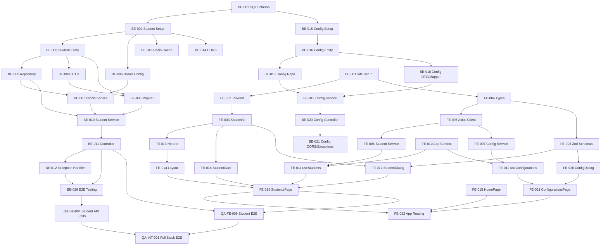

# Task Dependencies and Critical Path - School Management System

**Version:** 1.0
**Date:** 2026-01-22
**Purpose:** Dependency mapping and execution sequencing

---

## Execution Strategy

**Model:** Waterfall / Single-Pass
**Parallelization:** Backend and Frontend can run in parallel after database setup
**QA:** Executes after respective dev phases complete

---

## Critical Path Analysis

### Critical Path 1: Backend Implementation
```
BE-001 → BE-002 → BE-003 → BE-005 → BE-006 → BE-007 → BE-010 → BE-011 → BE-029
```

**Duration:** ~5-7 days
**Bottleneck:** BE-007 (Drools Validation Service) - complex business rules

### Critical Path 2: Frontend Implementation
```
FE-001 → FE-002 → FE-003 → FE-004 → FE-005 → FE-006 → FE-008 → FE-011 → FE-017 → FE-019 → FE-024
```

**Duration:** ~4-6 days
**Bottleneck:** FE-017 (StudentDialog) - complex form with validation

### Critical Path 3: QA Validation
```
QA-BE-002 → QA-BE-003 → QA-BE-004 → QA-FE-009 → QA-INT-001
```

**Duration:** ~5-7 days
**Bottleneck:** QA-INT-001 (Full stack integration testing)

---

## Dependency Matrix

### Phase 1: Database Setup (Day 1)

| Task ID | Task Name | Dependencies | Can Start | Blocking |
|---------|-----------|--------------|-----------|----------|
| BE-001 | Generate SQL Schema | None | Day 1 | BE-002, BE-015 |

**Parallel Execution:** None (single task)

---

### Phase 2: Backend - Student Service (Day 1-4)

| Task ID | Task Name | Dependencies | Can Start | Blocking |
|---------|-----------|--------------|-----------|----------|
| BE-002 | Student Service Setup | BE-001 | Day 1 | BE-003, BE-006, BE-013, BE-014 |
| BE-003 | Student Entity | BE-002 | Day 2 | BE-004, BE-005, BE-008, BE-009 |
| BE-004 | Enrollment Entity | BE-003 | Day 2 | None (optional) |
| BE-005 | Student Repository | BE-003 | Day 2 | BE-007, BE-010 |
| BE-006 | Drools Configuration | BE-002 | Day 2 | BE-007 |
| BE-007 | Drools Validation Service | BE-005, BE-006 | Day 3 | BE-010 |
| BE-008 | Student DTOs | BE-003 | Day 2 | BE-009 |
| BE-009 | MapStruct Mapper | BE-003, BE-008 | Day 3 | BE-010 |
| BE-010 | Student Service | BE-005, BE-007, BE-009 | Day 3 | BE-011, BE-022 |
| BE-011 | Student Controller | BE-010 | Day 4 | BE-012, BE-024 |
| BE-012 | Global Exception Handler | BE-010, BE-011 | Day 4 | BE-029 |
| BE-013 | Redis Cache Config | BE-002 | Day 2 | QA-BE-008 |
| BE-014 | CORS Configuration | BE-002 | Day 2 | None |

**Parallel Execution Opportunities:**
- Day 2: BE-003, BE-006, BE-013, BE-014 (all depend on BE-002)
- Day 2: BE-004, BE-005, BE-008 (all depend on BE-003)
- Day 3: BE-007, BE-009 (parallel after their respective dependencies)

---

### Phase 3: Backend - Configuration Service (Day 2-4)

| Task ID | Task Name | Dependencies | Can Start | Blocking |
|---------|-----------|--------------|-----------|----------|
| BE-015 | Config Service Setup | BE-001 | Day 2 | BE-016 |
| BE-016 | Configuration Entity | BE-015 | Day 2 | BE-017, BE-018 |
| BE-017 | Configuration Repository | BE-016 | Day 3 | BE-019 |
| BE-018 | Configuration DTOs & Mapper | BE-016 | Day 3 | BE-019 |
| BE-019 | Configuration Service | BE-017, BE-018 | Day 3 | BE-020 |
| BE-020 | Configuration Controller | BE-019 | Day 4 | BE-021, BE-025 |
| BE-021 | Config CORS & Exceptions | BE-020 | Day 4 | BE-029 |

**Parallel Execution Opportunities:**
- Day 2: BE-015 can run in parallel with BE-003 (different services)
- Day 3: BE-017, BE-018 (parallel after BE-016)

---

### Phase 4: Backend - Testing & DevOps (Day 4-5)

| Task ID | Task Name | Dependencies | Can Start | Blocking |
|---------|-----------|--------------|-----------|----------|
| BE-022 | Student Service Unit Tests | BE-010 | Day 4 | QA-BE-003 |
| BE-023 | Drools Rules Unit Tests | BE-006 | Day 3 | QA-BE-002 |
| BE-024 | Student API Integration Tests | BE-011 | Day 4 | QA-BE-004 |
| BE-025 | Configuration Service Tests | BE-020 | Day 4 | QA-BE-005 |
| BE-026 | Docker Compose Setup | None | Day 1 | BE-029 |
| BE-027 | API Documentation Setup | BE-002, BE-015 | Day 2 | None |
| BE-028 | Actuator Metrics | BE-010 | Day 4 | QA-BE-009 |
| BE-029 | E2E Manual Testing | All BE tasks | Day 5 | QA Phase |
| BE-030 | DB Isolation Verification | BE-002, BE-015 | Day 4 | QA-BE-006 |

**Parallel Execution Opportunities:**
- Day 4: BE-022, BE-024, BE-025, BE-028 (all independent)
- Day 1: BE-026 can start immediately

---

### Phase 5: Frontend - Foundation (Day 1-2)

| Task ID | Task Name | Dependencies | Can Start | Blocking |
|---------|-----------|--------------|-----------|----------|
| FE-001 | Vite Project Setup | None | Day 1 | All FE tasks |
| FE-002 | Tailwind Configuration | FE-001 | Day 1 | FE-003 |
| FE-003 | Shadcn/ui Installation | FE-002 | Day 1 | FE-013+ |
| FE-004 | TypeScript Types | FE-001 | Day 1 | FE-005, FE-006 |
| FE-005 | Axios API Client | FE-004 | Day 2 | FE-006, FE-007 |
| FE-006 | Student Service | FE-005 | Day 2 | FE-011, QA-FE-003 |
| FE-007 | Configuration Service | FE-005 | Day 2 | FE-012 |
| FE-008 | Zod Validation Schemas | FE-004 | Day 2 | FE-017, FE-020 |
| FE-009 | Utility Functions | FE-001 | Day 1 | FE-018 |
| FE-010 | App Context | FE-003 | Day 2 | FE-011, FE-012 |

**Parallel Execution Opportunities:**
- Day 1: FE-002, FE-004, FE-009 (all depend on FE-001)
- Day 2: FE-006, FE-007, FE-008 (different modules)

---

### Phase 6: Frontend - Components (Day 3-5)

| Task ID | Task Name | Dependencies | Can Start | Blocking |
|---------|-----------|--------------|-----------|----------|
| FE-011 | useStudents Hook | FE-006, FE-010 | Day 3 | FE-019 |
| FE-012 | useConfigurations Hook | FE-007, FE-010 | Day 3 | FE-021 |
| FE-013 | Header Component | FE-003 | Day 2 | FE-014 |
| FE-014 | Layout Wrapper | FE-013 | Day 2 | FE-015, FE-019, FE-021 |
| FE-015 | HomePage | FE-006, FE-014 | Day 3 | QA-FE-004 |
| FE-016 | StudentCard | FE-003, FE-004 | Day 3 | FE-019 |
| FE-017 | StudentDialog | FE-003, FE-008 | Day 3 | FE-019, QA-FE-002 |
| FE-018 | ViewStudentDialog | FE-003, FE-004, FE-009 | Day 3 | FE-019 |
| FE-019 | StudentsPage | FE-011, FE-016, FE-017, FE-018 | Day 4 | QA-FE-005, QA-FE-009 |
| FE-020 | ConfigurationDialog | FE-003, FE-008 | Day 3 | FE-021 |
| FE-021 | ConfigurationsPage | FE-012, FE-020 | Day 4 | QA-FE-007, QA-FE-010 |
| FE-022 | App Routing | FE-010, FE-014, FE-015, FE-019, FE-021 | Day 5 | FE-025 |

**Parallel Execution Opportunities:**
- Day 2: FE-013, FE-014 (layout layer)
- Day 3: FE-015, FE-016, FE-017, FE-018, FE-020 (all independent components)
- Day 4: FE-019, FE-021 (different pages)

---

### Phase 7: Frontend - Testing & Optimization (Day 5-6)

| Task ID | Task Name | Dependencies | Can Start | Blocking |
|---------|-----------|--------------|-----------|----------|
| FE-023 | useDebounce Hook | FE-001 | Day 1 | None (optional) |
| FE-024 | Screenshot Validation | All FE component tasks | Day 5 | QA-FE-004 to QA-FE-008 |
| FE-025 | Manual E2E Testing | All FE tasks | Day 6 | QA Phase |
| FE-026 | Build Verification | All FE tasks | Day 6 | None |
| FE-027 | Responsive Testing | All FE component tasks | Day 5 | QA-FE-012 |

**Parallel Execution Opportunities:**
- Day 5: FE-024, FE-027 (different validation types)

---

### Phase 8: QA - Backend Testing (After BE Phase)

| Task ID | Task Name | Dependencies | Can Start | Blocking |
|---------|-----------|--------------|-----------|----------|
| QA-BE-001 | Student Domain Unit Tests | BE-003 | After BE | None |
| QA-BE-002 | Drools Rules Unit Tests | BE-006, BE-023 | After BE | QA-INT-001 |
| QA-BE-003 | Student Service Unit Tests | BE-010, BE-022 | After BE | QA-BE-004 |
| QA-BE-004 | Student API Integration Tests | BE-011, BE-024 | After BE | QA-INT-001 |
| QA-BE-005 | Config API Integration Tests | BE-020, BE-025 | After BE | QA-INT-001 |
| QA-BE-006 | DB Isolation Testing | BE-002, BE-015, BE-030 | After BE | QA-INT-001 |
| QA-BE-007 | Performance Testing | BE-011, BE-020 | After BE | None |
| QA-BE-008 | Cache Validation | BE-013 | After BE | None |
| QA-BE-009 | Actuator Metrics | BE-028 | After BE | None |

**Parallel Execution Opportunities:**
- All QA-BE tasks except QA-BE-003 → QA-BE-004 can run in parallel

---

### Phase 9: QA - Frontend Testing (After FE Phase)

| Task ID | Task Name | Dependencies | Can Start | Blocking |
|---------|-----------|--------------|-----------|----------|
| QA-FE-001 | StudentCard Unit Tests | FE-016 | After FE | None |
| QA-FE-002 | StudentDialog Unit Tests | FE-017 | After FE | None |
| QA-FE-003 | Student Service Integration | FE-006 | After FE | QA-FE-009 |
| QA-FE-004 | HomePage Screenshot Validation | FE-015, FE-024 | After FE | None |
| QA-FE-005 | StudentsPage Screenshot Validation | FE-019, FE-024 | After FE | QA-FE-009 |
| QA-FE-006 | Student Dialogs Screenshot Validation | FE-017, FE-018, FE-024 | After FE | QA-FE-009 |
| QA-FE-007 | ConfigurationsPage Screenshot Validation | FE-021, FE-024 | After FE | QA-FE-010 |
| QA-FE-008 | Config Dialogs Screenshot Validation | FE-020, FE-024 | After FE | QA-FE-010 |
| QA-FE-009 | Student E2E Flow | FE-019, BE-011 | After FE+BE | QA-INT-001 |
| QA-FE-010 | Configuration E2E Flow | FE-021, BE-020 | After FE+BE | QA-INT-001 |
| QA-FE-011 | Form Validation Testing | FE-008, FE-017, FE-020 | After FE | None |
| QA-FE-012 | Responsive Design Testing | FE-015, FE-019, FE-021, FE-027 | After FE | None |
| QA-FE-013 | Cross-Browser Testing | All FE tasks | After FE | None |

**Parallel Execution Opportunities:**
- QA-FE-001, QA-FE-002, QA-FE-004 to QA-FE-008, QA-FE-011 to QA-FE-013 (all independent)

---

### Phase 10: QA - Integration Testing (After All Dev)

| Task ID | Task Name | Dependencies | Can Start | Blocking |
|---------|-----------|--------------|-----------|----------|
| QA-INT-001 | Full Stack E2E Integration | All BE, All FE, QA-BE-004, QA-FE-009 | Final | None |
| QA-INT-002 | API Error Propagation | BE-012, FE-005 | After Dev | QA-INT-001 |
| QA-INT-003 | Full Stack Performance | All tasks | Final | None |

**Parallel Execution Opportunities:**
- QA-INT-002, QA-INT-003 can run in parallel

---

## Parallel Execution Summary

### Maximum Parallelization

**Backend Team:**
- Day 2: 4 tasks (BE-003, BE-006, BE-013, BE-014, BE-015)
- Day 3: 4 tasks (BE-007, BE-009, BE-017, BE-018)
- Day 4: 6 tasks (BE-022, BE-024, BE-025, BE-028, BE-030, BE-020)

**Frontend Team:**
- Day 2: 5 tasks (FE-006, FE-007, FE-008, FE-013, FE-014)
- Day 3: 5 tasks (FE-015, FE-016, FE-017, FE-018, FE-020)
- Day 4: 2 tasks (FE-019, FE-021)
- Day 5: 2 tasks (FE-024, FE-027)

**QA Team:**
- Backend QA: 7 tasks in parallel (QA-BE-001, QA-BE-002, QA-BE-005 to QA-BE-009)
- Frontend QA: 10 tasks in parallel (QA-FE-001, QA-FE-002, QA-FE-004 to QA-FE-008, QA-FE-011 to QA-FE-013)

---

## Blocking Dependencies

### High-Risk Blockers

1. **BE-007 (Drools Validation Service)**
   - Blocks: BE-010
   - Risk: Complex Drools integration
   - Mitigation: Start BE-006 early, allocate extra time

2. **BE-010 (Student Service)**
   - Blocks: BE-011, BE-022, BE-028, BE-029
   - Risk: Core business logic
   - Mitigation: Thorough code review, unit tests

3. **FE-017 (StudentDialog)**
   - Blocks: FE-019
   - Risk: Complex form with validation
   - Mitigation: Reuse Shadcn/ui patterns, test early

4. **FE-019 (StudentsPage)**
   - Blocks: QA-FE-005, QA-FE-009, FE-022
   - Risk: Integrates multiple components
   - Mitigation: Component unit tests first

5. **QA-INT-001 (Full Stack Integration)**
   - Blocks: Production deployment
   - Risk: Complex cross-service testing
   - Mitigation: Automated test scripts

---

## Dependency Graph (Mermaid)



---

## Recommended Execution Sequence

### Week 1 (Backend Focus)

**Day 1:**
- BE-001 (SQL Schema)
- BE-002 (Student Service Setup)
- BE-026 (Docker Compose)
- FE-001 (Vite Setup)
- FE-002 (Tailwind)

**Day 2:**
- BE-003, BE-006, BE-013, BE-014 (parallel)
- BE-015 (Config Service Setup)
- FE-003, FE-004, FE-005 (parallel)

**Day 3:**
- BE-005, BE-008 (parallel)
- BE-007, BE-009 (parallel)
- BE-016, BE-017, BE-018 (parallel)
- FE-006, FE-007, FE-008 (parallel)

**Day 4:**
- BE-010 (Student Service)
- BE-019 (Config Service)
- FE-010, FE-013, FE-014 (parallel)

**Day 5:**
- BE-011 (Student Controller)
- BE-020 (Config Controller)
- BE-012, BE-021 (parallel)
- FE-011, FE-012 (parallel)

**Weekend:**
- BE-022, BE-023, BE-024, BE-025 (tests)
- BE-029 (E2E Testing)

### Week 2 (Frontend Focus + QA)

**Day 6:**
- FE-015, FE-016, FE-017, FE-018, FE-020 (parallel)

**Day 7:**
- FE-019, FE-021 (parallel)

**Day 8:**
- FE-022 (Routing)
- FE-024 (Screenshot Validation)
- FE-025 (Manual E2E)

**Day 9:**
- QA-BE-001 to QA-BE-009 (Backend QA, parallel)

**Day 10:**
- QA-FE-001 to QA-FE-013 (Frontend QA, parallel)

**Day 11:**
- QA-INT-001, QA-INT-002, QA-INT-003 (Integration QA)

**Day 12:**
- Bug fixes and regression testing

---

## Risk Mitigation

### Dependency Risks

1. **BE-007 Drools Service Complexity**
   - **Risk:** Complex business rule integration
   - **Impact:** Delays BE-010, BE-011
   - **Mitigation:** Start BE-006 early, allocate 1.5x time estimate

2. **FE-019 Component Integration**
   - **Risk:** Multiple components may not integrate smoothly
   - **Impact:** Delays QA-FE-009
   - **Mitigation:** Unit test components first (QA-FE-001, QA-FE-002)

3. **QA-INT-001 Full Stack Issues**
   - **Risk:** Cross-service bugs
   - **Impact:** Production deployment delay
   - **Mitigation:** Early integration smoke tests after BE-029 and FE-025

---

## Resource Allocation

### Backend Developer

**Full-Time Tasks:** BE-001 to BE-030
**Estimated Hours:** 50-70 hours (5-7 days)
**Peak Load:** Day 4 (6 tasks available)

### Frontend Developer

**Full-Time Tasks:** FE-001 to FE-027
**Estimated Hours:** 40-60 hours (4-6 days)
**Peak Load:** Day 3 (5 tasks available)

### QA Engineer

**Full-Time Tasks:** QA-BE-001 to QA-INT-003
**Estimated Hours:** 50-70 hours (5-7 days)
**Peak Load:** Day 9-10 (22 tasks available)

---

## Success Metrics

### Velocity Tracking

- **Backend:** 30 tasks / 7 days = 4.3 tasks/day average
- **Frontend:** 27 tasks / 6 days = 4.5 tasks/day average
- **QA:** 28 tasks / 3 days = 9.3 tasks/day average (highly parallelized)

### Completion Criteria

- [ ] All critical path tasks completed
- [ ] Zero high-priority blockers
- [ ] All tests passing (unit, integration, E2E)
- [ ] Screenshot validation 100% match
- [ ] Performance targets met (p95 < 200ms)
- [ ] Database isolation verified
- [ ] All Global Directives (D-001 to D-010) enforced

---

**Document Status:** READY FOR EXECUTION
**Owner:** Project Manager / SDLC Planner Agent
