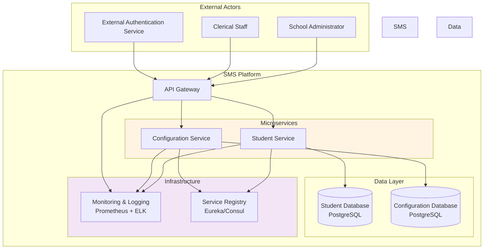
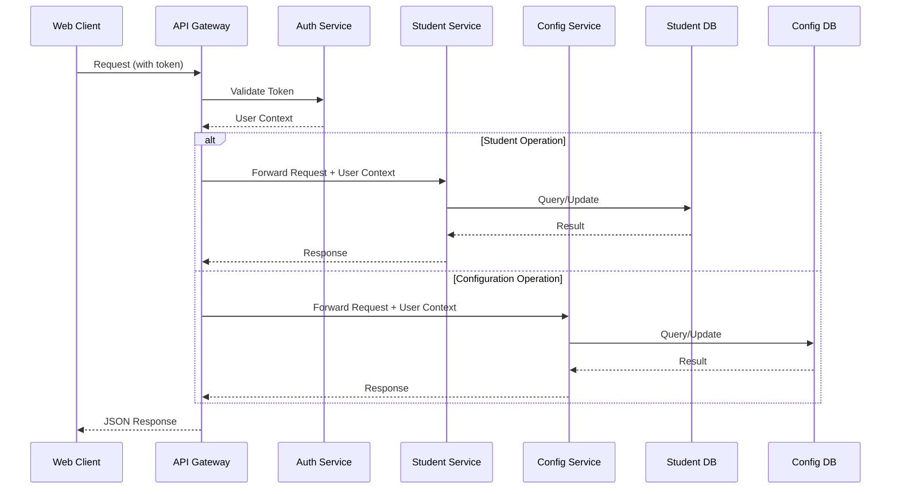
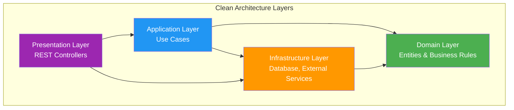
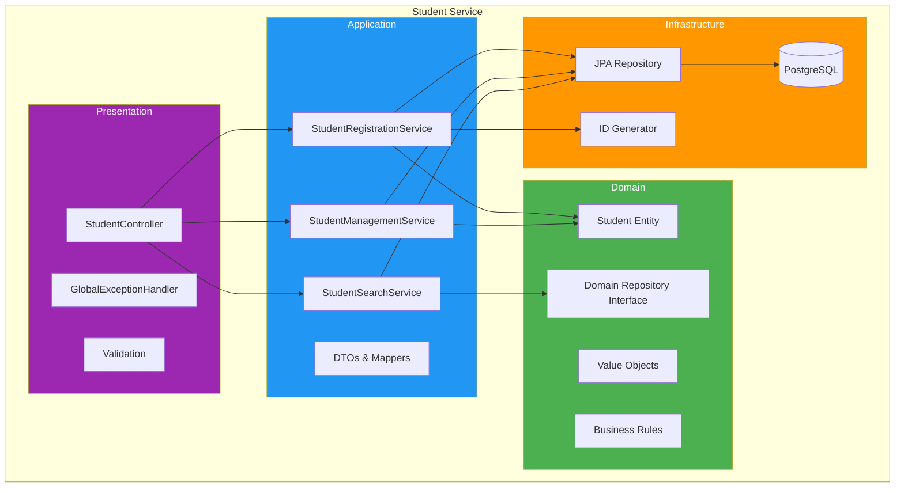
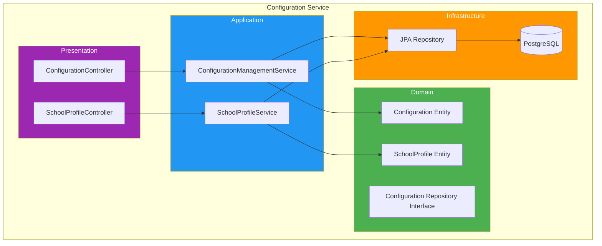

# System Architecture

## Table of Contents
1. [High-Level Architecture](#high-level-architecture)
2. [Component Overview](#component-overview)
3. [Architectural Patterns](#architectural-patterns)
4. [Service Boundaries](#service-boundaries)
5. [Communication Patterns](#communication-patterns)
6. [Layer Architecture](#layer-architecture)
7. [Architectural Decision Records](#architectural-decision-records)

## High-Level Architecture

### System Context Diagram



### Component Interaction Overview



## Component Overview

### 1. API Gateway

**Responsibility**: Single entry point for all client requests

**Key Functions**:
- Request routing to appropriate microservices
- Authentication validation (delegates to external auth service)
- Request/response transformation
- Rate limiting and throttling
- CORS handling
- API versioning management
- Centralized logging

**Technology**: Spring Cloud Gateway or Kong

**Endpoints**:
- `/api/v1/students/*` -> Student Service
- `/api/v1/configurations/*` -> Configuration Service

### 2. Student Service

**Responsibility**: Complete student lifecycle management

**Key Functions**:
- Student registration with validation
- Student profile management (CRUD)
- Student search and filtering
- Status management (Active/Inactive)
- Business rule enforcement (age validation, unique mobile)
- Student ID generation

**Port**: 8081
**Database**: Student Database (PostgreSQL)

### 3. Configuration Service

**Responsibility**: School configuration and settings management

**Key Functions**:
- School profile management
- Configuration settings CRUD
- Category-based setting organization
- Setting retrieval by category
- Configuration versioning

**Port**: 8082
**Database**: Configuration Database (PostgreSQL)

### 4. Service Registry

**Responsibility**: Service discovery and health monitoring

**Key Functions**:
- Service registration
- Health checking
- Service instance discovery
- Load balancing support

**Technology**: Netflix Eureka or Consul

### 5. Monitoring & Logging

**Responsibility**: Observability and operational insights

**Components**:
- **Prometheus**: Metrics collection
- **Grafana**: Metrics visualization
- **ELK Stack**: Log aggregation and analysis
  - Elasticsearch: Log storage and search
  - Logstash: Log processing
  - Kibana: Log visualization

## Architectural Patterns

### 1. Microservices Pattern

**Implementation**:
- Each service is independently deployable
- Service-specific database (Database per Service pattern)
- Bounded contexts aligned with domain boundaries
- Independent scaling per service

**Benefits**:
- Service autonomy
- Technology diversity (if needed in future)
- Fault isolation
- Independent deployment cycles

**Challenges**:
- Distributed system complexity
- Data consistency across services
- Testing complexity
- Operational overhead

### 2. Clean Architecture (per Service)

Each microservice follows the Clean Architecture pattern with four layers:



**Layer Responsibilities**:

1. **Domain Layer** (Core):
   - Entities (Student, ConfigurationSetting)
   - Value Objects
   - Domain Services
   - Business Rules
   - No dependencies on other layers

2. **Application Layer**:
   - Use Cases (RegisterStudentUseCase, UpdateConfigurationUseCase)
   - Application Services
   - DTOs (Data Transfer Objects)
   - Input/Output Ports (Interfaces)
   - Orchestrates domain objects

3. **Infrastructure Layer**:
   - Database implementation (JPA repositories)
   - External service clients
   - Framework configurations
   - Implements interfaces defined in Application layer

4. **Presentation Layer**:
   - REST Controllers
   - Request/Response models
   - API documentation
   - Input validation
   - Exception handling

### 3. Repository Pattern

**Purpose**: Abstracts data access logic from business logic

**Implementation**:
```java
// Domain Layer - Interface
public interface StudentRepository {
    Student save(Student student);
    Optional<Student> findById(String studentId);
    List<Student> findAll();
    boolean existsByMobile(String mobile);
}

// Infrastructure Layer - Implementation
@Repository
public class JpaStudentRepository implements StudentRepository {
    private final StudentJpaRepository jpaRepository;

    // Implementation using Spring Data JPA
}
```

**Benefits**:
- Testability (easy mocking)
- Separation of concerns
- Flexibility to change data source
- Clear abstraction boundary

### 4. Service Layer Pattern

**Purpose**: Encapsulates business logic and use cases

**Implementation**:
```java
// Application Layer
@Service
@Transactional
public class StudentRegistrationService {
    private final StudentRepository studentRepository;
    private final StudentIdGenerator idGenerator;
    private final AgeValidator ageValidator;

    public StudentDTO registerStudent(RegisterStudentCommand command) {
        // Validate business rules
        ageValidator.validate(command.getDateOfBirth());

        // Check uniqueness
        if (studentRepository.existsByMobile(command.getMobile())) {
            throw new DuplicateMobileException();
        }

        // Create domain entity
        Student student = Student.create(
            idGenerator.generate(),
            command.getFirstName(),
            command.getLastName(),
            // ... other fields
        );

        // Save and return
        Student saved = studentRepository.save(student);
        return StudentMapper.toDTO(saved);
    }
}
```

### 5. API Gateway Pattern

**Purpose**: Single entry point for all client requests

**Responsibilities**:
- Request routing
- Authentication enforcement
- Rate limiting
- Response aggregation (if needed)
- Protocol translation

**Configuration Example** (Spring Cloud Gateway):
```yaml
spring:
  cloud:
    gateway:
      routes:
        - id: student-service
          uri: lb://STUDENT-SERVICE
          predicates:
            - Path=/api/v1/students/**
          filters:
            - RewritePath=/api/v1/students/(?<segment>.*), /${segment}
            - AddRequestHeader=X-Request-Source, API-Gateway

        - id: configuration-service
          uri: lb://CONFIGURATION-SERVICE
          predicates:
            - Path=/api/v1/configurations/**
          filters:
            - RewritePath=/api/v1/configurations/(?<segment>.*), /${segment}
```

## Service Boundaries

### Student Service Boundary

**Owns**:
- Student domain entities
- Student database
- Student business rules
- Student ID generation logic

**Exposes**:
- Student CRUD APIs
- Student search APIs
- Student status management APIs

**Does NOT**:
- Access configuration database directly
- Handle authentication
- Manage school-level settings

### Configuration Service Boundary

**Owns**:
- Configuration domain entities
- Configuration database
- Configuration business rules
- Setting validation logic

**Exposes**:
- Configuration CRUD APIs
- Category-based retrieval APIs
- School profile APIs

**Does NOT**:
- Access student database directly
- Handle authentication
- Manage student data

### Bounded Context Map

```mermaid
graph LR
    subgraph "Student Context"
        StudentEntity[Student Entity]
        StudentRules[Age & Mobile Validation]
    end

    subgraph "Configuration Context"
        ConfigEntity[Configuration Entity]
        ConfigRules[Setting Validation]
    end

    subgraph "Shared Kernel"
        CommonTypes[Common Types<br/>Address, Email]
        CommonExceptions[Common Exceptions]
    end

    StudentEntity -.-> CommonTypes
    ConfigEntity -.-> CommonTypes
    StudentRules -.-> CommonExceptions
    ConfigRules -.-> CommonExceptions

    style "Student Context" fill:#e3f2fd
    style "Configuration Context" fill:#f3e5f5
    style "Shared Kernel" fill:#fff9c4
```

## Communication Patterns

### 1. Synchronous Communication (REST)

**Used For**: All client-service and service-service communication in Phase 1

**Protocol**: HTTP/REST with JSON payloads

**Example Flow**:
```
Client -> API Gateway -> Student Service -> Database
   |          |               |                |
   |          |               |                |
   v          v               v                v
Request   Route &         Execute          Query
         Validate        Business          Data
                          Logic
```

**Error Handling**:
- Use RFC 7807 Problem Details format
- Proper HTTP status codes
- Structured error responses

### 2. Database per Service

**Implementation**:
- Each service has its own PostgreSQL database
- No shared tables between services
- No cross-database joins or transactions

**Data Consistency**:
- Single service transactions ensure consistency
- No distributed transactions in Phase 1
- Future: Event-driven eventual consistency if needed

### 3. API Versioning

**Strategy**: URI versioning

**Format**: `/api/v{version}/{resource}`

**Example**:
- `/api/v1/students`
- `/api/v1/configurations`

**Benefits**:
- Clear version identification
- Easy routing at gateway level
- Simple client implementation

## Layer Architecture

### Student Service Layers



### Package Structure (Student Service)

```
com.school.sms.student
├── presentation
│   ├── controller
│   │   ├── StudentController.java
│   │   └── StudentStatusController.java
│   ├── dto
│   │   ├── request
│   │   │   ├── CreateStudentRequest.java
│   │   │   └── UpdateStudentRequest.java
│   │   └── response
│   │       └── StudentResponse.java
│   └── exception
│       └── GlobalExceptionHandler.java
│
├── application
│   ├── service
│   │   ├── StudentRegistrationService.java
│   │   ├── StudentManagementService.java
│   │   └── StudentSearchService.java
│   ├── dto
│   │   └── StudentDTO.java
│   ├── mapper
│   │   └── StudentMapper.java
│   └── port
│       ├── input
│       │   └── RegisterStudentUseCase.java
│       └── output
│           └── StudentRepositoryPort.java
│
├── domain
│   ├── entity
│   │   └── Student.java
│   ├── valueobject
│   │   ├── StudentId.java
│   │   ├── Mobile.java
│   │   └── Address.java
│   ├── exception
│   │   ├── InvalidAgeException.java
│   │   └── DuplicateMobileException.java
│   └── repository
│       └── StudentRepository.java (interface)
│
└── infrastructure
    ├── persistence
    │   ├── entity
    │   │   └── StudentJpaEntity.java
    │   ├── repository
    │   │   └── StudentJpaRepository.java
    │   └── adapter
    │       └── StudentRepositoryAdapter.java
    ├── config
    │   ├── DatabaseConfig.java
    │   └── JpaConfig.java
    └── util
        └── StudentIdGenerator.java
```

### Configuration Service Layers



## Architectural Decision Records

### ADR-001: Microservices Architecture

**Status**: Accepted

**Context**:
- Phase 1 has two distinct domains (Student, Configuration)
- Future phases will add more modules (Attendance, Fees, etc.)
- Need independent scaling and deployment

**Decision**: Use microservices architecture with Student and Configuration as separate services

**Consequences**:
- Positive: Independent deployment, clear boundaries, future scalability
- Negative: Increased complexity, need for service discovery, monitoring overhead

### ADR-002: PostgreSQL for All Services

**Status**: Accepted

**Context**:
- Need ACID compliance for student data
- Configuration data could use document store or RDBMS
- Prefer operational simplicity

**Decision**: Use PostgreSQL for both services

**Consequences**:
- Positive: Single database technology, strong consistency, JSON support
- Negative: Less flexible for configuration service (could use NoSQL)

### ADR-003: Synchronous REST Communication

**Status**: Accepted

**Context**:
- Simple CRUD operations in Phase 1
- No complex workflows requiring async processing
- Team familiarity with REST

**Decision**: Use synchronous REST/HTTP for all communication

**Consequences**:
- Positive: Simple to implement, easy debugging, well understood
- Negative: Tight coupling, no built-in resilience, can be evolved to async later

### ADR-004: External Authentication

**Status**: Accepted

**Context**:
- Phase 1 focuses on core domain logic
- Authentication is cross-cutting concern
- API Gateway is natural auth enforcement point

**Decision**: Delegate authentication to external service, assume pre-authenticated requests

**Consequences**:
- Positive: Simplified service logic, clear separation of concerns
- Negative: Must ensure secure network, requires coordination with auth service

### ADR-005: API Gateway Pattern

**Status**: Accepted

**Context**:
- Multiple microservices need single entry point
- Cross-cutting concerns (auth, logging, rate limiting)
- Client simplification

**Decision**: Implement API Gateway as facade to all services

**Consequences**:
- Positive: Single entry point, centralized cross-cutting concerns
- Negative: Single point of failure, potential bottleneck, added latency

### ADR-006: Clean Architecture per Service

**Status**: Accepted

**Context**:
- Need maintainable, testable code
- Want framework independence at core
- Clear separation of concerns

**Decision**: Implement Clean Architecture with 4 layers per service

**Consequences**:
- Positive: Highly testable, framework agnostic core, clear dependencies
- Negative: More boilerplate, learning curve, more interfaces

## Non-Functional Characteristics

### Scalability
- **Vertical**: Each service can be scaled independently
- **Horizontal**: Stateless services enable multiple instances
- **Database**: Connection pooling, read replicas for future

### Performance
- **Target Response Time**: < 500ms for 95th percentile
- **Throughput**: 100 requests/second per service
- **Database Indexing**: All foreign keys and search columns

### Reliability
- **Availability Target**: 99.5% uptime
- **Fault Tolerance**: Service-level circuit breakers
- **Data Backup**: Daily automated backups with 30-day retention

### Maintainability
- **Code Standards**: Checkstyle, PMD, SonarQube
- **Documentation**: API docs (OpenAPI), README per service
- **Monitoring**: Health checks, metrics, distributed tracing

### Security
- **Data Validation**: Input validation at API boundary
- **SQL Injection Prevention**: Parameterized queries (JPA)
- **XSS Prevention**: Output encoding, Content-Security-Policy headers
- **HTTPS**: TLS 1.3 for all external communication

## Summary

The School Management System architecture is designed as a microservices-based platform with clear service boundaries, clean architecture within each service, and standard patterns for communication and data management. The architecture prioritizes:

1. **Modularity**: Clear service boundaries enable independent development
2. **Maintainability**: Clean Architecture ensures testable, evolvable code
3. **Scalability**: Microservices enable independent scaling
4. **Simplicity**: Standard patterns and minimal complexity for Phase 1
5. **Evolvability**: Foundation for future phases and features

The next document ([Microservices Design](02-MICROSERVICES-DESIGN.md)) provides detailed specifications for each microservice.

---

**Version**: 1.0
**Last Updated**: 2025-11-17
**Status**: Draft for Review
