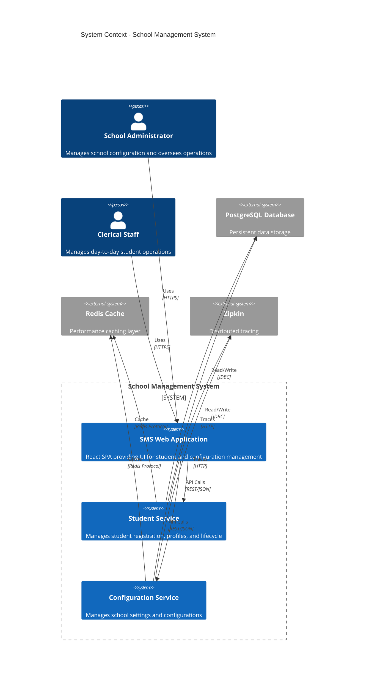
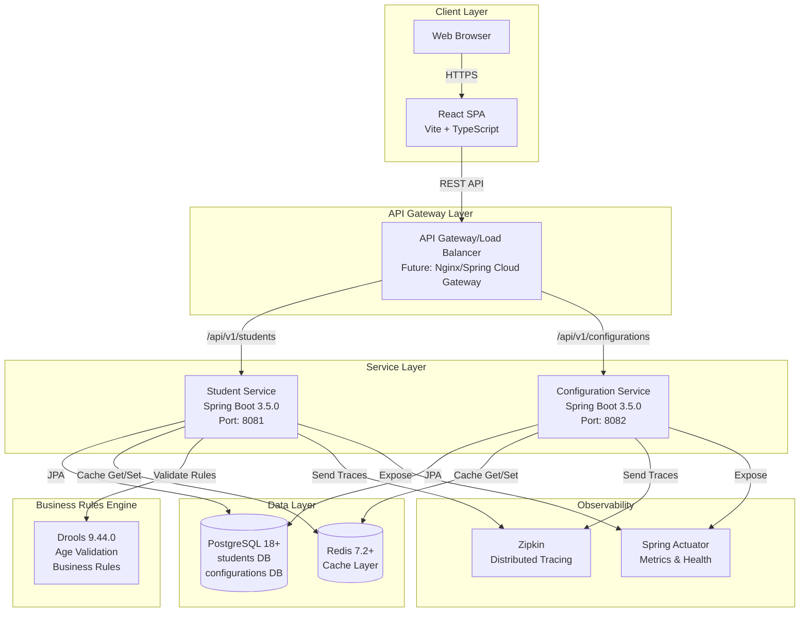
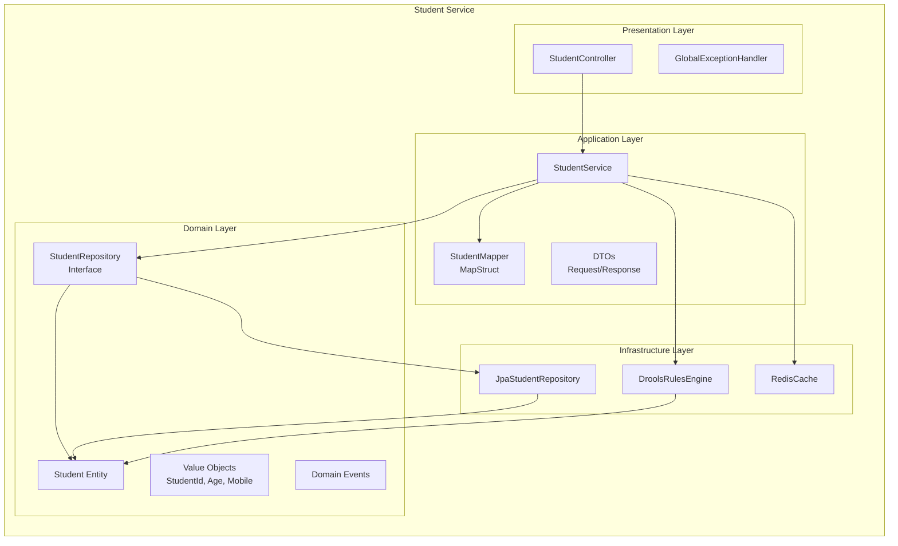
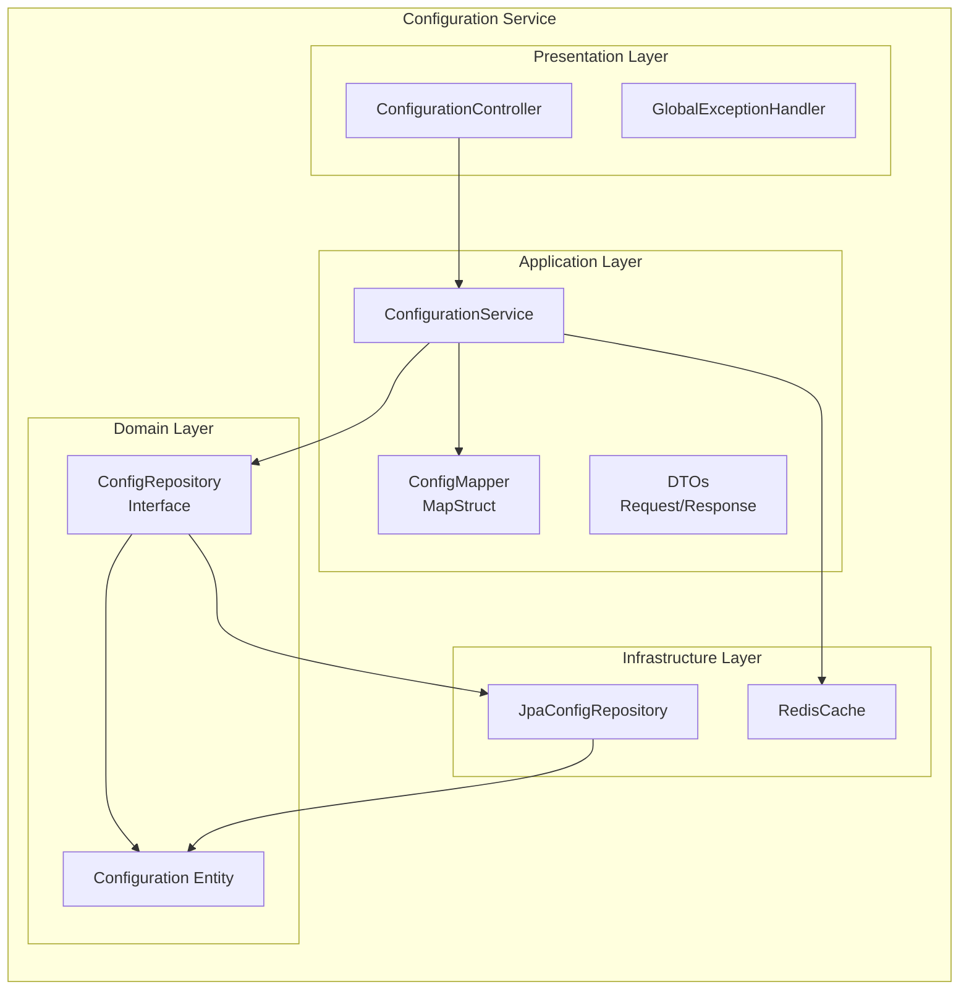
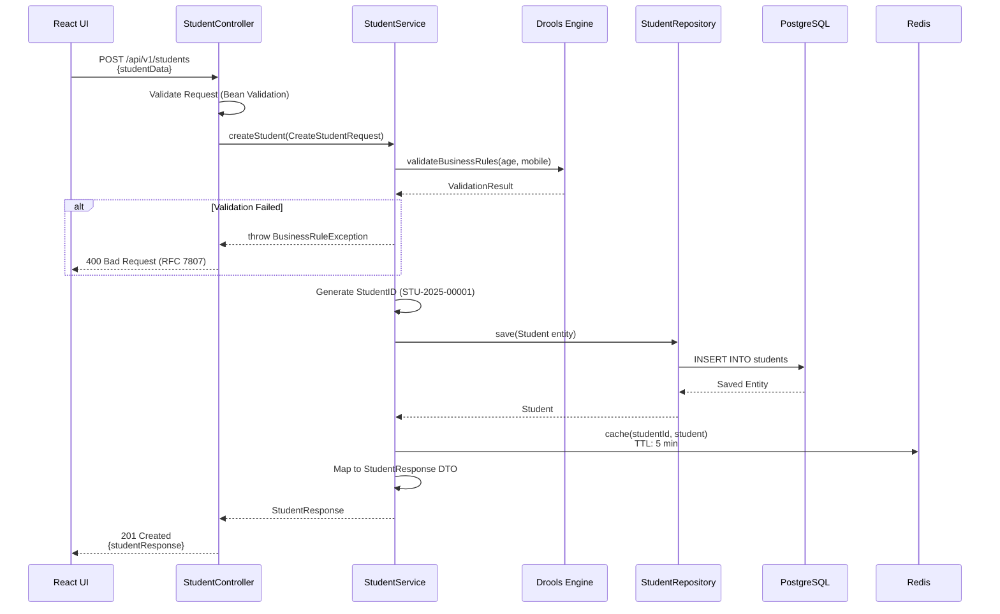
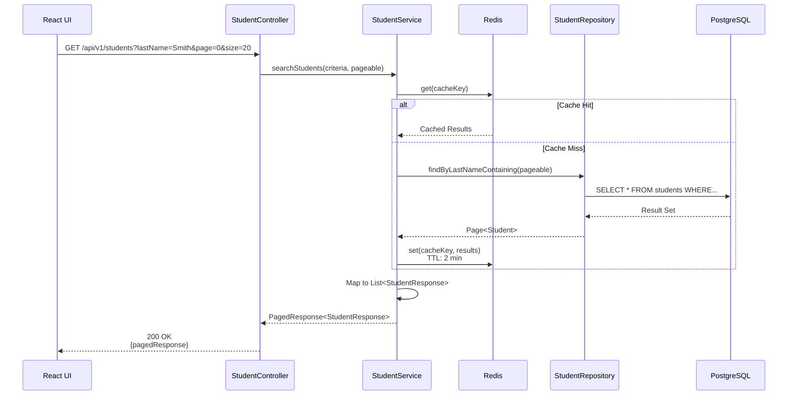
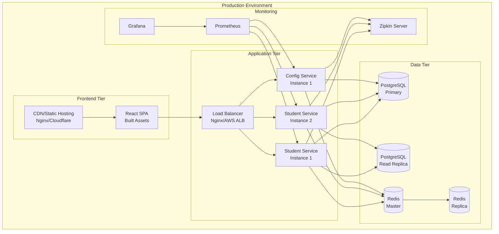
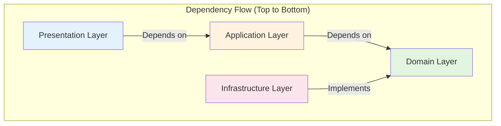

# System Architecture - School Management System

## 1. Overview

The School Management System (SMS) is designed using Domain-Driven Design (DDD) principles with a microservices-style architecture. The system is composed of two core services: Student Service and Configuration Service, each owning its domain and data independently.

## 2. Architectural Style

### 2.1 Domain-Driven Design (DDD)

The system follows DDD principles to align the software model with the business domain:

- **Bounded Contexts**: Student Management and School Configuration are separate bounded contexts
- **Ubiquitous Language**: Consistent terminology between business stakeholders and code
- **Rich Domain Models**: Business logic encapsulated within domain entities and value objects
- **Domain Events**: Key business events (StudentRegisteredEvent, ConfigurationUpdatedEvent)

### 2.2 Layered Architecture

Each service follows a strict layered architecture pattern:

```
┌─────────────────────────────────────┐
│     Presentation Layer              │  (REST Controllers, Exception Handlers)
├─────────────────────────────────────┤
│     Application Layer               │  (Services, DTOs, Orchestration)
├─────────────────────────────────────┤
│     Domain Layer                    │  (Entities, Value Objects, Repository Interfaces)
├─────────────────────────────────────┤
│     Infrastructure Layer            │  (JPA, Drools, Redis, External Systems)
└─────────────────────────────────────┘
```

**Layer Responsibilities:**

- **Presentation**: HTTP request/response handling, input validation, REST API exposure
- **Application**: Use case orchestration, DTO transformation, transaction boundaries
- **Domain**: Core business logic, invariants, domain rules, repository contracts
- **Infrastructure**: Technical implementations, database access, caching, integrations

## 3. System Context Diagram



## 4. Container Diagram



## 5. Component Architecture

### 5.1 Student Service Components



### 5.2 Configuration Service Components



## 6. Data Flow Architecture

### 6.1 Student Registration Flow



### 6.2 Student Search Flow



## 7. Deployment Architecture



## 8. Technology Stack Justification

### 8.1 Backend Technologies

| Technology | Version | Justification |
|------------|---------|---------------|
| **Java** | 21 | Latest LTS version with Virtual Threads, Pattern Matching, Records for improved performance and developer productivity |
| **Spring Boot** | 3.5.0 | Industry-standard framework with excellent DDD support, mature ecosystem, production-ready features |
| **Spring Data JPA** | 3.x | Abstraction over JPA/Hibernate, reduces boilerplate, supports repository pattern |
| **PostgreSQL** | 18+ | ACID compliance, robust JSONB support, excellent performance, proven enterprise reliability |
| **Drools** | 9.44.0.Final | Business Rules Engine for externalizing complex validation logic, enables non-technical rule modifications |
| **Redis** | 7.2+ | High-performance in-memory cache, reduces database load, improves response times |
| **MapStruct** | 1.5.5.Final | Compile-time DTO mapping, type-safe, eliminates manual mapping boilerplate |
| **Lombok** | 1.18.30 | Reduces boilerplate code (getters, setters, builders), improves code readability |
| **Micrometer** | - | Vendor-neutral metrics facade, supports Prometheus, enables observability |
| **Zipkin** | - | Distributed tracing for microservices, helps diagnose latency issues |

### 8.2 Frontend Technologies

| Technology | Version | Justification |
|------------|---------|---------------|
| **React** | 18.2.0 | Component-based architecture, large ecosystem, excellent community support |
| **TypeScript** | Latest | Type safety, improved IDE support, catches errors at compile-time |
| **Vite** | 7.1.12 | Fast build tool, HMR, optimized production builds, modern ES modules |
| **Tailwind CSS** | 3.4.1 | Utility-first CSS, rapid UI development, small production bundle |
| **React Router** | 6.20.1 | Standard routing library, supports nested routes, code splitting |
| **React Query** | 4.x | Server state management, automatic caching, background refetching |
| **React Hook Form** | 7.x | Performant form library, minimal re-renders, excellent validation support |
| **Zod** | 3.x | TypeScript-first schema validation, runtime type checking |
| **Axios** | 1.6.5 | HTTP client with interceptors, request/response transformation, timeout support |

## 9. Design Patterns & Principles

### 9.1 SOLID Principles Application

**Single Responsibility Principle (SRP)**
- Each layer has a single reason to change
- Controllers handle HTTP concerns only
- Services contain business orchestration only
- Repositories handle data persistence only

**Open/Closed Principle (OCP)**
- Strategy pattern for business rules (Drools)
- Interface-based repository design
- Extensible DTOs via inheritance

**Liskov Substitution Principle (LSP)**
- Repository implementations interchangeable
- Service implementations can be swapped
- Mock implementations for testing

**Interface Segregation Principle (ISP)**
- Fine-grained repository interfaces (StudentRepository, ConfigRepository)
- Specific service interfaces per bounded context
- Focused DTO contracts

**Dependency Inversion Principle (DIP)**
- Domain layer defines repository interfaces
- Infrastructure layer implements interfaces
- Application layer depends on abstractions

### 9.2 Key Design Patterns

**Repository Pattern**
- Abstracts data access logic
- Domain layer defines contracts
- Infrastructure layer provides implementations

**Data Transfer Object (DTO) Pattern**
- Decouples API contracts from domain models
- Prevents over-fetching/under-fetching
- Enables API versioning

**Mapper Pattern**
- MapStruct for DTO-Entity conversion
- Centralized transformation logic
- Type-safe mappings

**Strategy Pattern**
- Drools for business rule execution
- Pluggable validation strategies

**Factory Pattern**
- StudentID generation
- Entity creation with invariants

**Event-Driven Pattern**
- Domain events for cross-cutting concerns
- Future: Event sourcing capability
- Audit trail generation

## 10. Architectural Constraints & Trade-offs

### 10.1 Performance Constraints

| Constraint | Target | Strategy |
|------------|--------|----------|
| API Response Time | <200ms (95th percentile) | Redis caching, database indexing, N+1 prevention |
| Concurrent Users | 100+ simultaneous | Stateless design, connection pooling (HikariCP) |
| Database Queries | Optimized | @EntityGraph, batch fetching, pagination |

### 10.2 Scalability Design

**Horizontal Scaling**
- Stateless services (no session affinity required)
- Load balancer distributes traffic
- Each instance can handle requests independently

**Vertical Scaling**
- Database connection pooling (HikariCP)
- Redis for reduced DB load
- JVM tuning for optimal performance

**Database Scaling**
- Read replicas for query distribution
- Partitioning strategy (future: by academic year)
- Indexing on frequently queried columns

### 10.3 Trade-offs & Design Decisions

| Decision | Trade-off | Rationale |
|----------|-----------|-----------|
| **Microservices-style architecture** | Increased complexity vs. independence | Enables independent scaling, clear bounded contexts, team autonomy |
| **No authentication in Phase 1** | Security risk vs. faster delivery | External auth gateway assumed, focus on core features first |
| **Redis caching** | Data staleness vs. performance | Configurable TTL balances freshness with speed |
| **Optimistic locking** | User experience vs. data integrity | Prevents lost updates, infrequent conflicts expected |
| **Drools for business rules** | Learning curve vs. flexibility | Non-developers can modify rules, externalized logic |
| **React Query for state** | Library dependency vs. developer experience | Eliminates boilerplate, industry standard |

## 11. Observability Strategy

### 11.1 Logging

**Structured Logging with SLF4J + Logback**
```json
{
  "timestamp": "2025-01-15T10:30:45.123Z",
  "level": "INFO",
  "correlationId": "a1b2c3d4-e5f6-7890",
  "service": "student-service",
  "class": "StudentService",
  "method": "createStudent",
  "message": "Student registered successfully",
  "studentId": "STU-2025-00001"
}
```

**Log Levels:**
- **ERROR**: System failures, unhandled exceptions
- **WARN**: Business rule violations, validation failures
- **INFO**: Significant business events (registration, updates)
- **DEBUG**: Detailed flow information (development only)

### 11.2 Correlation IDs

**Flow:**
1. Frontend generates UUID for each request
2. Included in `X-Correlation-ID` header
3. Backend propagates via MDC (Mapped Diagnostic Context)
4. All logs include correlation ID
5. Zipkin traces linked to correlation ID

### 11.3 Distributed Tracing

**Zipkin Integration:**
- Trace student registration end-to-end
- Identify slow database queries
- Monitor cache hit/miss rates
- Track inter-service calls (future)

### 11.4 Metrics

**Custom Metrics (Micrometer):**
- `students.registered.total` (Counter)
- `students.active.count` (Gauge)
- `students.inactive.count` (Gauge)
- `api.response.time` (Timer)
- `database.query.time` (Timer)
- `cache.hit.rate` (Gauge)

**Actuator Endpoints:**
- `/actuator/health` - Service health status
- `/actuator/metrics` - All metrics
- `/actuator/prometheus` - Prometheus scrape endpoint
- `/actuator/info` - Application information

## 12. Separation of Concerns

### 12.1 Layer Boundaries



**Key Rules:**
1. Domain layer has NO dependencies on other layers
2. Infrastructure implements Domain interfaces
3. Application orchestrates Domain and Infrastructure
4. Presentation depends only on Application

### 12.2 Package Structure

```
com.school.sms.student
├── domain
│   ├── model (Student.java, StudentId.java, Age.java)
│   ├── repository (StudentRepository.java - interface)
│   └── event (StudentRegisteredEvent.java)
├── application
│   ├── service (StudentService.java, StudentServiceImpl.java)
│   ├── dto (CreateStudentRequest.java, StudentResponse.java)
│   └── mapper (StudentMapper.java)
├── infrastructure
│   ├── persistence (JpaStudentRepository.java, StudentJpaEntity.java)
│   ├── rules (DroolsConfig.java, student-rules.drl)
│   └── cache (RedisCacheConfig.java)
└── presentation
    ├── controller (StudentController.java)
    └── exception (GlobalExceptionHandler.java)
```

## 13. Future Extensibility

### 13.1 Planned Enhancements (Phase 2+)

1. **Authentication & Authorization**
   - JWT-based security
   - Role-based access control (RBAC)
   - Integration with existing school auth system

2. **Multi-Tenancy**
   - Support multiple schools
   - Tenant isolation at database level
   - Tenant-specific configurations

3. **Event Sourcing**
   - Complete student lifecycle audit trail
   - Temporal queries (student state at any point in time)
   - Event replay capabilities

4. **Advanced Search**
   - Elasticsearch integration
   - Full-text search across all fields
   - Fuzzy matching for names

5. **Batch Operations**
   - Bulk student import (CSV/Excel)
   - Batch status updates
   - Report generation

6. **Class Capacity Enforcement**
   - Drools rule implementation (currently design-only)
   - Real-time capacity checking
   - Waitlist management

## 14. Key Architectural Decisions (ADRs)

### ADR-1: Microservices-style Architecture
**Status:** Accepted
**Context:** Need for independent scaling and team autonomy
**Decision:** Separate Student and Configuration services
**Consequences:** Increased operational complexity, clear bounded contexts

### ADR-2: DDD Layered Architecture
**Status:** Accepted
**Context:** Complex business domain requiring clear separation
**Decision:** Four-layer architecture (Presentation, Application, Domain, Infrastructure)
**Consequences:** Improved testability, enforced separation of concerns

### ADR-3: Redis for Caching
**Status:** Accepted
**Context:** Response time requirement <200ms
**Decision:** Implement Redis caching layer with configurable TTL
**Consequences:** Improved performance, potential data staleness

### ADR-4: Drools for Business Rules
**Status:** Accepted
**Context:** Complex validation rules that may change frequently
**Decision:** Use Drools Business Rules Engine
**Consequences:** Externalized business logic, learning curve for team

### ADR-5: Optimistic Locking
**Status:** Accepted
**Context:** Concurrent update scenarios
**Decision:** JPA @Version for optimistic locking
**Consequences:** Better performance than pessimistic locking, user retry on conflicts

### ADR-6: React Query for State Management
**Status:** Accepted
**Context:** Complex server state synchronization requirements
**Decision:** Use React Query for server state, Context API for UI state
**Consequences:** Reduced boilerplate, improved caching, opinionated architecture

## 15. Cross-Cutting Concerns

### 15.1 Transaction Management
- Spring @Transactional at service layer
- Read-only transactions for queries
- Proper exception handling for rollback

### 15.2 Error Handling
- RFC 7807 Problem Details standard
- Centralized exception handling (@ControllerAdvice)
- Consistent error response format

### 15.3 Validation
- Bean Validation (JSR-380) at presentation layer
- Domain invariants at entity level
- Drools for complex business rules

### 15.4 Auditing
- JPA @EntityListeners for automatic audit fields
- created_at, updated_at, created_by, updated_by
- Version field for optimistic locking

## 16. Summary

The School Management System architecture is designed for:

- **Maintainability**: Clear separation of concerns, SOLID principles
- **Scalability**: Stateless design, horizontal scaling capability
- **Performance**: Caching, optimized queries, connection pooling
- **Testability**: Interface-based design, dependency injection
- **Observability**: Structured logging, metrics, distributed tracing
- **Flexibility**: Externalized business rules, modular design

This architecture provides a solid foundation for Phase 1 while enabling future enhancements in authentication, multi-tenancy, and advanced features.
