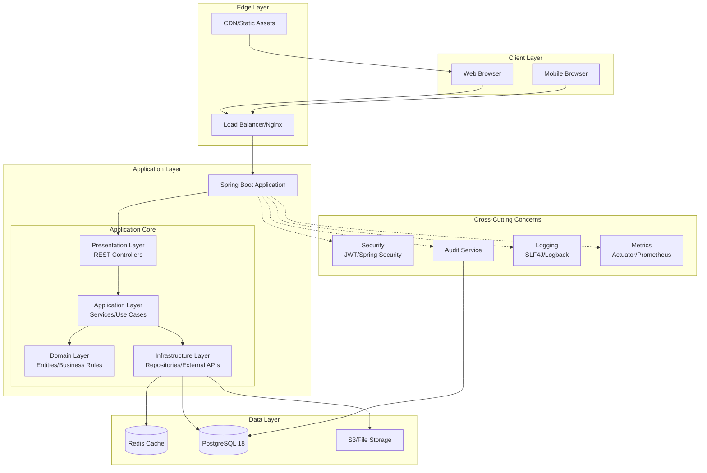
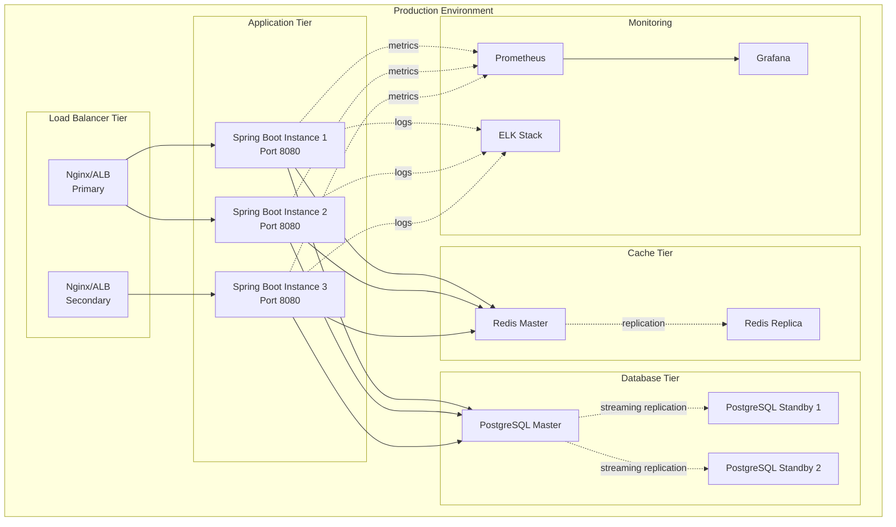
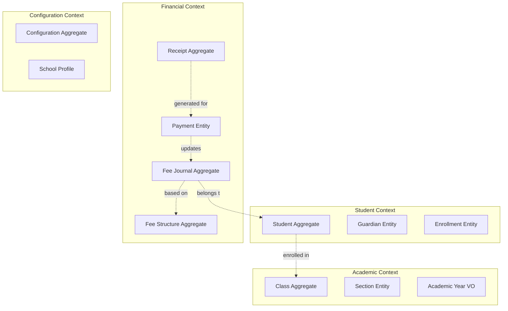
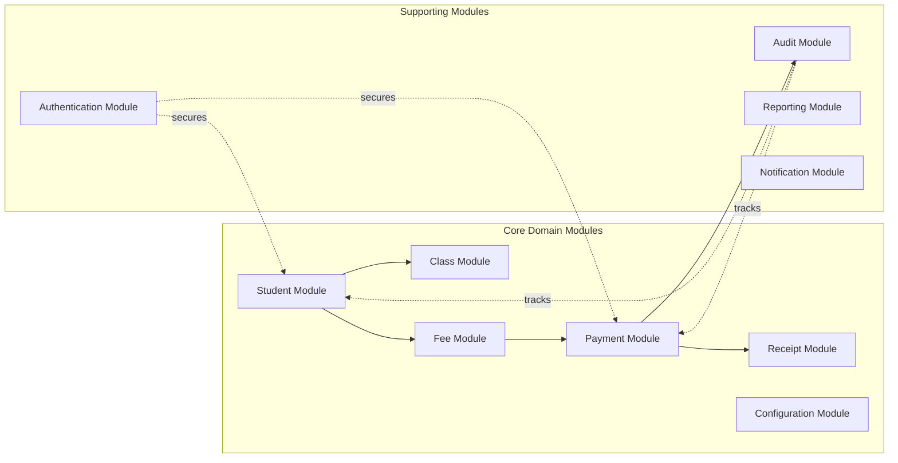
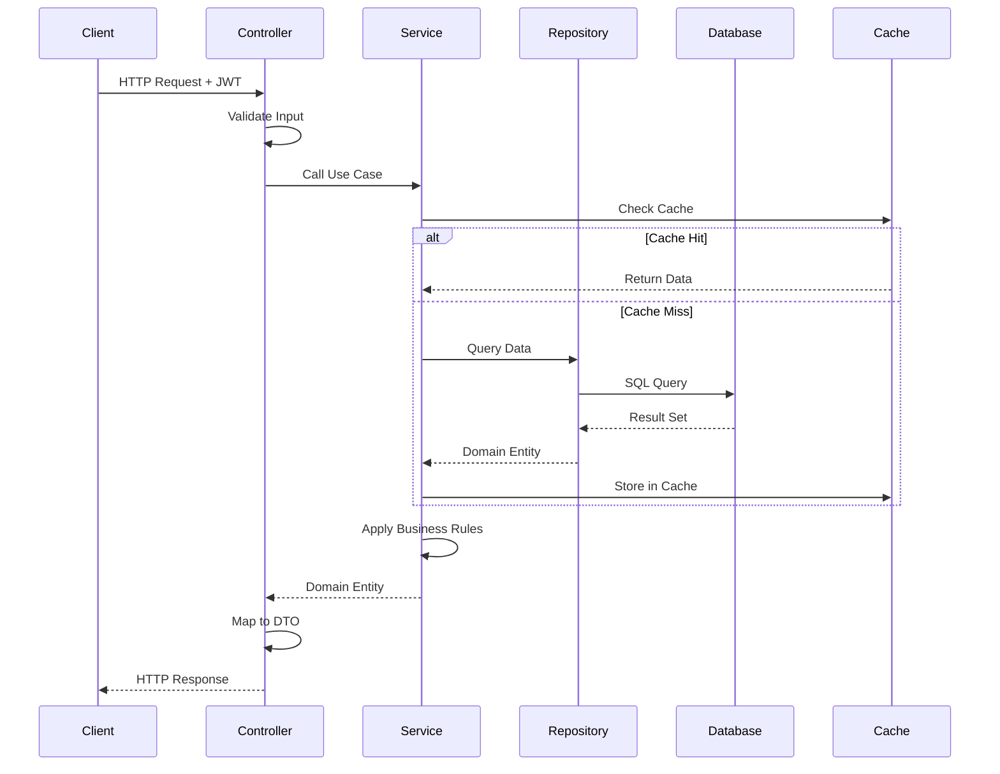
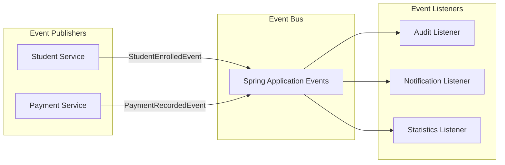
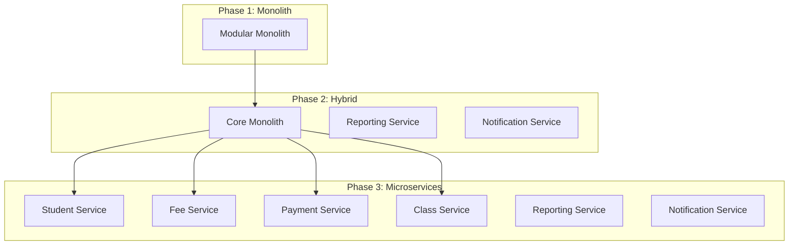

# System Architecture - School Management System

**Version**: 1.0
**Date**: November 10, 2025
**Status**: Approved
**Author**: Enterprise Architecture Team

---

## Table of Contents
1. [Executive Summary](#executive-summary)
2. [Architectural Overview](#architectural-overview)
3. [Technology Stack](#technology-stack)
4. [Architectural Style & Patterns](#architectural-style--patterns)
5. [System Components](#system-components)
6. [Communication Patterns](#communication-patterns)
7. [Quality Attributes](#quality-attributes)
8. [Architectural Decision Records](#architectural-decision-records)

---

## 1. Executive Summary

The School Management System (SMS) is designed as a **monolithic layered application** following **Domain-Driven Design (DDD)** principles with **Clean Architecture** patterns. This architecture is chosen to:

- Support 2,500 students and 100+ concurrent users
- Achieve <200ms API response time
- Maintain 99.5% uptime
- Provide enterprise-grade security with AES-256 encryption
- Enable audit logging and 7-year data retention
- Scale horizontally through containerization and load balancing

### Key Architectural Decisions
- **Monolithic architecture** for Phase 1 (simpler deployment, lower latency, ACID transactions)
- **Layered architecture** with clear separation of concerns
- **Domain-Driven Design** for complex business rules
- **Event-driven audit logging** for compliance
- **Redis caching** for performance optimization
- **PostgreSQL** for transactional consistency

---

## 2. Architectural Overview

### 2.1 High-Level Architecture Diagram



### 2.2 Deployment Architecture



---

## 3. Technology Stack

### 3.1 Backend Stack

| Component | Technology | Version | Rationale |
|-----------|------------|---------|-----------|
| **Framework** | Spring Boot | 3.5.0 | Enterprise-grade framework, extensive ecosystem, excellent performance |
| **Language** | Java | 21 (LTS) | Latest LTS with virtual threads, pattern matching, records |
| **Security** | Spring Security | 6.x | Industry-standard security framework, JWT support |
| **Database** | PostgreSQL | 18 | ACID compliance, JSON support, excellent performance |
| **Cache** | Redis | 7.x | Sub-millisecond latency, pub/sub for events |
| **Business Rules** | Drools | 9.x | Declarative business rule management, separation of logic |
| **Migration** | Flyway | 10.x | Version control for database, reliable migrations |
| **Validation** | Hibernate Validator | 8.x | Bean validation, custom validators |
| **Mapping** | MapStruct | 1.6.x | Compile-time DTO mapping, type-safe, performant |
| **Testing** | JUnit 5 + Mockito | 5.10.x / 5.x | Modern testing framework, comprehensive mocking |
| **API Docs** | SpringDoc OpenAPI | 2.6.x | OpenAPI 3.0 specification, Swagger UI |

### 3.2 Frontend Stack

| Component | Technology | Version | Rationale |
|-----------|------------|---------|-----------|
| **Framework** | React | 18.x | Component-based, virtual DOM, large ecosystem |
| **Language** | TypeScript | 5.x | Type safety, better IDE support, fewer runtime errors |
| **Styling** | Tailwind CSS | 3.x | Utility-first, rapid development, small bundle size |
| **State Management** | React Query | 5.x | Server state management, caching, automatic refetch |
| **Client State** | Zustand | 4.x | Lightweight, simple API, TypeScript support |
| **Routing** | React Router | 6.x | Declarative routing, nested routes, data loading |
| **Forms** | React Hook Form | 7.x | Performant, minimal re-renders, easy validation |
| **Validation** | Zod | 3.x | TypeScript-first schema validation, type inference |
| **HTTP Client** | Axios | 1.x | Interceptors, request/response transformation |
| **UI Components** | Shadcn/ui | Latest | Accessible, customizable, Radix UI primitives |
| **Date Handling** | date-fns | 3.x | Modular, immutable, tree-shakeable |
| **Testing** | Vitest + RTL | 2.x | Fast, Vite-based, React Testing Library |

### 3.3 DevOps & Infrastructure

| Component | Technology | Rationale |
|-----------|------------|-----------|
| **Containerization** | Docker | Consistent environments, easy deployment |
| **Orchestration** | Docker Compose (Dev)<br/>Kubernetes (Prod) | Local development / Production scaling |
| **CI/CD** | GitHub Actions | Native GitHub integration, free for private repos |
| **Monitoring** | Prometheus + Grafana | Time-series metrics, excellent visualization |
| **Logging** | ELK Stack (Elasticsearch, Logstash, Kibana) | Centralized logging, powerful search |
| **Tracing** | Spring Boot Actuator | Built-in health checks, metrics exposure |
| **Reverse Proxy** | Nginx | SSL termination, load balancing, static assets |
| **Database Backup** | pg_basebackup + WAL archiving | Point-in-time recovery, streaming replication |

---

## 4. Architectural Style & Patterns

### 4.1 Layered Architecture

The application follows a **strict layered architecture** with dependency flowing inward:

```
┌─────────────────────────────────────┐
│   Presentation Layer (Controllers)   │  ← REST endpoints, DTO conversion
├─────────────────────────────────────┤
│   Application Layer (Services)       │  ← Use cases, orchestration
├─────────────────────────────────────┤
│   Domain Layer (Entities, Rules)     │  ← Business logic, invariants
├─────────────────────────────────────┤
│   Infrastructure Layer (Repos, APIs) │  ← Data access, external systems
└─────────────────────────────────────┘
```

**Layer Responsibilities**:

1. **Presentation Layer** (`com.school.sms.presentation`)
   - REST controllers
   - Request/Response DTOs
   - Input validation
   - HTTP status code mapping
   - OpenAPI documentation

2. **Application Layer** (`com.school.sms.application`)
   - Application services (use cases)
   - Transaction boundaries
   - Service orchestration
   - DTO to Domain mapping
   - Authorization checks

3. **Domain Layer** (`com.school.sms.domain`)
   - Domain entities (JPA entities)
   - Value objects
   - Domain services
   - Business rules (Drools)
   - Domain events
   - Repository interfaces

4. **Infrastructure Layer** (`com.school.sms.infrastructure`)
   - JPA repository implementations
   - External API clients
   - Caching implementations
   - File storage
   - Email/SMS services

### 4.2 Domain-Driven Design (DDD)

The application is organized around **bounded contexts**:



**Aggregate Roots**:
- **Student**: Owns guardian information, enrollment history
- **Class**: Owns section details, capacity management
- **Fee Structure**: Owns fee components, versioning
- **Fee Journal**: Owns payment records, balance calculation
- **Receipt**: Owns payment details, transaction record

### 4.3 Design Patterns

| Pattern | Usage | Example |
|---------|-------|---------|
| **Repository** | Data access abstraction | `StudentRepository`, `FeeJournalRepository` |
| **Service** | Business logic encapsulation | `StudentRegistrationService`, `PaymentService` |
| **Factory** | Complex object creation | `ReceiptFactory`, `FeeJournalFactory` |
| **Strategy** | Fee calculation algorithms | `MonthlyFeeCalculator`, `QuarterlyFeeCalculator` |
| **Observer** | Event handling | `PaymentRecordedEvent`, `StudentEnrolledEvent` |
| **Builder** | DTO/Entity construction | `StudentBuilder`, `ReceiptBuilder` |
| **Specification** | Query criteria composition | `StudentSpecification`, `OverduePaymentSpecification` |
| **DTO** | Layer decoupling | `StudentRequestDTO`, `PaymentResponseDTO` |

---

## 5. System Components

### 5.1 Core Modules



### 5.2 Module Breakdown

#### 5.2.1 Student Management Module
**Responsibilities**:
- Student registration and profile management
- Guardian information management
- Class enrollment with capacity validation
- Student status lifecycle management
- Age validation (3-18 years)
- Mobile number uniqueness validation

**Key Services**:
- `StudentRegistrationService`: Handle new student admissions
- `StudentProfileService`: Update student information
- `EnrollmentService`: Manage class assignments
- `StudentStatusService`: Handle status transitions

#### 5.2.2 Class Management Module
**Responsibilities**:
- Class and section configuration (1-10, A-Z)
- Academic year management (YYYY-YYYY format)
- Enrollment capacity management
- Year-end rollover automation
- Enrollment statistics

**Key Services**:
- `ClassConfigurationService`: Setup class structures
- `AcademicYearService`: Manage academic years
- `RolloverService`: Automate year transitions
- `EnrollmentStatisticsService`: Generate reports

#### 5.2.3 Fee Management Module
**Responsibilities**:
- Fee structure configuration
- Multiple fee types (tuition, library, computer, etc.)
- Fee frequency management (Monthly, Quarterly, Annual, One-time)
- Fee versioning and historical tracking
- Rule-based fee calculation with Drools

**Key Services**:
- `FeeStructureService`: Configure fee types and amounts
- `FeeCalculationService`: Calculate student fees
- `FeeVersioningService`: Manage fee history
- `FeeRuleService`: Execute Drools rules

#### 5.2.4 Payment Tracking Module
**Responsibilities**:
- Monthly fee journal generation
- Payment status management (Pending, Partial, Paid, Overdue, Waived)
- Payment recording and validation
- Dues and overdue reporting
- Payment history tracking

**Key Services**:
- `FeeJournalService`: Generate monthly journals
- `PaymentRecordingService`: Record payments
- `DuesCalculationService`: Calculate outstanding amounts
- `OverdueTrackingService`: Identify overdue payments

#### 5.2.5 Receipt Management Module
**Responsibilities**:
- Receipt generation with unique numbers (REC-YYYY-NNNNN)
- Support for cash and online payments
- Fee breakdown and months covered
- Receipt search and filtering
- Daily collection reporting

**Key Services**:
- `ReceiptGenerationService`: Create receipts
- `ReceiptSearchService`: Query receipts
- `CollectionReportService`: Generate daily reports
- `ReceiptNumberService`: Manage sequential numbering

#### 5.2.6 Configuration Module
**Responsibilities**:
- School profile and branding
- Academic and financial defaults
- System-wide settings
- Configuration versioning
- Key-value pair management

**Key Services**:
- `ConfigurationService`: Manage settings
- `SchoolProfileService`: School information
- `ConfigVersioningService`: Track changes

---

## 6. Communication Patterns

### 6.1 Inter-Layer Communication



### 6.2 Event-Driven Communication

For audit logging and cross-module notifications:



**Domain Events**:
- `StudentRegisteredEvent`
- `StudentEnrolledEvent`
- `StudentStatusChangedEvent`
- `FeeStructureCreatedEvent`
- `FeeJournalGeneratedEvent`
- `PaymentRecordedEvent`
- `ReceiptGeneratedEvent`
- `ConfigurationChangedEvent`

---

## 7. Quality Attributes

### 7.1 Performance

**Target**: API response time < 200ms

**Strategies**:
1. **Database Optimization**
   - Proper indexing on frequently queried fields
   - Query optimization with EXPLAIN ANALYZE
   - Connection pooling (HikariCP)
   - Read replicas for reporting queries

2. **Caching Strategy**
   - Redis for frequently accessed data
   - Cache-aside pattern
   - TTL-based expiration
   - Cache warming on startup

3. **Application Optimization**
   - Lazy loading for relationships
   - DTO projections to minimize data transfer
   - Async processing for non-critical operations
   - Virtual threads (Java 21) for I/O operations

**Caching Strategy**:
```
- Student profiles: TTL 1 hour, evict on update
- Fee structures: TTL 24 hours, evict on create/update
- Class information: TTL 12 hours, evict on update
- Configuration: TTL 24 hours, evict on update
- Session data: TTL based on JWT expiry
```

### 7.2 Scalability

**Target**: Support 2,500 students, 100+ concurrent users

**Strategies**:
1. **Horizontal Scaling**
   - Stateless application design
   - Load balancer distribution
   - Session data in Redis (shared)
   - Database connection pooling

2. **Vertical Scaling**
   - Optimized JVM settings
   - Connection pool tuning
   - Database resource allocation

3. **Database Scaling**
   - Read replicas for reporting
   - Partitioning for large tables (future)
   - Archival strategy for old data

**Capacity Planning**:
```
- Peak concurrent users: 100
- Average requests per user: 5 per minute
- Peak RPS: 100 * 5 / 60 ≈ 8 requests/second
- With 3 instances: ~2.7 RPS per instance
- Database connections: 20 per instance = 60 total
- Redis memory: ~2GB (student + fee + session data)
```

### 7.3 Availability

**Target**: 99.5% uptime (≈43.8 hours downtime/year)

**Strategies**:
1. **Application Tier**
   - Multiple application instances
   - Health checks and auto-restart
   - Graceful shutdown
   - Circuit breakers for external dependencies

2. **Database Tier**
   - PostgreSQL streaming replication
   - Automatic failover with pg_auto_failover
   - Regular backups (daily full, hourly incremental)
   - Point-in-time recovery

3. **Cache Tier**
   - Redis master-replica setup
   - Redis Sentinel for automatic failover
   - Cache degradation (app continues without cache)

4. **Monitoring & Alerting**
   - Health endpoints (Spring Actuator)
   - Prometheus metrics
   - Grafana dashboards
   - PagerDuty/email alerts

### 7.4 Security

**Target**: AES-256 encryption for PII, RBAC, audit logging

**Strategies**:
1. **Authentication**
   - JWT tokens with 15-minute expiry
   - Refresh tokens with 7-day expiry
   - Secure password hashing (BCrypt)
   - Multi-factor authentication for admins

2. **Authorization**
   - Role-Based Access Control (RBAC)
   - Fine-grained permissions
   - Method-level security annotations
   - Row-level security for data isolation

3. **Data Security**
   - AES-256 encryption for PII fields
   - TLS 1.3 for data in transit
   - Database encryption at rest
   - Secure key management (AWS KMS / HashiCorp Vault)

4. **Application Security**
   - SQL injection prevention (PreparedStatements)
   - XSS protection (Content Security Policy)
   - CSRF protection (Spring Security)
   - Rate limiting (Bucket4j)
   - Input validation (Hibernate Validator)

### 7.5 Maintainability

**Strategies**:
1. **Code Quality**
   - SonarQube integration
   - Test coverage > 80% backend, > 70% frontend
   - Code review process
   - Static code analysis

2. **Documentation**
   - OpenAPI/Swagger documentation
   - Architecture Decision Records
   - Inline code documentation
   - README files per module

3. **Monitoring & Debugging**
   - Structured logging (JSON format)
   - Correlation IDs for request tracing
   - Metrics and dashboards
   - Error tracking (Sentry)

### 7.6 Compliance

**Target**: 7-year data retention, audit logging

**Strategies**:
1. **Audit Logging**
   - All data modifications logged
   - User actions tracked
   - Timestamp and user identification
   - Immutable audit records

2. **Data Retention**
   - Archival strategy for old data
   - Automated backup retention
   - Legal hold capabilities
   - Data purging after retention period

3. **Data Privacy**
   - GDPR-compliant data handling
   - Right to erasure implementation
   - Data export capabilities
   - Privacy by design

---

## 8. Architectural Decision Records

### ADR-001: Monolithic vs Microservices

**Status**: Accepted

**Context**:
We need to decide between a monolithic architecture and microservices for Phase 1.

**Decision**:
We will implement a **modular monolithic architecture**.

**Rationale**:
1. **Complexity**: School management has tightly coupled domains (student-fee-payment)
2. **Team Size**: Small team, easier to manage single codebase
3. **Deployment**: Simpler deployment and operations
4. **Performance**: Lower latency with in-process communication
5. **Transactions**: ACID transactions across modules without distributed transaction complexity
6. **Initial Scale**: 2,500 students and 100 users well within monolith capabilities
7. **Future Migration**: Modular structure allows extracting to microservices later

**Consequences**:
- Positive: Faster development, simpler deployment, better performance
- Negative: Potential scaling limitations (mitigated by horizontal scaling)
- Mitigation: Design with clear module boundaries for future extraction

### ADR-002: PostgreSQL for Primary Database

**Status**: Accepted

**Context**:
We need to choose a database for transactional data.

**Decision**:
We will use **PostgreSQL 18** as the primary database.

**Rationale**:
1. **ACID Compliance**: Strong consistency for financial transactions
2. **Performance**: Excellent query performance with proper indexing
3. **Features**: JSON support, window functions, CTE, full-text search
4. **Reliability**: Proven track record in production systems
5. **Backup & Recovery**: Robust backup and point-in-time recovery
6. **Replication**: Streaming replication for high availability
7. **Cost**: Open-source, no licensing costs

**Consequences**:
- Positive: Strong consistency, feature-rich, reliable
- Negative: Vertical scaling limits (mitigated by read replicas)

### ADR-003: Redis for Caching

**Status**: Accepted

**Context**:
We need to achieve <200ms API response time.

**Decision**:
We will use **Redis 7.x** for application caching.

**Rationale**:
1. **Performance**: Sub-millisecond latency
2. **Data Structures**: Rich data types (strings, hashes, sets, sorted sets)
3. **TTL Support**: Automatic expiration of cached data
4. **Pub/Sub**: Event-driven cache invalidation
5. **Persistence**: RDB/AOF for cache recovery
6. **High Availability**: Redis Sentinel for failover
7. **Ecosystem**: Excellent Spring Boot integration

**Consequences**:
- Positive: Significant performance improvement, reduced database load
- Negative: Additional infrastructure component, cache invalidation complexity
- Mitigation: Cache-aside pattern, TTL-based expiration

### ADR-004: Drools for Business Rules

**Status**: Accepted

**Context**:
We have complex fee calculation rules that vary by class, fee type, and frequency.

**Decision**:
We will use **Drools** for business rule management.

**Rationale**:
1. **Separation of Concerns**: Rules separated from application code
2. **Business Ownership**: Non-developers can update rules
3. **Flexibility**: Rules can change without code deployment
4. **Testing**: Rules can be tested independently
5. **Performance**: Efficient rule execution (Rete algorithm)
6. **Versioning**: Rule versioning and audit trail

**Consequences**:
- Positive: Flexible rule management, easier rule updates
- Negative: Learning curve, additional complexity
- Mitigation: Document rule syntax, provide rule examples

### ADR-005: JWT for Authentication

**Status**: Accepted

**Context**:
We need stateless authentication for horizontal scaling.

**Decision**:
We will use **JWT (JSON Web Tokens)** with Spring Security.

**Rationale**:
1. **Stateless**: No server-side session storage
2. **Scalability**: Works with load balancers without sticky sessions
3. **Standard**: Industry-standard (RFC 7519)
4. **Claims-Based**: Can embed user roles and permissions
5. **Expiration**: Built-in token expiration
6. **Refresh Tokens**: Separate refresh token for long-lived sessions

**Consequences**:
- Positive: Stateless, scalable, standard
- Negative: Token revocation complexity, larger token size
- Mitigation: Short expiry times, refresh token rotation, token blacklist in Redis

### ADR-006: React with TypeScript for Frontend

**Status**: Accepted

**Context**:
We need a modern, maintainable frontend framework.

**Decision**:
We will use **React 18 with TypeScript**.

**Rationale**:
1. **Ecosystem**: Largest ecosystem, extensive libraries
2. **Type Safety**: TypeScript reduces runtime errors
3. **Performance**: Virtual DOM, concurrent features
4. **Developer Experience**: Excellent tooling and IDE support
5. **Community**: Large community, extensive documentation
6. **Talent Pool**: Easier to find React developers
7. **Component Model**: Reusable, testable components

**Consequences**:
- Positive: Type safety, better maintainability, strong ecosystem
- Negative: Build tooling complexity, learning curve for TypeScript
- Mitigation: Comprehensive TypeScript training, ESLint/Prettier configuration

### ADR-007: MapStruct for DTO Mapping

**Status**: Accepted

**Context**:
We need to map between domain entities and DTOs.

**Decision**:
We will use **MapStruct** for DTO mapping.

**Rationale**:
1. **Compile-Time**: Type-safe mapping at compile time
2. **Performance**: No reflection, faster than runtime mappers
3. **Maintainability**: Clear mapping definitions
4. **Error Detection**: Unmapped fields detected at compile time
5. **Customization**: Custom mapping methods supported
6. **Integration**: Works well with Spring Boot

**Consequences**:
- Positive: Type-safe, performant, maintainable
- Negative: Additional annotation processing step
- Mitigation: Clear mapper interfaces, automated tests

### ADR-008: Flyway for Database Migrations

**Status**: Accepted

**Context**:
We need version control for database schema.

**Decision**:
We will use **Flyway** for database migrations.

**Rationale**:
1. **Version Control**: SQL migrations in version control
2. **Reliability**: Proven track record
3. **Simplicity**: Simple SQL-based migrations
4. **Team Collaboration**: Clear migration history
5. **Rollback**: Undo migrations for rollback
6. **Integration**: Excellent Spring Boot integration
7. **Environments**: Consistent migrations across environments

**Consequences**:
- Positive: Reliable migrations, version control, team collaboration
- Negative: Migration failures can block deployments
- Mitigation: Test migrations in staging, write rollback migrations

---

## 9. System Constraints

### 9.1 Technical Constraints
- **Java 21 LTS**: Required for long-term support
- **Spring Boot 3.5**: Requires Java 17+ (satisfied by Java 21)
- **PostgreSQL 18**: Specific version for compatibility
- **Browser Support**: Modern browsers (Chrome, Firefox, Safari, Edge) - last 2 versions
- **Mobile Support**: Responsive design for tablets, phones

### 9.2 Operational Constraints
- **Limited IT Staff**: Simple deployment, automated monitoring
- **Cloud Hosting**: Infrastructure as code, containerization
- **Budget**: Open-source technologies preferred
- **Internet Connectivity**: Application requires stable internet

### 9.3 Business Constraints
- **7-Year Data Retention**: Archival strategy required
- **Audit Compliance**: All data modifications logged
- **AES-256 Encryption**: PII fields must be encrypted
- **Role-Based Access**: Multi-role support required

---

## 10. Future Considerations

### 10.1 Phase 2 Enhancements
- **Attendance Management**: Track student attendance
- **Timetable Management**: Class schedules
- **Teacher Management**: Teacher profiles and assignments
- **Library Management**: Book inventory and lending
- **Transport Management**: Bus routes and fees
- **Exam Management**: Exam scheduling and results

### 10.2 Microservices Migration Path

If the system scales beyond monolith capabilities:



**Migration Strategy**:
1. Extract read-heavy services first (Reporting, Notification)
2. Extract bounded contexts with clear boundaries (Class, Configuration)
3. Extract core transactional services last (Student, Fee, Payment)
4. Use API Gateway for routing
5. Event-driven communication with Kafka/RabbitMQ
6. Distributed tracing with OpenTelemetry

---

## 11. Glossary

| Term | Definition |
|------|------------|
| **Aggregate Root** | Main entity that controls access to a cluster of related entities |
| **Bounded Context** | Logical boundary where a domain model applies |
| **Circuit Breaker** | Pattern to prevent cascading failures in distributed systems |
| **DTO** | Data Transfer Object - object for transferring data between layers |
| **Event Sourcing** | Storing state changes as events |
| **Idempotency** | Operation that produces same result when called multiple times |
| **Repository** | Pattern for data access abstraction |
| **Value Object** | Immutable object with no identity |

---

## 12. References

- [Spring Boot Documentation](https://docs.spring.io/spring-boot/docs/current/reference/html/)
- [PostgreSQL Documentation](https://www.postgresql.org/docs/)
- [Redis Documentation](https://redis.io/docs/)
- [Domain-Driven Design - Eric Evans](https://www.domainlanguage.com/ddd/)
- [Clean Architecture - Robert C. Martin](https://blog.cleancoder.com/uncle-bob/2012/08/13/the-clean-architecture.html)
- [Enterprise Integration Patterns](https://www.enterpriseintegrationpatterns.com/)

---

**Document Control**

| Version | Date | Author | Changes |
|---------|------|--------|---------|
| 1.0 | 2025-11-10 | Architecture Team | Initial version |

