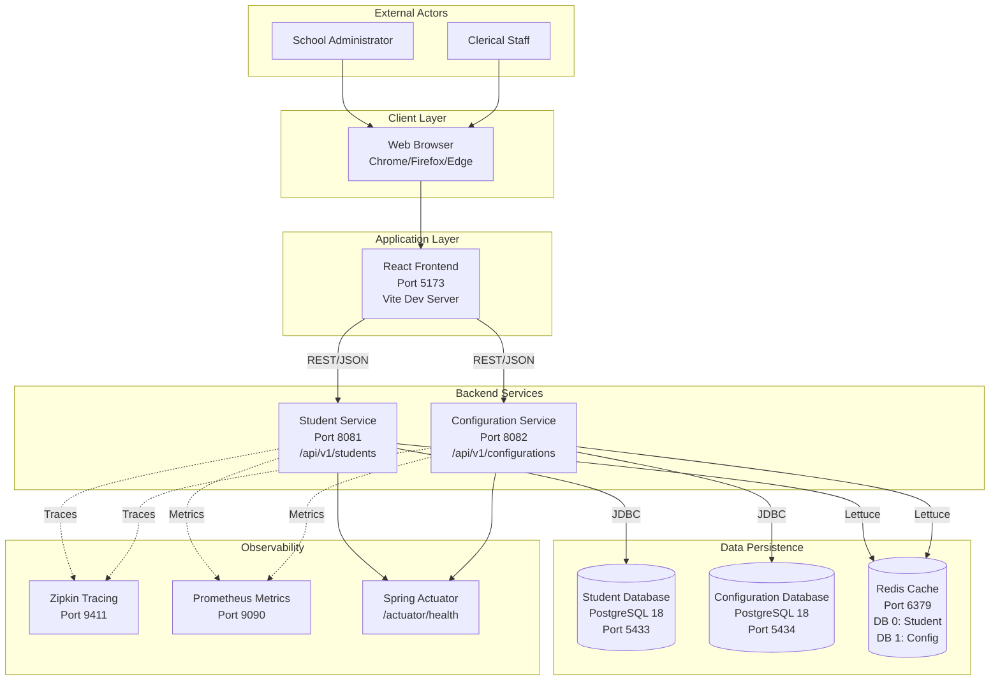
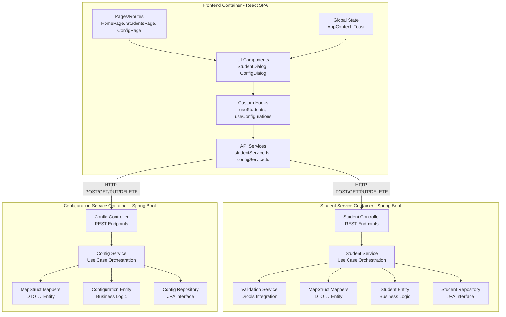
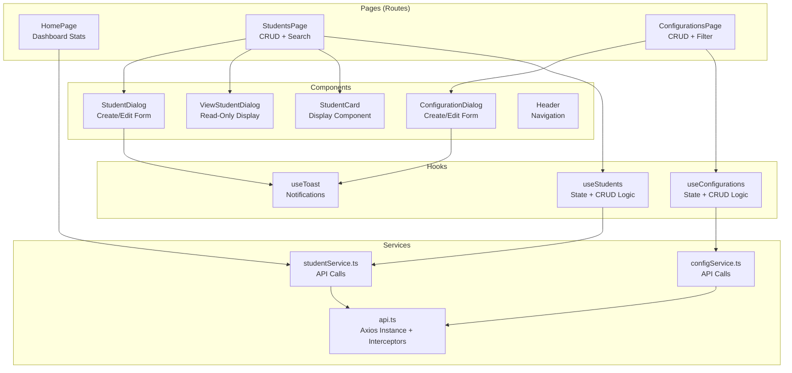

# System Architecture - School Management System

**Version:** 1.0
**Date:** January 22, 2026
**Status:** Active
**Phase:** 1 - Student Management & Configuration

---

## Table of Contents

1. [Overview](#1-overview)
2. [Architectural Principles](#2-architectural-principles)
3. [System Context](#3-system-context)
4. [Container Architecture](#4-container-architecture)
5. [Component Architecture](#5-component-architecture)
6. [Microservices Boundaries](#6-microservices-boundaries)
7. [Architectural Style](#7-architectural-style)
8. [Logging Strategy](#8-logging-strategy)
9. [Design Patterns](#9-design-patterns)

---

## 1. Overview

### 1.1 Product Summary

The School Management System (SMS) is a web-based digital platform designed to automate and optimize administrative workflows within schools. It provides a unified interface for managing student registration and school configuration using a microservices architecture.

### 1.2 Architectural Goals

- **Scalability:** Horizontal scaling through stateless microservices
- **Maintainability:** Clear separation of concerns via DDD and layered architecture
- **Testability:** High test coverage (>70% service layer, >80% domain layer)
- **Performance:** p95 response time <200ms for all operations
- **Reliability:** Database-per-service isolation, optimistic locking, circuit breakers

### 1.3 Key Constraints

1. **Database Isolation:** Absolute prohibition of cross-service database access
2. **API Contract:** 100% adherence to OpenAPI 3.0 specification (`sms_api_specification.yaml`)
3. **Single School Instance:** No multi-tenancy in Phase 1
4. **No Authentication:** External authentication assumed in Phase 1
5. **Microservices Style:** Student and Configuration as separate services

---

## 2. Architectural Principles

### 2.1 Core Principles

1. **Database-per-Service**
   - Each microservice owns its database
   - NO shared tables or schemas
   - Data sharing ONLY through APIs
   - Separate PostgreSQL instances (ports 5433, 5434)

2. **Bounded Contexts (DDD)**
   - **Student Management Context:** Student registration, profiles, enrollment history
   - **Configuration Management Context:** Key-value settings, categories
   - Services grouped by business capability, not by data model

3. **Contract-First Design**
   - OpenAPI 3.0 specification drives implementation
   - DTOs define external contracts
   - Internal domain models NEVER leak to API layer
   - MapStruct enforces boundary translation

4. **SOLID Principles**
   - **Single Responsibility:** Each class has one reason to change
   - **Open/Closed:** Extend behavior without modifying existing code
   - **Liskov Substitution:** Subtypes must be substitutable for base types
   - **Interface Segregation:** Clients depend on narrow interfaces
   - **Dependency Inversion:** Depend on abstractions, not concretions

5. **Separation of Concerns**
   - Clear layer boundaries (Presentation → Application → Domain → Infrastructure)
   - Business logic isolated in domain layer
   - Infrastructure concerns abstracted via interfaces

---

## 3. System Context

### 3.1 System Context Diagram


```mermaid
graph TB
    subgraph "External Actors"
        Admin[School Administrator]
        Staff[Clerical Staff]
    end

    subgraph "Client Layer"
        Browser[Web Browser<br/>Chrome/Firefox/Edge]
    end

    subgraph "Application Layer"
        Frontend[React Frontend<br/>Port 5173<br/>Vite Dev Server]
    end

    subgraph "Backend Services"
        StudentAPI[Student Service<br/>Port 8081<br/>/api/v1/students]
        ConfigAPI[Configuration Service<br/>Port 8082<br/>/api/v1/configurations]
    end

    subgraph "Data Persistence"
        StudentDB[(Student Database<br/>PostgreSQL 18<br/>Port 5433)]
        ConfigDB[(Configuration Database<br/>PostgreSQL 18<br/>Port 5434)]
        RedisCache[(Redis Cache<br/>Port 6379<br/>DB 0: Student<br/>DB 1: Config)]
    end

    subgraph "Observability"
        Zipkin[Zipkin Tracing<br/>Port 9411]
        Prometheus[Prometheus Metrics<br/>Port 9090]
        Actuator[Spring Actuator<br/>/actuator/health]
    end

    Admin --> Browser
    Staff --> Browser
    Browser --> Frontend
    Frontend -->|REST/JSON| StudentAPI
    Frontend -->|REST/JSON| ConfigAPI
    StudentAPI -->|JDBC| StudentDB
    StudentAPI -->|Lettuce| RedisCache
    ConfigAPI -->|JDBC| ConfigDB
    ConfigAPI -->|Lettuce| RedisCache
    StudentAPI -.->|Traces| Zipkin
    ConfigAPI -.->|Traces| Zipkin
    StudentAPI -.->|Metrics| Prometheus
    ConfigAPI -.->|Metrics| Prometheus
    StudentAPI --> Actuator
    ConfigAPI --> Actuator
```

### 3.2 External Dependencies

| Dependency | Type | Purpose | Phase 1 Status |
|------------|------|---------|----------------|
| Authentication Service | External | User authentication | Assumed external |
| Email Service | External | Notifications | Not in scope |
| SMS Gateway | External | Mobile notifications | Not in scope |
| Payment Gateway | External | Fee collection | Not in scope |

---

## 4. Container Architecture

### 4.1 Container Diagram


```mermaid
graph TB
    subgraph "Frontend Container - React SPA"
        Pages[Pages/Routes<br/>HomePage, StudentsPage, ConfigPage]
        Components[UI Components<br/>StudentDialog, ConfigDialog]
        Services[API Services<br/>studentService.ts, configService.ts]
        Hooks[Custom Hooks<br/>useStudents, useConfigurations]
        Context[Global State<br/>AppContext, Toast]

        Pages --> Components
        Components --> Hooks
        Hooks --> Services
        Context --> Components
    end

    subgraph "Student Service Container - Spring Boot"
        SC[Student Controller<br/>REST Endpoints]
        SS[Student Service<br/>Use Case Orchestration]
        SV[Validation Service<br/>Drools Integration]
        SM[MapStruct Mappers<br/>DTO ↔ Entity]
        Student[Student Entity<br/>Business Logic]
        SR[Student Repository<br/>JPA Interface]

        SC --> SS
        SS --> SV
        SS --> SM
        SS --> Student
        SS --> SR
    end

    subgraph "Configuration Service Container - Spring Boot"
        CC[Config Controller<br/>REST Endpoints]
        CS[Config Service<br/>Use Case Orchestration]
        CM[MapStruct Mappers<br/>DTO ↔ Entity]
        Config[Configuration Entity<br/>Business Logic]
        CR[Config Repository<br/>JPA Interface]

        CC --> CS
        CS --> CM
        CS --> Config
        CS --> CR
    end

    Services -->|HTTP POST/GET/PUT/DELETE| SC
    Services -->|HTTP POST/GET/PUT/DELETE| CC
```

### 4.2 Technology Stack per Container

**Frontend Container:**
- **Runtime:** Node.js 20+ (development), Nginx (production)
- **Framework:** React 18.3, TypeScript 5, Vite 5
- **Styling:** Tailwind CSS 4, Shadcn/ui
- **State:** React Context API, React Hook Form
- **HTTP:** Axios 1.x with interceptors
- **Validation:** Zod 3.x schemas

**Student Service Container:**
- **Runtime:** JVM 21 LTS
- **Framework:** Spring Boot 3.3.5
- **Database:** PostgreSQL 18 (JDBC), Flyway migrations
- **Cache:** Redis 7.x (Lettuce client, DB 0)
- **Rules:** Drools 9.44.0.Final
- **Mapping:** MapStruct 1.5.5.Final
- **Observability:** Micrometer, Zipkin, Spring Actuator

**Configuration Service Container:**
- **Runtime:** JVM 21 LTS
- **Framework:** Spring Boot 3.3.5
- **Database:** PostgreSQL 18 (JDBC), Flyway migrations
- **Cache:** Redis 7.x (Lettuce client, DB 1)
- **Mapping:** MapStruct 1.5.5.Final
- **Observability:** Micrometer, Zipkin, Spring Actuator

---

## 5. Component Architecture

### 5.1 Student Service Components

```mermaid
graph TB
    subgraph "Presentation Layer"
        Controller[StudentController<br/>@RestController]
        ExceptionHandler[GlobalExceptionHandler<br/>@ControllerAdvice<br/>RFC 7807 Errors]
    end

    subgraph "Application Layer"
        Service[StudentService<br/>@Service<br/>@Transactional]
        Validator[DroolsValidationService<br/>Business Rules]
        Mapper[StudentMapper<br/>@Mapper<br/>MapStruct]
    end

    subgraph "Domain Layer"
        Entity[Student Entity<br/>@Entity<br/>Business Logic]
        Enrollment[Enrollment Entity<br/>@Entity]
        ValueObjects[Value Objects<br/>Mobile, Email, AadhaarNumber]
        Rules[Business Rules<br/>student-validation.drl]
    end

    subgraph "Infrastructure Layer"
        Repo[StudentRepository<br/>@Repository<br/>extends JpaRepository]
        CacheConfig[Redis Configuration<br/>@EnableCaching]
        DroolsConfig[Drools Configuration<br/>KieSession Bean]
    end

    Controller --> Service
    Controller --> ExceptionHandler
    Service --> Validator
    Service --> Mapper
    Service --> Entity
    Entity --> ValueObjects
    Validator --> Rules
    Service --> Repo
    Repo --> CacheConfig
    Validator --> DroolsConfig
```

### 5.2 Configuration Service Components

```mermaid
graph TB
    subgraph "Presentation Layer"
        Controller[ConfigurationController<br/>@RestController]
        ExceptionHandler[GlobalExceptionHandler<br/>@ControllerAdvice]
    end

    subgraph "Application Layer"
        Service[ConfigurationService<br/>@Service<br/>@Transactional]
        Mapper[ConfigurationMapper<br/>@Mapper<br/>MapStruct]
    end

    subgraph "Domain Layer"
        Entity[Configuration Entity<br/>@Entity<br/>Category Enum]
        DataType[DataType Enum<br/>STRING, NUMBER, BOOLEAN, JSON]
    end

    subgraph "Infrastructure Layer"
        Repo[ConfigurationRepository<br/>@Repository<br/>extends JpaRepository]
        CacheConfig[Redis Configuration<br/>@EnableCaching<br/>DB 1]
    end

    Controller --> Service
    Controller --> ExceptionHandler
    Service --> Mapper
    Service --> Entity
    Entity --> DataType
    Service --> Repo
    Repo --> CacheConfig
```

### 5.3 Frontend Components


```mermaid
graph TB
    subgraph "Pages (Routes)"
        HomePage[HomePage<br/>Dashboard Stats]
        StudentsPage[StudentsPage<br/>CRUD + Search]
        ConfigPage[ConfigurationsPage<br/>CRUD + Filter]
    end

    subgraph "Components"
        StudentDialog[StudentDialog<br/>Create/Edit Form]
        ViewDialog[ViewStudentDialog<br/>Read-Only Display]
        ConfigDialog[ConfigurationDialog<br/>Create/Edit Form]
        StudentCard[StudentCard<br/>Display Component]
        Header[Header<br/>Navigation]
    end

    subgraph "Services"
        StudentService[studentService.ts<br/>API Calls]
        ConfigService[configService.ts<br/>API Calls]
        ApiClient[api.ts<br/>Axios Instance + Interceptors]
    end

    subgraph "Hooks"
        useStudents[useStudents<br/>State + CRUD Logic]
        useConfig[useConfigurations<br/>State + CRUD Logic]
        useToast[useToast<br/>Notifications]
    end

    HomePage --> StudentService
    StudentsPage --> StudentDialog
    StudentsPage --> ViewDialog
    StudentsPage --> StudentCard
    StudentsPage --> useStudents
    ConfigPage --> ConfigDialog
    ConfigPage --> useConfig
    useStudents --> StudentService
    useConfig --> ConfigService
    StudentService --> ApiClient
    ConfigService --> ApiClient
    StudentDialog --> useToast
    ConfigDialog --> useToast
```

---

## 6. Microservices Boundaries

### 6.1 Service Ownership

**Student Service (Bounded Context: Student Management)**

**Responsibilities:**
- Student registration (auto-generate Student ID)
- Student profile management (CRUD)
- Student search and filtering (by lastName, guardianName, status)
- Status updates (ACTIVE ↔ INACTIVE)
- Enrollment history management
- Age validation (3-18 years)
- Mobile uniqueness validation

**Data Owned:**
- `students` table
- `enrollments` table
- Student-related cache entries (Redis DB 0)

**API Surface:**
```
GET    /api/v1/students
POST   /api/v1/students
GET    /api/v1/students/{studentId}
PUT    /api/v1/students/{studentId}
DELETE /api/v1/students/{studentId}
GET    /api/v1/students/{studentId}/enrollment-history
POST   /api/v1/students/{studentId}/enrollment-history
POST   /api/v1/students/validate-phone
```

---

**Configuration Service (Bounded Context: System Configuration)**

**Responsibilities:**
- Key-value settings management
- Category-based grouping (GENERAL, ACADEMIC, FINANCIAL)
- Configuration CRUD operations
- Encrypted value storage (optional)
- Grouped configuration retrieval

**Data Owned:**
- `configurations` table
- Configuration-related cache entries (Redis DB 1)

**API Surface:**
```
GET    /api/v1/configurations
GET    /api/v1/configurations/{category}/{key}
PUT    /api/v1/configurations/{category}/{key}
DELETE /api/v1/configurations/{category}/{key}
GET    /api/v1/configurations/grouped/{category}
```

### 6.2 Boundary Enforcement Rules

1. **Database Isolation:**
   - Student Service connects ONLY to `student_db` (port 5433)
   - Configuration Service connects ONLY to `config_db` (port 5434)
   - NO SQL joins across services
   - NO shared tables or schemas

2. **Cache Isolation:**
   - Student Service uses Redis DB 0
   - Configuration Service uses Redis DB 1
   - Key prefixes: `sms:student:*` and `sms:config:*`

3. **Communication:**
   - Frontend calls each service independently
   - NO service-to-service calls in Phase 1
   - Future: Event-driven communication via message broker

4. **Contract Strictness:**
   - External API uses DTOs defined in OpenAPI spec
   - Internal domain models NEVER exposed directly
   - MapStruct enforces translation layer

---

## 7. Architectural Style

### 7.1 DDD-Based Layered Architecture

Each microservice follows a **4-tier layered architecture** with Domain-Driven Design principles:

```
┌─────────────────────────────────────────┐
│      Presentation Layer                 │
│  - REST Controllers (@RestController)   │
│  - Request Validation (@Valid)          │
│  - Response DTOs                        │
│  - Exception Handlers (@ControllerAdvice)│
└─────────────────────────────────────────┘
              ↓
┌─────────────────────────────────────────┐
│      Application Layer                  │
│  - Use Case Services (@Service)         │
│  - Transaction Management (@Transactional)│
│  - DTO ↔ Entity Mapping (MapStruct)    │
│  - Cross-cutting (Caching, Logging)     │
└─────────────────────────────────────────┘
              ↓
┌─────────────────────────────────────────┐
│      Domain Layer                       │
│  - Entities (@Entity)                   │
│  - Value Objects (immutable)            │
│  - Business Logic                       │
│  - Domain Events (future)               │
│  - Business Rules (.drl files)          │
└─────────────────────────────────────────┘
              ↓
┌─────────────────────────────────────────┐
│      Infrastructure Layer               │
│  - JPA Repositories (@Repository)       │
│  - Database Access (JDBC)               │
│  - Cache Implementation (Redis)         │
│  - External Service Adapters            │
└─────────────────────────────────────────┘
```

### 7.2 Layer Responsibilities

**Presentation Layer:**
- HTTP request/response handling
- Input validation (JSR-303/Jakarta Validation)
- Response serialization (Jackson)
- Error response formatting (RFC 7807 Problem Details)
- API documentation (SpringDoc OpenAPI)

**Application Layer:**
- Use case orchestration (commands/queries)
- Transaction boundaries
- DTO to Domain model mapping
- Drools rules execution
- Caching strategy (@Cacheable, @CacheEvict)

**Domain Layer:**
- Business rule enforcement
- Invariant protection
- Rich domain models (not anemic)
- Value object immutability
- Entity lifecycle management

**Infrastructure Layer:**
- JPA repository implementations
- Query optimization (EntityGraph, Projections)
- Cache configuration (Redis Lettuce)
- Database migrations (Flyway)
- External service integration

### 7.3 CQRS Pattern (Future Enhancement)

**Phase 1:** Unified Service Layer
**Phase 2:** Separate Command and Query Services for read/write optimization

```java
// Command (Write) - Future
public interface StudentCommandService {
    StudentResponse registerStudent(StudentRequest request);
    StudentResponse updateStudent(String id, StudentUpdateRequest request);
    void deleteStudent(String id);
}

// Query (Read) - Future
public interface StudentQueryService {
    Page<StudentResponse> searchStudents(StudentSearchCriteria criteria, Pageable pageable);
    StudentResponse getStudentById(String id);
}
```

---

## 8. Logging Strategy

### 8.1 Structured Logging

**Standard:** Use **SLF4J with Logback** for structured JSON logging.

**Log Levels:**
- **ERROR:** System failures, unrecoverable errors
- **WARN:** Validation failures, business rule violations, deprecated API usage
- **INFO:** Request received, response sent, important state transitions
- **DEBUG:** Method entry/exit, variable states (development only)
- **TRACE:** Detailed flow (disabled in production)

### 8.2 Log Format

```json
{
  "timestamp": "2026-01-22T10:30:45.123Z",
  "level": "INFO",
  "service": "student-service",
  "traceId": "a1b2c3d4e5f6",
  "spanId": "7890abcd",
  "thread": "http-nio-8081-exec-5",
  "logger": "com.school.student.service.StudentService",
  "message": "Student registered successfully",
  "studentId": "STD-20260122-0001",
  "correlationId": "550e8400-e29b-41d4-a716-446655440000"
}
```

### 8.3 Logging Best Practices

1. **Correlation IDs:**
   - Generate UUID for each request in frontend
   - Pass via `X-Correlation-ID` header
   - Include in all log entries via MDC (Mapped Diagnostic Context)

2. **Security:**
   - NEVER log passwords, tokens, or PII (Personally Identifiable Information)
   - Mask sensitive fields: mobile → `+91****3210`, aadhaar → `****5678`

3. **Performance:**
   - Use parameterized logging: `log.info("Student {} created", studentId)` (NOT string concatenation)
   - Guard expensive operations: `if (log.isDebugEnabled()) { ... }`

4. **Traceability:**
   - Log entry/exit for all public service methods
   - Log external API calls (HTTP requests/responses)
   - Log database queries with execution time (>100ms threshold)

### 8.4 Log Configuration (logback-spring.xml)

```xml
<configuration>
    <appender name="JSON_CONSOLE" class="ch.qos.logback.core.ConsoleAppender">
        <encoder class="net.logstash.logback.encoder.LogstashEncoder">
            <includeMdc>true</includeMdc>
            <includeContext>false</includeContext>
            <fieldNames>
                <timestamp>timestamp</timestamp>
                <message>message</message>
                <logger>logger</logger>
                <level>level</level>
                <thread>thread</thread>
            </fieldNames>
        </encoder>
    </appender>

    <root level="INFO">
        <appender-ref ref="JSON_CONSOLE" />
    </root>

    <logger name="com.school" level="DEBUG" />
    <logger name="org.hibernate.SQL" level="DEBUG" />
    <logger name="org.hibernate.type.descriptor.sql.BasicBinder" level="TRACE" />
</configuration>
```

### 8.5 MDC (Mapped Diagnostic Context) Usage

```java
@Component
public class CorrelationIdFilter extends OncePerRequestFilter {
    @Override
    protected void doFilterInternal(HttpServletRequest request,
                                     HttpServletResponse response,
                                     FilterChain filterChain) {
        String correlationId = request.getHeader("X-Correlation-ID");
        if (correlationId == null) {
            correlationId = UUID.randomUUID().toString();
        }
        MDC.put("correlationId", correlationId);
        response.setHeader("X-Correlation-ID", correlationId);

        try {
            filterChain.doFilter(request, response);
        } finally {
            MDC.clear();
        }
    }
}
```

---

## 9. Design Patterns

### 9.1 Core Patterns

**1. Repository Pattern**
```java
public interface StudentRepository extends JpaRepository<Student, Long> {
    Optional<Student> findByStudentId(String studentId);
    List<Student> findByLastNameContainingIgnoreCase(String lastName);
    boolean existsByMobile(String mobile);
}
```

**2. Service Layer Pattern**
```java
@Service
@Transactional
public class StudentService {
    private final StudentRepository repository;
    private final StudentMapper mapper;
    private final DroolsValidationService validator;

    public StudentResponse registerStudent(StudentRequest request) {
        validator.validate(request); // Drools
        Student student = mapper.toEntity(request);
        student.generateStudentId(); // Business logic
        Student saved = repository.save(student);
        return mapper.toResponse(saved);
    }
}
```

**3. DTO Pattern (MapStruct)**
```java
@Mapper(componentModel = "spring")
public interface StudentMapper {
    @Mapping(target = "id", ignore = true)
    @Mapping(target = "studentId", ignore = true)
    @Mapping(target = "version", ignore = true)
    Student toEntity(StudentRequest request);

    StudentResponse toResponse(Student entity);
}
```

**4. Value Object Pattern**
```java
@Embeddable
public record Mobile(String value) {
    public Mobile {
        if (!value.matches("^\\d{10}$")) {
            throw new IllegalArgumentException("Invalid mobile number");
        }
    }
}
```

**5. Builder Pattern (Lombok)**
```java
@Entity
@Builder
public class Student {
    @Id @GeneratedValue(strategy = GenerationType.IDENTITY)
    private Long id;
    private String studentId;
    // ... fields
}
```

### 9.2 Resilience Patterns

**1. Circuit Breaker (Future - Spring Cloud Circuit Breaker)**
```java
@CircuitBreaker(name = "student-service", fallbackMethod = "fallbackGetStudent")
public StudentResponse getStudent(String id) {
    // Call external service
}
```

**2. Retry Pattern (Spring Retry)**
```java
@Retryable(value = {TransientDataAccessException.class},
           maxAttempts = 3,
           backoff = @Backoff(delay = 1000))
public void saveStudent(Student student) {
    repository.save(student);
}
```

**3. Cache-Aside Pattern**
```java
@Cacheable(value = "students", key = "#studentId")
public StudentResponse getStudentById(String studentId) {
    return repository.findByStudentId(studentId)
        .map(mapper::toResponse)
        .orElseThrow(() -> new NotFoundException("Student not found"));
}

@CacheEvict(value = "students", key = "#studentId")
public void updateStudent(String studentId, StudentUpdateRequest request) {
    // Update logic
}
```

### 9.3 Frontend Patterns

**1. Service Layer Pattern**
```typescript
// studentService.ts
export const studentService = {
    async getAll(filters?: StudentFilters): Promise<Student[]> {
        const response = await apiClient.get('/api/v1/students', { params: filters });
        return response.data.content;
    },

    async create(data: StudentCreateRequest): Promise<Student> {
        const response = await apiClient.post('/api/v1/students', data);
        return response.data;
    }
};
```

**2. Custom Hook Pattern**
```typescript
// useStudents.ts
export const useStudents = () => {
    const [students, setStudents] = useState<Student[]>([]);
    const [loading, setLoading] = useState(false);

    const loadStudents = async () => {
        setLoading(true);
        try {
            const data = await studentService.getAll();
            setStudents(data);
        } finally {
            setLoading(false);
        }
    };

    return { students, loading, loadStudents };
};
```

**3. Container/Presentational Pattern**
```typescript
// Container
const StudentsPage = () => {
    const { students, loading, loadStudents } = useStudents();

    return <StudentList students={students} loading={loading} />;
};

// Presentational
const StudentList = ({ students, loading }: Props) => {
    if (loading) return <Skeleton />;
    return <div>{students.map(s => <StudentCard key={s.id} student={s} />)}</div>;
};
```

---

## 10. Architecture Decision Records (ADRs)

### ADR-001: Microservices vs. Monolith

**Status:** Accepted
**Decision:** Use microservices architecture with separate Student and Configuration services
**Rationale:**
- Clear business domain separation
- Independent deployment and scaling
- Technology flexibility per service
- Aligns with future expansion (attendance, fees, etc.)

**Consequences:**
- Increased operational complexity (multiple deployments)
- Need for distributed tracing
- Data consistency challenges (mitigated by database-per-service)

---

### ADR-002: PostgreSQL for All Services

**Status:** Accepted
**Decision:** Use PostgreSQL 18 for both services instead of mixed databases
**Rationale:**
- ACID compliance for transactional integrity
- Excellent JSON support for configuration values
- Native optimistic locking support
- Strong community and tooling

**Consequences:**
- Uniform skills required across services
- Consistent backup/restore procedures
- Simplified infrastructure management

---

### ADR-003: Redis for Caching

**Status:** Accepted
**Decision:** Use Redis with separate databases per service
**Rationale:**
- High-performance in-memory caching
- Logical database separation (DB 0, DB 1)
- Supports complex data structures
- Persistence options (AOF + RDB)

**Consequences:**
- Additional infrastructure component
- Cache invalidation complexity
- Memory sizing considerations

---

### ADR-004: Drools for Business Rules

**Status:** Accepted
**Decision:** Use Drools 9.44.0.Final for student validation rules
**Rationale:**
- Externalize business logic from code
- Decision tables for non-technical users
- Rule versioning and testing
- Complex rule composition

**Consequences:**
- Learning curve for Drools syntax
- Additional dependency management
- Rule testing strategy required

---

### ADR-005: React with TypeScript

**Status:** Accepted
**Decision:** Use React 18 + TypeScript 5 for frontend
**Rationale:**
- Type safety reduces runtime errors
- Excellent IDE support
- Strong ecosystem (React Hook Form, Zod)
- Aligns with modern development practices

**Consequences:**
- Initial setup complexity
- Build time increase
- Developer training required

---

## Appendix

### A. Port Assignments

| Service/Component | Port | Environment Variable |
|-------------------|------|---------------------|
| Frontend (Dev) | 5173 | VITE_PORT |
| Student Service | 8081 | SERVER_PORT |
| Configuration Service | 8082 | SERVER_PORT |
| Student DB | 5433 | POSTGRES_PORT |
| Configuration DB | 5434 | POSTGRES_PORT |
| Redis | 6379 | REDIS_PORT |
| Zipkin | 9411 | - |
| Prometheus | 9090 | - |

### B. Environment Variables

**Backend Services (Common):**
```bash
# Database
DB_HOST=localhost
DB_PORT=5433  # or 5434
DB_NAME=student_db  # or config_db
DB_USERNAME=postgres
DB_PASSWORD=postgres

# Redis
REDIS_HOST=localhost
REDIS_PORT=6379
REDIS_DATABASE=0  # or 1

# Logging
LOGGING_LEVEL_ROOT=INFO
LOGGING_LEVEL_COM_SCHOOL=DEBUG

# Actuator
MANAGEMENT_ENDPOINTS_WEB_EXPOSURE_INCLUDE=health,info,metrics,prometheus
```

**Frontend:**
```bash
VITE_API_BASE_URL=http://localhost:8080
VITE_STUDENT_API_URL=http://localhost:8081
VITE_CONFIG_API_URL=http://localhost:8082
```

### C. Cross-References

- **Database Design:** See `02-database-design.md`
- **Business Rules:** See `03-business-rules.md`
- **Security Architecture:** See `04-security-architecture.md`
- **Backend Guidelines:** See `05-backend-implementation-guide.md`
- **Frontend Guidelines:** See `06-frontend-implementation-guide.md`

---

**Document Control:**
**Created:** January 22, 2026
**Last Updated:** January 22, 2026
**Approved By:** Software Architect Agent
**Next Review:** Phase 2 Planning
