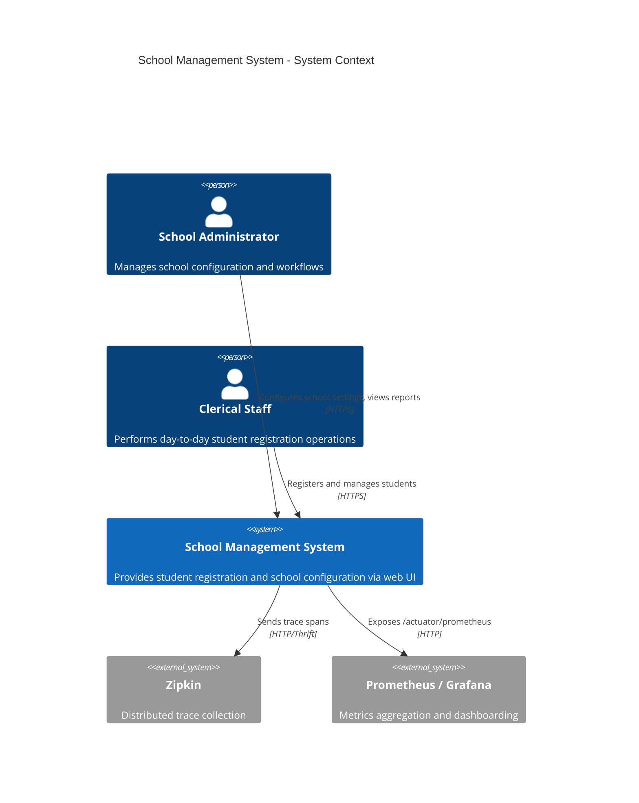
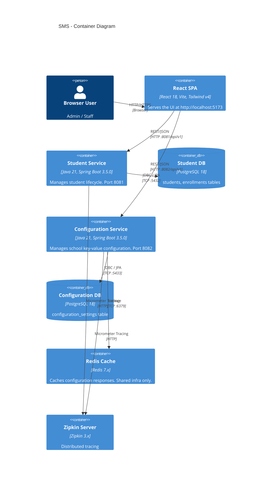
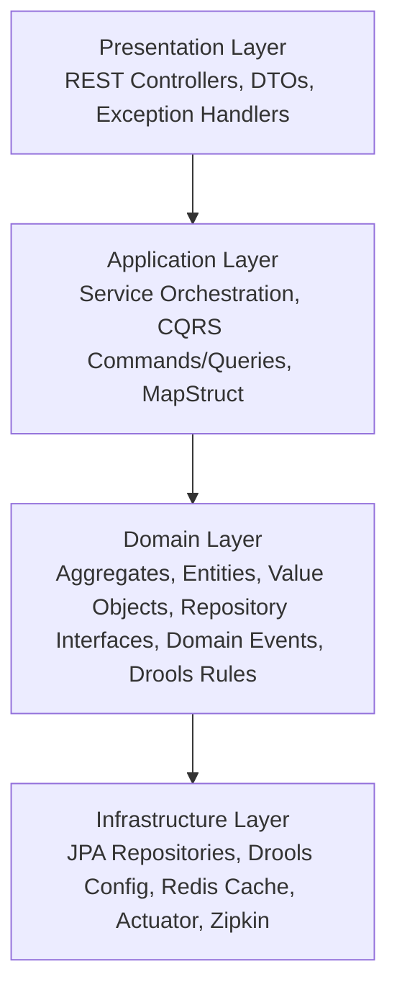

# 01 - System Architecture

## Cross-Reference Index
- Business Requirements: `specs/REQUIREMENTS.md`
- API Contracts: `specs/sms_api_specification.yaml`
- Frontend Design Tokens: `specs/FRONTEND_DESIGN_SPEC.md`
- Testing Strategy: `specs/TESTING_STRATEGY.md`
- Database Design: `specs/architecture/02-database-design.md`
- Security Architecture: `specs/architecture/04-security-architecture.md`

---

## 1. System Context

The School Management System (SMS) is a web-based platform serving school administrators and clerical staff. It is composed of two independently deployable microservices backed by isolated PostgreSQL databases, exposed via a React single-page application.


```mermaid
C4Context
    title School Management System - System Context

    Person(admin, "School Administrator", "Manages school configuration and workflows")
    Person(staff, "Clerical Staff", "Performs day-to-day student registration operations")

    System(sms, "School Management System", "Provides student registration and school configuration via web UI")

    System_Ext(zipkin, "Zipkin", "Distributed trace collection")
    System_Ext(prometheus, "Prometheus / Grafana", "Metrics aggregation and dashboarding")

    Rel(admin, sms, "Configures school settings, views reports", "HTTPS")
    Rel(staff, sms, "Registers and manages students", "HTTPS")
    Rel(sms, zipkin, "Sends trace spans", "HTTP/Thrift")
    Rel(sms, prometheus, "Exposes /actuator/prometheus", "HTTP")
```

---

## 2. Container Architecture


```mermaid
C4Container
    title SMS - Container Diagram

    Person(user, "Browser User", "Admin / Staff")

    Container(spa, "React SPA", "React 18, Vite, Tailwind v4", "Serves the UI at http://localhost:5173")

    Container(studentSvc, "Student Service", "Java 21, Spring Boot 3.5.0", "Manages student lifecycle. Port 8081")
    ContainerDb(studentDb, "Student DB", "PostgreSQL 18", "students, enrollments tables")

    Container(configSvc, "Configuration Service", "Java 21, Spring Boot 3.5.0", "Manages school key-value configuration. Port 8082")
    ContainerDb(configDb, "Configuration DB", "PostgreSQL 18", "configuration_settings table")

    Container(redis, "Redis Cache", "Redis 7.x", "Caches configuration responses. Shared infra only.")

    Container(zipkin, "Zipkin Server", "Zipkin 3.x", "Distributed tracing")

    Rel(user, spa, "HTTP/HTTPS", "Browser")
    Rel(spa, studentSvc, "REST/JSON", "HTTP :8081/api/v1")
    Rel(spa, configSvc, "REST/JSON", "HTTP :8082/api/v1")
    Rel(studentSvc, studentDb, "JDBC / JPA", "TCP :5432")
    Rel(configSvc, configDb, "JDBC / JPA", "TCP :5433")
    Rel(configSvc, redis, "Lettuce", "TCP :6379")
    Rel(studentSvc, zipkin, "Micrometer Tracing", "HTTP")
    Rel(configSvc, zipkin, "Micrometer Tracing", "HTTP")
```

**Key Constraints:**
- Student Service has NO access to Configuration DB and vice versa. Database-per-service is absolute.
- Redis is used only by Configuration Service for caching grouped settings.
- No synchronous inter-service calls in Phase 1.

---

## 3. Microservice Boundaries

| Service | Responsibility | Port | Database |
|---|---|---|---|
| Student Service | Student CRUD, enrollment history, age/mobile validation via Drools | 8081 | student_db (PostgreSQL :5432) |
| Configuration Service | School key-value configuration CRUD, grouped retrieval with Redis cache | 8082 | config_db (PostgreSQL :5433) |
| React SPA | Presentation, form validation, user interaction | 5173 | None |

### 3.1 Bounded Context: Student Management

Owns: `Student` aggregate root, `Enrollment` entity.

Business capabilities:
- Register a student (BR-1: age 3-18, BR-2: unique mobile)
- Update allowed fields: firstName, lastName, mobile, status
- Delete a student record
- List/search students by lastName or guardianName with pagination
- Manage enrollment history per student

### 3.2 Bounded Context: School Configuration

Owns: `ConfigurationSetting` aggregate root.

Business capabilities:
- Upsert configuration key-value pairs by category (GENERAL, ACADEMIC, FINANCIAL)
- Retrieve all settings optionally filtered by category
- Retrieve settings as a grouped map (cached in Redis)
- Delete individual settings

---

## 4. DDD Layered Architecture (Per Service)

Both microservices follow the same four-layer DDD structure. Internal domain models never leak into API contracts; all cross-layer data transfer uses explicit DTOs with MapStruct mappings.


```mermaid
graph TD
    A[Presentation Layer<br>REST Controllers, DTOs, Exception Handlers] --> B[Application Layer<br>Service Orchestration, CQRS Commands/Queries, MapStruct]
    B --> C[Domain Layer<br>Aggregates, Entities, Value Objects, Repository Interfaces, Domain Events, Drools Rules]
    C --> D[Infrastructure Layer<br>JPA Repositories, Drools Config, Redis Cache, Actuator, Zipkin]
```

### Layer Responsibilities

**Presentation Layer**
- Spring MVC `@RestController` classes only
- Input: DTOs validated with `@Valid` (Jakarta Bean Validation)
- Output: Response DTOs mapped from domain objects via MapStruct
- Global `@RestControllerAdvice` for RFC 7807 problem detail error responses
- `X-Correlation-ID` header propagated on every response

**Application Layer**
- Stateless `@Service` classes (one per aggregate root operation group)
- Implements CQRS separation: `*CommandService` for writes, `*QueryService` for reads
- Calls Domain repositories (interfaces, not JPA directly)
- Invokes Drools `KieSession` for business rule evaluation
- MapStruct mappers convert between domain models and DTOs

**Domain Layer**
- Rich domain models: aggregates enforce invariants in constructors/factory methods
- Repository interfaces defined here (dependency inversion)
- Value Objects for typed fields: `Mobile`, `AadhaarNumber`, `StudentId`
- No Spring annotations in the domain layer; pure Java
- Drools `.drl` rule files bound to domain objects

**Infrastructure Layer**
- JPA entity classes (`@Entity`) separate from domain models
- Spring Data JPA repository implementations
- `InfrastructureMapper` converts between JPA entities and domain objects
- Redis `@Cacheable` applied in service method stubs within infrastructure adapters
- Zipkin/Micrometer auto-configured via Spring Boot starters
- `HikariCP` connection pool configuration

---

## 5. Technology Stack (Exact Versions)

### Backend (Both Services)

| Component | Technology | Version |
|---|---|---|
| Language | Java | 21 (LTS) |
| Framework | Spring Boot | 3.5.0 |
| Persistence | Spring Data JPA + Hibernate | 6.x (bundled with Boot 3.5) |
| Database | PostgreSQL | 18+ |
| Business Rules | Drools | 9.44.0.Final |
| Object Mapping | MapStruct | 1.6.3 |
| Boilerplate | Lombok | 1.18.36 |
| Caching | Spring Cache + Redis (Lettuce) | Spring Boot 3.5.0 managed |
| Observability | Micrometer + Zipkin | Spring Boot 3.5.0 managed |
| API Docs | SpringDoc OpenAPI | 2.7.0 |
| Validation | Jakarta Bean Validation | 3.1 |
| Build | Maven | 3.9.x |
| Containerization | Docker | 27.x |

### Frontend

| Component | Technology | Version |
|---|---|---|
| Framework | React | 18.x |
| Build Tool | Vite | 5.x |
| Styling | Tailwind CSS | v4 |
| UI Library | shadcn/ui | Latest |
| HTTP Client | Axios | 1.7.x |
| Forms | React Hook Form | 7.x |
| Validation | Zod | 3.x |
| State (Global) | React Context API | - |
| Testing | Vitest + React Testing Library | Latest |
| E2E | Playwright | Latest |
| API Mocking | MSW (Mock Service Worker) | 2.x |

---

## 6. API Design Principles

All endpoints implement the contracts defined in `specs/sms_api_specification.yaml` (OpenAPI 3.0.3).

**Key Rules:**
1. All request/response bodies use explicit DTO classes; domain objects are never serialized directly.
2. Pagination follows the `PaginationMetadata` schema: `page`, `size`, `totalElements`, `totalPages`.
3. Errors follow RFC 7807 Problem Details: `type`, `title`, `status`, `detail`, `instance`, `timestamp`, `correlationId`, `errors[]`.
4. Optimistic locking on Student updates: `version` field in request body maps to `@Version` in JPA entity.
5. `X-Correlation-ID` UUID header is accepted on requests and echoed in error responses.
6. All timestamps are `TIMESTAMPTZ` in DB and `OffsetDateTime` in Java serialized as ISO-8601.

---

## 7. Observability Strategy

### 7.1 Structured Logging

All services emit structured JSON logs using Logback with the following mandatory fields:

```json
{
  "timestamp": "2026-02-12T10:00:00.000Z",
  "level": "INFO",
  "service": "student-service",
  "traceId": "4bf92f3577b34da6",
  "spanId": "00f067aa0ba902b7",
  "correlationId": "a1b2c3d4-...",
  "logger": "com.sms.student.application.StudentCommandService",
  "message": "Student registered successfully",
  "studentId": "STD-20260212-0001"
}
```

Logback configuration file: `src/main/resources/logback-spring.xml` using `net.logstash.logback:logstash-logback-encoder`.

### 7.2 Actuator Endpoints

Both services expose:

| Endpoint | Purpose |
|---|---|
| `GET /actuator/health` | Liveness and readiness probe |
| `GET /actuator/info` | Service version and metadata |
| `GET /actuator/metrics` | JVM and application metrics |
| `GET /actuator/prometheus` | Prometheus scrape endpoint |

### 7.3 Custom Metrics (Micrometer)

| Metric Name | Type | Description |
|---|---|---|
| `students.registered.total` | Counter | Total student registrations since startup |
| `students.deleted.total` | Counter | Total student deletions |
| `students.search.duration` | Timer | Duration of student search queries |
| `configurations.cache.hit` | Counter | Redis cache hits for configuration |
| `configurations.cache.miss` | Counter | Redis cache misses for configuration |

### 7.4 Distributed Tracing

- Micrometer Tracing with Zipkin reporter via `spring-boot-starter-actuator` + `micrometer-tracing-bridge-otel` + `opentelemetry-exporter-zipkin`
- Trace context propagated via W3C `traceparent` header
- Sampling rate: 100% in development, 10% in production

---

## 8. Docker Compose Topology

```yaml
# Illustrative topology (not the actual docker-compose.yml)
services:
  student-service:    # Port 8081, depends on student-db
  student-db:         # PostgreSQL 18, Port 5432
  config-service:     # Port 8082, depends on config-db, redis
  config-db:          # PostgreSQL 18, Port 5433
  redis:              # Redis 7.x, Port 6379
  zipkin:             # Zipkin 3.x, Port 9411
```

**Credential externalization:** All database credentials (`SPRING_DATASOURCE_URL`, `SPRING_DATASOURCE_USERNAME`, `SPRING_DATASOURCE_PASSWORD`) are provided via OS environment variables injected at container runtime. No credentials exist in source code or committed configuration files.

---

## 9. SOLID & Design Principles Enforcement

| Principle | Enforcement Mechanism |
|---|---|
| Single Responsibility | One `@Service` class per aggregate operation group; controllers delegate entirely to services |
| Open/Closed | Drools rules extend validation logic without modifying existing Java service code |
| Liskov Substitution | Repository interfaces in domain layer; JPA implementations are substitutable |
| Interface Segregation | Separate `*CommandService` and `*QueryService` interfaces; consumers depend only on what they use |
| Dependency Inversion | Domain layer depends on repository interfaces; infrastructure provides implementations |

---

## 10. Response Time SLA

- 95th percentile API response: < 200ms
- Enforcement: HikariCP pool sizing (min 5, max 20), Redis caching for configuration reads, `@EntityGraph` to prevent N+1 queries, indexed columns for all search predicates.
