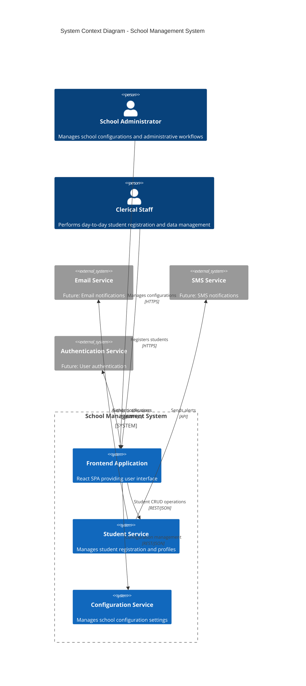
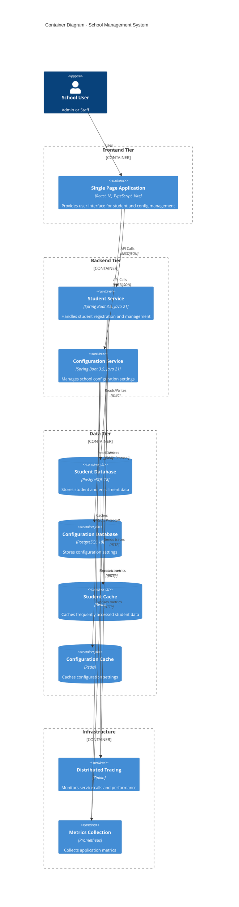
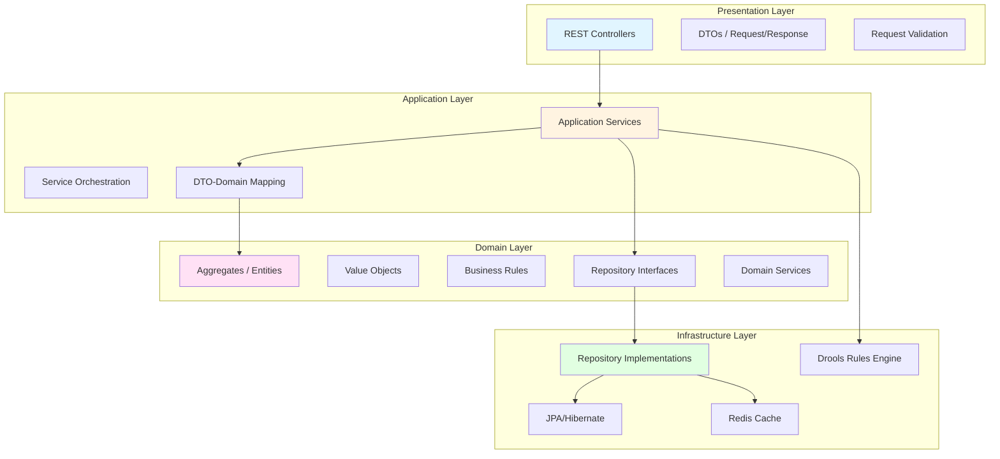

# System Architecture
**School Management System - Microservices Architecture**

**Version**: 1.0
**Date**: 2026-01-15
**Status**: Active

---

## Table of Contents

1. [Overview](#overview)
2. [Architecture Principles](#architecture-principles)
3. [System Context](#system-context)
4. [Microservices Boundaries](#microservices-boundaries)
5. [Container Architecture](#container-architecture)
6. [Component Architecture](#component-architecture)
7. [Technology Stack](#technology-stack)
8. [Communication Patterns](#communication-patterns)
9. [Deployment Architecture](#deployment-architecture)
10. [Scalability & Performance](#scalability--performance)

---

## Overview

### System Purpose
The School Management System (SMS) is a web-based digital platform designed to automate and optimize administrative workflows within schools. It provides a unified interface for managing student registration and school configuration through a microservices architecture.

### Architectural Style
- **Primary**: Microservices Architecture with Domain-Driven Design (DDD)
- **Secondary**: Layered Architecture within each microservice
- **Frontend**: Single Page Application (SPA) with Service-Oriented Architecture

### Design Goals
1. **Bounded Contexts**: Strict service boundaries aligned with business capabilities
2. **Database-per-Service**: Complete data isolation
3. **Independent Deployability**: Services can be deployed independently
4. **Technology Heterogeneity**: Services can evolve independently
5. **Fault Isolation**: Failure in one service doesn't cascade
6. **Horizontal Scalability**: Services scale independently based on load

---

## Architecture Principles

### 1. SOLID Principles

**Single Responsibility Principle (SRP)**
- Each class has one reason to change
- Services are organized around business capabilities

**Open/Closed Principle (OCP)**
- Extend behavior without modifying existing code
- Use interfaces and abstract classes for extensibility

**Liskov Substitution Principle (LSP)**
- Subtypes must be substitutable for their base types
- Enforce through interface-based design

**Interface Segregation Principle (ISP)**
- Clients should not depend on interfaces they don't use
- Small, focused interfaces over large, monolithic ones

**Dependency Inversion Principle (DIP)**
- Depend on abstractions, not concretions
- Repository pattern enforces this at infrastructure layer

### 2. Separation of Concerns
- Clear boundaries between presentation, application, domain, and infrastructure
- Each layer has distinct responsibilities
- No cross-layer dependencies (except inward)

### 3. Domain-Driven Design
- Ubiquitous Language throughout the codebase
- Rich Domain Models with business logic
- Bounded Contexts define service boundaries
- Aggregates protect invariants

### 4. API-First Design
- OpenAPI 3.0 specification as the source of truth
- Contract-first approach for all services
- Strict adherence to REST principles

---

## System Context

### System Context Diagram


```mermaid
C4Context
    title System Context Diagram - School Management System

    Person(admin, "School Administrator", "Manages school configurations and administrative workflows")
    Person(staff, "Clerical Staff", "Performs day-to-day student registration and data management")

    System_Boundary(sms, "School Management System") {
        System(frontend, "Frontend Application", "React SPA providing user interface")
        System(studentService, "Student Service", "Manages student registration and profiles")
        System(configService, "Configuration Service", "Manages school configuration settings")
    }

    System_Ext(email, "Email Service", "Future: Email notifications")
    System_Ext(sms_service, "SMS Service", "Future: SMS notifications")
    System_Ext(auth, "Authentication Service", "Future: User authentication")

    Rel(admin, frontend, "Manages configurations", "HTTPS")
    Rel(staff, frontend, "Registers students", "HTTPS")
    Rel(frontend, studentService, "Student CRUD operations", "REST/JSON")
    Rel(frontend, configService, "Configuration management", "REST/JSON")

    Rel_Back(email, studentService, "Sends notifications", "SMTP")
    Rel_Back(sms_service, studentService, "Sends alerts", "API")
    Rel(frontend, auth, "Authenticates users", "OAuth 2.0")

    UpdateLayoutConfig($c4ShapeInRow="3", $c4BoundaryInRow="1")
```

### External Dependencies
- **Future**: Authentication/Authorization service (OAuth 2.0 / OIDC)
- **Future**: Email/SMS notification services
- **Current**: None (self-contained system for Phase 1)

---

## Microservices Boundaries

### Service Decomposition Strategy

The system is decomposed into microservices based on **Business Capabilities** and **Bounded Contexts**, not database tables or nouns.

### 1. Student Service

**Bounded Context**: Student Lifecycle Management

**Business Capabilities**:
- Student Registration (BR-1: Age validation 3-18)
- Student Profile Management (BR-2: Mobile uniqueness)
- Student Status Management (Active/Inactive)
- Student Search and Retrieval
- Enrollment History Management

**Port**: 8081
**Database**: PostgreSQL (students_db)
**Cache**: Redis (student cache)

**Key Aggregates**:
- `Student` (Root)
- `Enrollment` (Entity within Student aggregate)

**Domain Events**:
- `StudentRegistered`
- `StudentUpdated`
- `StudentDeactivated`
- `EnrollmentCreated`

**API Surface**:
- `POST /api/v1/students` - Register student
- `GET /api/v1/students` - List/search students
- `GET /api/v1/students/{studentId}` - Get student details
- `PUT /api/v1/students/{studentId}` - Update student (restricted fields)
- `DELETE /api/v1/students/{studentId}` - Delete student
- `GET /api/v1/students/{studentId}/enrollment-history` - Get enrollment history
- `POST /api/v1/students/{studentId}/enrollment-history` - Add enrollment

### 2. Configuration Service

**Bounded Context**: School Configuration Management

**Business Capabilities**:
- Configuration CRUD (General, Academic, Financial)
- Configuration Retrieval by Category
- Configuration Versioning
- Grouped Configuration Retrieval

**Port**: 8082
**Database**: PostgreSQL (config_db)
**Cache**: Redis (config cache)

**Key Aggregates**:
- `Configuration` (Root)

**Domain Events**:
- `ConfigurationCreated`
- `ConfigurationUpdated`
- `ConfigurationDeleted`

**API Surface**:
- `GET /api/v1/configurations` - List all configurations
- `GET /api/v1/configurations?category={category}` - Filter by category
- `GET /api/v1/configurations/{category}/{key}` - Get specific configuration
- `PUT /api/v1/configurations/{category}/{key}` - Upsert configuration
- `DELETE /api/v1/configurations/{category}/{key}` - Delete configuration
- `GET /api/v1/configurations/grouped/{category}` - Get configurations as key-value map

### Service Communication Rules

**CRITICAL CONSTRAINTS**:

1. **Database-per-Service**: Absolute isolation. Student Service CANNOT access Configuration database, and vice versa.
2. **No Shared State**: Services communicate only via APIs or events (future).
3. **Contract Strictness**: All interactions via explicit DTOs. Internal domain models NEVER exposed.
4. **Stateless Design**: Services maintain no session state for horizontal scaling.

---

## Container Architecture

### Container Diagram


```mermaid
C4Container
    title Container Diagram - School Management System

    Person(user, "School User", "Admin or Staff")

    Container_Boundary(frontend_boundary, "Frontend Tier") {
        Container(spa, "Single Page Application", "React 18, TypeScript, Vite", "Provides user interface for student and config management")
    }

    Container_Boundary(backend_boundary, "Backend Tier") {
        Container(student_api, "Student Service", "Spring Boot 3.5, Java 21", "Handles student registration and management")
        Container(config_api, "Configuration Service", "Spring Boot 3.5, Java 21", "Manages school configuration settings")
    }

    Container_Boundary(data_boundary, "Data Tier") {
        ContainerDb(student_db, "Student Database", "PostgreSQL 18", "Stores student and enrollment data")
        ContainerDb(config_db, "Configuration Database", "PostgreSQL 18", "Stores configuration settings")
        ContainerDb(student_cache, "Student Cache", "Redis", "Caches frequently accessed student data")
        ContainerDb(config_cache, "Configuration Cache", "Redis", "Caches configuration settings")
    }

    Container_Boundary(infrastructure, "Infrastructure") {
        Container(zipkin, "Distributed Tracing", "Zipkin", "Monitors service calls and performance")
        Container(prometheus, "Metrics Collection", "Prometheus", "Collects application metrics")
    }

    Rel(user, spa, "Uses", "HTTPS")
    Rel(spa, student_api, "API Calls", "REST/JSON")
    Rel(spa, config_api, "API Calls", "REST/JSON")

    Rel(student_api, student_db, "Reads/Writes", "JDBC")
    Rel(config_api, config_db, "Reads/Writes", "JDBC")
    Rel(student_api, student_cache, "Caches", "Redis Protocol")
    Rel(config_api, config_cache, "Caches", "Redis Protocol")

    Rel(student_api, zipkin, "Sends traces", "HTTP")
    Rel(config_api, zipkin, "Sends traces", "HTTP")
    Rel(student_api, prometheus, "Exposes metrics", "HTTP")
    Rel(config_api, prometheus, "Exposes metrics", "HTTP")

    UpdateLayoutConfig($c4ShapeInRow="2", $c4BoundaryInRow="1")
```

### Container Responsibilities

#### Frontend Container (React SPA)
- **Technology**: React 18, TypeScript 5.x, Vite 5.x
- **Responsibilities**:
  - User interface rendering
  - Form validation (client-side)
  - API orchestration
  - State management (Context API)
  - Routing (React Router v6)
- **Deployment**: Nginx static hosting, Docker container
- **Port**: 3000 (dev), 80 (production)

#### Student Service Container
- **Technology**: Spring Boot 3.5.0, Java 21
- **Responsibilities**:
  - Student CRUD operations
  - Business rule enforcement (Drools)
  - Data validation
  - Transaction management
  - Cache management
- **Deployment**: Docker container
- **Port**: 8081

#### Configuration Service Container
- **Technology**: Spring Boot 3.5.0, Java 21
- **Responsibilities**:
  - Configuration management
  - Category-based filtering
  - Configuration versioning
  - Cache management
- **Deployment**: Docker container
- **Port**: 8082

---

## Component Architecture

### Layered Architecture within Microservices

Each microservice follows a strict **4-layer architecture**:


```mermaid
graph TB
    subgraph "Presentation Layer"
        REST[REST Controllers]
        DTO[DTOs / Request/Response]
        Validation[Request Validation]
    end

    subgraph "Application Layer"
        Service[Application Services]
        Orchestration[Service Orchestration]
        Mapper[DTO-Domain Mapping]
    end

    subgraph "Domain Layer"
        Aggregate[Aggregates / Entities]
        VO[Value Objects]
        Rules[Business Rules]
        RepoInterface[Repository Interfaces]
        DomainService[Domain Services]
    end

    subgraph "Infrastructure Layer"
        RepoImpl[Repository Implementations]
        JPA[JPA/Hibernate]
        DroolsEngine[Drools Rules Engine]
        Cache[Redis Cache]
    end

    REST --> Service
    Service --> Mapper
    Mapper --> Aggregate
    Service --> RepoInterface
    RepoInterface --> RepoImpl
    RepoImpl --> JPA
    Service --> DroolsEngine
    RepoImpl --> Cache

    style REST fill:#e1f5ff
    style Service fill:#fff4e1
    style Aggregate fill:#ffe1f5
    style RepoImpl fill:#e1ffe1
```

### Layer Responsibilities

#### 1. Presentation Layer
**Purpose**: API exposure and request/response handling

**Components**:
- `@RestController` classes
- Request/Response DTOs
- `@Valid` annotations for validation
- Exception handlers (`@ControllerAdvice`)

**Rules**:
- NO business logic
- NO direct database access
- DTOs ONLY (never expose domain models)
- Stateless controllers

**Example Structure**:
```
presentation/
├── controller/
│   ├── StudentController.java
│   └── EnrollmentController.java
├── dto/
│   ├── request/
│   │   ├── StudentCreateRequest.java
│   │   └── StudentUpdateRequest.java
│   └── response/
│       ├── StudentResponse.java
│       └── ErrorResponse.java
└── exception/
    └── GlobalExceptionHandler.java
```

#### 2. Application Layer
**Purpose**: Orchestration and coordination

**Components**:
- Application Services (`@Service`)
- DTO-Domain mapping (MapStruct)
- Transaction boundaries (`@Transactional`)
- CQRS separation (Commands vs Queries)

**Rules**:
- Orchestrates domain operations
- NO business logic (delegate to domain)
- Defines transaction boundaries
- Coordinates multiple aggregates

**Example Structure**:
```
application/
├── service/
│   ├── StudentApplicationService.java
│   └── EnrollmentApplicationService.java
├── mapper/
│   ├── StudentMapper.java
│   └── EnrollmentMapper.java
└── command/
    ├── RegisterStudentCommand.java
    └── UpdateStudentCommand.java
```

#### 3. Domain Layer
**Purpose**: Business logic and invariants

**Components**:
- Aggregates (rich domain models)
- Value Objects
- Repository Interfaces (port)
- Domain Services
- Business Rules

**Rules**:
- Contains ALL business logic
- Independent of frameworks
- No infrastructure dependencies
- Enforces invariants

**Example Structure**:
```
domain/
├── model/
│   ├── Student.java (Aggregate Root)
│   ├── Enrollment.java (Entity)
│   ├── Mobile.java (Value Object)
│   └── StudentStatus.java (Enum)
├── repository/
│   └── StudentRepository.java (Interface)
├── service/
│   └── StudentValidationService.java
└── exception/
    ├── StudentNotFoundException.java
    └── InvalidAgeException.java
```

#### 4. Infrastructure Layer
**Purpose**: Technical capabilities and external systems

**Components**:
- JPA Repository implementations
- Drools configuration
- Redis cache implementation
- Database migrations (Flyway/Liquibase)
- Actuator endpoints

**Rules**:
- Implements domain repository interfaces
- Handles persistence concerns
- Manages caching strategy
- NO business logic

**Example Structure**:
```
infrastructure/
├── persistence/
│   ├── entity/
│   │   ├── StudentEntity.java (JPA Entity)
│   │   └── EnrollmentEntity.java
│   ├── repository/
│   │   ├── StudentJpaRepository.java
│   │   └── StudentRepositoryImpl.java
│   └── mapper/
│       └── StudentEntityMapper.java
├── cache/
│   └── RedisCacheConfig.java
└── rules/
    ├── DroolsConfig.java
    └── rules/
        └── student-validation.drl
```

---

## Technology Stack

### Backend Technology Stack

#### Core Framework
- **Java**: 21 (LTS, Virtual Threads support)
- **Spring Boot**: 3.5.0
  - Spring Web MVC
  - Spring Data JPA
  - Spring Cache (Redis)
  - Spring Actuator
  - Spring Validation

#### Database
- **PostgreSQL**: 18+
  - Optimistic Locking (`@Version`)
  - JSONB for flexible data
  - Full-text search capabilities
- **Credentials**: Externalized via OS Environment Variables in Docker

#### Business Rules Engine
- **Drools**: 9.44.0.Final
  - Rule externalization
  - Decision tables
  - Complex validation logic

#### Caching
- **Redis**: Latest stable
  - Session-independent caching
  - TTL-based eviction
  - Pub/sub for cache invalidation

#### Observability
- **Zipkin**: Distributed tracing
- **Micrometer**: Metrics collection
- **Prometheus**: Metrics storage and querying
- **Spring Actuator**: Health checks, metrics endpoints

#### Mapping & Utilities
- **MapStruct**: DTO-Domain-Entity mapping (compile-time generation)
- **Lombok**: Boilerplate reduction
- **Jakarta Validation**: Bean validation
- **SLF4J + Logback**: Structured logging

#### Testing
- **JUnit 5**: Unit testing framework
- **Mockito**: Mocking framework
- **AssertJ**: Fluent assertions
- **TestContainers**: Integration testing with real databases
- **REST Assured**: API testing

### Frontend Technology Stack

#### Core Framework
- **React**: 18+ (Function components, Hooks)
- **TypeScript**: 5.x (Strict mode)
- **Vite**: 5.x (Build tool)

#### UI Framework
- **Tailwind CSS**: v4 (Utility-first styling)
- **Shadcn/ui**: Component library (Radix UI primitives)

#### Routing & State
- **React Router**: v6 (Client-side routing)
- **Context API**: Global state management

#### Forms & Validation
- **React Hook Form**: v7 (Form management)
- **Zod**: Schema validation (aligns with backend validation)

#### HTTP & Networking
- **Axios**: v1 (HTTP client, interceptors)

#### UI Components
- **Lucide React**: Icon library
- **Sonner**: Toast notifications

#### Testing
- **Vitest**: Unit and integration testing
- **React Testing Library**: Component testing
- **Playwright**: E2E testing
- **Mock Service Worker (MSW)**: API mocking

---

## Communication Patterns

### 1. Synchronous Communication (Current)

**REST API with JSON**

**Characteristics**:
- Request-Response pattern
- HTTP/HTTPS protocol
- JSON payload
- Stateless communication

**API Design Principles**:
- Resource-oriented URLs
- Standard HTTP methods (GET, POST, PUT, DELETE)
- HTTP status codes for responses
- Pagination for large datasets
- Filtering via query parameters

**Example Flow**:
```
Frontend → POST /api/v1/students → Student Service → PostgreSQL
                                        ↓
                                    Drools Validation
                                        ↓
                                    Redis Cache
                                        ↓
                                    201 Created Response
```

### 2. Error Handling

**RFC 7807 Problem Details**

All errors follow RFC 7807 standard:

```json
{
  "type": "https://api.school.com/errors/validation-error",
  "title": "Validation Error",
  "status": 400,
  "detail": "Student age must be between 3 and 18 years",
  "instance": "/api/v1/students",
  "timestamp": "2026-01-15T10:30:00Z",
  "correlationId": "550e8400-e29b-41d4-a716-446655440000",
  "errors": [
    {
      "field": "dateOfBirth",
      "message": "Age must be between 3 and 18 years",
      "code": "AGE_OUT_OF_RANGE"
    }
  ]
}
```

### 3. Request Tracing

**X-Correlation-ID Header**

- Generated at frontend or API Gateway
- Passed through all service calls
- Used for distributed tracing in Zipkin
- Included in all log entries

### 4. Future: Asynchronous Communication

**Event-Driven Architecture (Phase 2)**

- Message broker (RabbitMQ/Kafka)
- Domain events published after commits
- Eventual consistency between services
- Saga pattern for distributed transactions

---

## Deployment Architecture

### Docker Containerization

Each component runs in its own Docker container:

```yaml
# docker-compose.yml structure
services:
  frontend:
    image: schoolms/frontend:latest
    ports: ["80:80"]
    environment:
      - VITE_API_BASE_URL=http://api-gateway:8080

  student-service:
    image: schoolms/student-service:latest
    ports: ["8081:8081"]
    environment:
      - SPRING_DATASOURCE_URL=jdbc:postgresql://student-db:5432/students_db
      - SPRING_REDIS_HOST=redis
    depends_on: [student-db, redis]

  config-service:
    image: schoolms/config-service:latest
    ports: ["8082:8082"]
    environment:
      - SPRING_DATASOURCE_URL=jdbc:postgresql://config-db:5432/config_db
    depends_on: [config-db, redis]

  student-db:
    image: postgres:18
    environment:
      - POSTGRES_DB=students_db
      - POSTGRES_USER=${DB_USER}
      - POSTGRES_PASSWORD=${DB_PASSWORD}
    volumes: [student-data:/var/lib/postgresql/data]

  config-db:
    image: postgres:18
    environment:
      - POSTGRES_DB=config_db
    volumes: [config-data:/var/lib/postgresql/data]

  redis:
    image: redis:alpine
    ports: ["6379:6379"]

  zipkin:
    image: openzipkin/zipkin
    ports: ["9411:9411"]

  prometheus:
    image: prom/prometheus
    volumes: [./prometheus.yml:/etc/prometheus/prometheus.yml]
    ports: ["9090:9090"]
```

### Deployment Patterns

#### Development Environment
- Docker Compose
- Local PostgreSQL instances
- Shared Redis instance
- Hot reload for frontend (Vite dev server)

#### Production Environment
- Kubernetes cluster (future)
- Separate database instances
- Redis cluster
- Load balancer for services
- Horizontal pod autoscaling

### Networking

```
Internet
    ↓
Load Balancer (Nginx)
    ↓
Frontend Container (port 80)
    ↓
Backend Services (ports 8081, 8082)
    ↓
Database Containers (internal network only)
```

### Environment Configuration

**Development**:
```env
SPRING_PROFILES_ACTIVE=dev
SPRING_DATASOURCE_URL=jdbc:postgresql://localhost:5432/students_db
SPRING_REDIS_HOST=localhost
```

**Production**:
```env
SPRING_PROFILES_ACTIVE=prod
SPRING_DATASOURCE_URL=${DB_URL_FROM_SECRET}
SPRING_REDIS_HOST=${REDIS_HOST_FROM_CONFIG}
LOGGING_LEVEL_ROOT=WARN
```

---

## Scalability & Performance

### Performance Requirements

| Metric | Target | Measurement |
|--------|--------|-------------|
| API Response Time | < 200ms | 95th percentile |
| Database Query Time | < 50ms | Average |
| Cache Hit Ratio | > 80% | Frequently accessed data |
| Concurrent Users | 100 users | Phase 1 |
| Throughput | 50 req/sec | Per service |

### Horizontal Scaling Strategy

#### Stateless Design
- No session state in services
- All state in database or cache
- Enables multiple service instances

#### Database Scaling
- **Read Replicas**: For read-heavy operations (student search)
- **Connection Pooling**: HikariCP with optimized settings
- **Indexing**: Strategic indexes on search fields

```sql
-- Student table indexes
CREATE INDEX idx_student_last_name ON students(last_name);
CREATE INDEX idx_student_mobile ON students(mobile);
CREATE INDEX idx_student_status ON students(status);
```

#### Caching Strategy

**Redis Cache Layers**:

1. **Entity Cache**: Frequently accessed students
   - TTL: 15 minutes
   - Key pattern: `student:{studentId}`

2. **Query Cache**: Search results
   - TTL: 5 minutes
   - Key pattern: `students:search:{query_hash}`

3. **Configuration Cache**: System configurations
   - TTL: 1 hour
   - Key pattern: `config:{category}:{key}`

**Cache Invalidation**:
- Write-through strategy
- Invalidate on UPDATE/DELETE operations
- Automatic TTL expiration

### N+1 Query Prevention

**Use JPA EntityGraph**:

```java
@EntityGraph(attributePaths = {"enrollments"})
List<Student> findAllWithEnrollments();
```

**Use Batch Fetching**:

```java
@BatchSize(size = 25)
private List<Enrollment> enrollments;
```

### Performance Monitoring

**Metrics to Track**:
- `http.server.requests` (response times, status codes)
- `students.registered.total` (business metric)
- `cache.gets` and `cache.puts` (cache effectiveness)
- `db.connection.pool.usage` (connection pool health)
- `jvm.memory.used` (memory consumption)

**Actuator Endpoints**:
- `/actuator/health` - Service health
- `/actuator/metrics` - Custom metrics
- `/actuator/prometheus` - Prometheus scraping endpoint

### Load Balancing

**Future: Kubernetes Deployment**

```yaml
apiVersion: v1
kind: Service
metadata:
  name: student-service
spec:
  type: LoadBalancer
  selector:
    app: student-service
  ports:
    - port: 8081
      targetPort: 8081
---
apiVersion: apps/v1
kind: Deployment
metadata:
  name: student-service
spec:
  replicas: 3  # Horizontal scaling
  selector:
    matchLabels:
      app: student-service
  template:
    spec:
      containers:
      - name: student-service
        image: schoolms/student-service:latest
        resources:
          requests:
            memory: "512Mi"
            cpu: "500m"
          limits:
            memory: "1Gi"
            cpu: "1000m"
```

---

## Logging Strategy

### Structured Logging

**Log Format**: JSON structured logs for centralized logging

```json
{
  "timestamp": "2026-01-15T10:30:00.123Z",
  "level": "INFO",
  "service": "student-service",
  "correlationId": "550e8400-e29b-41d4-a716-446655440000",
  "thread": "http-nio-8081-exec-1",
  "logger": "com.school.student.application.StudentService",
  "message": "Student registered successfully",
  "context": {
    "studentId": "STD-20241206-0001",
    "mobile": "98XXXXXXXX",
    "processingTimeMs": 145
  }
}
```

### Log Levels

- **ERROR**: System failures, exceptions
- **WARN**: Business rule violations, recoverable errors
- **INFO**: Key business events (student registered, config updated)
- **DEBUG**: Detailed flow information (dev/staging only)
- **TRACE**: Verbose debugging (local only)

### Log Aggregation

**Future: ELK Stack**
- Elasticsearch: Log storage and indexing
- Logstash: Log processing and enrichment
- Kibana: Log visualization and searching

---

## Security Considerations

### Current Phase (Phase 1)
- No authentication (external system)
- Input validation at all layers
- SQL injection prevention (Prepared Statements)
- XSS prevention (React escaping, Content Security Policy)
- CORS configuration for frontend-backend communication

### Future Phases
- OAuth 2.0 / OpenID Connect authentication
- JWT token-based authorization
- Role-Based Access Control (RBAC)
- API rate limiting
- Audit logging for sensitive operations

**See**: `04-security-architecture.md` for detailed security design

---

## Appendix

### Key Architectural Decisions

| Decision | Rationale |
|----------|-----------|
| Microservices over Monolith | Independent scalability, technology flexibility, fault isolation |
| Database-per-Service | Data autonomy, no shared coupling, independent schema evolution |
| Drools for Business Rules | Externalized rules, non-developer rule authoring, complex validation logic |
| Redis for Caching | High performance, simple data structures, TTL support |
| React SPA | Rich user experience, component reusability, large ecosystem |
| PostgreSQL | ACID compliance, JSON support, full-text search, mature tooling |

### Trade-offs

| Choice | Benefit | Cost |
|--------|---------|------|
| Microservices | Scalability, independence | Increased complexity, distributed transactions |
| Docker Containers | Portability, isolation | Resource overhead, orchestration complexity |
| Redis Cache | Performance | Cache invalidation complexity, eventual consistency |
| Rich Domain Models | Business logic centralization | Learning curve, more upfront design |

---

**End of System Architecture Document**
