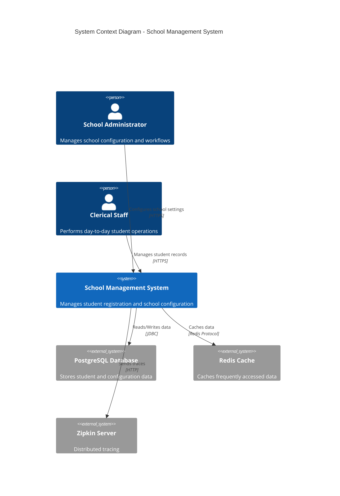
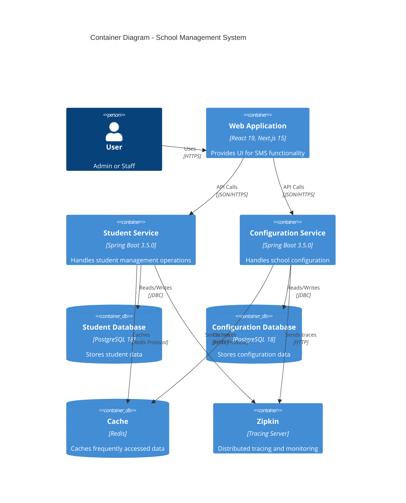
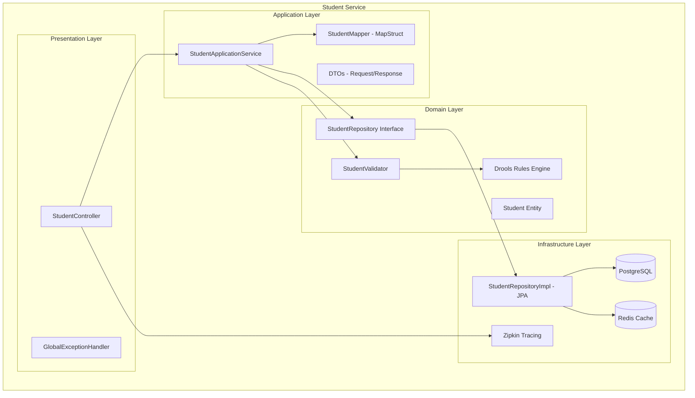
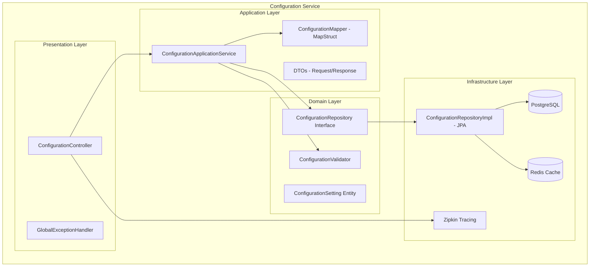
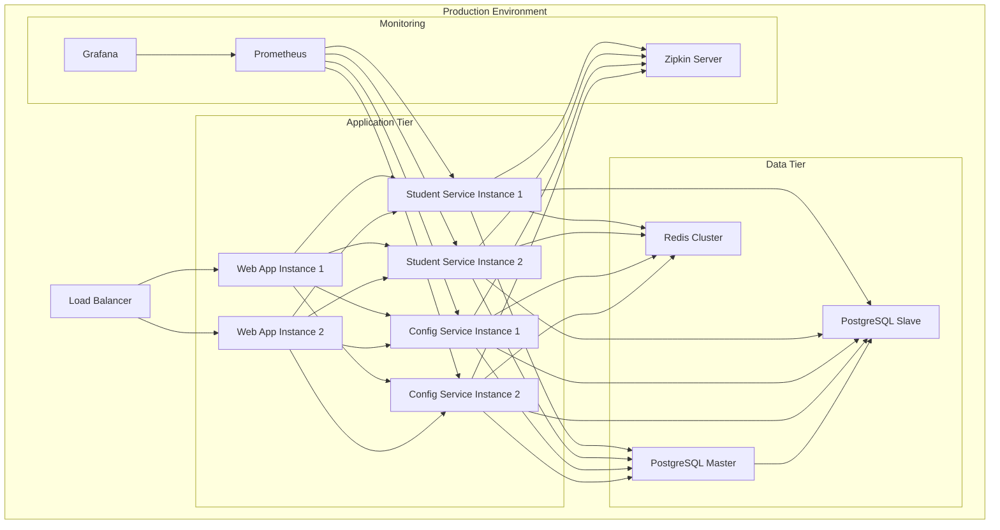

# System Architecture

## 1. Overview

The School Management System (SMS) is a web-based platform designed using microservices architecture to manage student registration and school configuration. This document defines the high-level system structure, architectural patterns, and design principles.

## 2. Architectural Style

### 2.1 Microservices Architecture
The system is decomposed into two independent microservices:
- **Student Service**: Manages student registration, profiles, and operations
- **Configuration Service**: Manages school configuration settings

### 2.2 Domain-Driven Design (DDD) with Layered Architecture
Each microservice follows a strict layered architecture:

```
Presentation Layer (Controllers/REST API)
          ↓
Application Layer (Use Cases/Services)
          ↓
Domain Layer (Business Logic/Entities)
          ↓
Infrastructure Layer (JPA/Database/External Systems)
```

## 3. System Context Diagram


```mermaid
C4Context
    title System Context Diagram - School Management System

    Person(admin, "School Administrator", "Manages school configuration and workflows")
    Person(staff, "Clerical Staff", "Performs day-to-day student operations")

    System(sms, "School Management System", "Manages student registration and school configuration")

    System_Ext(postgres, "PostgreSQL Database", "Stores student and configuration data")
    System_Ext(redis, "Redis Cache", "Caches frequently accessed data")
    System_Ext(zipkin, "Zipkin Server", "Distributed tracing")

    Rel(admin, sms, "Configures school settings", "HTTPS")
    Rel(staff, sms, "Manages student records", "HTTPS")
    Rel(sms, postgres, "Reads/Writes data", "JDBC")
    Rel(sms, redis, "Caches data", "Redis Protocol")
    Rel(sms, zipkin, "Sends traces", "HTTP")
```

## 4. Container Diagram


```mermaid
C4Container
    title Container Diagram - School Management System

    Person(user, "User", "Admin or Staff")

    Container(web, "Web Application", "React 19, Next.js 15", "Provides UI for SMS functionality")
    Container(studentSvc, "Student Service", "Spring Boot 3.5.0", "Handles student management operations")
    Container(configSvc, "Configuration Service", "Spring Boot 3.5.0", "Handles school configuration")

    ContainerDb(studentDb, "Student Database", "PostgreSQL 18", "Stores student data")
    ContainerDb(configDb, "Configuration Database", "PostgreSQL 18", "Stores configuration data")
    ContainerDb(cache, "Cache", "Redis", "Caches frequently accessed data")

    Container(zipkin, "Zipkin", "Tracing Server", "Distributed tracing and monitoring")

    Rel(user, web, "Uses", "HTTPS")
    Rel(web, studentSvc, "API Calls", "JSON/HTTPS")
    Rel(web, configSvc, "API Calls", "JSON/HTTPS")

    Rel(studentSvc, studentDb, "Reads/Writes", "JDBC")
    Rel(configSvc, configDb, "Reads/Writes", "JDBC")

    Rel(studentSvc, cache, "Caches", "Redis Protocol")
    Rel(configSvc, cache, "Caches", "Redis Protocol")

    Rel(studentSvc, zipkin, "Sends traces", "HTTP")
    Rel(configSvc, zipkin, "Sends traces", "HTTP")
```

## 5. Component Diagram - Student Service


```mermaid
graph TB
    subgraph "Student Service"
        subgraph "Presentation Layer"
            SC[StudentController]
            EH[GlobalExceptionHandler]
        end

        subgraph "Application Layer"
            SS[StudentApplicationService]
            SM[StudentMapper - MapStruct]
            DTO[DTOs - Request/Response]
        end

        subgraph "Domain Layer"
            SE[Student Entity]
            SR[StudentRepository Interface]
            SV[StudentValidator]
            DR[Drools Rules Engine]
        end

        subgraph "Infrastructure Layer"
            SRI[StudentRepositoryImpl - JPA]
            DB[(PostgreSQL)]
            RC[(Redis Cache)]
            ZK[Zipkin Tracing]
        end
    end

    SC --> SS
    SS --> SM
    SS --> SR
    SS --> SV
    SV --> DR
    SR --> SRI
    SRI --> DB
    SRI --> RC
    SC --> ZK
```

## 6. Component Diagram - Configuration Service


```mermaid
graph TB
    subgraph "Configuration Service"
        subgraph "Presentation Layer"
            CC[ConfigurationController]
            EH[GlobalExceptionHandler]
        end

        subgraph "Application Layer"
            CS[ConfigurationApplicationService]
            CM[ConfigurationMapper - MapStruct]
            DTO[DTOs - Request/Response]
        end

        subgraph "Domain Layer"
            CE[ConfigurationSetting Entity]
            CR[ConfigurationRepository Interface]
            CV[ConfigurationValidator]
        end

        subgraph "Infrastructure Layer"
            CRI[ConfigurationRepositoryImpl - JPA]
            DB[(PostgreSQL)]
            RC[(Redis Cache)]
            ZK[Zipkin Tracing]
        end
    end

    CC --> CS
    CS --> CM
    CS --> CR
    CS --> CV
    CR --> CRI
    CRI --> DB
    CRI --> RC
    CC --> ZK
```

## 7. Architectural Principles

### 7.1 SOLID Principles

**Single Responsibility Principle (SRP)**
- Each class has one reason to change
- Controllers handle only HTTP concerns
- Services contain only business logic
- Repositories handle only data access

**Open/Closed Principle (OCP)**
- Use interfaces for repositories and services
- Extension through inheritance/composition
- Closed for modification, open for extension

**Liskov Substitution Principle (LSP)**
- Implementations must be substitutable for their interfaces
- All repository implementations must honor the contract

**Interface Segregation Principle (ISP)**
- Create specific interfaces rather than general-purpose ones
- Example: StudentReadRepository vs StudentWriteRepository

**Dependency Inversion Principle (DIP)**
- High-level modules depend on abstractions
- Infrastructure depends on domain, not vice versa
- Use dependency injection throughout

### 7.2 Separation of Concerns
- Clear layer boundaries with defined responsibilities
- No business logic in controllers
- No database concerns in domain layer
- DTOs at layer boundaries prevent coupling

### 7.3 Interface-Based Design
- All repositories defined as interfaces
- Services depend on interfaces, not implementations
- Enables testing through mocking
- Facilitates technology changes

## 8. Cross-Cutting Concerns

### 8.1 Observability Strategy

**Distributed Tracing (Zipkin)**
```yaml
Implementation:
  - Add spring-cloud-sleuth dependency
  - Configure Zipkin endpoint
  - Generate correlation IDs for all requests
  - Propagate trace context across services

Correlation ID Format:
  - Header: X-Correlation-ID
  - Format: UUID v4
  - Logged in all application logs
```

**Structured Logging**
```yaml
Standards:
  - Use SLF4J with Logback
  - JSON format for production
  - Include correlation ID in all logs
  - Log Levels:
      ERROR: System errors requiring immediate attention
      WARN: Business rule violations, invalid requests
      INFO: Business events (student created, updated)
      DEBUG: Detailed flow information (dev only)

Required Fields:
  - timestamp (ISO 8601)
  - correlationId
  - serviceName
  - level
  - message
  - exception (if present)
  - userId (if authenticated)
```

**Metrics (Micrometer)**
```yaml
Custom Metrics to Track:
  - students.registered.total (Counter)
  - students.active.count (Gauge)
  - students.registration.duration (Timer)
  - configuration.updates.total (Counter)
  - cache.hit.ratio (Gauge)
  - api.request.duration (Timer)
  - database.query.duration (Timer)
```

### 8.2 Error Handling Strategy

**Global Exception Handler**
- Implement @ControllerAdvice for centralized error handling
- Return RFC 7807 Problem Details format
- Map domain exceptions to HTTP status codes
- Never expose stack traces in production

**Exception Hierarchy**
```
RuntimeException
  ├── DomainException (400 Bad Request)
  │   ├── ValidationException
  │   ├── BusinessRuleException
  │   └── DuplicateResourceException
  ├── ResourceNotFoundException (404 Not Found)
  └── InfrastructureException (500 Internal Server Error)
```

### 8.3 Caching Strategy

**Redis Cache Configuration**
```yaml
Cache Policies:
  - Student by ID: TTL 1 hour
  - Configuration by Category: TTL 4 hours
  - Student Search Results: TTL 15 minutes

Cache Eviction:
  - Evict on UPDATE or DELETE operations
  - Use cache-aside pattern
  - Implement cache warming for critical data

Cache Keys:
  - student:id:{studentId}
  - config:category:{category}
  - student:search:{hash(searchParams)}
```

## 9. Technology Stack Rationale

### 9.1 Backend Stack

| Technology | Version | Rationale |
|------------|---------|-----------|
| Java | 21 | Latest LTS with virtual threads, records, pattern matching |
| Spring Boot | 3.5.0 | Production-ready framework with excellent ecosystem |
| Spring Data JPA | 3.5.x | Simplifies data access, supports optimistic locking |
| PostgreSQL | 18+ | ACID compliance, JSON support, mature ecosystem |
| Drools | 9.44.0.Final | Declarative business rules, externalized validation logic |
| Redis | 7.x | High-performance caching, sub-millisecond latency |
| MapStruct | 1.5.x | Compile-time DTO mapping, type-safe, performant |
| Lombok | 1.18.x | Reduces boilerplate, improves code readability |
| Zipkin | 2.x | Distributed tracing, performance monitoring |
| Micrometer | 1.x | Vendor-neutral metrics, Prometheus integration |

**Key Compatibility Note (from LESSONS_LEARNED.md):**
- Spring Boot 3.5.0 requires SpringDoc OpenAPI 2.7.0+
- Always verify compatibility matrix before upgrades

### 9.2 Frontend Stack

| Technology | Version | Rationale |
|------------|---------|-----------|
| React | 19 | Component-based UI, excellent ecosystem |
| Next.js | 15 | App Router, SSR/SSG support, optimized performance |
| TypeScript | 5.x | Type safety, better IDE support, fewer runtime errors |
| Tailwind CSS | 3.x | Utility-first CSS, rapid UI development |
| React Router | 6.x | Client-side routing, type-safe navigation |
| React Query | 4.x | Server state management, automatic caching |
| React Hook Form | 7.x | Performant forms, minimal re-renders |
| Zod | 3.x | Type-safe schema validation, integrates with RHF |
| Playwright | 1.x | Reliable E2E testing, cross-browser support |
| Vitest | 1.x | Fast unit testing, Vite-native |

## 10. Performance Requirements

### 10.1 API Response Time Targets
```yaml
95th Percentile Response Times:
  - GET /api/v1/students/{id}: <100ms
  - GET /api/v1/students (search): <200ms
  - POST /api/v1/students: <150ms
  - PUT /api/v1/students/{id}: <150ms
  - DELETE /api/v1/students/{id}: <100ms
  - GET /api/v1/configurations: <100ms
  - PUT /api/v1/configurations: <150ms
```

### 10.2 Database Performance
```yaml
Connection Pooling (HikariCP):
  - Maximum Pool Size: 20
  - Minimum Idle: 5
  - Connection Timeout: 30s
  - Idle Timeout: 600s
  - Max Lifetime: 1800s

Query Optimization:
  - Use EntityGraphs to prevent N+1 queries
  - Index all foreign keys
  - Implement pagination for list operations
  - Use batch operations for bulk inserts
```

### 10.3 Caching Strategy
```yaml
Cache Hit Ratio Target: >80%

Cached Operations:
  - Student by ID lookup
  - Configuration by category
  - Frequently accessed reference data

Cache-Through Pattern:
  - Write to database first
  - Then update cache
  - Ensures consistency
```

## 11. Scalability Design

### 11.1 Stateless Services
- No in-memory session storage
- All state persisted to database or cache
- Enables horizontal scaling
- Load balancer compatible

### 11.2 Database Scaling
- Master-slave replication for read scaling
- Connection pooling to optimize resource usage
- Read replicas for reporting queries
- Partition strategy for future growth

### 11.3 Concurrent Access Handling
```yaml
Optimistic Locking:
  - Use @Version annotation on all entities
  - Prevents lost updates in concurrent modifications
  - Returns 409 Conflict on version mismatch

Implementation:
  @Version
  private Long version;
```

## 12. Deployment Architecture


```mermaid
graph TB
    subgraph "Production Environment"
        LB[Load Balancer]

        subgraph "Application Tier"
            WEB1[Web App Instance 1]
            WEB2[Web App Instance 2]
            SS1[Student Service Instance 1]
            SS2[Student Service Instance 2]
            CS1[Config Service Instance 1]
            CS2[Config Service Instance 2]
        end

        subgraph "Data Tier"
            PG_MASTER[PostgreSQL Master]
            PG_SLAVE[PostgreSQL Slave]
            REDIS[Redis Cluster]
        end

        subgraph "Monitoring"
            ZIPKIN[Zipkin Server]
            PROMETHEUS[Prometheus]
            GRAFANA[Grafana]
        end
    end

    LB --> WEB1
    LB --> WEB2
    WEB1 --> SS1
    WEB1 --> SS2
    WEB1 --> CS1
    WEB1 --> CS2
    WEB2 --> SS1
    WEB2 --> SS2
    WEB2 --> CS1
    WEB2 --> CS2

    SS1 --> PG_MASTER
    SS2 --> PG_MASTER
    CS1 --> PG_MASTER
    CS2 --> PG_MASTER

    SS1 --> PG_SLAVE
    SS2 --> PG_SLAVE
    CS1 --> PG_SLAVE
    CS2 --> PG_SLAVE

    PG_MASTER --> PG_SLAVE

    SS1 --> REDIS
    SS2 --> REDIS
    CS1 --> REDIS
    CS2 --> REDIS

    SS1 --> ZIPKIN
    SS2 --> ZIPKIN
    CS1 --> ZIPKIN
    CS2 --> ZIPKIN

    PROMETHEUS --> SS1
    PROMETHEUS --> SS2
    PROMETHEUS --> CS1
    PROMETHEUS --> CS2
    GRAFANA --> PROMETHEUS
```

## 13. Development Environment Setup

### 13.1 Required Tools
```yaml
Backend Development:
  - Java 21 (OpenJDK or Oracle)
  - Maven 3.9+
  - Docker & Docker Compose
  - IntelliJ IDEA (recommended) or Eclipse
  - PostgreSQL 18+ (via Docker)
  - Redis 7.x (via Docker)

Frontend Development:
  - Node.js 20.x LTS
  - npm 10.x or yarn 4.x
  - VS Code (recommended)
  - React Developer Tools
  - Redux DevTools
```

### 13.2 Local Development Ports
```yaml
Frontend:
  - Vite Dev Server: 5173
  - React Dev Server: 3000
  - Next.js Dev Server: 3000

Backend:
  - Student Service: 8081
  - Configuration Service: 8082
  - PostgreSQL: 5432
  - Redis: 6379
  - Zipkin: 9411

Note: CORS must be configured for all frontend ports
Reference: LESSONS_LEARNED.md [D-001]
```

## 14. Key Architectural Decisions

### ADR-001: Microservices Over Monolith
**Decision:** Implement student and configuration as separate microservices
**Rationale:**
- Independent deployment and scaling
- Technology flexibility
- Team autonomy
- Fault isolation

**Consequences:**
- Increased operational complexity
- Need for distributed tracing
- Inter-service communication overhead

### ADR-002: PostgreSQL for Data Persistence
**Decision:** Use PostgreSQL as primary database
**Rationale:**
- ACID compliance critical for student records
- Excellent JSON support for flexible configuration
- Mature ecosystem and tooling
- Strong community support

**Consequences:**
- Need replication strategy for scaling reads
- Backup/recovery procedures required
- Database migration tooling needed (Flyway)

### ADR-003: Redis for Caching
**Decision:** Use Redis for distributed caching
**Rationale:**
- Sub-millisecond read performance
- Supports complex data structures
- Pub/Sub for cache invalidation
- Widely adopted and battle-tested

**Consequences:**
- Additional infrastructure to manage
- Cache warming strategy needed
- Consistency considerations

### ADR-004: Drools for Business Rules
**Decision:** Use Drools rules engine for validation
**Rationale:**
- Externalize business rules from code
- Non-technical users can modify rules
- Declarative and maintainable
- Excellent Spring integration

**Consequences:**
- Learning curve for team
- Rule testing strategy required
- Performance overhead (mitigated by caching)

### ADR-005: JWT for Authentication (Future)
**Decision:** Use JWT for stateless authentication
**Rationale:**
- Stateless enables horizontal scaling
- No server-side session storage
- Standard industry practice
- Mobile-friendly

**Consequences:**
- Token revocation complexity
- Token size larger than session IDs
- Refresh token strategy needed

**Note:** Phase 1 assumes external authentication. This is documented for Phase 2.

## 15. Quality Attributes

### 15.1 Maintainability
- Clear layer separation
- Interface-based design
- Comprehensive documentation
- Automated testing (>80% coverage)

### 15.2 Testability
- Dependency injection throughout
- Mock-friendly interfaces
- TestContainers for integration tests
- Isolated unit tests

### 15.3 Reliability
- Optimistic locking prevents data corruption
- Comprehensive input validation
- Graceful error handling
- Database transactions

### 15.4 Performance
- Response times <200ms (95th percentile)
- Efficient database queries
- Caching for frequent reads
- Connection pooling

### 15.5 Security
- Input validation at all entry points
- Prepared statements prevent SQL injection
- CORS configuration
- HTTPS in production

## 16. Compliance with LESSONS_LEARNED

### Backend Directives Applied
```yaml
[D-001] Spring OpenAPI Compatibility:
  - Spring Boot 3.5.0 requires SpringDoc OpenAPI 2.7.0+
  - Version compatibility verified in technology stack
  - CI/CD must include compatibility checks

[D-002] CORS Configuration:
  - Document all frontend dev server ports
  - Configure CORS for ports: 3000, 5173
  - Environment-based CORS configuration recommended
  - Integration tests must verify CORS
```

## 17. Next Steps

After reviewing this architecture document, proceed to:
1. **Database Design** (02-database-design.md) - ERD and schema definitions
2. **API Specification** (03-api-specification.md) - RESTful API contracts
3. **Security Architecture** (04-security-architecture.md) - Security patterns
4. **Backend Implementation Guide** (05-backend-implementation-guide.md) - Development standards
5. **Frontend Implementation Guide** (06-frontend-implementation-guide.md) - UI patterns
6. **Testing Strategy** (07-testing-strategy.md) - Quality assurance

---

**Document Version:** 1.0
**Last Updated:** 2025-12-06
**Status:** APPROVED
