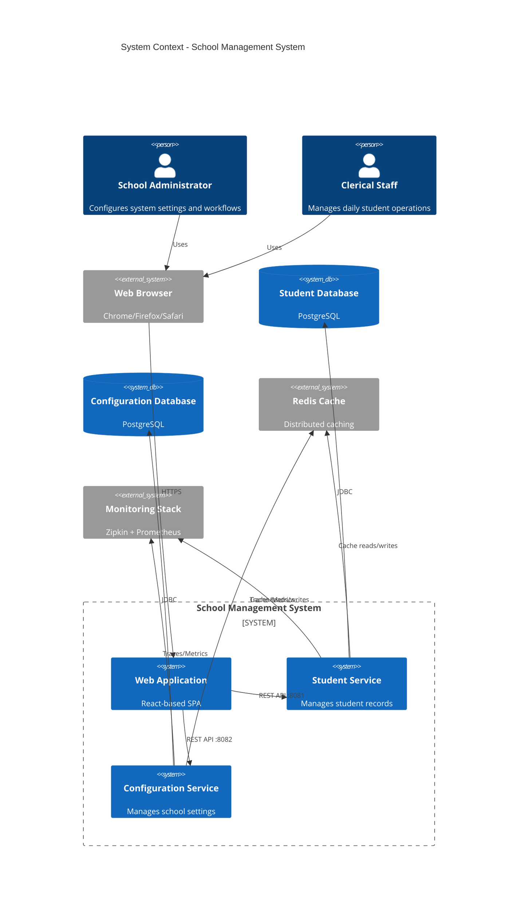
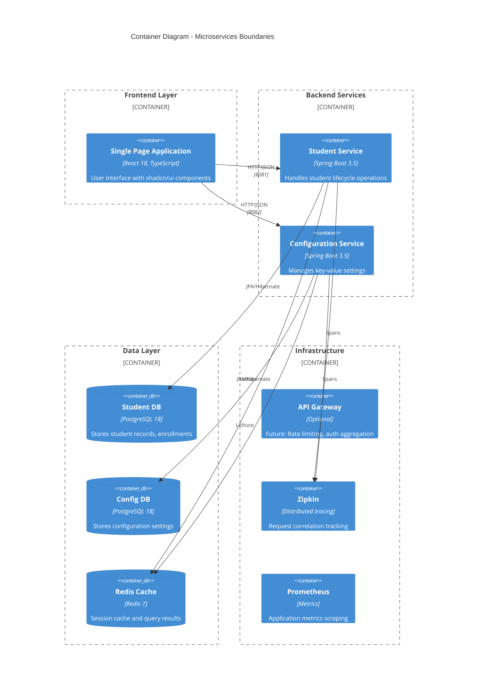
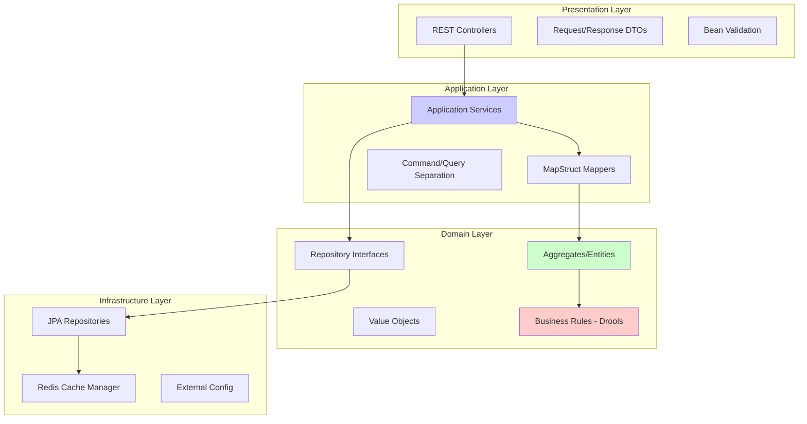
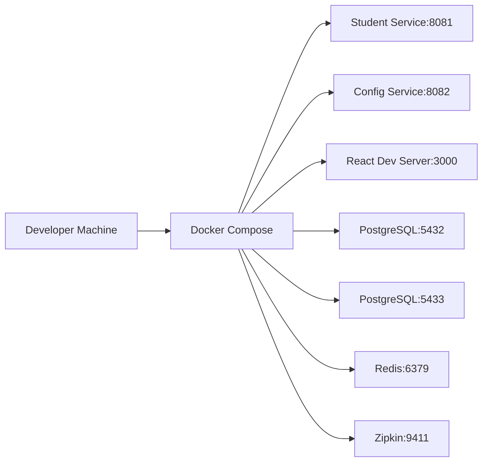

# System Architecture Specification
**School Management System (SMS)**
Version: 1.0.0
Last Updated: 2026-01-28

---

## 1. Executive Summary

The School Management System is a microservices-based web application designed to automate student registration and school configuration workflows. The system employs Domain-Driven Design (DDD) principles with a clear separation between the Student Management and Configuration Management bounded contexts.

### 1.1 Core Architectural Principles
- **Microservices Architecture**: Database-per-service pattern with absolute isolation
- **Bounded Contexts**: Business capability-driven service boundaries
- **Contract-First Design**: OpenAPI 3.0 specification as the single source of truth
- **Layered Architecture**: Presentation → Application → Domain → Infrastructure
- **Stateless Design**: Horizontal scalability with no session affinity requirements

---

## 2. System Context Diagram


```mermaid
C4Context
    title System Context - School Management System

    Person(admin, "School Administrator", "Configures system settings and workflows")
    Person(staff, "Clerical Staff", "Manages daily student operations")

    System_Boundary(sms, "School Management System") {
        System(webapp, "Web Application", "React-based SPA")
        System(studentApi, "Student Service", "Manages student records")
        System(configApi, "Configuration Service", "Manages school settings")
    }

    System_Ext(browser, "Web Browser", "Chrome/Firefox/Safari")
    SystemDb(studentDb, "Student Database", "PostgreSQL")
    SystemDb(configDb, "Configuration Database", "PostgreSQL")
    System_Ext(cache, "Redis Cache", "Distributed caching")
    System_Ext(monitor, "Monitoring Stack", "Zipkin + Prometheus")

    Rel(admin, browser, "Uses")
    Rel(staff, browser, "Uses")
    Rel(browser, webapp, "HTTPS")
    Rel(webapp, studentApi, "REST API :8081")
    Rel(webapp, configApi, "REST API :8082")
    Rel(studentApi, studentDb, "JDBC")
    Rel(configApi, configDb, "JDBC")
    Rel(studentApi, cache, "Cache reads/writes")
    Rel(configApi, cache, "Cache reads/writes")
    Rel(studentApi, monitor, "Traces/Metrics")
    Rel(configApi, monitor, "Traces/Metrics")
```

---

## 3. Container Architecture

### 3.1 Container Diagram


```mermaid
C4Container
    title Container Diagram - Microservices Boundaries

    Container_Boundary(frontend, "Frontend Layer") {
        Container(spa, "Single Page Application", "React 18, TypeScript", "User interface with shadcn/ui components")
    }

    Container_Boundary(backend, "Backend Services") {
        Container(studentSvc, "Student Service", "Spring Boot 3.5", "Handles student lifecycle operations")
        Container(configSvc, "Configuration Service", "Spring Boot 3.5", "Manages key-value settings")
    }

    Container_Boundary(data, "Data Layer") {
        ContainerDb(studentDb, "Student DB", "PostgreSQL 18", "Stores student records, enrollments")
        ContainerDb(configDb, "Config DB", "PostgreSQL 18", "Stores configuration settings")
        ContainerDb(cache, "Redis Cache", "Redis 7", "Session cache and query results")
    }

    Container_Boundary(infra, "Infrastructure") {
        Container(gateway, "API Gateway", "Optional", "Future: Rate limiting, auth aggregation")
        Container(zipkin, "Zipkin", "Distributed tracing", "Request correlation tracking")
        Container(prometheus, "Prometheus", "Metrics", "Application metrics scraping")
    }

    Rel(spa, studentSvc, "HTTP/JSON", "8081")
    Rel(spa, configSvc, "HTTP/JSON", "8082")
    Rel(studentSvc, studentDb, "JPA/Hibernate")
    Rel(configSvc, configDb, "JPA/Hibernate")
    Rel(studentSvc, cache, "Lettuce")
    Rel(configSvc, cache, "Lettuce")
    Rel(studentSvc, zipkin, "Spans")
    Rel(configSvc, zipkin, "Spans")
```

### 3.2 Service Specifications

| Service | Port | Database | Responsibilities |
|---------|------|----------|------------------|
| **Student Service** | 8081 | `student_db` | Student CRUD, Enrollment history, Age validation (Drools) |
| **Configuration Service** | 8082 | `config_db` | Key-value CRUD, Category-based retrieval |
| **Frontend SPA** | 3000 | - | UI rendering, Form validation (Zod), API orchestration |

---

## 4. Component Architecture (Layered)

### 4.1 Backend Service Layers


```mermaid
graph TB
    subgraph "Presentation Layer"
        REST[REST Controllers]
        DTO[Request/Response DTOs]
        VALID[Bean Validation]
    end

    subgraph "Application Layer"
        SVC[Application Services]
        MAPPER[MapStruct Mappers]
        CQRS[Command/Query Separation]
    end

    subgraph "Domain Layer"
        AGG[Aggregates/Entities]
        VO[Value Objects]
        REPO_IF[Repository Interfaces]
        RULES[Business Rules - Drools]
    end

    subgraph "Infrastructure Layer"
        REPO_IMPL[JPA Repositories]
        CACHE[Redis Cache Manager]
        CONFIG[External Config]
    end

    REST --> SVC
    SVC --> MAPPER
    MAPPER --> AGG
    SVC --> REPO_IF
    REPO_IF --> REPO_IMPL
    AGG --> RULES
    REPO_IMPL --> CACHE

    style RULES fill:#ffcccc
    style AGG fill:#ccffcc
    style SVC fill:#ccccff
```

**Layer Responsibilities:**

1. **Presentation Layer**
   - REST endpoint exposure (`@RestController`)
   - HTTP-specific concerns (status codes, headers)
   - DTO validation using `@Valid` and Hibernate Validator

2. **Application Layer**
   - Orchestration of domain operations
   - Transaction boundaries (`@Transactional`)
   - DTO-to-Domain mapping (MapStruct)
   - Cross-cutting concerns (logging, caching annotations)

3. **Domain Layer**
   - Business logic encapsulation (Rich Domain Models)
   - Invariants enforcement (e.g., Student age 3-18)
   - Repository contracts (interfaces only)
   - Drools rules integration

4. **Infrastructure Layer**
   - JPA entity mappings and implementations
   - Database schema alignment
   - External integrations (Redis, Zipkin)
   - Configuration property bindings

---

## 5. Bounded Contexts & Service Boundaries

### 5.1 Student Management Context

**Aggregate Root**: `Student`

**Entities**:
- `Student` (root)
- `Enrollment` (lifecycle tied to Student)

**Value Objects**:
- `StudentId` (format: `STD-YYYYMMDD-NNNN`)
- `Mobile` (10-digit validation)
- `AadhaarNumber` (12-digit validation)
- `DateOfBirth` (age constraints)

**Invariants**:
- BR-1: Age between 3-18 years at registration
- BR-2: Mobile number uniqueness
- BR-3: Only Name, Mobile, Status editable post-registration

**Database Tables**:
- `students` (main entity)
- `enrollments` (one-to-many)

---

### 5.2 Configuration Management Context

**Aggregate Root**: `ConfigurationSetting`

**Value Objects**:
- `SettingKey` (composite: category + key)
- `SettingValue` (typed: STRING, NUMBER, BOOLEAN, JSON)

**Invariants**:
- Category must be one of: GENERAL, ACADEMIC, FINANCIAL
- Key-value pairs are unique per category

**Database Tables**:
- `configuration_settings`

---

## 6. Cross-Cutting Concerns

### 6.1 Observability

**Structured Logging**:
```java
// Mandatory log fields (MDC)
log.info("Student registered",
    kv("studentId", studentId),
    kv("correlationId", correlationId),
    kv("duration", duration)
);
```

**Distributed Tracing**:
- Zipkin integration via Spring Cloud Sleuth
- Correlation ID propagation (`X-Correlation-ID` header)

**Metrics**:
- Custom: `students.registered.total`, `config.updates.total`
- Standard: JVM, HTTP, database connection pool

### 6.2 Caching Strategy

| Cache Type | TTL | Eviction Policy |
|------------|-----|-----------------|
| Student by ID | 5 minutes | LRU |
| Configuration by Category | 15 minutes | Manual invalidation on update |
| Student search results | 2 minutes | LRU |

### 6.3 Error Handling

**RFC 7807 Problem Details**:
```json
{
  "type": "https://api.school.com/errors/validation-error",
  "title": "Validation Failed",
  "status": 400,
  "detail": "Age must be between 3 and 18 years",
  "instance": "/api/v1/students",
  "timestamp": "2026-01-28T10:30:00Z",
  "correlationId": "abc-123",
  "errors": [
    {
      "field": "dateOfBirth",
      "message": "Student age is 2 years",
      "code": "AGE_OUT_OF_RANGE"
    }
  ]
}
```

---

## 7. Technology Stack (Mandatory)

### 7.1 Backend

| Component | Technology | Version | Justification |
|-----------|-----------|---------|---------------|
| **Runtime** | Java | 21 LTS | Virtual threads, pattern matching |
| **Framework** | Spring Boot | 3.5.0 | Production-grade microservices |
| **ORM** | Spring Data JPA | (bundled) | Repository abstraction |
| **Database** | PostgreSQL | 18+ | JSONB, advisory locks |
| **Rules Engine** | Drools | 9.44.0.Final | Business rule externalization |
| **Caching** | Redis | 7+ | Distributed cache |
| **Mapping** | MapStruct | 1.5+ | Compile-time DTO mapping |
| **Utilities** | Lombok | 1.18+ | Boilerplate reduction |
| **Tracing** | Zipkin | 2.24+ | Distributed tracing |
| **Metrics** | Micrometer | (bundled) | Prometheus integration |

### 7.2 Frontend

| Component | Technology | Version | Justification |
|-----------|-----------|---------|---------------|
| **Framework** | React | 18 | Component-based UI |
| **Language** | TypeScript | 5+ | Type safety |
| **Build Tool** | Vite | 5+ | Fast HMR |
| **Styling** | Tailwind CSS | 4+ | Utility-first CSS |
| **Components** | shadcn/ui | Latest | Pre-built accessible components |
| **Forms** | React Hook Form | 7+ | Performant form handling |
| **Validation** | Zod | 3+ | Schema validation |
| **HTTP Client** | Axios | 1.6+ | Promise-based requests |
| **Routing** | React Router | 6+ | Client-side routing |
| **State** | Context API + Hooks | - | Lightweight state management |

### 7.3 DevOps

| Component | Technology | Purpose |
|-----------|-----------|---------|
| **Containerization** | Docker | Service isolation |
| **Orchestration** | Docker Compose | Local multi-container setup |
| **Database Migration** | Flyway | Version-controlled schema changes |
| **CI/CD** | GitHub Actions | Automated testing and deployment |

---

## 8. Non-Functional Requirements

### 8.1 Performance

| Metric | Target | Measurement |
|--------|--------|-------------|
| API Response Time (p95) | <200ms | Micrometer percentile histograms |
| Database Query Time (p95) | <100ms | Hibernate statistics |
| Frontend Time to Interactive | <3s | Lighthouse CI |
| Concurrent Users | 100+ | JMeter load tests |

### 8.2 Reliability

- **Availability**: 99.5% uptime (single instance acceptable for Phase 1)
- **Data Durability**: PostgreSQL WAL with point-in-time recovery
- **Graceful Degradation**: Redis cache miss fallback to database

### 8.3 Security

- **Authentication**: Username/password (externalized in future phases)
- **Authorization**: Role-based (SUPER_ADMIN > ADMIN > STAFF > TEACHER)
- **Data Protection**:
  - Prepared statements (SQLi prevention)
  - Input sanitization (XSS prevention)
  - CSRF tokens for state-changing operations
- **Encryption**:
  - TLS 1.3 for transport
  - Optional field-level encryption for sensitive configs

### 8.4 Scalability

- **Horizontal Scaling**: Stateless services behind load balancer
- **Database**: Read replicas for query offloading (future)
- **Caching**: Redis cluster for distributed caching (future)

---

## 9. Deployment Architecture

### 9.1 Development Environment


```mermaid
graph LR
    DEV[Developer Machine] --> DOCKER[Docker Compose]
    DOCKER --> STUDENT[Student Service:8081]
    DOCKER --> CONFIG[Config Service:8082]
    DOCKER --> REACT[React Dev Server:3000]
    DOCKER --> PG1[PostgreSQL:5432]
    DOCKER --> PG2[PostgreSQL:5433]
    DOCKER --> REDIS[Redis:6379]
    DOCKER --> ZIPKIN[Zipkin:9411]
```

### 9.2 Production Deployment (Containerized)

```yaml
# Simplified docker-compose.yml structure
services:
  student-service:
    image: sms/student-service:latest
    ports: ["8081:8081"]
    environment:
      SPRING_DATASOURCE_URL: jdbc:postgresql://student-db:5432/student_db
      SPRING_REDIS_HOST: redis
    depends_on: [student-db, redis]

  config-service:
    image: sms/config-service:latest
    ports: ["8082:8082"]
    environment:
      SPRING_DATASOURCE_URL: jdbc:postgresql://config-db:5432/config_db
    depends_on: [config-db, redis]

  frontend:
    image: sms/frontend:latest
    ports: ["80:80"]
    environment:
      REACT_APP_STUDENT_API_URL: http://student-service:8081
      REACT_APP_CONFIG_API_URL: http://config-service:8082

  student-db:
    image: postgres:18-alpine
    environment:
      POSTGRES_DB: student_db
      POSTGRES_USER: ${DB_USER}
      POSTGRES_PASSWORD: ${DB_PASSWORD}

  config-db:
    image: postgres:18-alpine
    environment:
      POSTGRES_DB: config_db

  redis:
    image: redis:7-alpine

  zipkin:
    image: openzipkin/zipkin:latest
    ports: ["9411:9411"]
```

---

## 10. Development Workflow

### 10.1 Branch Strategy

- `main`: Production-ready code
- `develop`: Integration branch
- `feature/*`: Feature development
- `bugfix/*`: Bug fixes

### 10.2 Commit Convention

```
<type>(<scope>): <subject>

Types: feat, fix, refactor, test, docs, chore
Scope: student-service, config-service, frontend
Example: feat(student-service): add Drools age validation rule
```

### 10.3 Pull Request Workflow

1. Create feature branch from `develop`
2. Implement changes with tests
3. Run local quality gates (tests, linting)
4. Create PR with description
5. Automated checks (CI pipeline)
6. Code review approval
7. Merge to `develop`

---

## 11. Quality Assurance

### 11.1 Automated Testing

- **Unit Tests**: 60% coverage (JUnit 5, Vitest)
- **Integration Tests**: 30% coverage (TestContainers, MSW)
- **E2E Tests**: 10% coverage (Playwright)

### 11.2 Code Quality

- **Linting**: Checkstyle (Java), ESLint (TypeScript)
- **Formatting**: Google Java Format, Prettier
- **Static Analysis**: SonarQube (future)

---

## 12. Migration & Data Management

### 12.1 Database Versioning

**Flyway Migration Pattern**:
```
db/migration/
  V1__create_students_table.sql
  V2__create_enrollments_table.sql
  V3__add_aadhaar_index.sql
```

### 12.2 Backward Compatibility

- API versioning via URL path (`/api/v1/students`)
- Database migrations must be non-breaking (additive changes)
- Deprecated fields marked in OpenAPI spec

---

## 13. Monitoring & Alerting

### 13.1 Health Checks

```java
// Spring Boot Actuator endpoints
GET /actuator/health        # Readiness probe
GET /actuator/health/liveness
GET /actuator/prometheus    # Metrics scraping
```

### 13.2 Key Metrics to Monitor

- **Application**: Request rate, error rate, response time
- **Infrastructure**: CPU, memory, disk I/O
- **Database**: Connection pool usage, slow queries
- **Business**: Students registered per hour, configuration updates

---

## 14. Disaster Recovery

### 14.1 Backup Strategy

- **Database**: Automated daily backups with 7-day retention
- **Configuration**: Version-controlled in Git

### 14.2 Recovery Procedures

- **RTO (Recovery Time Objective)**: 4 hours
- **RPO (Recovery Point Objective)**: 24 hours

---

## 15. Future Enhancements (Out of Scope - Phase 1)

1. **Multi-tenancy**: Separate school instances
2. **API Gateway**: Centralized auth, rate limiting
3. **Event Sourcing**: Audit trail for all mutations
4. **GraphQL**: Alternative query interface
5. **Mobile Apps**: Native iOS/Android clients
6. **Reporting Module**: Analytics and dashboards

---

## Appendix A: Glossary

| Term | Definition |
|------|------------|
| **Aggregate Root** | Primary entity that enforces invariants within a bounded context |
| **Bounded Context** | Logical boundary of a domain model with specific ubiquitous language |
| **DTO** | Data Transfer Object - serializable representation for API contracts |
| **Optimistic Locking** | Concurrency control using version fields to detect conflicts |
| **Value Object** | Immutable object defined by its attributes, not identity |

---

## Appendix B: Reference Materials

- OpenAPI Specification: `specs/sms_api_specification.yaml`
- Frontend Design Spec: `specs/FRONTEND_DESIGN_SPEC.md`
- Testing Strategy: `specs/TESTING_STRATEGY.md`
- Requirements Document: `specs/REQUIREMENTS.md`

---

**Document Status**: Final
**Approved By**: Architecture Team
**Next Review**: 2026-04-28
