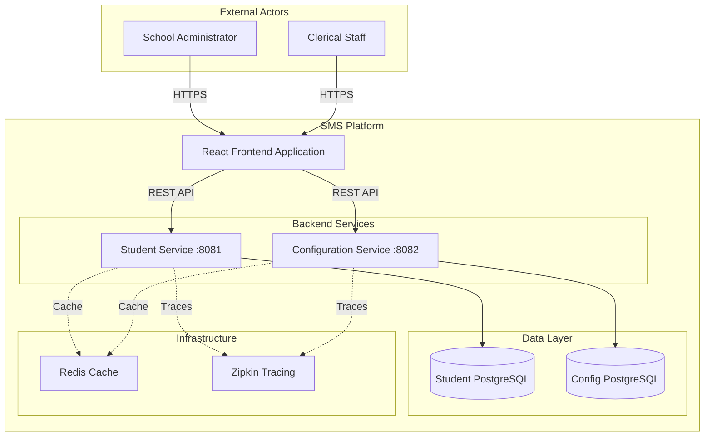
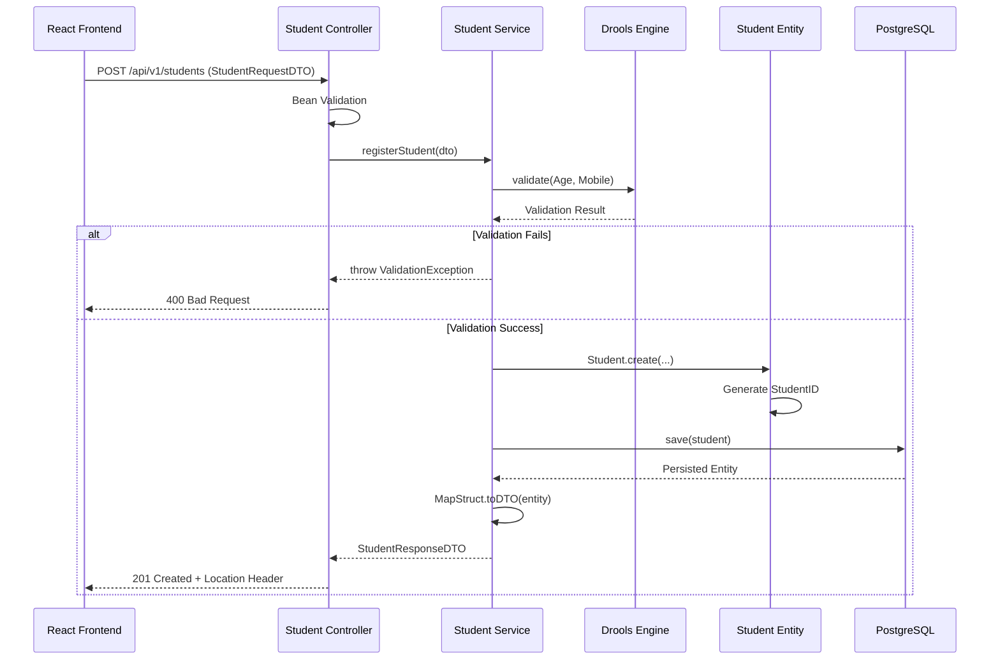
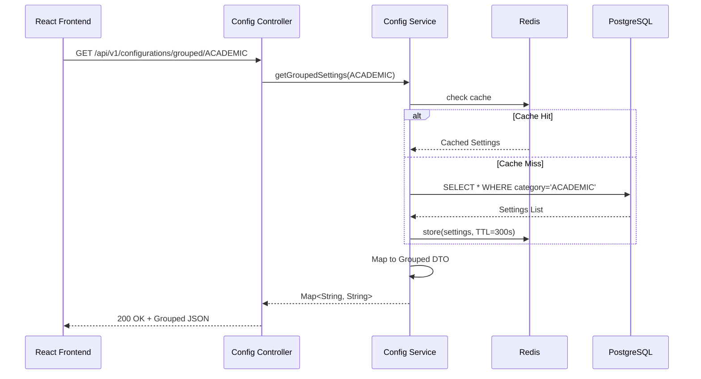

# System Architecture - School Management System

## 1. Executive Summary

The School Management System (SMS) is designed as a **microservices-based architecture** following Domain-Driven Design (DDD) principles. The system provides comprehensive student management and school configuration capabilities through two independent, loosely coupled services.

### 1.1 Architectural Philosophy

- **Bounded Contexts**: Strict service boundaries based on business capabilities (Student Management, Configuration Management)
- **Database-per-Service**: Absolute data isolation - no shared database access
- **Contract-First Design**: All interactions via explicit DTOs conforming to OpenAPI 3.0 specification
- **Stateless Services**: Horizontal scalability through stateless design
- **Domain-Centric**: Rich domain models encapsulating business logic

## 2. System Context Diagram


```mermaid
graph TB
    subgraph "External Actors"
        Admin[School Administrator]
        Staff[Clerical Staff]
    end

    subgraph "SMS Platform"
        UI[React Frontend Application]

        subgraph "Backend Services"
            StudentSvc[Student Service :8081]
            ConfigSvc[Configuration Service :8082]
        end

        subgraph "Data Layer"
            StudentDB[(Student PostgreSQL)]
            ConfigDB[(Config PostgreSQL)]
        end

        subgraph "Infrastructure"
            Redis[Redis Cache]
            Zipkin[Zipkin Tracing]
        end
    end

    Admin -->|HTTPS| UI
    Staff -->|HTTPS| UI
    UI -->|REST API| StudentSvc
    UI -->|REST API| ConfigSvc
    StudentSvc --> StudentDB
    ConfigSvc --> ConfigDB
    StudentSvc -.->|Cache| Redis
    ConfigSvc -.->|Cache| Redis
    StudentSvc -.->|Traces| Zipkin
    ConfigSvc -.->|Traces| Zipkin
```

## 3. Container Architecture

### 3.1 Service Boundaries

#### Student Service (Port: 8081)
**Business Capability**: Student Lifecycle Management

**Responsibilities**:
- Student registration with auto-generated StudentID
- Student profile CRUD operations (with field restrictions)
- Student search and listing with pagination
- Enrollment history tracking
- Business rule enforcement (Age validation, Mobile uniqueness)

**Database**: `student_db` (PostgreSQL 18+)

**API Prefix**: `/api/v1/students`

#### Configuration Service (Port: 8082)
**Business Capability**: School Settings Management

**Responsibilities**:
- Key-value configuration storage
- Category-based configuration retrieval (GENERAL, ACADEMIC, FINANCIAL)
- Configuration CRUD with versioning
- Grouped settings delivery

**Database**: `config_db` (PostgreSQL 18+)

**API Prefix**: `/api/v1/configurations`

### 3.2 Component Diagram


```mermaid
graph TB
    subgraph "Student Service Container"
        SC[Student Controller]
        SS[Student Application Service]
        SE[Student Entity Domain]
        SR[Student Repository Interface]
        SRI[JPA Repository Implementation]
        SDB[(student_db)]
        DR[Drools Rules Engine]

        SC --> SS
        SS --> SE
        SS --> DR
        SE --> SR
        SR --> SRI
        SRI --> SDB
    end

    subgraph "Configuration Service Container"
        CC[Config Controller]
        CS[Config Application Service]
        CE[Config Entity Domain]
        CR[Config Repository Interface]
        CRI[JPA Repository Implementation]
        CDB[(config_db)]

        CC --> CS
        CS --> CE
        CE --> CR
        CR --> CRI
        CRI --> CDB
    end
```

## 4. Architectural Style & Patterns

### 4.1 Layered Architecture (DDD-Aligned)

```
┌─────────────────────────────────────────┐
│   Presentation Layer (Controllers)      │
│   - REST Endpoints                      │
│   - Request/Response DTOs               │
│   - Input Validation (Bean Validation)  │
└─────────────────────────────────────────┘
              ↓
┌─────────────────────────────────────────┐
│   Application Layer (Services)          │
│   - Use Case Orchestration              │
│   - DTO ↔ Domain Mapping (MapStruct)    │
│   - Transaction Management              │
│   - CQRS Pattern (Command/Query Split)  │
└─────────────────────────────────────────┘
              ↓
┌─────────────────────────────────────────┐
│   Domain Layer (Business Logic)         │
│   - Rich Domain Models                  │
│   - Business Rules (Drools Integration) │
│   - Repository Interfaces (Contracts)   │
│   - Domain Events                       │
└─────────────────────────────────────────┘
              ↓
┌─────────────────────────────────────────┐
│   Infrastructure Layer (Persistence)     │
│   - JPA Entity Implementations          │
│   - Repository Implementations          │
│   - External API Clients                │
│   - Caching (Redis)                     │
└─────────────────────────────────────────┘
```

### 4.2 Design Principles

**SOLID Enforcement**:
- **S**ingle Responsibility: Each service, class, and method has one reason to change
- **O**pen/Closed: Domain models extensible via composition, not modification
- **L**iskov Substitution: Repository interfaces substitutable with test mocks
- **I**nterface Segregation: Thin, client-specific interfaces (no "God" repositories)
- **D**ependency Inversion: High-level modules depend on abstractions (Repository interfaces)

**Separation of Concerns**:
- Controllers: HTTP protocol handling only
- Services: Orchestration and mapping logic
- Domain: Pure business logic
- Repositories: Data access abstraction

**Interface-Based Design**:
```java
// Domain Layer defines contract
public interface StudentRepository {
    Student save(Student student);
    Optional<Student> findByStudentId(String studentId);
}

// Infrastructure Layer implements
@Repository
public class JpaStudentRepository implements StudentRepository {
    // JPA-specific implementation
}
```

## 5. Technology Stack (Strict Constraints)

### 5.1 Backend Services

| Component | Technology | Version | Purpose |
|-----------|-----------|---------|---------|
| Runtime | Java | 21 (LTS) | Primary language |
| Framework | Spring Boot | 3.5.0 | Application foundation |
| Data Access | Spring Data JPA | 3.5.0 | ORM abstraction |
| Database | PostgreSQL | 18+ | Primary data store |
| Rules Engine | Drools | 9.44.0.Final | Business rules externalization |
| Cache | Redis | 7.x | Performance optimization |
| DTO Mapping | MapStruct | 1.5.x | Compile-time mapping |
| Boilerplate Reduction | Lombok | 1.18.x | Code generation |
| Observability | Micrometer + Zipkin | Latest | Metrics & tracing |
| API Documentation | SpringDoc OpenAPI | 2.7.x | OpenAPI 3.0 spec generation |

**Critical Constraint**: Spring Boot 3.5.0 requires SpringDoc OpenAPI 2.5.x - 2.7.x+ (Reference: [D-001] from LESSONS_LEARNED.md)

### 5.2 Frontend Application

| Component | Technology | Purpose |
|-----------|-----------|---------|
| Framework | React 18+ | UI library |
| Styling | Tailwind CSS v4 | Utility-first CSS |
| Components | shadcn/ui | Accessible component library |
| Design Tokens | CSS Variables | Figma token mapping |
| State Management | React Context + Hooks | Local/global state |
| Forms | React Hook Form + Zod | Form handling + validation |
| HTTP Client | Axios | API communication |
| Routing | React Router v6 | Client-side routing |

### 5.3 Infrastructure

| Component | Technology | Purpose |
|-----------|-----------|---------|
| Containerization | Docker + Docker Compose | Service orchestration |
| Reverse Proxy | Nginx (future) | API gateway |
| Monitoring | Prometheus + Grafana | Metrics visualization |
| Logging | ELK Stack (future) | Centralized logging |

## 6. Inter-Service Communication

### 6.1 Communication Protocol

**Phase 1**: Synchronous HTTP/REST
- Direct HTTP calls from frontend to each service
- No inter-service backend communication (services are independent)

**Future Phases**: Event-Driven Architecture
- Asynchronous messaging (Kafka/RabbitMQ) for cross-domain events
- Example: Student enrollment triggers configuration audit log

### 6.2 API Contract Enforcement

**OpenAPI 3.0 Specification**: `specs/sms_api_specification.yaml` is the single source of truth

**Contract Validation**:
```yaml
# Request Validation (Bean Validation)
StudentBase:
  firstName:
    minLength: 2
    maxLength: 100
    pattern: '^[a-zA-Z\s]+$'
  mobile:
    pattern: '^\d{10}$'
```

**DTO Immutability**:
```java
@Data
@Builder
public class StudentRequestDTO {
    @NotBlank(message = "First name is required")
    @Pattern(regexp = "^[a-zA-Z\\s]+$")
    private final String firstName; // Immutable via final
}
```

## 7. Data Flow Architecture

### 7.1 Student Registration Flow


```mermaid
sequenceDiagram
    participant UI as React Frontend
    participant SC as Student Controller
    participant SS as Student Service
    participant DR as Drools Engine
    participant SE as Student Entity
    participant DB as PostgreSQL

    UI->>SC: POST /api/v1/students (StudentRequestDTO)
    SC->>SC: Bean Validation
    SC->>SS: registerStudent(dto)
    SS->>DR: validate(Age, Mobile)
    DR-->>SS: Validation Result
    alt Validation Fails
        SS-->>SC: throw ValidationException
        SC-->>UI: 400 Bad Request
    else Validation Success
        SS->>SE: Student.create(...)
        SE->>SE: Generate StudentID
        SS->>DB: save(student)
        DB-->>SS: Persisted Entity
        SS->>SS: MapStruct.toDTO(entity)
        SS-->>SC: StudentResponseDTO
        SC-->>UI: 201 Created + Location Header
    end
```

### 7.2 Configuration Retrieval Flow


```mermaid
sequenceDiagram
    participant UI as React Frontend
    participant CC as Config Controller
    participant CS as Config Service
    participant Cache as Redis
    participant DB as PostgreSQL

    UI->>CC: GET /api/v1/configurations/grouped/ACADEMIC
    CC->>CS: getGroupedSettings(ACADEMIC)
    CS->>Cache: check cache
    alt Cache Hit
        Cache-->>CS: Cached Settings
    else Cache Miss
        CS->>DB: SELECT * WHERE category='ACADEMIC'
        DB-->>CS: Settings List
        CS->>Cache: store(settings, TTL=300s)
    end
    CS->>CS: Map to Grouped DTO
    CS-->>CC: Map<String, String>
    CC-->>UI: 200 OK + Grouped JSON
```

## 8. Scalability & Performance Targets

### 8.1 Performance SLAs

| Metric | Target | Measurement |
|--------|--------|-------------|
| API Response Time | < 200ms | 95th percentile |
| Database Query Time | < 50ms | Average |
| Cache Hit Ratio | > 80% | For configuration reads |
| Throughput | 500 req/sec | Per service instance |
| Concurrent Users | 1000+ | Phase 1 target |

### 8.2 Scalability Strategies

**Horizontal Scaling**:
- Stateless service design (no in-memory session state)
- Load balancer distribution (Round Robin / Least Connections)
- Auto-scaling based on CPU/Memory thresholds

**Database Optimization**:
- Connection pooling (HikariCP - default 10 connections)
- Query optimization (Prevent N+1 via `@EntityGraph`)
- Read replicas for reporting queries (future)

**Caching Strategy**:
```java
@Cacheable(value = "configurations", key = "#category")
public Map<String, String> getGroupedSettings(String category) {
    // Cache invalidation on configuration update
}
```

## 9. Logging Strategy

### 9.1 Structured Logging (JSON Format)

**Standard**: Use SLF4J with Logback configured for JSON output

```json
{
  "timestamp": "2026-02-03T10:15:30.123Z",
  "level": "INFO",
  "thread": "http-nio-8081-exec-1",
  "logger": "com.school.student.service.StudentService",
  "message": "Student registered successfully",
  "context": {
    "studentId": "STD-20260203-0001",
    "correlationId": "a1b2c3d4-e5f6-7890",
    "userId": "admin@school.com"
  }
}
```

### 9.2 Log Levels

| Level | Usage | Example |
|-------|-------|---------|
| ERROR | System failures requiring immediate action | Database connection failure |
| WARN | Recoverable issues | Duplicate mobile number attempt |
| INFO | Business events | Student registration success |
| DEBUG | Diagnostic information | SQL query execution |
| TRACE | Detailed debugging | Method entry/exit |

### 9.3 Correlation ID Propagation

**Header**: `X-Correlation-ID` (UUID format)

```java
@Component
public class CorrelationInterceptor implements HandlerInterceptor {
    @Override
    public boolean preHandle(HttpServletRequest request, ...) {
        String correlationId = request.getHeader("X-Correlation-ID");
        if (correlationId == null) {
            correlationId = UUID.randomUUID().toString();
        }
        MDC.put("correlationId", correlationId);
        return true;
    }
}
```

## 10. Deployment Architecture

### 10.1 Docker Compose Structure

```yaml
version: '3.9'
services:
  student-service:
    build: ./backend/student-service
    ports:
      - "8081:8081"
    environment:
      DB_HOST: student-db
      REDIS_HOST: redis
    depends_on:
      - student-db
      - redis

  config-service:
    build: ./backend/config-service
    ports:
      - "8082:8082"
    environment:
      DB_HOST: config-db
    depends_on:
      - config-db

  student-db:
    image: postgres:18-alpine
    environment:
      POSTGRES_DB: student_db
      POSTGRES_USER: ${DB_USER}  # Externalized via .env
      POSTGRES_PASSWORD: ${DB_PASSWORD}
    volumes:
      - student-data:/var/lib/postgresql/data

  config-db:
    image: postgres:18-alpine
    environment:
      POSTGRES_DB: config_db
    volumes:
      - config-data:/var/lib/postgresql/data

  redis:
    image: redis:7-alpine
    ports:
      - "6379:6379"

  frontend:
    build: ./frontend
    ports:
      - "3000:80"
    environment:
      REACT_APP_STUDENT_API: http://localhost:8081/api/v1
      REACT_APP_CONFIG_API: http://localhost:8082/api/v1
```

### 10.2 Environment Configuration

**Security Constraint**: Database credentials MUST be externalized via OS environment variables

```bash
# .env (NOT committed to Git)
DB_USER=school_admin
DB_PASSWORD=SecureP@ssw0rd!
REDIS_PASSWORD=CacheP@ss123
```

## 11. Observability & Monitoring

### 11.1 Spring Boot Actuator Endpoints

**Mandatory Endpoints**:
```properties
management.endpoints.web.exposure.include=health,metrics,prometheus,info
management.endpoint.health.show-details=always
```

| Endpoint | Purpose | Access Level |
|----------|---------|--------------|
| /actuator/health | Service health status | Public |
| /actuator/metrics | JVM & application metrics | Admin only |
| /actuator/prometheus | Prometheus scraping | Monitoring system |
| /actuator/info | Service metadata | Public |

### 11.2 Custom Metrics

**Business Metrics** (Micrometer):
```java
@Service
public class StudentService {
    private final Counter registrationCounter;

    public StudentService(MeterRegistry registry) {
        this.registrationCounter = registry.counter(
            "students.registered.total",
            "status", "success"
        );
    }

    public StudentResponseDTO registerStudent(...) {
        // Logic
        registrationCounter.increment();
    }
}
```

**Tracked Metrics**:
- `students.registered.total` (Counter)
- `students.active.count` (Gauge)
- `config.updates.total` (Counter)
- `api.response.time` (Timer)

### 11.3 Distributed Tracing (Zipkin)

```xml
<dependency>
    <groupId>io.micrometer</groupId>
    <artifactId>micrometer-tracing-bridge-brave</artifactId>
</dependency>
```

**Trace Propagation**: Automatic via Spring Cloud Sleuth

## 12. Security Architecture (Phase 1)

### 12.1 Authentication Scope

**Constraint**: Authentication is **out of scope** for Phase 1 (handled by external system)

**Assumption**: All requests are pre-authenticated with user context passed via headers:
```http
X-User-ID: admin@school.com
X-User-Role: SCHOOL_ADMINISTRATOR
```

### 12.2 Input Validation

**Defense Layer 1**: Bean Validation (JSR-380)
```java
@NotNull(message = "Date of birth is required")
@Past(message = "Date of birth must be in the past")
private LocalDate dateOfBirth;
```

**Defense Layer 2**: Drools Business Rules
```drool
rule "Validate Student Age"
when
    $student : Student(age < 3 || age > 18)
then
    validationResult.addError("Age must be between 3 and 18 years");
end
```

### 12.3 SQL Injection Prevention

**Mandatory**: Use JPA Criteria API or JPQL with parameterized queries

```java
// SAFE - Parameterized Query
@Query("SELECT s FROM Student s WHERE s.lastName = :lastName")
List<Student> findByLastName(@Param("lastName") String lastName);

// UNSAFE - String concatenation (FORBIDDEN)
// String query = "SELECT * FROM students WHERE last_name = '" + lastName + "'";
```

### 12.4 CORS Configuration

```java
@Configuration
public class CorsConfig implements WebMvcConfigurer {
    @Override
    public void addCorsMappings(CorsRegistry registry) {
        registry.addMapping("/api/**")
                .allowedOrigins("http://localhost:3000") // Frontend origin
                .allowedMethods("GET", "POST", "PUT", "DELETE")
                .allowedHeaders("*")
                .allowCredentials(true);
    }
}
```

## 13. Code Quality Standards

### 13.1 Testing Requirements

Reference: `specs/TESTING_STRATEGY.md`

| Layer | Coverage Target | Framework |
|-------|----------------|-----------|
| Domain | 95% Line Coverage | JUnit 5 + AssertJ |
| Application | 85% Line Coverage | Mockito |
| Infrastructure | 70% Branch Coverage | TestContainers |
| Integration | Critical Paths | RestAssured |

### 13.2 Code Review Checklist

- [ ] All public methods have Javadoc
- [ ] DTOs are immutable (`final` fields, `@Builder`)
- [ ] Repository methods use `Optional<T>` for single results
- [ ] Exceptions include correlation ID
- [ ] New endpoints documented in OpenAPI spec
- [ ] Database migrations use Flyway/Liquibase
- [ ] Lombok usage limited to DTOs and entities (not domain logic)

## 14. Architectural Decision Records (ADRs)

### ADR-001: Microservices Over Monolith

**Decision**: Adopt microservices architecture for Student and Configuration domains

**Rationale**:
- Independent scaling (Student service likely higher traffic)
- Team autonomy (separate development streams)
- Technology flexibility (future services may use different stacks)

**Consequences**:
- Increased operational complexity (2 databases, 2 services)
- Eventual consistency challenges (future cross-domain operations)

### ADR-002: PostgreSQL for Primary Storage

**Decision**: Use PostgreSQL 18+ over NoSQL alternatives

**Rationale**:
- ACID compliance for critical student data
- Mature JPA/Hibernate support
- Advanced features (JSONB for flexible fields, full-text search)

**Consequences**:
- Vertical scaling limits (mitigated by read replicas)
- Schema migration overhead (managed via Flyway)

### ADR-003: Drools for Business Rules

**Decision**: Externalize validation logic to Drools rules engine

**Rationale**:
- Non-developers can modify rules (e.g., age limit changes)
- Rule versioning and audit trail
- Centralized rule testing

**Consequences**:
- Learning curve for rule syntax
- Additional dependency to maintain

## 15. Future Roadmap

### Phase 2 Enhancements

1. **Authentication & Authorization**:
   - JWT-based authentication
   - Role-Based Access Control (RBAC)
   - OAuth2 integration (Google/Microsoft SSO)

2. **Advanced Features**:
   - Attendance tracking
   - Fee management
   - Report generation (Jasper Reports)

3. **Infrastructure**:
   - API Gateway (Spring Cloud Gateway)
   - Service discovery (Eureka)
   - Event-driven messaging (Kafka)

4. **Multi-Tenancy**:
   - Support multiple school instances
   - Tenant isolation strategies

## 16. Glossary

| Term | Definition |
|------|------------|
| **Bounded Context** | A logical boundary within which a domain model applies |
| **DTO** | Data Transfer Object - Immutable payload for API contracts |
| **Optimistic Locking** | Concurrency control using version numbers |
| **CQRS** | Command Query Responsibility Segregation |
| **Correlation ID** | Unique identifier for request tracing across services |

---

**Document Version**: 1.0
**Last Updated**: 2026-02-03
**Owner**: Architect Agent
**Review Cycle**: Quarterly
