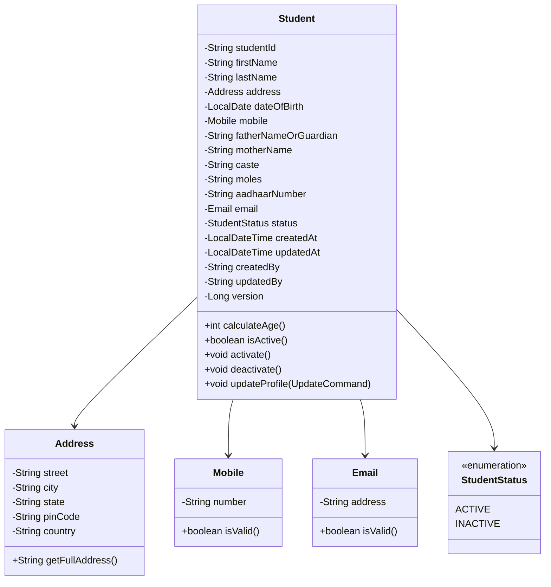
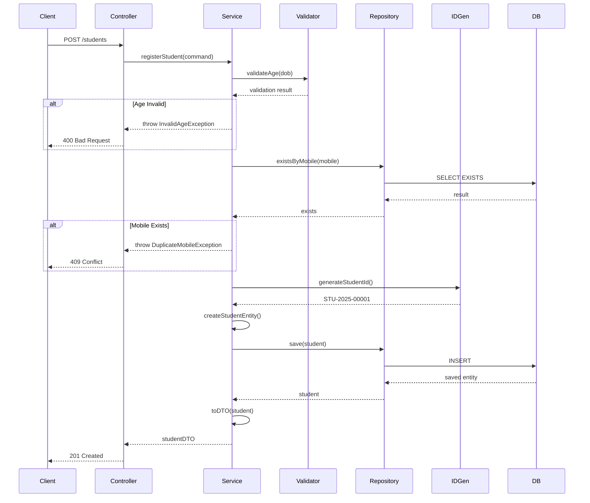
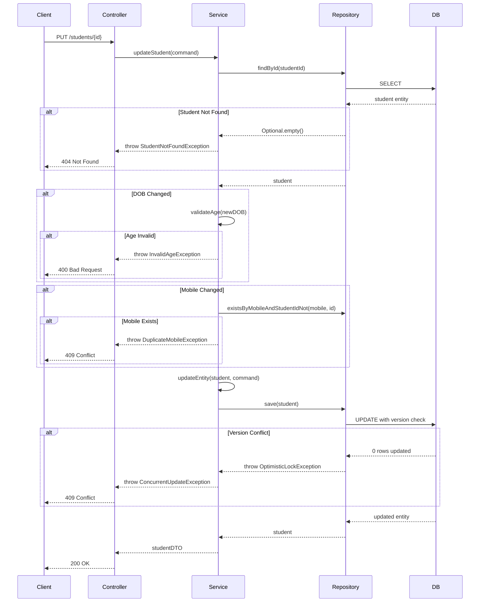
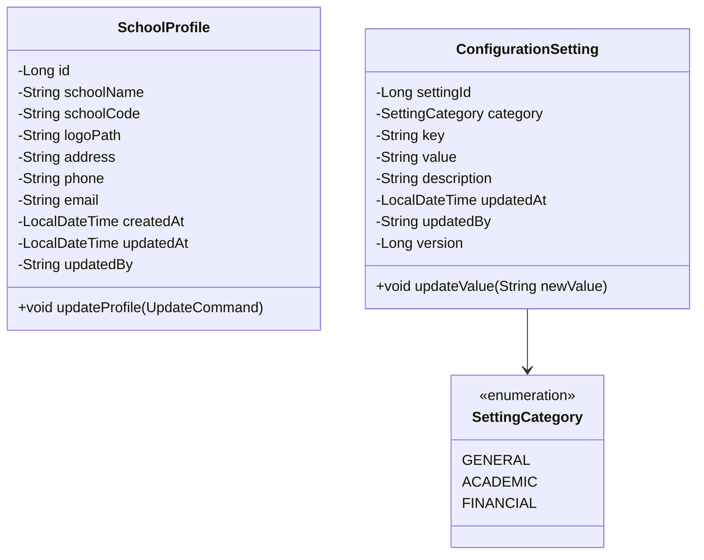

# Microservices Design

## Table of Contents
1. [Student Service](#student-service)
2. [Configuration Service](#configuration-service)
3. [Service Communication](#service-communication)
4. [Common Patterns](#common-patterns)
5. [Error Handling](#error-handling)
6. [Validation Strategies](#validation-strategies)

## Student Service

### Service Overview

**Purpose**: Manage complete student lifecycle including registration, profile management, and status tracking.

**Bounded Context**: Student Domain

**Port**: 8081

**Base Path**: `/students`

**Database**: `student_db`

### Domain Model



### Use Cases

#### 1. Register Student Use Case

**Description**: Register a new student with validation

**Actor**: Clerical Staff, Administrator

**Preconditions**:
- User is authenticated
- Student data is provided

**Input**:
```java
public class RegisterStudentCommand {
    private String firstName;        // Required, 2-50 chars
    private String lastName;         // Required, 2-50 chars
    private String street;           // Required
    private String city;             // Required
    private String state;            // Required
    private String pinCode;          // Required, 6 digits
    private LocalDate dateOfBirth;   // Required, age 3-18
    private String mobile;           // Required, 10 digits, unique
    private String fatherNameOrGuardian; // Required
    private String motherName;       // Optional
    private String caste;            // Optional
    private String moles;            // Optional
    private String aadhaarNumber;    // Optional, 12 digits if provided
    private String email;            // Optional, valid email if provided
    private String userId;           // From context
}
```

**Business Rules**:
1. Age must be between 3 and 18 years (calculated from DOB)
2. Mobile number must be exactly 10 digits
3. Mobile number must be unique across all students
4. First name and last name: 2-50 characters
5. Student ID auto-generated (format: STU-{YEAR}-{SEQUENCE})
6. Default status: ACTIVE
7. Aadhaar must be 12 digits if provided

**Output**:
```java
public class StudentDTO {
    private String studentId;
    private String firstName;
    private String lastName;
    private AddressDTO address;
    private LocalDate dateOfBirth;
    private int age;
    private String mobile;
    private String fatherNameOrGuardian;
    private String motherName;
    private String caste;
    private String moles;
    private String aadhaarNumber;
    private String email;
    private String status;
    private LocalDateTime createdAt;
}
```

**Process Flow**:


**Implementation Example**:
```java
@Service
@Transactional
@RequiredArgsConstructor
public class StudentRegistrationService implements RegisterStudentUseCase {

    private final StudentRepository studentRepository;
    private final StudentIdGenerator idGenerator;
    private final AgeValidator ageValidator;
    private final StudentMapper mapper;

    @Override
    public StudentDTO registerStudent(RegisterStudentCommand command) {
        // Validate age
        int age = ageValidator.calculateAge(command.getDateOfBirth());
        if (!ageValidator.isValidAge(age)) {
            throw new InvalidAgeException(
                "Student age must be between 3 and 18 years. Provided age: " + age
            );
        }

        // Check mobile uniqueness
        if (studentRepository.existsByMobile(command.getMobile())) {
            throw new DuplicateMobileException(
                "Mobile number already registered: " + command.getMobile()
            );
        }

        // Generate student ID
        String studentId = idGenerator.generate();

        // Create domain entity
        Student student = Student.builder()
            .studentId(studentId)
            .firstName(command.getFirstName())
            .lastName(command.getLastName())
            .address(Address.of(
                command.getStreet(),
                command.getCity(),
                command.getState(),
                command.getPinCode(),
                "India"
            ))
            .dateOfBirth(command.getDateOfBirth())
            .mobile(Mobile.of(command.getMobile()))
            .fatherNameOrGuardian(command.getFatherNameOrGuardian())
            .motherName(command.getMotherName())
            .caste(command.getCaste())
            .moles(command.getMoles())
            .aadhaarNumber(command.getAadhaarNumber())
            .email(command.getEmail() != null ? Email.of(command.getEmail()) : null)
            .status(StudentStatus.ACTIVE)
            .createdBy(command.getUserId())
            .updatedBy(command.getUserId())
            .build();

        // Save to repository
        Student savedStudent = studentRepository.save(student);

        // Map to DTO and return
        return mapper.toDTO(savedStudent);
    }
}
```

#### 2. Update Student Profile Use Case

**Description**: Update existing student information

**Actor**: Clerical Staff, Administrator

**Preconditions**: Student exists

**Input**:
```java
public class UpdateStudentCommand {
    private String studentId;        // Required, must exist
    private String firstName;        // Optional, 2-50 chars if provided
    private String lastName;         // Optional, 2-50 chars if provided
    private String street;
    private String city;
    private String state;
    private String pinCode;
    private LocalDate dateOfBirth;   // Optional, must maintain age 3-18
    private String mobile;           // Optional, must be unique if changed
    private String fatherNameOrGuardian;
    private String motherName;
    private String caste;
    private String moles;
    private String aadhaarNumber;
    private String email;
    private String userId;           // From context
    private Long version;            // For optimistic locking
}
```

**Business Rules**:
1. Student must exist
2. If DOB changed, age must still be 3-18
3. If mobile changed, must be unique
4. Use optimistic locking to prevent concurrent updates

**Process Flow**:


#### 3. Search Students Use Case

**Description**: Search and filter students with pagination

**Search Criteria**:
- Student ID (exact match)
- First Name (partial match)
- Last Name (partial match)
- Mobile (exact match)
- Status (ACTIVE/INACTIVE)
- Age range
- Caste

**Input**:
```java
public class SearchStudentQuery {
    private String studentId;
    private String firstName;
    private String lastName;
    private String mobile;
    private StudentStatus status;
    private Integer minAge;
    private Integer maxAge;
    private String caste;
    private int page = 0;           // Default 0
    private int size = 20;          // Default 20, max 100
    private String sortBy = "createdAt";
    private String sortDirection = "DESC";
}
```

**Output**:
```java
public class PagedStudentResponse {
    private List<StudentDTO> content;
    private int page;
    private int size;
    private long totalElements;
    private int totalPages;
    private boolean first;
    private boolean last;
}
```

#### 4. Update Student Status Use Case

**Description**: Activate or deactivate a student

**Business Rules**:
- Only ACTIVE <-> INACTIVE transitions allowed
- Record who made the change and when

**Implementation**:
```java
@Service
@Transactional
@RequiredArgsConstructor
public class StudentStatusService {

    private final StudentRepository studentRepository;

    public StudentDTO updateStatus(String studentId, StudentStatus newStatus, String userId) {
        Student student = studentRepository.findById(studentId)
            .orElseThrow(() -> new StudentNotFoundException(studentId));

        if (newStatus == StudentStatus.ACTIVE) {
            student.activate();
        } else {
            student.deactivate();
        }

        student.setUpdatedBy(userId);
        student.setUpdatedAt(LocalDateTime.now());

        Student updated = studentRepository.save(student);
        return StudentMapper.toDTO(updated);
    }
}
```

### Service Configuration

**application.yml**:
```yaml
server:
  port: 8081

spring:
  application:
    name: student-service

  datasource:
    url: jdbc:postgresql://localhost:5432/student_db
    username: ${DB_USERNAME}
    password: ${DB_PASSWORD}
    driver-class-name: org.postgresql.Driver
    hikari:
      maximum-pool-size: 10
      minimum-idle: 5
      connection-timeout: 30000

  jpa:
    hibernate:
      ddl-auto: validate
    properties:
      hibernate:
        dialect: org.hibernate.dialect.PostgreSQLDialect
        format_sql: true
        default_schema: public
    show-sql: false

  flyway:
    enabled: true
    locations: classpath:db/migration
    baseline-on-migrate: true

eureka:
  client:
    service-url:
      defaultZone: http://localhost:8761/eureka/
    register-with-eureka: true
    fetch-registry: true

logging:
  level:
    com.school.sms.student: DEBUG
    org.hibernate.SQL: DEBUG
  pattern:
    console: "%d{yyyy-MM-dd HH:mm:ss} - %msg%n"

management:
  endpoints:
    web:
      exposure:
        include: health,info,metrics,prometheus
  endpoint:
    health:
      show-details: always
```

### Dependencies (pom.xml excerpt)

```xml
<dependencies>
    <!-- Spring Boot Starter -->
    <dependency>
        <groupId>org.springframework.boot</groupId>
        <artifactId>spring-boot-starter-web</artifactId>
    </dependency>

    <!-- Spring Data JPA -->
    <dependency>
        <groupId>org.springframework.boot</groupId>
        <artifactId>spring-boot-starter-data-jpa</artifactId>
    </dependency>

    <!-- PostgreSQL Driver -->
    <dependency>
        <groupId>org.postgresql</groupId>
        <artifactId>postgresql</artifactId>
        <scope>runtime</scope>
    </dependency>

    <!-- Validation -->
    <dependency>
        <groupId>org.springframework.boot</groupId>
        <artifactId>spring-boot-starter-validation</artifactId>
    </dependency>

    <!-- Flyway for migrations -->
    <dependency>
        <groupId>org.flywaydb</groupId>
        <artifactId>flyway-core</artifactId>
    </dependency>

    <!-- MapStruct for DTO mapping -->
    <dependency>
        <groupId>org.mapstruct</groupId>
        <artifactId>mapstruct</artifactId>
        <version>1.5.5.Final</version>
    </dependency>

    <!-- Lombok -->
    <dependency>
        <groupId>org.projectlombok</groupId>
        <artifactId>lombok</artifactId>
        <optional>true</optional>
    </dependency>

    <!-- Service Discovery -->
    <dependency>
        <groupId>org.springframework.cloud</groupId>
        <artifactId>spring-cloud-starter-netflix-eureka-client</artifactId>
    </dependency>

    <!-- Monitoring -->
    <dependency>
        <groupId>org.springframework.boot</groupId>
        <artifactId>spring-boot-starter-actuator</artifactId>
    </dependency>
    <dependency>
        <groupId>io.micrometer</groupId>
        <artifactId>micrometer-registry-prometheus</artifactId>
    </dependency>

    <!-- Testing -->
    <dependency>
        <groupId>org.springframework.boot</groupId>
        <artifactId>spring-boot-starter-test</artifactId>
        <scope>test</scope>
    </dependency>
    <dependency>
        <groupId>org.testcontainers</groupId>
        <artifactId>postgresql</artifactId>
        <scope>test</scope>
    </dependency>
</dependencies>
```

## Configuration Service

### Service Overview

**Purpose**: Manage school configuration settings and school profile.

**Bounded Context**: Configuration Domain

**Port**: 8082

**Base Path**: `/configurations`

**Database**: `configuration_db`

### Domain Model



### Use Cases

#### 1. Create Configuration Setting Use Case

**Description**: Create a new configuration setting

**Input**:
```java
public class CreateSettingCommand {
    private SettingCategory category;  // Required
    private String key;                // Required, unique within category
    private String value;              // Required
    private String description;        // Optional
    private String userId;             // From context
}
```

**Business Rules**:
1. Key must be unique within the same category
2. Key format: UPPERCASE_SNAKE_CASE
3. All fields except description are required

**Implementation**:
```java
@Service
@Transactional
@RequiredArgsConstructor
public class ConfigurationManagementService {

    private final ConfigurationRepository configurationRepository;
    private final ConfigurationMapper mapper;

    public ConfigurationDTO createSetting(CreateSettingCommand command) {
        // Check uniqueness
        if (configurationRepository.existsByCategoryAndKey(
                command.getCategory(),
                command.getKey())) {
            throw new DuplicateSettingException(
                "Setting already exists: " + command.getCategory() + "." + command.getKey()
            );
        }

        // Validate key format
        if (!command.getKey().matches("^[A-Z][A-Z0-9_]*$")) {
            throw new InvalidSettingKeyException(
                "Key must be in UPPERCASE_SNAKE_CASE format"
            );
        }

        ConfigurationSetting setting = ConfigurationSetting.builder()
            .category(command.getCategory())
            .key(command.getKey())
            .value(command.getValue())
            .description(command.getDescription())
            .updatedBy(command.getUserId())
            .build();

        ConfigurationSetting saved = configurationRepository.save(setting);
        return mapper.toDTO(saved);
    }
}
```

#### 2. Update Configuration Setting Use Case

**Description**: Update value of existing setting

**Input**:
```java
public class UpdateSettingCommand {
    private Long settingId;      // Required
    private String value;        // Required
    private String description;  // Optional
    private String userId;       // From context
    private Long version;        // For optimistic locking
}
```

**Business Rules**:
1. Setting must exist
2. Only value and description can be updated
3. Category and key are immutable
4. Use optimistic locking

#### 3. Get Settings by Category Use Case

**Description**: Retrieve all settings for a specific category

**Input**:
```java
public class GetSettingsByCategoryQuery {
    private SettingCategory category; // Required
}
```

**Output**:
```java
public class CategorySettingsDTO {
    private String category;
    private List<ConfigurationDTO> settings;
}

public class ConfigurationDTO {
    private Long settingId;
    private String category;
    private String key;
    private String value;
    private String description;
    private LocalDateTime updatedAt;
    private String updatedBy;
}
```

**Implementation**:
```java
@Service
@Transactional(readOnly = true)
@RequiredArgsConstructor
public class ConfigurationQueryService {

    private final ConfigurationRepository configurationRepository;
    private final ConfigurationMapper mapper;

    public CategorySettingsDTO getSettingsByCategory(SettingCategory category) {
        List<ConfigurationSetting> settings =
            configurationRepository.findByCategory(category);

        return CategorySettingsDTO.builder()
            .category(category.name())
            .settings(settings.stream()
                .map(mapper::toDTO)
                .collect(Collectors.toList()))
            .build();
    }

    public Map<String, CategorySettingsDTO> getAllSettingsGrouped() {
        List<ConfigurationSetting> allSettings =
            configurationRepository.findAll();

        return Arrays.stream(SettingCategory.values())
            .collect(Collectors.toMap(
                SettingCategory::name,
                category -> {
                    List<ConfigurationDTO> categorySettings = allSettings.stream()
                        .filter(s -> s.getCategory() == category)
                        .map(mapper::toDTO)
                        .collect(Collectors.toList());
                    return new CategorySettingsDTO(category.name(), categorySettings);
                }
            ));
    }
}
```

#### 4. Manage School Profile Use Case

**Description**: Update school profile information

**Input**:
```java
public class UpdateSchoolProfileCommand {
    private String schoolName;
    private String schoolCode;
    private String logoPath;
    private String address;
    private String phone;
    private String email;
    private String userId;
}
```

**Implementation**:
```java
@Service
@Transactional
@RequiredArgsConstructor
public class SchoolProfileService {

    private final SchoolProfileRepository schoolProfileRepository;

    public SchoolProfileDTO updateProfile(UpdateSchoolProfileCommand command) {
        // Single school - always use ID 1
        SchoolProfile profile = schoolProfileRepository.findById(1L)
            .orElseGet(() -> SchoolProfile.builder().id(1L).build());

        profile.setSchoolName(command.getSchoolName());
        profile.setSchoolCode(command.getSchoolCode());
        profile.setLogoPath(command.getLogoPath());
        profile.setAddress(command.getAddress());
        profile.setPhone(command.getPhone());
        profile.setEmail(command.getEmail());
        profile.setUpdatedBy(command.getUserId());
        profile.setUpdatedAt(LocalDateTime.now());

        SchoolProfile saved = schoolProfileRepository.save(profile);
        return SchoolProfileMapper.toDTO(saved);
    }

    public SchoolProfileDTO getProfile() {
        return schoolProfileRepository.findById(1L)
            .map(SchoolProfileMapper::toDTO)
            .orElseThrow(() -> new SchoolProfileNotFoundException());
    }
}
```

### Service Configuration

**application.yml**:
```yaml
server:
  port: 8082

spring:
  application:
    name: configuration-service

  datasource:
    url: jdbc:postgresql://localhost:5432/configuration_db
    username: ${DB_USERNAME}
    password: ${DB_PASSWORD}
    driver-class-name: org.postgresql.Driver
    hikari:
      maximum-pool-size: 5
      minimum-idle: 2
      connection-timeout: 30000

  jpa:
    hibernate:
      ddl-auto: validate
    properties:
      hibernate:
        dialect: org.hibernate.dialect.PostgreSQLDialect
        format_sql: true
        default_schema: public
    show-sql: false

  flyway:
    enabled: true
    locations: classpath:db/migration
    baseline-on-migrate: true

eureka:
  client:
    service-url:
      defaultZone: http://localhost:8761/eureka/
    register-with-eureka: true
    fetch-registry: true

logging:
  level:
    com.school.sms.configuration: DEBUG
    org.hibernate.SQL: DEBUG

management:
  endpoints:
    web:
      exposure:
        include: health,info,metrics,prometheus
  endpoint:
    health:
      show-details: always
```

## Service Communication

### Internal Communication Pattern

In Phase 1, services are independent and don't need to communicate with each other. However, the pattern is established for future phases.

**Pattern**: REST over HTTP (synchronous)

**Future Example** (Phase 2 - when fee service needs student info):
```java
@Service
@RequiredArgsConstructor
public class StudentServiceClient {

    private final RestTemplate restTemplate;
    private final ServiceDiscoveryClient discoveryClient;

    public StudentDTO getStudentById(String studentId) {
        String serviceUrl = discoveryClient.getServiceUrl("student-service");
        String url = serviceUrl + "/students/" + studentId;

        try {
            ResponseEntity<StudentDTO> response = restTemplate.getForEntity(
                url,
                StudentDTO.class
            );
            return response.getBody();
        } catch (HttpClientErrorException.NotFound e) {
            throw new StudentNotFoundException(studentId);
        } catch (Exception e) {
            throw new StudentServiceUnavailableException(e);
        }
    }
}
```

### Resilience Patterns (Future)

For future phases when services need to communicate:

**Circuit Breaker** (using Resilience4j):
```java
@Service
public class ResilientStudentClient {

    @CircuitBreaker(name = "studentService", fallbackMethod = "getStudentFallback")
    @Retry(name = "studentService")
    @TimeLimiter(name = "studentService")
    public StudentDTO getStudent(String studentId) {
        // Call student service
    }

    private StudentDTO getStudentFallback(String studentId, Exception e) {
        // Return cached data or default
        return cachedStudentService.getFromCache(studentId);
    }
}
```

## Common Patterns

### 1. DTO Mapping with MapStruct

**Interface Definition**:
```java
@Mapper(componentModel = "spring")
public interface StudentMapper {

    @Mapping(target = "age", expression = "java(calculateAge(student.getDateOfBirth()))")
    @Mapping(target = "address", source = "address")
    StudentDTO toDTO(Student student);

    @Mapping(target = "createdAt", ignore = true)
    @Mapping(target = "updatedAt", ignore = true)
    @Mapping(target = "version", ignore = true)
    Student toEntity(CreateStudentRequest request);

    default int calculateAge(LocalDate dateOfBirth) {
        return Period.between(dateOfBirth, LocalDate.now()).getYears();
    }

    AddressDTO toAddressDTO(Address address);
}
```

### 2. ID Generation Strategy

**Student ID Generator**:
```java
@Component
public class StudentIdGenerator {

    private final AtomicInteger sequence = new AtomicInteger(0);

    public String generate() {
        int year = LocalDate.now().getYear();
        int seq = sequence.incrementAndGet();
        return String.format("STU-%d-%05d", year, seq);
    }

    // For distributed systems, use database sequence
    public String generateWithDB(StudentRepository repository) {
        Long nextId = repository.getNextSequence();
        int year = LocalDate.now().getYear();
        return String.format("STU-%d-%05d", year, nextId);
    }
}
```

**Database Sequence** (in migration):
```sql
CREATE SEQUENCE student_id_seq START WITH 1 INCREMENT BY 1;
```

### 3. Validation Strategy

**Domain Validation**:
```java
@Component
public class AgeValidator {

    private static final int MIN_AGE = 3;
    private static final int MAX_AGE = 18;

    public int calculateAge(LocalDate dateOfBirth) {
        return Period.between(dateOfBirth, LocalDate.now()).getYears();
    }

    public boolean isValidAge(int age) {
        return age >= MIN_AGE && age <= MAX_AGE;
    }

    public void validate(LocalDate dateOfBirth) {
        int age = calculateAge(dateOfBirth);
        if (!isValidAge(age)) {
            throw new InvalidAgeException(
                String.format("Age must be between %d and %d years. Provided age: %d",
                    MIN_AGE, MAX_AGE, age)
            );
        }
    }
}
```

**Input Validation** (in DTO):
```java
public class CreateStudentRequest {

    @NotBlank(message = "First name is required")
    @Size(min = 2, max = 50, message = "First name must be between 2 and 50 characters")
    private String firstName;

    @NotBlank(message = "Last name is required")
    @Size(min = 2, max = 50, message = "Last name must be between 2 and 50 characters")
    private String lastName;

    @NotNull(message = "Date of birth is required")
    @Past(message = "Date of birth must be in the past")
    private LocalDate dateOfBirth;

    @NotBlank(message = "Mobile number is required")
    @Pattern(regexp = "^[0-9]{10}$", message = "Mobile must be exactly 10 digits")
    private String mobile;

    @Pattern(regexp = "^[0-9]{12}$", message = "Aadhaar must be exactly 12 digits")
    private String aadhaarNumber;

    @Email(message = "Invalid email format")
    private String email;

    // getters and setters
}
```

### 4. Exception Hierarchy

```java
// Base exception
public abstract class StudentServiceException extends RuntimeException {
    public StudentServiceException(String message) {
        super(message);
    }
    public StudentServiceException(String message, Throwable cause) {
        super(message, cause);
    }
}

// Business exceptions
public class InvalidAgeException extends StudentServiceException {
    public InvalidAgeException(String message) {
        super(message);
    }
}

public class DuplicateMobileException extends StudentServiceException {
    public DuplicateMobileException(String message) {
        super(message);
    }
}

public class StudentNotFoundException extends StudentServiceException {
    public StudentNotFoundException(String studentId) {
        super("Student not found: " + studentId);
    }
}

public class ConcurrentUpdateException extends StudentServiceException {
    public ConcurrentUpdateException() {
        super("Record was modified by another user. Please refresh and try again.");
    }
}
```

## Error Handling

### Global Exception Handler

```java
@RestControllerAdvice
@Slf4j
public class GlobalExceptionHandler {

    @ExceptionHandler(InvalidAgeException.class)
    public ResponseEntity<ProblemDetail> handleInvalidAge(InvalidAgeException ex) {
        ProblemDetail problemDetail = ProblemDetail.forStatusAndDetail(
            HttpStatus.BAD_REQUEST,
            ex.getMessage()
        );
        problemDetail.setTitle("Invalid Age");
        problemDetail.setType(URI.create("https://api.school.com/problems/invalid-age"));
        problemDetail.setProperty("timestamp", Instant.now());

        log.warn("Invalid age validation failed: {}", ex.getMessage());
        return ResponseEntity.status(HttpStatus.BAD_REQUEST).body(problemDetail);
    }

    @ExceptionHandler(DuplicateMobileException.class)
    public ResponseEntity<ProblemDetail> handleDuplicateMobile(DuplicateMobileException ex) {
        ProblemDetail problemDetail = ProblemDetail.forStatusAndDetail(
            HttpStatus.CONFLICT,
            ex.getMessage()
        );
        problemDetail.setTitle("Duplicate Mobile Number");
        problemDetail.setType(URI.create("https://api.school.com/problems/duplicate-mobile"));
        problemDetail.setProperty("timestamp", Instant.now());

        log.warn("Duplicate mobile number: {}", ex.getMessage());
        return ResponseEntity.status(HttpStatus.CONFLICT).body(problemDetail);
    }

    @ExceptionHandler(StudentNotFoundException.class)
    public ResponseEntity<ProblemDetail> handleStudentNotFound(StudentNotFoundException ex) {
        ProblemDetail problemDetail = ProblemDetail.forStatusAndDetail(
            HttpStatus.NOT_FOUND,
            ex.getMessage()
        );
        problemDetail.setTitle("Student Not Found");
        problemDetail.setType(URI.create("https://api.school.com/problems/not-found"));
        problemDetail.setProperty("timestamp", Instant.now());

        log.warn("Student not found: {}", ex.getMessage());
        return ResponseEntity.status(HttpStatus.NOT_FOUND).body(problemDetail);
    }

    @ExceptionHandler(MethodArgumentNotValidException.class)
    public ResponseEntity<ProblemDetail> handleValidationErrors(
            MethodArgumentNotValidException ex) {
        List<String> errors = ex.getBindingResult()
            .getFieldErrors()
            .stream()
            .map(error -> error.getField() + ": " + error.getDefaultMessage())
            .collect(Collectors.toList());

        ProblemDetail problemDetail = ProblemDetail.forStatusAndDetail(
            HttpStatus.BAD_REQUEST,
            "Validation failed"
        );
        problemDetail.setTitle("Validation Error");
        problemDetail.setType(URI.create("https://api.school.com/problems/validation-error"));
        problemDetail.setProperty("errors", errors);
        problemDetail.setProperty("timestamp", Instant.now());

        log.warn("Validation errors: {}", errors);
        return ResponseEntity.status(HttpStatus.BAD_REQUEST).body(problemDetail);
    }

    @ExceptionHandler(OptimisticLockException.class)
    public ResponseEntity<ProblemDetail> handleOptimisticLock(OptimisticLockException ex) {
        ProblemDetail problemDetail = ProblemDetail.forStatusAndDetail(
            HttpStatus.CONFLICT,
            "Record was modified by another user"
        );
        problemDetail.setTitle("Concurrent Modification");
        problemDetail.setType(URI.create("https://api.school.com/problems/concurrent-update"));
        problemDetail.setProperty("timestamp", Instant.now());

        log.warn("Optimistic lock exception: {}", ex.getMessage());
        return ResponseEntity.status(HttpStatus.CONFLICT).body(problemDetail);
    }

    @ExceptionHandler(Exception.class)
    public ResponseEntity<ProblemDetail> handleGenericException(Exception ex) {
        ProblemDetail problemDetail = ProblemDetail.forStatusAndDetail(
            HttpStatus.INTERNAL_SERVER_ERROR,
            "An unexpected error occurred"
        );
        problemDetail.setTitle("Internal Server Error");
        problemDetail.setType(URI.create("https://api.school.com/problems/internal-error"));
        problemDetail.setProperty("timestamp", Instant.now());

        log.error("Unexpected error", ex);
        return ResponseEntity.status(HttpStatus.INTERNAL_SERVER_ERROR).body(problemDetail);
    }
}
```

### Error Response Format (RFC 7807)

```json
{
  "type": "https://api.school.com/problems/invalid-age",
  "title": "Invalid Age",
  "status": 400,
  "detail": "Student age must be between 3 and 18 years. Provided age: 2",
  "timestamp": "2025-11-17T10:30:00Z"
}
```

## Validation Strategies

### Multi-Layer Validation

1. **Input Validation** (Presentation Layer):
   - Bean Validation annotations (@NotNull, @Size, @Pattern)
   - Format validation (email, phone, etc.)
   - Handled by Spring automatically

2. **Business Rule Validation** (Application Layer):
   - Age constraints
   - Uniqueness checks
   - Status transitions
   - Custom validators

3. **Domain Validation** (Domain Layer):
   - Invariant enforcement
   - Value object validation
   - Entity state consistency

**Example**:
```java
// 1. Input Validation (DTO)
public class CreateStudentRequest {
    @NotBlank
    @Size(min = 2, max = 50)
    private String firstName;

    @NotNull
    @Past
    private LocalDate dateOfBirth;

    @NotBlank
    @Pattern(regexp = "^[0-9]{10}$")
    private String mobile;
}

// 2. Business Rule Validation (Service)
public class StudentRegistrationService {
    public StudentDTO registerStudent(CreateStudentRequest request) {
        // Validate age (business rule)
        ageValidator.validate(request.getDateOfBirth());

        // Validate uniqueness (business rule)
        if (repository.existsByMobile(request.getMobile())) {
            throw new DuplicateMobileException();
        }

        // Create entity...
    }
}

// 3. Domain Validation (Entity)
public class Student {
    public void setMobile(Mobile mobile) {
        if (!mobile.isValid()) {
            throw new InvalidMobileException();
        }
        this.mobile = mobile;
    }
}
```

## Summary

The Student and Configuration microservices are designed with:

1. **Clear Boundaries**: Each service owns its domain and database
2. **Clean Architecture**: Four-layer architecture per service
3. **Rich Domain Models**: Business logic in domain entities
4. **Comprehensive Validation**: Multi-layer validation strategy
5. **Standard Patterns**: Repository, Service, DTO Mapping
6. **Robust Error Handling**: RFC 7807 compliant error responses
7. **Optimistic Locking**: Prevent concurrent update conflicts
8. **Observability**: Health checks, metrics, logging

The next document ([Database Architecture](03-DATABASE-ARCHITECTURE.md)) provides complete database schemas and DDL for both services.

---

**Version**: 1.0
**Last Updated**: 2025-11-17
**Status**: Draft for Review
