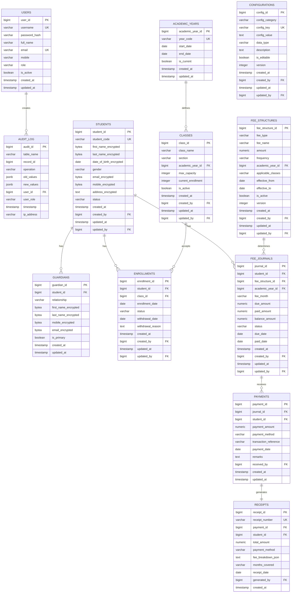

# Database Design - School Management System

**Version**: 1.0
**Date**: November 10, 2025
**Status**: Approved
**Author**: Database Architecture Team

---

## Table of Contents
1. [Overview](#overview)
2. [Entity Relationship Diagram](#entity-relationship-diagram)
3. [Table Definitions](#table-definitions)
4. [Indexing Strategy](#indexing-strategy)
5. [Data Types & Constraints](#data-types--constraints)
6. [Audit Trail Implementation](#audit-trail-implementation)
7. [Encryption Strategy](#encryption-strategy)
8. [Migration Strategy](#migration-strategy)
9. [Performance Optimization](#performance-optimization)
10. [Backup & Recovery](#backup--recovery)

---

## 1. Overview

### 1.1 Database Selection

**Database**: PostgreSQL 18
**Rationale**:
- ACID compliance for financial transactions
- Advanced features (JSON, window functions, CTE)
- Excellent performance with proper indexing
- Robust replication and backup capabilities
- Open-source with no licensing costs

### 1.2 Design Principles

1. **Normalization**: 3rd Normal Form (3NF) to reduce redundancy
2. **Referential Integrity**: Foreign key constraints enforced
3. **Data Types**: Appropriate types for data (NUMERIC for currency, TIMESTAMP WITH TIME ZONE for dates)
4. **Constraints**: Check constraints for business rules
5. **Indexing**: Strategic indexes for query performance
6. **Audit Trail**: Comprehensive audit logging
7. **Encryption**: AES-256 for PII fields

### 1.3 Schema Structure

```
school_sms_db
│
├── public (application tables)
│   ├── students
│   ├── guardians
│   ├── classes
│   ├── academic_years
│   ├── fee_structures
│   ├── fee_journals
│   ├── payments
│   ├── receipts
│   ├── configurations
│   └── users
│
├── audit (audit tables)
│   └── audit_log
│
└── archive (historical data)
    ├── archived_students
    └── archived_fee_journals
```

---

## 2. Entity Relationship Diagram

### 2.1 Complete ERD



### 2.2 Domain Relationships

| Relationship | Cardinality | Notes |
|--------------|-------------|-------|
| Student → Guardian | 1:N | One student can have multiple guardians |
| Student → Enrollment | 1:N | One student can have multiple enrollments (different years) |
| Student → Fee Journal | 1:N | One student has multiple fee entries |
| Class → Enrollment | 1:N | One class accepts many students |
| Academic Year → Class | 1:N | One academic year has multiple classes |
| Fee Structure → Fee Journal | 1:N | One fee structure generates multiple journals |
| Fee Journal → Payment | 1:N | One journal can have multiple payments (partial payments) |
| Payment → Receipt | 1:1 | Each payment generates exactly one receipt |
| User → Audit Log | 1:N | One user creates multiple audit entries |

---

## 3. Table Definitions

### 3.1 User Management

#### 3.1.1 USERS Table

```sql
CREATE TABLE users (
    user_id BIGSERIAL PRIMARY KEY,
    username VARCHAR(50) NOT NULL UNIQUE,
    password_hash VARCHAR(255) NOT NULL,
    full_name VARCHAR(100) NOT NULL,
    email VARCHAR(100) UNIQUE,
    mobile VARCHAR(20),
    role VARCHAR(50) NOT NULL CHECK (role IN ('ADMIN', 'PRINCIPAL', 'OFFICE_STAFF', 'ACCOUNTS_MANAGER', 'AUDITOR')),
    is_active BOOLEAN NOT NULL DEFAULT TRUE,
    last_login_at TIMESTAMP WITH TIME ZONE,
    password_changed_at TIMESTAMP WITH TIME ZONE,
    created_at TIMESTAMP WITH TIME ZONE NOT NULL DEFAULT CURRENT_TIMESTAMP,
    updated_at TIMESTAMP WITH TIME ZONE NOT NULL DEFAULT CURRENT_TIMESTAMP,
    CONSTRAINT email_format CHECK (email ~* '^[A-Za-z0-9._%+-]+@[A-Za-z0-9.-]+\.[A-Za-z]{2,}$')
);

CREATE INDEX idx_users_username ON users(username);
CREATE INDEX idx_users_role ON users(role);
CREATE INDEX idx_users_is_active ON users(is_active);

COMMENT ON TABLE users IS 'System users with role-based access';
COMMENT ON COLUMN users.password_hash IS 'BCrypt hashed password';
COMMENT ON COLUMN users.role IS 'User role for RBAC';
```

---

### 3.2 Student Management

#### 3.2.1 STUDENTS Table

```sql
CREATE TABLE students (
    student_id BIGSERIAL PRIMARY KEY,
    student_code VARCHAR(20) NOT NULL UNIQUE,
    first_name_encrypted BYTEA NOT NULL,
    last_name_encrypted BYTEA NOT NULL,
    date_of_birth_encrypted BYTEA NOT NULL,
    gender VARCHAR(10) CHECK (gender IN ('MALE', 'FEMALE', 'OTHER')),
    email_encrypted BYTEA,
    mobile_encrypted BYTEA NOT NULL,
    address_encrypted BYTEA,
    blood_group VARCHAR(5) CHECK (blood_group IN ('A+', 'A-', 'B+', 'B-', 'AB+', 'AB-', 'O+', 'O-')),
    status VARCHAR(20) NOT NULL DEFAULT 'ACTIVE' CHECK (status IN ('ACTIVE', 'INACTIVE', 'GRADUATED', 'TRANSFERRED', 'WITHDRAWN')),
    admission_date DATE NOT NULL,
    photo_url TEXT,
    created_at TIMESTAMP WITH TIME ZONE NOT NULL DEFAULT CURRENT_TIMESTAMP,
    created_by BIGINT NOT NULL REFERENCES users(user_id),
    updated_at TIMESTAMP WITH TIME ZONE NOT NULL DEFAULT CURRENT_TIMESTAMP,
    updated_by BIGINT NOT NULL REFERENCES users(user_id)
);

CREATE INDEX idx_students_student_code ON students(student_code);
CREATE INDEX idx_students_status ON students(status);
CREATE INDEX idx_students_admission_date ON students(admission_date);
CREATE INDEX idx_students_created_at ON students(created_at);

COMMENT ON TABLE students IS 'Student master table with encrypted PII';
COMMENT ON COLUMN students.student_code IS 'Unique student identifier (format: STU-YYYY-NNNNN)';
COMMENT ON COLUMN students.first_name_encrypted IS 'AES-256 encrypted first name';
COMMENT ON COLUMN students.date_of_birth_encrypted IS 'AES-256 encrypted date of birth';
COMMENT ON COLUMN students.mobile_encrypted IS 'AES-256 encrypted mobile number';
```

#### 3.2.2 GUARDIANS Table

```sql
CREATE TABLE guardians (
    guardian_id BIGSERIAL PRIMARY KEY,
    student_id BIGINT NOT NULL REFERENCES students(student_id) ON DELETE CASCADE,
    relationship VARCHAR(20) NOT NULL CHECK (relationship IN ('FATHER', 'MOTHER', 'GUARDIAN', 'OTHER')),
    first_name_encrypted BYTEA NOT NULL,
    last_name_encrypted BYTEA NOT NULL,
    mobile_encrypted BYTEA NOT NULL,
    email_encrypted BYTEA,
    occupation VARCHAR(100),
    is_primary BOOLEAN NOT NULL DEFAULT FALSE,
    created_at TIMESTAMP WITH TIME ZONE NOT NULL DEFAULT CURRENT_TIMESTAMP,
    updated_at TIMESTAMP WITH TIME ZONE NOT NULL DEFAULT CURRENT_TIMESTAMP,
    UNIQUE(student_id, relationship)
);

CREATE INDEX idx_guardians_student_id ON guardians(student_id);
CREATE INDEX idx_guardians_is_primary ON guardians(is_primary);

COMMENT ON TABLE guardians IS 'Guardian information for students';
COMMENT ON COLUMN guardians.is_primary IS 'Primary contact for communication';
```

---

### 3.3 Academic Management

#### 3.3.1 ACADEMIC_YEARS Table

```sql
CREATE TABLE academic_years (
    academic_year_id BIGSERIAL PRIMARY KEY,
    year_code VARCHAR(10) NOT NULL UNIQUE,
    start_date DATE NOT NULL,
    end_date DATE NOT NULL,
    is_current BOOLEAN NOT NULL DEFAULT FALSE,
    created_at TIMESTAMP WITH TIME ZONE NOT NULL DEFAULT CURRENT_TIMESTAMP,
    updated_at TIMESTAMP WITH TIME ZONE NOT NULL DEFAULT CURRENT_TIMESTAMP,
    CONSTRAINT valid_date_range CHECK (end_date > start_date),
    CONSTRAINT year_code_format CHECK (year_code ~ '^\d{4}-\d{4}$')
);

CREATE INDEX idx_academic_years_year_code ON academic_years(year_code);
CREATE UNIQUE INDEX idx_academic_years_current ON academic_years(is_current) WHERE is_current = TRUE;

COMMENT ON TABLE academic_years IS 'Academic year definitions';
COMMENT ON COLUMN academic_years.year_code IS 'Format: YYYY-YYYY (e.g., 2025-2026)';
COMMENT ON COLUMN academic_years.is_current IS 'Only one academic year can be current';
```

#### 3.3.2 CLASSES Table

```sql
CREATE TABLE classes (
    class_id BIGSERIAL PRIMARY KEY,
    class_name VARCHAR(20) NOT NULL,
    section VARCHAR(5) NOT NULL,
    academic_year_id BIGINT NOT NULL REFERENCES academic_years(academic_year_id),
    max_capacity INTEGER NOT NULL DEFAULT 40,
    current_enrollment INTEGER NOT NULL DEFAULT 0,
    is_active BOOLEAN NOT NULL DEFAULT TRUE,
    created_at TIMESTAMP WITH TIME ZONE NOT NULL DEFAULT CURRENT_TIMESTAMP,
    created_by BIGINT NOT NULL REFERENCES users(user_id),
    updated_at TIMESTAMP WITH TIME ZONE NOT NULL DEFAULT CURRENT_TIMESTAMP,
    updated_by BIGINT NOT NULL REFERENCES users(user_id),
    UNIQUE(class_name, section, academic_year_id),
    CONSTRAINT valid_class_name CHECK (class_name IN ('1', '2', '3', '4', '5', '6', '7', '8', '9', '10')),
    CONSTRAINT valid_section CHECK (section ~ '^[A-Z]$'),
    CONSTRAINT valid_capacity CHECK (max_capacity > 0 AND max_capacity <= 100),
    CONSTRAINT valid_enrollment CHECK (current_enrollment >= 0 AND current_enrollment <= max_capacity)
);

CREATE INDEX idx_classes_academic_year ON classes(academic_year_id);
CREATE INDEX idx_classes_name_section ON classes(class_name, section);
CREATE INDEX idx_classes_is_active ON classes(is_active);

COMMENT ON TABLE classes IS 'Class sections per academic year';
COMMENT ON COLUMN classes.class_name IS 'Class level (1-10)';
COMMENT ON COLUMN classes.section IS 'Section identifier (A-Z)';
COMMENT ON COLUMN classes.current_enrollment IS 'Real-time enrollment count';
```

#### 3.3.3 ENROLLMENTS Table

```sql
CREATE TABLE enrollments (
    enrollment_id BIGSERIAL PRIMARY KEY,
    student_id BIGINT NOT NULL REFERENCES students(student_id),
    class_id BIGINT NOT NULL REFERENCES classes(class_id),
    enrollment_date DATE NOT NULL DEFAULT CURRENT_DATE,
    status VARCHAR(20) NOT NULL DEFAULT 'ENROLLED' CHECK (status IN ('ENROLLED', 'PROMOTED', 'WITHDRAWN')),
    withdrawal_date DATE,
    withdrawal_reason TEXT,
    created_at TIMESTAMP WITH TIME ZONE NOT NULL DEFAULT CURRENT_TIMESTAMP,
    created_by BIGINT NOT NULL REFERENCES users(user_id),
    updated_at TIMESTAMP WITH TIME ZONE NOT NULL DEFAULT CURRENT_TIMESTAMP,
    updated_by BIGINT NOT NULL REFERENCES users(user_id),
    CONSTRAINT no_duplicate_enrollment UNIQUE(student_id, class_id),
    CONSTRAINT valid_withdrawal CHECK (
        (status = 'WITHDRAWN' AND withdrawal_date IS NOT NULL) OR
        (status != 'WITHDRAWN' AND withdrawal_date IS NULL)
    )
);

CREATE INDEX idx_enrollments_student_id ON enrollments(student_id);
CREATE INDEX idx_enrollments_class_id ON enrollments(class_id);
CREATE INDEX idx_enrollments_status ON enrollments(status);
CREATE INDEX idx_enrollments_enrollment_date ON enrollments(enrollment_date);

COMMENT ON TABLE enrollments IS 'Student class enrollments per academic year';
COMMENT ON COLUMN enrollments.status IS 'Current enrollment status';
```

---

### 3.4 Fee Management

#### 3.4.1 FEE_STRUCTURES Table

```sql
CREATE TABLE fee_structures (
    fee_structure_id BIGSERIAL PRIMARY KEY,
    fee_type VARCHAR(50) NOT NULL,
    fee_name VARCHAR(100) NOT NULL,
    amount NUMERIC(10, 2) NOT NULL,
    frequency VARCHAR(20) NOT NULL CHECK (frequency IN ('MONTHLY', 'QUARTERLY', 'ANNUAL', 'ONE_TIME')),
    academic_year_id BIGINT NOT NULL REFERENCES academic_years(academic_year_id),
    applicable_classes TEXT NOT NULL,
    effective_from DATE NOT NULL,
    effective_to DATE,
    is_active BOOLEAN NOT NULL DEFAULT TRUE,
    version INTEGER NOT NULL DEFAULT 1,
    description TEXT,
    created_at TIMESTAMP WITH TIME ZONE NOT NULL DEFAULT CURRENT_TIMESTAMP,
    created_by BIGINT NOT NULL REFERENCES users(user_id),
    updated_at TIMESTAMP WITH TIME ZONE NOT NULL DEFAULT CURRENT_TIMESTAMP,
    updated_by BIGINT NOT NULL REFERENCES users(user_id),
    CONSTRAINT positive_amount CHECK (amount > 0),
    CONSTRAINT valid_fee_type CHECK (fee_type IN ('TUITION', 'LIBRARY', 'COMPUTER', 'SPORTS', 'TRANSPORT', 'EXAM', 'ADMISSION', 'ANNUAL_CHARGE', 'OTHER')),
    CONSTRAINT valid_effective_dates CHECK (effective_to IS NULL OR effective_to > effective_from)
);

CREATE INDEX idx_fee_structures_academic_year ON fee_structures(academic_year_id);
CREATE INDEX idx_fee_structures_fee_type ON fee_structures(fee_type);
CREATE INDEX idx_fee_structures_frequency ON fee_structures(frequency);
CREATE INDEX idx_fee_structures_is_active ON fee_structures(is_active);
CREATE INDEX idx_fee_structures_effective_dates ON fee_structures(effective_from, effective_to);

COMMENT ON TABLE fee_structures IS 'Fee structure master with versioning';
COMMENT ON COLUMN fee_structures.applicable_classes IS 'Comma-separated class levels (e.g., "1,2,3" or "ALL")';
COMMENT ON COLUMN fee_structures.version IS 'Version number for historical tracking';
```

#### 3.4.2 FEE_JOURNALS Table

```sql
CREATE TABLE fee_journals (
    journal_id BIGSERIAL PRIMARY KEY,
    student_id BIGINT NOT NULL REFERENCES students(student_id),
    fee_structure_id BIGINT NOT NULL REFERENCES fee_structures(fee_structure_id),
    academic_year_id BIGINT NOT NULL REFERENCES academic_years(academic_year_id),
    fee_month VARCHAR(7) NOT NULL,
    due_amount NUMERIC(10, 2) NOT NULL,
    paid_amount NUMERIC(10, 2) NOT NULL DEFAULT 0.00,
    balance_amount NUMERIC(10, 2) NOT NULL,
    status VARCHAR(20) NOT NULL DEFAULT 'PENDING' CHECK (status IN ('PENDING', 'PARTIAL', 'PAID', 'OVERDUE', 'WAIVED')),
    due_date DATE NOT NULL,
    paid_date DATE,
    waiver_reason TEXT,
    created_at TIMESTAMP WITH TIME ZONE NOT NULL DEFAULT CURRENT_TIMESTAMP,
    created_by BIGINT NOT NULL REFERENCES users(user_id),
    updated_at TIMESTAMP WITH TIME ZONE NOT NULL DEFAULT CURRENT_TIMESTAMP,
    updated_by BIGINT NOT NULL REFERENCES users(user_id),
    UNIQUE(student_id, fee_structure_id, fee_month),
    CONSTRAINT positive_amounts CHECK (due_amount >= 0 AND paid_amount >= 0 AND balance_amount >= 0),
    CONSTRAINT valid_balance CHECK (balance_amount = due_amount - paid_amount),
    CONSTRAINT valid_fee_month CHECK (fee_month ~ '^\d{4}-(0[1-9]|1[0-2])$')
);

CREATE INDEX idx_fee_journals_student_id ON fee_journals(student_id);
CREATE INDEX idx_fee_journals_fee_structure_id ON fee_journals(fee_structure_id);
CREATE INDEX idx_fee_journals_academic_year ON fee_journals(academic_year_id);
CREATE INDEX idx_fee_journals_status ON fee_journals(status);
CREATE INDEX idx_fee_journals_fee_month ON fee_journals(fee_month);
CREATE INDEX idx_fee_journals_due_date ON fee_journals(due_date);
CREATE INDEX idx_fee_journals_student_status ON fee_journals(student_id, status);

COMMENT ON TABLE fee_journals IS 'Monthly fee journal entries per student';
COMMENT ON COLUMN fee_journals.fee_month IS 'Format: YYYY-MM (e.g., 2025-01)';
COMMENT ON COLUMN fee_journals.balance_amount IS 'Calculated as due_amount - paid_amount';
```

#### 3.4.3 PAYMENTS Table

```sql
CREATE TABLE payments (
    payment_id BIGSERIAL PRIMARY KEY,
    journal_id BIGINT NOT NULL REFERENCES fee_journals(journal_id),
    student_id BIGINT NOT NULL REFERENCES students(student_id),
    payment_amount NUMERIC(10, 2) NOT NULL,
    payment_method VARCHAR(20) NOT NULL CHECK (payment_method IN ('CASH', 'CARD', 'UPI', 'NET_BANKING', 'CHEQUE', 'DEMAND_DRAFT')),
    transaction_reference VARCHAR(100),
    payment_date DATE NOT NULL DEFAULT CURRENT_DATE,
    remarks TEXT,
    received_by BIGINT NOT NULL REFERENCES users(user_id),
    created_at TIMESTAMP WITH TIME ZONE NOT NULL DEFAULT CURRENT_TIMESTAMP,
    updated_at TIMESTAMP WITH TIME ZONE NOT NULL DEFAULT CURRENT_TIMESTAMP,
    CONSTRAINT positive_payment CHECK (payment_amount > 0)
);

CREATE INDEX idx_payments_journal_id ON payments(journal_id);
CREATE INDEX idx_payments_student_id ON payments(student_id);
CREATE INDEX idx_payments_payment_date ON payments(payment_date);
CREATE INDEX idx_payments_payment_method ON payments(payment_method);
CREATE INDEX idx_payments_received_by ON payments(received_by);

COMMENT ON TABLE payments IS 'Payment transactions for fee journals';
COMMENT ON COLUMN payments.transaction_reference IS 'Bank/UPI transaction ID for digital payments';
```

#### 3.4.4 RECEIPTS Table

```sql
CREATE TABLE receipts (
    receipt_id BIGSERIAL PRIMARY KEY,
    receipt_number VARCHAR(20) NOT NULL UNIQUE,
    payment_id BIGINT NOT NULL UNIQUE REFERENCES payments(payment_id),
    student_id BIGINT NOT NULL REFERENCES students(student_id),
    total_amount NUMERIC(10, 2) NOT NULL,
    payment_method VARCHAR(20) NOT NULL,
    fee_breakdown_json JSONB NOT NULL,
    months_covered TEXT,
    receipt_date DATE NOT NULL DEFAULT CURRENT_DATE,
    generated_by BIGINT NOT NULL REFERENCES users(user_id),
    created_at TIMESTAMP WITH TIME ZONE NOT NULL DEFAULT CURRENT_TIMESTAMP,
    CONSTRAINT receipt_number_format CHECK (receipt_number ~ '^REC-\d{4}-\d{5}$'),
    CONSTRAINT positive_amount CHECK (total_amount > 0)
);

CREATE INDEX idx_receipts_receipt_number ON receipts(receipt_number);
CREATE INDEX idx_receipts_student_id ON receipts(student_id);
CREATE INDEX idx_receipts_receipt_date ON receipts(receipt_date);
CREATE INDEX idx_receipts_payment_id ON receipts(payment_id);

COMMENT ON TABLE receipts IS 'Receipt records for payments';
COMMENT ON COLUMN receipts.receipt_number IS 'Format: REC-YYYY-NNNNN';
COMMENT ON COLUMN receipts.fee_breakdown_json IS 'JSON structure with fee type, amount, month details';
```

---

### 3.5 Configuration Management

#### 3.5.1 CONFIGURATIONS Table

```sql
CREATE TABLE configurations (
    config_id BIGSERIAL PRIMARY KEY,
    config_category VARCHAR(50) NOT NULL CHECK (config_category IN ('GENERAL', 'ACADEMIC', 'FINANCIAL', 'NOTIFICATION', 'SECURITY')),
    config_key VARCHAR(100) NOT NULL UNIQUE,
    config_value TEXT NOT NULL,
    data_type VARCHAR(20) NOT NULL CHECK (data_type IN ('STRING', 'NUMBER', 'BOOLEAN', 'JSON', 'DATE')),
    description TEXT,
    is_editable BOOLEAN NOT NULL DEFAULT TRUE,
    version INTEGER NOT NULL DEFAULT 1,
    created_at TIMESTAMP WITH TIME ZONE NOT NULL DEFAULT CURRENT_TIMESTAMP,
    created_by BIGINT NOT NULL REFERENCES users(user_id),
    updated_at TIMESTAMP WITH TIME ZONE NOT NULL DEFAULT CURRENT_TIMESTAMP,
    updated_by BIGINT NOT NULL REFERENCES users(user_id)
);

CREATE INDEX idx_configurations_category ON configurations(config_category);
CREATE INDEX idx_configurations_key ON configurations(config_key);

COMMENT ON TABLE configurations IS 'System-wide configuration key-value pairs';
COMMENT ON COLUMN configurations.is_editable IS 'False for system-managed configurations';
```

---

### 3.6 Audit Management

#### 3.6.1 AUDIT_LOG Table

```sql
CREATE TABLE audit_log (
    audit_id BIGSERIAL PRIMARY KEY,
    table_name VARCHAR(100) NOT NULL,
    record_id BIGINT NOT NULL,
    operation VARCHAR(20) NOT NULL CHECK (operation IN ('INSERT', 'UPDATE', 'DELETE')),
    old_values JSONB,
    new_values JSONB,
    user_id BIGINT REFERENCES users(user_id),
    user_role VARCHAR(50),
    timestamp TIMESTAMP WITH TIME ZONE NOT NULL DEFAULT CURRENT_TIMESTAMP,
    ip_address INET,
    user_agent TEXT,
    request_id VARCHAR(50)
);

CREATE INDEX idx_audit_log_table_record ON audit_log(table_name, record_id);
CREATE INDEX idx_audit_log_user_id ON audit_log(user_id);
CREATE INDEX idx_audit_log_timestamp ON audit_log(timestamp);
CREATE INDEX idx_audit_log_operation ON audit_log(operation);

COMMENT ON TABLE audit_log IS 'Immutable audit trail for all data modifications';
COMMENT ON COLUMN audit_log.old_values IS 'JSON snapshot of record before change';
COMMENT ON COLUMN audit_log.new_values IS 'JSON snapshot of record after change';
COMMENT ON COLUMN audit_log.request_id IS 'Correlation ID for request tracing';
```

---

## 4. Indexing Strategy

### 4.1 Primary Indexes

All tables have **primary key indexes** (automatically created):
- B-tree indexes on BIGSERIAL primary keys
- Optimal for equality and range queries

### 4.2 Foreign Key Indexes

All foreign key columns have indexes for:
- JOIN performance
- Referential integrity checks
- CASCADE operations

### 4.3 Unique Indexes

| Table | Column(s) | Purpose |
|-------|-----------|---------|
| students | student_code | Prevent duplicate student IDs |
| receipts | receipt_number | Prevent duplicate receipts |
| academic_years | year_code | Prevent duplicate years |
| classes | (class_name, section, academic_year_id) | Prevent duplicate class-section combinations |
| enrollments | (student_id, class_id) | Prevent duplicate enrollments |
| fee_journals | (student_id, fee_structure_id, fee_month) | Prevent duplicate journal entries |

### 4.4 Composite Indexes

```sql
-- Frequently queried together
CREATE INDEX idx_fee_journals_student_status ON fee_journals(student_id, status);
CREATE INDEX idx_fee_journals_month_status ON fee_journals(fee_month, status);
CREATE INDEX idx_classes_year_active ON classes(academic_year_id, is_active);
CREATE INDEX idx_students_status_admission ON students(status, admission_date);

-- Reporting queries
CREATE INDEX idx_payments_date_method ON payments(payment_date, payment_method);
CREATE INDEX idx_receipts_date_student ON receipts(receipt_date, student_id);
```

### 4.5 Partial Indexes

```sql
-- Only index active records for performance
CREATE INDEX idx_students_active ON students(student_id) WHERE status = 'ACTIVE';
CREATE INDEX idx_classes_active ON classes(class_id) WHERE is_active = TRUE;
CREATE INDEX idx_fee_structures_active ON fee_structures(fee_structure_id) WHERE is_active = TRUE;

-- Index only pending/overdue fees
CREATE INDEX idx_fee_journals_unpaid ON fee_journals(student_id, due_date) WHERE status IN ('PENDING', 'PARTIAL', 'OVERDUE');
```

### 4.6 Index Maintenance

```sql
-- Regular index maintenance (scheduled monthly)
REINDEX TABLE CONCURRENTLY students;
REINDEX TABLE CONCURRENTLY fee_journals;
REINDEX TABLE CONCURRENTLY payments;

-- Analyze tables for query planner statistics
ANALYZE students;
ANALYZE fee_journals;
ANALYZE payments;
```

---

## 5. Data Types & Constraints

### 5.1 Numeric Types

| Column Type | Data Type | Rationale |
|-------------|-----------|-----------|
| **Primary Keys** | BIGSERIAL | Auto-incrementing, supports 9,223,372,036,854,775,807 rows |
| **Currency** | NUMERIC(10, 2) | Exact precision for financial calculations, up to 99,999,999.99 |
| **Counters** | INTEGER | Sufficient for class capacity, enrollment counts |
| **Percentages** | NUMERIC(5, 2) | Supports values 0.00 to 999.99 |

### 5.2 String Types

| Column Type | Data Type | Rationale |
|-------------|-----------|-----------|
| **Short Codes** | VARCHAR(20) | Student codes, receipt numbers |
| **Names** | VARCHAR(100) | Person names, fee names |
| **Email** | VARCHAR(100) | Standard email length |
| **Mobile** | VARCHAR(20) | International format support |
| **Long Text** | TEXT | Remarks, descriptions, addresses |

### 5.3 Date/Time Types

| Column Type | Data Type | Rationale |
|-------------|-----------|-----------|
| **Dates** | DATE | Birth dates, enrollment dates, payment dates |
| **Timestamps** | TIMESTAMP WITH TIME ZONE | Audit trail, creation/update times (supports timezone) |

### 5.4 Binary Types

| Column Type | Data Type | Rationale |
|-------------|-----------|-----------|
| **Encrypted Fields** | BYTEA | AES-256 encrypted PII data |

### 5.5 JSON Types

| Column Type | Data Type | Rationale |
|-------------|-----------|-----------|
| **Audit Data** | JSONB | Indexed JSON for old/new values |
| **Fee Breakdown** | JSONB | Structured fee details in receipts |

### 5.6 Check Constraints

```sql
-- Age validation (3-18 years) - implemented in application layer due to encryption
-- Mobile format validation - implemented in application layer due to encryption

-- Status enumerations
ALTER TABLE students ADD CONSTRAINT valid_status
    CHECK (status IN ('ACTIVE', 'INACTIVE', 'GRADUATED', 'TRANSFERRED', 'WITHDRAWN'));

ALTER TABLE fee_journals ADD CONSTRAINT valid_fee_status
    CHECK (status IN ('PENDING', 'PARTIAL', 'PAID', 'OVERDUE', 'WAIVED'));

-- Positive amounts
ALTER TABLE fee_structures ADD CONSTRAINT positive_fee_amount
    CHECK (amount > 0);

ALTER TABLE payments ADD CONSTRAINT positive_payment_amount
    CHECK (payment_amount > 0);

-- Date range validation
ALTER TABLE academic_years ADD CONSTRAINT valid_year_range
    CHECK (end_date > start_date);

-- Balance calculation
ALTER TABLE fee_journals ADD CONSTRAINT correct_balance
    CHECK (balance_amount = due_amount - paid_amount);
```

---

## 6. Audit Trail Implementation

### 6.1 Audit Trigger Function

```sql
CREATE OR REPLACE FUNCTION audit_trigger_function()
RETURNS TRIGGER AS $$
BEGIN
    IF (TG_OP = 'INSERT') THEN
        INSERT INTO audit_log (
            table_name,
            record_id,
            operation,
            old_values,
            new_values,
            user_id,
            user_role,
            timestamp
        ) VALUES (
            TG_TABLE_NAME,
            NEW.id,
            'INSERT',
            NULL,
            row_to_json(NEW),
            COALESCE(NEW.created_by, current_setting('app.current_user_id', true)::BIGINT),
            current_setting('app.current_user_role', true),
            CURRENT_TIMESTAMP
        );
        RETURN NEW;
    ELSIF (TG_OP = 'UPDATE') THEN
        INSERT INTO audit_log (
            table_name,
            record_id,
            operation,
            old_values,
            new_values,
            user_id,
            user_role,
            timestamp
        ) VALUES (
            TG_TABLE_NAME,
            NEW.id,
            'UPDATE',
            row_to_json(OLD),
            row_to_json(NEW),
            COALESCE(NEW.updated_by, current_setting('app.current_user_id', true)::BIGINT),
            current_setting('app.current_user_role', true),
            CURRENT_TIMESTAMP
        );
        RETURN NEW;
    ELSIF (TG_OP = 'DELETE') THEN
        INSERT INTO audit_log (
            table_name,
            record_id,
            operation,
            old_values,
            new_values,
            user_id,
            user_role,
            timestamp
        ) VALUES (
            TG_TABLE_NAME,
            OLD.id,
            'DELETE',
            row_to_json(OLD),
            NULL,
            current_setting('app.current_user_id', true)::BIGINT,
            current_setting('app.current_user_role', true),
            CURRENT_TIMESTAMP
        );
        RETURN OLD;
    END IF;
END;
$$ LANGUAGE plpgsql;
```

### 6.2 Audit Triggers

```sql
-- Audit triggers for critical tables
CREATE TRIGGER audit_students_trigger
    AFTER INSERT OR UPDATE OR DELETE ON students
    FOR EACH ROW EXECUTE FUNCTION audit_trigger_function();

CREATE TRIGGER audit_fee_journals_trigger
    AFTER INSERT OR UPDATE OR DELETE ON fee_journals
    FOR EACH ROW EXECUTE FUNCTION audit_trigger_function();

CREATE TRIGGER audit_payments_trigger
    AFTER INSERT OR UPDATE OR DELETE ON payments
    FOR EACH ROW EXECUTE FUNCTION audit_trigger_function();

CREATE TRIGGER audit_receipts_trigger
    AFTER INSERT OR UPDATE OR DELETE ON receipts
    FOR EACH ROW EXECUTE FUNCTION audit_trigger_function();

CREATE TRIGGER audit_fee_structures_trigger
    AFTER INSERT OR UPDATE OR DELETE ON fee_structures
    FOR EACH ROW EXECUTE FUNCTION audit_trigger_function();

CREATE TRIGGER audit_configurations_trigger
    AFTER INSERT OR UPDATE OR DELETE ON configurations
    FOR EACH ROW EXECUTE FUNCTION audit_trigger_function();
```

---

## 7. Encryption Strategy

### 7.1 PII Fields Requiring Encryption

| Table | Encrypted Columns |
|-------|-------------------|
| students | first_name, last_name, date_of_birth, email, mobile, address |
| guardians | first_name, last_name, mobile, email |

### 7.2 Encryption Implementation

**Algorithm**: AES-256-GCM (Galois/Counter Mode)
**Key Management**: AWS KMS / HashiCorp Vault
**Implementation**: Application-level encryption (Spring Boot service)

```java
// Pseudo-code for encryption service
@Service
public class EncryptionService {

    private final SecretKey secretKey;

    public byte[] encrypt(String plaintext) {
        Cipher cipher = Cipher.getInstance("AES/GCM/NoPadding");
        cipher.init(Cipher.ENCRYPT_MODE, secretKey);
        return cipher.doFinal(plaintext.getBytes(StandardCharsets.UTF_8));
    }

    public String decrypt(byte[] ciphertext) {
        Cipher cipher = Cipher.getInstance("AES/GCM/NoPadding");
        cipher.init(Cipher.DECRYPT_MODE, secretKey);
        byte[] plaintext = cipher.doFinal(ciphertext);
        return new String(plaintext, StandardCharsets.UTF_8);
    }
}
```

### 7.3 Searching Encrypted Data

**Challenge**: Cannot directly query encrypted fields

**Solutions**:
1. **Hash-based Search** (for exact matches like mobile numbers):
   ```sql
   ALTER TABLE students ADD COLUMN mobile_hash VARCHAR(64);
   CREATE INDEX idx_students_mobile_hash ON students(mobile_hash);

   -- Application computes SHA-256 hash for search
   SELECT * FROM students WHERE mobile_hash = SHA256('1234567890');
   ```

2. **Tokenization** (for partial matches):
   - Store encrypted data + searchable tokens
   - Use external tokenization service

3. **Search Index** (for full-text search):
   - Decrypt in application layer for search
   - Use Redis for temporary search cache

---

## 8. Migration Strategy

### 8.1 Flyway Configuration

**Migration Location**: `src/main/resources/db/migration`

**Naming Convention**:
```
V1__initial_schema.sql
V2__add_audit_log.sql
V3__add_indexes.sql
V4__add_configurations.sql
V5__add_enrollment_constraints.sql
```

### 8.2 Initial Migration (V1)

```sql
-- V1__initial_schema.sql
-- Create all base tables in order of dependencies:
-- 1. users
-- 2. academic_years
-- 3. students
-- 4. guardians
-- 5. classes
-- 6. enrollments
-- 7. fee_structures
-- 8. fee_journals
-- 9. payments
-- 10. receipts
-- 11. configurations
-- 12. audit_log
```

### 8.3 Migration Best Practices

1. **Idempotent Migrations**: Use `IF NOT EXISTS` for schema changes
2. **Data Migrations**: Separate from schema migrations
3. **Rollback Migrations**: Create `U1__rollback_initial_schema.sql` for reversibility
4. **Testing**: Test migrations in staging before production
5. **Versioning**: Never modify committed migrations
6. **Performance**: Large data migrations should be batched

### 8.4 Sample Migration

```sql
-- V6__add_blood_group_to_students.sql
ALTER TABLE students ADD COLUMN blood_group VARCHAR(5);
ALTER TABLE students ADD CONSTRAINT check_blood_group
    CHECK (blood_group IN ('A+', 'A-', 'B+', 'B-', 'AB+', 'AB-', 'O+', 'O-'));

-- U6__rollback_blood_group.sql
ALTER TABLE students DROP COLUMN blood_group;
```

---

## 9. Performance Optimization

### 9.1 Query Optimization

#### 9.1.1 Explain Analyze

```sql
-- Analyze slow queries
EXPLAIN (ANALYZE, BUFFERS)
SELECT s.student_id, s.first_name_encrypted, f.balance_amount
FROM students s
JOIN fee_journals f ON s.student_id = f.student_id
WHERE f.status = 'OVERDUE'
  AND f.due_date < CURRENT_DATE - INTERVAL '30 days';
```

#### 9.1.2 Materialized Views for Reports

```sql
-- Overdue fees summary (refreshed nightly)
CREATE MATERIALIZED VIEW mv_overdue_fees_summary AS
SELECT
    s.student_id,
    s.student_code,
    COUNT(*) as overdue_count,
    SUM(f.balance_amount) as total_overdue,
    MIN(f.due_date) as oldest_due_date
FROM students s
JOIN fee_journals f ON s.student_id = f.student_id
WHERE f.status = 'OVERDUE'
GROUP BY s.student_id, s.student_code;

CREATE UNIQUE INDEX idx_mv_overdue_student ON mv_overdue_fees_summary(student_id);

-- Refresh nightly
REFRESH MATERIALIZED VIEW CONCURRENTLY mv_overdue_fees_summary;
```

#### 9.1.3 Partitioning (Future)

For large tables (>10M rows):
```sql
-- Partition fee_journals by year
CREATE TABLE fee_journals (
    -- columns
) PARTITION BY RANGE (fee_month);

CREATE TABLE fee_journals_2025 PARTITION OF fee_journals
    FOR VALUES FROM ('2025-01') TO ('2026-01');

CREATE TABLE fee_journals_2026 PARTITION OF fee_journals
    FOR VALUES FROM ('2026-01') TO ('2027-01');
```

### 9.2 Connection Pooling

**HikariCP Configuration** (application.yml):
```yaml
spring:
  datasource:
    hikari:
      maximum-pool-size: 20
      minimum-idle: 5
      connection-timeout: 30000
      idle-timeout: 600000
      max-lifetime: 1800000
```

### 9.3 Query Caching Strategy

| Query Type | Cache Location | TTL |
|------------|----------------|-----|
| Student profile | Redis | 1 hour |
| Fee structure | Redis | 24 hours |
| Class list | Redis | 12 hours |
| Configuration | Redis | 24 hours |
| Reports (daily) | Redis | 1 hour |

---

## 10. Backup & Recovery

### 10.1 Backup Strategy

| Backup Type | Frequency | Retention | Tool |
|-------------|-----------|-----------|------|
| **Full Backup** | Daily (2 AM) | 30 days | pg_basebackup |
| **Incremental (WAL)** | Continuous | 7 days | WAL archiving |
| **Snapshot** | Weekly (Sunday) | 3 months | Cloud snapshot |

### 10.2 Backup Commands

```bash
# Full backup
pg_basebackup -h localhost -U backup_user -D /backups/full/$(date +%Y%m%d) -Ft -z -P

# WAL archiving (postgresql.conf)
wal_level = replica
archive_mode = on
archive_command = 'cp %p /backups/wal/%f'

# Point-in-time recovery
pg_restore -h localhost -U postgres -d school_sms_db /backups/full/20251110.tar.gz
```

### 10.3 Disaster Recovery

**RTO (Recovery Time Objective)**: 1 hour
**RPO (Recovery Point Objective)**: 15 minutes

**Recovery Steps**:
1. **Database Corruption**: Restore from latest full backup + WAL replay
2. **Data Center Failure**: Failover to standby replica (streaming replication)
3. **Accidental Data Deletion**: Point-in-time recovery to before deletion

### 10.4 Testing Recovery

```bash
# Test restore monthly
pg_restore -h test-db -U postgres -d test_school_sms /backups/full/latest.tar.gz

# Verify data integrity
psql -h test-db -U postgres -d test_school_sms -c "SELECT COUNT(*) FROM students;"
```

---

## 11. Data Retention & Archival

### 11.1 Retention Policy

| Data Type | Active Retention | Archive Retention | Total Retention |
|-----------|------------------|-------------------|-----------------|
| Student Records | Current + 2 years | 5 years | 7 years |
| Fee Journals | Current + 2 years | 5 years | 7 years |
| Payments | Current + 2 years | 5 years | 7 years |
| Audit Logs | Current + 1 year | 6 years | 7 years |
| Receipts | Current + 2 years | 5 years | 7 years |

### 11.2 Archival Process

```sql
-- Archive old students (graduated >2 years ago)
INSERT INTO archived_students
SELECT * FROM students
WHERE status = 'GRADUATED'
  AND updated_at < CURRENT_DATE - INTERVAL '2 years';

DELETE FROM students
WHERE status = 'GRADUATED'
  AND updated_at < CURRENT_DATE - INTERVAL '2 years';

-- Archive old fee journals
INSERT INTO archived_fee_journals
SELECT * FROM fee_journals
WHERE fee_month < TO_CHAR(CURRENT_DATE - INTERVAL '2 years', 'YYYY-MM');

DELETE FROM fee_journals
WHERE fee_month < TO_CHAR(CURRENT_DATE - INTERVAL '2 years', 'YYYY-MM');
```

### 11.3 Data Purging (After 7 Years)

```sql
-- Purge archived data after 7 years
DELETE FROM archived_students
WHERE updated_at < CURRENT_DATE - INTERVAL '7 years';

DELETE FROM archived_fee_journals
WHERE created_at < CURRENT_DATE - INTERVAL '7 years';
```

---

## 12. Database Maintenance

### 12.1 Routine Maintenance

```sql
-- Daily vacuum (scheduled via cron)
VACUUM ANALYZE students;
VACUUM ANALYZE fee_journals;
VACUUM ANALYZE payments;

-- Weekly full vacuum
VACUUM FULL audit_log;

-- Monthly reindex
REINDEX TABLE CONCURRENTLY students;
REINDEX TABLE CONCURRENTLY fee_journals;
```

### 12.2 Monitoring Queries

```sql
-- Check table sizes
SELECT
    schemaname,
    tablename,
    pg_size_pretty(pg_total_relation_size(schemaname||'.'||tablename)) AS size
FROM pg_tables
WHERE schemaname = 'public'
ORDER BY pg_total_relation_size(schemaname||'.'||tablename) DESC;

-- Check index usage
SELECT
    schemaname,
    tablename,
    indexname,
    idx_scan,
    idx_tup_read,
    idx_tup_fetch
FROM pg_stat_user_indexes
WHERE schemaname = 'public'
ORDER BY idx_scan ASC;

-- Check slow queries
SELECT
    query,
    calls,
    total_time,
    mean_time,
    max_time
FROM pg_stat_statements
ORDER BY mean_time DESC
LIMIT 10;
```

---

## 13. Sample Data

### 13.1 Seed Data Script

```sql
-- Insert default admin user
INSERT INTO users (username, password_hash, full_name, email, role, is_active)
VALUES ('admin', '$2a$10$...', 'System Administrator', 'admin@school.com', 'ADMIN', TRUE);

-- Insert current academic year
INSERT INTO academic_years (year_code, start_date, end_date, is_current)
VALUES ('2025-2026', '2025-04-01', '2026-03-31', TRUE);

-- Insert default configurations
INSERT INTO configurations (config_category, config_key, config_value, data_type, description, is_editable)
VALUES
('GENERAL', 'school_name', 'ABC Public School', 'STRING', 'School name', TRUE),
('GENERAL', 'school_address', '123 Main St, City, State', 'STRING', 'School address', TRUE),
('ACADEMIC', 'default_class_capacity', '40', 'NUMBER', 'Default class capacity', TRUE),
('FINANCIAL', 'late_fee_percentage', '2.00', 'NUMBER', 'Late fee percentage per month', TRUE),
('FINANCIAL', 'payment_due_day', '5', 'NUMBER', 'Payment due date (day of month)', TRUE);
```

---

## Document Control

| Version | Date | Author | Changes |
|---------|------|--------|---------|
| 1.0 | 2025-11-10 | Database Team | Initial version |

