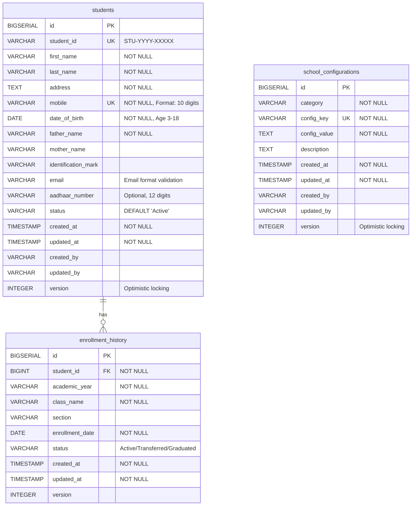

# Database Design - School Management System

## 1. Overview

The database design follows a normalized relational model using PostgreSQL 18+. The design emphasizes data integrity, performance, and auditability with strict constraints and optimized indexing strategies.

## 2. Database Schema Overview

### 2.1 Database Organization

```
School Management System Database (sms_db)
├── students (Student Management Schema)
├── school_configurations (Configuration Management Schema)
└── audit_logs (Future: Comprehensive audit trail)
```

### 2.2 Naming Conventions

**Standard:** `snake_case` for all database objects

- **Tables**: Plural nouns (e.g., `students`, `school_configurations`)
- **Columns**: Descriptive lowercase with underscores (e.g., `first_name`, `created_at`)
- **Primary Keys**: `id` (BIGSERIAL)
- **Foreign Keys**: `{referenced_table}_id` (e.g., `class_id`)
- **Indexes**: `idx_{table}_{column(s)}` (e.g., `idx_students_last_name`)
- **Constraints**: `chk_{table}_{description}` (e.g., `chk_students_age_range`)

## 3. Entity Relationship Diagram



## 4. Table Definitions

### 4.1 students Table

**Purpose:** Stores comprehensive student profile information with strict validation constraints.

```sql
CREATE TABLE students (
    -- Primary Key
    id                    BIGSERIAL PRIMARY KEY,

    -- Business Identifier (Auto-generated, Read-only)
    student_id            VARCHAR(20) NOT NULL UNIQUE,

    -- Personal Information (Required)
    first_name            VARCHAR(100) NOT NULL,
    last_name             VARCHAR(100) NOT NULL,
    address               TEXT NOT NULL,
    mobile                VARCHAR(15) NOT NULL UNIQUE,
    date_of_birth         DATE NOT NULL,

    -- Guardian Information
    father_name           VARCHAR(100) NOT NULL,  -- Guardian name
    mother_name           VARCHAR(100),

    -- Additional Information
    identification_mark   VARCHAR(200),
    email                 VARCHAR(100),
    aadhaar_number        VARCHAR(12),  -- Optional as per user clarification

    -- Status & Lifecycle
    status                VARCHAR(20) NOT NULL DEFAULT 'Active',

    -- Audit Columns (Auto-managed)
    created_at            TIMESTAMP NOT NULL DEFAULT CURRENT_TIMESTAMP,
    updated_at            TIMESTAMP NOT NULL DEFAULT CURRENT_TIMESTAMP,
    created_by            VARCHAR(100),
    updated_by            VARCHAR(100),

    -- Optimistic Locking
    version               INTEGER NOT NULL DEFAULT 0,

    -- Constraints
    CONSTRAINT chk_students_age_range CHECK (
        date_of_birth >= CURRENT_DATE - INTERVAL '18 years' AND
        date_of_birth <= CURRENT_DATE - INTERVAL '3 years'
    ),
    CONSTRAINT chk_students_status CHECK (
        status IN ('Active', 'Inactive', 'Graduated', 'Transferred')
    ),
    CONSTRAINT chk_students_mobile_format CHECK (
        mobile ~ '^\+?[0-9]{10,15}$'
    ),
    CONSTRAINT chk_students_email_format CHECK (
        email IS NULL OR email ~ '^[A-Za-z0-9._%+-]+@[A-Za-z0-9.-]+\.[A-Za-z]{2,}$'
    ),
    CONSTRAINT chk_students_aadhaar_format CHECK (
        aadhaar_number IS NULL OR aadhaar_number ~ '^[0-9]{12}$'
    ),
    CONSTRAINT chk_students_student_id_format CHECK (
        student_id ~ '^STU-[0-9]{4}-[0-9]{5}$'
    )
);

-- Table comment
COMMENT ON TABLE students IS 'Stores student profile information with comprehensive validation';

-- Column comments
COMMENT ON COLUMN students.student_id IS 'System-generated identifier in format STU-YYYY-XXXXX';
COMMENT ON COLUMN students.mobile IS 'Unique mobile number, primary contact method';
COMMENT ON COLUMN students.date_of_birth IS 'Must satisfy age range 3-18 years at registration';
COMMENT ON COLUMN students.status IS 'Active (enrolled), Inactive (suspended), Graduated, Transferred';
COMMENT ON COLUMN students.aadhaar_number IS 'Optional 12-digit Indian identification number';
COMMENT ON COLUMN students.version IS 'Optimistic locking version for concurrent update handling';
```

### 4.2 school_configurations Table

**Purpose:** Stores flexible key-value configuration settings grouped by category.

```sql
CREATE TABLE school_configurations (
    -- Primary Key
    id                    BIGSERIAL PRIMARY KEY,

    -- Configuration Grouping
    category              VARCHAR(50) NOT NULL,

    -- Configuration Key-Value
    config_key            VARCHAR(100) NOT NULL,
    config_value          TEXT NOT NULL,
    description           TEXT,

    -- Audit Columns
    created_at            TIMESTAMP NOT NULL DEFAULT CURRENT_TIMESTAMP,
    updated_at            TIMESTAMP NOT NULL DEFAULT CURRENT_TIMESTAMP,
    created_by            VARCHAR(100),
    updated_by            VARCHAR(100),

    -- Optimistic Locking
    version               INTEGER NOT NULL DEFAULT 0,

    -- Constraints
    CONSTRAINT uq_config_category_key UNIQUE (category, config_key),
    CONSTRAINT chk_config_category CHECK (
        category IN ('General', 'Academic', 'Financial', 'System')
    )
);

-- Table comment
COMMENT ON TABLE school_configurations IS 'Stores school-wide configuration settings grouped by category';

-- Column comments
COMMENT ON COLUMN school_configurations.category IS 'Configuration grouping: General, Academic, Financial, System';
COMMENT ON COLUMN school_configurations.config_key IS 'Unique key within category';
COMMENT ON COLUMN school_configurations.config_value IS 'Configuration value (supports text, numbers, URLs, JSON)';

-- Example configuration entries
INSERT INTO school_configurations (category, config_key, config_value, description) VALUES
('General', 'school_name', 'ABC International School', 'Official school name'),
('General', 'school_code', 'ABC-001', 'Unique school identifier'),
('General', 'school_logo_url', 'https://cdn.example.com/logos/school.png', 'School logo URL'),
('Academic', 'academic_year', '2024-2025', 'Current academic year'),
('Academic', 'default_class_capacity', '40', 'Maximum students per class'),
('Financial', 'default_currency', 'INR', 'Default currency for fees');
```

### 4.3 enrollment_history Table (Future Enhancement)

**Purpose:** Tracks student enrollment across academic years and classes.

```sql
CREATE TABLE enrollment_history (
    -- Primary Key
    id                    BIGSERIAL PRIMARY KEY,

    -- Foreign Key to Students
    student_id            BIGINT NOT NULL,

    -- Enrollment Details
    academic_year         VARCHAR(10) NOT NULL,
    class_name            VARCHAR(50) NOT NULL,
    section               VARCHAR(10),
    enrollment_date       DATE NOT NULL,
    status                VARCHAR(20) NOT NULL DEFAULT 'Active',

    -- Audit Columns
    created_at            TIMESTAMP NOT NULL DEFAULT CURRENT_TIMESTAMP,
    updated_at            TIMESTAMP NOT NULL DEFAULT CURRENT_TIMESTAMP,

    -- Optimistic Locking
    version               INTEGER NOT NULL DEFAULT 0,

    -- Constraints
    CONSTRAINT fk_enrollment_student FOREIGN KEY (student_id)
        REFERENCES students(id) ON DELETE CASCADE,
    CONSTRAINT chk_enrollment_status CHECK (
        status IN ('Active', 'Transferred', 'Graduated', 'Withdrawn')
    ),
    CONSTRAINT uq_student_academic_year UNIQUE (student_id, academic_year)
);

-- Table comment
COMMENT ON TABLE enrollment_history IS 'Tracks student enrollment history across academic years';
```

## 5. Indexing Strategy

### 5.1 students Table Indexes

```sql
-- Primary Key Index (automatic)
-- PRIMARY KEY (id)

-- Unique Indexes (automatic with UNIQUE constraint)
-- UNIQUE (student_id)
-- UNIQUE (mobile)

-- Performance Indexes for Common Queries
CREATE INDEX idx_students_last_name ON students(last_name);
COMMENT ON INDEX idx_students_last_name IS 'Speeds up search by last name';

CREATE INDEX idx_students_status ON students(status);
COMMENT ON INDEX idx_students_status IS 'Filters active/inactive students efficiently';

CREATE INDEX idx_students_date_of_birth ON students(date_of_birth);
COMMENT ON INDEX idx_students_date_of_birth IS 'Age-based queries and reporting';

CREATE INDEX idx_students_created_at ON students(created_at DESC);
COMMENT ON INDEX idx_students_created_at IS 'Recent registrations retrieval';

-- Composite Index for Search Operations
CREATE INDEX idx_students_search ON students(last_name, first_name);
COMMENT ON INDEX idx_students_search IS 'Combined name search optimization';

-- Partial Index for Active Students Only
CREATE INDEX idx_students_active ON students(last_name, first_name)
WHERE status = 'Active';
COMMENT ON INDEX idx_students_active IS 'Optimizes queries for active students only';

-- Index for Guardian Search
CREATE INDEX idx_students_father_name ON students(father_name);
COMMENT ON INDEX idx_students_father_name IS 'Search by guardian name';
```

### 5.2 school_configurations Table Indexes

```sql
-- Primary Key Index (automatic)
-- PRIMARY KEY (id)

-- Unique Composite Index (automatic)
-- UNIQUE (category, config_key)

-- Performance Index
CREATE INDEX idx_config_category ON school_configurations(category);
COMMENT ON INDEX idx_config_category IS 'Retrieve all configs by category efficiently';
```

### 5.3 Index Selection Rationale

| Index | Purpose | Expected Queries |
|-------|---------|------------------|
| `idx_students_last_name` | Student search | `WHERE last_name LIKE 'Smith%'` |
| `idx_students_status` | Filter by status | `WHERE status = 'Active'` |
| `idx_students_search` | Combined name search | `WHERE last_name = ? AND first_name = ?` |
| `idx_students_active` | Active student queries | `WHERE status = 'Active' AND last_name = ?` |
| `idx_students_father_name` | Guardian search | `WHERE father_name LIKE 'John%'` |
| `idx_config_category` | Category retrieval | `WHERE category = 'Academic'` |

## 6. Data Integrity Constraints

### 6.1 Primary Key Constraints

- **students.id**: BIGSERIAL (auto-incrementing, range: 1 to 9,223,372,036,854,775,807)
- **school_configurations.id**: BIGSERIAL

**Rationale:** BIGSERIAL provides sufficient capacity for millions of records while maintaining efficient indexing.

### 6.2 Unique Constraints

```sql
-- students table
ALTER TABLE students ADD CONSTRAINT uq_students_student_id UNIQUE (student_id);
ALTER TABLE students ADD CONSTRAINT uq_students_mobile UNIQUE (mobile);

-- school_configurations table
ALTER TABLE school_configurations ADD CONSTRAINT uq_config_category_key
    UNIQUE (category, config_key);
```

**Business Rules Enforced:**
- BR-2: Mobile number must be unique per student
- Student ID uniqueness system-wide
- Configuration keys unique within category

### 6.3 Check Constraints

**Age Validation (BR-1):**
```sql
CONSTRAINT chk_students_age_range CHECK (
    date_of_birth >= CURRENT_DATE - INTERVAL '18 years' AND
    date_of_birth <= CURRENT_DATE - INTERVAL '3 years'
)
```

**Status Validation:**
```sql
CONSTRAINT chk_students_status CHECK (
    status IN ('Active', 'Inactive', 'Graduated', 'Transferred')
)
```

**Mobile Format Validation:**
```sql
CONSTRAINT chk_students_mobile_format CHECK (
    mobile ~ '^\+?[0-9]{10,15}$'
)
```

**Email Format Validation:**
```sql
CONSTRAINT chk_students_email_format CHECK (
    email IS NULL OR email ~ '^[A-Za-z0-9._%+-]+@[A-Za-z0-9.-]+\.[A-Za-z]{2,}$'
)
```

### 6.4 NOT NULL Constraints

**Required Fields (students):**
- `first_name`, `last_name` - Identity required
- `address` - Contact information
- `mobile` - Primary communication channel
- `date_of_birth` - Age validation prerequisite
- `father_name` - Guardian information
- `status` - Lifecycle state
- `created_at`, `updated_at` - Audit trail

**Optional Fields:**
- `mother_name`, `identification_mark`, `email`, `aadhaar_number` - Supplementary data

## 7. Optimistic Locking Strategy

### 7.1 Version Column

Every table includes a `version` column (INTEGER) for JPA @Version support:

```sql
version INTEGER NOT NULL DEFAULT 0
```

### 7.2 Update Flow

```sql
-- Application-level optimistic locking
UPDATE students
SET
    first_name = 'Updated Name',
    updated_at = CURRENT_TIMESTAMP,
    version = version + 1
WHERE
    id = 123
    AND version = 5;  -- Current version check

-- If rows affected = 0, throw OptimisticLockException
```

### 7.3 Conflict Resolution

**Scenario:** Two users update the same student simultaneously.

```
User A: Reads student (version=5) -> Updates -> version=6 (SUCCESS)
User B: Reads student (version=5) -> Updates -> version=6 (FAILS)
```

User B receives `OptimisticLockException` and must:
1. Refresh data (now version=6)
2. Review changes
3. Retry update

## 8. Audit Trail Design

### 8.1 Standard Audit Columns

Every table includes:

```sql
created_at    TIMESTAMP NOT NULL DEFAULT CURRENT_TIMESTAMP
updated_at    TIMESTAMP NOT NULL DEFAULT CURRENT_TIMESTAMP
created_by    VARCHAR(100)  -- Future: User ID from auth system
updated_by    VARCHAR(100)  -- Future: User ID from auth system
```

### 8.2 Automatic Update Trigger

```sql
-- Function to update updated_at timestamp
CREATE OR REPLACE FUNCTION update_updated_at_column()
RETURNS TRIGGER AS $$
BEGIN
    NEW.updated_at = CURRENT_TIMESTAMP;
    RETURN NEW;
END;
$$ LANGUAGE plpgsql;

-- Trigger for students table
CREATE TRIGGER trg_students_updated_at
BEFORE UPDATE ON students
FOR EACH ROW
EXECUTE FUNCTION update_updated_at_column();

-- Trigger for school_configurations table
CREATE TRIGGER trg_config_updated_at
BEFORE UPDATE ON school_configurations
FOR EACH ROW
EXECUTE FUNCTION update_updated_at_column();
```

### 8.3 Future: Comprehensive Audit Log

```sql
CREATE TABLE audit_logs (
    id                BIGSERIAL PRIMARY KEY,
    table_name        VARCHAR(50) NOT NULL,
    record_id         BIGINT NOT NULL,
    operation         VARCHAR(10) NOT NULL,  -- INSERT, UPDATE, DELETE
    changed_by        VARCHAR(100),
    changed_at        TIMESTAMP NOT NULL DEFAULT CURRENT_TIMESTAMP,
    old_values        JSONB,
    new_values        JSONB,
    correlation_id    VARCHAR(36)  -- Link to request trace
);

CREATE INDEX idx_audit_table_record ON audit_logs(table_name, record_id);
CREATE INDEX idx_audit_changed_at ON audit_logs(changed_at DESC);
```

## 9. Student ID Generation Strategy

### 9.1 Format Specification

**Pattern:** `STU-YYYY-XXXXX`

- **STU**: Fixed prefix
- **YYYY**: Year of registration (e.g., 2025)
- **XXXXX**: Sequential 5-digit number (00001-99999)

**Examples:**
- First student in 2025: `STU-2025-00001`
- 100th student in 2025: `STU-2025-00100`
- First student in 2026: `STU-2026-00001`

### 9.2 Database Sequence Approach

```sql
-- Create sequence for student ID generation
CREATE SEQUENCE seq_student_id_2025
    START WITH 1
    INCREMENT BY 1
    MINVALUE 1
    MAXVALUE 99999
    CYCLE;

-- Function to generate student ID
CREATE OR REPLACE FUNCTION generate_student_id()
RETURNS VARCHAR(20) AS $$
DECLARE
    current_year VARCHAR(4);
    sequence_name VARCHAR(50);
    next_val INTEGER;
    student_id VARCHAR(20);
BEGIN
    current_year := EXTRACT(YEAR FROM CURRENT_DATE)::VARCHAR;
    sequence_name := 'seq_student_id_' || current_year;

    -- Create sequence if not exists (dynamic)
    EXECUTE format('CREATE SEQUENCE IF NOT EXISTS %I START WITH 1 MAXVALUE 99999 CYCLE', sequence_name);

    -- Get next value
    EXECUTE format('SELECT nextval(%L)', sequence_name) INTO next_val;

    -- Format student ID
    student_id := 'STU-' || current_year || '-' || LPAD(next_val::VARCHAR, 5, '0');

    RETURN student_id;
END;
$$ LANGUAGE plpgsql;

-- Trigger to auto-generate student_id on insert
CREATE OR REPLACE FUNCTION set_student_id()
RETURNS TRIGGER AS $$
BEGIN
    IF NEW.student_id IS NULL THEN
        NEW.student_id := generate_student_id();
    END IF;
    RETURN NEW;
END;
$$ LANGUAGE plpgsql;

CREATE TRIGGER trg_set_student_id
BEFORE INSERT ON students
FOR EACH ROW
EXECUTE FUNCTION set_student_id();
```

### 9.3 Alternative: Application-Level Generation

**Advantage:** Better control, easier to test
**Implementation:** Spring Boot service handles generation

```java
// Will be implemented in backend as per 05-backend-implementation-guide.md
public String generateStudentId() {
    String year = String.valueOf(LocalDate.now().getYear());
    Long sequence = studentRepository.countByStudentIdStartingWith("STU-" + year) + 1;
    return String.format("STU-%s-%05d", year, sequence);
}
```

## 10. Data Migration & Seeding

### 10.1 Initial Schema Creation

```sql
-- database-schema.sql
-- Run this script to initialize the database

-- Create students table
CREATE TABLE students (...);

-- Create school_configurations table
CREATE TABLE school_configurations (...);

-- Create indexes
CREATE INDEX idx_students_last_name ON students(last_name);
-- ... (all indexes)

-- Create triggers
CREATE TRIGGER trg_students_updated_at ...;
CREATE TRIGGER trg_set_student_id ...;
```

### 10.2 Seed Data (Development/Testing)

```sql
-- seed-data.sql
-- Insert default school configurations
INSERT INTO school_configurations (category, config_key, config_value, description) VALUES
('General', 'school_name', 'Demo School', 'School name'),
('General', 'school_code', 'DEMO-001', 'School code'),
('General', 'school_logo_url', 'https://example.com/logo.png', 'Logo URL'),
('Academic', 'academic_year', '2024-2025', 'Current academic year'),
('Academic', 'default_class_capacity', '40', 'Max students per class'),
('System', 'date_format', 'DD-MM-YYYY', 'Display date format'),
('System', 'timezone', 'Asia/Kolkata', 'School timezone');

-- Insert sample students (for testing)
INSERT INTO students (
    student_id, first_name, last_name, address, mobile,
    date_of_birth, father_name, mother_name, email, status
) VALUES
('STU-2025-00001', 'Rajesh', 'Kumar', '123 MG Road, Bangalore', '+919876543210', '2015-05-15', 'Suresh Kumar', 'Lakshmi Kumar', 'rajesh.kumar@example.com', 'Active'),
('STU-2025-00002', 'Priya', 'Sharma', '456 Park Street, Mumbai', '+918765432109', '2014-08-20', 'Amit Sharma', 'Neha Sharma', 'priya.sharma@example.com', 'Active'),
('STU-2025-00003', 'Arjun', 'Patel', '789 Lake View, Delhi', '+917654321098', '2016-03-10', 'Vijay Patel', 'Anjali Patel', NULL, 'Active');
```

## 11. Performance Optimization

### 11.1 Query Optimization Strategies

**1. Index Usage Analysis**
```sql
-- Check index usage statistics
SELECT
    schemaname,
    tablename,
    indexname,
    idx_scan,
    idx_tup_read,
    idx_tup_fetch
FROM pg_stat_user_indexes
WHERE schemaname = 'public'
ORDER BY idx_scan DESC;
```

**2. Slow Query Identification**
```sql
-- Enable query logging in postgresql.conf
log_min_duration_statement = 200  -- Log queries slower than 200ms
```

**3. EXPLAIN ANALYZE for Query Plans**
```sql
EXPLAIN ANALYZE
SELECT * FROM students
WHERE last_name = 'Kumar'
  AND status = 'Active'
ORDER BY created_at DESC
LIMIT 20;
```

### 11.2 Connection Pooling

**HikariCP Configuration (Application Level):**
```yaml
spring:
  datasource:
    hikari:
      maximum-pool-size: 20
      minimum-idle: 5
      connection-timeout: 30000
      idle-timeout: 600000
      max-lifetime: 1800000
```

### 11.3 Partitioning Strategy (Future)

**For Large Datasets (>1M students):**
```sql
-- Partition students by academic year
CREATE TABLE students_2025 PARTITION OF students
FOR VALUES FROM ('2025-01-01') TO ('2026-01-01');

CREATE TABLE students_2026 PARTITION OF students
FOR VALUES FROM ('2026-01-01') TO ('2027-01-01');
```

## 12. Data Retention & Archival

### 12.1 Soft Delete Strategy

Students are NEVER hard-deleted. Instead, update status:

```sql
-- Soft delete (update status)
UPDATE students
SET status = 'Inactive',
    updated_at = CURRENT_TIMESTAMP,
    updated_by = 'system'
WHERE id = 123;
```

### 12.2 Archival Strategy (Future)

```sql
-- Create archive table
CREATE TABLE students_archived (LIKE students INCLUDING ALL);

-- Move graduated students to archive (annual process)
INSERT INTO students_archived
SELECT * FROM students
WHERE status = 'Graduated'
  AND updated_at < CURRENT_DATE - INTERVAL '2 years';

-- Verify and delete from main table
DELETE FROM students
WHERE id IN (SELECT id FROM students_archived);
```

## 13. Backup & Recovery

### 13.1 Backup Strategy

**Full Backup (Daily):**
```bash
pg_dump -U postgres -d sms_db -F c -f sms_db_backup_$(date +%Y%m%d).dump
```

**Incremental Backup (Hourly):**
```bash
# Use PostgreSQL WAL archiving
archive_mode = on
archive_command = 'cp %p /mnt/backup/archive/%f'
```

### 13.2 Point-in-Time Recovery

```bash
# Restore base backup
pg_restore -U postgres -d sms_db_restored sms_db_backup_20250115.dump

# Apply WAL logs up to specific timestamp
recovery_target_time = '2025-01-15 14:30:00'
```

## 14. Database Security

### 14.1 User Roles & Permissions

```sql
-- Application user (limited permissions)
CREATE ROLE sms_app_user WITH LOGIN PASSWORD 'secure_password';

-- Grant specific permissions
GRANT SELECT, INSERT, UPDATE ON students TO sms_app_user;
GRANT SELECT, INSERT, UPDATE ON school_configurations TO sms_app_user;
GRANT USAGE, SELECT ON ALL SEQUENCES IN SCHEMA public TO sms_app_user;

-- Read-only user (for reporting)
CREATE ROLE sms_readonly WITH LOGIN PASSWORD 'readonly_password';
GRANT SELECT ON ALL TABLES IN SCHEMA public TO sms_readonly;
```

### 14.2 Row-Level Security (Future: Multi-Tenancy)

```sql
-- Enable RLS
ALTER TABLE students ENABLE ROW LEVEL SECURITY;

-- Policy for tenant isolation
CREATE POLICY tenant_isolation ON students
USING (school_id = current_setting('app.current_school_id')::INT);
```

### 14.3 Sensitive Data Protection

**Encryption at Rest:**
- PostgreSQL cluster-level encryption
- Disk encryption (OS level)

**Encryption in Transit:**
- SSL/TLS for database connections
- Configure in `postgresql.conf`: `ssl = on`

## 15. Monitoring & Health Checks

### 15.1 Database Metrics to Monitor

```sql
-- Active connections
SELECT count(*) FROM pg_stat_activity;

-- Table sizes
SELECT
    schemaname,
    tablename,
    pg_size_pretty(pg_total_relation_size(schemaname||'.'||tablename)) AS size
FROM pg_tables
WHERE schemaname = 'public'
ORDER BY pg_total_relation_size(schemaname||'.'||tablename) DESC;

-- Index hit ratio (should be >95%)
SELECT
    sum(idx_blks_hit) / nullif(sum(idx_blks_hit + idx_blks_read), 0) * 100 AS index_hit_ratio
FROM pg_statio_user_indexes;

-- Deadlocks
SELECT * FROM pg_stat_database WHERE datname = 'sms_db';
```

### 15.2 Automated Health Checks

```sql
-- Create health check view
CREATE VIEW db_health AS
SELECT
    (SELECT count(*) FROM students WHERE status = 'Active') AS active_students,
    (SELECT count(*) FROM school_configurations) AS config_count,
    (SELECT pg_database_size('sms_db')) AS db_size_bytes,
    (SELECT count(*) FROM pg_stat_activity) AS active_connections,
    CURRENT_TIMESTAMP AS checked_at;
```

## 16. Summary

### 16.1 Key Database Features

| Feature | Implementation |
|---------|----------------|
| **Primary Keys** | BIGSERIAL for scalability |
| **Unique Constraints** | student_id, mobile, config keys |
| **Check Constraints** | Age (3-18), status values, format validations |
| **Indexes** | Optimized for search (last_name, mobile, status) |
| **Optimistic Locking** | Version column for concurrency |
| **Audit Trail** | created_at, updated_at, created_by, updated_by |
| **Auto-timestamps** | Triggers for updated_at |
| **Student ID Generation** | Database function or application-level |
| **Soft Delete** | Status-based (no hard deletes) |

### 16.2 Performance Targets

- **Query Response Time**: <50ms for indexed searches
- **Insert Performance**: >1000 records/second (batch)
- **Concurrent Connections**: Support 100+ via HikariCP
- **Index Hit Ratio**: >95%
- **Cache Hit Ratio**: >80% (with Redis)

### 16.3 Data Integrity Guarantees

1. **Referential Integrity**: Foreign key constraints
2. **Business Rule Enforcement**: Check constraints (age, status, formats)
3. **Uniqueness**: student_id, mobile
4. **Concurrency Control**: Optimistic locking prevents lost updates
5. **Audit Compliance**: Full audit trail for all changes

This database design provides a robust, scalable, and performant foundation for the School Management System while maintaining strict data integrity and supporting future enhancements.
