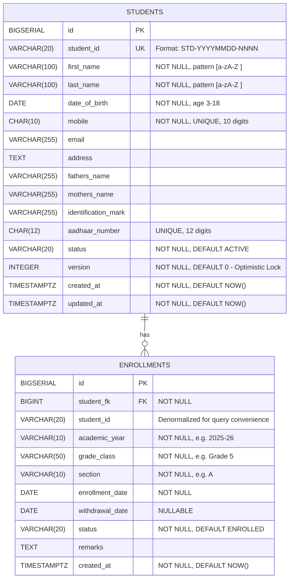
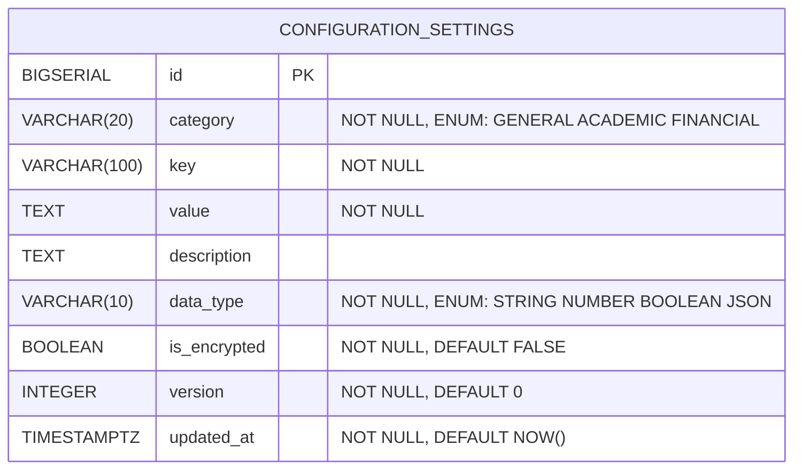

# 02 - Database Design

## Cross-Reference Index
- Business Requirements: `specs/REQUIREMENTS.md` (Section 6: Data Model)
- API Contracts: `specs/sms_api_specification.yaml` (StudentBase, Enrollment, Configuration schemas)
- System Architecture: `specs/architecture/01-system-architecture.md` (Database-per-Service constraint)
- Business Rules: `specs/architecture/03-business-rules.md` (Age 3-18, Mobile Unique, Class Capacity)

---

## 1. Database Isolation Policy

Each microservice owns exactly one isolated database. No service may connect to another service's database.

| Service | Database Name | Port |
|---|---|---|
| Student Service | `student_db` | 5432 |
| Configuration Service | `config_db` | 5433 |

---

## 2. Entity-Relationship Diagram

### 2.1 Student Service - ERD


```mermaid
erDiagram
    STUDENTS {
        BIGSERIAL id PK
        VARCHAR(20) student_id UK "Format: STD-YYYYMMDD-NNNN"
        VARCHAR(100) first_name "NOT NULL, pattern [a-zA-Z ]"
        VARCHAR(100) last_name "NOT NULL, pattern [a-zA-Z ]"
        DATE date_of_birth "NOT NULL, age 3-18"
        CHAR(10) mobile "NOT NULL, UNIQUE, 10 digits"
        VARCHAR(255) email
        TEXT address
        VARCHAR(255) fathers_name
        VARCHAR(255) mothers_name
        VARCHAR(255) identification_mark
        CHAR(12) aadhaar_number "UNIQUE, 12 digits"
        VARCHAR(20) status "NOT NULL, DEFAULT ACTIVE"
        INTEGER version "NOT NULL, DEFAULT 0 - Optimistic Lock"
        TIMESTAMPTZ created_at "NOT NULL, DEFAULT NOW()"
        TIMESTAMPTZ updated_at "NOT NULL, DEFAULT NOW()"
    }

    ENROLLMENTS {
        BIGSERIAL id PK
        BIGINT student_fk FK "NOT NULL"
        VARCHAR(20) student_id "Denormalized for query convenience"
        VARCHAR(10) academic_year "NOT NULL, e.g. 2025-26"
        VARCHAR(50) grade_class "NOT NULL, e.g. Grade 5"
        VARCHAR(10) section "NOT NULL, e.g. A"
        DATE enrollment_date "NOT NULL"
        DATE withdrawal_date "NULLABLE"
        VARCHAR(20) status "NOT NULL, DEFAULT ENROLLED"
        TEXT remarks
        TIMESTAMPTZ created_at "NOT NULL, DEFAULT NOW()"
    }

    STUDENTS ||--o{ ENROLLMENTS : "has"
```

### 2.2 Configuration Service - ERD


```mermaid
erDiagram
    CONFIGURATION_SETTINGS {
        BIGSERIAL id PK
        VARCHAR(20) category "NOT NULL, ENUM: GENERAL ACADEMIC FINANCIAL"
        VARCHAR(100) key "NOT NULL"
        TEXT value "NOT NULL"
        TEXT description
        VARCHAR(10) data_type "NOT NULL, ENUM: STRING NUMBER BOOLEAN JSON"
        BOOLEAN is_encrypted "NOT NULL, DEFAULT FALSE"
        INTEGER version "NOT NULL, DEFAULT 0"
        TIMESTAMPTZ updated_at "NOT NULL, DEFAULT NOW()"
    }
```

---

## 3. DDL Definitions

### 3.1 Student Service - `student_db`

```sql
-- Enable UUID extension (for future use)
CREATE EXTENSION IF NOT EXISTS "uuid-ossp";

-- Sequence for generating StudentID suffix
CREATE SEQUENCE IF NOT EXISTS student_id_seq START 1 INCREMENT 1;

-- Students table
CREATE TABLE students (
    id                  BIGSERIAL           PRIMARY KEY,
    student_id          VARCHAR(20)         NOT NULL UNIQUE,
    first_name          VARCHAR(100)        NOT NULL,
    last_name           VARCHAR(100)        NOT NULL,
    date_of_birth       DATE                NOT NULL,
    mobile              CHAR(10)            NOT NULL,
    email               VARCHAR(255),
    address             TEXT,
    fathers_name        VARCHAR(255),
    mothers_name        VARCHAR(255),
    identification_mark VARCHAR(255),
    aadhaar_number      CHAR(12),
    status              VARCHAR(20)         NOT NULL DEFAULT 'ACTIVE',
    version             INTEGER             NOT NULL DEFAULT 0,
    created_at          TIMESTAMPTZ         NOT NULL DEFAULT NOW(),
    updated_at          TIMESTAMPTZ         NOT NULL DEFAULT NOW(),

    CONSTRAINT uq_students_mobile          UNIQUE (mobile),
    CONSTRAINT uq_students_aadhaar         UNIQUE (aadhaar_number),
    CONSTRAINT chk_students_status         CHECK (status IN ('ACTIVE', 'INACTIVE')),
    CONSTRAINT chk_students_first_name     CHECK (first_name ~ '^[a-zA-Z ]+$'),
    CONSTRAINT chk_students_last_name      CHECK (last_name ~ '^[a-zA-Z ]+$'),
    CONSTRAINT chk_students_mobile_digits  CHECK (mobile ~ '^\d{10}$'),
    CONSTRAINT chk_students_aadhaar_digits CHECK (aadhaar_number IS NULL OR aadhaar_number ~ '^\d{12}$'),
    CONSTRAINT chk_students_dob_min_age    CHECK (
        date_of_birth <= CURRENT_DATE - INTERVAL '3 years'
    ),
    CONSTRAINT chk_students_dob_max_age    CHECK (
        date_of_birth >= CURRENT_DATE - INTERVAL '18 years'
    )
);

-- Indexes for search predicates
CREATE INDEX idx_students_last_name  ON students (last_name);
CREATE INDEX idx_students_status     ON students (status);
CREATE INDEX idx_students_student_id ON students (student_id);

-- Trigger: auto-update updated_at on row modification
CREATE OR REPLACE FUNCTION update_updated_at_column()
RETURNS TRIGGER AS $$
BEGIN
    NEW.updated_at = NOW();
    RETURN NEW;
END;
$$ LANGUAGE plpgsql;

CREATE TRIGGER trg_students_updated_at
    BEFORE UPDATE ON students
    FOR EACH ROW EXECUTE FUNCTION update_updated_at_column();
```

```sql
-- Enrollments table
CREATE TABLE enrollments (
    id              BIGSERIAL       PRIMARY KEY,
    student_fk      BIGINT          NOT NULL,
    student_id      VARCHAR(20)     NOT NULL,
    academic_year   VARCHAR(10)     NOT NULL,
    grade_class     VARCHAR(50)     NOT NULL,
    section         VARCHAR(10)     NOT NULL,
    enrollment_date DATE            NOT NULL,
    withdrawal_date DATE,
    status          VARCHAR(20)     NOT NULL DEFAULT 'ENROLLED',
    remarks         TEXT,
    created_at      TIMESTAMPTZ     NOT NULL DEFAULT NOW(),

    CONSTRAINT fk_enrollments_student
        FOREIGN KEY (student_fk) REFERENCES students(id) ON DELETE CASCADE,

    CONSTRAINT uq_enrollments_student_year
        UNIQUE (student_fk, academic_year),

    CONSTRAINT chk_enrollments_status
        CHECK (status IN ('ENROLLED', 'WITHDRAWN', 'COMPLETED')),

    CONSTRAINT chk_enrollments_dates
        CHECK (withdrawal_date IS NULL OR withdrawal_date >= enrollment_date)
);

CREATE INDEX idx_enrollments_student_fk ON enrollments (student_fk);
CREATE INDEX idx_enrollments_student_id ON enrollments (student_id);
```

### 3.2 Configuration Service - `config_db`

```sql
-- Configuration settings table
CREATE TABLE configuration_settings (
    id           BIGSERIAL       PRIMARY KEY,
    category     VARCHAR(20)     NOT NULL,
    key          VARCHAR(100)    NOT NULL,
    value        TEXT            NOT NULL,
    description  TEXT,
    data_type    VARCHAR(10)     NOT NULL DEFAULT 'STRING',
    is_encrypted BOOLEAN         NOT NULL DEFAULT FALSE,
    version      INTEGER         NOT NULL DEFAULT 0,
    updated_at   TIMESTAMPTZ     NOT NULL DEFAULT NOW(),

    CONSTRAINT uq_config_category_key
        UNIQUE (category, key),

    CONSTRAINT chk_config_category
        CHECK (category IN ('GENERAL', 'ACADEMIC', 'FINANCIAL')),

    CONSTRAINT chk_config_data_type
        CHECK (data_type IN ('STRING', 'NUMBER', 'BOOLEAN', 'JSON'))
);

CREATE INDEX idx_config_category ON configuration_settings (category);
CREATE INDEX idx_config_key      ON configuration_settings (key);

CREATE OR REPLACE FUNCTION update_config_updated_at()
RETURNS TRIGGER AS $$
BEGIN
    NEW.updated_at = NOW();
    RETURN NEW;
END;
$$ LANGUAGE plpgsql;

CREATE TRIGGER trg_config_updated_at
    BEFORE UPDATE ON configuration_settings
    FOR EACH ROW EXECUTE FUNCTION update_config_updated_at();
```

---

## 4. StudentID Generation Strategy

The `student_id` follows the format `STD-YYYYMMDD-NNNN` (e.g., `STD-20260212-0001`).

Generation occurs in the Application Layer (not the DB) to keep the format deterministic and testable:

```java
// In StudentCommandService (Application Layer)
private String generateStudentId() {
    String datePart = LocalDate.now().format(DateTimeFormatter.ofPattern("yyyyMMdd"));
    long nextVal = studentIdSequenceRepository.nextValue(); // custom sequence table or DB sequence
    return String.format("STD-%s-%04d", datePart, nextVal);
}
```

A dedicated `student_id_sequence` PostgreSQL sequence (created above) provides atomic, collision-free values.

---

## 5. Optimistic Locking

Both `students` and `configuration_settings` tables carry a `version INTEGER NOT NULL DEFAULT 0` column.

In JPA entities:
```java
@Version
private Integer version;
```

On update, JPA automatically adds `WHERE id = ? AND version = ?` to the SQL. If the row has been modified concurrently, `OptimisticLockException` is thrown and translated to HTTP 409 by the global exception handler.

---

## 6. Audit Column Standards

| Column | Type | Rule |
|---|---|---|
| `created_at` | `TIMESTAMPTZ NOT NULL DEFAULT NOW()` | Set once on INSERT; never updated |
| `updated_at` | `TIMESTAMPTZ NOT NULL DEFAULT NOW()` | Updated via DB trigger on every UPDATE |
| `version` | `INTEGER NOT NULL DEFAULT 0` | Incremented by JPA `@Version` on every UPDATE |

---

## 7. Naming Conventions

| Convention | Standard |
|---|---|
| Table names | `snake_case` plural (e.g., `students`, `enrollments`) |
| Column names | `snake_case` (e.g., `first_name`, `date_of_birth`) |
| Primary keys | `id BIGSERIAL PRIMARY KEY` |
| Foreign keys | `{table_singular}_fk` (e.g., `student_fk`) |
| Unique constraints | `uq_{table}_{column}` |
| Check constraints | `chk_{table}_{column}` |
| Indexes | `idx_{table}_{column}` |
| Triggers | `trg_{table}_{purpose}` |

---

## 8. Frontend-to-Database Field Alignment

The following table confirms all fields exposed in the API (`specs/sms_api_specification.yaml`) have corresponding database columns:

| API Field (camelCase) | DB Column (snake_case) | Type | Constraints |
|---|---|---|---|
| `firstName` | `first_name` | `VARCHAR(100)` | NOT NULL, `[a-zA-Z ]` pattern |
| `lastName` | `last_name` | `VARCHAR(100)` | NOT NULL, `[a-zA-Z ]` pattern |
| `dateOfBirth` | `date_of_birth` | `DATE` | NOT NULL, age 3-18 CHECK |
| `mobile` | `mobile` | `CHAR(10)` | NOT NULL, UNIQUE, `\d{10}` pattern |
| `email` | `email` | `VARCHAR(255)` | Optional |
| `address` | `address` | `TEXT` | Optional |
| `fathersName` | `fathers_name` | `VARCHAR(255)` | Optional |
| `mothersName` | `mothers_name` | `VARCHAR(255)` | Optional |
| `identificationMark` | `identification_mark` | `VARCHAR(255)` | Optional |
| `aadhaarNumber` | `aadhaar_number` | `CHAR(12)` | UNIQUE, `\d{12}` pattern |
| `studentId` | `student_id` | `VARCHAR(20)` | NOT NULL, UNIQUE, auto-generated |
| `status` | `status` | `VARCHAR(20)` | NOT NULL, ENUM CHECK |
| `version` | `version` | `INTEGER` | NOT NULL, DEFAULT 0 |
| `createdAt` | `created_at` | `TIMESTAMPTZ` | NOT NULL, DEFAULT NOW() |
| `updatedAt` | `updated_at` | `TIMESTAMPTZ` | NOT NULL, DEFAULT NOW() |

---

## 9. Indexing Strategy

### Student DB Indexes

| Index | Columns | Rationale |
|---|---|---|
| `idx_students_last_name` | `last_name` | Search by last name (most frequent query) |
| `idx_students_status` | `status` | Filter by status |
| `idx_students_student_id` | `student_id` | Lookup by business key |
| `uq_students_mobile` | `mobile` | Enforces BR-2 uniqueness + fast lookup |
| `uq_students_aadhaar` | `aadhaar_number` | Uniqueness enforcement + fast lookup |
| `idx_enrollments_student_fk` | `student_fk` | Foreign key join performance |

### Configuration DB Indexes

| Index | Columns | Rationale |
|---|---|---|
| `idx_config_category` | `category` | Filter configurations by category |
| `uq_config_category_key` | `(category, key)` | Upsert uniqueness and lookup |

---

## 10. Migration Strategy

Database migrations are managed with **Flyway** integrated with Spring Boot.

- Migration scripts location: `src/main/resources/db/migration/`
- Naming convention: `V{version}__{description}.sql` (e.g., `V1__init_students.sql`)
- Flyway runs automatically on service startup in development
- Production migrations must be reviewed and approved before deployment

Flyway dependency (Maven):
```xml
<dependency>
    <groupId>org.flywaydb</groupId>
    <artifactId>flyway-core</artifactId>
</dependency>
<dependency>
    <groupId>org.flywaydb</groupId>
    <artifactId>flyway-database-postgresql</artifactId>
</dependency>
```
