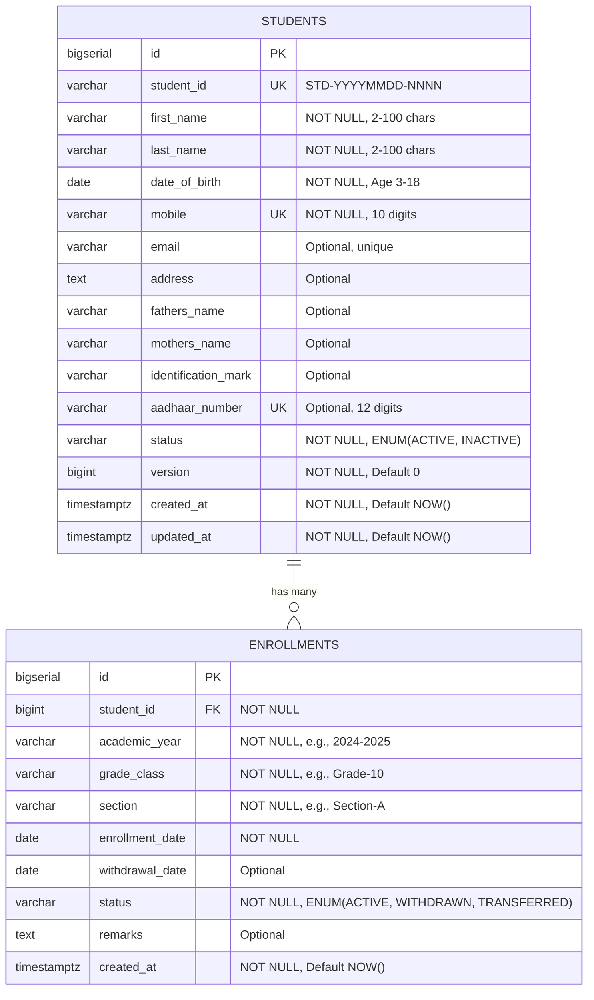
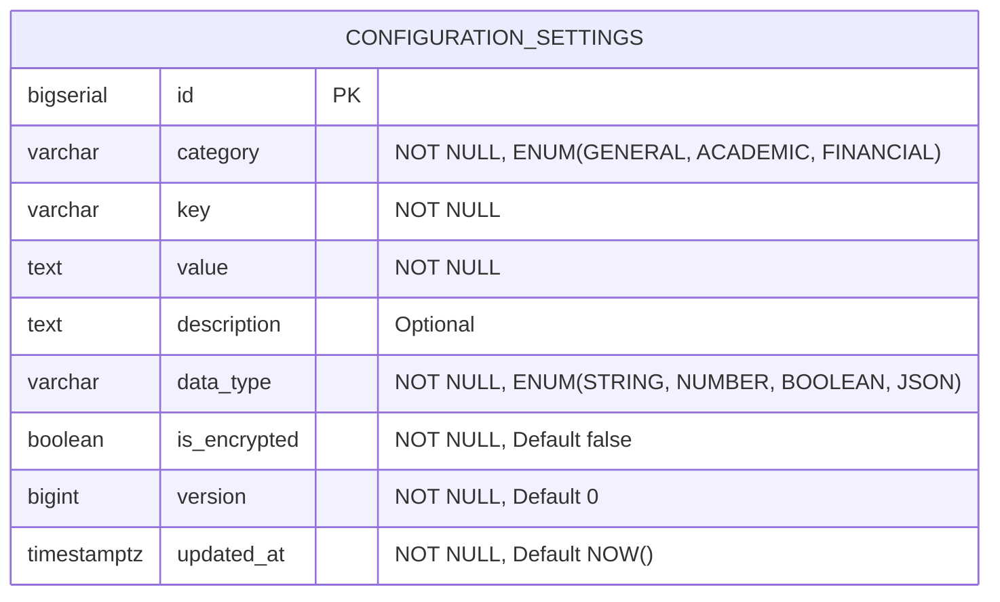

# Database Design Specification
**School Management System (SMS)**
Version: 1.0.0
Last Updated: 2026-01-28

---

## 1. Overview

This document defines the physical database schema for the Student and Configuration microservices, adhering to the **Database-per-Service** pattern. Each service maintains complete isolation with no cross-database joins or foreign keys.

### 1.1 Design Principles

- **Naming Convention**: `snake_case` for tables and columns
- **Primary Keys**: `BIGSERIAL` for auto-incrementing IDs
- **Audit Columns**: Standardized `created_at`, `updated_at` timestamps
- **Optimistic Locking**: `version` column (BIGINT) for concurrency control
- **Indexing**: Strategic indexes for foreign keys and search columns
- **Data Types**: Strict typing with constraints (CHECK, NOT NULL, UNIQUE)

---

## 2. Database Instances

| Database | Service | Port | Purpose |
|----------|---------|------|---------|
| `student_db` | Student Service | 5432 | Student records, enrollments |
| `config_db` | Configuration Service | 5433 | Key-value configuration settings |

---

## 3. Student Database Schema

### 3.1 Entity Relationship Diagram


```mermaid
erDiagram
    STUDENTS ||--o{ ENROLLMENTS : "has many"

    STUDENTS {
        bigserial id PK
        varchar student_id UK "STD-YYYYMMDD-NNNN"
        varchar first_name "NOT NULL, 2-100 chars"
        varchar last_name "NOT NULL, 2-100 chars"
        date date_of_birth "NOT NULL, Age 3-18"
        varchar mobile UK "NOT NULL, 10 digits"
        varchar email "Optional, unique"
        text address "Optional"
        varchar fathers_name "Optional"
        varchar mothers_name "Optional"
        varchar identification_mark "Optional"
        varchar aadhaar_number UK "Optional, 12 digits"
        varchar status "NOT NULL, ENUM(ACTIVE, INACTIVE)"
        bigint version "NOT NULL, Default 0"
        timestamptz created_at "NOT NULL, Default NOW()"
        timestamptz updated_at "NOT NULL, Default NOW()"
    }

    ENROLLMENTS {
        bigserial id PK
        bigint student_id FK "NOT NULL"
        varchar academic_year "NOT NULL, e.g., 2024-2025"
        varchar grade_class "NOT NULL, e.g., Grade-10"
        varchar section "NOT NULL, e.g., Section-A"
        date enrollment_date "NOT NULL"
        date withdrawal_date "Optional"
        varchar status "NOT NULL, ENUM(ACTIVE, WITHDRAWN, TRANSFERRED)"
        text remarks "Optional"
        timestamptz created_at "NOT NULL, Default NOW()"
    }
```

---

### 3.2 Table Definitions

#### 3.2.1 `students` Table

**Purpose**: Core student records with personal information.

**DDL**:
```sql
CREATE TABLE students (
    -- Primary Key
    id                     BIGSERIAL PRIMARY KEY,

    -- Business Identifier
    student_id             VARCHAR(20) NOT NULL UNIQUE,

    -- Personal Information (Required)
    first_name             VARCHAR(100) NOT NULL CHECK (length(first_name) >= 2),
    last_name              VARCHAR(100) NOT NULL CHECK (length(last_name) >= 2),
    date_of_birth          DATE NOT NULL CHECK (
        date_of_birth <= CURRENT_DATE - INTERVAL '3 years' AND
        date_of_birth >= CURRENT_DATE - INTERVAL '18 years'
    ),
    mobile                 VARCHAR(10) NOT NULL UNIQUE CHECK (mobile ~ '^\d{10}$'),

    -- Personal Information (Optional)
    email                  VARCHAR(255) UNIQUE CHECK (email ~* '^[A-Za-z0-9._%+-]+@[A-Za-z0-9.-]+\.[A-Z|a-z]{2,}$'),
    address                TEXT,
    fathers_name           VARCHAR(100),
    mothers_name           VARCHAR(100),
    identification_mark    VARCHAR(200),
    aadhaar_number         VARCHAR(12) UNIQUE CHECK (aadhaar_number IS NULL OR aadhaar_number ~ '^\d{12}$'),

    -- Status
    status                 VARCHAR(20) NOT NULL DEFAULT 'ACTIVE' CHECK (status IN ('ACTIVE', 'INACTIVE')),

    -- Concurrency Control
    version                BIGINT NOT NULL DEFAULT 0,

    -- Audit Columns
    created_at             TIMESTAMPTZ NOT NULL DEFAULT NOW(),
    updated_at             TIMESTAMPTZ NOT NULL DEFAULT NOW()
);

-- Indexes
CREATE INDEX idx_students_last_name ON students(last_name);
CREATE INDEX idx_students_status ON students(status);
CREATE INDEX idx_students_mobile ON students(mobile);
CREATE INDEX idx_students_aadhaar ON students(aadhaar_number) WHERE aadhaar_number IS NOT NULL;
CREATE INDEX idx_students_created_at ON students(created_at);

-- Comments
COMMENT ON TABLE students IS 'Core student records with personal and contact information';
COMMENT ON COLUMN students.student_id IS 'Human-readable ID format: STD-YYYYMMDD-NNNN';
COMMENT ON COLUMN students.date_of_birth IS 'Enforces age between 3 and 18 years via CHECK constraint';
COMMENT ON COLUMN students.mobile IS '10-digit phone number, must be unique';
COMMENT ON COLUMN students.aadhaar_number IS '12-digit Aadhaar ID (India), optional but unique if provided';
COMMENT ON COLUMN students.version IS 'Optimistic locking version for concurrent updates';
```

**Field Specifications**:

| Column | Type | Constraints | API Mapping | Notes |
|--------|------|-------------|-------------|-------|
| `id` | BIGSERIAL | PK | `id` | Internal database ID |
| `student_id` | VARCHAR(20) | UNIQUE, NOT NULL | `studentId` | Format: `STD-20260128-0001` |
| `first_name` | VARCHAR(100) | NOT NULL, Length 2-100 | `firstName` | Alphabetic + spaces only |
| `last_name` | VARCHAR(100) | NOT NULL, Length 2-100 | `lastName` | Alphabetic + spaces only |
| `date_of_birth` | DATE | NOT NULL, Age 3-18 | `dateOfBirth` | ISO 8601 format (YYYY-MM-DD) |
| `mobile` | VARCHAR(10) | UNIQUE, NOT NULL, Regex | `mobile` | Exactly 10 digits |
| `email` | VARCHAR(255) | UNIQUE, Optional, Regex | `email` | RFC 5322 compliant |
| `address` | TEXT | Optional | `address` | Free-form text |
| `fathers_name` | VARCHAR(100) | Optional | `fathersName` | Guardian information |
| `mothers_name` | VARCHAR(100) | Optional | `mothersName` | Guardian information |
| `identification_mark` | VARCHAR(200) | Optional | `identificationMark` | Physical identifier |
| `aadhaar_number` | VARCHAR(12) | UNIQUE, Optional, Regex | `aadhaarNumber` | Indian national ID |
| `status` | VARCHAR(20) | NOT NULL, ENUM | `status` | ACTIVE or INACTIVE |
| `version` | BIGINT | NOT NULL, Default 0 | `version` | Incremented on each update |
| `created_at` | TIMESTAMPTZ | NOT NULL, Default NOW() | `createdAt` | UTC timestamp |
| `updated_at` | TIMESTAMPTZ | NOT NULL, Default NOW() | `updatedAt` | UTC timestamp |

---

#### 3.2.2 `enrollments` Table

**Purpose**: Historical record of student class enrollments by academic year.

**DDL**:
```sql
CREATE TABLE enrollments (
    -- Primary Key
    id                 BIGSERIAL PRIMARY KEY,

    -- Foreign Key (no database-level FK constraint per microservices pattern)
    student_id         BIGINT NOT NULL,

    -- Enrollment Details
    academic_year      VARCHAR(20) NOT NULL,  -- e.g., "2024-2025"
    grade_class        VARCHAR(50) NOT NULL,  -- e.g., "Grade-10"
    section            VARCHAR(10) NOT NULL,  -- e.g., "Section-A"
    enrollment_date    DATE NOT NULL,
    withdrawal_date    DATE,

    -- Status
    status             VARCHAR(20) NOT NULL DEFAULT 'ACTIVE' CHECK (
        status IN ('ACTIVE', 'WITHDRAWN', 'TRANSFERRED', 'COMPLETED')
    ),

    -- Additional Information
    remarks            TEXT,

    -- Audit Columns
    created_at         TIMESTAMPTZ NOT NULL DEFAULT NOW(),

    -- Constraints
    CONSTRAINT unique_student_academic_year UNIQUE (student_id, academic_year),
    CONSTRAINT check_withdrawal_after_enrollment CHECK (
        withdrawal_date IS NULL OR withdrawal_date >= enrollment_date
    )
);

-- Indexes
CREATE INDEX idx_enrollments_student_id ON enrollments(student_id);
CREATE INDEX idx_enrollments_academic_year ON enrollments(academic_year);
CREATE INDEX idx_enrollments_status ON enrollments(status);
CREATE INDEX idx_enrollments_enrollment_date ON enrollments(enrollment_date);

-- Comments
COMMENT ON TABLE enrollments IS 'Student class enrollment history by academic year';
COMMENT ON COLUMN enrollments.student_id IS 'References students.id (application-level FK)';
COMMENT ON COLUMN enrollments.academic_year IS 'Format: YYYY-YYYY (e.g., 2024-2025)';
COMMENT ON CONSTRAINT unique_student_academic_year ON enrollments IS 'One active enrollment per student per academic year';
```

**Field Specifications**:

| Column | Type | Constraints | API Mapping | Notes |
|--------|------|-------------|-------------|-------|
| `id` | BIGSERIAL | PK | `id` | Internal database ID |
| `student_id` | BIGINT | NOT NULL, Indexed | (Reference) | Application-level foreign key |
| `academic_year` | VARCHAR(20) | NOT NULL | `academicYear` | Format: "2024-2025" |
| `grade_class` | VARCHAR(50) | NOT NULL | `gradeClass` | e.g., "Grade-10" |
| `section` | VARCHAR(10) | NOT NULL | `section` | e.g., "Section-A" |
| `enrollment_date` | DATE | NOT NULL | `enrollmentDate` | ISO 8601 format |
| `withdrawal_date` | DATE | Optional | `withdrawalDate` | Nullable if still enrolled |
| `status` | VARCHAR(20) | NOT NULL, ENUM | `status` | ACTIVE, WITHDRAWN, etc. |
| `remarks` | TEXT | Optional | `remarks` | Additional notes |
| `created_at` | TIMESTAMPTZ | NOT NULL, Default NOW() | `createdAt` | UTC timestamp |

---

### 3.3 Data Integrity Rules

#### 3.3.1 Application-Level Enforcement

Since microservices prohibit database-level foreign keys, the Student Service must enforce referential integrity:

```java
// Before deleting a student, check for active enrollments
public void deleteStudent(Long studentId) {
    List<Enrollment> activeEnrollments = enrollmentRepository
        .findByStudentIdAndStatus(studentId, EnrollmentStatus.ACTIVE);

    if (!activeEnrollments.isEmpty()) {
        throw new BusinessRuleViolationException(
            "Cannot delete student with active enrollments"
        );
    }

    studentRepository.deleteById(studentId);
}
```

#### 3.3.2 Optimistic Locking Strategy

**Purpose**: Prevent lost updates in concurrent modification scenarios.

**JPA Entity Example**:
```java
@Entity
@Table(name = "students")
public class Student {
    @Id
    @GeneratedValue(strategy = GenerationType.IDENTITY)
    private Long id;

    @Version
    private Long version;  // Automatically managed by JPA

    // Other fields...
}
```

**Update Workflow**:
1. Client reads student: `GET /students/STD-001` → receives `version: 5`
2. Client modifies data and submits: `PUT /students/STD-001` with `version: 5`
3. Service updates record:
   ```sql
   UPDATE students
   SET first_name = ?, version = version + 1, updated_at = NOW()
   WHERE student_id = ? AND version = 5
   ```
4. If `version` mismatch (another update occurred), throw `OptimisticLockException` (HTTP 409)

---

### 3.4 Seed Data (Development)

```sql
-- Sample student record
INSERT INTO students (
    student_id, first_name, last_name, date_of_birth, mobile,
    email, fathers_name, mothers_name, status
) VALUES (
    'STD-20260128-0001', 'John', 'Doe', '2013-05-15', '9876543210',
    'john.doe@example.com', 'James Doe', 'Jane Doe', 'ACTIVE'
);

-- Sample enrollment
INSERT INTO enrollments (
    student_id, academic_year, grade_class, section, enrollment_date, status
) VALUES (
    (SELECT id FROM students WHERE student_id = 'STD-20260128-0001'),
    '2025-2026', 'Grade-7', 'Section-A', '2025-06-01', 'ACTIVE'
);
```

---

## 4. Configuration Database Schema

### 4.1 Entity Relationship Diagram


```mermaid
erDiagram
    CONFIGURATION_SETTINGS {
        bigserial id PK
        varchar category "NOT NULL, ENUM(GENERAL, ACADEMIC, FINANCIAL)"
        varchar key "NOT NULL"
        text value "NOT NULL"
        text description "Optional"
        varchar data_type "NOT NULL, ENUM(STRING, NUMBER, BOOLEAN, JSON)"
        boolean is_encrypted "NOT NULL, Default false"
        bigint version "NOT NULL, Default 0"
        timestamptz updated_at "NOT NULL, Default NOW()"
    }
```

---

### 4.2 Table Definitions

#### 4.2.1 `configuration_settings` Table

**Purpose**: Store key-value configuration pairs grouped by category.

**DDL**:
```sql
CREATE TABLE configuration_settings (
    -- Primary Key
    id                 BIGSERIAL PRIMARY KEY,

    -- Configuration Identity
    category           VARCHAR(50) NOT NULL CHECK (
        category IN ('GENERAL', 'ACADEMIC', 'FINANCIAL')
    ),
    key                VARCHAR(100) NOT NULL,

    -- Configuration Value
    value              TEXT NOT NULL,
    description        TEXT,
    data_type          VARCHAR(20) NOT NULL CHECK (
        data_type IN ('STRING', 'NUMBER', 'BOOLEAN', 'JSON')
    ),
    is_encrypted       BOOLEAN NOT NULL DEFAULT FALSE,

    -- Concurrency Control
    version            BIGINT NOT NULL DEFAULT 0,

    -- Audit Columns
    updated_at         TIMESTAMPTZ NOT NULL DEFAULT NOW(),

    -- Constraints
    CONSTRAINT unique_category_key UNIQUE (category, key)
);

-- Indexes
CREATE INDEX idx_config_category ON configuration_settings(category);
CREATE INDEX idx_config_key ON configuration_settings(key);
CREATE INDEX idx_config_updated_at ON configuration_settings(updated_at);

-- Comments
COMMENT ON TABLE configuration_settings IS 'School-wide configuration key-value store';
COMMENT ON COLUMN configuration_settings.category IS 'Logical grouping: GENERAL, ACADEMIC, or FINANCIAL';
COMMENT ON COLUMN configuration_settings.data_type IS 'Hint for frontend parsing (STRING, NUMBER, BOOLEAN, JSON)';
COMMENT ON COLUMN configuration_settings.is_encrypted IS 'Flag indicating if value is stored encrypted';
COMMENT ON CONSTRAINT unique_category_key ON configuration_settings IS 'Prevents duplicate keys within a category';
```

**Field Specifications**:

| Column | Type | Constraints | API Mapping | Notes |
|--------|------|-------------|-------------|-------|
| `id` | BIGSERIAL | PK | `id` | Internal database ID |
| `category` | VARCHAR(50) | NOT NULL, ENUM | `category` | GENERAL, ACADEMIC, FINANCIAL |
| `key` | VARCHAR(100) | NOT NULL, Composite Unique | `key` | Setting identifier within category |
| `value` | TEXT | NOT NULL | `value` | Stored as string, parsed by `data_type` |
| `description` | TEXT | Optional | `description` | Human-readable explanation |
| `data_type` | VARCHAR(20) | NOT NULL, ENUM | `dataType` | Parsing hint for frontend |
| `is_encrypted` | BOOLEAN | NOT NULL, Default false | `isEncrypted` | Indicates encrypted storage |
| `version` | BIGINT | NOT NULL, Default 0 | `version` | Optimistic locking |
| `updated_at` | TIMESTAMPTZ | NOT NULL, Default NOW() | `updatedAt` | UTC timestamp |

---

### 4.3 Seed Data (Development)

```sql
-- General settings
INSERT INTO configuration_settings (category, key, value, description, data_type) VALUES
('GENERAL', 'school_name', 'Springfield Elementary', 'Official school name', 'STRING'),
('GENERAL', 'school_code', 'SPFD-001', 'Unique school identifier', 'STRING'),
('GENERAL', 'academic_year', '2025-2026', 'Current academic year', 'STRING');

-- Academic settings
INSERT INTO configuration_settings (category, key, value, description, data_type) VALUES
('ACADEMIC', 'max_class_size', '40', 'Maximum students per class', 'NUMBER'),
('ACADEMIC', 'passing_percentage', '40', 'Minimum passing marks percentage', 'NUMBER'),
('ACADEMIC', 'enable_grading', 'true', 'Enable grade-based evaluation', 'BOOLEAN');

-- Financial settings
INSERT INTO configuration_settings (category, key, value, description, data_type) VALUES
('FINANCIAL', 'tuition_fee', '25000', 'Annual tuition fee in local currency', 'NUMBER'),
('FINANCIAL', 'late_fee_penalty', '500', 'Penalty for late fee payment', 'NUMBER'),
('FINANCIAL', 'payment_gateway_enabled', 'false', 'Enable online payment gateway', 'BOOLEAN');
```

---

## 5. Database Migration Strategy

### 5.1 Flyway Configuration

**Directory Structure**:
```
backend/
├── student-service/
│   └── src/main/resources/db/migration/
│       ├── V1__create_students_table.sql
│       ├── V2__create_enrollments_table.sql
│       └── V3__add_indexes.sql
└── configuration-service/
    └── src/main/resources/db/migration/
        ├── V1__create_configuration_settings_table.sql
        └── V2__seed_default_settings.sql
```

**application.yml**:
```yaml
spring:
  flyway:
    enabled: true
    baseline-on-migrate: true
    validate-on-migrate: true
    locations: classpath:db/migration
```

### 5.2 Migration Best Practices

1. **Naming Convention**: `V{version}__{description}.sql`
2. **Idempotency**: Use `IF NOT EXISTS` for additive changes
3. **Backward Compatibility**: Never drop columns in production migrations
4. **Testing**: Run migrations on staging environment first
5. **Rollback Plan**: Maintain rollback scripts for critical changes

**Example Migration**:
```sql
-- V4__add_aadhaar_number_column.sql
ALTER TABLE students
ADD COLUMN IF NOT EXISTS aadhaar_number VARCHAR(12);

ALTER TABLE students
ADD CONSTRAINT check_aadhaar_format
CHECK (aadhaar_number IS NULL OR aadhaar_number ~ '^\d{12}$');

CREATE INDEX IF NOT EXISTS idx_students_aadhaar
ON students(aadhaar_number)
WHERE aadhaar_number IS NOT NULL;
```

---

## 6. Performance Optimization

### 6.1 Query Optimization

**Prevent N+1 Queries**:
```java
// Use EntityGraph to fetch enrollments with students in single query
@EntityGraph(attributePaths = {"enrollments"})
@Query("SELECT s FROM Student s WHERE s.studentId = :studentId")
Optional<Student> findByIdWithEnrollments(@Param("studentId") String studentId);
```

**Batch Processing**:
```java
// Configure batch size for bulk operations
spring.jpa.properties.hibernate.jdbc.batch_size=50
spring.jpa.properties.hibernate.order_inserts=true
spring.jpa.properties.hibernate.order_updates=true
```

### 6.2 Index Strategy

**Critical Indexes**:
1. **Unique Constraints**: Automatically indexed (student_id, mobile, aadhaar_number)
2. **Foreign Keys**: `student_id` in enrollments table
3. **Search Fields**: `last_name`, `status`
4. **Temporal Queries**: `created_at`, `enrollment_date`

**Analyze Query Plans**:
```sql
EXPLAIN ANALYZE
SELECT * FROM students
WHERE last_name ILIKE 'Doe%' AND status = 'ACTIVE';
```

### 6.3 Connection Pooling (HikariCP)

```yaml
spring:
  datasource:
    hikari:
      maximum-pool-size: 20
      minimum-idle: 5
      connection-timeout: 30000
      idle-timeout: 600000
      max-lifetime: 1800000
      leak-detection-threshold: 60000
```

---

## 7. Security Considerations

### 7.1 Database Credentials

**Externalized Configuration**:
```yaml
# application-prod.yml
spring:
  datasource:
    url: ${DB_URL}
    username: ${DB_USERNAME}
    password: ${DB_PASSWORD}
```

**Docker Environment Variables**:
```bash
docker run -e DB_USERNAME=sms_user \
           -e DB_PASSWORD=<secure_password> \
           sms/student-service:latest
```

### 7.2 SQL Injection Prevention

- **Prepared Statements**: Always use JPA parameterized queries
- **Input Validation**: Bean Validation on DTO layer
- **ORM Protection**: Hibernate escapes inputs automatically

**Safe Query Example**:
```java
// ✅ Safe - Parameterized query
@Query("SELECT s FROM Student s WHERE s.lastName = :lastName")
List<Student> findByLastName(@Param("lastName") String lastName);

// ❌ Unsafe - String concatenation (never do this)
String query = "SELECT * FROM students WHERE last_name = '" + input + "'";
```

### 7.3 Data Encryption

**At Rest**: PostgreSQL supports transparent data encryption (TDE)
**In Transit**: TLS/SSL connections
```yaml
spring:
  datasource:
    url: jdbc:postgresql://localhost:5432/student_db?ssl=true&sslmode=require
```

---

## 8. Backup & Recovery

### 8.1 Backup Strategy

**Automated Daily Backups**:
```bash
# pg_dump script (run via cron)
pg_dump -h localhost -U postgres student_db \
  --format=custom \
  --file=/backups/student_db_$(date +%Y%m%d).dump
```

**Retention Policy**: 7 days rolling backups

### 8.2 Point-in-Time Recovery

**Enable WAL Archiving**:
```sql
-- postgresql.conf
wal_level = replica
archive_mode = on
archive_command = 'cp %p /archive/%f'
```

**Recovery Example**:
```bash
pg_restore -h localhost -U postgres -d student_db /backups/student_db_20260128.dump
```

---

## 9. Monitoring & Maintenance

### 9.1 Database Metrics

**Key Metrics to Monitor**:
- Connection pool usage (`HikariCP` metrics)
- Query execution time (slow query log)
- Table bloat (VACUUM statistics)
- Index hit ratio

**Enable Slow Query Log**:
```sql
-- postgresql.conf
log_statement = 'all'
log_min_duration_statement = 1000  -- Log queries > 1 second
```

### 9.2 Maintenance Tasks

**Routine Operations**:
```sql
-- Analyze table statistics (run weekly)
ANALYZE students;
ANALYZE enrollments;
ANALYZE configuration_settings;

-- Vacuum dead tuples (run monthly)
VACUUM ANALYZE students;

-- Reindex (if fragmentation occurs)
REINDEX TABLE students;
```

---

## 10. Data Model Alignment

### 10.1 Frontend Data Models vs Database Schema

**Critical Alignment Check**:

| Frontend Field (TypeScript) | Database Column | Status |
|-----------------------------|-----------------|--------|
| `id` | `student_id` | ✅ Mapped |
| `firstName` | `first_name` | ✅ Aligned |
| `lastName` | `last_name` | ✅ Aligned |
| `guardianName` | `fathers_name` | ⚠️ Mismatch (needs mapping) |
| `motherName` | `mothers_name` | ✅ Aligned |
| `phone` | `mobile` | ⚠️ Field name differs |
| `age` | `date_of_birth` | ⚠️ Computed field (not stored) |
| `email` | `email` | ✅ Aligned |
| `address` | `address` | ✅ Aligned |
| `identificationMarks` | `identification_mark` | ✅ Aligned |
| `status` | `status` | ✅ Aligned |

**Backend DTO Mapping**:
```java
@Mapping(source = "fathersName", target = "guardianName")
@Mapping(source = "mobile", target = "phone")
@Mapping(target = "age", expression = "java(calculateAge(student.getDateOfBirth()))")
StudentResponse toResponse(Student student);
```

---

## 11. Compliance & Standards

### 11.1 Data Privacy

- **PII Fields**: `mobile`, `email`, `aadhaar_number`, `address`
- **GDPR Consideration**: Implement "right to deletion" via soft deletes
- **Audit Trail**: Track all modifications to sensitive data

### 11.2 Field Validation

| Field | Database Constraint | Application Validation |
|-------|-------------------|----------------------|
| Age | CHECK constraint (3-18 years) | Drools rule + Bean Validation |
| Mobile | UNIQUE + Regex | `@Pattern` annotation |
| Email | UNIQUE + Regex | `@Email` annotation |
| Aadhaar | UNIQUE + Regex | Custom validator |

---

## Appendix A: Complete DDL Scripts

### Student Database

```sql
-- student_db complete schema
CREATE DATABASE student_db ENCODING 'UTF8';

\c student_db

-- Students table
CREATE TABLE students (
    id                     BIGSERIAL PRIMARY KEY,
    student_id             VARCHAR(20) NOT NULL UNIQUE,
    first_name             VARCHAR(100) NOT NULL CHECK (length(first_name) >= 2),
    last_name              VARCHAR(100) NOT NULL CHECK (length(last_name) >= 2),
    date_of_birth          DATE NOT NULL CHECK (
        date_of_birth <= CURRENT_DATE - INTERVAL '3 years' AND
        date_of_birth >= CURRENT_DATE - INTERVAL '18 years'
    ),
    mobile                 VARCHAR(10) NOT NULL UNIQUE CHECK (mobile ~ '^\d{10}$'),
    email                  VARCHAR(255) UNIQUE CHECK (email ~* '^[A-Za-z0-9._%+-]+@[A-Za-z0-9.-]+\.[A-Z|a-z]{2,}$'),
    address                TEXT,
    fathers_name           VARCHAR(100),
    mothers_name           VARCHAR(100),
    identification_mark    VARCHAR(200),
    aadhaar_number         VARCHAR(12) UNIQUE CHECK (aadhaar_number IS NULL OR aadhaar_number ~ '^\d{12}$'),
    status                 VARCHAR(20) NOT NULL DEFAULT 'ACTIVE' CHECK (status IN ('ACTIVE', 'INACTIVE')),
    version                BIGINT NOT NULL DEFAULT 0,
    created_at             TIMESTAMPTZ NOT NULL DEFAULT NOW(),
    updated_at             TIMESTAMPTZ NOT NULL DEFAULT NOW()
);

-- Enrollments table
CREATE TABLE enrollments (
    id                 BIGSERIAL PRIMARY KEY,
    student_id         BIGINT NOT NULL,
    academic_year      VARCHAR(20) NOT NULL,
    grade_class        VARCHAR(50) NOT NULL,
    section            VARCHAR(10) NOT NULL,
    enrollment_date    DATE NOT NULL,
    withdrawal_date    DATE,
    status             VARCHAR(20) NOT NULL DEFAULT 'ACTIVE' CHECK (
        status IN ('ACTIVE', 'WITHDRAWN', 'TRANSFERRED', 'COMPLETED')
    ),
    remarks            TEXT,
    created_at         TIMESTAMPTZ NOT NULL DEFAULT NOW(),
    CONSTRAINT unique_student_academic_year UNIQUE (student_id, academic_year),
    CONSTRAINT check_withdrawal_after_enrollment CHECK (
        withdrawal_date IS NULL OR withdrawal_date >= enrollment_date
    )
);

-- Indexes
CREATE INDEX idx_students_last_name ON students(last_name);
CREATE INDEX idx_students_status ON students(status);
CREATE INDEX idx_students_mobile ON students(mobile);
CREATE INDEX idx_students_aadhaar ON students(aadhaar_number) WHERE aadhaar_number IS NOT NULL;
CREATE INDEX idx_students_created_at ON students(created_at);

CREATE INDEX idx_enrollments_student_id ON enrollments(student_id);
CREATE INDEX idx_enrollments_academic_year ON enrollments(academic_year);
CREATE INDEX idx_enrollments_status ON enrollments(status);
CREATE INDEX idx_enrollments_enrollment_date ON enrollments(enrollment_date);
```

### Configuration Database

```sql
-- config_db complete schema
CREATE DATABASE config_db ENCODING 'UTF8';

\c config_db

CREATE TABLE configuration_settings (
    id                 BIGSERIAL PRIMARY KEY,
    category           VARCHAR(50) NOT NULL CHECK (
        category IN ('GENERAL', 'ACADEMIC', 'FINANCIAL')
    ),
    key                VARCHAR(100) NOT NULL,
    value              TEXT NOT NULL,
    description        TEXT,
    data_type          VARCHAR(20) NOT NULL CHECK (
        data_type IN ('STRING', 'NUMBER', 'BOOLEAN', 'JSON')
    ),
    is_encrypted       BOOLEAN NOT NULL DEFAULT FALSE,
    version            BIGINT NOT NULL DEFAULT 0,
    updated_at         TIMESTAMPTZ NOT NULL DEFAULT NOW(),
    CONSTRAINT unique_category_key UNIQUE (category, key)
);

CREATE INDEX idx_config_category ON configuration_settings(category);
CREATE INDEX idx_config_key ON configuration_settings(key);
CREATE INDEX idx_config_updated_at ON configuration_settings(updated_at);
```

---

## Appendix B: Database Sizing Estimates

### Growth Projections

| Entity | Initial Size | Annual Growth | 5-Year Projection |
|--------|-------------|---------------|------------------|
| Students | 500 records | 100/year | 1,000 records |
| Enrollments | 500 records | 500/year (5 years avg) | 3,000 records |
| Configurations | 50 records | 10/year | 100 records |

### Storage Requirements

```
students table: 500 records × 2 KB/record = 1 MB
enrollments table: 3,000 records × 1 KB/record = 3 MB
Indexes: ~2 MB
Total (5 years): ~10 MB (negligible)
```

---

**Document Status**: Final
**Next Review**: 2026-04-28
