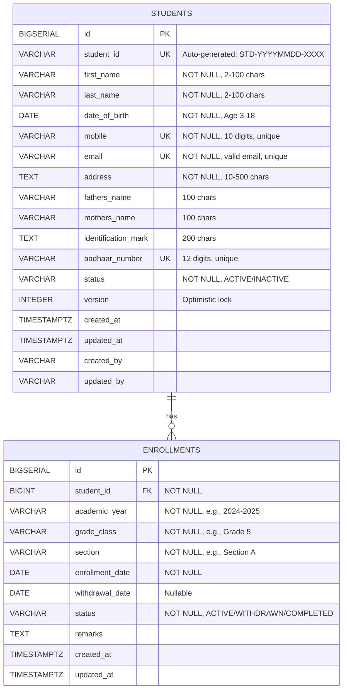
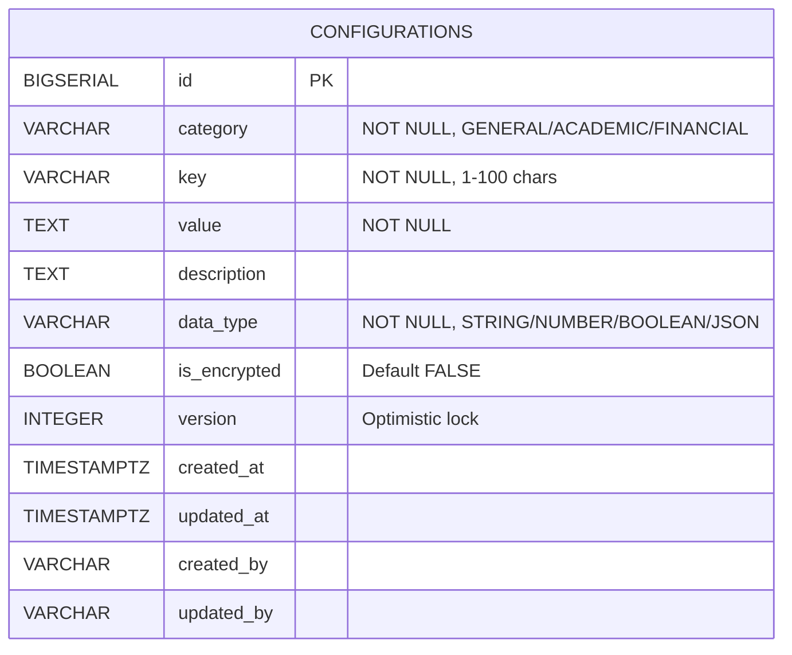

# Database Design
**School Management System - Data Model & Schema**

**Version**: 1.0
**Date**: 2026-01-15
**Status**: Active

---

## Table of Contents

1. [Overview](#overview)
2. [Design Principles](#design-principles)
3. [Entity Relationship Diagram](#entity-relationship-diagram)
4. [Student Service Database](#student-service-database)
5. [Configuration Service Database](#configuration-service-database)
6. [Indexing Strategy](#indexing-strategy)
7. [Auditing & Versioning](#auditing--versioning)
8. [Data Integrity & Constraints](#data-integrity--constraints)
9. [Migration Strategy](#migration-strategy)

---

## Overview

### Database-per-Service Pattern

The School Management System strictly enforces **database-per-service** pattern:

1. **Student Service Database** (`students_db`)
   - Owner: Student Service only
   - Contains: Students, Enrollments
   - Access: No other service can access

2. **Configuration Service Database** (`config_db`)
   - Owner: Configuration Service only
   - Contains: Configurations
   - Access: No other service can access

### Technology Stack

- **RDBMS**: PostgreSQL 18+
- **Connection Pool**: HikariCP
- **ORM**: Spring Data JPA / Hibernate
- **Migration Tool**: Flyway
- **Dialect**: PostgreSQL dialect

---

## Design Principles

### 1. Naming Conventions

- **Tables**: `snake_case`, plural nouns (e.g., `students`, `enrollments`)
- **Columns**: `snake_case` (e.g., `first_name`, `date_of_birth`)
- **Primary Keys**: `BIGSERIAL` type, column name `id`
- **Foreign Keys**: `{referenced_table_singular}_id` (e.g., `student_id`)
- **Indexes**: `idx_{table}_{column(s)}` (e.g., `idx_students_last_name`)
- **Constraints**: `chk_{table}_{constraint_name}` (e.g., `chk_students_age_range`)

### 2. Data Types

- **IDs**: `BIGSERIAL` (auto-incrementing 64-bit integer)
- **Strings**: `VARCHAR(n)` with explicit limits
- **Timestamps**: `TIMESTAMPTZ` (timezone-aware)
- **Dates**: `DATE` (for date of birth)
- **Enums**: `VARCHAR(20)` with CHECK constraints (application-level enums)
- **JSON**: `JSONB` for flexible data

### 3. Audit Columns (Standard)

Every table MUST include:

```sql
created_at    TIMESTAMPTZ NOT NULL DEFAULT NOW(),
updated_at    TIMESTAMPTZ NOT NULL DEFAULT NOW(),
created_by    VARCHAR(100),
updated_by    VARCHAR(100)
```

### 4. Optimistic Locking

Every aggregate root MUST include:

```sql
version       INTEGER NOT NULL DEFAULT 0
```

This prevents lost updates in concurrent scenarios.

---

## Entity Relationship Diagram

### Student Service - ER Diagram


```mermaid
erDiagram
    STUDENTS ||--o{ ENROLLMENTS : "has"

    STUDENTS {
        BIGSERIAL id PK
        VARCHAR student_id UK "Auto-generated: STD-YYYYMMDD-XXXX"
        VARCHAR first_name "NOT NULL, 2-100 chars"
        VARCHAR last_name "NOT NULL, 2-100 chars"
        DATE date_of_birth "NOT NULL, Age 3-18"
        VARCHAR mobile UK "NOT NULL, 10 digits, unique"
        VARCHAR email UK "NOT NULL, valid email, unique"
        TEXT address "NOT NULL, 10-500 chars"
        VARCHAR fathers_name "100 chars"
        VARCHAR mothers_name "100 chars"
        TEXT identification_mark "200 chars"
        VARCHAR aadhaar_number UK "12 digits, unique"
        VARCHAR status "NOT NULL, ACTIVE/INACTIVE"
        INTEGER version "Optimistic lock"
        TIMESTAMPTZ created_at
        TIMESTAMPTZ updated_at
        VARCHAR created_by
        VARCHAR updated_by
    }

    ENROLLMENTS {
        BIGSERIAL id PK
        BIGINT student_id FK "NOT NULL"
        VARCHAR academic_year "NOT NULL, e.g., 2024-2025"
        VARCHAR grade_class "NOT NULL, e.g., Grade 5"
        VARCHAR section "NOT NULL, e.g., Section A"
        DATE enrollment_date "NOT NULL"
        DATE withdrawal_date "Nullable"
        VARCHAR status "NOT NULL, ACTIVE/WITHDRAWN/COMPLETED"
        TEXT remarks
        TIMESTAMPTZ created_at
        TIMESTAMPTZ updated_at
    }
```

### Configuration Service - ER Diagram


```mermaid
erDiagram
    CONFIGURATIONS {
        BIGSERIAL id PK
        VARCHAR category "NOT NULL, GENERAL/ACADEMIC/FINANCIAL"
        VARCHAR key "NOT NULL, 1-100 chars"
        TEXT value "NOT NULL"
        TEXT description
        VARCHAR data_type "NOT NULL, STRING/NUMBER/BOOLEAN/JSON"
        BOOLEAN is_encrypted "Default FALSE"
        INTEGER version "Optimistic lock"
        TIMESTAMPTZ created_at
        TIMESTAMPTZ updated_at
        VARCHAR created_by
        VARCHAR updated_by
    }
```

---

## Student Service Database

### Database: `students_db`

#### Table: `students`

**Purpose**: Core student profile and personal information

**DDL**:

```sql
-- =====================================================
-- Table: students
-- Description: Stores student personal and contact information
-- =====================================================

CREATE TABLE students (
    -- Primary Key
    id                      BIGSERIAL PRIMARY KEY,

    -- Business Key (Auto-generated)
    student_id              VARCHAR(50) NOT NULL UNIQUE,

    -- Personal Information
    first_name              VARCHAR(100) NOT NULL,
    last_name               VARCHAR(100) NOT NULL,
    date_of_birth           DATE NOT NULL,
    aadhaar_number          VARCHAR(12) UNIQUE,
    identification_mark     TEXT,
    address                 TEXT NOT NULL,

    -- Guardian Information
    fathers_name            VARCHAR(100),
    mothers_name            VARCHAR(100),

    -- Contact Information
    mobile                  VARCHAR(10) NOT NULL UNIQUE,
    email                   VARCHAR(255) NOT NULL UNIQUE,

    -- Status
    status                  VARCHAR(20) NOT NULL DEFAULT 'ACTIVE',

    -- Optimistic Locking
    version                 INTEGER NOT NULL DEFAULT 0,

    -- Audit Columns
    created_at              TIMESTAMPTZ NOT NULL DEFAULT NOW(),
    updated_at              TIMESTAMPTZ NOT NULL DEFAULT NOW(),
    created_by              VARCHAR(100),
    updated_by              VARCHAR(100),

    -- Constraints
    CONSTRAINT chk_students_status
        CHECK (status IN ('ACTIVE', 'INACTIVE')),

    CONSTRAINT chk_students_mobile
        CHECK (mobile ~ '^\d{10}$'),

    CONSTRAINT chk_students_aadhaar
        CHECK (aadhaar_number IS NULL OR aadhaar_number ~ '^\d{12}$'),

    CONSTRAINT chk_students_email
        CHECK (email ~* '^[A-Za-z0-9._%+-]+@[A-Za-z0-9.-]+\.[A-Z|a-z]{2,}$'),

    CONSTRAINT chk_students_name_length
        CHECK (LENGTH(first_name) >= 2 AND LENGTH(last_name) >= 2),

    CONSTRAINT chk_students_address_length
        CHECK (LENGTH(address) >= 10 AND LENGTH(address) <= 500)
);

-- Indexes for Performance
CREATE INDEX idx_students_last_name ON students(last_name);
CREATE INDEX idx_students_mobile ON students(mobile);
CREATE INDEX idx_students_email ON students(email);
CREATE INDEX idx_students_status ON students(status);
CREATE INDEX idx_students_student_id ON students(student_id);
CREATE INDEX idx_students_created_at ON students(created_at DESC);

-- Full-text Search Index (for name search)
CREATE INDEX idx_students_name_search ON students
    USING gin(to_tsvector('english', first_name || ' ' || last_name));

-- Comment on Table
COMMENT ON TABLE students IS 'Core student profile and personal information';
COMMENT ON COLUMN students.student_id IS 'Auto-generated business key in format: STD-YYYYMMDD-XXXX';
COMMENT ON COLUMN students.version IS 'Optimistic locking version field';
COMMENT ON COLUMN students.status IS 'Student status: ACTIVE or INACTIVE';
```

**Field Alignment with Frontend Data Model**:

| Frontend Field | Database Column | Type | Constraints |
|----------------|-----------------|------|-------------|
| `id` | `student_id` | VARCHAR(50) | Auto-generated, Unique |
| `firstName` | `first_name` | VARCHAR(100) | NOT NULL, 2-100 chars |
| `lastName` | `last_name` | VARCHAR(100) | NOT NULL, 2-100 chars |
| `dateOfBirth` | `date_of_birth` | DATE | NOT NULL, Age validation in business layer |
| `adhaarNumber` | `aadhaar_number` | VARCHAR(12) | 12 digits, Unique |
| `identificationMarks` | `identification_mark` | TEXT | Optional, max 200 chars |
| `address` | `address` | TEXT | NOT NULL, 10-500 chars |
| `guardianName` | `fathers_name` | VARCHAR(100) | Maps to father/guardian |
| `motherName` | `mothers_name` | VARCHAR(100) | Required |
| `phone` | `mobile` | VARCHAR(10) | NOT NULL, Unique, 10 digits |
| `email` | `email` | VARCHAR(255) | NOT NULL, Unique, valid format |
| `status` | `status` | VARCHAR(20) | ACTIVE/INACTIVE |
| `createdAt` | `created_at` | TIMESTAMPTZ | Auto-managed |
| `updatedAt` | `updated_at` | TIMESTAMPTZ | Auto-managed |

**Critical Constraints**:

1. **Age Validation**: Business rule BR-1 (Age 3-18) enforced at application layer, not database
2. **Mobile Uniqueness**: BR-2 enforced via UNIQUE constraint
3. **Immutable Fields**: `date_of_birth`, `aadhaar_number`, `email` protected in application layer
4. **Editable Fields**: Only `first_name`, `last_name`, `mobile`, `status` can be updated

---

#### Table: `enrollments`

**Purpose**: Student enrollment history across academic years

**DDL**:

```sql
-- =====================================================
-- Table: enrollments
-- Description: Tracks student enrollment history across academic years
-- =====================================================

CREATE TABLE enrollments (
    -- Primary Key
    id                      BIGSERIAL PRIMARY KEY,

    -- Foreign Key
    student_id              BIGINT NOT NULL,

    -- Enrollment Information
    academic_year           VARCHAR(20) NOT NULL,
    grade_class             VARCHAR(50) NOT NULL,
    section                 VARCHAR(10) NOT NULL,
    enrollment_date         DATE NOT NULL,
    withdrawal_date         DATE,
    status                  VARCHAR(20) NOT NULL DEFAULT 'ACTIVE',
    remarks                 TEXT,

    -- Audit Columns
    created_at              TIMESTAMPTZ NOT NULL DEFAULT NOW(),
    updated_at              TIMESTAMPTZ NOT NULL DEFAULT NOW(),

    -- Foreign Key Constraint
    CONSTRAINT fk_enrollments_student
        FOREIGN KEY (student_id)
        REFERENCES students(id)
        ON DELETE CASCADE,

    -- Business Constraints
    CONSTRAINT chk_enrollments_status
        CHECK (status IN ('ACTIVE', 'WITHDRAWN', 'COMPLETED')),

    CONSTRAINT chk_enrollments_dates
        CHECK (withdrawal_date IS NULL OR withdrawal_date >= enrollment_date),

    CONSTRAINT chk_enrollments_academic_year
        CHECK (academic_year ~ '^\d{4}-\d{4}$'),

    -- Unique constraint: One active enrollment per student per academic year
    CONSTRAINT uq_enrollments_student_year
        UNIQUE (student_id, academic_year, status)
);

-- Indexes
CREATE INDEX idx_enrollments_student_id ON enrollments(student_id);
CREATE INDEX idx_enrollments_academic_year ON enrollments(academic_year);
CREATE INDEX idx_enrollments_status ON enrollments(status);
CREATE INDEX idx_enrollments_enrollment_date ON enrollments(enrollment_date DESC);

-- Comment on Table
COMMENT ON TABLE enrollments IS 'Student enrollment history across academic years';
COMMENT ON CONSTRAINT uq_enrollments_student_year ON enrollments IS 'Prevents duplicate active enrollments for same student in same academic year';
```

**Enrollment Business Rules**:

1. Student can have multiple enrollments (historical)
2. Only ONE active enrollment per academic year
3. Withdrawal date must be after enrollment date
4. CASCADE delete: If student is deleted, all enrollments are deleted

---

### Database Triggers

#### Trigger: Auto-update `updated_at` column

```sql
-- =====================================================
-- Function: update_updated_at_column
-- Description: Automatically updates updated_at timestamp
-- =====================================================

CREATE OR REPLACE FUNCTION update_updated_at_column()
RETURNS TRIGGER AS $$
BEGIN
    NEW.updated_at = NOW();
    RETURN NEW;
END;
$$ LANGUAGE plpgsql;

-- Apply to students table
CREATE TRIGGER trg_students_updated_at
    BEFORE UPDATE ON students
    FOR EACH ROW
    EXECUTE FUNCTION update_updated_at_column();

-- Apply to enrollments table
CREATE TRIGGER trg_enrollments_updated_at
    BEFORE UPDATE ON enrollments
    FOR EACH ROW
    EXECUTE FUNCTION update_updated_at_column();
```

#### Trigger: Auto-generate `student_id`

```sql
-- =====================================================
-- Function: generate_student_id
-- Description: Generates unique student ID in format STD-YYYYMMDD-XXXX
-- =====================================================

CREATE OR REPLACE FUNCTION generate_student_id()
RETURNS TRIGGER AS $$
DECLARE
    date_part VARCHAR(8);
    sequence_part VARCHAR(4);
    max_seq INTEGER;
BEGIN
    -- Get current date in YYYYMMDD format
    date_part := TO_CHAR(NOW(), 'YYYYMMDD');

    -- Get maximum sequence number for today
    SELECT COALESCE(MAX(
        SUBSTRING(student_id FROM 13 FOR 4)::INTEGER
    ), 0) INTO max_seq
    FROM students
    WHERE student_id LIKE 'STD-' || date_part || '-%';

    -- Increment sequence
    sequence_part := LPAD((max_seq + 1)::TEXT, 4, '0');

    -- Set student_id
    NEW.student_id := 'STD-' || date_part || '-' || sequence_part;

    RETURN NEW;
END;
$$ LANGUAGE plpgsql;

-- Apply trigger
CREATE TRIGGER trg_students_generate_id
    BEFORE INSERT ON students
    FOR EACH ROW
    EXECUTE FUNCTION generate_student_id();
```

**Student ID Format**: `STD-YYYYMMDD-XXXX`
- Example: `STD-20260115-0001`
- Resets sequence daily
- Zero-padded to 4 digits

---

## Configuration Service Database

### Database: `config_db`

#### Table: `configurations`

**Purpose**: System-wide configuration key-value pairs

**DDL**:

```sql
-- =====================================================
-- Table: configurations
-- Description: Stores system-wide configuration settings
-- =====================================================

CREATE TABLE configurations (
    -- Primary Key
    id                      BIGSERIAL PRIMARY KEY,

    -- Configuration Data
    category                VARCHAR(20) NOT NULL,
    key                     VARCHAR(100) NOT NULL,
    value                   TEXT NOT NULL,
    description             TEXT,
    data_type               VARCHAR(20) NOT NULL DEFAULT 'STRING',
    is_encrypted            BOOLEAN NOT NULL DEFAULT FALSE,

    -- Optimistic Locking
    version                 INTEGER NOT NULL DEFAULT 0,

    -- Audit Columns
    created_at              TIMESTAMPTZ NOT NULL DEFAULT NOW(),
    updated_at              TIMESTAMPTZ NOT NULL DEFAULT NOW(),
    created_by              VARCHAR(100),
    updated_by              VARCHAR(100),

    -- Constraints
    CONSTRAINT chk_configurations_category
        CHECK (category IN ('GENERAL', 'ACADEMIC', 'FINANCIAL', 'SYSTEM')),

    CONSTRAINT chk_configurations_data_type
        CHECK (data_type IN ('STRING', 'NUMBER', 'BOOLEAN', 'JSON')),

    CONSTRAINT chk_configurations_key_format
        CHECK (key ~ '^[A-Z0-9_]+$'),

    -- Unique constraint: category + key combination
    CONSTRAINT uq_configurations_category_key
        UNIQUE (category, key)
);

-- Indexes
CREATE INDEX idx_configurations_category ON configurations(category);
CREATE INDEX idx_configurations_key ON configurations(key);
CREATE INDEX idx_configurations_category_key ON configurations(category, key);

-- Trigger for updated_at
CREATE TRIGGER trg_configurations_updated_at
    BEFORE UPDATE ON configurations
    FOR EACH ROW
    EXECUTE FUNCTION update_updated_at_column();

-- Comment on Table
COMMENT ON TABLE configurations IS 'System-wide configuration settings with category-based organization';
COMMENT ON COLUMN configurations.data_type IS 'Defines how the value should be parsed: STRING, NUMBER, BOOLEAN, JSON';
COMMENT ON COLUMN configurations.is_encrypted IS 'Indicates if the value is encrypted at rest';
```

**Configuration Categories**:

1. **GENERAL**: School profile, branding, contact info
2. **ACADEMIC**: Class capacities, academic year settings
3. **FINANCIAL**: Fee structures, payment settings
4. **SYSTEM**: Technical configurations, feature flags

**Example Data**:

```sql
INSERT INTO configurations (category, key, value, description, data_type) VALUES
('GENERAL', 'SCHOOL_NAME', 'Springfield Public School', 'Official school name', 'STRING'),
('GENERAL', 'SCHOOL_CODE', 'SPS001', 'Unique school identifier', 'STRING'),
('ACADEMIC', 'CURRENT_ACADEMIC_YEAR', '2025-2026', 'Current academic session', 'STRING'),
('ACADEMIC', 'MAX_CLASS_CAPACITY', '40', 'Maximum students per class (BR-3)', 'NUMBER'),
('FINANCIAL', 'CURRENCY', 'INR', 'Default currency', 'STRING'),
('SYSTEM', 'MAINTENANCE_MODE', 'false', 'Enable maintenance mode', 'BOOLEAN');
```

---

## Indexing Strategy

### Purpose of Indexes

1. **Performance**: Speed up frequently executed queries
2. **Uniqueness**: Enforce unique constraints
3. **Foreign Keys**: Optimize JOIN operations

### Student Service Indexes

```sql
-- Primary search paths
CREATE INDEX idx_students_last_name ON students(last_name);
CREATE INDEX idx_students_mobile ON students(mobile);
CREATE INDEX idx_students_status ON students(status);

-- Composite indexes for filtered searches
CREATE INDEX idx_students_status_lastname ON students(status, last_name);

-- Full-text search
CREATE INDEX idx_students_name_search ON students
    USING gin(to_tsvector('english', first_name || ' ' || last_name));

-- Enrollment queries
CREATE INDEX idx_enrollments_student_id ON enrollments(student_id);
CREATE INDEX idx_enrollments_academic_year ON enrollments(academic_year);
```

### Configuration Service Indexes

```sql
-- Category filtering (most common query)
CREATE INDEX idx_configurations_category ON configurations(category);

-- Category + Key lookup (unique queries)
CREATE INDEX idx_configurations_category_key ON configurations(category, key);
```

### Index Maintenance

- **VACUUM ANALYZE**: Run weekly to update statistics
- **REINDEX**: Run monthly to rebuild indexes
- **Monitor**: pg_stat_user_indexes for unused indexes

---

## Auditing & Versioning

### Optimistic Locking

**Purpose**: Prevent lost updates in concurrent scenarios

**Mechanism**:
1. JPA `@Version` annotation on entities
2. Version column auto-incremented on each update
3. Update fails if version mismatch (409 Conflict)

**Example Flow**:

```
User A reads Student (version=1)
User B reads Student (version=1)
User A updates Student (version becomes 2)
User B attempts update with version=1 → CONFLICT → Retry required
```

**Implementation**:

```java
@Entity
@Table(name = "students")
public class Student {
    @Version
    @Column(name = "version", nullable = false)
    private Integer version;
}
```

### Audit Columns

**Standard Audit Fields**:

```sql
created_at    TIMESTAMPTZ NOT NULL DEFAULT NOW()
updated_at    TIMESTAMPTZ NOT NULL DEFAULT NOW()
created_by    VARCHAR(100)  -- Future: Populated from authentication context
updated_by    VARCHAR(100)  -- Future: Populated from authentication context
```

**Auto-managed by**:
- Trigger: `update_updated_at_column()` for `updated_at`
- JPA: `@PrePersist`, `@PreUpdate` for `created_by`, `updated_by` (future)

### Future: Audit Log Table

**For Phase 2**: Separate audit table to track all changes

```sql
CREATE TABLE student_audit_log (
    id                  BIGSERIAL PRIMARY KEY,
    student_id          BIGINT NOT NULL,
    operation           VARCHAR(10) NOT NULL,  -- INSERT, UPDATE, DELETE
    changed_fields      JSONB,
    changed_by          VARCHAR(100),
    changed_at          TIMESTAMPTZ NOT NULL DEFAULT NOW()
);
```

---

## Data Integrity & Constraints

### Constraint Hierarchy

1. **Database Constraints** (Cannot be bypassed)
   - NOT NULL
   - UNIQUE
   - PRIMARY KEY
   - FOREIGN KEY
   - CHECK constraints (simple validations)

2. **Application Constraints** (Business logic)
   - Age validation (3-18 years)
   - Complex business rules via Drools
   - Cross-field validations

### Critical Constraints

#### Student Constraints

```sql
-- Age Range: Enforced at application layer (Drools)
-- Business Rule BR-1: Age must be between 3 and 18 years at registration

-- Mobile Uniqueness: Enforced at database layer
-- Business Rule BR-2: Mobile number must be unique
CONSTRAINT uq_students_mobile UNIQUE (mobile)

-- Mobile Format: Enforced at database layer
CONSTRAINT chk_students_mobile CHECK (mobile ~ '^\d{10}$')

-- Email Format: Enforced at database layer
CONSTRAINT chk_students_email
    CHECK (email ~* '^[A-Za-z0-9._%+-]+@[A-Za-z0-9.-]+\.[A-Z|a-z]{2,}$')

-- Status Values: Enforced at database layer
CONSTRAINT chk_students_status CHECK (status IN ('ACTIVE', 'INACTIVE'))
```

#### Enrollment Constraints

```sql
-- Business Rule BR-3: Class Capacity (enforced at application layer)
-- Checked via configuration: ACADEMIC.MAX_CLASS_CAPACITY

-- Date Logic: Enforced at database layer
CONSTRAINT chk_enrollments_dates
    CHECK (withdrawal_date IS NULL OR withdrawal_date >= enrollment_date)

-- Duplicate Prevention: Enforced at database layer
CONSTRAINT uq_enrollments_student_year
    UNIQUE (student_id, academic_year, status)
```

### Referential Integrity

**Foreign Keys with Cascade Rules**:

```sql
-- Enrollment depends on Student
-- If student is deleted, all enrollments are deleted
CONSTRAINT fk_enrollments_student
    FOREIGN KEY (student_id)
    REFERENCES students(id)
    ON DELETE CASCADE;
```

**Trade-off**:
- **Benefit**: Data consistency, no orphaned records
- **Risk**: Accidental data loss
- **Mitigation**: Soft delete pattern (future), audit logging

---

## Migration Strategy

### Flyway Migration Scripts

**Versioning Pattern**: `V{version}__{description}.sql`

**Example Migration Structure**:

```
src/main/resources/db/migration/
├── V1__create_students_table.sql
├── V2__create_enrollments_table.sql
├── V3__add_student_indexes.sql
├── V4__add_student_id_generator.sql
├── V5__add_updated_at_trigger.sql
└── V6__seed_initial_data.sql
```

### Migration: V1__create_students_table.sql

```sql
-- V1__create_students_table.sql
-- Description: Create students table with all constraints

CREATE TABLE students (
    id                      BIGSERIAL PRIMARY KEY,
    student_id              VARCHAR(50) NOT NULL UNIQUE,
    first_name              VARCHAR(100) NOT NULL,
    last_name               VARCHAR(100) NOT NULL,
    date_of_birth           DATE NOT NULL,
    aadhaar_number          VARCHAR(12) UNIQUE,
    identification_mark     TEXT,
    address                 TEXT NOT NULL,
    fathers_name            VARCHAR(100),
    mothers_name            VARCHAR(100),
    mobile                  VARCHAR(10) NOT NULL UNIQUE,
    email                   VARCHAR(255) NOT NULL UNIQUE,
    status                  VARCHAR(20) NOT NULL DEFAULT 'ACTIVE',
    version                 INTEGER NOT NULL DEFAULT 0,
    created_at              TIMESTAMPTZ NOT NULL DEFAULT NOW(),
    updated_at              TIMESTAMPTZ NOT NULL DEFAULT NOW(),
    created_by              VARCHAR(100),
    updated_by              VARCHAR(100),

    CONSTRAINT chk_students_status CHECK (status IN ('ACTIVE', 'INACTIVE')),
    CONSTRAINT chk_students_mobile CHECK (mobile ~ '^\d{10}$'),
    CONSTRAINT chk_students_aadhaar CHECK (aadhaar_number IS NULL OR aadhaar_number ~ '^\d{12}$'),
    CONSTRAINT chk_students_email CHECK (email ~* '^[A-Za-z0-9._%+-]+@[A-Za-z0-9.-]+\.[A-Z|a-z]{2,}$'),
    CONSTRAINT chk_students_name_length CHECK (LENGTH(first_name) >= 2 AND LENGTH(last_name) >= 2),
    CONSTRAINT chk_students_address_length CHECK (LENGTH(address) >= 10 AND LENGTH(address) <= 500)
);

CREATE INDEX idx_students_last_name ON students(last_name);
CREATE INDEX idx_students_mobile ON students(mobile);
CREATE INDEX idx_students_email ON students(email);
CREATE INDEX idx_students_status ON students(status);
CREATE INDEX idx_students_student_id ON students(student_id);

COMMENT ON TABLE students IS 'Core student profile and personal information';
```

### Migration: V2__create_enrollments_table.sql

```sql
-- V2__create_enrollments_table.sql
-- Description: Create enrollments table with foreign key to students

CREATE TABLE enrollments (
    id                      BIGSERIAL PRIMARY KEY,
    student_id              BIGINT NOT NULL,
    academic_year           VARCHAR(20) NOT NULL,
    grade_class             VARCHAR(50) NOT NULL,
    section                 VARCHAR(10) NOT NULL,
    enrollment_date         DATE NOT NULL,
    withdrawal_date         DATE,
    status                  VARCHAR(20) NOT NULL DEFAULT 'ACTIVE',
    remarks                 TEXT,
    created_at              TIMESTAMPTZ NOT NULL DEFAULT NOW(),
    updated_at              TIMESTAMPTZ NOT NULL DEFAULT NOW(),

    CONSTRAINT fk_enrollments_student FOREIGN KEY (student_id) REFERENCES students(id) ON DELETE CASCADE,
    CONSTRAINT chk_enrollments_status CHECK (status IN ('ACTIVE', 'WITHDRAWN', 'COMPLETED')),
    CONSTRAINT chk_enrollments_dates CHECK (withdrawal_date IS NULL OR withdrawal_date >= enrollment_date),
    CONSTRAINT chk_enrollments_academic_year CHECK (academic_year ~ '^\d{4}-\d{4}$'),
    CONSTRAINT uq_enrollments_student_year UNIQUE (student_id, academic_year, status)
);

CREATE INDEX idx_enrollments_student_id ON enrollments(student_id);
CREATE INDEX idx_enrollments_academic_year ON enrollments(academic_year);
CREATE INDEX idx_enrollments_status ON enrollments(status);
```

### Rollback Strategy

**Flyway does NOT support automatic rollback**. Manual rollback scripts required.

**Example**: `U1__rollback_students_table.sql`

```sql
-- U1__rollback_students_table.sql
-- WARNING: This will delete all student data

DROP TABLE IF EXISTS students CASCADE;
```

**Best Practice**:
- Test migrations in staging environment
- Backup production database before migration
- Use Flyway's `validate` command before `migrate`

---

## Connection Pool Configuration

### HikariCP Settings (application.yml)

```yaml
spring:
  datasource:
    hikari:
      maximum-pool-size: 20
      minimum-idle: 5
      connection-timeout: 30000
      idle-timeout: 600000
      max-lifetime: 1800000
      leak-detection-threshold: 60000
```

**Tuning Guidelines**:
- **maximum-pool-size**: 20 connections (adjust based on load)
- **minimum-idle**: 5 connections (pre-warmed)
- **connection-timeout**: 30 seconds (fail fast)
- **leak-detection-threshold**: 60 seconds (detect connection leaks)

---

## Database Security

### Connection Security

**Environment Variables for Credentials**:

```bash
# Never hardcode credentials
SPRING_DATASOURCE_URL=jdbc:postgresql://localhost:5432/students_db
SPRING_DATASOURCE_USERNAME=${DB_USERNAME}
SPRING_DATASOURCE_PASSWORD=${DB_PASSWORD}
```

### Database User Permissions

**Principle of Least Privilege**:

```sql
-- Create application user
CREATE USER student_service_user WITH PASSWORD 'secure_password';

-- Grant only required permissions
GRANT CONNECT ON DATABASE students_db TO student_service_user;
GRANT USAGE ON SCHEMA public TO student_service_user;
GRANT SELECT, INSERT, UPDATE, DELETE ON students, enrollments TO student_service_user;
GRANT USAGE, SELECT ON ALL SEQUENCES IN SCHEMA public TO student_service_user;

-- Deny DDL operations
REVOKE CREATE ON SCHEMA public FROM student_service_user;
```

### Encryption

- **At Rest**: PostgreSQL supports Transparent Data Encryption (TDE) via extensions
- **In Transit**: SSL/TLS for database connections (future)
- **Sensitive Fields**: `is_encrypted` flag in configurations table (future implementation)

---

## Performance Considerations

### Query Optimization

**N+1 Problem Prevention**:

```sql
-- Bad: N+1 queries
SELECT * FROM students;  -- 1 query
-- Then for each student:
SELECT * FROM enrollments WHERE student_id = ?;  -- N queries

-- Good: Single JOIN query
SELECT s.*, e.*
FROM students s
LEFT JOIN enrollments e ON s.id = e.student_id;  -- 1 query
```

**JPA Solution**: Use `@EntityGraph` or `JOIN FETCH`

### Pagination

**Efficient Pagination**:

```sql
-- Good: Using LIMIT and OFFSET
SELECT * FROM students
ORDER BY id
LIMIT 20 OFFSET 0;

-- Better: Using keyset pagination (for large datasets)
SELECT * FROM students
WHERE id > 12345
ORDER BY id
LIMIT 20;
```

### Statistics & Maintenance

**Regular Maintenance Schedule**:

```sql
-- Weekly: Update statistics
ANALYZE students;
ANALYZE enrollments;
ANALYZE configurations;

-- Monthly: Vacuum and reindex
VACUUM ANALYZE students;
REINDEX TABLE students;
```

---

## Backup & Recovery

### Backup Strategy

**Daily Backups**:

```bash
# Full database dump
pg_dump -U postgres -h localhost students_db > students_db_backup_$(date +%Y%m%d).sql

# Configuration database
pg_dump -U postgres -h localhost config_db > config_db_backup_$(date +%Y%m%d).sql
```

**Point-in-Time Recovery**:
- Enable WAL archiving
- Configure continuous archiving
- Test restore procedures monthly

### Disaster Recovery

**RTO (Recovery Time Objective)**: 1 hour
**RPO (Recovery Point Objective)**: 24 hours (daily backups)

---

## Appendix

### Database Schema Summary

| Database | Tables | Indexes | Triggers | Constraints |
|----------|--------|---------|----------|-------------|
| students_db | 2 (students, enrollments) | 12 | 3 | 15 |
| config_db | 1 (configurations) | 3 | 1 | 5 |

### Key Field Mappings

**Frontend ↔ Database Alignment**:

| Frontend | Backend Entity | Database Column |
|----------|---------------|-----------------|
| `student.id` | `Student.studentId` | `students.student_id` |
| `student.firstName` | `Student.firstName` | `students.first_name` |
| `student.adhaarNumber` | `Student.aadhaarNumber` | `students.aadhaar_number` |
| `student.guardianName` | `Student.fathersName` | `students.fathers_name` |
| `student.phone` | `Student.mobile` | `students.mobile` |

---

**End of Database Design Document**
