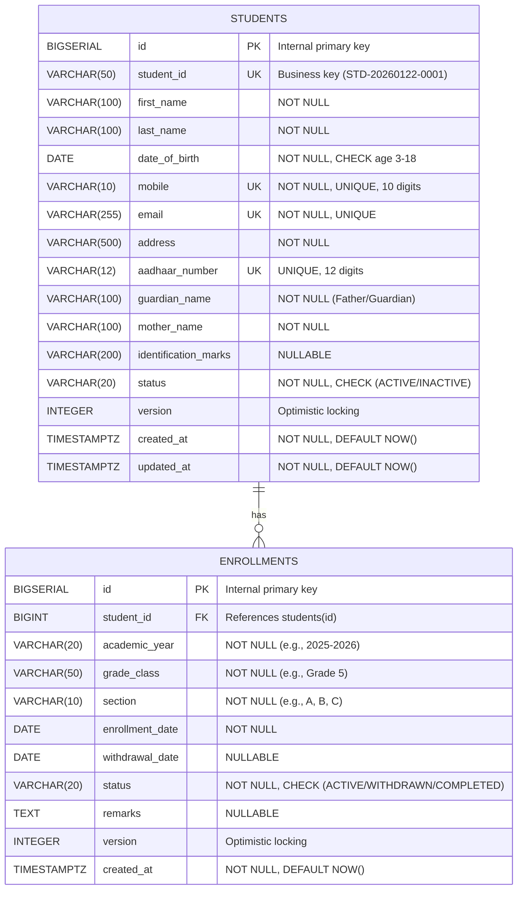
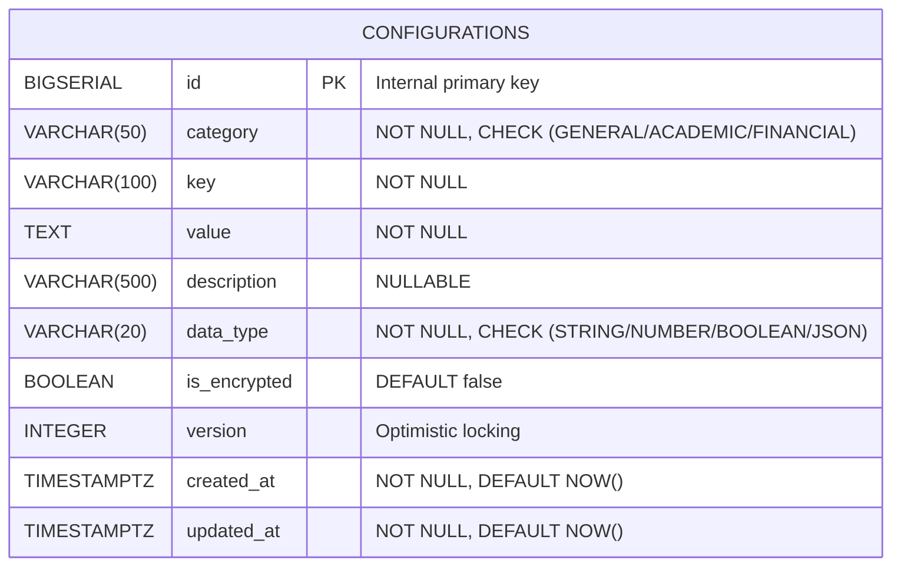

# Database Design - School Management System

**Version:** 1.0
**Date:** January 22, 2026
**Status:** Active
**Phase:** 1 - Student Management & Configuration

---

## Table of Contents

1. [Overview](#1-overview)
2. [Database Naming Standards](#2-database-naming-standards)
3. [Student Database Design](#3-student-database-design)
4. [Configuration Database Design](#4-configuration-database-design)
5. [Data Types & Constraints](#5-data-types--constraints)
6. [Indexing Strategy](#6-indexing-strategy)
7. [Migration Strategy](#7-migration-strategy)
8. [Backup & Recovery](#8-backup--recovery)

---

## 1. Overview

### 1.1 Database-per-Service Isolation

Each microservice maintains **absolute database isolation**:

| Service | Database | Port | Schema Owner | Purpose |
|---------|----------|------|--------------|---------|
| Student Service | `student_db` | 5433 | `student_owner` | Student records, enrollments |
| Configuration Service | `config_db` | 5434 | `config_owner` | Key-value settings |

**Critical Rule:** NO cross-database queries. Services communicate ONLY via REST APIs.

### 1.2 Technology

- **RDBMS:** PostgreSQL 18
- **Connection Pool:** HikariCP (bundled with Spring Boot)
- **Migration Tool:** Flyway 9.x
- **JDBC Driver:** PostgreSQL JDBC 42.7.x
- **ORM:** Spring Data JPA (Hibernate 6.x)

### 1.3 Design Principles

1. **snake_case Naming:** All tables, columns, indexes, constraints
2. **BIGSERIAL Primary Keys:** Auto-incrementing 64-bit integers
3. **Audit Columns:** All tables include `created_at`, `updated_at`
4. **Optimistic Locking:** `version` column for concurrency control
5. **NOT NULL Constraints:** Explicit for all mandatory fields
6. **Foreign Key Constraints:** Enforce referential integrity
7. **Timezone Awareness:** Use `TIMESTAMPTZ` for all timestamps

---

## 2. Database Naming Standards

### 2.1 Tables

- **Format:** `plural_noun` (e.g., `students`, `enrollments`, `configurations`)
- **Lowercase:** Always
- **Underscores:** Separate words (e.g., `enrollment_history`)

### 2.2 Columns

- **Format:** `snake_case` (e.g., `first_name`, `date_of_birth`, `guardian_name`)
- **Boolean Prefix:** `is_`, `has_`, `can_` (e.g., `is_encrypted`, `has_active_status`)
- **Date/Time Suffix:** `_at`, `_date` (e.g., `created_at`, `enrollment_date`)

### 2.3 Indexes

- **Format:** `idx_{table}_{column(s)}` (e.g., `idx_students_student_id`, `idx_students_last_name`)
- **Unique Index:** `uniq_{table}_{column}` (e.g., `uniq_students_mobile`)

### 2.4 Constraints

- **Primary Key:** `pk_{table}` (e.g., `pk_students`)
- **Foreign Key:** `fk_{table}_{referenced_table}` (e.g., `fk_enrollments_students`)
- **Check:** `chk_{table}_{condition}` (e.g., `chk_students_age`)
- **Unique:** `uniq_{table}_{column}` (e.g., `uniq_students_aadhaar_number`)

---

## 3. Student Database Design

### 3.1 Entity Relationship Diagram


```mermaid
erDiagram
    STUDENTS ||--o{ ENROLLMENTS : "has"

    STUDENTS {
        BIGSERIAL id PK "Internal primary key"
        VARCHAR(50) student_id UK "Business key (STD-20260122-0001)"
        VARCHAR(100) first_name "NOT NULL"
        VARCHAR(100) last_name "NOT NULL"
        DATE date_of_birth "NOT NULL, CHECK age 3-18"
        VARCHAR(10) mobile UK "NOT NULL, UNIQUE, 10 digits"
        VARCHAR(255) email UK "NOT NULL, UNIQUE"
        VARCHAR(500) address "NOT NULL"
        VARCHAR(12) aadhaar_number UK "UNIQUE, 12 digits"
        VARCHAR(100) guardian_name "NOT NULL (Father/Guardian)"
        VARCHAR(100) mother_name "NOT NULL"
        VARCHAR(200) identification_marks "NULLABLE"
        VARCHAR(20) status "NOT NULL, CHECK (ACTIVE/INACTIVE)"
        INTEGER version "Optimistic locking"
        TIMESTAMPTZ created_at "NOT NULL, DEFAULT NOW()"
        TIMESTAMPTZ updated_at "NOT NULL, DEFAULT NOW()"
    }

    ENROLLMENTS {
        BIGSERIAL id PK "Internal primary key"
        BIGINT student_id FK "References students(id)"
        VARCHAR(20) academic_year "NOT NULL (e.g., 2025-2026)"
        VARCHAR(50) grade_class "NOT NULL (e.g., Grade 5)"
        VARCHAR(10) section "NOT NULL (e.g., A, B, C)"
        DATE enrollment_date "NOT NULL"
        DATE withdrawal_date "NULLABLE"
        VARCHAR(20) status "NOT NULL, CHECK (ACTIVE/WITHDRAWN/COMPLETED)"
        TEXT remarks "NULLABLE"
        INTEGER version "Optimistic locking"
        TIMESTAMPTZ created_at "NOT NULL, DEFAULT NOW()"
    }
```

### 3.2 Students Table DDL

```sql
-- =====================================================
-- Table: students
-- Purpose: Store student personal and contact information
-- Service: Student Service
-- =====================================================

CREATE TABLE students (
    -- Primary Key
    id BIGSERIAL PRIMARY KEY,

    -- Business Key (Auto-generated)
    student_id VARCHAR(50) NOT NULL,

    -- Personal Information
    first_name VARCHAR(100) NOT NULL,
    last_name VARCHAR(100) NOT NULL,
    date_of_birth DATE NOT NULL,
    aadhaar_number VARCHAR(12),  -- Nullable as per spec alignment
    identification_marks VARCHAR(200),

    -- Guardian Information
    guardian_name VARCHAR(100) NOT NULL,  -- Father's Name or Guardian
    mother_name VARCHAR(100) NOT NULL,

    -- Contact Information
    mobile VARCHAR(10) NOT NULL,
    email VARCHAR(255) NOT NULL,
    address VARCHAR(500) NOT NULL,

    -- Status
    status VARCHAR(20) NOT NULL DEFAULT 'ACTIVE',

    -- Optimistic Locking
    version INTEGER NOT NULL DEFAULT 0,

    -- Audit Columns
    created_at TIMESTAMPTZ NOT NULL DEFAULT NOW(),
    updated_at TIMESTAMPTZ NOT NULL DEFAULT NOW(),

    -- Constraints
    CONSTRAINT pk_students PRIMARY KEY (id),
    CONSTRAINT uniq_students_student_id UNIQUE (student_id),
    CONSTRAINT uniq_students_mobile UNIQUE (mobile),
    CONSTRAINT uniq_students_email UNIQUE (email),
    CONSTRAINT uniq_students_aadhaar UNIQUE (aadhaar_number),
    CONSTRAINT chk_students_status CHECK (status IN ('ACTIVE', 'INACTIVE')),
    CONSTRAINT chk_students_mobile CHECK (mobile ~ '^\d{10}$'),
    CONSTRAINT chk_students_email CHECK (email ~ '^[^@\s]+@[^@\s]+\.[^@\s]+$'),
    CONSTRAINT chk_students_aadhaar CHECK (aadhaar_number IS NULL OR aadhaar_number ~ '^\d{12}$'),
    CONSTRAINT chk_students_age CHECK (
        date_of_birth <= CURRENT_DATE - INTERVAL '3 years' AND
        date_of_birth >= CURRENT_DATE - INTERVAL '18 years'
    )
);

-- Indexes
CREATE INDEX idx_students_last_name ON students(last_name);
CREATE INDEX idx_students_guardian_name ON students(guardian_name);
CREATE INDEX idx_students_status ON students(status);
CREATE INDEX idx_students_created_at ON students(created_at DESC);

-- Auto-update trigger for updated_at
CREATE OR REPLACE FUNCTION update_updated_at_column()
RETURNS TRIGGER AS $$
BEGIN
    NEW.updated_at = NOW();
    RETURN NEW;
END;
$$ LANGUAGE plpgsql;

CREATE TRIGGER trg_students_updated_at
BEFORE UPDATE ON students
FOR EACH ROW
EXECUTE FUNCTION update_updated_at_column();

-- Comments
COMMENT ON TABLE students IS 'Student master records with personal and contact information';
COMMENT ON COLUMN students.student_id IS 'Auto-generated business key format: STD-YYYYMMDD-NNNN';
COMMENT ON COLUMN students.guardian_name IS 'Father name or legal guardian name';
COMMENT ON COLUMN students.version IS 'Optimistic locking version counter';
COMMENT ON COLUMN students.status IS 'Student status: ACTIVE or INACTIVE';
```

### 3.3 Enrollments Table DDL

```sql
-- =====================================================
-- Table: enrollments
-- Purpose: Track student enrollment history across academic years
-- Service: Student Service
-- =====================================================

CREATE TABLE enrollments (
    -- Primary Key
    id BIGSERIAL PRIMARY KEY,

    -- Foreign Key
    student_id BIGINT NOT NULL,

    -- Enrollment Details
    academic_year VARCHAR(20) NOT NULL,  -- e.g., "2025-2026"
    grade_class VARCHAR(50) NOT NULL,    -- e.g., "Grade 5", "Class 10"
    section VARCHAR(10) NOT NULL,        -- e.g., "A", "B", "C"

    -- Dates
    enrollment_date DATE NOT NULL,
    withdrawal_date DATE,

    -- Status
    status VARCHAR(20) NOT NULL DEFAULT 'ACTIVE',

    -- Additional Info
    remarks TEXT,

    -- Optimistic Locking
    version INTEGER NOT NULL DEFAULT 0,

    -- Audit Columns
    created_at TIMESTAMPTZ NOT NULL DEFAULT NOW(),

    -- Constraints
    CONSTRAINT pk_enrollments PRIMARY KEY (id),
    CONSTRAINT fk_enrollments_students FOREIGN KEY (student_id)
        REFERENCES students(id) ON DELETE CASCADE,
    CONSTRAINT chk_enrollments_status CHECK (status IN ('ACTIVE', 'WITHDRAWN', 'COMPLETED')),
    CONSTRAINT chk_enrollments_dates CHECK (withdrawal_date IS NULL OR withdrawal_date >= enrollment_date),
    CONSTRAINT uniq_enrollments_student_year UNIQUE (student_id, academic_year)
);

-- Indexes
CREATE INDEX idx_enrollments_student_id ON enrollments(student_id);
CREATE INDEX idx_enrollments_academic_year ON enrollments(academic_year);
CREATE INDEX idx_enrollments_status ON enrollments(status);

-- Comments
COMMENT ON TABLE enrollments IS 'Student enrollment history tracking across academic years';
COMMENT ON COLUMN enrollments.academic_year IS 'Format: YYYY-YYYY (e.g., 2025-2026)';
COMMENT ON COLUMN enrollments.status IS 'ACTIVE: Currently enrolled, WITHDRAWN: Left school, COMPLETED: Graduated';
```

### 3.4 Field Alignment with Frontend Data Model

**Mapping Frontend → Database:**

| Frontend Field | Database Column | Type | Notes |
|----------------|-----------------|------|-------|
| `id` | `student_id` | VARCHAR(50) | Business key (STD-YYYYMMDD-NNNN) |
| `firstName` | `first_name` | VARCHAR(100) | NOT NULL |
| `lastName` | `last_name` | VARCHAR(100) | NOT NULL |
| `dateOfBirth` | `date_of_birth` | DATE | NOT NULL, age 3-18 check |
| `age` | Calculated | - | Frontend derives from `date_of_birth` |
| `adhaarNumber` | `aadhaar_number` | VARCHAR(12) | NULLABLE, UNIQUE if provided |
| `identificationMarks` | `identification_marks` | VARCHAR(200) | NULLABLE |
| `address` | `address` | VARCHAR(500) | NOT NULL |
| `guardianName` | `guardian_name` | VARCHAR(100) | NOT NULL (Father/Guardian) |
| `motherName` | `mother_name` | VARCHAR(100) | NOT NULL |
| `phone` | `mobile` | VARCHAR(10) | NOT NULL, UNIQUE |
| `email` | `email` | VARCHAR(255) | NOT NULL, UNIQUE |
| `status` | `status` | VARCHAR(20) | ACTIVE/INACTIVE |
| `createdAt` | `created_at` | TIMESTAMPTZ | Backend-managed |
| `updatedAt` | `updated_at` | TIMESTAMPTZ | Backend-managed |

**Critical Alignment Notes:**
1. Frontend uses `adhaarNumber` (camelCase), backend uses `aadhaar_number` (snake_case)
2. Frontend `phone` maps to backend `mobile`
3. Frontend `id` is the business key `student_id`, NOT the database `id` (BIGSERIAL)
4. Frontend `age` is calculated dynamically, NOT stored in database

---

## 4. Configuration Database Design

### 4.1 Entity Relationship Diagram


```mermaid
erDiagram
    CONFIGURATIONS {
        BIGSERIAL id PK "Internal primary key"
        VARCHAR(50) category "NOT NULL, CHECK (GENERAL/ACADEMIC/FINANCIAL)"
        VARCHAR(100) key "NOT NULL"
        TEXT value "NOT NULL"
        VARCHAR(500) description "NULLABLE"
        VARCHAR(20) data_type "NOT NULL, CHECK (STRING/NUMBER/BOOLEAN/JSON)"
        BOOLEAN is_encrypted "DEFAULT false"
        INTEGER version "Optimistic locking"
        TIMESTAMPTZ created_at "NOT NULL, DEFAULT NOW()"
        TIMESTAMPTZ updated_at "NOT NULL, DEFAULT NOW()"
    }
```

### 4.2 Configurations Table DDL

```sql
-- =====================================================
-- Table: configurations
-- Purpose: Store system-wide key-value configuration settings
-- Service: Configuration Service
-- =====================================================

CREATE TABLE configurations (
    -- Primary Key
    id BIGSERIAL PRIMARY KEY,

    -- Configuration Identity
    category VARCHAR(50) NOT NULL,
    key VARCHAR(100) NOT NULL,

    -- Configuration Value
    value TEXT NOT NULL,
    description VARCHAR(500),

    -- Metadata
    data_type VARCHAR(20) NOT NULL DEFAULT 'STRING',
    is_encrypted BOOLEAN NOT NULL DEFAULT FALSE,

    -- Optimistic Locking
    version INTEGER NOT NULL DEFAULT 0,

    -- Audit Columns
    created_at TIMESTAMPTZ NOT NULL DEFAULT NOW(),
    updated_at TIMESTAMPTZ NOT NULL DEFAULT NOW(),

    -- Constraints
    CONSTRAINT pk_configurations PRIMARY KEY (id),
    CONSTRAINT uniq_configurations_category_key UNIQUE (category, key),
    CONSTRAINT chk_configurations_category CHECK (category IN ('GENERAL', 'ACADEMIC', 'FINANCIAL', 'SYSTEM')),
    CONSTRAINT chk_configurations_data_type CHECK (data_type IN ('STRING', 'NUMBER', 'BOOLEAN', 'JSON'))
);

-- Indexes
CREATE INDEX idx_configurations_category ON configurations(category);
CREATE INDEX idx_configurations_key ON configurations(key);

-- Auto-update trigger for updated_at
CREATE TRIGGER trg_configurations_updated_at
BEFORE UPDATE ON configurations
FOR EACH ROW
EXECUTE FUNCTION update_updated_at_column();

-- Comments
COMMENT ON TABLE configurations IS 'System-wide key-value configuration settings grouped by category';
COMMENT ON COLUMN configurations.category IS 'GENERAL: School info, ACADEMIC: Academic settings, FINANCIAL: Fee settings, SYSTEM: Technical configs';
COMMENT ON COLUMN configurations.data_type IS 'Used for type coercion and validation';
COMMENT ON COLUMN configurations.is_encrypted IS 'True if value is encrypted (e.g., API keys, passwords)';
```

### 4.3 Field Alignment with Frontend Data Model

**Mapping Frontend → Database:**

| Frontend Field | Database Column | Type | Notes |
|----------------|-----------------|------|-------|
| `id` | `id` (BIGSERIAL → String) | BIGINT | Converted to string in API |
| `category` | `category` | VARCHAR(50) | GENERAL/ACADEMIC/FINANCE/SYSTEM |
| `key` | `key` | VARCHAR(100) | Unique per category |
| `value` | `value` | TEXT | Required |
| `description` | `description` | VARCHAR(500) | Optional |
| `dataType` | `data_type` | VARCHAR(20) | HIDDEN from frontend UI |
| `lastUpdated` | `updated_at` | TIMESTAMPTZ | Auto-managed |
| `createdAt` | `created_at` | TIMESTAMPTZ | Auto-managed |

**Note:** Frontend spec hides `dataType` field from UI forms but backend stores it for validation.

---

## 5. Data Types & Constraints

### 5.1 Standard Data Types

| Logical Type | PostgreSQL Type | Size | Notes |
|--------------|-----------------|------|-------|
| Primary Key | `BIGSERIAL` | 8 bytes | Auto-increment, 1 to 9.2 quintillion |
| Foreign Key | `BIGINT` | 8 bytes | References BIGSERIAL PK |
| Business Key | `VARCHAR(50)` | Variable | e.g., STD-20260122-0001 |
| Short Text | `VARCHAR(100)` | Variable | Names, keys |
| Long Text | `VARCHAR(500)` | Variable | Addresses, descriptions |
| Email | `VARCHAR(255)` | Variable | RFC 5321 max length |
| Mobile | `VARCHAR(10)` | 10 chars | Indian mobile format |
| Aadhaar | `VARCHAR(12)` | 12 chars | Indian ID number |
| Date | `DATE` | 4 bytes | No timezone |
| Timestamp | `TIMESTAMPTZ` | 8 bytes | UTC with timezone |
| Boolean | `BOOLEAN` | 1 byte | TRUE/FALSE |
| Enum | `VARCHAR(20)` | Variable | Status, Category |
| JSON | `JSONB` | Variable | Future: Complex configurations |

### 5.2 Constraint Strategy

**NOT NULL Constraints:**
- All primary/foreign keys
- All business-critical fields (names, dates, contact info)
- Audit columns (`created_at`, `updated_at`)
- Default values for enums (e.g., `status DEFAULT 'ACTIVE'`)

**UNIQUE Constraints:**
- Business keys (`student_id`)
- Natural unique identifiers (`mobile`, `email`, `aadhaar_number`)
- Composite keys (`category + key` in configurations)
- Per-academic-year enrollments (`student_id + academic_year`)

**CHECK Constraints:**
- Enum validation (e.g., `status IN ('ACTIVE', 'INACTIVE')`)
- Age validation (3-18 years at registration)
- Date logic (withdrawal_date >= enrollment_date)
- Regex patterns (mobile, email, aadhaar)

**Foreign Key Constraints:**
- `ON DELETE CASCADE` for enrollments (delete student → delete enrollments)
- `ON UPDATE RESTRICT` (prevent accidental ID changes)

### 5.3 Optimistic Locking

**Purpose:** Prevent lost updates in concurrent scenarios.

**Implementation:**
```java
@Entity
@Version
private Integer version;
```

**Database:**
```sql
version INTEGER NOT NULL DEFAULT 0
```

**Behavior:**
1. Client reads entity (version = 5)
2. Client modifies data
3. Client saves with version = 5
4. Database checks if current version = 5
5. If match → increment version to 6, save
6. If mismatch → throw `OptimisticLockException`

---

## 6. Indexing Strategy

### 6.1 Index Types

**1. Unique Indexes (Implicit via UNIQUE constraints):**
```sql
UNIQUE (student_id)  -- Business key lookup
UNIQUE (mobile)      -- Duplicate detection
UNIQUE (email)       -- Duplicate detection
UNIQUE (category, key)  -- Configuration lookup
```

**2. B-Tree Indexes (Default for searches):**
```sql
CREATE INDEX idx_students_last_name ON students(last_name);
CREATE INDEX idx_students_guardian_name ON students(guardian_name);
```

**3. Partial Indexes (Filter-specific queries):**
```sql
-- Only index active students for faster active-only queries
CREATE INDEX idx_students_active ON students(status) WHERE status = 'ACTIVE';
```

**4. Composite Indexes (Multi-column searches):**
```sql
-- Future: Search by last name + status
CREATE INDEX idx_students_lastname_status ON students(last_name, status);
```

### 6.2 Index Usage Guidelines

**Index When:**
- Column used in WHERE clauses frequently (last_name, status)
- Column used in JOIN conditions (foreign keys)
- Column used in ORDER BY (created_at DESC)
- Unique constraints (automatic indexes)

**Do NOT Index:**
- Small tables (<1000 rows)
- Columns with low cardinality (true/false fields unless using partial index)
- Columns frequently updated (index maintenance overhead)
- Wide varchar columns (full-text search instead)

### 6.3 Performance Monitoring

**Query Analysis:**
```sql
-- Explain query plan
EXPLAIN ANALYZE
SELECT * FROM students WHERE last_name = 'Smith';

-- Identify unused indexes
SELECT schemaname, tablename, indexname, idx_scan
FROM pg_stat_user_indexes
WHERE idx_scan = 0 AND indexname NOT LIKE 'pk_%';
```

---

## 7. Migration Strategy

### 7.1 Flyway Configuration

**Directory Structure:**
```
src/main/resources/db/migration/
├── V1__create_students_table.sql
├── V2__create_enrollments_table.sql
├── V3__add_indexes_students.sql
└── V4__seed_initial_data.sql  (Optional)
```

**Naming Convention:**
- **Versioned:** `V{version}__{description}.sql` (e.g., `V1__create_students_table.sql`)
- **Repeatable:** `R__{description}.sql` (e.g., `R__create_views.sql`)

**Version Format:**
- Major.Minor.Patch (e.g., V1.0.1, V1.1.0)
- Sequential integers (e.g., V1, V2, V3) - **Recommended for Phase 1**

### 7.2 Sample Migration: V1__create_students_table.sql

```sql
-- =====================================================
-- Migration: V1__create_students_table.sql
-- Description: Create students table with all constraints
-- Author: Backend Developer Agent
-- Date: 2026-01-22
-- =====================================================

-- Function for updated_at trigger (reusable)
CREATE OR REPLACE FUNCTION update_updated_at_column()
RETURNS TRIGGER AS $$
BEGIN
    NEW.updated_at = NOW();
    RETURN NEW;
END;
$$ LANGUAGE plpgsql;

-- Students table
CREATE TABLE students (
    id BIGSERIAL,
    student_id VARCHAR(50) NOT NULL,
    first_name VARCHAR(100) NOT NULL,
    last_name VARCHAR(100) NOT NULL,
    date_of_birth DATE NOT NULL,
    mobile VARCHAR(10) NOT NULL,
    email VARCHAR(255) NOT NULL,
    address VARCHAR(500) NOT NULL,
    aadhaar_number VARCHAR(12),
    guardian_name VARCHAR(100) NOT NULL,
    mother_name VARCHAR(100) NOT NULL,
    identification_marks VARCHAR(200),
    status VARCHAR(20) NOT NULL DEFAULT 'ACTIVE',
    version INTEGER NOT NULL DEFAULT 0,
    created_at TIMESTAMPTZ NOT NULL DEFAULT NOW(),
    updated_at TIMESTAMPTZ NOT NULL DEFAULT NOW(),

    CONSTRAINT pk_students PRIMARY KEY (id),
    CONSTRAINT uniq_students_student_id UNIQUE (student_id),
    CONSTRAINT uniq_students_mobile UNIQUE (mobile),
    CONSTRAINT uniq_students_email UNIQUE (email),
    CONSTRAINT uniq_students_aadhaar UNIQUE (aadhaar_number),
    CONSTRAINT chk_students_status CHECK (status IN ('ACTIVE', 'INACTIVE')),
    CONSTRAINT chk_students_mobile CHECK (mobile ~ '^\d{10}$'),
    CONSTRAINT chk_students_email CHECK (email ~ '^[^@\s]+@[^@\s]+\.[^@\s]+$'),
    CONSTRAINT chk_students_aadhaar CHECK (aadhaar_number IS NULL OR aadhaar_number ~ '^\d{12}$')
);

-- Indexes
CREATE INDEX idx_students_last_name ON students(last_name);
CREATE INDEX idx_students_guardian_name ON students(guardian_name);
CREATE INDEX idx_students_status ON students(status);
CREATE INDEX idx_students_created_at ON students(created_at DESC);

-- Trigger
CREATE TRIGGER trg_students_updated_at
BEFORE UPDATE ON students
FOR EACH ROW
EXECUTE FUNCTION update_updated_at_column();

-- Comments
COMMENT ON TABLE students IS 'Student master records';
COMMENT ON COLUMN students.student_id IS 'Format: STD-YYYYMMDD-NNNN';
```

### 7.3 Migration Best Practices

1. **Idempotent Scripts:** Use `IF NOT EXISTS`, `DROP IF EXISTS` where applicable
2. **Backward Compatibility:** Never drop columns in production (deprecate instead)
3. **Data Migrations:** Separate DDL (V1) from DML (V2) migrations
4. **Testing:** Test migrations on copy of production data
5. **Rollback Plan:** Document manual rollback steps for destructive changes
6. **Version Control:** Commit migration files with code changes

---

## 8. Backup & Recovery

### 8.1 Backup Strategy

**Frequency:**
- **Daily:** Full database backup (off-peak hours, e.g., 2 AM)
- **Hourly:** WAL (Write-Ahead Log) archiving for point-in-time recovery
- **Retention:** 30 days for daily backups, 7 days for WAL logs

**Tools:**
```bash
# Full backup
pg_dump -h localhost -p 5433 -U postgres -Fc student_db > student_db_backup.dump

# Restore
pg_restore -h localhost -p 5433 -U postgres -d student_db student_db_backup.dump
```

### 8.2 Point-in-Time Recovery (PITR)

**Enable WAL Archiving:**
```ini
# postgresql.conf
wal_level = replica
archive_mode = on
archive_command = 'cp %p /backup/wal/%f'
```

**Restore to Specific Time:**
```bash
# Stop PostgreSQL
pg_ctl stop

# Restore base backup
pg_restore -d student_db base_backup.dump

# Create recovery.conf
cat > recovery.conf <<EOF
restore_command = 'cp /backup/wal/%f %p'
recovery_target_time = '2026-01-22 14:30:00'
EOF

# Start PostgreSQL (triggers recovery)
pg_ctl start
```

### 8.3 Disaster Recovery

**RTO (Recovery Time Objective):** 4 hours
**RPO (Recovery Point Objective):** 1 hour (hourly WAL archiving)

**DR Checklist:**
1. Maintain offsite backup copies (S3/cloud storage)
2. Test restore procedures quarterly
3. Document recovery runbook
4. Monitor backup success via automated alerts

---

## Appendix

### A. Sample Data

**Students (for testing):**
```sql
INSERT INTO students (student_id, first_name, last_name, date_of_birth, mobile, email, address, guardian_name, mother_name, status)
VALUES
('STD-20260122-0001', 'Aarav', 'Sharma', '2015-05-15', '9876543210', 'aarav.sharma@example.com', '123 MG Road, Bangalore', 'Rajesh Sharma', 'Priya Sharma', 'ACTIVE'),
('STD-20260122-0002', 'Ishita', 'Patel', '2013-08-20', '9876543211', 'ishita.patel@example.com', '456 Park Street, Mumbai', 'Amit Patel', 'Neha Patel', 'ACTIVE');
```

**Configurations:**
```sql
INSERT INTO configurations (category, key, value, description, data_type)
VALUES
('GENERAL', 'SCHOOL_NAME', 'Greenwood International School', 'Official school name', 'STRING'),
('GENERAL', 'SCHOOL_CODE', 'GIS-2025', 'Unique school identifier', 'STRING'),
('ACADEMIC', 'CURRENT_ACADEMIC_YEAR', '2025-2026', 'Active academic year', 'STRING'),
('FINANCIAL', 'LATE_FEE_PERCENTAGE', '5', 'Late payment penalty %', 'NUMBER');
```

### B. Database Size Estimates

**Students Table:**
- Average row size: ~600 bytes
- 10,000 students: ~6 MB
- 100,000 students: ~60 MB

**Enrollments Table:**
- Average row size: ~200 bytes
- 10 enrollments per student: 100,000 rows = ~20 MB

**Total Estimated (100K students):** ~100 MB (data) + ~20 MB (indexes) = **120 MB**

### C. Cross-References

- **System Architecture:** See `01-system-architecture.md`
- **Business Rules:** See `03-business-rules.md` (age validation, uniqueness checks)
- **Backend Implementation:** See `05-backend-implementation-guide.md` (JPA entities, repositories)

---

**Document Control:**
**Created:** January 22, 2026
**Last Updated:** January 22, 2026
**Approved By:** Software Architect Agent
**Next Review:** Pre-Production Deployment
