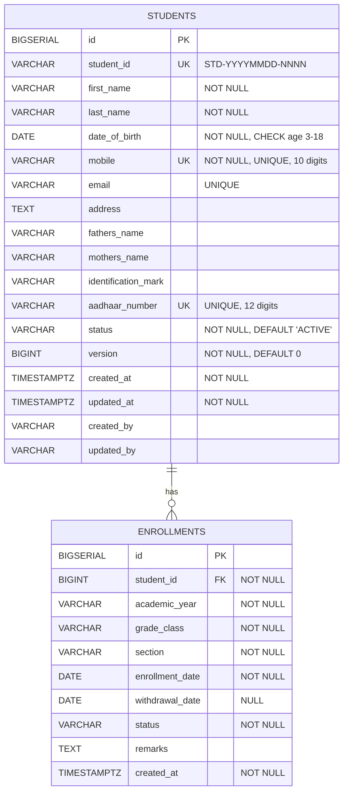
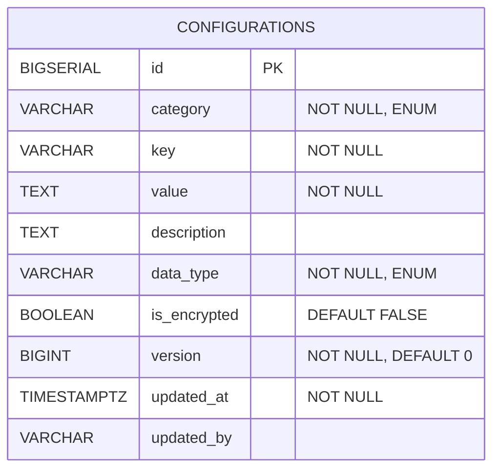

# Database Design - School Management System

## 1. Overview

This document defines the database schema for both microservices following the **Database-per-Service** pattern. Each service maintains complete data autonomy with zero shared tables or cross-database queries.

### 1.1 Design Principles

- **Normalization**: 3NF for transactional data
- **Audit Trail**: All tables include `created_at`, `updated_at`, `created_by`, `updated_by`
- **Soft Deletes**: Use status flags instead of physical deletion
- **Optimistic Locking**: `version` column (BIGINT) for concurrency control
- **Naming Convention**: `snake_case` for all identifiers

## 2. Student Service Database (student_db)

### 2.1 Entity Relationship Diagram


```mermaid
erDiagram
    STUDENTS ||--o{ ENROLLMENTS : has

    STUDENTS {
        BIGSERIAL id PK
        VARCHAR student_id UK "STD-YYYYMMDD-NNNN"
        VARCHAR first_name "NOT NULL"
        VARCHAR last_name "NOT NULL"
        DATE date_of_birth "NOT NULL, CHECK age 3-18"
        VARCHAR mobile UK "NOT NULL, UNIQUE, 10 digits"
        VARCHAR email "UNIQUE"
        TEXT address
        VARCHAR fathers_name
        VARCHAR mothers_name
        VARCHAR identification_mark
        VARCHAR aadhaar_number UK "UNIQUE, 12 digits"
        VARCHAR status "NOT NULL, DEFAULT 'ACTIVE'"
        BIGINT version "NOT NULL, DEFAULT 0"
        TIMESTAMPTZ created_at "NOT NULL"
        TIMESTAMPTZ updated_at "NOT NULL"
        VARCHAR created_by
        VARCHAR updated_by
    }

    ENROLLMENTS {
        BIGSERIAL id PK
        BIGINT student_id FK "NOT NULL"
        VARCHAR academic_year "NOT NULL"
        VARCHAR grade_class "NOT NULL"
        VARCHAR section "NOT NULL"
        DATE enrollment_date "NOT NULL"
        DATE withdrawal_date "NULL"
        VARCHAR status "NOT NULL"
        TEXT remarks
        TIMESTAMPTZ created_at "NOT NULL"
    }
```

### 2.2 Students Table (students)

**Purpose**: Core student profile storage

#### DDL Definition

```sql
CREATE TABLE students (
    -- Primary Key
    id                    BIGSERIAL PRIMARY KEY,

    -- Business Key (Auto-generated)
    student_id            VARCHAR(20) NOT NULL UNIQUE,

    -- Personal Information (Mandatory)
    first_name            VARCHAR(100) NOT NULL
                          CHECK (first_name ~ '^[a-zA-Z\s]+$'),
    last_name             VARCHAR(100) NOT NULL
                          CHECK (last_name ~ '^[a-zA-Z\s]+$'),
    date_of_birth         DATE NOT NULL,

    -- Contact Information
    mobile                VARCHAR(10) NOT NULL UNIQUE
                          CHECK (mobile ~ '^\d{10}$'),
    email                 VARCHAR(255) UNIQUE
                          CHECK (email ~* '^[A-Za-z0-9._%+-]+@[A-Za-z0-9.-]+\.[A-Z|a-z]{2,}$'),
    address               TEXT,

    -- Family Information
    fathers_name          VARCHAR(100),
    mothers_name          VARCHAR(100),

    -- Identification
    identification_mark   VARCHAR(200),
    aadhaar_number        VARCHAR(12) UNIQUE
                          CHECK (aadhaar_number ~ '^\d{12}$'),

    -- Status Management
    status                VARCHAR(20) NOT NULL DEFAULT 'ACTIVE'
                          CHECK (status IN ('ACTIVE', 'INACTIVE')),

    -- Optimistic Locking
    version               BIGINT NOT NULL DEFAULT 0,

    -- Audit Columns
    created_at            TIMESTAMPTZ NOT NULL DEFAULT CURRENT_TIMESTAMP,
    updated_at            TIMESTAMPTZ NOT NULL DEFAULT CURRENT_TIMESTAMP,
    created_by            VARCHAR(100),
    updated_by            VARCHAR(100),

    -- Constraints
    CONSTRAINT check_student_age CHECK (
        EXTRACT(YEAR FROM AGE(CURRENT_DATE, date_of_birth)) BETWEEN 3 AND 18
    )
);

-- Indexes for Performance
CREATE INDEX idx_students_last_name ON students(last_name);
CREATE INDEX idx_students_status ON students(status);
CREATE INDEX idx_students_mobile ON students(mobile);
CREATE INDEX idx_students_created_at ON students(created_at DESC);

-- Composite Index for Search
CREATE INDEX idx_students_search ON students(last_name, status, created_at DESC);

-- Unique Constraint on Business Key
CREATE UNIQUE INDEX uk_students_student_id ON students(student_id);

-- Comment Documentation
COMMENT ON TABLE students IS 'Core student profile information';
COMMENT ON COLUMN students.student_id IS 'Auto-generated format: STD-YYYYMMDD-NNNN';
COMMENT ON COLUMN students.version IS 'Optimistic locking version for concurrent updates';
COMMENT ON CONSTRAINT check_student_age ON students IS 'Business Rule BR-1: Age between 3 and 18';
```

#### Field Specifications

| Field | Type | Constraints | Purpose | Frontend Alignment |
|-------|------|-------------|---------|-------------------|
| `id` | BIGSERIAL | PK | Internal database identifier | N/A |
| `student_id` | VARCHAR(20) | NOT NULL, UNIQUE | Business identifier (e.g., STD-20260203-0001) | `studentId` in StudentResponse |
| `first_name` | VARCHAR(100) | NOT NULL, Alpha+Space | Student's first name | `firstName` |
| `last_name` | VARCHAR(100) | NOT NULL, Alpha+Space | Student's last name | `lastName` |
| `date_of_birth` | DATE | NOT NULL, Age 3-18 | Birth date for age validation | `dateOfBirth` (ISO 8601) |
| `mobile` | VARCHAR(10) | NOT NULL, UNIQUE, 10 digits | Primary contact (BR-2) | `mobile` |
| `email` | VARCHAR(255) | UNIQUE, Email format | Optional email | `email` |
| `address` | TEXT | Optional | Residential address | `address` |
| `fathers_name` | VARCHAR(100) | Optional | Guardian name | `fathersName` / `guardianName` |
| `mothers_name` | VARCHAR(100) | Optional | Mother's name | `mothersName` |
| `identification_mark` | VARCHAR(200) | Optional | Physical identifier | `identificationMark` |
| `aadhaar_number` | VARCHAR(12) | UNIQUE, 12 digits | National ID (India) | `aadhaarNumber` / `adhaarNumber` |
| `status` | VARCHAR(20) | NOT NULL, ENUM | Student active status | `status` (ACTIVE/INACTIVE) |
| `version` | BIGINT | NOT NULL, DEFAULT 0 | Concurrency control | `version` in update requests |

**Critical Alignment**: The database schema includes ALL mandatory fields from `FRONTEND_DESIGN_SPEC.md` and `REQUIREMENTS.md`, including `aadhaar_number` (mapped to `adhaarNumber` in frontend).

### 2.3 Enrollments Table (enrollments)

**Purpose**: Track student enrollment history across academic years

#### DDL Definition

```sql
CREATE TABLE enrollments (
    -- Primary Key
    id                    BIGSERIAL PRIMARY KEY,

    -- Foreign Key
    student_id            BIGINT NOT NULL,

    -- Academic Details
    academic_year         VARCHAR(10) NOT NULL,  -- Format: "2025-2026"
    grade_class           VARCHAR(20) NOT NULL,  -- e.g., "Grade 5"
    section               VARCHAR(10) NOT NULL,  -- e.g., "A", "B"

    -- Enrollment Period
    enrollment_date       DATE NOT NULL,
    withdrawal_date       DATE,

    -- Status
    status                VARCHAR(20) NOT NULL DEFAULT 'ACTIVE'
                          CHECK (status IN ('ACTIVE', 'WITHDRAWN', 'COMPLETED')),

    -- Additional Info
    remarks               TEXT,

    -- Audit
    created_at            TIMESTAMPTZ NOT NULL DEFAULT CURRENT_TIMESTAMP,

    -- Foreign Key Constraint
    CONSTRAINT fk_enrollment_student
        FOREIGN KEY (student_id)
        REFERENCES students(id)
        ON DELETE CASCADE,

    -- Business Constraint: One active enrollment per academic year
    CONSTRAINT uk_student_academic_year
        UNIQUE (student_id, academic_year),

    -- Date Validation
    CONSTRAINT check_enrollment_dates
        CHECK (withdrawal_date IS NULL OR withdrawal_date >= enrollment_date)
);

-- Indexes
CREATE INDEX idx_enrollments_student_id ON enrollments(student_id);
CREATE INDEX idx_enrollments_academic_year ON enrollments(academic_year);
CREATE INDEX idx_enrollments_status ON enrollments(status);

-- Comment Documentation
COMMENT ON TABLE enrollments IS 'Student enrollment history across academic years';
COMMENT ON CONSTRAINT uk_student_academic_year ON enrollments IS 'Business Rule BR-3: One enrollment per student per academic year';
```

#### Sample Data

```sql
-- Example: Student with 2 years of enrollment history
INSERT INTO enrollments (student_id, academic_year, grade_class, section, enrollment_date, status)
VALUES
    (1, '2024-2025', 'Grade 4', 'A', '2024-06-01', 'COMPLETED'),
    (1, '2025-2026', 'Grade 5', 'A', '2025-06-01', 'ACTIVE');
```

### 2.4 Stored Procedures & Functions

#### Function: Generate Student ID

```sql
CREATE OR REPLACE FUNCTION generate_student_id()
RETURNS VARCHAR(20) AS $$
DECLARE
    today_date VARCHAR(8);
    sequence_num VARCHAR(4);
    new_student_id VARCHAR(20);
BEGIN
    -- Format: STD-YYYYMMDD-NNNN
    today_date := TO_CHAR(CURRENT_DATE, 'YYYYMMDD');

    -- Get next sequence number for today
    SELECT LPAD(
        (COUNT(*) + 1)::TEXT,
        4,
        '0'
    ) INTO sequence_num
    FROM students
    WHERE student_id LIKE 'STD-' || today_date || '%';

    new_student_id := 'STD-' || today_date || '-' || sequence_num;

    RETURN new_student_id;
END;
$$ LANGUAGE plpgsql;

-- Usage in trigger
CREATE OR REPLACE FUNCTION set_student_id_trigger()
RETURNS TRIGGER AS $$
BEGIN
    IF NEW.student_id IS NULL THEN
        NEW.student_id := generate_student_id();
    END IF;
    RETURN NEW;
END;
$$ LANGUAGE plpgsql;

CREATE TRIGGER trigger_generate_student_id
BEFORE INSERT ON students
FOR EACH ROW
EXECUTE FUNCTION set_student_id_trigger();
```

#### Trigger: Auto-update updated_at

```sql
CREATE OR REPLACE FUNCTION update_timestamp()
RETURNS TRIGGER AS $$
BEGIN
    NEW.updated_at = CURRENT_TIMESTAMP;
    RETURN NEW;
END;
$$ LANGUAGE plpgsql;

CREATE TRIGGER trigger_students_updated_at
BEFORE UPDATE ON students
FOR EACH ROW
EXECUTE FUNCTION update_timestamp();
```

## 3. Configuration Service Database (config_db)

### 3.1 Entity Relationship Diagram


```mermaid
erDiagram
    CONFIGURATIONS {
        BIGSERIAL id PK
        VARCHAR category "NOT NULL, ENUM"
        VARCHAR key "NOT NULL"
        TEXT value "NOT NULL"
        TEXT description
        VARCHAR data_type "NOT NULL, ENUM"
        BOOLEAN is_encrypted "DEFAULT FALSE"
        BIGINT version "NOT NULL, DEFAULT 0"
        TIMESTAMPTZ updated_at "NOT NULL"
        VARCHAR updated_by
    }
```

### 3.2 Configurations Table (configurations)

**Purpose**: Store school-wide configuration settings

#### DDL Definition

```sql
CREATE TABLE configurations (
    -- Primary Key
    id                    BIGSERIAL PRIMARY KEY,

    -- Configuration Identity
    category              VARCHAR(50) NOT NULL
                          CHECK (category IN ('GENERAL', 'ACADEMIC', 'FINANCIAL')),
    key                   VARCHAR(100) NOT NULL,

    -- Configuration Value
    value                 TEXT NOT NULL,
    description           TEXT,

    -- Metadata
    data_type             VARCHAR(20) NOT NULL
                          CHECK (data_type IN ('STRING', 'NUMBER', 'BOOLEAN', 'JSON')),
    is_encrypted          BOOLEAN NOT NULL DEFAULT FALSE,

    -- Optimistic Locking
    version               BIGINT NOT NULL DEFAULT 0,

    -- Audit
    updated_at            TIMESTAMPTZ NOT NULL DEFAULT CURRENT_TIMESTAMP,
    updated_by            VARCHAR(100),

    -- Unique Constraint on Category + Key
    CONSTRAINT uk_configuration_category_key
        UNIQUE (category, key)
);

-- Indexes
CREATE INDEX idx_configurations_category ON configurations(category);
CREATE INDEX idx_configurations_key ON configurations(key);

-- Composite Index for Category-based Retrieval
CREATE INDEX idx_configurations_category_key ON configurations(category, key);

-- Comment Documentation
COMMENT ON TABLE configurations IS 'School-wide configuration key-value store';
COMMENT ON COLUMN configurations.is_encrypted IS 'Indicates if value is encrypted (e.g., API keys)';
COMMENT ON COLUMN configurations.data_type IS 'Guides frontend parsing/validation';
```

#### Field Specifications

| Field | Type | Constraints | Purpose | API Alignment |
|-------|------|-------------|---------|---------------|
| `id` | BIGSERIAL | PK | Internal identifier | `id` in Configuration schema |
| `category` | VARCHAR(50) | NOT NULL, ENUM | Grouping (GENERAL/ACADEMIC/FINANCIAL) | `category` |
| `key` | VARCHAR(100) | NOT NULL | Setting name (e.g., "school_name") | `key` |
| `value` | TEXT | NOT NULL | Setting value | `value` |
| `description` | TEXT | Optional | Human-readable explanation | `description` |
| `data_type` | VARCHAR(20) | NOT NULL, ENUM | Value type hint for parsing | `dataType` |
| `is_encrypted` | BOOLEAN | NOT NULL, DEFAULT FALSE | Encryption flag | `isEncrypted` |
| `version` | BIGINT | NOT NULL, DEFAULT 0 | Concurrency control | `version` |

### 3.3 Sample Configuration Data

```sql
-- General Settings
INSERT INTO configurations (category, key, value, data_type, description) VALUES
('GENERAL', 'school_name', 'Springfield Elementary', 'STRING', 'Official school name'),
('GENERAL', 'school_code', 'SPR-ELEM-001', 'STRING', 'Unique school identifier'),
('GENERAL', 'school_email', 'contact@springfield.edu', 'STRING', 'Primary contact email'),
('GENERAL', 'school_phone', '5551234567', 'STRING', 'Primary contact phone'),
('GENERAL', 'school_address', '742 Evergreen Terrace, Springfield', 'STRING', 'Physical address');

-- Academic Settings
INSERT INTO configurations (category, key, value, data_type, description) VALUES
('ACADEMIC', 'current_academic_year', '2025-2026', 'STRING', 'Current active academic year'),
('ACADEMIC', 'min_student_age', '3', 'NUMBER', 'Minimum enrollment age'),
('ACADEMIC', 'max_student_age', '18', 'NUMBER', 'Maximum enrollment age'),
('ACADEMIC', 'class_capacity', '30', 'NUMBER', 'Maximum students per class (BR-3)'),
('ACADEMIC', 'available_grades', '["Pre-K", "K", "Grade 1", "Grade 2", "Grade 3", "Grade 4", "Grade 5"]', 'JSON', 'List of grade levels'),
('ACADEMIC', 'sections', '["A", "B", "C"]', 'JSON', 'Available class sections');

-- Financial Settings
INSERT INTO configurations (category, key, value, data_type, description) VALUES
('FINANCIAL', 'currency', 'INR', 'STRING', 'Currency code (ISO 4217)'),
('FINANCIAL', 'registration_fee', '5000', 'NUMBER', 'One-time registration fee'),
('FINANCIAL', 'annual_tuition_fee', '50000', 'NUMBER', 'Annual tuition fee'),
('FINANCIAL', 'late_payment_penalty', '500', 'NUMBER', 'Late payment penalty amount');
```

## 4. Database Migration Strategy

### 4.1 Flyway Configuration

**Tool**: Flyway for version-controlled migrations

**Directory Structure**:
```
backend/
├── student-service/
│   └── src/main/resources/db/migration/
│       ├── V1__create_students_table.sql
│       ├── V2__create_enrollments_table.sql
│       └── V3__add_student_id_trigger.sql
└── config-service/
    └── src/main/resources/db/migration/
        ├── V1__create_configurations_table.sql
        └── V2__seed_default_configurations.sql
```

**Naming Convention**: `V{VERSION}__{DESCRIPTION}.sql`

### 4.2 Migration Best Practices

```sql
-- V1__create_students_table.sql
-- Idempotent operations
CREATE TABLE IF NOT EXISTS students (
    -- Schema definition
);

-- Rollback Script (optional): R1__rollback_students_table.sql
DROP TABLE IF EXISTS students CASCADE;
```

## 5. Data Integrity Constraints

### 5.1 Referential Integrity

| Constraint | Description | Action on Delete |
|------------|-------------|------------------|
| `fk_enrollment_student` | Enrollment must reference valid student | CASCADE (removes history if student deleted) |

### 5.2 Business Rule Constraints

| Rule ID | Constraint | Implementation |
|---------|-----------|----------------|
| BR-1 | Age 3-18 | `CHECK (EXTRACT(YEAR FROM AGE(...)) BETWEEN 3 AND 18)` |
| BR-2 | Mobile unique | `UNIQUE (mobile)` |
| BR-3 | One enrollment per year | `UNIQUE (student_id, academic_year)` |

### 5.3 Data Validation Layers

```
Layer 1: Database CHECK Constraints (Last defense)
    ↑
Layer 2: JPA Entity Validation (@Column annotations)
    ↑
Layer 3: Drools Business Rules (Business logic)
    ↑
Layer 4: Bean Validation (@NotNull, @Pattern)
    ↑
Layer 5: Frontend Validation (Zod schemas)
```

## 6. Query Performance Optimization

### 6.1 Critical Query Paths

#### Query 1: Student Search by Last Name (Paginated)

```sql
-- Expected Frequency: High (100+ req/min)
SELECT s.id, s.student_id, s.first_name, s.last_name, s.status, s.created_at
FROM students s
WHERE s.last_name ILIKE 'Smith%'  -- Case-insensitive prefix search
  AND s.status = 'ACTIVE'
ORDER BY s.created_at DESC
LIMIT 20 OFFSET 0;

-- Index Usage: idx_students_search (composite index)
```

**Optimization**:
- Composite index on `(last_name, status, created_at DESC)`
- Use `ILIKE` with trailing wildcard for index usage

#### Query 2: Retrieve Student with Enrollment History

```sql
-- Expected Frequency: Medium (50 req/min)
SELECT s.*,
       e.academic_year, e.grade_class, e.section, e.enrollment_date
FROM students s
LEFT JOIN enrollments e ON s.id = e.student_id
WHERE s.student_id = 'STD-20260203-0001'
ORDER BY e.enrollment_date DESC;

-- Prevent N+1: Use @EntityGraph in JPA
```

**JPA Implementation**:
```java
@EntityGraph(attributePaths = {"enrollments"})
Optional<Student> findByStudentId(String studentId);
```

#### Query 3: Grouped Configuration Retrieval

```sql
-- Expected Frequency: High (cached, 200+ req/min)
SELECT key, value
FROM configurations
WHERE category = 'ACADEMIC';

-- Index Usage: idx_configurations_category
-- Cache TTL: 300 seconds (5 minutes)
```

### 6.2 Index Strategy

| Index Name | Columns | Type | Purpose | Cardinality |
|------------|---------|------|---------|-------------|
| `idx_students_last_name` | `last_name` | B-Tree | Search queries | Medium |
| `idx_students_status` | `status` | B-Tree | Status filtering | Low (2 values) |
| `idx_students_mobile` | `mobile` | B-Tree | Uniqueness check | High |
| `idx_students_search` | `last_name, status, created_at DESC` | B-Tree | Composite search | High |
| `idx_enrollments_student_id` | `student_id` | B-Tree | Foreign key joins | High |

### 6.3 EXPLAIN ANALYZE Examples

```sql
-- Verify Index Usage
EXPLAIN ANALYZE
SELECT * FROM students
WHERE last_name ILIKE 'Smith%'
  AND status = 'ACTIVE'
ORDER BY created_at DESC
LIMIT 20;

-- Expected Plan:
-- Index Scan using idx_students_search on students
-- Filter: (last_name ~~* 'Smith%')
-- Rows Removed by Filter: 0
-- Execution Time: < 5ms
```

## 7. Data Security Measures

### 7.1 Sensitive Data Handling

| Data Type | Security Measure | Implementation |
|-----------|-----------------|----------------|
| Aadhaar Number | Encrypted at rest | PostgreSQL pgcrypto extension |
| Email | Encrypted at rest | Application-level encryption |
| Mobile | Hashed for duplicate check | `mobile_hash` column (future) |
| Configuration Value | Conditional encryption | `is_encrypted = TRUE` + AES-256 |

### 7.2 Encryption Example (Future Enhancement)

```sql
-- Enable pgcrypto extension
CREATE EXTENSION IF NOT EXISTS pgcrypto;

-- Encrypt sensitive column
ALTER TABLE students
ADD COLUMN aadhaar_encrypted BYTEA;

-- Migration script to encrypt existing data
UPDATE students
SET aadhaar_encrypted = pgp_sym_encrypt(aadhaar_number, 'encryption-key')
WHERE aadhaar_number IS NOT NULL;
```

## 8. Backup & Recovery Strategy

### 8.1 Backup Schedule

| Type | Frequency | Retention | Tool |
|------|-----------|-----------|------|
| Full Backup | Daily (2 AM) | 30 days | pg_dump |
| Incremental | Every 6 hours | 7 days | WAL archiving |
| Snapshot | Before migrations | 90 days | Docker volume backup |

### 8.2 Backup Commands

```bash
# Full Database Backup (Docker)
docker exec student-db pg_dump -U school_admin student_db > backup_$(date +%Y%m%d).sql

# Restore from Backup
docker exec -i student-db psql -U school_admin student_db < backup_20260203.sql
```

## 9. Database Monitoring

### 9.1 Key Metrics

| Metric | Threshold | Alert Action |
|--------|-----------|--------------|
| Connection Pool Utilization | > 80% | Scale service instances |
| Query Response Time | > 100ms (p95) | Investigate slow queries |
| Table Bloat | > 20% | Run VACUUM ANALYZE |
| Index Usage | < 50% | Review and drop unused indexes |

### 9.2 PostgreSQL Statistics Queries

```sql
-- Identify Slow Queries
SELECT query, mean_exec_time, calls
FROM pg_stat_statements
ORDER BY mean_exec_time DESC
LIMIT 10;

-- Check Index Usage
SELECT schemaname, tablename, indexname, idx_scan
FROM pg_stat_user_indexes
WHERE idx_scan = 0;

-- Table Size Analysis
SELECT
    tablename,
    pg_size_pretty(pg_total_relation_size(schemaname||'.'||tablename)) AS size
FROM pg_tables
WHERE schemaname = 'public'
ORDER BY pg_total_relation_size(schemaname||'.'||tablename) DESC;
```

## 10. Test Data Generation

### 10.1 Seed Data Script

```sql
-- Generate 100 test students
DO $$
BEGIN
    FOR i IN 1..100 LOOP
        INSERT INTO students (
            first_name, last_name, date_of_birth, mobile,
            fathers_name, status, created_by
        ) VALUES (
            'Student' || i,
            'Lastname' || i,
            CURRENT_DATE - (365 * (5 + (i % 10)))::INT,
            '98765' || LPAD(i::TEXT, 5, '0'),
            'Guardian' || i,
            CASE WHEN i % 10 = 0 THEN 'INACTIVE' ELSE 'ACTIVE' END,
            'system'
        );
    END LOOP;
END $$;
```

## 11. Data Retention Policy

| Table | Retention Period | Action |
|-------|-----------------|--------|
| students (ACTIVE) | Indefinite | Retain |
| students (INACTIVE) | 7 years | Archive then purge |
| enrollments | 10 years | Archive |
| configurations | Indefinite | Version history |

---

**Document Version**: 1.0
**Last Updated**: 2026-02-03
**Owner**: Architect Agent
**Review Cycle**: Per release
