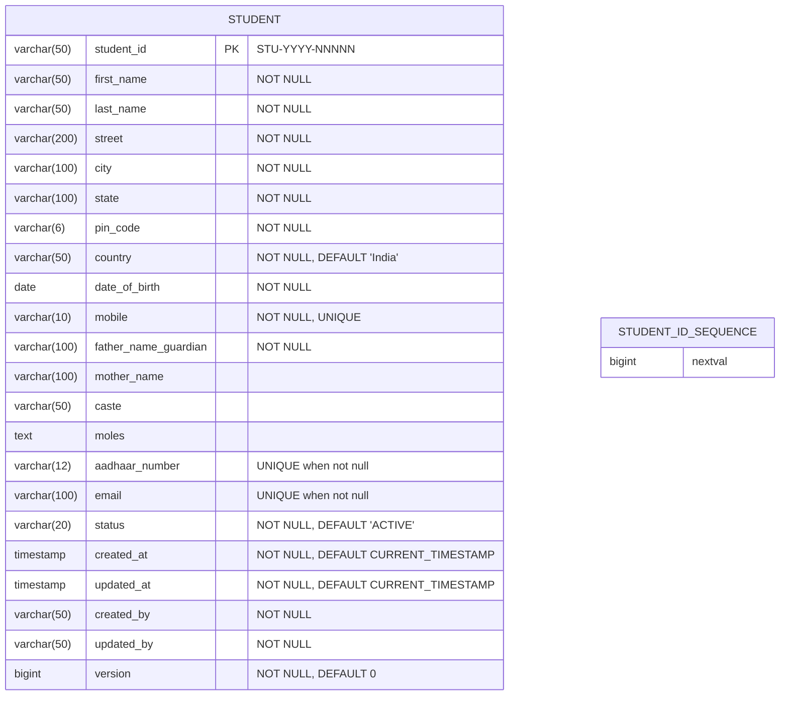
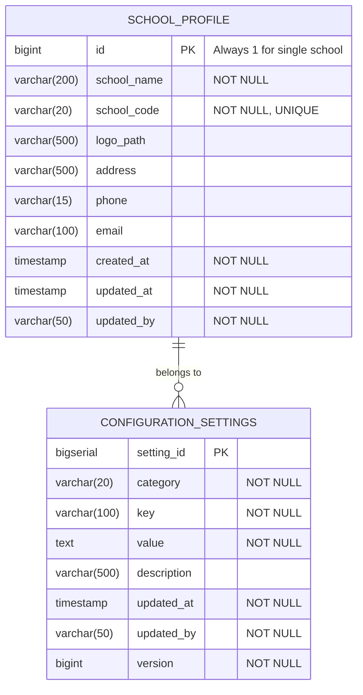

# Database Architecture

## Table of Contents
1. [Overview](#overview)
2. [Student Database](#student-database)
3. [Configuration Database](#configuration-database)
4. [Migration Strategy](#migration-strategy)
5. [Performance Optimization](#performance-optimization)
6. [Backup and Recovery](#backup-and-recovery)
7. [Data Integrity](#data-integrity)

## Overview

### Database Technology

**Choice**: PostgreSQL 15+

**Rationale**:
- ACID compliance for data integrity
- Rich constraint support (unique, check, foreign keys)
- Excellent JSON/JSONB support for flexible data
- Native support for sequences and auto-increment
- Strong indexing capabilities
- Mature ecosystem and tooling

### Database Per Service Pattern

Each microservice has its own database:
- **Student Service**: `student_db`
- **Configuration Service**: `configuration_db`

**Key Principles**:
1. No shared tables between services
2. No cross-database foreign keys
3. No cross-database joins
4. Each service owns its data schema
5. Data access only through service APIs

### Common Schema Patterns

All tables include:
- **Primary Key**: Auto-generated or business key
- **Audit Fields**: `created_at`, `updated_at`, `created_by`, `updated_by`
- **Optimistic Locking**: `version` column for concurrent update detection
- **Soft Delete** (where applicable): `deleted_at` column

## Student Database

### Entity Relationship Diagram



### Table Definitions

#### 1. students Table

**Purpose**: Store student profile information

**DDL**:
```sql
-- Create sequence for student ID generation
CREATE SEQUENCE IF NOT EXISTS student_id_seq
    START WITH 1
    INCREMENT BY 1
    NO CYCLE;

-- Create students table
CREATE TABLE students (
    student_id VARCHAR(50) PRIMARY KEY,

    -- Personal Information
    first_name VARCHAR(50) NOT NULL,
    last_name VARCHAR(50) NOT NULL,
    date_of_birth DATE NOT NULL,

    -- Address
    street VARCHAR(200) NOT NULL,
    city VARCHAR(100) NOT NULL,
    state VARCHAR(100) NOT NULL,
    pin_code VARCHAR(6) NOT NULL,
    country VARCHAR(50) NOT NULL DEFAULT 'India',

    -- Contact Information
    mobile VARCHAR(10) NOT NULL,
    email VARCHAR(100),

    -- Family Information
    father_name_guardian VARCHAR(100) NOT NULL,
    mother_name VARCHAR(100),

    -- Additional Information
    caste VARCHAR(50),
    moles TEXT,
    aadhaar_number VARCHAR(12),

    -- Status
    status VARCHAR(20) NOT NULL DEFAULT 'ACTIVE',

    -- Audit Fields
    created_at TIMESTAMP NOT NULL DEFAULT CURRENT_TIMESTAMP,
    updated_at TIMESTAMP NOT NULL DEFAULT CURRENT_TIMESTAMP,
    created_by VARCHAR(50) NOT NULL,
    updated_by VARCHAR(50) NOT NULL,

    -- Optimistic Locking
    version BIGINT NOT NULL DEFAULT 0,

    -- Constraints
    CONSTRAINT chk_student_status CHECK (status IN ('ACTIVE', 'INACTIVE')),
    CONSTRAINT chk_mobile_format CHECK (mobile ~ '^[0-9]{10}$'),
    CONSTRAINT chk_aadhaar_format CHECK (
        aadhaar_number IS NULL OR aadhaar_number ~ '^[0-9]{12}$'
    ),
    CONSTRAINT chk_email_format CHECK (
        email IS NULL OR email ~ '^[A-Za-z0-9._%+-]+@[A-Za-z0-9.-]+\.[A-Z|a-z]{2,}$'
    ),
    CONSTRAINT chk_pin_code_format CHECK (pin_code ~ '^[0-9]{6}$'),
    CONSTRAINT chk_name_length CHECK (
        LENGTH(first_name) >= 2 AND LENGTH(last_name) >= 2
    ),
    CONSTRAINT chk_date_of_birth CHECK (
        date_of_birth < CURRENT_DATE AND
        date_of_birth >= CURRENT_DATE - INTERVAL '18 years' AND
        date_of_birth <= CURRENT_DATE - INTERVAL '3 years'
    )
);

-- Unique Constraints
CREATE UNIQUE INDEX idx_students_mobile ON students(mobile);
CREATE UNIQUE INDEX idx_students_aadhaar ON students(aadhaar_number)
    WHERE aadhaar_number IS NOT NULL;
CREATE UNIQUE INDEX idx_students_email ON students(email)
    WHERE email IS NOT NULL;

-- Performance Indexes
CREATE INDEX idx_students_status ON students(status);
CREATE INDEX idx_students_created_at ON students(created_at DESC);
CREATE INDEX idx_students_last_name ON students(last_name);
CREATE INDEX idx_students_first_name ON students(first_name);
CREATE INDEX idx_students_dob ON students(date_of_birth);
CREATE INDEX idx_students_caste ON students(caste) WHERE caste IS NOT NULL;

-- Composite index for common searches
CREATE INDEX idx_students_name_status ON students(last_name, first_name, status);

-- Function to update updated_at timestamp
CREATE OR REPLACE FUNCTION update_updated_at_column()
RETURNS TRIGGER AS $$
BEGIN
    NEW.updated_at = CURRENT_TIMESTAMP;
    RETURN NEW;
END;
$$ LANGUAGE plpgsql;

-- Trigger to automatically update updated_at
CREATE TRIGGER trg_students_updated_at
    BEFORE UPDATE ON students
    FOR EACH ROW
    EXECUTE FUNCTION update_updated_at_column();

-- Function to generate next student ID
CREATE OR REPLACE FUNCTION generate_student_id()
RETURNS VARCHAR(50) AS $$
DECLARE
    next_seq BIGINT;
    current_year INT;
    new_student_id VARCHAR(50);
BEGIN
    next_seq := nextval('student_id_seq');
    current_year := EXTRACT(YEAR FROM CURRENT_DATE);
    new_student_id := 'STU-' || current_year || '-' || LPAD(next_seq::TEXT, 5, '0');
    RETURN new_student_id;
END;
$$ LANGUAGE plpgsql;

-- Comments for documentation
COMMENT ON TABLE students IS 'Stores student profile information';
COMMENT ON COLUMN students.student_id IS 'Auto-generated unique student ID (format: STU-YYYY-NNNNN)';
COMMENT ON COLUMN students.mobile IS 'Unique 10-digit mobile number';
COMMENT ON COLUMN students.aadhaar_number IS 'Optional 12-digit Aadhaar number';
COMMENT ON COLUMN students.status IS 'Student status: ACTIVE or INACTIVE';
COMMENT ON COLUMN students.version IS 'Optimistic locking version number';
```

#### 2. Database Views

**Active Students View**:
```sql
CREATE OR REPLACE VIEW v_active_students AS
SELECT
    student_id,
    first_name,
    last_name,
    CONCAT(first_name, ' ', last_name) AS full_name,
    date_of_birth,
    EXTRACT(YEAR FROM AGE(date_of_birth)) AS age,
    mobile,
    email,
    CONCAT(street, ', ', city, ', ', state, ' - ', pin_code) AS full_address,
    created_at,
    updated_at
FROM students
WHERE status = 'ACTIVE';

COMMENT ON VIEW v_active_students IS 'View of active students with computed fields';
```


### Sample Data

```sql
-- Insert sample students for testing
INSERT INTO students (
    student_id, first_name, last_name, date_of_birth,
    street, city, state, pin_code, country,
    mobile, email, father_name_guardian, mother_name,
    caste, moles, aadhaar_number, status,
    created_by, updated_by
) VALUES
(
    generate_student_id(),
    'Rajesh',
    'Kumar',
    '2015-05-15',
    '123 MG Road',
    'Bangalore',
    'Karnataka',
    '560001',
    'India',
    '9876543210',
    'rajesh.kumar@example.com',
    'Suresh Kumar',
    'Lakshmi Kumar',
    'General',
    'Small mole on left cheek',
    '123456789012',
    'ACTIVE',
    'ADMIN001',
    'ADMIN001'
),
(
    generate_student_id(),
    'Priya',
    'Sharma',
    '2016-08-20',
    '456 Brigade Road',
    'Bangalore',
    'Karnataka',
    '560025',
    'India',
    '9876543211',
    NULL,
    'Ramesh Sharma',
    'Sunita Sharma',
    'OBC',
    NULL,
    NULL,
    'ACTIVE',
    'ADMIN001',
    'ADMIN001'
);
```

## Configuration Database

### Entity Relationship Diagram



### Table Definitions

#### 1. school_profile Table

**Purpose**: Store school information (single record for Phase 1)

**DDL**:
```sql
CREATE TABLE school_profile (
    id BIGINT PRIMARY KEY DEFAULT 1,

    -- School Information
    school_name VARCHAR(200) NOT NULL,
    school_code VARCHAR(20) NOT NULL,
    logo_path VARCHAR(500),

    -- Contact Information
    address VARCHAR(500),
    phone VARCHAR(15),
    email VARCHAR(100),

    -- Audit Fields
    created_at TIMESTAMP NOT NULL DEFAULT CURRENT_TIMESTAMP,
    updated_at TIMESTAMP NOT NULL DEFAULT CURRENT_TIMESTAMP,
    updated_by VARCHAR(50) NOT NULL,

    -- Constraints
    CONSTRAINT chk_school_id CHECK (id = 1),
    CONSTRAINT chk_school_code_format CHECK (school_code ~ '^[A-Z0-9]{3,20}$'),
    CONSTRAINT chk_school_email_format CHECK (
        email IS NULL OR email ~ '^[A-Za-z0-9._%+-]+@[A-Za-z0-9.-]+\.[A-Z|a-z]{2,}$'
    ),
    CONSTRAINT chk_school_phone_format CHECK (
        phone IS NULL OR phone ~ '^[0-9+()-]{10,15}$'
    )
);

-- Unique constraint on school code
CREATE UNIQUE INDEX idx_school_profile_code ON school_profile(school_code);

-- Trigger to automatically update updated_at
CREATE TRIGGER trg_school_profile_updated_at
    BEFORE UPDATE ON school_profile
    FOR EACH ROW
    EXECUTE FUNCTION update_updated_at_column();

-- Comments
COMMENT ON TABLE school_profile IS 'School profile information (single record)';
COMMENT ON COLUMN school_profile.id IS 'Always 1 for single school deployment';
COMMENT ON COLUMN school_profile.school_code IS 'Unique school identifier code';
COMMENT ON COLUMN school_profile.logo_path IS 'File path or URL to school logo';

-- Insert default school profile
INSERT INTO school_profile (id, school_name, school_code, updated_by)
VALUES (1, 'Default School', 'SCH001', 'SYSTEM')
ON CONFLICT (id) DO NOTHING;
```

#### 2. configuration_settings Table

**Purpose**: Store key-value configuration settings grouped by category

**DDL**:
```sql
CREATE TABLE configuration_settings (
    setting_id BIGSERIAL PRIMARY KEY,

    -- Setting Information
    category VARCHAR(20) NOT NULL,
    key VARCHAR(100) NOT NULL,
    value TEXT NOT NULL,
    description VARCHAR(500),

    -- Audit Fields
    updated_at TIMESTAMP NOT NULL DEFAULT CURRENT_TIMESTAMP,
    updated_by VARCHAR(50) NOT NULL,

    -- Optimistic Locking
    version BIGINT NOT NULL DEFAULT 0,

    -- Constraints
    CONSTRAINT chk_setting_category CHECK (
        category IN ('GENERAL', 'ACADEMIC', 'FINANCIAL')
    ),
    CONSTRAINT chk_setting_key_format CHECK (
        key ~ '^[A-Z][A-Z0-9_]*$'
    )
);

-- Unique constraint on category + key combination
CREATE UNIQUE INDEX idx_config_category_key ON configuration_settings(category, key);

-- Performance indexes
CREATE INDEX idx_config_category ON configuration_settings(category);
CREATE INDEX idx_config_updated_at ON configuration_settings(updated_at DESC);

-- Trigger to automatically update updated_at
CREATE TRIGGER trg_configuration_settings_updated_at
    BEFORE UPDATE ON configuration_settings
    FOR EACH ROW
    EXECUTE FUNCTION update_updated_at_column();

-- Comments
COMMENT ON TABLE configuration_settings IS 'Key-value configuration settings grouped by category';
COMMENT ON COLUMN configuration_settings.category IS 'Setting category: GENERAL, ACADEMIC, or FINANCIAL';
COMMENT ON COLUMN configuration_settings.key IS 'Setting key in UPPERCASE_SNAKE_CASE format';
COMMENT ON COLUMN configuration_settings.value IS 'Setting value (stored as text)';
COMMENT ON COLUMN configuration_settings.version IS 'Optimistic locking version number';
```

#### 3. Default Configuration Data

```sql
-- General Settings
INSERT INTO configuration_settings (category, key, value, description, updated_by)
VALUES
    ('GENERAL', 'SCHOOL_TIMEZONE', 'Asia/Kolkata', 'Default timezone for the school', 'SYSTEM'),
    ('GENERAL', 'DATE_FORMAT', 'dd-MM-yyyy', 'Default date display format', 'SYSTEM'),
    ('GENERAL', 'LANGUAGE', 'en', 'Default language (ISO 639-1 code)', 'SYSTEM'),
    ('GENERAL', 'SESSION_TIMEOUT_MINUTES', '30', 'User session timeout in minutes', 'SYSTEM'),
    ('GENERAL', 'MAX_FILE_UPLOAD_MB', '10', 'Maximum file upload size in MB', 'SYSTEM')
ON CONFLICT (category, key) DO NOTHING;

-- Academic Settings
INSERT INTO configuration_settings (category, key, value, description, updated_by)
VALUES
    ('ACADEMIC', 'CURRENT_ACADEMIC_YEAR', '2025-2026', 'Current academic year', 'SYSTEM'),
    ('ACADEMIC', 'ACADEMIC_YEAR_START_MONTH', '6', 'Academic year start month (1-12)', 'SYSTEM'),
    ('ACADEMIC', 'MIN_STUDENT_AGE', '3', 'Minimum student age for admission', 'SYSTEM'),
    ('ACADEMIC', 'MAX_STUDENT_AGE', '18', 'Maximum student age for admission', 'SYSTEM'),
    ('ACADEMIC', 'WORKING_DAYS_PER_WEEK', '6', 'Number of working days per week', 'SYSTEM')
ON CONFLICT (category, key) DO NOTHING;

-- Financial Settings
INSERT INTO configuration_settings (category, key, value, description, updated_by)
VALUES
    ('FINANCIAL', 'CURRENCY_CODE', 'INR', 'Currency code (ISO 4217)', 'SYSTEM'),
    ('FINANCIAL', 'CURRENCY_SYMBOL', '₹', 'Currency symbol', 'SYSTEM'),
    ('FINANCIAL', 'TAX_RATE_PERCENT', '0', 'Default tax rate percentage', 'SYSTEM'),
    ('FINANCIAL', 'LATE_FEE_GRACE_DAYS', '7', 'Grace period for late fee in days', 'SYSTEM')
ON CONFLICT (category, key) DO NOTHING;
```

#### 4. Configuration Views

**Settings by Category View**:
```sql
CREATE OR REPLACE VIEW v_settings_by_category AS
SELECT
    category,
    json_agg(
        json_build_object(
            'settingId', setting_id,
            'key', key,
            'value', value,
            'description', description,
            'updatedAt', updated_at,
            'updatedBy', updated_by
        )
        ORDER BY key
    ) AS settings
FROM configuration_settings
GROUP BY category;

COMMENT ON VIEW v_settings_by_category IS 'Configuration settings grouped by category as JSON';
```

**All Settings as JSON**:
```sql
CREATE OR REPLACE VIEW v_all_settings_json AS
SELECT
    json_build_object(
        'schoolProfile', (
            SELECT json_build_object(
                'schoolName', school_name,
                'schoolCode', school_code,
                'logoPath', logo_path,
                'address', address,
                'phone', phone,
                'email', email
            )
            FROM school_profile WHERE id = 1
        ),
        'settings', (
            SELECT json_object_agg(
                category,
                settings
            )
            FROM v_settings_by_category
        )
    ) AS configuration;
```

## Migration Strategy

### Migration Tool: Flyway

**Why Flyway**:
- Version-controlled database migrations
- Automatic migration tracking
- Rollback support
- SQL-based migrations (familiar to DBAs)
- Integration with Spring Boot

### Migration File Structure

```
src/main/resources/db/migration/
├── V1__create_students_table.sql
├── V2__create_indexes_students.sql
├── V3__create_student_views.sql
├── V4__insert_sample_students.sql
```

### Naming Convention

**Versioned Migrations**:
- Format: `V{version}__{description}.sql`
- Example: `V1__create_students_table.sql`
- Version: Integer, sequential
- Description: Snake_case, descriptive

**Repeatable Migrations**:
- Format: `R__{description}.sql`
- Example: `R__refresh_statistics_view.sql`
- Run on every application start if changed
- Used for views, procedures, functions

### Sample Migration Files

**V1__create_students_table.sql**:
```sql
-- Student Service Migration V1: Create students table

-- Create sequence
CREATE SEQUENCE IF NOT EXISTS student_id_seq
    START WITH 1
    INCREMENT BY 1
    NO CYCLE;

-- Create function for updated_at trigger
CREATE OR REPLACE FUNCTION update_updated_at_column()
RETURNS TRIGGER AS $$
BEGIN
    NEW.updated_at = CURRENT_TIMESTAMP;
    RETURN NEW;
END;
$$ LANGUAGE plpgsql;

-- Create students table
CREATE TABLE students (
    student_id VARCHAR(50) PRIMARY KEY,
    first_name VARCHAR(50) NOT NULL,
    last_name VARCHAR(50) NOT NULL,
    date_of_birth DATE NOT NULL,
    street VARCHAR(200) NOT NULL,
    city VARCHAR(100) NOT NULL,
    state VARCHAR(100) NOT NULL,
    pin_code VARCHAR(6) NOT NULL,
    country VARCHAR(50) NOT NULL DEFAULT 'India',
    mobile VARCHAR(10) NOT NULL,
    email VARCHAR(100),
    father_name_guardian VARCHAR(100) NOT NULL,
    mother_name VARCHAR(100),
    caste VARCHAR(50),
    moles TEXT,
    aadhaar_number VARCHAR(12),
    status VARCHAR(20) NOT NULL DEFAULT 'ACTIVE',
    created_at TIMESTAMP NOT NULL DEFAULT CURRENT_TIMESTAMP,
    updated_at TIMESTAMP NOT NULL DEFAULT CURRENT_TIMESTAMP,
    created_by VARCHAR(50) NOT NULL,
    updated_by VARCHAR(50) NOT NULL,
    version BIGINT NOT NULL DEFAULT 0,

    CONSTRAINT chk_student_status CHECK (status IN ('ACTIVE', 'INACTIVE')),
    CONSTRAINT chk_mobile_format CHECK (mobile ~ '^[0-9]{10}$'),
    CONSTRAINT chk_aadhaar_format CHECK (
        aadhaar_number IS NULL OR aadhaar_number ~ '^[0-9]{12}$'
    ),
    CONSTRAINT chk_email_format CHECK (
        email IS NULL OR email ~ '^[A-Za-z0-9._%+-]+@[A-Za-z0-9.-]+\.[A-Z|a-z]{2,}$'
    ),
    CONSTRAINT chk_pin_code_format CHECK (pin_code ~ '^[0-9]{6}$'),
    CONSTRAINT chk_name_length CHECK (
        LENGTH(first_name) >= 2 AND LENGTH(last_name) >= 2
    )
);

-- Create trigger
CREATE TRIGGER trg_students_updated_at
    BEFORE UPDATE ON students
    FOR EACH ROW
    EXECUTE FUNCTION update_updated_at_column();

-- Add comments
COMMENT ON TABLE students IS 'Student profile information';
```

**V2__create_indexes_students.sql**:
```sql
-- Student Service Migration V2: Create indexes

-- Unique indexes
CREATE UNIQUE INDEX idx_students_mobile ON students(mobile);
CREATE UNIQUE INDEX idx_students_aadhaar ON students(aadhaar_number)
    WHERE aadhaar_number IS NOT NULL;
CREATE UNIQUE INDEX idx_students_email ON students(email)
    WHERE email IS NOT NULL;

-- Performance indexes
CREATE INDEX idx_students_status ON students(status);
CREATE INDEX idx_students_created_at ON students(created_at DESC);
CREATE INDEX idx_students_last_name ON students(last_name);
CREATE INDEX idx_students_first_name ON students(first_name);
CREATE INDEX idx_students_dob ON students(date_of_birth);
CREATE INDEX idx_students_caste ON students(caste) WHERE caste IS NOT NULL;
CREATE INDEX idx_students_name_status ON students(last_name, first_name, status);
```

### Rollback Strategy

**Approach**: Create compensating migrations

**Example Rollback** (V5__rollback_v4.sql):
```sql
-- Rollback for V4: Remove sample students
DELETE FROM students WHERE created_by = 'MIGRATION';
```

**Best Practices**:
1. Never modify applied migrations
2. Create new migration to fix issues
3. Test migrations in dev/staging first
4. Back up database before production migration
5. Keep migrations small and focused

## Performance Optimization

### Indexing Strategy

#### 1. Primary Key Indexes
- Automatically created on PRIMARY KEY columns
- Clustered index for fast lookups

#### 2. Unique Indexes
- Enforce uniqueness and provide fast lookup
- Examples: mobile, aadhaar_number, email

#### 3. Search Indexes
- Index columns used in WHERE clauses
- Examples: status, created_at, last_name

#### 4. Composite Indexes
- Multi-column indexes for common query patterns
- Example: `(last_name, first_name, status)` for name searches

#### 5. Partial Indexes
- Index only subset of rows
- Example: `WHERE aadhaar_number IS NOT NULL`
- Saves space and improves performance

### Query Optimization

**Use EXPLAIN ANALYZE**:
```sql
EXPLAIN ANALYZE
SELECT * FROM students
WHERE status = 'ACTIVE'
  AND last_name LIKE 'Sharma%'
ORDER BY created_at DESC
LIMIT 20;
```

**Optimize Common Queries**:
```sql
-- Efficient pagination
SELECT * FROM students
WHERE status = 'ACTIVE'
  AND created_at < '2025-01-01'  -- Cursor-based pagination
ORDER BY created_at DESC
LIMIT 20;

-- Use covering index
CREATE INDEX idx_students_search_covering
ON students(status, last_name)
INCLUDE (first_name, mobile, email);
```

### Connection Pooling

**HikariCP Configuration** (application.yml):
```yaml
spring:
  datasource:
    hikari:
      maximum-pool-size: 10        # Max connections
      minimum-idle: 5              # Min idle connections
      connection-timeout: 30000    # 30 seconds
      idle-timeout: 600000         # 10 minutes
      max-lifetime: 1800000        # 30 minutes
      leak-detection-threshold: 60000  # 60 seconds
```

### Database Maintenance

**Regular Maintenance Tasks**:
```sql
-- Vacuum to reclaim space
VACUUM ANALYZE students;
VACUUM ANALYZE configuration_settings;

-- Reindex for fragmented indexes
REINDEX TABLE students;

-- Update statistics
ANALYZE students;
```

**Scheduled Jobs** (cron):
```bash
# Daily vacuum at 2 AM
0 2 * * * psql -U postgres -d student_db -c "VACUUM ANALYZE;"

# Weekly reindex on Sunday at 3 AM
0 3 * * 0 psql -U postgres -d student_db -c "REINDEX DATABASE student_db;"
```

## Backup and Recovery

### Backup Strategy

**1. Automated Daily Backups**:
```bash
#!/bin/bash
# backup_student_db.sh

BACKUP_DIR="/var/backups/postgres"
DATE=$(date +%Y%m%d_%H%M%S)
DB_NAME="student_db"

# Create backup
pg_dump -U postgres -d $DB_NAME -F c -f "$BACKUP_DIR/${DB_NAME}_${DATE}.backup"

# Compress backup
gzip "$BACKUP_DIR/${DB_NAME}_${DATE}.backup"

# Delete backups older than 30 days
find $BACKUP_DIR -name "${DB_NAME}_*.backup.gz" -mtime +30 -delete

echo "Backup completed: ${DB_NAME}_${DATE}.backup.gz"
```

**2. Backup Retention Policy**:
- Daily backups: Retained for 30 days
- Weekly backups: Retained for 3 months
- Monthly backups: Retained for 1 year

**3. Backup Types**:
- **Full Backup**: Complete database dump (daily)
- **Incremental Backup**: WAL archiving (continuous)
- **Point-in-Time Recovery**: Using WAL archives

### Recovery Procedures

**Restore from Backup**:
```bash
#!/bin/bash
# restore_student_db.sh

BACKUP_FILE="/var/backups/postgres/student_db_20251117.backup.gz"
DB_NAME="student_db"

# Decompress backup
gunzip -c $BACKUP_FILE > /tmp/restore.backup

# Drop existing database (CAUTION!)
psql -U postgres -c "DROP DATABASE IF EXISTS $DB_NAME;"

# Create new database
psql -U postgres -c "CREATE DATABASE $DB_NAME;"

# Restore from backup
pg_restore -U postgres -d $DB_NAME /tmp/restore.backup

# Clean up
rm /tmp/restore.backup

echo "Restore completed"
```

**Point-in-Time Recovery**:
```sql
-- Enable WAL archiving in postgresql.conf
wal_level = replica
archive_mode = on
archive_command = 'cp %p /var/lib/postgresql/wal_archive/%f'

-- Restore to specific point in time
SELECT pg_create_restore_point('before_data_update');
```

## Data Integrity

### Constraints

**1. Primary Key Constraints**:
- Ensures uniqueness and non-null
- Automatically indexed

**2. Foreign Key Constraints**:
- Not used in microservices (no cross-service FKs)
- Referential integrity enforced at application level

**3. Unique Constraints**:
- Mobile number uniqueness
- Aadhaar number uniqueness (when not null)
- Email uniqueness (when not null)
- Configuration category + key uniqueness

**4. Check Constraints**:
- Status values (ACTIVE, INACTIVE)
- Mobile format (10 digits)
- Aadhaar format (12 digits)
- Email format (regex)
- Name length (2-50 characters)
- Date of birth (age 3-18)

**5. Not Null Constraints**:
- Required fields enforced at database level
- Examples: first_name, last_name, mobile

### Data Validation Layers

**Multi-Layer Validation**:
1. **Database Layer**: Constraints and triggers
2. **Application Layer**: Business rule validation
3. **Presentation Layer**: Input validation

### Referential Integrity

**Single Service**:
- Standard foreign keys within service database
- Cascading deletes where appropriate

**Cross-Service**:
- No database-level foreign keys
- Application-level integrity checks
- Eventual consistency where needed

### Audit Trail

**Audit Fields in All Tables**:
- `created_at`: When record was created
- `updated_at`: When record was last updated
- `created_by`: User who created record
- `updated_by`: User who last updated record

**Separate Audit Table** (Future Enhancement):
```sql
CREATE TABLE audit_log (
    audit_id BIGSERIAL PRIMARY KEY,
    table_name VARCHAR(50) NOT NULL,
    record_id VARCHAR(50) NOT NULL,
    operation VARCHAR(10) NOT NULL,  -- INSERT, UPDATE, DELETE
    old_values JSONB,
    new_values JSONB,
    changed_by VARCHAR(50) NOT NULL,
    changed_at TIMESTAMP NOT NULL DEFAULT CURRENT_TIMESTAMP
);

CREATE INDEX idx_audit_log_table_record ON audit_log(table_name, record_id);
CREATE INDEX idx_audit_log_changed_at ON audit_log(changed_at DESC);
```

## Summary

The database architecture provides:

1. **Isolation**: Separate databases per service
2. **Integrity**: Comprehensive constraints and validation
3. **Performance**: Strategic indexing and optimization
4. **Reliability**: Automated backups and recovery procedures
5. **Maintainability**: Migration-based schema evolution
6. **Auditability**: Complete change tracking
7. **Scalability**: Connection pooling and query optimization

The next document ([API Specifications](04-API-SPECIFICATIONS.md)) provides complete REST API definitions with OpenAPI specifications.

---

**Version**: 1.0
**Last Updated**: 2025-11-17
**Status**: Draft for Review
