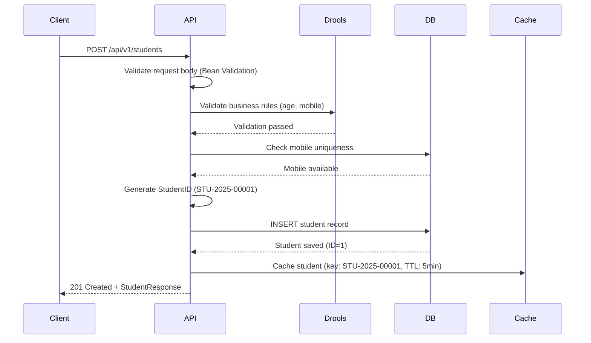
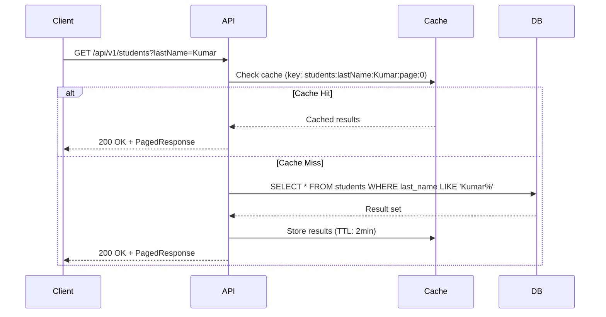

# API Specification - School Management System

## 1. Overview

This document specifies the RESTful API design for the School Management System, following OpenAPI 3.0 standards. The APIs are resource-oriented, stateless, and adhere to REST principles with RFC 7807 error handling.

## 2. API Design Principles

### 2.1 Core Principles

- **Resource-Oriented**: URLs represent resources (students, configurations)
- **HTTP Verbs**: Standard methods (GET, POST, PUT, PATCH, DELETE)
- **Stateless**: Each request contains all necessary information
- **Versioned**: `/api/v1/...` for future compatibility
- **JSON**: Request/response content type: `application/json`
- **Idempotent**: GET, PUT, DELETE are idempotent
- **RFC 7807**: Problem Details for standardized errors

### 2.2 Base URL Structure

```
Production: https://sms.example.com/api/v1
Development: http://localhost:8081/api/v1  (Student Service)
Development: http://localhost:8082/api/v1  (Configuration Service)
```

### 2.3 Common Headers

**Request Headers:**
```
Content-Type: application/json
Accept: application/json
X-Correlation-ID: <uuid>  (for tracing)
Authorization: Bearer <token>  (Phase 2)
```

**Response Headers:**
```
Content-Type: application/json
X-Correlation-ID: <uuid>  (echoed from request)
X-Response-Time: <milliseconds>
```

## 3. Student Service APIs

**Base Path:** `/api/v1/students`

### 3.1 Create Student

**Endpoint:** `POST /api/v1/students`

**Description:** Registers a new student with auto-generated StudentID.

**Request:**
```http
POST /api/v1/students HTTP/1.1
Content-Type: application/json
X-Correlation-ID: a1b2c3d4-e5f6-7890

{
  "firstName": "Rajesh",
  "lastName": "Kumar",
  "address": "123 MG Road, Bangalore, Karnataka 560001",
  "mobile": "+919876543210",
  "dateOfBirth": "2015-05-15",
  "fatherName": "Suresh Kumar",
  "motherName": "Lakshmi Kumar",
  "identificationMark": "Mole on left cheek",
  "email": "rajesh.kumar@example.com",
  "aadhaarNumber": "123456789012"
}
```

**Request Schema:**
```json
{
  "type": "object",
  "required": ["firstName", "lastName", "address", "mobile", "dateOfBirth", "fatherName"],
  "properties": {
    "firstName": {
      "type": "string",
      "minLength": 1,
      "maxLength": 100,
      "description": "Student's first name"
    },
    "lastName": {
      "type": "string",
      "minLength": 1,
      "maxLength": 100,
      "description": "Student's last name"
    },
    "address": {
      "type": "string",
      "minLength": 10,
      "maxLength": 500,
      "description": "Complete residential address"
    },
    "mobile": {
      "type": "string",
      "pattern": "^\\+?[0-9]{10,15}$",
      "description": "Contact mobile number (10-15 digits)"
    },
    "dateOfBirth": {
      "type": "string",
      "format": "date",
      "description": "Date of birth (YYYY-MM-DD). Age must be 3-18 years"
    },
    "fatherName": {
      "type": "string",
      "minLength": 1,
      "maxLength": 100,
      "description": "Father's name or guardian name"
    },
    "motherName": {
      "type": "string",
      "maxLength": 100,
      "description": "Mother's name (optional)"
    },
    "identificationMark": {
      "type": "string",
      "maxLength": 200,
      "description": "Physical identification mark (optional)"
    },
    "email": {
      "type": "string",
      "format": "email",
      "maxLength": 100,
      "description": "Email address (optional)"
    },
    "aadhaarNumber": {
      "type": "string",
      "pattern": "^[0-9]{12}$",
      "description": "12-digit Aadhaar number (optional)"
    }
  }
}
```

**Success Response (201 Created):**
```http
HTTP/1.1 201 Created
Content-Type: application/json
Location: /api/v1/students/1
X-Correlation-ID: a1b2c3d4-e5f6-7890
X-Response-Time: 145ms

{
  "id": 1,
  "studentId": "STU-2025-00001",
  "firstName": "Rajesh",
  "lastName": "Kumar",
  "address": "123 MG Road, Bangalore, Karnataka 560001",
  "mobile": "+919876543210",
  "dateOfBirth": "2015-05-15",
  "age": 9,
  "fatherName": "Suresh Kumar",
  "motherName": "Lakshmi Kumar",
  "identificationMark": "Mole on left cheek",
  "email": "rajesh.kumar@example.com",
  "aadhaarNumber": "123456789012",
  "status": "Active",
  "createdAt": "2025-01-15T10:30:45.123Z",
  "updatedAt": "2025-01-15T10:30:45.123Z",
  "version": 0
}
```

**Error Response (400 Bad Request - Age Validation):**
```http
HTTP/1.1 400 Bad Request
Content-Type: application/problem+json
X-Correlation-ID: a1b2c3d4-e5f6-7890

{
  "type": "https://api.sms.example.com/problems/validation-error",
  "title": "Validation Failed",
  "status": 400,
  "detail": "Student age must be between 3 and 18 years",
  "instance": "/api/v1/students",
  "correlationId": "a1b2c3d4-e5f6-7890",
  "timestamp": "2025-01-15T10:30:45.123Z",
  "errors": [
    {
      "field": "dateOfBirth",
      "message": "Student must be between 3 and 18 years old",
      "rejectedValue": "2000-01-01"
    }
  ]
}
```

**Error Response (409 Conflict - Duplicate Mobile):**
```http
HTTP/1.1 409 Conflict
Content-Type: application/problem+json
X-Correlation-ID: a1b2c3d4-e5f6-7890

{
  "type": "https://api.sms.example.com/problems/duplicate-resource",
  "title": "Duplicate Resource",
  "status": 409,
  "detail": "Student with mobile number +919876543210 already exists",
  "instance": "/api/v1/students",
  "correlationId": "a1b2c3d4-e5f6-7890",
  "timestamp": "2025-01-15T10:30:45.123Z",
  "existingStudentId": "STU-2025-00123"
}
```

### 3.2 List Students with Pagination and Search

**Endpoint:** `GET /api/v1/students`

**Description:** Retrieves paginated list of students with optional search filters.

**Query Parameters:**

| Parameter | Type | Required | Default | Description |
|-----------|------|----------|---------|-------------|
| `page` | integer | No | 0 | Page number (0-indexed) |
| `size` | integer | No | 20 | Items per page (max 100) |
| `sort` | string | No | createdAt,desc | Sort field and direction (e.g., lastName,asc) |
| `lastName` | string | No | - | Filter by last name (partial match) |
| `guardianName` | string | No | - | Filter by father's name (partial match) |
| `status` | string | No | - | Filter by status (Active, Inactive) |
| `mobile` | string | No | - | Exact mobile number match |

**Request Examples:**
```http
# Get first page (default 20 items)
GET /api/v1/students HTTP/1.1

# Get second page with 50 items
GET /api/v1/students?page=1&size=50 HTTP/1.1

# Search by last name
GET /api/v1/students?lastName=Kumar HTTP/1.1

# Search by guardian name
GET /api/v1/students?guardianName=Suresh HTTP/1.1

# Active students only, sorted by last name
GET /api/v1/students?status=Active&sort=lastName,asc HTTP/1.1

# Combined search
GET /api/v1/students?lastName=Kumar&status=Active&page=0&size=10 HTTP/1.1
```

**Success Response (200 OK):**
```http
HTTP/1.1 200 OK
Content-Type: application/json
X-Correlation-ID: b2c3d4e5-f6g7-8901
X-Response-Time: 87ms

{
  "content": [
    {
      "id": 1,
      "studentId": "STU-2025-00001",
      "firstName": "Rajesh",
      "lastName": "Kumar",
      "mobile": "+919876543210",
      "dateOfBirth": "2015-05-15",
      "age": 9,
      "fatherName": "Suresh Kumar",
      "status": "Active",
      "createdAt": "2025-01-15T10:30:45.123Z"
    },
    {
      "id": 5,
      "studentId": "STU-2025-00005",
      "firstName": "Priya",
      "lastName": "Kumar",
      "mobile": "+918765432109",
      "dateOfBirth": "2014-08-20",
      "age": 10,
      "fatherName": "Amit Kumar",
      "status": "Active",
      "createdAt": "2025-01-14T14:20:30.456Z"
    }
  ],
  "pageable": {
    "pageNumber": 0,
    "pageSize": 20,
    "sort": {
      "sorted": true,
      "orderBy": [
        {
          "property": "createdAt",
          "direction": "DESC"
        }
      ]
    }
  },
  "totalElements": 2,
  "totalPages": 1,
  "last": true,
  "first": true,
  "numberOfElements": 2,
  "empty": false
}
```

### 3.3 Get Student by ID

**Endpoint:** `GET /api/v1/students/{id}`

**Description:** Retrieves complete student details by internal ID.

**Request:**
```http
GET /api/v1/students/1 HTTP/1.1
X-Correlation-ID: c3d4e5f6-g7h8-9012
```

**Success Response (200 OK):**
```http
HTTP/1.1 200 OK
Content-Type: application/json
X-Correlation-ID: c3d4e5f6-g7h8-9012
X-Response-Time: 45ms

{
  "id": 1,
  "studentId": "STU-2025-00001",
  "firstName": "Rajesh",
  "lastName": "Kumar",
  "address": "123 MG Road, Bangalore, Karnataka 560001",
  "mobile": "+919876543210",
  "dateOfBirth": "2015-05-15",
  "age": 9,
  "fatherName": "Suresh Kumar",
  "motherName": "Lakshmi Kumar",
  "identificationMark": "Mole on left cheek",
  "email": "rajesh.kumar@example.com",
  "aadhaarNumber": "123456789012",
  "status": "Active",
  "createdAt": "2025-01-15T10:30:45.123Z",
  "updatedAt": "2025-01-15T10:30:45.123Z",
  "version": 0
}
```

**Error Response (404 Not Found):**
```http
HTTP/1.1 404 Not Found
Content-Type: application/problem+json
X-Correlation-ID: c3d4e5f6-g7h8-9012

{
  "type": "https://api.sms.example.com/problems/resource-not-found",
  "title": "Resource Not Found",
  "status": 404,
  "detail": "Student with ID 999 not found",
  "instance": "/api/v1/students/999",
  "correlationId": "c3d4e5f6-g7h8-9012",
  "timestamp": "2025-01-15T10:30:45.123Z"
}
```

### 3.4 Get Student by StudentID

**Endpoint:** `GET /api/v1/students/student-id/{studentId}`

**Description:** Retrieves student details by system-generated StudentID.

**Request:**
```http
GET /api/v1/students/student-id/STU-2025-00001 HTTP/1.1
X-Correlation-ID: d4e5f6g7-h8i9-0123
```

**Success Response (200 OK):**
```http
HTTP/1.1 200 OK
Content-Type: application/json
X-Correlation-ID: d4e5f6g7-h8i9-0123
X-Response-Time: 42ms

{
  "id": 1,
  "studentId": "STU-2025-00001",
  "firstName": "Rajesh",
  "lastName": "Kumar",
  "address": "123 MG Road, Bangalore, Karnataka 560001",
  "mobile": "+919876543210",
  "dateOfBirth": "2015-05-15",
  "age": 9,
  "fatherName": "Suresh Kumar",
  "motherName": "Lakshmi Kumar",
  "identificationMark": "Mole on left cheek",
  "email": "rajesh.kumar@example.com",
  "aadhaarNumber": "123456789012",
  "status": "Active",
  "createdAt": "2025-01-15T10:30:45.123Z",
  "updatedAt": "2025-01-15T10:30:45.123Z",
  "version": 0
}
```

### 3.5 Update Student

**Endpoint:** `PUT /api/v1/students/{id}`

**Description:** Updates editable student fields. Only firstName, lastName, mobile, and status can be modified.

**Request:**
```http
PUT /api/v1/students/1 HTTP/1.1
Content-Type: application/json
X-Correlation-ID: e5f6g7h8-i9j0-1234

{
  "firstName": "Rajesh Kumar",
  "lastName": "Sharma",
  "mobile": "+919876543210",
  "status": "Active",
  "version": 0
}
```

**Request Schema:**
```json
{
  "type": "object",
  "required": ["firstName", "lastName", "mobile", "status", "version"],
  "properties": {
    "firstName": {
      "type": "string",
      "minLength": 1,
      "maxLength": 100
    },
    "lastName": {
      "type": "string",
      "minLength": 1,
      "maxLength": 100
    },
    "mobile": {
      "type": "string",
      "pattern": "^\\+?[0-9]{10,15}$"
    },
    "status": {
      "type": "string",
      "enum": ["Active", "Inactive"]
    },
    "version": {
      "type": "integer",
      "description": "Current version for optimistic locking"
    }
  }
}
```

**Success Response (200 OK):**
```http
HTTP/1.1 200 OK
Content-Type: application/json
X-Correlation-ID: e5f6g7h8-i9j0-1234
X-Response-Time: 98ms

{
  "id": 1,
  "studentId": "STU-2025-00001",
  "firstName": "Rajesh Kumar",
  "lastName": "Sharma",
  "address": "123 MG Road, Bangalore, Karnataka 560001",
  "mobile": "+919876543210",
  "dateOfBirth": "2015-05-15",
  "age": 9,
  "fatherName": "Suresh Kumar",
  "motherName": "Lakshmi Kumar",
  "identificationMark": "Mole on left cheek",
  "email": "rajesh.kumar@example.com",
  "aadhaarNumber": "123456789012",
  "status": "Active",
  "createdAt": "2025-01-15T10:30:45.123Z",
  "updatedAt": "2025-01-15T11:45:20.789Z",
  "version": 1
}
```

**Error Response (409 Conflict - Optimistic Lock):**
```http
HTTP/1.1 409 Conflict
Content-Type: application/problem+json
X-Correlation-ID: e5f6g7h8-i9j0-1234

{
  "type": "https://api.sms.example.com/problems/optimistic-lock-error",
  "title": "Concurrent Modification Detected",
  "status": 409,
  "detail": "Student record was modified by another user. Please refresh and try again.",
  "instance": "/api/v1/students/1",
  "correlationId": "e5f6g7h8-i9j0-1234",
  "timestamp": "2025-01-15T11:45:20.789Z",
  "currentVersion": 2,
  "providedVersion": 0
}
```

### 3.6 Update Student Status

**Endpoint:** `PATCH /api/v1/students/{id}/status`

**Description:** Updates only the student status (Active/Inactive).

**Request:**
```http
PATCH /api/v1/students/1/status HTTP/1.1
Content-Type: application/json
X-Correlation-ID: f6g7h8i9-j0k1-2345

{
  "status": "Inactive",
  "version": 1
}
```

**Success Response (200 OK):**
```http
HTTP/1.1 200 OK
Content-Type: application/json
X-Correlation-ID: f6g7h8i9-j0k1-2345
X-Response-Time: 56ms

{
  "id": 1,
  "studentId": "STU-2025-00001",
  "firstName": "Rajesh Kumar",
  "lastName": "Sharma",
  "status": "Inactive",
  "updatedAt": "2025-01-15T12:00:00.000Z",
  "version": 2
}
```

### 3.7 Delete Student (Soft Delete)

**Endpoint:** `DELETE /api/v1/students/{id}`

**Description:** Soft deletes student by setting status to 'Inactive'. No hard deletes are performed.

**Request:**
```http
DELETE /api/v1/students/1 HTTP/1.1
X-Correlation-ID: g7h8i9j0-k1l2-3456
```

**Success Response (204 No Content):**
```http
HTTP/1.1 204 No Content
X-Correlation-ID: g7h8i9j0-k1l2-3456
X-Response-Time: 67ms
```

**Note:** The student record remains in the database with `status = 'Inactive'`.

## 4. Configuration Service APIs

**Base Path:** `/api/v1/configurations`

### 4.1 Create Configuration

**Endpoint:** `POST /api/v1/configurations`

**Description:** Creates a new configuration setting.

**Request:**
```http
POST /api/v1/configurations HTTP/1.1
Content-Type: application/json
X-Correlation-ID: h8i9j0k1-l2m3-4567

{
  "category": "General",
  "configKey": "school_name",
  "configValue": "ABC International School",
  "description": "Official school name displayed on reports"
}
```

**Request Schema:**
```json
{
  "type": "object",
  "required": ["category", "configKey", "configValue"],
  "properties": {
    "category": {
      "type": "string",
      "enum": ["General", "Academic", "Financial", "System"],
      "description": "Configuration category"
    },
    "configKey": {
      "type": "string",
      "minLength": 1,
      "maxLength": 100,
      "description": "Unique key within category"
    },
    "configValue": {
      "type": "string",
      "minLength": 1,
      "description": "Configuration value (text, number, URL, JSON)"
    },
    "description": {
      "type": "string",
      "maxLength": 500,
      "description": "Human-readable description (optional)"
    }
  }
}
```

**Success Response (201 Created):**
```http
HTTP/1.1 201 Created
Content-Type: application/json
Location: /api/v1/configurations/1
X-Correlation-ID: h8i9j0k1-l2m3-4567
X-Response-Time: 78ms

{
  "id": 1,
  "category": "General",
  "configKey": "school_name",
  "configValue": "ABC International School",
  "description": "Official school name displayed on reports",
  "createdAt": "2025-01-15T10:00:00.000Z",
  "updatedAt": "2025-01-15T10:00:00.000Z",
  "version": 0
}
```

**Error Response (409 Conflict - Duplicate Key):**
```http
HTTP/1.1 409 Conflict
Content-Type: application/problem+json
X-Correlation-ID: h8i9j0k1-l2m3-4567

{
  "type": "https://api.sms.example.com/problems/duplicate-resource",
  "title": "Duplicate Configuration",
  "status": 409,
  "detail": "Configuration with key 'school_name' already exists in category 'General'",
  "instance": "/api/v1/configurations",
  "correlationId": "h8i9j0k1-l2m3-4567",
  "timestamp": "2025-01-15T10:00:00.000Z"
}
```

### 4.2 List All Configurations

**Endpoint:** `GET /api/v1/configurations`

**Description:** Retrieves all configuration settings.

**Query Parameters:**

| Parameter | Type | Required | Default | Description |
|-----------|------|----------|---------|-------------|
| `page` | integer | No | 0 | Page number (0-indexed) |
| `size` | integer | No | 50 | Items per page (max 100) |
| `sort` | string | No | category,asc | Sort order |

**Request:**
```http
GET /api/v1/configurations?page=0&size=50 HTTP/1.1
X-Correlation-ID: i9j0k1l2-m3n4-5678
```

**Success Response (200 OK):**
```http
HTTP/1.1 200 OK
Content-Type: application/json
X-Correlation-ID: i9j0k1l2-m3n4-5678
X-Response-Time: 52ms

{
  "content": [
    {
      "id": 1,
      "category": "General",
      "configKey": "school_name",
      "configValue": "ABC International School",
      "description": "Official school name",
      "createdAt": "2025-01-10T10:00:00.000Z",
      "updatedAt": "2025-01-10T10:00:00.000Z"
    },
    {
      "id": 2,
      "category": "General",
      "configKey": "school_code",
      "configValue": "ABC-001",
      "description": "Unique school code",
      "createdAt": "2025-01-10T10:01:00.000Z",
      "updatedAt": "2025-01-10T10:01:00.000Z"
    },
    {
      "id": 3,
      "category": "General",
      "configKey": "school_logo_url",
      "configValue": "https://cdn.example.com/logos/school.png",
      "description": "School logo URL",
      "createdAt": "2025-01-10T10:02:00.000Z",
      "updatedAt": "2025-01-10T10:02:00.000Z"
    },
    {
      "id": 4,
      "category": "Academic",
      "configKey": "academic_year",
      "configValue": "2024-2025",
      "description": "Current academic year",
      "createdAt": "2025-01-10T10:03:00.000Z",
      "updatedAt": "2025-01-10T10:03:00.000Z"
    },
    {
      "id": 5,
      "category": "Academic",
      "configKey": "default_class_capacity",
      "configValue": "40",
      "description": "Maximum students per class",
      "createdAt": "2025-01-10T10:04:00.000Z",
      "updatedAt": "2025-01-10T10:04:00.000Z"
    }
  ],
  "pageable": {
    "pageNumber": 0,
    "pageSize": 50,
    "sort": {
      "sorted": true,
      "orderBy": [
        {
          "property": "category",
          "direction": "ASC"
        }
      ]
    }
  },
  "totalElements": 5,
  "totalPages": 1,
  "last": true,
  "first": true,
  "numberOfElements": 5,
  "empty": false
}
```

### 4.3 Get Configurations by Category

**Endpoint:** `GET /api/v1/configurations/category/{category}`

**Description:** Retrieves all configurations for a specific category.

**Request:**
```http
GET /api/v1/configurations/category/Academic HTTP/1.1
X-Correlation-ID: j0k1l2m3-n4o5-6789
```

**Success Response (200 OK):**
```http
HTTP/1.1 200 OK
Content-Type: application/json
X-Correlation-ID: j0k1l2m3-n4o5-6789
X-Response-Time: 48ms

[
  {
    "id": 4,
    "category": "Academic",
    "configKey": "academic_year",
    "configValue": "2024-2025",
    "description": "Current academic year",
    "createdAt": "2025-01-10T10:03:00.000Z",
    "updatedAt": "2025-01-10T10:03:00.000Z"
  },
  {
    "id": 5,
    "category": "Academic",
    "configKey": "default_class_capacity",
    "configValue": "40",
    "description": "Maximum students per class",
    "createdAt": "2025-01-10T10:04:00.000Z",
    "updatedAt": "2025-01-10T10:04:00.000Z"
  }
]
```

### 4.4 Update Configuration

**Endpoint:** `PUT /api/v1/configurations/{id}`

**Description:** Updates an existing configuration setting.

**Request:**
```http
PUT /api/v1/configurations/4 HTTP/1.1
Content-Type: application/json
X-Correlation-ID: k1l2m3n4-o5p6-7890

{
  "category": "Academic",
  "configKey": "academic_year",
  "configValue": "2025-2026",
  "description": "Current academic year (updated)",
  "version": 0
}
```

**Success Response (200 OK):**
```http
HTTP/1.1 200 OK
Content-Type: application/json
X-Correlation-ID: k1l2m3n4-o5p6-7890
X-Response-Time: 89ms

{
  "id": 4,
  "category": "Academic",
  "configKey": "academic_year",
  "configValue": "2025-2026",
  "description": "Current academic year (updated)",
  "createdAt": "2025-01-10T10:03:00.000Z",
  "updatedAt": "2025-01-15T14:30:00.000Z",
  "version": 1
}
```

### 4.5 Delete Configuration

**Endpoint:** `DELETE /api/v1/configurations/{id}`

**Description:** Permanently deletes a configuration setting.

**Request:**
```http
DELETE /api/v1/configurations/10 HTTP/1.1
X-Correlation-ID: l2m3n4o5-p6q7-8901
```

**Success Response (204 No Content):**
```http
HTTP/1.1 204 No Content
X-Correlation-ID: l2m3n4o5-p6q7-8901
X-Response-Time: 54ms
```

## 5. Common Error Responses (RFC 7807)

### 5.1 Error Response Format

All errors follow RFC 7807 Problem Details specification.

**Base Schema:**
```json
{
  "type": "string (URI)",
  "title": "string (short summary)",
  "status": "integer (HTTP status code)",
  "detail": "string (detailed explanation)",
  "instance": "string (API endpoint)",
  "correlationId": "string (UUID)",
  "timestamp": "string (ISO 8601)",
  "...additional context fields"
}
```

### 5.2 400 Bad Request - Validation Error

```json
{
  "type": "https://api.sms.example.com/problems/validation-error",
  "title": "Validation Failed",
  "status": 400,
  "detail": "Request validation failed for one or more fields",
  "instance": "/api/v1/students",
  "correlationId": "a1b2c3d4-e5f6-7890",
  "timestamp": "2025-01-15T10:30:45.123Z",
  "errors": [
    {
      "field": "mobile",
      "message": "Mobile number format is invalid",
      "rejectedValue": "12345"
    },
    {
      "field": "email",
      "message": "Email format is invalid",
      "rejectedValue": "invalid-email"
    }
  ]
}
```

### 5.3 404 Not Found

```json
{
  "type": "https://api.sms.example.com/problems/resource-not-found",
  "title": "Resource Not Found",
  "status": 404,
  "detail": "Student with ID 999 not found",
  "instance": "/api/v1/students/999",
  "correlationId": "b2c3d4e5-f6g7-8901",
  "timestamp": "2025-01-15T10:30:45.123Z"
}
```

### 5.4 409 Conflict - Duplicate Resource

```json
{
  "type": "https://api.sms.example.com/problems/duplicate-resource",
  "title": "Duplicate Resource",
  "status": 409,
  "detail": "Student with mobile number +919876543210 already exists",
  "instance": "/api/v1/students",
  "correlationId": "c3d4e5f6-g7h8-9012",
  "timestamp": "2025-01-15T10:30:45.123Z",
  "existingStudentId": "STU-2025-00123",
  "conflictingField": "mobile"
}
```

### 5.5 409 Conflict - Optimistic Lock Error

```json
{
  "type": "https://api.sms.example.com/problems/optimistic-lock-error",
  "title": "Concurrent Modification Detected",
  "status": 409,
  "detail": "Student record was modified by another user. Please refresh and try again.",
  "instance": "/api/v1/students/1",
  "correlationId": "d4e5f6g7-h8i9-0123",
  "timestamp": "2025-01-15T10:30:45.123Z",
  "currentVersion": 3,
  "providedVersion": 2
}
```

### 5.6 500 Internal Server Error

```json
{
  "type": "https://api.sms.example.com/problems/internal-error",
  "title": "Internal Server Error",
  "status": 500,
  "detail": "An unexpected error occurred. Please try again later.",
  "instance": "/api/v1/students/1",
  "correlationId": "e5f6g7h8-i9j0-1234",
  "timestamp": "2025-01-15T10:30:45.123Z"
}
```

## 6. HTTP Status Codes Summary

| Status Code | Meaning | Usage |
|-------------|---------|-------|
| **200 OK** | Success | GET, PUT, PATCH successful |
| **201 Created** | Resource created | POST successful |
| **204 No Content** | Success, no body | DELETE successful |
| **400 Bad Request** | Invalid input | Validation failures, malformed JSON |
| **404 Not Found** | Resource not found | GET/PUT/DELETE non-existent resource |
| **409 Conflict** | Resource conflict | Duplicate mobile, optimistic lock error |
| **500 Internal Server Error** | Server error | Unexpected exceptions, database failures |

## 7. Pagination & Filtering

### 7.1 Pagination Format

**Standard Pageable Response:**
```json
{
  "content": [...],  // Array of resources
  "pageable": {
    "pageNumber": 0,   // Current page (0-indexed)
    "pageSize": 20,    // Items per page
    "sort": {
      "sorted": true,
      "orderBy": [
        {
          "property": "createdAt",
          "direction": "DESC"
        }
      ]
    }
  },
  "totalElements": 150,  // Total items across all pages
  "totalPages": 8,       // Total number of pages
  "last": false,         // Is this the last page?
  "first": true,         // Is this the first page?
  "numberOfElements": 20, // Items in current page
  "empty": false         // Is the result empty?
}
```

### 7.2 Sorting

**Single field:**
```
GET /api/v1/students?sort=lastName,asc
```

**Multiple fields:**
```
GET /api/v1/students?sort=lastName,asc&sort=firstName,asc
```

**Supported sort fields (students):**
- `lastName`, `firstName`, `mobile`, `dateOfBirth`, `status`, `createdAt`, `updatedAt`

### 7.3 Filtering

**Combination example:**
```
GET /api/v1/students?lastName=Kumar&status=Active&page=0&size=10&sort=createdAt,desc
```

## 8. Performance Considerations

### 8.1 Response Time Requirements

| Endpoint | Target (95th percentile) | Strategy |
|----------|--------------------------|----------|
| GET /students/{id} | <50ms | Redis cache (5 min TTL) |
| GET /students/student-id/{studentId} | <50ms | Redis cache (5 min TTL) |
| GET /students (list) | <150ms | Database index on last_name, status |
| POST /students | <200ms | Drools validation, DB insert |
| PUT /students/{id} | <180ms | Optimistic locking, cache invalidation |
| GET /configurations/category/{category} | <30ms | Redis cache (1 hour TTL) |

### 8.2 Rate Limiting (Future)

```
X-RateLimit-Limit: 100
X-RateLimit-Remaining: 95
X-RateLimit-Reset: 1610724000
```

## 9. API Versioning Strategy

### 9.1 URL Versioning (Current)

```
/api/v1/students
/api/v2/students  (future)
```

### 9.2 Deprecation Policy

Deprecated endpoints will:
1. Return `Deprecation: true` header
2. Remain functional for 6 months minimum
3. Include `Sunset` header with end-of-life date

```
Deprecation: true
Sunset: Wed, 01 Jul 2026 00:00:00 GMT
Link: </api/v2/students>; rel="successor-version"
```

## 10. Example API Flows

### 10.1 Complete Student Registration Flow



### 10.2 Student Search with Cache



## 11. OpenAPI 3.0 Specification Summary

**Full OpenAPI spec available at:** `/api/v1/api-docs`

**Swagger UI:** `/swagger-ui.html`

**Key metadata:**
```yaml
openapi: 3.0.3
info:
  title: School Management System API
  version: 1.0.0
  description: RESTful APIs for student and configuration management
  contact:
    name: SMS Development Team
    email: dev@sms.example.com
servers:
  - url: https://sms.example.com/api/v1
    description: Production
  - url: http://localhost:8081/api/v1
    description: Development (Student Service)
  - url: http://localhost:8082/api/v1
    description: Development (Configuration Service)
```

## 12. Summary

### 12.1 API Inventory

**Student Service (8 endpoints):**
1. `POST /api/v1/students` - Create student
2. `GET /api/v1/students` - List students (paginated, searchable)
3. `GET /api/v1/students/{id}` - Get student by ID
4. `GET /api/v1/students/student-id/{studentId}` - Get student by StudentID
5. `PUT /api/v1/students/{id}` - Update student
6. `PATCH /api/v1/students/{id}/status` - Update status only
7. `DELETE /api/v1/students/{id}` - Soft delete student

**Configuration Service (5 endpoints):**
1. `POST /api/v1/configurations` - Create configuration
2. `GET /api/v1/configurations` - List all configurations
3. `GET /api/v1/configurations/category/{category}` - Get by category
4. `PUT /api/v1/configurations/{id}` - Update configuration
5. `DELETE /api/v1/configurations/{id}` - Delete configuration

### 12.2 Key Features

- RESTful resource-oriented design
- RFC 7807 Problem Details for errors
- Optimistic locking support
- Comprehensive pagination and filtering
- Correlation ID tracking
- Performance-optimized caching
- OpenAPI 3.0 documented

This API specification provides a complete contract for frontend-backend integration and serves as the foundation for implementation.
