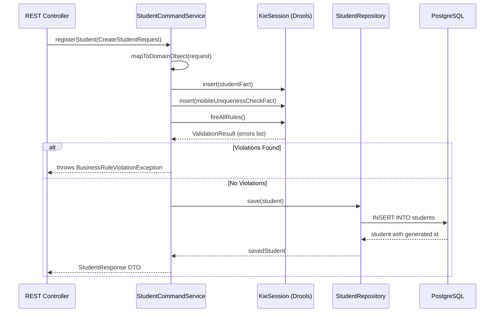

# 03 - Business Rules Strategy

## Cross-Reference Index
- Business Requirements: `specs/REQUIREMENTS.md` (Section 5: Functional Requirements)
- API Contracts: `specs/sms_api_specification.yaml` (StudentBase - dateOfBirth, mobile; 409 responses)
- Database Design: `specs/architecture/02-database-design.md` (CHECK constraints)
- Backend Implementation Guide: `specs/architecture/05-backend-implementation-guide.md`
- Testing Strategy: `specs/TESTING_STRATEGY.md` (Section 3.1: Unit Testing)

---

## 1. Business Rules Inventory

| Rule ID | Rule Name | Description | Enforcement Layer |
|---|---|---|---|
| BR-1 | Student Age Validation | Student age must be between 3 and 18 years at time of registration | Drools + DB CHECK |
| BR-2 | Mobile Uniqueness | Mobile number must be unique across all students | Drools + DB UNIQUE |
| BR-3 | Class Capacity | (Phase 2) Maximum students per section per academic year | Drools (placeholder) |
| BR-4 | Edit Field Restriction | Only firstName, lastName, mobile, and status may be updated post-registration | Application Layer |
| BR-5 | Student Status Default | New students are always created with status ACTIVE | Application Layer |
| BR-6 | StudentID Auto-Generation | System assigns a formatted StudentID on registration | Application Layer |
| BR-7 | Enrollment Year Uniqueness | A student may have only one enrollment record per academic year | DB UNIQUE + Drools |

---

## 2. Drools Integration Architecture



### 2.1 Drools Version and Configuration

- **Version:** `9.44.0.Final` (KIE API)
- **Session Type:** Stateless `KieSession` per request (thread-safe, no state leakage)
- **Rule Location:** `src/main/resources/rules/`
- **Spring Integration:** `KieContainer` bean configured via `@Configuration` class; `KieSession` obtained per request via `kieContainer.newStatelessKieSession()`

### 2.2 Spring Configuration Class

```java
// InfrastructureLayer: com.sms.student.infrastructure.config.DroolsConfig
@Configuration
public class DroolsConfig {

    @Bean
    public KieContainer kieContainer() {
        KieServices ks = KieServices.Factory.get();
        KieContainer kContainer = ks.getKieClasspathContainer();
        return kContainer;
    }

    @Bean
    public StatelessKieSession studentValidationSession(KieContainer kieContainer) {
        return kieContainer.newStatelessKieSession("studentValidationSession");
    }
}
```

### 2.3 `kmodule.xml` Configuration

```xml
<!-- src/main/resources/META-INF/kmodule.xml -->
<?xml version="1.0" encoding="UTF-8"?>
<kmodule xmlns="http://www.drools.org/xsd/kmodule">
    <kbase name="StudentRules" packages="rules.student">
        <ksession name="studentValidationSession" type="stateless" default="true"/>
    </kbase>
    <kbase name="ConfigurationRules" packages="rules.configuration">
        <ksession name="configValidationSession" type="stateless" default="false"/>
    </kbase>
</kmodule>
```

---

## 3. Rule Fact Objects

Facts are plain Java objects (no Spring annotations) placed in the Domain Layer.

```java
// Domain Layer: com.sms.student.domain.rules.StudentRegistrationFact
@Data
@Builder
public class StudentRegistrationFact {
    private LocalDate dateOfBirth;
    private String mobile;
    private boolean mobileAlreadyExists;  // pre-populated by service before rule fire
    private List<String> violations;      // populated BY rules

    public void addViolation(String message) {
        if (violations == null) violations = new ArrayList<>();
        violations.add(message);
    }

    public boolean hasViolations() {
        return violations != null && !violations.isEmpty();
    }
}
```

```java
// Domain Layer: com.sms.student.domain.rules.EnrollmentFact
@Data
@Builder
public class EnrollmentFact {
    private String academicYear;
    private boolean yearAlreadyEnrolled; // pre-populated by service
    private List<String> violations;

    public void addViolation(String message) {
        if (violations == null) violations = new ArrayList<>();
        violations.add(message);
    }
}
```

---

## 4. DRL Rule Files

### 4.1 BR-1: Student Age Validation

**File:** `src/main/resources/rules/student/StudentAgeValidation.drl`

```drl
package rules.student;

import com.sms.student.domain.rules.StudentRegistrationFact;
import java.time.LocalDate;
import java.time.Period;

rule "BR-1: Reject student below minimum age"
    dialect "java"
    when
        $fact : StudentRegistrationFact(
            dateOfBirth != null,
            Period.between(dateOfBirth, LocalDate.now()).getYears() < 3
        )
    then
        $fact.addViolation("Student age must be between 3 and 18 years at registration");
end

rule "BR-1: Reject student above maximum age"
    dialect "java"
    when
        $fact : StudentRegistrationFact(
            dateOfBirth != null,
            Period.between(dateOfBirth, LocalDate.now()).getYears() > 18
        )
    then
        $fact.addViolation("Student age must be between 3 and 18 years at registration");
end

rule "BR-1: Reject null date of birth"
    dialect "java"
    when
        $fact : StudentRegistrationFact(dateOfBirth == null)
    then
        $fact.addViolation("Date of birth is required");
end
```

### 4.2 BR-2: Mobile Uniqueness Validation

**File:** `src/main/resources/rules/student/StudentMobileValidation.drl`

```drl
package rules.student;

import com.sms.student.domain.rules.StudentRegistrationFact;

rule "BR-2: Reject duplicate mobile number"
    dialect "java"
    when
        $fact : StudentRegistrationFact(mobileAlreadyExists == true)
    then
        $fact.addViolation("Mobile number already registered to another student");
end

rule "BR-2: Reject invalid mobile format"
    dialect "java"
    when
        $fact : StudentRegistrationFact(
            mobile != null,
            !mobile.matches("\\d{10}")
        )
    then
        $fact.addViolation("Mobile number must be exactly 10 digits");
end
```

### 4.3 BR-7: Enrollment Year Uniqueness

**File:** `src/main/resources/rules/student/EnrollmentValidation.drl`

```drl
package rules.student;

import com.sms.student.domain.rules.EnrollmentFact;

rule "BR-7: Reject duplicate enrollment for academic year"
    dialect "java"
    when
        $fact : EnrollmentFact(yearAlreadyEnrolled == true)
    then
        $fact.addViolation("Student is already enrolled for academic year: " + $fact.getAcademicYear());
end
```

### 4.4 BR-3: Class Capacity (Phase 2 Placeholder)

**File:** `src/main/resources/rules/student/ClassCapacityValidation.drl`

```drl
package rules.student;

// BR-3: Class Capacity - Reserved for Phase 2 implementation
// When gradeClass + section student count >= maxCapacity (from ConfigurationService),
// reject enrollment with violation "Class section is at maximum capacity"

rule "BR-3: Class capacity placeholder - always passes in Phase 1"
    dialect "java"
    when
        // No conditions - rule is inactive in Phase 1
        eval(false)
    then
        // Phase 2: Check capacity against ConfigurationSetting ACADEMIC/max_class_size
end
```

---

## 5. Service Layer Integration

The Application Layer service orchestrates Drools rule execution before persisting:

```java
// Application Layer: com.sms.student.application.command.StudentCommandService
@Service
@RequiredArgsConstructor
public class StudentCommandService {

    private final StudentRepository studentRepository;
    private final StatelessKieSession studentValidationSession;
    private final StudentMapper studentMapper;

    public StudentResponse registerStudent(CreateStudentRequest request) {
        // 1. Pre-populate fact with DB-lookup result (mobile uniqueness check)
        boolean mobileExists = studentRepository.existsByMobile(request.getMobile());

        StudentRegistrationFact fact = StudentRegistrationFact.builder()
            .dateOfBirth(request.getDateOfBirth())
            .mobile(request.getMobile())
            .mobileAlreadyExists(mobileExists)
            .violations(new ArrayList<>())
            .build();

        // 2. Fire Drools rules
        studentValidationSession.execute(fact);

        // 3. Reject if violations exist
        if (fact.hasViolations()) {
            throw new BusinessRuleViolationException(fact.getViolations());
        }

        // 4. Build domain object and persist
        Student student = studentMapper.toDomain(request);
        student.setStudentId(generateStudentId());
        student.setStatus(StudentStatus.ACTIVE);

        Student saved = studentRepository.save(student);
        return studentMapper.toResponse(saved);
    }
}
```

---

## 6. Exception Handling for Rule Violations

```java
// Application Layer: com.sms.student.application.exception.BusinessRuleViolationException
public class BusinessRuleViolationException extends RuntimeException {
    private final List<String> violations;

    public BusinessRuleViolationException(List<String> violations) {
        super("Business rule validation failed");
        this.violations = Collections.unmodifiableList(violations);
    }

    public List<String> getViolations() { return violations; }
}
```

The global `@RestControllerAdvice` maps this to HTTP 422 Unprocessable Entity with RFC 7807 error body:

```java
@ExceptionHandler(BusinessRuleViolationException.class)
public ResponseEntity<ErrorResponse> handleBusinessRuleViolation(
        BusinessRuleViolationException ex, HttpServletRequest request) {
    ErrorResponse error = ErrorResponse.builder()
        .type("https://api.school.com/errors/business-rule-violation")
        .title("Business Rule Violation")
        .status(422)
        .detail("One or more business rules were violated")
        .instance(request.getRequestURI())
        .timestamp(OffsetDateTime.now())
        .errors(ex.getViolations().stream()
            .map(v -> FieldError.of("businessRule", v, "BR_VIOLATION"))
            .toList())
        .build();
    return ResponseEntity.unprocessableEntity().body(error);
}
```

---

## 7. Rule Validation Mapping Summary

| Business Rule | Drools Rule Name | HTTP Response on Failure |
|---|---|---|
| BR-1 (Age < 3) | `BR-1: Reject student below minimum age` | 422 with violation message |
| BR-1 (Age > 18) | `BR-1: Reject student above maximum age` | 422 with violation message |
| BR-1 (Null DOB) | `BR-1: Reject null date of birth` | 422 with violation message |
| BR-2 (Duplicate Mobile) | `BR-2: Reject duplicate mobile number` | 409 Conflict |
| BR-2 (Invalid Mobile Format) | `BR-2: Reject invalid mobile format` | 400 Bad Request |
| BR-7 (Duplicate Enrollment Year) | `BR-7: Reject duplicate enrollment for academic year` | 409 Conflict |

Note: BR-2 duplicate mobile maps to 409 per OpenAPI spec; the exception handler inspects violation codes to differentiate 409 from 422 responses.

---

## 8. Testing Business Rules

Per `specs/TESTING_STRATEGY.md`, Domain Layer requires 95% coverage.

```java
// Unit test: StudentAgeValidationTest.java
@ExtendWith(MockitoExtension.class)
class StudentAgeValidationDroolsTest {

    private StatelessKieSession session;

    @BeforeEach
    void setUp() {
        KieServices ks = KieServices.Factory.get();
        KieContainer container = ks.getKieClasspathContainer();
        session = container.newStatelessKieSession("studentValidationSession");
    }

    @Test
    @DisplayName("BR-1: Should reject student below 3 years")
    void shouldRejectUnderage() {
        StudentRegistrationFact fact = StudentRegistrationFact.builder()
            .dateOfBirth(LocalDate.now().minusYears(2))
            .mobile("9876543210")
            .mobileAlreadyExists(false)
            .violations(new ArrayList<>())
            .build();
        session.execute(fact);
        assertThat(fact.getViolations()).anyMatch(v -> v.contains("between 3 and 18 years"));
    }

    @Test
    @DisplayName("BR-1: Should reject student over 18 years")
    void shouldRejectOverage() {
        StudentRegistrationFact fact = StudentRegistrationFact.builder()
            .dateOfBirth(LocalDate.now().minusYears(19))
            .mobile("9876543210")
            .mobileAlreadyExists(false)
            .violations(new ArrayList<>())
            .build();
        session.execute(fact);
        assertThat(fact.getViolations()).anyMatch(v -> v.contains("between 3 and 18 years"));
    }

    @Test
    @DisplayName("BR-2: Should reject duplicate mobile")
    void shouldRejectDuplicateMobile() {
        StudentRegistrationFact fact = StudentRegistrationFact.builder()
            .dateOfBirth(LocalDate.now().minusYears(10))
            .mobile("9876543210")
            .mobileAlreadyExists(true)
            .violations(new ArrayList<>())
            .build();
        session.execute(fact);
        assertThat(fact.getViolations()).anyMatch(v -> v.contains("already registered"));
    }
}
```
