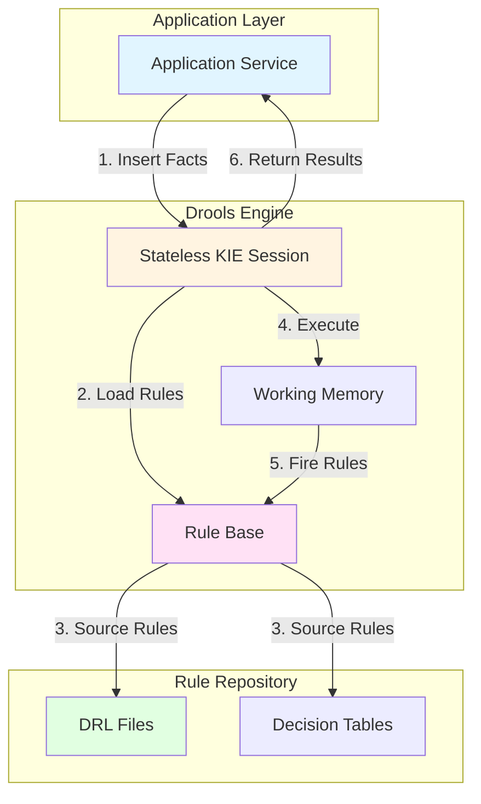

# Business Rules Strategy
**School Management System - Drools Rules Engine Integration**

**Version**: 1.0
**Date**: 2026-01-15
**Status**: Active

---

## Table of Contents

1. [Overview](#overview)
2. [Why Drools](#why-drools)
3. [Business Rules Inventory](#business-rules-inventory)
4. [Drools Architecture](#drools-architecture)
5. [Rule Structure](#rule-structure)
6. [Implementation Patterns](#implementation-patterns)
7. [Integration with Service Layer](#integration-with-service-layer)
8. [Rule Testing Strategy](#rule-testing-strategy)
9. [Rule Management](#rule-management)

---

## Overview

### Purpose

The School Management System uses **Drools 9.44.0.Final** as a Business Rules Management System (BRMS) to externalize complex validation and business logic from application code. This enables:

1. **Rule Externalization**: Business rules separate from Java code
2. **Non-Developer Authoring**: Domain experts can modify rules
3. **Centralized Validation**: Single source of truth for business constraints
4. **Dynamic Updates**: Rules can be modified without code deployment (future)

### Scope

**In-Scope for Drools**:
- Complex validation logic (age range, enrollment capacity)
- Multi-field validations
- Business constraints that may change frequently
- Cross-aggregate validations

**Out-of-Scope for Drools**:
- Simple null checks (use Jakarta Validation)
- Database constraints (use PostgreSQL CHECK constraints)
- Format validations (use regex in annotations)
- Authorization logic (use Spring Security - future)

---

## Why Drools

### Benefits

1. **Separation of Concerns**: Business logic isolated from technical code
2. **Maintainability**: Rules easier to understand and modify than nested if-else chains
3. **Performance**: Rete algorithm for efficient pattern matching
4. **Auditability**: Rules are explicit and traceable
5. **Testability**: Rules can be unit tested independently

### Trade-offs

| Benefit | Cost |
|---------|------|
| Rule externalization | Learning curve for rule syntax |
| Non-developer authoring | Need for rule governance |
| Dynamic rule updates | Complexity in rule versioning |
| Centralized logic | Performance overhead vs inline code |

### When to Use Drools vs Code

**Use Drools When**:
- Rule complexity is high (multiple conditions)
- Rules may change frequently
- Business users need visibility into rules
- Multiple validations share common patterns

**Use Code When**:
- Simple validations (null, format checks)
- Performance is critical (tight loops)
- Logic is purely technical (database mapping)

---

## Business Rules Inventory

### Student Management Rules

#### BR-1: Student Age Validation

**Rule ID**: `BR-001`
**Category**: Student Registration
**Priority**: CRITICAL
**Description**: Student age must be between 3 and 18 years at registration

**Drools Rule Name**: `student-age-range-validation`

**Conditions**:
- Date of Birth is provided
- Age calculated from DOB is < 3 OR > 18

**Action**:
- Add validation error: "Student age must be between 3 and 18 years at registration"
- Prevent student registration

**Test Cases**:
- Age = 2 years → REJECT
- Age = 3 years → ACCEPT
- Age = 18 years → ACCEPT
- Age = 19 years → REJECT
- DOB in future → REJECT

---

#### BR-2: Mobile Number Uniqueness

**Rule ID**: `BR-002`
**Category**: Student Registration
**Priority**: CRITICAL
**Description**: Mobile number must be unique across all students

**Implementation**: Database UNIQUE constraint + Application validation

**Drools Rule Name**: `student-mobile-uniqueness`

**Conditions**:
- Mobile number is provided
- Mobile number already exists in database (checked via repository)

**Action**:
- Add validation error: "Mobile number {mobile} is already registered"
- Prevent student registration/update

**Note**: This rule coordinates with database check. Drools provides business layer validation before database transaction.

---

#### BR-3: Class Capacity Enforcement

**Rule ID**: `BR-003`
**Category**: Enrollment
**Priority**: HIGH
**Description**: Cannot enroll student if class capacity is reached

**Drools Rule Name**: `enrollment-class-capacity`

**Conditions**:
- Enrollment request for specific class, section, academic year
- Current enrollment count >= MAX_CLASS_CAPACITY (from Configuration)

**Action**:
- Add validation error: "Class capacity ({capacity}) reached for {grade}-{section}"
- Prevent enrollment

**Configuration Dependency**:
- Reads: `ACADEMIC.MAX_CLASS_CAPACITY` from Configuration Service

**Test Cases**:
- Current count = 39, max = 40 → ACCEPT
- Current count = 40, max = 40 → REJECT
- Configuration missing → DEFAULT to 40

---

#### BR-4: Duplicate Enrollment Prevention

**Rule ID**: `BR-004`
**Category**: Enrollment
**Priority**: CRITICAL
**Description**: Student cannot have duplicate active enrollments in same academic year

**Drools Rule Name**: `enrollment-duplicate-prevention`

**Conditions**:
- Enrollment request for student + academic year
- Active enrollment already exists for same student + academic year

**Action**:
- Add validation error: "Student already enrolled in academic year {year}"
- Prevent enrollment

---

#### BR-5: Student Edit Restrictions

**Rule ID**: `BR-005`
**Category**: Student Update
**Priority**: CRITICAL
**Description**: Only firstName, lastName, mobile, status can be edited after registration

**Drools Rule Name**: `student-update-field-restriction`

**Conditions**:
- Student update request contains changes to immutable fields:
  - `dateOfBirth`
  - `aadhaarNumber`
  - `email`
  - `studentId`

**Action**:
- Add validation error: "Field {fieldName} is immutable and cannot be updated"
- Prevent update

**Allowed Fields**:
- `firstName`
- `lastName`
- `mobile`
- `status`

---

### Configuration Management Rules

#### BR-6: Configuration Key Uniqueness

**Rule ID**: `BR-006`
**Category**: Configuration
**Priority**: HIGH
**Description**: Configuration key must be unique within category

**Implementation**: Database UNIQUE constraint (category, key)

**Drools Rule**: Not needed (database constraint sufficient)

---

## Drools Architecture

### Component Structure



### Drools Components

1. **KIE Container**: Loads and manages rule base
2. **KIE Session**: Execution context (stateless for thread safety)
3. **Working Memory**: Temporary storage for facts during rule evaluation
4. **Rule Base**: Compiled rules from DRL files
5. **Agenda**: Queue of rules ready to fire

### Session Types

**Stateless Session** (Used in SMS):
- No state retained between executions
- Thread-safe
- Suitable for request-scoped validations
- Fire-and-forget pattern

**Stateful Session** (Not used):
- Retains state across executions
- Not thread-safe
- Suitable for long-running processes

---

## Rule Structure

### DRL File Organization

```
src/main/resources/rules/
├── student/
│   ├── student-registration-rules.drl
│   ├── student-update-rules.drl
│   └── student-validation-rules.drl
├── enrollment/
│   ├── enrollment-rules.drl
│   └── capacity-rules.drl
└── common/
    └── common-validation-rules.drl
```

### DRL File Anatomy

```drools
// =====================================================
// File: student-registration-rules.drl
// Description: Validation rules for student registration
// =====================================================

package com.school.student.rules;

import com.school.student.domain.model.Student;
import com.school.student.domain.model.ValidationResult;
import java.time.LocalDate;
import java.time.Period;

// Global object to collect validation errors
global ValidationResult validationResult;

// =====================================================
// Rule: BR-001 - Student Age Range Validation
// =====================================================
rule "student-age-range-validation"
    salience 100  // High priority
    when
        $student : Student(
            dateOfBirth != null,
            age < 3 || age > 18
        )
    then
        validationResult.addError(
            "dateOfBirth",
            "Student age must be between 3 and 18 years at registration",
            "BR-001"
        );
end

// =====================================================
// Rule: BR-001-Future-DOB - Reject Future Date of Birth
// =====================================================
rule "student-future-dob-validation"
    salience 100
    when
        $student : Student(
            dateOfBirth != null,
            dateOfBirth.isAfter(LocalDate.now())
        )
    then
        validationResult.addError(
            "dateOfBirth",
            "Date of birth cannot be in the future",
            "BR-001-FUTURE"
        );
end
```

### Rule Components Explained

1. **Package Declaration**: Organizes rules into namespaces
2. **Imports**: Java classes used in rules
3. **Global Objects**: Shared objects across rules (e.g., ValidationResult)
4. **Rule Definition**:
   - `rule "name"`: Unique rule identifier
   - `salience`: Priority (higher fires first)
   - `when`: Conditions (LHS - Left Hand Side)
   - `then`: Actions (RHS - Right Hand Side)

### Salience (Priority)

| Salience | Purpose | Example |
|----------|---------|---------|
| 1000 | Critical validations | Null checks, required fields |
| 500 | Business rules | Age validation, capacity checks |
| 100 | Cross-field validations | Date range checks |
| 0 | Default priority | General validations |

Higher salience rules fire first.

---

## Implementation Patterns

### Pattern 1: Simple Field Validation

**Use Case**: Validate single field constraint

```drools
rule "student-first-name-length"
    when
        $student : Student(
            firstName != null,
            firstName.length() < 2 || firstName.length() > 100
        )
    then
        validationResult.addError(
            "firstName",
            "First name must be between 2 and 100 characters",
            "BR-007"
        );
end
```

### Pattern 2: Cross-Field Validation

**Use Case**: Validate relationship between multiple fields

```drools
rule "enrollment-withdrawal-date-after-enrollment"
    when
        $enrollment : Enrollment(
            enrollmentDate != null,
            withdrawalDate != null,
            withdrawalDate.isBefore(enrollmentDate)
        )
    then
        validationResult.addError(
            "withdrawalDate",
            "Withdrawal date must be after enrollment date",
            "BR-008"
        );
end
```

### Pattern 3: Database-Dependent Validation

**Use Case**: Validation requires database lookup

```drools
rule "student-mobile-uniqueness"
    when
        $student : Student(mobile != null)
        $service : StudentRepositoryService()
        eval($service.existsByMobileAndIdNot($student.getMobile(), $student.getId()))
    then
        validationResult.addError(
            "mobile",
            "Mobile number " + $student.getMobile() + " is already registered",
            "BR-002"
        );
end
```

**Note**: Pass repository service as fact for database checks.

### Pattern 4: Configuration-Driven Rule

**Use Case**: Rule behavior depends on configuration

```drools
rule "enrollment-class-capacity"
    when
        $enrollment : Enrollment(academicYear != null, gradeClass != null, section != null)
        $config : Configuration(category == "ACADEMIC", key == "MAX_CLASS_CAPACITY")
        $service : EnrollmentService()
        $currentCount : Integer(this >= Integer.parseInt($config.getValue()))
            from $service.countActiveEnrollments(
                $enrollment.getAcademicYear(),
                $enrollment.getGradeClass(),
                $enrollment.getSection()
            )
    then
        validationResult.addError(
            "enrollment",
            "Class capacity (" + $config.getValue() + ") reached for " +
            $enrollment.getGradeClass() + "-" + $enrollment.getSection(),
            "BR-003"
        );
end
```

### Pattern 5: Conditional Rule Firing

**Use Case**: Rule fires only in specific contexts

```drools
rule "student-update-field-restriction"
    when
        $request : StudentUpdateRequest(mode == "UPDATE")  // Only for updates, not creates
        $changes : Map() from $request.getChangedFields()
        eval($changes.containsKey("dateOfBirth") ||
             $changes.containsKey("aadhaarNumber") ||
             $changes.containsKey("email"))
    then
        validationResult.addError(
            "request",
            "Immutable fields cannot be modified: " + $changes.keySet(),
            "BR-005"
        );
end
```

---

## Integration with Service Layer

### Service Layer Flow

```java
// =====================================================
// Class: StudentApplicationService
// =====================================================

@Service
@RequiredArgsConstructor
public class StudentApplicationService {

    private final StudentRepository studentRepository;
    private final DroolsValidationService droolsValidationService;
    private final StudentMapper studentMapper;

    @Transactional
    public StudentResponse registerStudent(StudentCreateRequest request) {
        // 1. Map DTO to Domain Model
        Student student = studentMapper.toDomain(request);

        // 2. Drools Validation
        ValidationResult validationResult = droolsValidationService.validateStudent(student);

        // 3. Check Validation Result
        if (validationResult.hasErrors()) {
            throw new ValidationException(validationResult.getErrors());
        }

        // 4. Persist Student
        Student savedStudent = studentRepository.save(student);

        // 5. Map Domain to Response DTO
        return studentMapper.toResponse(savedStudent);
    }
}
```

### Drools Service Implementation

```java
// =====================================================
// Class: DroolsValidationService
// =====================================================

@Service
public class DroolsValidationService {

    private final KieContainer kieContainer;

    public DroolsValidationService() {
        KieServices kieServices = KieServices.Factory.get();
        this.kieContainer = kieServices.getKieClasspathContainer();
    }

    public ValidationResult validateStudent(Student student) {
        // 1. Create Stateless Session
        KieSession kieSession = kieContainer.newKieSession("student-validation-session");

        // 2. Create Global Result Object
        ValidationResult validationResult = new ValidationResult();
        kieSession.setGlobal("validationResult", validationResult);

        // 3. Insert Facts
        kieSession.insert(student);

        // Optional: Insert services for database checks
        // kieSession.insert(studentRepository);

        // 4. Fire All Rules
        kieSession.fireAllRules();

        // 5. Dispose Session
        kieSession.dispose();

        // 6. Return Result
        return validationResult;
    }

    public ValidationResult validateEnrollment(Enrollment enrollment, Student student) {
        KieSession kieSession = kieContainer.newKieSession("enrollment-validation-session");
        ValidationResult validationResult = new ValidationResult();

        kieSession.setGlobal("validationResult", validationResult);
        kieSession.insert(enrollment);
        kieSession.insert(student);

        kieSession.fireAllRules();
        kieSession.dispose();

        return validationResult;
    }
}
```

### ValidationResult Model

```java
// =====================================================
// Class: ValidationResult
// =====================================================

@Data
public class ValidationResult {
    private final List<ValidationError> errors = new ArrayList<>();

    public void addError(String field, String message, String code) {
        errors.add(new ValidationError(field, message, code));
    }

    public boolean hasErrors() {
        return !errors.isEmpty();
    }

    public boolean isValid() {
        return errors.isEmpty();
    }
}

@Data
@AllArgsConstructor
public class ValidationError {
    private String field;
    private String message;
    private String code;
}
```

### KIE Configuration (kmodule.xml)

```xml
<!-- src/main/resources/META-INF/kmodule.xml -->
<kmodule xmlns="http://www.drools.org/xsd/kmodule">
    <kbase name="student-rules" packages="com.school.student.rules">
        <ksession name="student-validation-session" type="stateless"/>
    </kbase>

    <kbase name="enrollment-rules" packages="com.school.enrollment.rules">
        <ksession name="enrollment-validation-session" type="stateless"/>
    </kbase>
</kmodule>
```

---

## Rule Testing Strategy

### Unit Testing Rules

**Approach**: Test individual rules in isolation

```java
// =====================================================
// Class: StudentAgeValidationRuleTest
// =====================================================

class StudentAgeValidationRuleTest {

    private KieContainer kieContainer;
    private KieSession kieSession;
    private ValidationResult validationResult;

    @BeforeEach
    void setUp() {
        KieServices kieServices = KieServices.Factory.get();
        kieContainer = kieServices.getKieClasspathContainer();
        kieSession = kieContainer.newKieSession("student-validation-session");
        validationResult = new ValidationResult();
        kieSession.setGlobal("validationResult", validationResult);
    }

    @AfterEach
    void tearDown() {
        kieSession.dispose();
    }

    @Test
    @DisplayName("Should reject student with age < 3 years")
    void shouldRejectStudentBelowMinimumAge() {
        // Given
        LocalDate dob = LocalDate.now().minusYears(2);
        Student student = Student.builder()
            .firstName("John")
            .lastName("Doe")
            .dateOfBirth(dob)
            .build();

        // When
        kieSession.insert(student);
        kieSession.fireAllRules();

        // Then
        assertThat(validationResult.hasErrors()).isTrue();
        assertThat(validationResult.getErrors())
            .extracting(ValidationError::getCode)
            .contains("BR-001");
        assertThat(validationResult.getErrors())
            .extracting(ValidationError::getField)
            .contains("dateOfBirth");
    }

    @Test
    @DisplayName("Should accept student with age 3 years")
    void shouldAcceptStudentAtMinimumAge() {
        // Given
        LocalDate dob = LocalDate.now().minusYears(3);
        Student student = Student.builder()
            .firstName("Jane")
            .lastName("Doe")
            .dateOfBirth(dob)
            .build();

        // When
        kieSession.insert(student);
        kieSession.fireAllRules();

        // Then
        assertThat(validationResult.hasErrors()).isFalse();
    }

    @Test
    @DisplayName("Should reject student with age > 18 years")
    void shouldRejectStudentAboveMaximumAge() {
        // Given
        LocalDate dob = LocalDate.now().minusYears(19);
        Student student = Student.builder()
            .firstName("Bob")
            .lastName("Smith")
            .dateOfBirth(dob)
            .build();

        // When
        kieSession.insert(student);
        kieSession.fireAllRules();

        // Then
        assertThat(validationResult.hasErrors()).isTrue();
        assertThat(validationResult.getErrors())
            .extracting(ValidationError::getCode)
            .contains("BR-001");
    }

    @Test
    @DisplayName("Should reject future date of birth")
    void shouldRejectFutureDateOfBirth() {
        // Given
        LocalDate dob = LocalDate.now().plusDays(1);
        Student student = Student.builder()
            .firstName("Alice")
            .lastName("Johnson")
            .dateOfBirth(dob)
            .build();

        // When
        kieSession.insert(student);
        kieSession.fireAllRules();

        // Then
        assertThat(validationResult.hasErrors()).isTrue();
        assertThat(validationResult.getErrors())
            .extracting(ValidationError::getCode)
            .contains("BR-001-FUTURE");
    }
}
```

### Integration Testing with Service Layer

```java
@SpringBootTest
class StudentApplicationServiceIntegrationTest {

    @Autowired
    private StudentApplicationService studentService;

    @Test
    @DisplayName("Should reject student registration with invalid age")
    void shouldRejectInvalidAge() {
        // Given
        StudentCreateRequest request = StudentCreateRequest.builder()
            .firstName("John")
            .lastName("Doe")
            .dateOfBirth(LocalDate.now().minusYears(2))  // Too young
            .mobile("9876543210")
            .build();

        // When & Then
        assertThatThrownBy(() -> studentService.registerStudent(request))
            .isInstanceOf(ValidationException.class)
            .hasMessageContaining("age must be between 3 and 18 years");
    }
}
```

---

## Rule Management

### Rule Versioning

**Strategy**: Version control DRL files in Git

```
rules/
├── v1/
│   └── student-registration-rules.drl
└── v2/
    └── student-registration-rules.drl
```

**Active Version**: Configured in `kmodule.xml`

### Rule Modification Workflow

1. **Developer** creates/modifies DRL file
2. **Unit Test** validates rule behavior
3. **Code Review** ensures rule correctness
4. **Integration Test** validates with service layer
5. **Deployment** rules packaged with application JAR

### Future: Dynamic Rule Updates

**Phase 2 Enhancement**:
- Store rules in database
- Load rules at runtime
- Update rules without redeployment
- Rule versioning and rollback

**Implementation**:
```java
KieFileSystem kfs = kieServices.newKieFileSystem();
kfs.write("src/main/resources/rules/dynamic-rule.drl", ruleContent);
KieBuilder kieBuilder = kieServices.newKieBuilder(kfs);
kieBuilder.buildAll();
```

### Rule Documentation

**Mandatory Documentation in DRL**:
- Rule ID (BR-XXX)
- Description
- Business owner
- Last updated date
- Related requirements

**Example**:
```drools
// =====================================================
// Rule ID: BR-001
// Description: Validate student age range (3-18 years)
// Business Owner: Academic Department
// Last Updated: 2026-01-15
// Related Requirements: REQUIREMENTS.md Section 5
// =====================================================
rule "student-age-range-validation"
    // ... rule definition
end
```

---

## Performance Considerations

### Rule Optimization

1. **Salience Ordering**: Order rules by importance to short-circuit evaluation
2. **Fact Filtering**: Insert only necessary facts to reduce working memory size
3. **Stateless Sessions**: Use stateless for thread safety and performance
4. **Rule Compilation**: Rules compiled at build time, not runtime

### Monitoring

**Metrics to Track**:
- Rule execution time
- Number of rules fired per session
- Validation failure rate by rule

**Micrometer Custom Metrics**:
```java
@Timed(value = "drools.validation.time", description = "Time to execute Drools validation")
public ValidationResult validateStudent(Student student) {
    // ... validation logic
}
```

### Caching Strategies

**Do NOT Cache**:
- KIE Sessions (stateless, not thread-safe if reused)
- Validation results (domain models change)

**DO Cache**:
- KIE Container (expensive to initialize)
- Configuration values used in rules

---

## Appendix

### Complete Student Validation Rules

**File**: `student-registration-rules.drl`

```drools
package com.school.student.rules;

import com.school.student.domain.model.Student;
import com.school.student.domain.model.ValidationResult;
import java.time.LocalDate;
import java.time.Period;

global ValidationResult validationResult;

// =====================================================
// BR-001: Age Range Validation
// =====================================================
rule "student-age-range-validation"
    salience 100
    when
        $student : Student(
            dateOfBirth != null,
            (Period.between(dateOfBirth, LocalDate.now()).getYears() < 3 ||
             Period.between(dateOfBirth, LocalDate.now()).getYears() > 18)
        )
    then
        validationResult.addError(
            "dateOfBirth",
            "Student age must be between 3 and 18 years at registration",
            "BR-001"
        );
end

// =====================================================
// BR-001-FUTURE: Future Date of Birth Validation
// =====================================================
rule "student-future-dob-validation"
    salience 100
    when
        $student : Student(
            dateOfBirth != null,
            dateOfBirth.isAfter(LocalDate.now())
        )
    then
        validationResult.addError(
            "dateOfBirth",
            "Date of birth cannot be in the future",
            "BR-001-FUTURE"
        );
end

// =====================================================
// BR-005: Immutable Field Update Prevention
// =====================================================
rule "student-update-field-restriction"
    salience 50
    when
        $student : Student(
            id != null,  // Existing student (update scenario)
            // This would be checked in update service logic
        )
    then
        // This rule is implemented in application layer
        // Drools used for logging/auditing purposes only
end
```

### Rule Catalog

| Rule ID | Name | Category | Priority | File |
|---------|------|----------|----------|------|
| BR-001 | Student Age Range | Registration | CRITICAL | student-registration-rules.drl |
| BR-002 | Mobile Uniqueness | Registration | CRITICAL | student-registration-rules.drl |
| BR-003 | Class Capacity | Enrollment | HIGH | enrollment-rules.drl |
| BR-004 | Duplicate Enrollment | Enrollment | CRITICAL | enrollment-rules.drl |
| BR-005 | Update Field Restriction | Update | CRITICAL | student-update-rules.drl |

---

**End of Business Rules Strategy Document**
