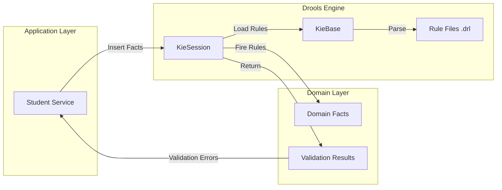
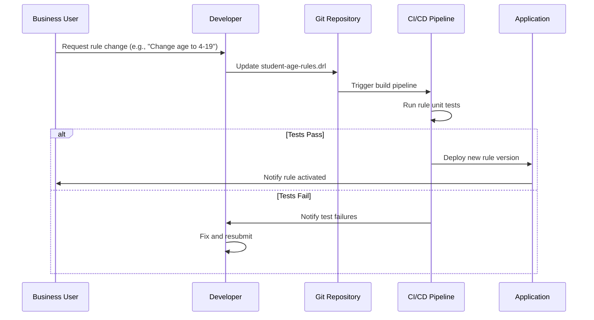

# Business Rules Strategy - School Management System

## 1. Overview

This document defines the architecture for implementing business rules using **Drools 9.44.0.Final**, a forward-chaining rule engine. Business rules are externalized from application code to enable non-technical stakeholders to modify validation logic without code changes.

### 1.1 Why Drools?

| Requirement | Drools Solution |
|-------------|----------------|
| Externalize business logic | Rules defined in `.drl` files, separate from Java code |
| Non-developer modifications | Decision tables (Excel/CSV) readable by business users |
| Complex validations | Pattern matching and inference engine |
| Rule versioning | Git-managed rule files with audit trail |
| Performance | RETE algorithm for efficient rule evaluation |

### 1.2 Business Rules Scope

**In-Scope Rules (Phase 1)**:
- BR-1: Student age validation (3-18 years)
- BR-2: Mobile number uniqueness validation
- BR-3: Class capacity constraints
- BR-4: Enrollment date validations
- BR-5: Required field combinations

**Out-of-Scope (Future Phases)**:
- Fee calculation rules
- Attendance policies
- Grade promotion criteria

## 2. Drools Architecture

### 2.1 Component Structure



### 2.2 Integration Pattern

```java
@Service
public class StudentService {

    private final KieContainer kieContainer;
    private final StudentRepository studentRepository;

    public StudentResponseDTO registerStudent(StudentRequestDTO dto) {
        // 1. Map DTO to Domain Model
        Student student = mapToDomain(dto);

        // 2. Create Drools Session
        KieSession kieSession = kieContainer.newKieSession("student-rules");

        // 3. Insert Facts
        ValidationResult validationResult = new ValidationResult();
        kieSession.insert(student);
        kieSession.insert(validationResult);
        kieSession.setGlobal("studentRepository", studentRepository);

        // 4. Fire Rules
        kieSession.fireAllRules();

        // 5. Check Results
        if (!validationResult.isValid()) {
            throw new ValidationException(validationResult.getErrors());
        }

        // 6. Persist if valid
        Student savedStudent = studentRepository.save(student);
        return mapToDTO(savedStudent);
    }
}
```

## 3. Rule Structure & Conventions

### 3.1 File Organization

```
backend/student-service/src/main/resources/
└── rules/
    ├── student/
    │   ├── student-validation-rules.drl      # Core validation rules
    │   ├── student-age-rules.drl             # Age-specific rules (BR-1)
    │   ├── student-uniqueness-rules.drl      # Uniqueness checks (BR-2)
    │   └── enrollment-capacity-rules.drl     # Capacity rules (BR-3)
    └── configuration/
        └── config-validation-rules.drl       # Configuration rules
```

### 3.2 Rule Naming Convention

**Pattern**: `<Domain>_<RuleType>_<BusinessRule>`

Examples:
- `Student_Validation_AgeRange`
- `Student_Uniqueness_Mobile`
- `Enrollment_Capacity_ClassFull`

### 3.3 Standard Rule Template

```drools
package com.school.student.rules;

import com.school.student.domain.Student;
import com.school.common.ValidationResult;
import java.time.LocalDate;
import java.time.Period;

global com.school.student.repository.StudentRepository studentRepository;

rule "Student_Validation_AgeRange"
    salience 100  // Higher priority rules execute first
    when
        $student : Student(
            $dob : dateOfBirth != null
        )
        eval(
            Period.between($dob, LocalDate.now()).getYears() < 3 ||
            Period.between($dob, LocalDate.now()).getYears() > 18
        )
        $result : ValidationResult()
    then
        $result.addError(
            "dateOfBirth",
            "Student age must be between 3 and 18 years",
            "AGE_OUT_OF_RANGE"
        );
end
```

## 4. Business Rule Implementations

### 4.1 BR-1: Student Age Validation (3-18 years)

**File**: `student-age-rules.drl`

```drools
package com.school.student.rules;

import com.school.student.domain.Student;
import com.school.common.ValidationResult;
import java.time.LocalDate;
import java.time.Period;

rule "Student_Validation_MinimumAge"
    salience 100
    when
        $student : Student($dob : dateOfBirth != null)
        eval(Period.between($dob, LocalDate.now()).getYears() < 3)
        $result : ValidationResult()
    then
        $result.addError(
            "dateOfBirth",
            "Student must be at least 3 years old",
            "AGE_TOO_YOUNG"
        );
end

rule "Student_Validation_MaximumAge"
    salience 100
    when
        $student : Student($dob : dateOfBirth != null)
        eval(Period.between($dob, LocalDate.now()).getYears() > 18)
        $result : ValidationResult()
    then
        $result.addError(
            "dateOfBirth",
            "Student cannot be older than 18 years",
            "AGE_TOO_OLD"
        );
end

rule "Student_Validation_FutureDate"
    salience 110  // Higher priority than age range
    when
        $student : Student($dob : dateOfBirth != null)
        eval($dob.isAfter(LocalDate.now()))
        $result : ValidationResult()
    then
        $result.addError(
            "dateOfBirth",
            "Date of birth cannot be in the future",
            "INVALID_DATE_OF_BIRTH"
        );
end
```

### 4.2 BR-2: Mobile Number Uniqueness

**File**: `student-uniqueness-rules.drl`

```drools
package com.school.student.rules;

import com.school.student.domain.Student;
import com.school.common.ValidationResult;
import com.school.student.repository.StudentRepository;

global StudentRepository studentRepository;

rule "Student_Uniqueness_MobileNumber"
    salience 90
    when
        $student : Student(
            $mobile : mobile != null,
            mobile matches "^\\d{10}$"
        )
        $result : ValidationResult()
        eval(
            studentRepository.existsByMobileAndIdNot($mobile, $student.getId())
        )
    then
        $result.addError(
            "mobile",
            "Mobile number " + $mobile + " is already registered",
            "DUPLICATE_MOBILE"
        );
end

rule "Student_Validation_MobileFormat"
    salience 95  // Higher priority than uniqueness check
    when
        $student : Student(
            mobile != null,
            !(mobile matches "^\\d{10}$")
        )
        $result : ValidationResult()
    then
        $result.addError(
            "mobile",
            "Mobile number must be exactly 10 digits",
            "INVALID_MOBILE_FORMAT"
        );
end
```

### 4.3 BR-3: Class Capacity Constraints

**File**: `enrollment-capacity-rules.drl`

```drools
package com.school.student.rules;

import com.school.student.domain.Enrollment;
import com.school.common.ValidationResult;
import com.school.student.repository.EnrollmentRepository;
import com.school.config.service.ConfigurationService;

global EnrollmentRepository enrollmentRepository;
global ConfigurationService configurationService;

rule "Enrollment_Capacity_ClassFull"
    salience 80
    when
        $enrollment : Enrollment(
            $academicYear : academicYear != null,
            $gradeClass : gradeClass != null,
            $section : section != null
        )
        $result : ValidationResult()
        eval(
            enrollmentRepository.countActiveEnrollments(
                $academicYear, $gradeClass, $section
            ) >= configurationService.getClassCapacity()
        )
    then
        $result.addError(
            "section",
            "Class " + $gradeClass + " Section " + $section + " is full",
            "CLASS_CAPACITY_EXCEEDED"
        );
end

rule "Enrollment_Uniqueness_AcademicYear"
    salience 85
    when
        $enrollment : Enrollment(
            $studentId : studentId != null,
            $academicYear : academicYear != null
        )
        $result : ValidationResult()
        eval(
            enrollmentRepository.existsByStudentIdAndAcademicYear(
                $studentId, $academicYear
            )
        )
    then
        $result.addError(
            "academicYear",
            "Student already enrolled in academic year " + $academicYear,
            "DUPLICATE_ENROLLMENT"
        );
end
```

### 4.4 BR-4: Enrollment Date Validations

```drools
rule "Enrollment_Validation_DateInPast"
    salience 90
    when
        $enrollment : Enrollment($enrollmentDate : enrollmentDate != null)
        eval($enrollmentDate.isAfter(LocalDate.now()))
        $result : ValidationResult()
    then
        $result.addError(
            "enrollmentDate",
            "Enrollment date cannot be in the future",
            "INVALID_ENROLLMENT_DATE"
        );
end

rule "Enrollment_Validation_WithdrawalDate"
    salience 90
    when
        $enrollment : Enrollment(
            $enrollmentDate : enrollmentDate != null,
            $withdrawalDate : withdrawalDate != null
        )
        eval($withdrawalDate.isBefore($enrollmentDate))
        $result : ValidationResult()
    then
        $result.addError(
            "withdrawalDate",
            "Withdrawal date cannot be before enrollment date",
            "INVALID_WITHDRAWAL_DATE"
        );
end
```

### 4.5 BR-5: Required Field Combinations

```drools
rule "Student_Validation_RequiredFields"
    salience 100
    when
        $student : Student(
            firstName == null || firstName.trim().isEmpty() ||
            lastName == null || lastName.trim().isEmpty() ||
            dateOfBirth == null ||
            mobile == null || mobile.trim().isEmpty()
        )
        $result : ValidationResult()
    then
        if ($student.getFirstName() == null || $student.getFirstName().trim().isEmpty()) {
            $result.addError("firstName", "First name is required", "REQUIRED_FIELD");
        }
        if ($student.getLastName() == null || $student.getLastName().trim().isEmpty()) {
            $result.addError("lastName", "Last name is required", "REQUIRED_FIELD");
        }
        if ($student.getDateOfBirth() == null) {
            $result.addError("dateOfBirth", "Date of birth is required", "REQUIRED_FIELD");
        }
        if ($student.getMobile() == null || $student.getMobile().trim().isEmpty()) {
            $result.addError("mobile", "Mobile number is required", "REQUIRED_FIELD");
        }
end

rule "Student_Validation_GuardianRequired"
    salience 95
    when
        $student : Student(
            (fathersName == null || fathersName.trim().isEmpty()) &&
            (mothersName == null || mothersName.trim().isEmpty())
        )
        $result : ValidationResult()
    then
        $result.addError(
            "fathersName",
            "At least one guardian name (Father or Mother) is required",
            "GUARDIAN_REQUIRED"
        );
end
```

## 5. Decision Tables (Business-Friendly Format)

### 5.1 Age Validation Decision Table

**File**: `student-age-decision-table.xls`

| Condition | Condition | Action | Action |
|-----------|-----------|--------|--------|
| Age < | Age > | Error Message | Error Code |
| 3 | - | "Student must be at least 3 years old" | AGE_TOO_YOUNG |
| - | 18 | "Student cannot be older than 18 years" | AGE_TOO_OLD |
| 0 | - | "Invalid date of birth" | INVALID_DATE_OF_BIRTH |

**Generated DRL** (Drools automatically converts):
```drools
rule "Row_1_student-age-decision-table"
    when
        $student : Student(age < 3)
        $result : ValidationResult()
    then
        $result.addError("dateOfBirth", "Student must be at least 3 years old", "AGE_TOO_YOUNG");
end
```

### 5.2 Configuring Decision Table

```java
@Configuration
public class DroolsConfig {

    @Bean
    public KieContainer kieContainer() {
        KieServices kieServices = KieServices.Factory.get();

        // Load .drl files
        KieFileSystem kieFileSystem = kieServices.newKieFileSystem();
        kieFileSystem.write(ResourceFactory.newClassPathResource("rules/student/student-age-rules.drl"));

        // Load decision table (Excel)
        Resource resource = ResourceFactory.newClassPathResource("rules/student/student-age-decision-table.xls");
        kieFileSystem.write(resource);

        KieBuilder kieBuilder = kieServices.newKieBuilder(kieFileSystem);
        kieBuilder.buildAll();

        return kieServices.newKieContainer(kieBuilder.getKieModule().getReleaseId());
    }
}
```

## 6. Rule Testing Strategy

### 6.1 Unit Testing Rules

```java
@SpringBootTest
@Testcontainers
class StudentAgeRulesTest {

    @Autowired
    private KieContainer kieContainer;

    @Mock
    private StudentRepository studentRepository;

    @Test
    @DisplayName("Should reject student under 3 years old")
    void shouldRejectUnderage() {
        // Arrange
        Student student = Student.builder()
            .firstName("John")
            .lastName("Doe")
            .dateOfBirth(LocalDate.now().minusYears(2))
            .mobile("9876543210")
            .build();

        ValidationResult result = new ValidationResult();
        KieSession kieSession = kieContainer.newKieSession("student-rules");
        kieSession.insert(student);
        kieSession.insert(result);

        // Act
        kieSession.fireAllRules();

        // Assert
        assertThat(result.isValid()).isFalse();
        assertThat(result.getErrors())
            .anyMatch(error ->
                error.getField().equals("dateOfBirth") &&
                error.getCode().equals("AGE_TOO_YOUNG")
            );
    }

    @Test
    @DisplayName("Should accept student within valid age range")
    void shouldAcceptValidAge() {
        // Arrange
        Student student = Student.builder()
            .dateOfBirth(LocalDate.now().minusYears(10))
            .mobile("9876543210")
            .firstName("Jane")
            .lastName("Smith")
            .build();

        ValidationResult result = new ValidationResult();
        KieSession kieSession = kieContainer.newKieSession("student-rules");
        kieSession.insert(student);
        kieSession.insert(result);

        // Act
        kieSession.fireAllRules();

        // Assert
        assertThat(result.isValid()).isTrue();
    }
}
```

### 6.2 Integration Testing with Repository

```java
@SpringBootTest
@Testcontainers
class StudentUniquenessRulesIntegrationTest {

    @Autowired
    private KieContainer kieContainer;

    @Autowired
    private StudentRepository studentRepository;

    @Test
    @DisplayName("Should detect duplicate mobile number")
    void shouldRejectDuplicateMobile() {
        // Arrange - Save existing student
        Student existingStudent = Student.builder()
            .firstName("Existing")
            .lastName("Student")
            .dateOfBirth(LocalDate.now().minusYears(10))
            .mobile("9876543210")
            .build();
        studentRepository.save(existingStudent);

        // New student with same mobile
        Student newStudent = Student.builder()
            .firstName("New")
            .lastName("Student")
            .dateOfBirth(LocalDate.now().minusYears(8))
            .mobile("9876543210")  // Duplicate
            .build();

        ValidationResult result = new ValidationResult();
        KieSession kieSession = kieContainer.newKieSession("student-rules");
        kieSession.setGlobal("studentRepository", studentRepository);
        kieSession.insert(newStudent);
        kieSession.insert(result);

        // Act
        kieSession.fireAllRules();

        // Assert
        assertThat(result.isValid()).isFalse();
        assertThat(result.getErrors())
            .anyMatch(error -> error.getCode().equals("DUPLICATE_MOBILE"));
    }
}
```

## 7. Validation Result Model

### 7.1 ValidationResult Class

```java
package com.school.common;

import lombok.Data;
import java.util.ArrayList;
import java.util.List;

@Data
public class ValidationResult {

    private List<ValidationError> errors = new ArrayList<>();

    public void addError(String field, String message, String code) {
        errors.add(new ValidationError(field, message, code));
    }

    public boolean isValid() {
        return errors.isEmpty();
    }

    public List<String> getErrorMessages() {
        return errors.stream()
            .map(ValidationError::getMessage)
            .toList();
    }
}

@Data
@AllArgsConstructor
@NoArgsConstructor
class ValidationError {
    private String field;
    private String message;
    private String code;
}
```

### 7.2 Exception Mapping

```java
@ControllerAdvice
public class ValidationExceptionHandler {

    @ExceptionHandler(ValidationException.class)
    public ResponseEntity<ErrorResponse> handleValidationException(
        ValidationException ex,
        WebRequest request
    ) {
        ErrorResponse errorResponse = ErrorResponse.builder()
            .type("https://api.school.com/errors/validation-error")
            .title("Validation Failed")
            .status(HttpStatus.BAD_REQUEST.value())
            .detail("One or more validation rules failed")
            .timestamp(LocalDateTime.now())
            .correlationId(MDC.get("correlationId"))
            .errors(ex.getValidationResult().getErrors())
            .build();

        return ResponseEntity
            .status(HttpStatus.BAD_REQUEST)
            .body(errorResponse);
    }
}
```

## 8. Rule Salience Strategy

**Salience** determines rule execution order (higher values execute first).

| Salience Range | Purpose | Example Rules |
|---------------|---------|---------------|
| 100-110 | Critical pre-validations | Date format, null checks |
| 90-99 | Field-level validations | Age range, mobile format |
| 80-89 | Cross-field validations | Class capacity, uniqueness |
| 70-79 | Business logic rules | Fee calculation, promotions |
| 60-69 | Informational rules | Warnings, suggestions |

**Example**:
```drools
rule "Check_Null_DateOfBirth"
    salience 110  // Execute before age validation
    when
        $student : Student(dateOfBirth == null)
        $result : ValidationResult()
    then
        $result.addError("dateOfBirth", "Date of birth is required", "REQUIRED_FIELD");
end

rule "Validate_Age_Range"
    salience 100  // Execute after null check
    when
        $student : Student(dateOfBirth != null, ...)
        $result : ValidationResult()
    then
        // Age validation logic
end
```

## 9. Rule Versioning & Audit

### 9.1 Version Control

**Git Strategy**:
```
rules/
├── v1.0/
│   └── student-validation-rules.drl  (Initial release)
├── v1.1/
│   └── student-validation-rules.drl  (Added guardian validation)
└── current/
    └── student-validation-rules.drl  (Symlink to latest)
```

### 9.2 Rule Audit Logging

```java
@Component
public class RuleAuditListener extends DefaultAgendaEventListener {

    private static final Logger logger = LoggerFactory.getLogger(RuleAuditListener.class);

    @Override
    public void afterMatchFired(AfterMatchFiredEvent event) {
        String ruleName = event.getMatch().getRule().getName();
        logger.info("Rule fired: {} | Facts: {} | Correlation ID: {}",
            ruleName,
            event.getMatch().getObjects(),
            MDC.get("correlationId")
        );
    }
}

// Attach listener to session
kieSession.addEventListener(new RuleAuditListener());
```

## 10. Performance Optimization

### 10.1 Rule Engine Tuning

```java
@Bean
public KieBase kieBase(KieContainer kieContainer) {
    KieBaseConfiguration config = KieServices.Factory.get().newKieBaseConfiguration();

    // Performance settings
    config.setOption(EventProcessingOption.CLOUD);  // Stateless processing
    config.setOption(EqualityBehaviorOption.EQUALITY);

    return kieContainer.getKieBase();
}

@Bean
public KieSession kieSession(KieBase kieBase) {
    KieSessionConfiguration config = KieServices.Factory.get().newKieSessionConfiguration();

    // Thread-safe stateless session
    return kieBase.newStatelessKieSession();
}
```

### 10.2 Caching Compiled Rules

```java
@Configuration
@EnableCaching
public class DroolsCacheConfig {

    @Bean
    @Cacheable(value = "droolsKieContainer", unless = "#result == null")
    public KieContainer cachedKieContainer() {
        // Expensive KieContainer initialization
        return buildKieContainer();
    }
}
```

## 11. Business User Workflow

### 11.1 Rule Modification Process



### 11.2 Decision Table Editing (Business-Friendly)

**Tool**: Excel or Google Sheets

**Template**: `student-age-decision-table.xls`

| Rule Name | Age Min | Age Max | Error Message | Error Code |
|-----------|---------|---------|---------------|------------|
| Min Age Rule | 3 | - | "Student must be at least 3 years old" | AGE_TOO_YOUNG |
| Max Age Rule | - | 18 | "Student cannot be older than 18 years" | AGE_TOO_OLD |

**Modification Example**:
1. Business user opens Excel file
2. Changes "3" to "4" in Min Age Rule
3. Submits file to developer
4. Developer imports updated table and deploys

## 12. Error Code Reference

| Error Code | Business Rule | Severity | Recommended Action |
|------------|--------------|----------|-------------------|
| `AGE_TOO_YOUNG` | BR-1 | ERROR | Reject registration |
| `AGE_TOO_OLD` | BR-1 | ERROR | Reject registration |
| `DUPLICATE_MOBILE` | BR-2 | ERROR | Reject registration |
| `INVALID_MOBILE_FORMAT` | BR-2 | ERROR | Fix mobile format |
| `CLASS_CAPACITY_EXCEEDED` | BR-3 | ERROR | Suggest alternate section |
| `DUPLICATE_ENROLLMENT` | BR-3 | ERROR | Reject enrollment |
| `GUARDIAN_REQUIRED` | BR-5 | ERROR | Require guardian name |
| `INVALID_DATE_OF_BIRTH` | BR-1 | ERROR | Fix date format |
| `INVALID_ENROLLMENT_DATE` | BR-4 | ERROR | Fix enrollment date |

---

**Document Version**: 1.0
**Last Updated**: 2026-02-03
**Owner**: Architect Agent
**Review Cycle**: Quarterly
