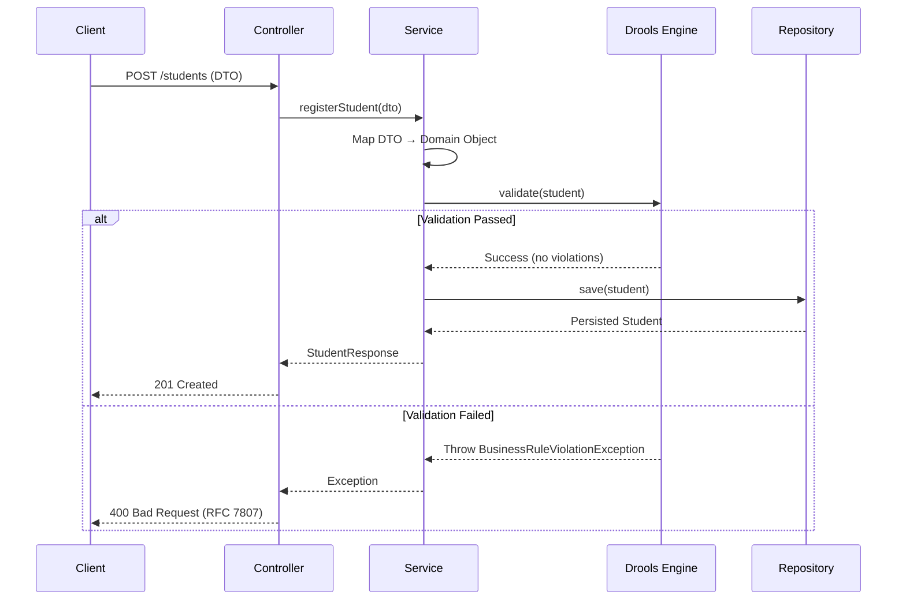

# Business Rules Strategy
**School Management System (SMS) - Drools Implementation**
Version: 1.0.0
Last Updated: 2026-01-28

---

## 1. Overview

This document defines the implementation strategy for externalizing business rules using **Drools 9.44.0.Final**. By decoupling validation logic from application code, we achieve maintainability, auditability, and non-technical stakeholder comprehension.

### 1.1 Why Drools?

**Benefits**:
- **Separation of Concerns**: Business rules live outside Java code
- **Declarative Syntax**: Rules written in human-readable format
- **Change Velocity**: Modify rules without recompiling application
- **Audit Trail**: Track rule changes via version control
- **Complex Logic**: Handle multi-condition scenarios efficiently

**Constraints**:
- Rules are **stateless** (no session persistence between requests)
- Rules execute **synchronously** during request processing
- Rule failures throw **domain exceptions** (not HTTP responses)

---

## 2. Rule Categories

### 2.1 Student Validation Rules

| Rule ID | Description | Drools File | Priority |
|---------|-------------|-------------|----------|
| **BR-1** | Age between 3-18 years | `student-age-validation.drl` | HIGH |
| **BR-2** | Mobile number uniqueness | `student-mobile-uniqueness.drl` | HIGH |
| **BR-3** | Aadhaar format validation | `student-aadhaar-validation.drl` | MEDIUM |
| **BR-4** | Email format validation | `student-email-validation.drl` | MEDIUM |
| **BR-5** | Name character constraints | `student-name-validation.drl` | LOW |
| **BR-6** | Edit restrictions (immutable fields) | `student-edit-validation.drl` | HIGH |

### 2.2 Enrollment Rules

| Rule ID | Description | Drools File | Priority |
|---------|-------------|-------------|----------|
| **BR-7** | One active enrollment per year | `enrollment-uniqueness.drl` | HIGH |
| **BR-8** | Withdrawal date after enrollment | `enrollment-date-validation.drl` | MEDIUM |
| **BR-9** | Class capacity limits (future) | `enrollment-capacity.drl` | LOW |

### 2.3 Configuration Rules

| Rule ID | Description | Drools File | Priority |
|---------|-------------|-------------|----------|
| **BR-10** | Category enumeration validation | `config-category-validation.drl` | HIGH |
| **BR-11** | Data type consistency | `config-datatype-validation.drl` | MEDIUM |

---

## 3. Drools Integration Architecture

### 3.1 Component Interaction



### 3.2 Directory Structure

```
student-service/
├── src/main/resources/
│   └── rules/
│       ├── student/
│       │   ├── student-age-validation.drl
│       │   ├── student-mobile-uniqueness.drl
│       │   ├── student-edit-validation.drl
│       │   └── student-name-validation.drl
│       └── enrollment/
│           ├── enrollment-uniqueness.drl
│           └── enrollment-date-validation.drl
└── src/main/java/com/school/student/
    └── rules/
        ├── DroolsConfig.java
        ├── RuleExecutor.java
        └── ValidationResult.java
```

---

## 4. Drools Configuration

### 4.1 Spring Boot Setup

**Maven Dependency**:
```xml
<dependency>
    <groupId>org.drools</groupId>
    <artifactId>drools-core</artifactId>
    <version>9.44.0.Final</version>
</dependency>
<dependency>
    <groupId>org.drools</groupId>
    <artifactId>drools-compiler</artifactId>
    <version>9.44.0.Final</version>
</dependency>
<dependency>
    <groupId>org.kie</groupId>
    <artifactId>kie-spring</artifactId>
    <version>9.44.0.Final</version>
</dependency>
```

**Configuration Class**:
```java
package com.school.student.rules;

import org.kie.api.KieServices;
import org.kie.api.builder.KieBuilder;
import org.kie.api.builder.KieFileSystem;
import org.kie.api.builder.KieModule;
import org.kie.api.runtime.KieContainer;
import org.springframework.context.annotation.Bean;
import org.springframework.context.annotation.Configuration;

@Configuration
public class DroolsConfig {

    private static final String RULES_PATH = "rules/";

    @Bean
    public KieContainer kieContainer() {
        KieServices kieServices = KieServices.Factory.get();
        KieFileSystem kieFileSystem = kieServices.newKieFileSystem();

        // Load all .drl files from classpath
        kieFileSystem.write(kieServices.getResources()
            .newClassPathResource(RULES_PATH + "student/student-age-validation.drl"));
        kieFileSystem.write(kieServices.getResources()
            .newClassPathResource(RULES_PATH + "student/student-mobile-uniqueness.drl"));
        // ... load other rule files

        KieBuilder kieBuilder = kieServices.newKieBuilder(kieFileSystem);
        kieBuilder.buildAll();

        KieModule kieModule = kieBuilder.getKieModule();
        return kieServices.newKieContainer(kieModule.getReleaseId());
    }
}
```

### 4.2 Rule Executor Service

```java
package com.school.student.rules;

import org.kie.api.runtime.KieContainer;
import org.kie.api.runtime.KieSession;
import org.springframework.stereotype.Service;
import lombok.RequiredArgsConstructor;

import java.util.ArrayList;
import java.util.List;

@Service
@RequiredArgsConstructor
public class RuleExecutor {

    private final KieContainer kieContainer;

    public ValidationResult validate(Object fact) {
        KieSession kieSession = kieContainer.newKieSession();
        ValidationResult result = new ValidationResult();

        try {
            kieSession.setGlobal("validationResult", result);
            kieSession.insert(fact);
            kieSession.fireAllRules();
            return result;
        } finally {
            kieSession.dispose();
        }
    }
}
```

**ValidationResult Class**:
```java
package com.school.student.rules;

import lombok.Getter;
import java.util.ArrayList;
import java.util.List;

@Getter
public class ValidationResult {
    private final List<String> errors = new ArrayList<>();
    private boolean valid = true;

    public void addError(String error) {
        this.errors.add(error);
        this.valid = false;
    }
}
```

---

## 5. Rule Definitions

### 5.1 BR-1: Student Age Validation

**File**: `src/main/resources/rules/student/student-age-validation.drl`

```drools
package com.school.student.rules;

import com.school.student.domain.Student;
import com.school.student.rules.ValidationResult;
import java.time.LocalDate;
import java.time.Period;

global ValidationResult validationResult;

rule "Student age must be between 3 and 18 years"
    when
        $student : Student(
            dateOfBirth != null,
            calculateAge(dateOfBirth) < 3 || calculateAge(dateOfBirth) > 18
        )
    then
        validationResult.addError(
            String.format("Student age (%d years) must be between 3 and 18 years",
                calculateAge($student.getDateOfBirth()))
        );
end

function int calculateAge(LocalDate birthDate) {
    return Period.between(birthDate, LocalDate.now()).getYears();
}
```

**Integration in Service**:
```java
@Service
@Transactional
public class StudentService {

    private final RuleExecutor ruleExecutor;
    private final StudentRepository studentRepository;

    public StudentResponse registerStudent(StudentRequest request) {
        Student student = mapToEntity(request);

        // Execute Drools validation
        ValidationResult validationResult = ruleExecutor.validate(student);
        if (!validationResult.isValid()) {
            throw new BusinessRuleViolationException(validationResult.getErrors());
        }

        student.setStudentId(generateStudentId());
        Student savedStudent = studentRepository.save(student);
        return mapToResponse(savedStudent);
    }
}
```

---

### 5.2 BR-2: Mobile Number Uniqueness

**File**: `src/main/resources/rules/student/student-mobile-uniqueness.drl`

```drools
package com.school.student.rules;

import com.school.student.domain.Student;
import com.school.student.rules.ValidationResult;

global ValidationResult validationResult;

rule "Mobile number must be unique"
    when
        $student : Student(mobile != null)
        exists(
            Student(mobile == $student.mobile, id != $student.id)
        )
    then
        validationResult.addError(
            "Mobile number " + $student.getMobile() + " is already registered"
        );
end
```

**Note**: This rule requires querying the repository. Alternative approach using service-layer check:

```java
public StudentResponse registerStudent(StudentRequest request) {
    // Pre-validation query
    if (studentRepository.existsByMobile(request.getMobile())) {
        throw new DuplicateMobileException(request.getMobile());
    }

    Student student = mapToEntity(request);
    ValidationResult validationResult = ruleExecutor.validate(student);
    // ... rest of logic
}
```

---

### 5.3 BR-6: Edit Restrictions (Immutable Fields)

**File**: `src/main/resources/rules/student/student-edit-validation.drl`

```drools
package com.school.student.rules;

import com.school.student.domain.Student;
import com.school.student.domain.StudentUpdateContext;
import com.school.student.rules.ValidationResult;

global ValidationResult validationResult;

rule "Date of Birth cannot be modified after registration"
    when
        $context : StudentUpdateContext(
            existingStudent.dateOfBirth != updatedStudent.dateOfBirth
        )
    then
        validationResult.addError("Date of Birth cannot be modified after registration");
end

rule "Aadhaar Number cannot be modified after registration"
    when
        $context : StudentUpdateContext(
            existingStudent.aadhaarNumber != null,
            existingStudent.aadhaarNumber != updatedStudent.aadhaarNumber
        )
    then
        validationResult.addError("Aadhaar Number cannot be modified");
end

rule "Student ID cannot be modified"
    when
        $context : StudentUpdateContext(
            existingStudent.studentId != updatedStudent.studentId
        )
    then
        validationResult.addError("Student ID is immutable");
end
```

**StudentUpdateContext Class**:
```java
@Getter
@AllArgsConstructor
public class StudentUpdateContext {
    private final Student existingStudent;
    private final Student updatedStudent;
}
```

**Service Integration**:
```java
public StudentResponse updateStudent(String studentId, StudentUpdateRequest request) {
    Student existingStudent = studentRepository.findByStudentId(studentId)
        .orElseThrow(() -> new StudentNotFoundException(studentId));

    Student updatedStudent = mapToEntity(request);
    updatedStudent.setId(existingStudent.getId()); // Preserve ID

    // Validate edit restrictions
    StudentUpdateContext context = new StudentUpdateContext(existingStudent, updatedStudent);
    ValidationResult validationResult = ruleExecutor.validate(context);

    if (!validationResult.isValid()) {
        throw new BusinessRuleViolationException(validationResult.getErrors());
    }

    // Apply allowed updates
    existingStudent.setFirstName(request.getFirstName());
    existingStudent.setLastName(request.getLastName());
    existingStudent.setMobile(request.getMobile());
    existingStudent.setStatus(request.getStatus());

    return mapToResponse(studentRepository.save(existingStudent));
}
```

---

### 5.4 BR-7: Enrollment Uniqueness

**File**: `src/main/resources/rules/enrollment/enrollment-uniqueness.drl`

```drools
package com.school.enrollment.rules;

import com.school.student.domain.Enrollment;
import com.school.student.rules.ValidationResult;

global ValidationResult validationResult;

rule "Student can have only one active enrollment per academic year"
    when
        $enrollment : Enrollment(status == "ACTIVE")
        exists(
            Enrollment(
                studentId == $enrollment.studentId,
                academicYear == $enrollment.academicYear,
                status == "ACTIVE",
                id != $enrollment.id
            )
        )
    then
        validationResult.addError(
            "Student already has an active enrollment for academic year " +
            $enrollment.getAcademicYear()
        );
end
```

---

## 6. Decision Tables (Alternative Approach)

For complex multi-condition rules, Drools Decision Tables (Excel-based) provide a tabular format.

**Example: Fee Calculation Based on Grade**

| Condition | Condition | Action |
|-----------|-----------|--------|
| Grade Class | Section | Tuition Fee |
| "Grade-1" to "Grade-5" | * | 20000 |
| "Grade-6" to "Grade-10" | * | 25000 |
| "Grade-11" to "Grade-12" | "Science" | 35000 |
| "Grade-11" to "Grade-12" | "Commerce" | 30000 |

**Generated DRL** (simplified):
```drools
rule "Fee Calculation Row 1"
    when
        $enrollment : Enrollment(gradeClass matches "Grade-[1-5]")
    then
        $enrollment.setTuitionFee(20000);
end

rule "Fee Calculation Row 2"
    when
        $enrollment : Enrollment(gradeClass matches "Grade-(6|7|8|9|10)")
    then
        $enrollment.setTuitionFee(25000);
end
```

---

## 7. Testing Strategy

### 7.1 Unit Testing Drools Rules

**Test Class**:
```java
@SpringBootTest
class StudentAgeValidationRuleTest {

    @Autowired
    private RuleExecutor ruleExecutor;

    @Test
    @DisplayName("Should reject student younger than 3 years")
    void shouldRejectUnderage() {
        // Given
        Student student = Student.builder()
            .firstName("John")
            .lastName("Doe")
            .dateOfBirth(LocalDate.now().minusYears(2))
            .mobile("9876543210")
            .build();

        // When
        ValidationResult result = ruleExecutor.validate(student);

        // Then
        assertThat(result.isValid()).isFalse();
        assertThat(result.getErrors())
            .containsExactly("Student age (2 years) must be between 3 and 18 years");
    }

    @Test
    @DisplayName("Should accept student within valid age range")
    void shouldAcceptValidAge() {
        // Given
        Student student = Student.builder()
            .firstName("Jane")
            .lastName("Smith")
            .dateOfBirth(LocalDate.now().minusYears(10))
            .mobile("9876543211")
            .build();

        // When
        ValidationResult result = ruleExecutor.validate(student);

        // Then
        assertThat(result.isValid()).isTrue();
        assertThat(result.getErrors()).isEmpty();
    }
}
```

### 7.2 Integration Testing

```java
@SpringBootTest
@Transactional
class StudentServiceIntegrationTest {

    @Autowired
    private StudentService studentService;

    @Test
    @DisplayName("Should reject registration due to age validation rule")
    void shouldRejectInvalidAge() {
        // Given
        StudentRequest request = StudentRequest.builder()
            .firstName("Invalid")
            .lastName("Student")
            .dateOfBirth(LocalDate.now().minusYears(1))
            .mobile("9999999999")
            .build();

        // When & Then
        assertThatThrownBy(() -> studentService.registerStudent(request))
            .isInstanceOf(BusinessRuleViolationException.class)
            .hasMessageContaining("must be between 3 and 18 years");
    }
}
```

---

## 8. Rule Lifecycle Management

### 8.1 Version Control

**Git Strategy**:
```
rules/
├── student/
│   ├── v1/
│   │   └── student-age-validation.drl
│   └── v2/
│       └── student-age-validation.drl
```

**Deployment Process**:
1. Modify `.drl` file in version control
2. Update Maven resource path to new version
3. Run integration tests
4. Deploy updated JAR

### 8.2 Hot Reload (Advanced)

For production environments requiring rule updates without redeployment:

```java
@Service
public class DynamicRuleLoader {

    private KieContainer kieContainer;

    @Scheduled(fixedRate = 60000) // Check every 60 seconds
    public void reloadRules() {
        // Load rules from external source (database, file system)
        // Rebuild KieContainer
        // Atomic swap
    }
}
```

---

## 9. Performance Considerations

### 9.1 Rule Optimization

**Best Practices**:
- **Minimize Rule Complexity**: Keep conditions simple
- **Index Facts**: Use salience for rule priority
- **Session Management**: Always dispose sessions
- **Avoid Infinite Loops**: Ensure rules don't re-trigger themselves

**Example with Salience**:
```drools
rule "High Priority Age Validation"
    salience 100  // Executes before lower salience rules
    when
        $student : Student(dateOfBirth == null)
    then
        validationResult.addError("Date of Birth is required");
end

rule "Secondary Name Validation"
    salience 50
    when
        $student : Student(firstName.length() < 2)
    then
        validationResult.addError("First Name must be at least 2 characters");
end
```

### 9.2 Benchmarking

**Expected Performance**:
- Simple rule evaluation: <5ms
- Complex multi-rule validation: <20ms
- Target: Rule execution overhead <10% of total request time

**Monitoring**:
```java
@Aspect
@Component
public class RuleExecutionMonitor {

    @Around("execution(* com.school.student.rules.RuleExecutor.validate(..))")
    public Object monitorRuleExecution(ProceedingJoinPoint joinPoint) throws Throwable {
        long startTime = System.currentTimeMillis();
        Object result = joinPoint.proceed();
        long executionTime = System.currentTimeMillis() - startTime;

        log.info("Drools rule execution completed in {}ms", executionTime);
        return result;
    }
}
```

---

## 10. Error Handling & User Feedback

### 10.1 Exception Mapping

```java
@ControllerAdvice
public class GlobalExceptionHandler {

    @ExceptionHandler(BusinessRuleViolationException.class)
    public ResponseEntity<ProblemDetail> handleBusinessRuleViolation(
        BusinessRuleViolationException ex
    ) {
        ProblemDetail problemDetail = ProblemDetail.forStatusAndDetail(
            HttpStatus.BAD_REQUEST,
            "Business rule validation failed"
        );
        problemDetail.setProperty("errors", ex.getErrors());
        problemDetail.setProperty("timestamp", Instant.now());

        return ResponseEntity.badRequest().body(problemDetail);
    }
}
```

### 10.2 Frontend Error Display

**API Response**:
```json
{
  "type": "https://api.school.com/errors/business-rule-violation",
  "title": "Business Rule Validation Failed",
  "status": 400,
  "detail": "One or more business rules were violated",
  "errors": [
    "Student age (2 years) must be between 3 and 18 years",
    "Mobile number 9876543210 is already registered"
  ],
  "timestamp": "2026-01-28T10:30:00Z"
}
```

**React Component**:
```typescript
// Display rule violations in form
{errors?.map((error, index) => (
  <Alert key={index} variant="destructive">
    <AlertCircle className="h-4 w-4" />
    <AlertDescription>{error}</AlertDescription>
  </Alert>
))}
```

---

## 11. Rule Documentation

### 11.1 Inline Comments

```drools
/**
 * Rule: BR-1 Student Age Validation
 * Purpose: Ensures all registered students are within the acceptable age range
 * Business Owner: Academic Affairs Department
 * Last Modified: 2026-01-28
 * Change Log:
 *   - 2026-01-15: Initial implementation
 *   - 2026-01-28: Added detailed error messages
 */
rule "Student age must be between 3 and 18 years"
```

### 11.2 Rule Catalog

| Rule ID | Business Owner | Last Modified | Status | SLA Impact |
|---------|---------------|---------------|--------|------------|
| BR-1 | Academic Affairs | 2026-01-28 | Active | High |
| BR-2 | IT Administration | 2026-01-20 | Active | High |
| BR-6 | Legal Compliance | 2026-01-15 | Active | Medium |

---

## 12. Future Enhancements

### 12.1 Complex Event Processing (CEP)

Monitor enrollment trends in real-time:
```drools
rule "Alert when enrollment spike detected"
    when
        Number($count : intValue) from accumulate(
            $e : Enrollment(enrollmentDate == today()),
            count($e)
        )
        eval($count > 50) // Threshold
    then
        sendAlert("Unusual enrollment spike detected: " + $count + " today");
end
```

### 12.2 Machine Learning Integration

Combine Drools with ML models for predictive rules:
- Dropout risk assessment
- Fee payment default prediction
- Class placement recommendations

---

## Appendix A: Complete Rule File Example

**student-registration-rules.drl**:
```drools
package com.school.student.rules;

import com.school.student.domain.Student;
import com.school.student.rules.ValidationResult;
import java.time.LocalDate;
import java.time.Period;

global ValidationResult validationResult;

rule "Mandatory Fields Check"
    salience 200
    when
        $student : Student(
            firstName == null || lastName == null ||
            dateOfBirth == null || mobile == null
        )
    then
        validationResult.addError("First Name, Last Name, Date of Birth, and Mobile are required");
end

rule "Student Age Validation"
    salience 150
    when
        $student : Student(
            dateOfBirth != null,
            calculateAge(dateOfBirth) < 3 || calculateAge(dateOfBirth) > 18
        )
    then
        validationResult.addError(
            String.format("Student age (%d years) must be between 3 and 18 years",
                calculateAge($student.getDateOfBirth()))
        );
end

rule "Mobile Format Validation"
    salience 100
    when
        $student : Student(
            mobile != null,
            mobile.length() != 10 || !mobile.matches("\\d{10}")
        )
    then
        validationResult.addError("Mobile number must be exactly 10 digits");
end

rule "Email Format Validation"
    salience 90
    when
        $student : Student(
            email != null,
            !email.matches("^[A-Za-z0-9+_.-]+@[A-Za-z0-9.-]+\\.[A-Za-z]{2,}$")
        )
    then
        validationResult.addError("Invalid email format");
end

rule "Name Character Validation"
    salience 80
    when
        $student : Student(
            firstName != null,
            !firstName.matches("^[a-zA-Z\\s]+$") ||
            !lastName.matches("^[a-zA-Z\\s]+$")
        )
    then
        validationResult.addError("Names must contain only alphabetic characters and spaces");
end

function int calculateAge(LocalDate birthDate) {
    return Period.between(birthDate, LocalDate.now()).getYears();
}
```

---

**Document Status**: Final
**Next Review**: 2026-04-28
