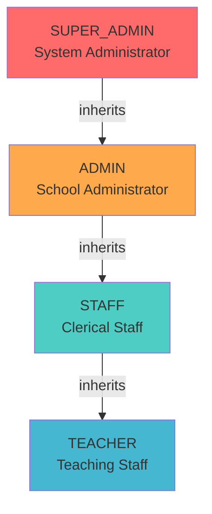
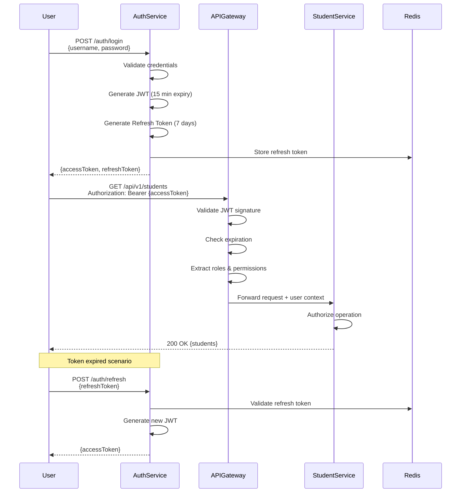

# Security Architecture - School Management System

## 1. Overview

This document outlines the security architecture for the School Management System. While Phase 1 excludes authentication implementation (handled externally), this design provides the complete security blueprint for Phase 2+ implementation and establishes security best practices for the current phase.

## 2. Security Scope

### 2.1 Phase 1 (Current)

**In Scope:**
- Input validation (backend and frontend)
- SQL injection prevention
- XSS protection strategies
- CORS configuration
- Audit logging framework
- Secure data handling
- RBAC design (documented, not implemented)

**Out of Scope (External System):**
- User authentication
- JWT token generation/validation
- Session management
- Password management

### 2.2 Phase 2+ (Future)

- JWT-based authentication
- Role-based access control (RBAC) implementation
- Token refresh mechanism
- Multi-factor authentication (MFA)
- Single Sign-On (SSO) integration

## 3. Role-Based Access Control (RBAC) Design

### 3.1 Role Hierarchy



**Role Definitions:**

| Role | Description | Typical Users |
|------|-------------|---------------|
| **SUPER_ADMIN** | System-wide privileges, configuration management | IT administrators, System managers |
| **ADMIN** | School administration, full student management | Principal, Vice Principal |
| **STAFF** | Day-to-day operations, limited student management | Clerical staff, Administrative assistants |
| **TEACHER** | Read-only access to student information | Teachers (Phase 2+) |

### 3.2 Permission Matrix

#### 3.2.1 Student Management Permissions

| Operation | Endpoint | SUPER_ADMIN | ADMIN | STAFF | TEACHER |
|-----------|----------|-------------|-------|-------|---------|
| Create Student | POST /api/v1/students | ✅ | ✅ | ✅ | ❌ |
| View Student Details | GET /api/v1/students/{id} | ✅ | ✅ | ✅ | ✅ |
| Search Students | GET /api/v1/students | ✅ | ✅ | ✅ | ✅ |
| Update Student (editable fields) | PUT /api/v1/students/{id} | ✅ | ✅ | ✅ | ❌ |
| Update Student Status | PATCH /api/v1/students/{id}/status | ✅ | ✅ | ⚠️ (Active→Inactive only) | ❌ |
| Delete Student (soft delete) | DELETE /api/v1/students/{id} | ✅ | ✅ | ❌ | ❌ |

**Legend:**
- ✅ Full access
- ⚠️ Limited access (restrictions apply)
- ❌ No access

#### 3.2.2 Configuration Management Permissions

| Operation | Endpoint | SUPER_ADMIN | ADMIN | STAFF | TEACHER |
|-----------|----------|-------------|-------|-------|---------|
| Create Configuration | POST /api/v1/configurations | ✅ | ✅ | ❌ | ❌ |
| View Configurations | GET /api/v1/configurations | ✅ | ✅ | ✅ (General only) | ✅ (General only) |
| View by Category | GET /api/v1/configurations/category/{category} | ✅ | ✅ | ⚠️ (Non-Financial) | ⚠️ (Non-Financial) |
| Update Configuration | PUT /api/v1/configurations/{id} | ✅ | ✅ | ❌ | ❌ |
| Delete Configuration | DELETE /api/v1/configurations/{id} | ✅ | ⚠️ (Non-System) | ❌ | ❌ |

### 3.3 Fine-Grained Permissions

**Attribute-Based Access Control (ABAC) - Future Enhancement:**

```java
// Example: Staff can only update status to Inactive, not Graduated/Transferred
@PreAuthorize("hasRole('STAFF') and #request.status == 'Inactive' or hasRole('ADMIN')")
public StudentResponse updateStatus(Long id, UpdateStatusRequest request);
```

## 4. Authentication Design (Phase 2)

### 4.1 JWT Token Structure

**Token Format:**
```
Header.Payload.Signature
```

**Header:**
```json
{
  "alg": "RS256",
  "typ": "JWT"
}
```

**Payload:**
```json
{
  "sub": "user@example.com",
  "userId": 123,
  "username": "john.doe",
  "roles": ["ADMIN", "STAFF"],
  "permissions": ["student:create", "student:read", "student:update"],
  "schoolId": 1,
  "iat": 1610724000,
  "exp": 1610810400,
  "iss": "https://auth.sms.example.com",
  "aud": "sms-api"
}
```

**Signature:**
```
RS256(
  base64UrlEncode(header) + "." + base64UrlEncode(payload),
  privateKey
)
```

### 4.2 Token Lifecycle



### 4.3 Token Storage (Frontend)

**Recommended Approach:**
```typescript
// Store access token in memory (React state/context)
const [accessToken, setAccessToken] = useState<string | null>(null);

// Store refresh token in httpOnly cookie (set by backend)
// Cookies: refreshToken=<token>; HttpOnly; Secure; SameSite=Strict; Max-Age=604800
```

**Security Rationale:**
- Access token in memory: Prevents XSS attacks (cleared on page reload)
- Refresh token in httpOnly cookie: Prevents XSS, allows automatic refresh
- Never store tokens in localStorage (XSS vulnerable)

### 4.4 Token Refresh Strategy

**Silent Token Refresh:**
```typescript
// Axios interceptor for automatic token refresh
axiosInstance.interceptors.response.use(
  (response) => response,
  async (error) => {
    if (error.response?.status === 401 && !error.config._retry) {
      error.config._retry = true;
      try {
        const { data } = await axios.post('/auth/refresh', {}, {
          withCredentials: true // Send httpOnly cookie
        });
        setAccessToken(data.accessToken);
        error.config.headers['Authorization'] = `Bearer ${data.accessToken}`;
        return axiosInstance(error.config);
      } catch (refreshError) {
        // Refresh failed, redirect to login
        window.location.href = '/login';
      }
    }
    return Promise.reject(error);
  }
);
```

## 5. Input Validation

### 5.1 Backend Validation (Bean Validation JSR-380)

**Student Request Validation:**
```java
public class CreateStudentRequest {
    @NotBlank(message = "First name is required")
    @Size(min = 1, max = 100, message = "First name must be 1-100 characters")
    private String firstName;

    @NotBlank(message = "Last name is required")
    @Size(min = 1, max = 100, message = "Last name must be 1-100 characters")
    private String lastName;

    @NotBlank(message = "Address is required")
    @Size(min = 10, max = 500, message = "Address must be 10-500 characters")
    private String address;

    @NotBlank(message = "Mobile is required")
    @Pattern(regexp = "^\\+?[0-9]{10,15}$", message = "Invalid mobile number format")
    private String mobile;

    @NotNull(message = "Date of birth is required")
    @Past(message = "Date of birth must be in the past")
    @AgeRange(min = 3, max = 18, message = "Student must be between 3 and 18 years old")
    private LocalDate dateOfBirth;

    @NotBlank(message = "Father name/Guardian is required")
    @Size(max = 100)
    private String fatherName;

    @Size(max = 100)
    private String motherName;

    @Email(message = "Invalid email format")
    @Size(max = 100)
    private String email;

    @Pattern(regexp = "^[0-9]{12}$", message = "Aadhaar must be exactly 12 digits")
    private String aadhaarNumber;
}

// Custom validator for age range
@Target({ElementType.FIELD})
@Retention(RetentionPolicy.RUNTIME)
@Constraint(validatedBy = AgeRangeValidator.class)
public @interface AgeRange {
    int min();
    int max();
    String message() default "Age must be between {min} and {max} years";
    Class<?>[] groups() default {};
    Class<? extends Payload>[] payload() default {};
}
```

### 5.2 Frontend Validation (Zod Schema)

**Student Form Schema:**
```typescript
import { z } from 'zod';

const mobileRegex = /^\+?[0-9]{10,15}$/;
const aadhaarRegex = /^[0-9]{12}$/;

export const studentSchema = z.object({
  firstName: z.string()
    .min(1, 'First name is required')
    .max(100, 'First name must be at most 100 characters'),

  lastName: z.string()
    .min(1, 'Last name is required')
    .max(100, 'Last name must be at most 100 characters'),

  address: z.string()
    .min(10, 'Address must be at least 10 characters')
    .max(500, 'Address must be at most 500 characters'),

  mobile: z.string()
    .regex(mobileRegex, 'Invalid mobile number format (10-15 digits)'),

  dateOfBirth: z.string()
    .refine((date) => {
      const birthDate = new Date(date);
      const today = new Date();
      const age = today.getFullYear() - birthDate.getFullYear();
      return age >= 3 && age <= 18;
    }, 'Student must be between 3 and 18 years old'),

  fatherName: z.string()
    .min(1, 'Father name/Guardian is required')
    .max(100),

  motherName: z.string()
    .max(100)
    .optional(),

  identificationMark: z.string()
    .max(200)
    .optional(),

  email: z.string()
    .email('Invalid email format')
    .max(100)
    .optional()
    .or(z.literal('')),

  aadhaarNumber: z.string()
    .regex(aadhaarRegex, 'Aadhaar must be exactly 12 digits')
    .optional()
    .or(z.literal(''))
});

export type StudentFormData = z.infer<typeof studentSchema>;
```

### 5.3 Validation Error Handling

**Backend Response (RFC 7807):**
```json
{
  "type": "https://api.sms.example.com/problems/validation-error",
  "title": "Validation Failed",
  "status": 400,
  "detail": "Request validation failed for one or more fields",
  "instance": "/api/v1/students",
  "correlationId": "a1b2c3d4-e5f6-7890",
  "timestamp": "2025-01-15T10:30:45.123Z",
  "errors": [
    {
      "field": "mobile",
      "message": "Invalid mobile number format",
      "rejectedValue": "12345"
    },
    {
      "field": "dateOfBirth",
      "message": "Student must be between 3 and 18 years old",
      "rejectedValue": "2000-01-01"
    }
  ]
}
```

**Frontend Handling:**
```typescript
// Display field-level errors from Zod
const { register, handleSubmit, formState: { errors } } = useForm({
  resolver: zodResolver(studentSchema)
});

// Display backend validation errors
const handleBackendErrors = (errorResponse: ProblemDetails) => {
  errorResponse.errors?.forEach((error) => {
    setError(error.field, {
      type: 'server',
      message: error.message
    });
  });
};
```

## 6. SQL Injection Prevention

### 6.1 JPA Repository (Prepared Statements)

**Safe Approach:**
```java
public interface StudentRepository extends JpaRepository<Student, Long> {
    // JPA query methods automatically use prepared statements
    Optional<Student> findByStudentId(String studentId);

    List<Student> findByLastNameContainingIgnoreCase(String lastName);

    Page<Student> findByStatus(String status, Pageable pageable);

    // Named parameters prevent SQL injection
    @Query("SELECT s FROM Student s WHERE s.fatherName LIKE %:guardianName%")
    List<Student> searchByGuardianName(@Param("guardianName") String guardianName);
}
```

**Unsafe Approach (NEVER USE):**
```java
// VULNERABLE TO SQL INJECTION - DO NOT USE
String query = "SELECT * FROM students WHERE last_name = '" + lastName + "'";
jdbcTemplate.query(query, ...);
```

### 6.2 Native Queries with Parameters

```java
// Safe native query with parameters
@Query(value = "SELECT * FROM students WHERE mobile = :mobile", nativeQuery = true)
Optional<Student> findByMobile(@Param("mobile") String mobile);

// Safe dynamic query with CriteriaBuilder
public Page<Student> searchStudents(StudentSearchCriteria criteria, Pageable pageable) {
    CriteriaBuilder cb = entityManager.getCriteriaBuilder();
    CriteriaQuery<Student> query = cb.createQuery(Student.class);
    Root<Student> student = query.from(Student.class);

    List<Predicate> predicates = new ArrayList<>();

    if (criteria.getLastName() != null) {
        predicates.add(cb.like(
            cb.lower(student.get("lastName")),
            "%" + criteria.getLastName().toLowerCase() + "%"
        ));
    }

    if (criteria.getStatus() != null) {
        predicates.add(cb.equal(student.get("status"), criteria.getStatus()));
    }

    query.where(predicates.toArray(new Predicate[0]));
    return // execute with pagination
}
```

## 7. Cross-Site Scripting (XSS) Protection

### 7.1 Backend Protection

**Output Encoding:**
```java
// Spring Boot automatically escapes JSON responses
// No additional encoding needed for REST APIs

// For HTML responses (if any), use Thymeleaf escaping
// <span th:text="${student.firstName}"></span>
```

**Content Security Policy Header:**
```java
@Configuration
public class SecurityConfig {
    @Bean
    public SecurityFilterChain filterChain(HttpSecurity http) {
        http.headers()
            .contentSecurityPolicy("default-src 'self'; script-src 'self' 'unsafe-inline'; style-src 'self' 'unsafe-inline'");
        return http.build();
    }
}
```

### 7.2 Frontend Protection

**React Automatic Escaping:**
```tsx
// React automatically escapes values in JSX
const StudentCard = ({ student }: { student: Student }) => (
  <div>
    {/* Safe: React escapes student.firstName */}
    <h2>{student.firstName} {student.lastName}</h2>

    {/* UNSAFE: dangerouslySetInnerHTML bypasses escaping */}
    {/* NEVER use with user input */}
    <div dangerouslySetInnerHTML={{ __html: student.address }} />
  </div>
);
```

**Input Sanitization:**
```typescript
import DOMPurify from 'dompurify';

// Sanitize rich text input (if needed in future)
const sanitizedInput = DOMPurify.sanitize(userInput);
```

**Content Security Policy Meta Tag:**
```html
<meta http-equiv="Content-Security-Policy"
      content="default-src 'self'; script-src 'self'; style-src 'self' 'unsafe-inline'; img-src 'self' data: https:;">
```

## 8. Cross-Site Request Forgery (CSRF) Protection

### 8.1 CSRF Strategy

**JWT-Based Stateless API:**
- No CSRF protection needed for stateless JWT APIs
- CSRF attacks target session-based authentication
- JWT in Authorization header not vulnerable to CSRF

**If Using Cookies (Refresh Token):**
```java
@Configuration
public class SecurityConfig {
    @Bean
    public SecurityFilterChain filterChain(HttpSecurity http) {
        http.csrf()
            .csrfTokenRepository(CookieCsrfTokenRepository.withHttpOnlyFalse())
            .ignoringAntMatchers("/api/v1/**"); // Stateless APIs
        return http.build();
    }
}
```

### 8.2 SameSite Cookie Attribute

```java
// Refresh token cookie configuration
Cookie refreshTokenCookie = new Cookie("refreshToken", token);
refreshTokenCookie.setHttpOnly(true);
refreshTokenCookie.setSecure(true); // HTTPS only
refreshTokenCookie.setPath("/");
refreshTokenCookie.setMaxAge(7 * 24 * 60 * 60); // 7 days
refreshTokenCookie.setAttribute("SameSite", "Strict"); // Prevent CSRF
```

## 9. CORS Configuration

### 9.1 Backend CORS Setup

```java
@Configuration
public class CorsConfig {
    @Bean
    public CorsConfigurationSource corsConfigurationSource() {
        CorsConfiguration configuration = new CorsConfiguration();

        // Allowed origins (update for production)
        configuration.setAllowedOrigins(Arrays.asList(
            "http://localhost:3000",  // Development React app
            "https://sms.example.com" // Production frontend
        ));

        // Allowed methods
        configuration.setAllowedMethods(Arrays.asList(
            "GET", "POST", "PUT", "PATCH", "DELETE", "OPTIONS"
        ));

        // Allowed headers
        configuration.setAllowedHeaders(Arrays.asList(
            "Authorization",
            "Content-Type",
            "X-Correlation-ID",
            "Accept"
        ));

        // Expose headers to frontend
        configuration.setExposedHeaders(Arrays.asList(
            "X-Correlation-ID",
            "X-Response-Time"
        ));

        // Allow credentials (for cookies)
        configuration.setAllowCredentials(true);

        // Max age for preflight cache
        configuration.setMaxAge(3600L);

        UrlBasedCorsConfigurationSource source = new UrlBasedCorsConfigurationSource();
        source.registerCorsConfiguration("/api/**", configuration);
        return source;
    }
}
```

### 9.2 Frontend CORS Handling

```typescript
// Axios configuration
const apiClient = axios.create({
  baseURL: import.meta.env.VITE_API_BASE_URL,
  timeout: 10000,
  withCredentials: true, // Send cookies for CORS
  headers: {
    'Content-Type': 'application/json',
    'Accept': 'application/json'
  }
});
```

## 10. Audit Logging

### 10.1 Audit Log Structure

**Database Table:**
```sql
CREATE TABLE audit_logs (
    id                BIGSERIAL PRIMARY KEY,
    entity_type       VARCHAR(50) NOT NULL,    -- Student, Configuration
    entity_id         BIGINT NOT NULL,
    operation         VARCHAR(20) NOT NULL,    -- CREATE, UPDATE, DELETE
    user_id           VARCHAR(100),            -- Who performed the action
    username          VARCHAR(100),
    user_role         VARCHAR(50),
    correlation_id    VARCHAR(36),             -- Request trace ID
    ip_address        VARCHAR(45),             -- IPv4 or IPv6
    user_agent        VARCHAR(500),
    old_values        JSONB,                   -- Previous state
    new_values        JSONB,                   -- New state
    changed_fields    TEXT[],                  -- List of modified fields
    timestamp         TIMESTAMP NOT NULL DEFAULT CURRENT_TIMESTAMP,

    INDEX idx_audit_entity (entity_type, entity_id),
    INDEX idx_audit_user (user_id),
    INDEX idx_audit_timestamp (timestamp DESC)
);
```

### 10.2 Audit Logging Implementation

**JPA Entity Listener:**
```java
@Entity
@EntityListeners(AuditListener.class)
public class Student {
    // fields...
}

public class AuditListener {
    @PostPersist
    public void onPostPersist(Object entity) {
        logAuditEvent(entity, "CREATE", null, entity);
    }

    @PostUpdate
    public void onPostUpdate(Object entity) {
        // Compare old vs new values
        logAuditEvent(entity, "UPDATE", oldValues, newValues);
    }

    @PreRemove
    public void onPreRemove(Object entity) {
        logAuditEvent(entity, "DELETE", entity, null);
    }

    private void logAuditEvent(Object entity, String operation,
                                Object oldValues, Object newValues) {
        AuditLog log = AuditLog.builder()
            .entityType(entity.getClass().getSimpleName())
            .entityId(extractId(entity))
            .operation(operation)
            .userId(SecurityContextHolder.getContext().getAuthentication().getName())
            .correlationId(MDC.get("correlationId"))
            .ipAddress(RequestContextHolder.getRequestAttributes()...)
            .oldValues(toJson(oldValues))
            .newValues(toJson(newValues))
            .timestamp(LocalDateTime.now())
            .build();

        auditLogRepository.save(log);
    }
}
```

### 10.3 Audit Log Query API (Future)

```
GET /api/v1/audit-logs?entityType=Student&entityId=1&startDate=2025-01-01&endDate=2025-01-31
```

## 11. Rate Limiting (Future)

### 11.1 Rate Limit Strategy

**Implementation Options:**
1. **API Gateway Level**: Nginx, AWS API Gateway
2. **Application Level**: Spring Cloud Gateway, Bucket4j
3. **Redis-based**: Distributed rate limiting

**Configuration:**
```java
@Configuration
public class RateLimitConfig {
    @Bean
    public RateLimiter rateLimiter() {
        return RateLimiter.create(100.0); // 100 requests per second
    }
}

@RestController
@RequestMapping("/api/v1/students")
public class StudentController {
    @Autowired
    private RateLimiter rateLimiter;

    @PostMapping
    public ResponseEntity<StudentResponse> createStudent(@RequestBody CreateStudentRequest request) {
        if (!rateLimiter.tryAcquire()) {
            throw new RateLimitExceededException("Too many requests");
        }
        // process request
    }
}
```

**Response Headers:**
```
X-RateLimit-Limit: 100
X-RateLimit-Remaining: 95
X-RateLimit-Reset: 1610724000
Retry-After: 60
```

### 11.2 Rate Limit by User (JWT-based)

```java
// Different limits per role
Map<String, Integer> rateLimitsByRole = Map.of(
    "SUPER_ADMIN", 1000,  // 1000 req/min
    "ADMIN", 500,         // 500 req/min
    "STAFF", 200,         // 200 req/min
    "TEACHER", 100        // 100 req/min
);
```

## 12. Sensitive Data Protection

### 12.1 Data Classification

| Field | Sensitivity | Protection |
|-------|-------------|------------|
| Student Name | Low | None |
| Mobile Number | Medium | Masked in logs, indexed in DB |
| Email | Medium | Masked in logs |
| Aadhaar Number | High | Encrypted at rest, masked in logs, restricted access |
| Address | Medium | Masked in logs |

### 12.2 Aadhaar Number Encryption (Future)

```java
@Entity
public class Student {
    @Convert(converter = AadhaarEncryptionConverter.class)
    @Column(name = "aadhaar_number")
    private String aadhaarNumber;
}

@Converter
public class AadhaarEncryptionConverter implements AttributeConverter<String, String> {
    @Autowired
    private EncryptionService encryptionService;

    @Override
    public String convertToDatabaseColumn(String aadhaar) {
        return encryptionService.encrypt(aadhaar);
    }

    @Override
    public String convertToEntityAttribute(String encrypted) {
        return encryptionService.decrypt(encrypted);
    }
}
```

### 12.3 Logging Sanitization

```java
@Component
public class LogSanitizer {
    private static final Pattern MOBILE_PATTERN = Pattern.compile("(\\+?[0-9]{3})[0-9]{7}([0-9]{2})");
    private static final Pattern EMAIL_PATTERN = Pattern.compile("([a-zA-Z0-9._%+-]{2})[a-zA-Z0-9._%+-]*(@[a-zA-Z0-9.-]+\\.[a-zA-Z]{2,})");
    private static final Pattern AADHAAR_PATTERN = Pattern.compile("[0-9]{8}([0-9]{4})");

    public String sanitize(String message) {
        return message
            .replaceAll(MOBILE_PATTERN.pattern(), "$1****$2")       // +91XXXX**12
            .replaceAll(EMAIL_PATTERN.pattern(), "$1***$2")         // ab***@example.com
            .replaceAll(AADHAAR_PATTERN.pattern(), "XXXX-XXXX-$1"); // XXXX-XXXX-1234
    }
}

// Usage in logging
log.info("Student created: {}", logSanitizer.sanitize(student.toString()));
```

## 13. HTTPS & TLS Configuration

### 13.1 Spring Boot TLS Configuration

```yaml
# application.yml (Production)
server:
  port: 8443
  ssl:
    enabled: true
    key-store: classpath:keystore.p12
    key-store-password: ${SSL_KEYSTORE_PASSWORD}
    key-store-type: PKCS12
    key-alias: sms-api
    protocol: TLS
    enabled-protocols: TLSv1.3,TLSv1.2
```

### 13.2 HTTP to HTTPS Redirect

```java
@Configuration
public class HttpsRedirectConfig {
    @Bean
    public ServletWebServerFactory servletContainer() {
        TomcatServletWebServerFactory tomcat = new TomcatServletWebServerFactory() {
            @Override
            protected void postProcessContext(Context context) {
                SecurityConstraint securityConstraint = new SecurityConstraint();
                securityConstraint.setUserConstraint("CONFIDENTIAL");
                SecurityCollection collection = new SecurityCollection();
                collection.addPattern("/*");
                securityConstraint.addCollection(collection);
                context.addConstraint(securityConstraint);
            }
        };
        tomcat.addAdditionalTomcatConnectors(createHttpConnector());
        return tomcat;
    }

    private Connector createHttpConnector() {
        Connector connector = new Connector(TomcatServletWebServerFactory.DEFAULT_PROTOCOL);
        connector.setScheme("http");
        connector.setPort(8080);
        connector.setSecure(false);
        connector.setRedirectPort(8443);
        return connector;
    }
}
```

## 14. Security Headers

### 14.1 Recommended Security Headers

```java
@Configuration
public class SecurityHeadersConfig {
    @Bean
    public SecurityFilterChain filterChain(HttpSecurity http) {
        http.headers()
            // Prevent clickjacking
            .frameOptions().deny()

            // Prevent MIME sniffing
            .contentTypeOptions().and()

            // XSS protection
            .xssProtection().and()

            // HSTS (HTTP Strict Transport Security)
            .httpStrictTransportSecurity()
                .includeSubDomains(true)
                .maxAgeInSeconds(31536000)
                .and()

            // Content Security Policy
            .contentSecurityPolicy("default-src 'self'; script-src 'self'; object-src 'none'")
            .and()

            // Referrer Policy
            .referrerPolicy(ReferrerPolicyHeaderWriter.ReferrerPolicy.STRICT_ORIGIN_WHEN_CROSS_ORIGIN);

        return http.build();
    }
}
```

**Response Headers:**
```
X-Frame-Options: DENY
X-Content-Type-Options: nosniff
X-XSS-Protection: 1; mode=block
Strict-Transport-Security: max-age=31536000; includeSubDomains
Content-Security-Policy: default-src 'self'; script-src 'self'; object-src 'none'
Referrer-Policy: strict-origin-when-cross-origin
```

## 15. Dependency Vulnerability Management

### 15.1 Dependency Scanning

**Maven Dependency Check:**
```xml
<plugin>
    <groupId>org.owasp</groupId>
    <artifactId>dependency-check-maven</artifactId>
    <version>8.4.0</version>
    <executions>
        <execution>
            <goals>
                <goal>check</goal>
            </goals>
        </execution>
    </executions>
</plugin>
```

**NPM Audit:**
```bash
npm audit
npm audit fix
```

### 15.2 Automated Security Scanning (CI/CD)

```yaml
# GitHub Actions example
- name: Run OWASP Dependency Check
  run: mvn dependency-check:check

- name: Run NPM Audit
  run: npm audit --audit-level=moderate

- name: SonarQube Security Scan
  run: mvn sonar:sonar -Dsonar.login=${{ secrets.SONAR_TOKEN }}
```

## 16. Security Checklist

### 16.1 Phase 1 Checklist

- [ ] Input validation (backend Bean Validation)
- [ ] Input validation (frontend Zod schemas)
- [ ] SQL injection prevention (JPA repositories)
- [ ] XSS protection (React auto-escaping, CSP headers)
- [ ] CORS configuration (allowed origins, methods)
- [ ] Audit logging framework (database table, entity listeners)
- [ ] HTTPS/TLS configuration (production)
- [ ] Security headers (X-Frame-Options, CSP, HSTS)
- [ ] Sensitive data masking in logs
- [ ] Dependency vulnerability scanning
- [ ] Error handling without information leakage

### 16.2 Phase 2 Checklist (Future)

- [ ] JWT authentication implementation
- [ ] RBAC enforcement (@PreAuthorize annotations)
- [ ] Token refresh mechanism
- [ ] Rate limiting (per user/role)
- [ ] Aadhaar encryption at rest
- [ ] Audit log query API
- [ ] Multi-factor authentication (MFA)
- [ ] SSO integration
- [ ] Penetration testing
- [ ] Security training for team

## 17. Incident Response Plan

### 17.1 Security Incident Categories

| Severity | Examples | Response Time |
|----------|----------|---------------|
| **Critical** | Data breach, SQL injection exploit | Immediate (< 1 hour) |
| **High** | Unauthorized access, XSS vulnerability | < 4 hours |
| **Medium** | Rate limit bypass, CORS misconfiguration | < 24 hours |
| **Low** | Outdated dependency, minor information disclosure | < 7 days |

### 17.2 Incident Response Steps

1. **Detect**: Monitoring alerts, user reports, audit logs
2. **Contain**: Disable affected endpoints, revoke tokens, isolate systems
3. **Investigate**: Analyze audit logs, correlation IDs, database queries
4. **Remediate**: Patch vulnerabilities, update dependencies, fix code
5. **Recover**: Restore services, verify functionality, monitor closely
6. **Review**: Post-mortem, update security policies, improve monitoring

## 18. Summary

### 18.1 Security Principles

1. **Defense in Depth**: Multiple layers of security controls
2. **Least Privilege**: Minimal permissions by default
3. **Secure by Default**: Security built into design, not added later
4. **Fail Securely**: Errors don't expose sensitive information
5. **Auditability**: All actions are logged and traceable

### 18.2 Phase 1 Security Posture

- **Input Validation**: Comprehensive frontend and backend validation
- **Injection Prevention**: JPA repositories, parameterized queries
- **XSS Protection**: React auto-escaping, CSP headers
- **CORS**: Properly configured for frontend-backend communication
- **Audit Logging**: Framework in place for compliance
- **HTTPS**: TLS encryption in production

### 18.3 Phase 2 Enhancements

- Full JWT-based authentication
- RBAC enforcement at API level
- Advanced rate limiting
- Encryption for sensitive fields (Aadhaar)
- Comprehensive security testing (SAST, DAST, penetration testing)

This security architecture provides a robust foundation while maintaining flexibility for future enhancements and compliance requirements.
