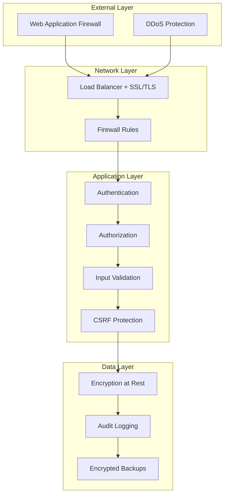
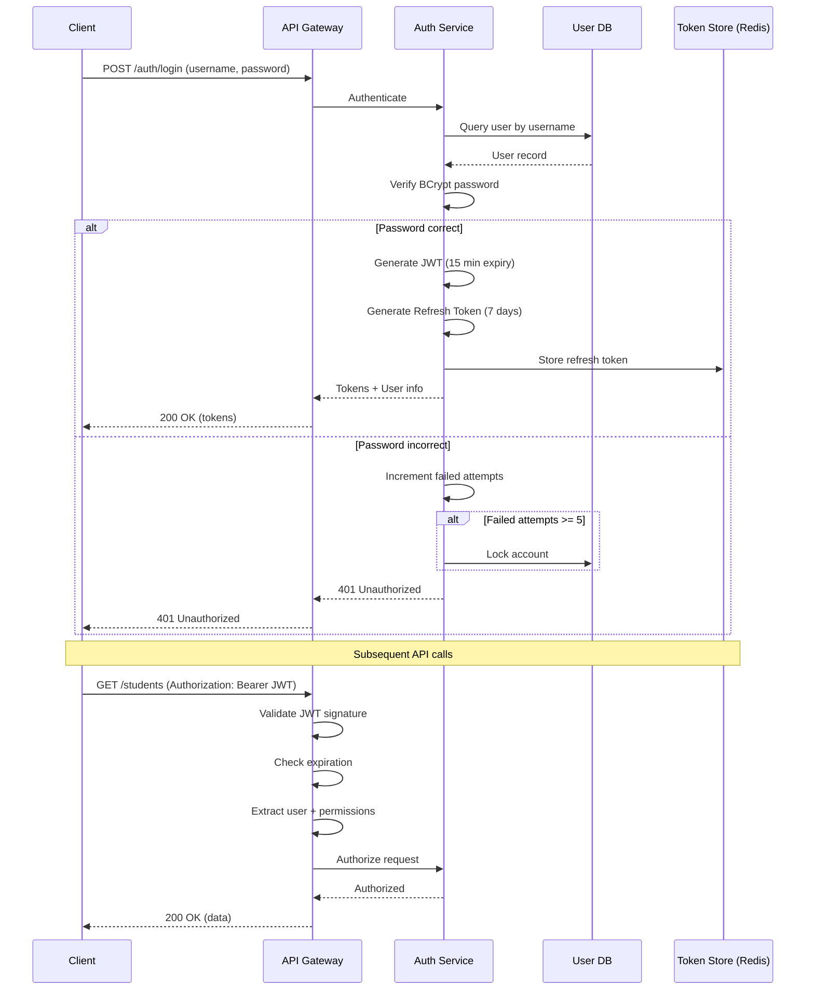
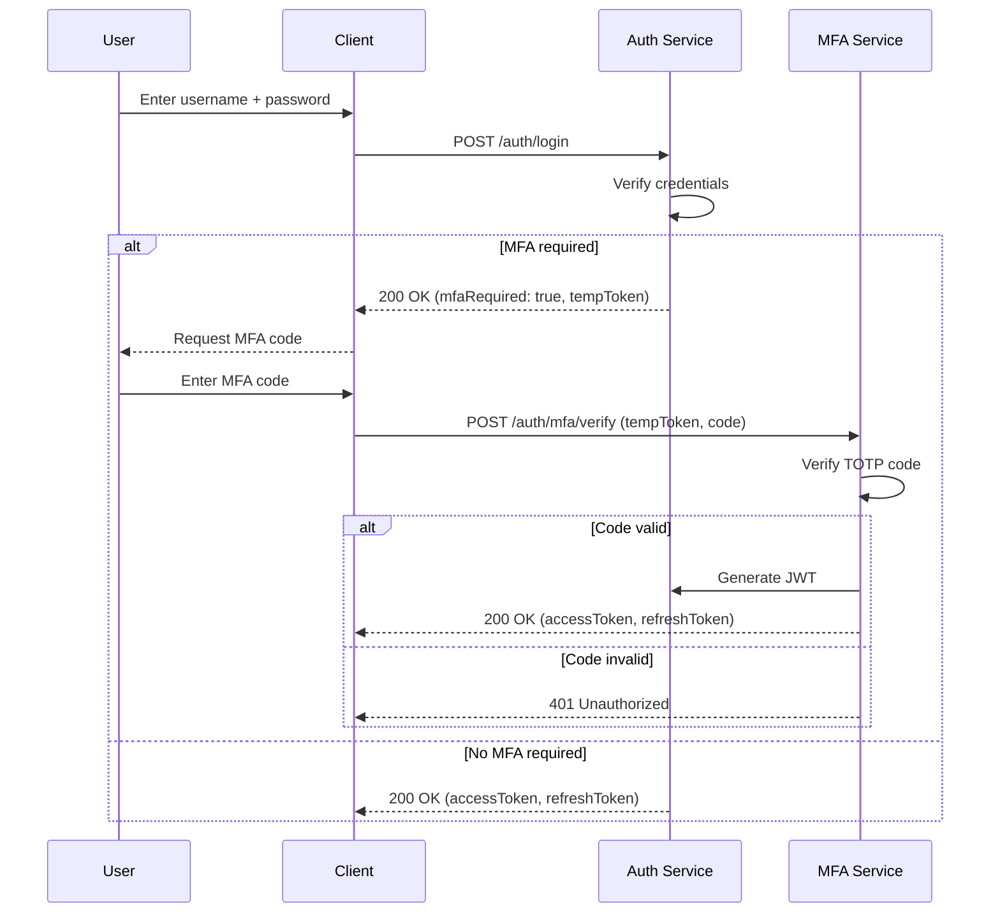

# Security Architecture - School Management System

**Version**: 1.0
**Date**: November 10, 2025
**Status**: Approved
**Author**: Security Architecture Team

---

## Table of Contents
1. [Security Overview](#security-overview)
2. [Authentication Architecture](#authentication-architecture)
3. [Authorization Model](#authorization-model)
4. [Data Security](#data-security)
5. [Application Security](#application-security)
6. [Network Security](#network-security)
7. [Security Monitoring & Audit](#security-monitoring--audit)
8. [Compliance & Privacy](#compliance--privacy)
9. [Security Testing](#security-testing)
10. [Incident Response](#incident-response)

---

## 1. Security Overview

### 1.1 Security Requirements

| Requirement | Implementation | Status |
|-------------|----------------|--------|
| **Authentication** | JWT with Spring Security | Required |
| **Authorization** | RBAC with fine-grained permissions | Required |
| **Data Encryption (Rest)** | AES-256 for PII fields | Required |
| **Data Encryption (Transit)** | TLS 1.3 | Required |
| **Audit Logging** | All data modifications logged | Required |
| **Session Management** | Stateless JWT with refresh tokens | Required |
| **Password Policy** | BCrypt with strong password rules | Required |
| **Multi-Factor Auth** | MFA for administrators | Required |
| **Rate Limiting** | Request throttling per role | Required |
| **OWASP Top 10** | Protection against all top 10 vulnerabilities | Required |

### 1.2 Security Layers



### 1.3 Threat Model

| Threat | Impact | Likelihood | Mitigation |
|--------|--------|------------|-----------|
| **SQL Injection** | High | Medium | PreparedStatements, ORM, input validation |
| **XSS** | High | Medium | Content Security Policy, output encoding |
| **CSRF** | High | Low | CSRF tokens, SameSite cookies |
| **Brute Force** | Medium | High | Rate limiting, account lockout, MFA |
| **Session Hijacking** | High | Low | Secure JWT, HTTPS only, token rotation |
| **Data Breach** | Critical | Low | Encryption, access controls, audit logging |
| **Privilege Escalation** | High | Low | RBAC, principle of least privilege |
| **Man-in-the-Middle** | High | Low | TLS 1.3, certificate pinning |
| **DDoS** | Medium | Medium | Rate limiting, CDN, auto-scaling |

---

## 2. Authentication Architecture

### 2.1 Authentication Flow



### 2.2 JWT Token Structure

**Access Token (15 minutes expiry)**:

```json
{
  "header": {
    "alg": "HS256",
    "typ": "JWT"
  },
  "payload": {
    "sub": "1",
    "username": "admin",
    "fullName": "System Administrator",
    "role": "ADMIN",
    "permissions": [
      "student:read",
      "student:write",
      "fee:read",
      "fee:write",
      "payment:read",
      "payment:write",
      "config:read",
      "config:write",
      "audit:read"
    ],
    "iat": 1636531200,
    "exp": 1636532100,
    "iss": "school-sms",
    "aud": "school-sms-api"
  },
  "signature": "..."
}
```

**Refresh Token (7 days expiry)**:

```json
{
  "header": {
    "alg": "HS256",
    "typ": "JWT"
  },
  "payload": {
    "sub": "1",
    "username": "admin",
    "tokenId": "rt-123456",
    "iat": 1636531200,
    "exp": 1637136000,
    "iss": "school-sms",
    "aud": "school-sms-refresh"
  },
  "signature": "..."
}
```

### 2.3 Token Management

**Access Token**:
- Expiry: 15 minutes
- Storage: Client memory (not localStorage)
- Validation: Signature + expiration
- Revocation: Token blacklist in Redis (for logout)

**Refresh Token**:
- Expiry: 7 days
- Storage: HttpOnly, Secure, SameSite cookie
- Validation: Signature + expiration + Redis whitelist
- Rotation: New refresh token issued on use
- Revocation: Remove from Redis whitelist

**Token Blacklist (Logout)**:
```
Key: "blacklist:token:{jti}"
Value: "1"
TTL: Token expiry time
```

**Refresh Token Whitelist**:
```
Key: "refresh:token:{userId}:{tokenId}"
Value: JSON(user metadata)
TTL: 7 days
```

### 2.4 Password Security

**Password Requirements**:
- Minimum length: 12 characters
- Must contain: uppercase, lowercase, digit, special character
- Cannot contain: username, common words
- Cannot reuse last 5 passwords
- Must change every 90 days (for administrators)

**Password Hashing**:
- Algorithm: BCrypt
- Cost factor: 12 (2^12 iterations)
- Salt: Automatically generated per password

```java
// Pseudo-code
@Service
public class PasswordService {

    private final BCryptPasswordEncoder encoder = new BCryptPasswordEncoder(12);

    public String hashPassword(String plainPassword) {
        return encoder.encode(plainPassword);
    }

    public boolean verifyPassword(String plainPassword, String hashedPassword) {
        return encoder.matches(plainPassword, hashedPassword);
    }

    public boolean meetsComplexityRequirements(String password) {
        return password.length() >= 12 &&
               password.matches(".*[A-Z].*") &&
               password.matches(".*[a-z].*") &&
               password.matches(".*[0-9].*") &&
               password.matches(".*[!@#$%^&*].*");
    }
}
```

### 2.5 Multi-Factor Authentication (MFA)

**MFA for Administrators**:
- Required for ADMIN and PRINCIPAL roles
- Implementation: TOTP (Time-based One-Time Password)
- Apps: Google Authenticator, Microsoft Authenticator
- Backup codes: 10 single-use backup codes

**MFA Flow**:



### 2.6 Account Lockout Policy

**Failed Login Attempts**:
- Threshold: 5 failed attempts
- Lockout duration: 30 minutes
- Notification: Email to user + admin
- Unlock: Automatic after 30 minutes OR manual by admin

```sql
-- Track failed attempts in users table
ALTER TABLE users ADD COLUMN failed_login_attempts INTEGER DEFAULT 0;
ALTER TABLE users ADD COLUMN locked_until TIMESTAMP WITH TIME ZONE;
ALTER TABLE users ADD COLUMN last_failed_login TIMESTAMP WITH TIME ZONE;
```

---

## 3. Authorization Model

### 3.1 Role-Based Access Control (RBAC)

**Roles**:

| Role | Description | User Count |
|------|-------------|------------|
| **ADMIN** | Full system access | 2-3 |
| **PRINCIPAL** | School management, read-only financial | 1-2 |
| **OFFICE_STAFF** | Student management, payment recording | 10-15 |
| **ACCOUNTS_MANAGER** | Financial management, reporting | 2-3 |
| **AUDITOR** | Read-only access, audit log viewing | 1-2 |

**Permission Matrix**:

| Resource | ADMIN | PRINCIPAL | OFFICE_STAFF | ACCOUNTS_MANAGER | AUDITOR |
|----------|-------|-----------|--------------|------------------|---------|
| **Students** |
| Create | ✓ | ✓ | ✓ | ✗ | ✗ |
| Read | ✓ | ✓ | ✓ | ✓ | ✓ |
| Update | ✓ | ✓ | ✓ | ✗ | ✗ |
| Delete | ✓ | ✗ | ✗ | ✗ | ✗ |
| **Classes** |
| Create | ✓ | ✓ | ✗ | ✗ | ✗ |
| Read | ✓ | ✓ | ✓ | ✓ | ✓ |
| Update | ✓ | ✓ | ✗ | ✗ | ✗ |
| Delete | ✓ | ✗ | ✗ | ✗ | ✗ |
| **Fee Structures** |
| Create | ✓ | ✓ | ✗ | ✓ | ✗ |
| Read | ✓ | ✓ | ✓ | ✓ | ✓ |
| Update | ✓ | ✓ | ✗ | ✓ | ✗ |
| Delete | ✓ | ✗ | ✗ | ✗ | ✗ |
| **Payments** |
| Create | ✓ | ✗ | ✓ | ✓ | ✗ |
| Read | ✓ | ✓ | ✓ | ✓ | ✓ |
| Update | ✓ | ✗ | ✗ | ✓ | ✗ |
| Delete | ✓ | ✗ | ✗ | ✗ | ✗ |
| **Receipts** |
| Read | ✓ | ✓ | ✓ | ✓ | ✓ |
| Generate | ✓ | ✗ | ✓ | ✓ | ✗ |
| **Configuration** |
| Read | ✓ | ✓ | ✓ | ✓ | ✓ |
| Write | ✓ | ✗ | ✗ | ✗ | ✗ |
| **Audit Logs** |
| Read | ✓ | ✓ | ✗ | ✗ | ✓ |

### 3.2 Permission Model

**Permission Naming Convention**: `{resource}:{action}`

**Examples**:
- `student:read`, `student:write`, `student:delete`
- `fee:read`, `fee:write`
- `payment:read`, `payment:write`
- `config:read`, `config:write`
- `audit:read`

**Implementation**:

```java
// Spring Security annotation
@PreAuthorize("hasAuthority('student:write')")
public StudentResponse createStudent(CreateStudentRequest request) {
    // Implementation
}

@PreAuthorize("hasAnyAuthority('student:read', 'student:write')")
public StudentResponse getStudent(Long studentId) {
    // Implementation
}
```

### 3.3 Resource-Level Authorization

**Scenario**: Office staff can only view/edit students in their assigned classes

```java
@PreAuthorize("hasAuthority('student:read')")
public StudentResponse getStudent(Long studentId, Authentication auth) {
    Student student = studentRepository.findById(studentId)
        .orElseThrow(() -> new NotFoundException("Student not found"));

    // Resource-level check
    if (!hasAccessToStudent(auth, student)) {
        throw new ForbiddenException("Access denied to this student");
    }

    return studentMapper.toResponse(student);
}

private boolean hasAccessToStudent(Authentication auth, Student student) {
    User user = (User) auth.getPrincipal();

    // Admins and principals have access to all students
    if (user.getRole() == Role.ADMIN || user.getRole() == Role.PRINCIPAL) {
        return true;
    }

    // Office staff only have access to students in their assigned classes
    if (user.getRole() == Role.OFFICE_STAFF) {
        return user.getAssignedClasses().contains(student.getCurrentClass());
    }

    return false;
}
```

### 3.4 Field-Level Authorization

**Scenario**: Different roles see different fields

```java
@JsonView(Views.Public.class)
public class StudentResponse {

    @JsonView(Views.Public.class)
    private Long studentId;

    @JsonView(Views.Public.class)
    private String firstName;

    @JsonView(Views.Sensitive.class)  // Only ADMIN, PRINCIPAL
    private String mobile;

    @JsonView(Views.Sensitive.class)
    private String email;

    @JsonView(Views.Sensitive.class)
    private String address;
}

// Controller method
@GetMapping("/{id}")
@PreAuthorize("hasAuthority('student:read')")
public ResponseEntity<StudentResponse> getStudent(@PathVariable Long id, Authentication auth) {
    StudentResponse student = studentService.getStudent(id);

    // Determine view based on role
    Class<?> view = hasRole(auth, "ADMIN", "PRINCIPAL") ?
        Views.Sensitive.class : Views.Public.class;

    return ResponseEntity.ok()
        .body(objectMapper.writerWithView(view).writeValueAsString(student));
}
```

---

## 4. Data Security

### 4.1 Encryption at Rest

**PII Fields Requiring Encryption**:

| Table | Encrypted Columns |
|-------|-------------------|
| students | first_name, last_name, date_of_birth, email, mobile, address |
| guardians | first_name, last_name, mobile, email |

**Encryption Algorithm**: AES-256-GCM (Galois/Counter Mode)

**Key Management**:
- **Production**: AWS KMS (Key Management Service) or HashiCorp Vault
- **Development**: Environment variable (rotate regularly)
- **Key Rotation**: Annually (re-encrypt data with new key)

**Implementation**:

```java
@Service
public class EncryptionService {

    private static final String ALGORITHM = "AES/GCM/NoPadding";
    private static final int GCM_IV_LENGTH = 12;
    private static final int GCM_TAG_LENGTH = 128;

    @Value("${encryption.key}")
    private String base64Key;

    private SecretKey secretKey;

    @PostConstruct
    public void init() {
        byte[] decodedKey = Base64.getDecoder().decode(base64Key);
        secretKey = new SecretKeySpec(decodedKey, "AES");
    }

    public byte[] encrypt(String plaintext) throws Exception {
        Cipher cipher = Cipher.getInstance(ALGORITHM);
        byte[] iv = new byte[GCM_IV_LENGTH];
        SecureRandom.getInstanceStrong().nextBytes(iv);
        GCMParameterSpec parameterSpec = new GCMParameterSpec(GCM_TAG_LENGTH, iv);

        cipher.init(Cipher.ENCRYPT_MODE, secretKey, parameterSpec);
        byte[] ciphertext = cipher.doFinal(plaintext.getBytes(StandardCharsets.UTF_8));

        // Prepend IV to ciphertext
        ByteBuffer byteBuffer = ByteBuffer.allocate(iv.length + ciphertext.length);
        byteBuffer.put(iv);
        byteBuffer.put(ciphertext);

        return byteBuffer.array();
    }

    public String decrypt(byte[] ciphertext) throws Exception {
        ByteBuffer byteBuffer = ByteBuffer.wrap(ciphertext);

        // Extract IV
        byte[] iv = new byte[GCM_IV_LENGTH];
        byteBuffer.get(iv);

        // Extract ciphertext
        byte[] actualCiphertext = new byte[byteBuffer.remaining()];
        byteBuffer.get(actualCiphertext);

        Cipher cipher = Cipher.getInstance(ALGORITHM);
        GCMParameterSpec parameterSpec = new GCMParameterSpec(GCM_TAG_LENGTH, iv);
        cipher.init(Cipher.DECRYPT_MODE, secretKey, parameterSpec);

        byte[] plaintext = cipher.doFinal(actualCiphertext);
        return new String(plaintext, StandardCharsets.UTF_8);
    }
}
```

**JPA Attribute Converter**:

```java
@Converter
public class EncryptedStringConverter implements AttributeConverter<String, byte[]> {

    @Autowired
    private EncryptionService encryptionService;

    @Override
    public byte[] convertToDatabaseColumn(String attribute) {
        if (attribute == null) {
            return null;
        }
        try {
            return encryptionService.encrypt(attribute);
        } catch (Exception e) {
            throw new RuntimeException("Failed to encrypt attribute", e);
        }
    }

    @Override
    public String convertToEntityAttribute(byte[] dbData) {
        if (dbData == null) {
            return null;
        }
        try {
            return encryptionService.decrypt(dbData);
        } catch (Exception e) {
            throw new RuntimeException("Failed to decrypt attribute", e);
        }
    }
}

// Usage in entity
@Entity
public class Student {

    @Convert(converter = EncryptedStringConverter.class)
    @Column(name = "first_name_encrypted", columnDefinition = "BYTEA")
    private String firstName;

    @Convert(converter = EncryptedStringConverter.class)
    @Column(name = "mobile_encrypted", columnDefinition = "BYTEA")
    private String mobile;
}
```

### 4.2 Encryption in Transit

**TLS Configuration**:

```yaml
# Nginx SSL configuration
server {
    listen 443 ssl http2;
    server_name api.school.com;

    ssl_certificate /etc/ssl/certs/api.school.com.crt;
    ssl_certificate_key /etc/ssl/private/api.school.com.key;

    # TLS 1.3 only
    ssl_protocols TLSv1.3;

    # Strong cipher suites
    ssl_ciphers 'TLS_AES_256_GCM_SHA384:TLS_CHACHA20_POLY1305_SHA256:TLS_AES_128_GCM_SHA256';
    ssl_prefer_server_ciphers off;

    # HSTS (HTTP Strict Transport Security)
    add_header Strict-Transport-Security "max-age=31536000; includeSubDomains; preload" always;

    # OCSP Stapling
    ssl_stapling on;
    ssl_stapling_verify on;
    ssl_trusted_certificate /etc/ssl/certs/ca-bundle.crt;

    # Session cache
    ssl_session_cache shared:SSL:10m;
    ssl_session_timeout 10m;
}
```

**Database Connection Encryption**:

```yaml
# application.yml
spring:
  datasource:
    url: jdbc:postgresql://localhost:5432/school_sms_db?sslmode=require&sslcert=/path/to/client-cert.pem&sslkey=/path/to/client-key.pem&sslrootcert=/path/to/ca-cert.pem
```

### 4.3 Sensitive Data Masking

**Logging**: Mask PII in application logs

```java
@Component
public class SensitiveDataMaskingFilter implements Filter {

    private static final Pattern MOBILE_PATTERN = Pattern.compile("\\b\\d{10}\\b");
    private static final Pattern EMAIL_PATTERN = Pattern.compile("\\b[A-Za-z0-9._%+-]+@[A-Za-z0-9.-]+\\.[A-Z|a-z]{2,}\\b");

    @Override
    public void doFilter(ServletRequest request, ServletResponse response, FilterChain chain)
            throws IOException, ServletException {

        ContentCachingRequestWrapper requestWrapper = new ContentCachingRequestWrapper(
            (HttpServletRequest) request);
        ContentCachingResponseWrapper responseWrapper = new ContentCachingResponseWrapper(
            (HttpServletResponse) response);

        chain.doFilter(requestWrapper, responseWrapper);

        // Log masked request/response
        String requestBody = getRequestBody(requestWrapper);
        String responseBody = getResponseBody(responseWrapper);

        log.info("Request: {}", maskSensitiveData(requestBody));
        log.info("Response: {}", maskSensitiveData(responseBody));

        responseWrapper.copyBodyToResponse();
    }

    private String maskSensitiveData(String data) {
        String masked = data;
        masked = MOBILE_PATTERN.matcher(masked).replaceAll("**********");
        masked = EMAIL_PATTERN.matcher(masked).replaceAll("****@****.***");
        return masked;
    }
}
```

**API Response**: Mask partial data for display

```java
public class SecurityUtils {

    public static String maskMobile(String mobile) {
        if (mobile == null || mobile.length() < 10) {
            return mobile;
        }
        return "******" + mobile.substring(6);
    }

    public static String maskEmail(String email) {
        if (email == null || !email.contains("@")) {
            return email;
        }
        String[] parts = email.split("@");
        return parts[0].charAt(0) + "***@" + parts[1];
    }
}
```

### 4.4 Database Security

**Database User Roles**:

```sql
-- Application user (minimal privileges)
CREATE ROLE app_user WITH LOGIN PASSWORD 'strong_password';
GRANT CONNECT ON DATABASE school_sms_db TO app_user;
GRANT USAGE ON SCHEMA public TO app_user;
GRANT SELECT, INSERT, UPDATE, DELETE ON ALL TABLES IN SCHEMA public TO app_user;
GRANT USAGE, SELECT ON ALL SEQUENCES IN SCHEMA public TO app_user;

-- Read-only user (for reporting)
CREATE ROLE readonly_user WITH LOGIN PASSWORD 'strong_password';
GRANT CONNECT ON DATABASE school_sms_db TO readonly_user;
GRANT USAGE ON SCHEMA public TO readonly_user;
GRANT SELECT ON ALL TABLES IN SCHEMA public TO readonly_user;

-- Backup user
CREATE ROLE backup_user WITH LOGIN PASSWORD 'strong_password';
ALTER ROLE backup_user WITH REPLICATION;
```

**Row-Level Security (RLS)**:

```sql
-- Enable RLS for sensitive tables
ALTER TABLE students ENABLE ROW LEVEL SECURITY;

-- Policy: Users can only see students in their assigned classes
CREATE POLICY student_access_policy ON students
    FOR SELECT
    USING (
        student_id IN (
            SELECT s.student_id
            FROM students s
            JOIN enrollments e ON s.student_id = e.student_id
            JOIN user_class_assignments uca ON e.class_id = uca.class_id
            WHERE uca.user_id = current_setting('app.current_user_id')::BIGINT
        )
        OR
        current_setting('app.current_user_role')::TEXT IN ('ADMIN', 'PRINCIPAL')
    );
```

---

## 5. Application Security

### 5.1 SQL Injection Prevention

**Use PreparedStatements & JPA**:

```java
// BAD: Vulnerable to SQL injection
String query = "SELECT * FROM students WHERE mobile = '" + mobile + "'";
List<Student> students = entityManager.createNativeQuery(query, Student.class).getResultList();

// GOOD: Use JPA query parameters
String query = "SELECT s FROM Student s WHERE s.mobile = :mobile";
List<Student> students = entityManager.createQuery(query, Student.class)
    .setParameter("mobile", mobile)
    .getResultList();

// GOOD: Use repository methods
List<Student> students = studentRepository.findByMobile(mobile);
```

### 5.2 XSS Protection

**Content Security Policy (CSP)**:

```java
@Configuration
public class SecurityHeadersConfig {

    @Bean
    public SecurityFilterChain filterChain(HttpSecurity http) throws Exception {
        http.headers(headers -> headers
            .contentSecurityPolicy(csp -> csp
                .policyDirectives("default-src 'self'; " +
                                 "script-src 'self' 'unsafe-inline' 'unsafe-eval'; " +
                                 "style-src 'self' 'unsafe-inline'; " +
                                 "img-src 'self' data: https:; " +
                                 "font-src 'self' data:; " +
                                 "connect-src 'self'; " +
                                 "frame-ancestors 'none';")
            )
            .xssProtection(xss -> xss
                .headerValue(XXssProtectionHeaderWriter.HeaderValue.ENABLED_MODE_BLOCK)
            )
        );
        return http.build();
    }
}
```

**Output Encoding**:

```java
// Spring Boot automatically escapes HTML in JSON responses
// For HTML rendering, use Thymeleaf with escaping enabled (default)

// Custom sanitization for rich text (if needed)
import org.owasp.html.PolicyFactory;
import org.owasp.html.Sanitizers;

public class HtmlSanitizer {

    private static final PolicyFactory POLICY = Sanitizers.FORMATTING
        .and(Sanitizers.LINKS);

    public static String sanitize(String html) {
        return POLICY.sanitize(html);
    }
}
```

### 5.3 CSRF Protection

**Spring Security Configuration**:

```java
@Configuration
@EnableWebSecurity
public class SecurityConfig {

    @Bean
    public SecurityFilterChain filterChain(HttpSecurity http) throws Exception {
        http
            .csrf(csrf -> csrf
                .csrfTokenRepository(CookieCsrfTokenRepository.withHttpOnlyFalse())
                .csrfTokenRequestHandler(new SpaCsrfTokenRequestHandler())
            )
            .addFilterAfter(new CsrfCookieFilter(), BasicAuthenticationFilter.class);

        return http.build();
    }
}

// Custom CSRF token handler for SPA
final class SpaCsrfTokenRequestHandler extends CsrfTokenRequestAttributeHandler {
    private final CsrfTokenRequestHandler delegate = new XorCsrfTokenRequestAttributeHandler();

    @Override
    public void handle(HttpServletRequest request, HttpServletResponse response,
                       Supplier<CsrfToken> csrfToken) {
        this.delegate.handle(request, response, csrfToken);
    }

    @Override
    public String resolveCsrfTokenValue(HttpServletRequest request, CsrfToken csrfToken) {
        if (StringUtils.hasText(request.getHeader(csrfToken.getHeaderName()))) {
            return super.resolveCsrfTokenValue(request, csrfToken);
        }
        return this.delegate.resolveCsrfTokenValue(request, csrfToken);
    }
}
```

### 5.4 Input Validation

**Bean Validation**:

```java
@Data
public class CreateStudentRequest {

    @NotBlank(message = "First name is required")
    @Size(min = 2, max = 50, message = "First name must be between 2 and 50 characters")
    @Pattern(regexp = "^[a-zA-Z\\s]+$", message = "First name must contain only letters")
    private String firstName;

    @NotBlank(message = "Mobile is required")
    @Pattern(regexp = "^[0-9]{10}$", message = "Mobile must be exactly 10 digits")
    private String mobile;

    @Email(message = "Invalid email format")
    private String email;

    @NotNull(message = "Date of birth is required")
    @Past(message = "Date of birth must be in the past")
    @AgeRange(min = 3, max = 18, message = "Student age must be between 3 and 18")
    private LocalDate dateOfBirth;

    @NotEmpty(message = "At least one guardian is required")
    @Valid
    private List<GuardianRequest> guardians;
}

// Custom validator
@Target({ElementType.FIELD})
@Retention(RetentionPolicy.RUNTIME)
@Constraint(validatedBy = AgeRangeValidator.class)
public @interface AgeRange {
    String message() default "Age out of range";
    Class<?>[] groups() default {};
    Class<? extends Payload>[] payload() default {};
    int min();
    int max();
}

public class AgeRangeValidator implements ConstraintValidator<AgeRange, LocalDate> {

    private int min;
    private int max;

    @Override
    public void initialize(AgeRange constraintAnnotation) {
        this.min = constraintAnnotation.min();
        this.max = constraintAnnotation.max();
    }

    @Override
    public boolean isValid(LocalDate dateOfBirth, ConstraintValidatorContext context) {
        if (dateOfBirth == null) {
            return true;  // Handled by @NotNull
        }

        int age = Period.between(dateOfBirth, LocalDate.now()).getYears();
        return age >= min && age <= max;
    }
}
```

### 5.5 Rate Limiting

**Implementation using Bucket4j**:

```java
@Component
public class RateLimitingFilter implements Filter {

    private final Map<String, Bucket> cache = new ConcurrentHashMap<>();

    @Override
    public void doFilter(ServletRequest request, ServletResponse response, FilterChain chain)
            throws IOException, ServletException {

        HttpServletRequest httpRequest = (HttpServletRequest) request;
        String userId = extractUserId(httpRequest);
        String role = extractRole(httpRequest);

        Bucket bucket = resolveBucket(userId, role);

        if (bucket.tryConsume(1)) {
            chain.doFilter(request, response);
        } else {
            HttpServletResponse httpResponse = (HttpServletResponse) response;
            httpResponse.setStatus(429);
            httpResponse.getWriter().write("{\"error\": \"Rate limit exceeded\"}");
        }
    }

    private Bucket resolveBucket(String userId, String role) {
        return cache.computeIfAbsent(userId, key -> createBucket(role));
    }

    private Bucket createBucket(String role) {
        int requestsPerMinute = switch (role) {
            case "ADMIN" -> 300;
            case "OFFICE_STAFF", "ACCOUNTS_MANAGER" -> 200;
            case "AUDITOR" -> 100;
            default -> 60;
        };

        Bandwidth limit = Bandwidth.classic(requestsPerMinute,
            Refill.intervally(requestsPerMinute, Duration.ofMinutes(1)));

        return Bucket.builder()
            .addLimit(limit)
            .build();
    }
}
```

### 5.6 Security Headers

```java
@Configuration
public class SecurityHeadersConfig {

    @Bean
    public SecurityFilterChain filterChain(HttpSecurity http) throws Exception {
        http.headers(headers -> headers
            // Prevent clickjacking
            .frameOptions(frame -> frame.deny())

            // Prevent MIME sniffing
            .contentTypeOptions(contentType -> contentType.disable())

            // XSS protection
            .xssProtection(xss -> xss.headerValue(
                XXssProtectionHeaderWriter.HeaderValue.ENABLED_MODE_BLOCK))

            // HSTS
            .httpStrictTransportSecurity(hsts -> hsts
                .includeSubDomains(true)
                .maxAgeInSeconds(31536000))

            // Referrer policy
            .referrerPolicy(referrer -> referrer
                .policy(ReferrerPolicyHeaderWriter.ReferrerPolicy.STRICT_ORIGIN_WHEN_CROSS_ORIGIN))

            // Permissions policy
            .permissionsPolicy(permissions -> permissions
                .policy("geolocation=(), microphone=(), camera=()"))
        );

        return http.build();
    }
}
```

---

## 6. Network Security

### 6.1 Firewall Rules

```bash
# Allow HTTPS traffic
iptables -A INPUT -p tcp --dport 443 -j ACCEPT

# Allow PostgreSQL from application servers only
iptables -A INPUT -p tcp -s 10.0.1.0/24 --dport 5432 -j ACCEPT

# Allow Redis from application servers only
iptables -A INPUT -p tcp -s 10.0.1.0/24 --dport 6379 -j ACCEPT

# Drop all other incoming traffic
iptables -A INPUT -j DROP
```

### 6.2 Network Segmentation

```
┌─────────────────┐
│   DMZ (Public)  │
│  Load Balancer  │
└────────┬────────┘
         │
┌────────▼────────────┐
│  Application Tier   │
│  Private Subnet     │
│  10.0.1.0/24        │
└────────┬────────────┘
         │
┌────────▼────────────┐
│   Data Tier         │
│   Private Subnet    │
│   10.0.2.0/24       │
│   (PostgreSQL/Redis)│
└─────────────────────┘
```

---

## 7. Security Monitoring & Audit

### 7.1 Audit Logging

**Events to Audit**:
- User authentication (success/failure)
- User authorization failures
- Data modifications (INSERT, UPDATE, DELETE)
- Configuration changes
- Sensitive data access
- Admin actions

**Audit Log Format**:

```json
{
  "timestamp": "2025-11-10T10:30:00Z",
  "eventType": "STUDENT_UPDATED",
  "userId": 1,
  "username": "admin",
  "userRole": "ADMIN",
  "ipAddress": "192.168.1.100",
  "userAgent": "Mozilla/5.0...",
  "requestId": "req-12345",
  "resource": "students",
  "resourceId": 123,
  "action": "UPDATE",
  "oldValues": {
    "mobile": "9876543210",
    "address": "Old Address"
  },
  "newValues": {
    "mobile": "9876543211",
    "address": "New Address"
  },
  "result": "SUCCESS"
}
```

### 7.2 Security Alerts

**Alert Triggers**:
- Multiple failed login attempts
- Account lockout
- Privilege escalation attempt
- Unusual data access patterns
- After-hours access
- Large data exports

**Alert Channels**:
- Email to security team
- Slack notification
- PagerDuty for critical alerts

### 7.3 Intrusion Detection

**Log Monitoring**:
- Failed authentication attempts
- SQL injection patterns in logs
- Unusual API endpoint access
- High-volume requests from single IP

---

## 8. Compliance & Privacy

### 8.1 GDPR Compliance

**Data Subject Rights**:

1. **Right to Access**: Provide all personal data on request
2. **Right to Rectification**: Allow data correction
3. **Right to Erasure**: Delete personal data on request
4. **Right to Data Portability**: Export data in machine-readable format
5. **Right to Object**: Allow objection to data processing

**Implementation**:

```java
// Data export
@GetMapping("/students/{id}/export")
@PreAuthorize("hasAuthority('student:read')")
public ResponseEntity<byte[]> exportStudentData(@PathVariable Long id) {
    Student student = studentService.getStudent(id);
    byte[] jsonData = objectMapper.writeValueAsBytes(student);

    return ResponseEntity.ok()
        .header(HttpHeaders.CONTENT_DISPOSITION, "attachment; filename=student-data.json")
        .contentType(MediaType.APPLICATION_JSON)
        .body(jsonData);
}

// Data deletion
@DeleteMapping("/students/{id}/erase")
@PreAuthorize("hasAuthority('student:delete')")
public ResponseEntity<Void> eraseStudentData(@PathVariable Long id) {
    // Anonymize instead of delete (retain for audit)
    studentService.anonymizeStudent(id);
    return ResponseEntity.noContent().build();
}
```

### 8.2 Data Retention

**Retention Policy**: 7 years for all student and financial records

**Archival Process**:
- Automated archival job runs annually
- Archived data moved to cold storage
- Audit logs maintained separately
- Purge after 7 years (except legal hold)

---

## 9. Security Testing

### 9.1 Security Test Plan

| Test Type | Frequency | Tools |
|-----------|-----------|-------|
| **SAST** | Every commit | SonarQube, Checkmarx |
| **DAST** | Weekly | OWASP ZAP, Burp Suite |
| **Dependency Scan** | Daily | OWASP Dependency-Check, Snyk |
| **Penetration Testing** | Quarterly | External vendor |
| **Security Audit** | Annually | Third-party auditor |

### 9.2 Automated Security Tests

```java
@SpringBootTest
class SecurityTests {

    @Test
    void testUnauthorizedAccessReturns401() {
        given()
            .when()
            .get("/api/v1/students")
            .then()
            .statusCode(401);
    }

    @Test
    void testInsufficientPermissionsReturns403() {
        String token = getTokenForRole("AUDITOR");

        given()
            .header("Authorization", "Bearer " + token)
            .body(createStudentRequest)
            .when()
            .post("/api/v1/students")
            .then()
            .statusCode(403);
    }

    @Test
    void testSqlInjectionIsBlocked() {
        String token = getTokenForRole("ADMIN");

        given()
            .header("Authorization", "Bearer " + token)
            .queryParam("mobile", "1234567890' OR '1'='1")
            .when()
            .get("/api/v1/students")
            .then()
            .statusCode(400);  // Bad request or no results
    }
}
```

---

## 10. Incident Response

### 10.1 Incident Response Plan

**Phase 1: Detection**
- Monitor security alerts
- Review audit logs
- Analyze anomalies

**Phase 2: Containment**
- Isolate affected systems
- Revoke compromised credentials
- Block malicious IPs

**Phase 3: Eradication**
- Remove malware/backdoors
- Patch vulnerabilities
- Update security rules

**Phase 4: Recovery**
- Restore from clean backups
- Verify system integrity
- Resume normal operations

**Phase 5: Post-Incident**
- Root cause analysis
- Update security policies
- Conduct lessons learned

### 10.2 Security Contacts

| Role | Contact | Phone |
|------|---------|-------|
| Security Lead | security@school.com | +1-XXX-XXX-XXXX |
| System Admin | admin@school.com | +1-XXX-XXX-XXXX |
| Legal | legal@school.com | +1-XXX-XXX-XXXX |

---

## Document Control

| Version | Date | Author | Changes |
|---------|------|--------|---------|
| 1.0 | 2025-11-10 | Security Team | Initial version |

