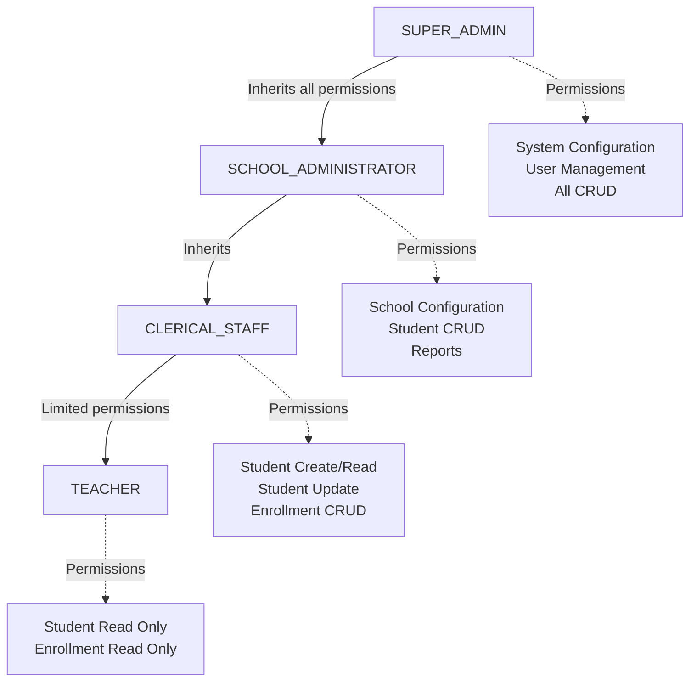

# Security Architecture - School Management System

## 1. Overview

This document defines the security architecture for Phase 1 of the School Management System. While authentication is explicitly **out of scope** (handled by external systems), this architecture enforces defense-in-depth principles across all layers.

### 1.1 Security Objectives

| Objective | Implementation | Priority |
|-----------|---------------|----------|
| **Data Integrity** | Validation at all layers, optimistic locking | Critical |
| **Input Sanitization** | Bean Validation, SQL injection prevention | Critical |
| **Least Privilege** | Role-based access control (RBAC) framework | High |
| **Audit Trail** | Comprehensive logging with correlation IDs | High |
| **Secure Communication** | HTTPS, CORS policies | High |
| **Secrets Management** | Environment variables, no hardcoded credentials | Critical |

## 2. Authentication Strategy (Phase 1)

### 2.1 External Authentication Assumption

**Constraint**: All authentication is handled by an external Identity Provider (IdP).

**Integration Contract**:
```http
POST /api/v1/students
Authorization: Bearer <JWT_TOKEN>
X-User-ID: admin@school.com
X-User-Role: SCHOOL_ADMINISTRATOR
X-Correlation-ID: a1b2c3d4-e5f6-7890
```

**Backend Responsibility**: Validate headers and extract user context

```java
@Component
public class UserContextInterceptor implements HandlerInterceptor {

    @Override
    public boolean preHandle(
        HttpServletRequest request,
        HttpServletResponse response,
        Object handler
    ) {
        // Extract user context from headers
        String userId = request.getHeader("X-User-ID");
        String userRole = request.getHeader("X-User-Role");

        if (userId == null || userRole == null) {
            throw new UnauthorizedException("Missing user context headers");
        }

        // Store in ThreadLocal for request scope
        UserContext.setUserId(userId);
        UserContext.setUserRole(UserRole.valueOf(userRole));

        return true;
    }

    @Override
    public void afterCompletion(
        HttpServletRequest request,
        HttpServletResponse response,
        Object handler,
        Exception ex
    ) {
        // Clean up ThreadLocal
        UserContext.clear();
    }
}
```

### 2.2 User Context Model

```java
public class UserContext {

    private static final ThreadLocal<String> userId = new ThreadLocal<>();
    private static final ThreadLocal<UserRole> userRole = new ThreadLocal<>();

    public static void setUserId(String id) {
        userId.set(id);
    }

    public static String getUserId() {
        return userId.get();
    }

    public static void setUserRole(UserRole role) {
        userRole.set(role);
    }

    public static UserRole getUserRole() {
        return userRole.get();
    }

    public static void clear() {
        userId.remove();
        userRole.remove();
    }
}
```

## 3. Authorization Framework (RBAC)

### 3.1 Role Hierarchy


```mermaid
graph TD
    SUPER_ADMIN[SUPER_ADMIN]
    ADMIN[SCHOOL_ADMINISTRATOR]
    STAFF[CLERICAL_STAFF]
    TEACHER[TEACHER]

    SUPER_ADMIN -->|Inherits all permissions| ADMIN
    ADMIN -->|Inherits| STAFF
    STAFF -->|Limited permissions| TEACHER

    SUPER_ADMIN -.->|Permissions| SA_PERMS[System Configuration<br/>User Management<br/>All CRUD]
    ADMIN -.->|Permissions| A_PERMS[School Configuration<br/>Student CRUD<br/>Reports]
    STAFF -.->|Permissions| S_PERMS[Student Create/Read<br/>Student Update<br/>Enrollment CRUD]
    TEACHER -.->|Permissions| T_PERMS[Student Read Only<br/>Enrollment Read Only]
```

### 3.2 Role Definitions

```java
public enum UserRole {

    SUPER_ADMIN(100, Set.of(
        Permission.ALL
    )),

    SCHOOL_ADMINISTRATOR(90, Set.of(
        Permission.STUDENT_CREATE,
        Permission.STUDENT_READ,
        Permission.STUDENT_UPDATE,
        Permission.STUDENT_DELETE,
        Permission.CONFIG_CREATE,
        Permission.CONFIG_READ,
        Permission.CONFIG_UPDATE,
        Permission.CONFIG_DELETE,
        Permission.ENROLLMENT_CREATE,
        Permission.ENROLLMENT_READ,
        Permission.ENROLLMENT_UPDATE
    )),

    CLERICAL_STAFF(80, Set.of(
        Permission.STUDENT_CREATE,
        Permission.STUDENT_READ,
        Permission.STUDENT_UPDATE,
        Permission.ENROLLMENT_CREATE,
        Permission.ENROLLMENT_READ,
        Permission.ENROLLMENT_UPDATE
    )),

    TEACHER(70, Set.of(
        Permission.STUDENT_READ,
        Permission.ENROLLMENT_READ
    ));

    private final int priority;
    private final Set<Permission> permissions;

    UserRole(int priority, Set<Permission> permissions) {
        this.priority = priority;
        this.permissions = permissions;
    }

    public boolean hasPermission(Permission permission) {
        return permissions.contains(Permission.ALL) ||
               permissions.contains(permission);
    }
}

public enum Permission {
    ALL,
    STUDENT_CREATE,
    STUDENT_READ,
    STUDENT_UPDATE,
    STUDENT_DELETE,
    CONFIG_CREATE,
    CONFIG_READ,
    CONFIG_UPDATE,
    CONFIG_DELETE,
    ENROLLMENT_CREATE,
    ENROLLMENT_READ,
    ENROLLMENT_UPDATE
}
```

### 3.3 Method-Level Authorization

```java
@Target({ElementType.METHOD, ElementType.TYPE})
@Retention(RetentionPolicy.RUNTIME)
public @interface RequirePermission {
    Permission value();
}

@Aspect
@Component
public class AuthorizationAspect {

    @Before("@annotation(requirePermission)")
    public void checkPermission(JoinPoint joinPoint, RequirePermission requirePermission) {
        UserRole userRole = UserContext.getUserRole();

        if (!userRole.hasPermission(requirePermission.value())) {
            throw new ForbiddenException(
                "User role " + userRole + " does not have permission: " + requirePermission.value()
            );
        }
    }
}

// Usage in Service Layer
@Service
public class StudentService {

    @RequirePermission(Permission.STUDENT_CREATE)
    public StudentResponseDTO registerStudent(StudentRequestDTO dto) {
        // Only users with STUDENT_CREATE permission can execute
    }

    @RequirePermission(Permission.STUDENT_DELETE)
    public void deleteStudent(String studentId) {
        // Only SCHOOL_ADMINISTRATOR and above
    }
}
```

## 4. Input Validation & Sanitization

### 4.1 Multi-Layer Validation Strategy

```
┌──────────────────────────────────────────┐
│  Layer 1: Frontend (Zod Schemas)        │
│  - Immediate feedback                    │
│  - Prevents unnecessary API calls        │
└──────────────────────────────────────────┘
                 ↓
┌──────────────────────────────────────────┐
│  Layer 2: Bean Validation (JSR-380)     │
│  - @NotNull, @Pattern, @Size             │
│  - Automatic via @Valid annotation       │
└──────────────────────────────────────────┘
                 ↓
┌──────────────────────────────────────────┐
│  Layer 3: Drools Business Rules          │
│  - Complex business logic                │
│  - Cross-field validations               │
└──────────────────────────────────────────┘
                 ↓
┌──────────────────────────────────────────┐
│  Layer 4: Database Constraints           │
│  - CHECK constraints                     │
│  - UNIQUE constraints                    │
│  - Foreign key integrity                 │
└──────────────────────────────────────────┘
```

### 4.2 Bean Validation Examples

```java
@Data
@Builder
public class StudentRequestDTO {

    @NotBlank(message = "First name is required")
    @Size(min = 2, max = 100, message = "First name must be 2-100 characters")
    @Pattern(
        regexp = "^[a-zA-Z\\s]+$",
        message = "First name can only contain letters and spaces"
    )
    private String firstName;

    @NotBlank(message = "Last name is required")
    @Size(min = 2, max = 100)
    @Pattern(regexp = "^[a-zA-Z\\s]+$")
    private String lastName;

    @NotNull(message = "Date of birth is required")
    @Past(message = "Date of birth must be in the past")
    private LocalDate dateOfBirth;

    @NotBlank(message = "Mobile number is required")
    @Pattern(
        regexp = "^\\d{10}$",
        message = "Mobile must be exactly 10 digits"
    )
    private String mobile;

    @Email(message = "Invalid email format")
    private String email;

    @Pattern(
        regexp = "^\\d{12}$",
        message = "Aadhaar number must be exactly 12 digits"
    )
    private String aadhaarNumber;
}

// Controller automatically validates via @Valid
@RestController
@RequestMapping("/api/v1/students")
public class StudentController {

    @PostMapping
    public ResponseEntity<StudentResponseDTO> createStudent(
        @Valid @RequestBody StudentRequestDTO dto
    ) {
        // If validation fails, Spring returns 400 with error details
    }
}
```

### 4.3 Custom Validators

```java
@Target({ElementType.FIELD, ElementType.PARAMETER})
@Retention(RetentionPolicy.RUNTIME)
@Constraint(validatedBy = ValidAgeValidator.class)
public @interface ValidAge {
    String message() default "Age must be between 3 and 18 years";
    Class<?>[] groups() default {};
    Class<? extends Payload>[] payload() default {};
}

public class ValidAgeValidator implements ConstraintValidator<ValidAge, LocalDate> {

    @Override
    public boolean isValid(LocalDate dateOfBirth, ConstraintValidatorContext context) {
        if (dateOfBirth == null) {
            return true; // Let @NotNull handle null validation
        }

        int age = Period.between(dateOfBirth, LocalDate.now()).getYears();
        return age >= 3 && age <= 18;
    }
}

// Usage
@ValidAge
@NotNull
private LocalDate dateOfBirth;
```

## 5. SQL Injection Prevention

### 5.1 Mandatory Practices

**Rule**: NEVER use string concatenation for SQL queries

```java
// ❌ FORBIDDEN - SQL Injection Vulnerable
public List<Student> findByLastName(String lastName) {
    String query = "SELECT * FROM students WHERE last_name = '" + lastName + "'";
    return entityManager.createNativeQuery(query, Student.class).getResultList();
    // Attacker input: "Smith' OR '1'='1" → Returns all students
}

// ✅ SAFE - Parameterized Query
@Query("SELECT s FROM Student s WHERE s.lastName = :lastName")
List<Student> findByLastName(@Param("lastName") String lastName);

// ✅ SAFE - JPA Criteria API
public List<Student> findByLastName(String lastName) {
    CriteriaBuilder cb = entityManager.getCriteriaBuilder();
    CriteriaQuery<Student> query = cb.createQuery(Student.class);
    Root<Student> student = query.from(Student.class);

    query.select(student).where(
        cb.equal(student.get("lastName"), lastName)
    );

    return entityManager.createQuery(query).getResultList();
}
```

### 5.2 Repository Layer Standards

```java
@Repository
public interface StudentRepository extends JpaRepository<Student, Long> {

    // Spring Data JPA auto-generates safe queries
    Optional<Student> findByStudentId(String studentId);

    List<Student> findByLastNameContainingIgnoreCase(String lastName);

    @Query("SELECT s FROM Student s WHERE s.status = :status ORDER BY s.createdAt DESC")
    Page<Student> findByStatus(@Param("status") String status, Pageable pageable);

    // Native queries MUST use named parameters
    @Query(
        value = "SELECT * FROM students WHERE mobile = :mobile AND id != :id",
        nativeQuery = true
    )
    boolean existsByMobileAndIdNot(@Param("mobile") String mobile, @Param("id") Long id);
}
```

## 6. XSS (Cross-Site Scripting) Protection

### 6.1 Backend Sanitization

```java
@Component
public class HtmlSanitizer {

    private static final Policy POLICY = new HtmlPolicyBuilder()
        .allowElements("b", "i", "u", "em", "strong")  // Allow limited HTML tags
        .toFactory();

    public String sanitize(String input) {
        if (input == null) {
            return null;
        }
        return POLICY.sanitize(input);
    }
}

@Service
public class StudentService {

    private final HtmlSanitizer htmlSanitizer;

    public StudentResponseDTO registerStudent(StudentRequestDTO dto) {
        // Sanitize user-provided text fields
        Student student = Student.builder()
            .firstName(htmlSanitizer.sanitize(dto.getFirstName()))
            .address(htmlSanitizer.sanitize(dto.getAddress()))
            .build();

        return studentRepository.save(student);
    }
}
```

### 6.2 Response Header Configuration

```java
@Configuration
public class SecurityHeadersConfig implements WebMvcConfigurer {

    @Override
    public void addInterceptors(InterceptorRegistry registry) {
        registry.addInterceptor(new HandlerInterceptor() {
            @Override
            public void postHandle(
                HttpServletRequest request,
                HttpServletResponse response,
                Object handler,
                ModelAndView modelAndView
            ) {
                // Prevent MIME type sniffing
                response.setHeader("X-Content-Type-Options", "nosniff");

                // Enable XSS protection (legacy browsers)
                response.setHeader("X-XSS-Protection", "1; mode=block");

                // Prevent clickjacking
                response.setHeader("X-Frame-Options", "DENY");

                // Content Security Policy
                response.setHeader(
                    "Content-Security-Policy",
                    "default-src 'self'; script-src 'self'; style-src 'self' 'unsafe-inline'"
                );
            }
        });
    }
}
```

## 7. CSRF (Cross-Site Request Forgery) Protection

### 7.1 Stateless Token-Based Protection

**Phase 1 Strategy**: Use double-submit cookie pattern

```java
@Configuration
public class CsrfConfig {

    @Bean
    public CsrfTokenRepository csrfTokenRepository() {
        CookieCsrfTokenRepository repository = CookieCsrfTokenRepository.withHttpOnlyFalse();
        repository.setCookieName("XSRF-TOKEN");
        repository.setHeaderName("X-XSRF-TOKEN");
        return repository;
    }
}

// Frontend must send token in header
axios.interceptors.request.use(config => {
    const csrfToken = Cookies.get('XSRF-TOKEN');
    if (csrfToken) {
        config.headers['X-XSRF-TOKEN'] = csrfToken;
    }
    return config;
});
```

## 8. CORS (Cross-Origin Resource Sharing)

### 8.1 CORS Configuration

```java
@Configuration
public class CorsConfig implements WebMvcConfigurer {

    @Value("${app.cors.allowed-origins}")
    private String[] allowedOrigins;

    @Override
    public void addCorsMappings(CorsRegistry registry) {
        registry.addMapping("/api/**")
            .allowedOrigins(allowedOrigins)  // Configured per environment
            .allowedMethods("GET", "POST", "PUT", "DELETE", "OPTIONS")
            .allowedHeaders("*")
            .exposedHeaders("X-Correlation-ID", "Location")
            .allowCredentials(true)
            .maxAge(3600);  // Cache preflight response for 1 hour
    }
}
```

**Environment-Specific Configuration**:
```yaml
# application-dev.yml
app:
  cors:
    allowed-origins:
      - http://localhost:3000
      - http://localhost:5173

# application-prod.yml
app:
  cors:
    allowed-origins:
      - https://school.example.com
```

## 9. Secrets Management

### 9.1 Externalized Configuration

**Critical Rule**: NEVER commit credentials to Git

```yaml
# application.yml (Committed to Git)
spring:
  datasource:
    url: jdbc:postgresql://${DB_HOST:localhost}:5432/${DB_NAME:student_db}
    username: ${DB_USERNAME}  # From environment variable
    password: ${DB_PASSWORD}  # From environment variable
  redis:
    host: ${REDIS_HOST:localhost}
    password: ${REDIS_PASSWORD}

drools:
  encryption-key: ${DROOLS_ENCRYPTION_KEY}
```

**Docker Compose with .env file**:
```yaml
# docker-compose.yml
services:
  student-service:
    environment:
      DB_USERNAME: ${DB_USERNAME}
      DB_PASSWORD: ${DB_PASSWORD}
      REDIS_PASSWORD: ${REDIS_PASSWORD}
```

```bash
# .env (NOT committed to Git - add to .gitignore)
DB_USERNAME=school_admin
DB_PASSWORD=SecureP@ssw0rd!123
REDIS_PASSWORD=CacheSecureP@ss456
DROOLS_ENCRYPTION_KEY=EncryptionKey789ABC
```

### 9.2 Secrets Validation on Startup

```java
@Component
public class SecretsValidator implements ApplicationListener<ApplicationStartedEvent> {

    @Value("${DB_PASSWORD:}")
    private String dbPassword;

    @Value("${REDIS_PASSWORD:}")
    private String redisPassword;

    @Override
    public void onApplicationEvent(ApplicationStartedEvent event) {
        List<String> missingSecrets = new ArrayList<>();

        if (dbPassword.isBlank()) {
            missingSecrets.add("DB_PASSWORD");
        }
        if (redisPassword.isBlank()) {
            missingSecrets.add("REDIS_PASSWORD");
        }

        if (!missingSecrets.isEmpty()) {
            throw new IllegalStateException(
                "Missing required secrets: " + String.join(", ", missingSecrets)
            );
        }
    }
}
```

## 10. Data Privacy & Compliance

### 10.1 Sensitive Data Protection

| Data Field | Sensitivity Level | Protection Mechanism |
|------------|------------------|---------------------|
| Aadhaar Number | High | Encrypted at rest (pgcrypto) |
| Mobile Number | Medium | Hashed for duplicate detection |
| Email | Medium | Encrypted at rest |
| Student Address | Low | Plain text with access control |
| Father/Mother Name | Low | Access control only |

### 10.2 Encryption at Rest (PostgreSQL)

```sql
-- Enable pgcrypto extension
CREATE EXTENSION IF NOT EXISTS pgcrypto;

-- Encrypt Aadhaar number
UPDATE students
SET aadhaar_number_encrypted = pgp_sym_encrypt(
    aadhaar_number,
    current_setting('app.encryption_key')
)
WHERE aadhaar_number IS NOT NULL;

-- Decrypt in application
SELECT
    id,
    student_id,
    pgp_sym_decrypt(
        aadhaar_number_encrypted::bytea,
        current_setting('app.encryption_key')
    ) AS aadhaar_number
FROM students
WHERE student_id = 'STD-20260203-0001';
```

### 10.3 Data Masking for Logs

```java
@Component
public class SensitiveDataMasker {

    private static final Pattern MOBILE_PATTERN = Pattern.compile("(\\d{3})(\\d{4})(\\d{3})");
    private static final Pattern EMAIL_PATTERN = Pattern.compile("([^@]+)@(.+)");

    public String maskMobile(String mobile) {
        if (mobile == null) return null;
        Matcher matcher = MOBILE_PATTERN.matcher(mobile);
        return matcher.replaceAll("$1****$3");  // 987****210
    }

    public String maskEmail(String email) {
        if (email == null) return null;
        Matcher matcher = EMAIL_PATTERN.matcher(email);
        if (matcher.find()) {
            String localPart = matcher.group(1);
            String domain = matcher.group(2);
            return localPart.charAt(0) + "***@" + domain;  // j***@example.com
        }
        return email;
    }
}

// Usage in logging
logger.info("Student registered with mobile: {}",
    sensitiveDataMasker.maskMobile(student.getMobile()));
```

## 11. Audit Logging

### 11.1 Audit Trail Requirements

**Logged Events**:
- Student registration (CREATE)
- Student profile updates (UPDATE)
- Student deletion (DELETE)
- Configuration changes (UPDATE)
- Failed login attempts (Future)
- Authorization failures

**Audit Log Format**:
```json
{
  "timestamp": "2026-02-03T10:15:30.123Z",
  "correlationId": "a1b2c3d4-e5f6-7890",
  "userId": "admin@school.com",
  "userRole": "SCHOOL_ADMINISTRATOR",
  "action": "STUDENT_CREATE",
  "resource": "students/STD-20260203-0001",
  "status": "SUCCESS",
  "details": {
    "studentId": "STD-20260203-0001",
    "mobile": "987****210"  // Masked
  },
  "ipAddress": "192.168.1.100",
  "userAgent": "Mozilla/5.0..."
}
```

### 11.2 Audit Logging Implementation

```java
@Aspect
@Component
public class AuditLoggingAspect {

    private static final Logger auditLogger = LoggerFactory.getLogger("AUDIT");

    @AfterReturning(
        pointcut = "@annotation(auditable)",
        returning = "result"
    )
    public void logAuditEvent(JoinPoint joinPoint, Auditable auditable, Object result) {
        AuditLog auditLog = AuditLog.builder()
            .timestamp(LocalDateTime.now())
            .correlationId(MDC.get("correlationId"))
            .userId(UserContext.getUserId())
            .userRole(UserContext.getUserRole().name())
            .action(auditable.action())
            .resource(extractResourceId(result))
            .status("SUCCESS")
            .build();

        auditLogger.info(toJson(auditLog));
    }

    @AfterThrowing(
        pointcut = "@annotation(auditable)",
        throwing = "ex"
    )
    public void logAuditFailure(JoinPoint joinPoint, Auditable auditable, Exception ex) {
        AuditLog auditLog = AuditLog.builder()
            .action(auditable.action())
            .status("FAILURE")
            .errorMessage(ex.getMessage())
            .build();

        auditLogger.warn(toJson(auditLog));
    }
}

// Custom annotation
@Target(ElementType.METHOD)
@Retention(RetentionPolicy.RUNTIME)
public @interface Auditable {
    String action();
}

// Usage
@Service
public class StudentService {

    @Auditable(action = "STUDENT_CREATE")
    public StudentResponseDTO registerStudent(StudentRequestDTO dto) {
        // Logic
    }
}
```

## 12. Rate Limiting

### 12.1 Bucket4j Implementation

```java
@Configuration
public class RateLimitConfig {

    @Bean
    public Bucket createRateLimitBucket() {
        // 100 requests per minute per IP
        Bandwidth limit = Bandwidth.classic(
            100,
            Refill.intervally(100, Duration.ofMinutes(1))
        );

        return Bucket.builder()
            .addLimit(limit)
            .build();
    }
}

@Component
public class RateLimitInterceptor implements HandlerInterceptor {

    private final Map<String, Bucket> buckets = new ConcurrentHashMap<>();

    @Override
    public boolean preHandle(HttpServletRequest request, ...) {
        String clientIp = request.getRemoteAddr();
        Bucket bucket = buckets.computeIfAbsent(clientIp, k -> createBucket());

        if (bucket.tryConsume(1)) {
            return true;
        } else {
            throw new TooManyRequestsException("Rate limit exceeded");
        }
    }
}
```

## 13. Security Testing

### 13.1 Security Test Cases

```java
@SpringBootTest
@AutoConfigureMockMvc
class SecurityTests {

    @Autowired
    private MockMvc mockMvc;

    @Test
    @DisplayName("Should reject request without user context headers")
    void shouldRejectMissingUserContext() throws Exception {
        mockMvc.perform(post("/api/v1/students")
                .contentType(MediaType.APPLICATION_JSON)
                .content("{}"))
            .andExpect(status().isUnauthorized());
    }

    @Test
    @DisplayName("Should reject SQL injection in search parameter")
    void shouldRejectSqlInjection() throws Exception {
        String maliciousInput = "Smith' OR '1'='1";

        mockMvc.perform(get("/api/v1/students")
                .param("lastName", maliciousInput)
                .header("X-User-ID", "admin@school.com")
                .header("X-User-Role", "SCHOOL_ADMINISTRATOR"))
            .andExpect(status().isOk())
            .andExpect(jsonPath("$.content").isEmpty());
    }

    @Test
    @DisplayName("Should reject XSS in input fields")
    void shouldRejectXssPayload() throws Exception {
        String xssPayload = "<script>alert('XSS')</script>";

        StudentRequestDTO dto = StudentRequestDTO.builder()
            .firstName(xssPayload)
            .build();

        mockMvc.perform(post("/api/v1/students")
                .contentType(MediaType.APPLICATION_JSON)
                .content(toJson(dto))
                .header("X-User-ID", "admin@school.com")
                .header("X-User-Role", "SCHOOL_ADMINISTRATOR"))
            .andExpect(status().isBadRequest());
    }
}
```

## 14. Security Checklist

### 14.1 Pre-Deployment Security Review

- [ ] All database credentials externalized
- [ ] No hardcoded secrets in code
- [ ] CORS configured for production origins
- [ ] Rate limiting enabled
- [ ] Security headers configured
- [ ] SQL injection prevention verified
- [ ] XSS sanitization implemented
- [ ] Audit logging functional
- [ ] Sensitive data masked in logs
- [ ] HTTPS enforced in production
- [ ] Database connection pooling secured
- [ ] Exception messages don't leak sensitive info
- [ ] Dependency vulnerability scan passed (Snyk/OWASP)

---

**Document Version**: 1.0
**Last Updated**: 2026-02-03
**Owner**: Architect Agent
**Review Cycle**: Per release
