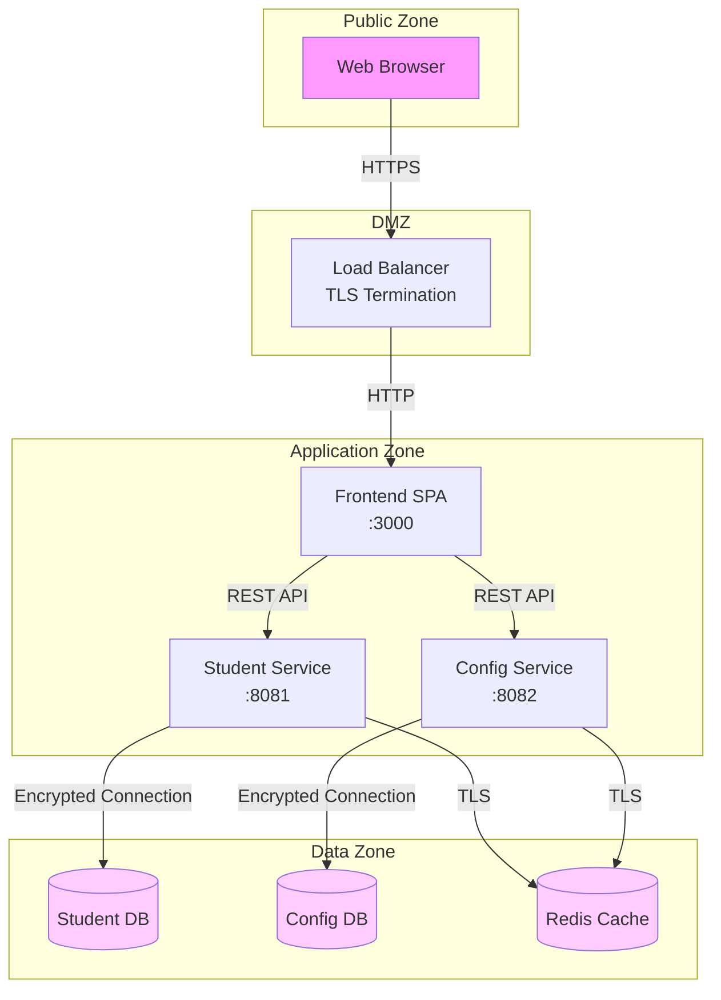
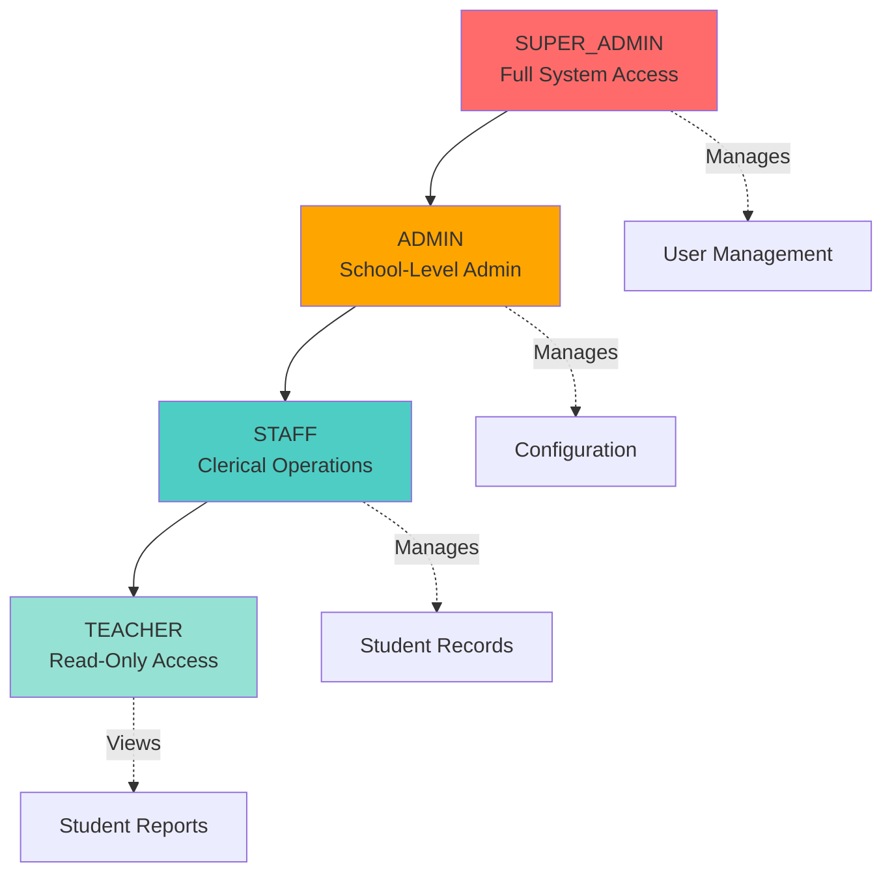
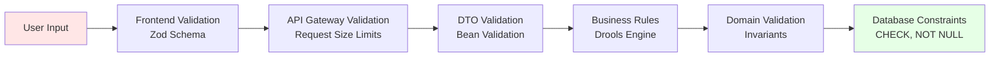
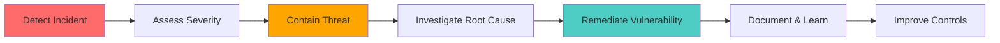

# Security Architecture Specification
**School Management System (SMS)**
Version: 1.0.0
Last Updated: 2026-01-28

---

## 1. Overview

This document defines the security controls, authentication mechanisms, and authorization policies for the School Management System. The architecture follows defense-in-depth principles with multiple layers of protection.

### 1.1 Security Objectives

- **Confidentiality**: Protect sensitive student data (PII, academic records)
- **Integrity**: Prevent unauthorized data modification
- **Availability**: Ensure system uptime and resilience against attacks
- **Auditability**: Maintain comprehensive logs of all security events
- **Compliance**: Align with data protection regulations (GDPR considerations)

---

## 2. Threat Model

### 2.1 Attack Vectors

| Threat | Risk Level | Mitigation |
|--------|-----------|------------|
| SQL Injection | HIGH | Prepared statements, ORM escaping |
| Cross-Site Scripting (XSS) | HIGH | Content Security Policy, input sanitization |
| Cross-Site Request Forgery (CSRF) | MEDIUM | CSRF tokens for state-changing operations |
| Broken Authentication | HIGH | Strong password policies, rate limiting |
| Sensitive Data Exposure | HIGH | TLS 1.3, field-level encryption |
| Mass Assignment | MEDIUM | DTO validation, explicit binding |
| Insecure Deserialization | MEDIUM | Whitelist-based deserialization |
| Insufficient Logging | MEDIUM | Structured logging with audit trail |

### 2.2 Security Zones


```mermaid
graph TB
    subgraph "Public Zone"
        BROWSER[Web Browser]
    end

    subgraph "DMZ"
        LB[Load Balancer<br/>TLS Termination]
    end

    subgraph "Application Zone"
        FE[Frontend SPA<br/>:3000]
        STUDENT[Student Service<br/>:8081]
        CONFIG[Config Service<br/>:8082]
    end

    subgraph "Data Zone"
        DB1[(Student DB)]
        DB2[(Config DB)]
        REDIS[(Redis Cache)]
    end

    BROWSER -->|HTTPS| LB
    LB -->|HTTP| FE
    FE -->|REST API| STUDENT
    FE -->|REST API| CONFIG
    STUDENT -->|Encrypted Connection| DB1
    CONFIG -->|Encrypted Connection| DB2
    STUDENT -->|TLS| REDIS
    CONFIG -->|TLS| REDIS

    style BROWSER fill:#f9f
    style DB1 fill:#fcf
    style DB2 fill:#fcf
    style REDIS fill:#fcf
```

---

## 3. Authentication

### 3.1 Phase 1: Basic Authentication

**Scope**: Username/password authentication (externalized auth mechanism assumed).

**Implementation Notes**:
- Authentication is **out of scope** for Phase 1 microservices
- Frontend assumes user is pre-authenticated
- Future phases will integrate with OAuth 2.0 / OIDC provider (Keycloak, Auth0)

**Headers**:
```http
Authorization: Bearer <JWT_TOKEN>
X-User-ID: user-12345
X-User-Role: ADMIN
```

### 3.2 Future: JWT-Based Authentication

**Token Structure**:
```json
{
  "sub": "user-12345",
  "email": "admin@school.com",
  "roles": ["ADMIN", "STAFF"],
  "permissions": ["student:read", "student:write", "config:read"],
  "iss": "https://auth.school.com",
  "exp": 1706441234,
  "iat": 1706437634
}
```

**Spring Security Configuration** (future):
```java
@Configuration
@EnableWebSecurity
public class SecurityConfig {

    @Bean
    public SecurityFilterChain filterChain(HttpSecurity http) throws Exception {
        http
            .authorizeHttpRequests(auth -> auth
                .requestMatchers("/actuator/health").permitAll()
                .requestMatchers("/api/v1/students/**").hasAnyRole("ADMIN", "STAFF")
                .requestMatchers("/api/v1/configurations/**").hasRole("ADMIN")
                .anyRequest().authenticated()
            )
            .oauth2ResourceServer(oauth2 -> oauth2.jwt());

        return http.build();
    }
}
```

---

## 4. Authorization (RBAC)

### 4.1 Role Hierarchy


```mermaid
graph TD
    SUPER[SUPER_ADMIN<br/>Full System Access] --> ADMIN[ADMIN<br/>School-Level Admin]
    ADMIN --> STAFF[STAFF<br/>Clerical Operations]
    STAFF --> TEACHER[TEACHER<br/>Read-Only Access]

    SUPER -.->|Manages| USERS[User Management]
    ADMIN -.->|Manages| CONFIG[Configuration]
    STAFF -.->|Manages| STUDENTS[Student Records]
    TEACHER -.->|Views| REPORTS[Student Reports]

    style SUPER fill:#ff6b6b
    style ADMIN fill:#ffa500
    style STAFF fill:#4ecdc4
    style TEACHER fill:#95e1d3
```

### 4.2 Permission Matrix

| Resource | SUPER_ADMIN | ADMIN | STAFF | TEACHER |
|----------|------------|-------|-------|---------|
| **Students** |
| Create Student | ✅ | ✅ | ✅ | ❌ |
| Read Student | ✅ | ✅ | ✅ | ✅ (limited fields) |
| Update Student | ✅ | ✅ | ✅ | ❌ |
| Delete Student | ✅ | ✅ | ❌ | ❌ |
| **Enrollments** |
| Create Enrollment | ✅ | ✅ | ✅ | ❌ |
| Update Enrollment | ✅ | ✅ | ✅ | ❌ |
| View History | ✅ | ✅ | ✅ | ✅ |
| **Configurations** |
| Read Config | ✅ | ✅ | ✅ (GENERAL only) | ❌ |
| Update Config | ✅ | ✅ (ACADEMIC, GENERAL) | ❌ | ❌ |
| Delete Config | ✅ | ❌ | ❌ | ❌ |

### 4.3 Implementation Pattern

**Method-Level Security**:
```java
@RestController
@RequestMapping("/api/v1/students")
public class StudentController {

    @GetMapping("/{studentId}")
    @PreAuthorize("hasAnyRole('ADMIN', 'STAFF', 'TEACHER')")
    public ResponseEntity<StudentResponse> getStudent(
        @PathVariable String studentId,
        @AuthenticationPrincipal UserDetails userDetails
    ) {
        // Field-level filtering based on role
        StudentResponse response = studentService.getStudent(studentId);
        return ResponseEntity.ok(filterSensitiveFields(response, userDetails));
    }

    @PostMapping
    @PreAuthorize("hasAnyRole('ADMIN', 'STAFF')")
    public ResponseEntity<StudentResponse> createStudent(
        @Valid @RequestBody StudentRequest request
    ) {
        StudentResponse response = studentService.registerStudent(request);
        return ResponseEntity.status(HttpStatus.CREATED).body(response);
    }

    @DeleteMapping("/{studentId}")
    @PreAuthorize("hasRole('ADMIN')")
    public ResponseEntity<Void> deleteStudent(@PathVariable String studentId) {
        studentService.deleteStudent(studentId);
        return ResponseEntity.noContent().build();
    }
}
```

**Field-Level Security** (sensitive data masking):
```java
public StudentResponse filterSensitiveFields(
    StudentResponse student,
    UserDetails user
) {
    if (user.getAuthorities().contains(new SimpleGrantedAuthority("ROLE_TEACHER"))) {
        student.setMobile("***");
        student.setEmail("***");
        student.setAadhaarNumber(null);
        student.setAddress("***");
    }
    return student;
}
```

---

## 5. Input Validation & Sanitization

### 5.1 Multi-Layer Validation


```mermaid
graph LR
    INPUT[User Input] --> FE[Frontend Validation<br/>Zod Schema]
    FE --> API[API Gateway Validation<br/>Request Size Limits]
    API --> DTO[DTO Validation<br/>Bean Validation]
    DTO --> DROOLS[Business Rules<br/>Drools Engine]
    DROOLS --> DOMAIN[Domain Validation<br/>Invariants]
    DOMAIN --> DB[Database Constraints<br/>CHECK, NOT NULL]

    style INPUT fill:#ffe6e6
    style DB fill:#e6ffe6
```

### 5.2 Bean Validation (Backend)

```java
public class StudentRequest {

    @NotBlank(message = "First name is required")
    @Size(min = 2, max = 100, message = "First name must be between 2 and 100 characters")
    @Pattern(regexp = "^[a-zA-Z\\s]+$", message = "Name must contain only letters and spaces")
    private String firstName;

    @NotBlank(message = "Last name is required")
    @Size(min = 2, max = 100)
    @Pattern(regexp = "^[a-zA-Z\\s]+$")
    private String lastName;

    @NotNull(message = "Date of birth is required")
    @Past(message = "Date of birth must be in the past")
    private LocalDate dateOfBirth;

    @NotBlank(message = "Mobile is required")
    @Pattern(regexp = "^\\d{10}$", message = "Mobile must be exactly 10 digits")
    private String mobile;

    @Email(message = "Invalid email format")
    private String email;

    @Pattern(regexp = "^\\d{12}$", message = "Aadhaar must be exactly 12 digits")
    private String aadhaarNumber;
}
```

### 5.3 Zod Schema (Frontend)

```typescript
import { z } from 'zod';

export const studentSchema = z.object({
  firstName: z
    .string()
    .min(2, 'First name must be at least 2 characters')
    .max(100)
    .regex(/^[a-zA-Z\s]+$/, 'Name must contain only letters'),

  lastName: z
    .string()
    .min(2, 'Last name must be at least 2 characters')
    .max(100)
    .regex(/^[a-zA-Z\s]+$/),

  dateOfBirth: z
    .date()
    .max(new Date(), 'Date of birth must be in the past')
    .refine(
      (date) => {
        const age = new Date().getFullYear() - date.getFullYear();
        return age >= 3 && age <= 18;
      },
      { message: 'Student must be between 3 and 18 years old' }
    ),

  mobile: z
    .string()
    .regex(/^\d{10}$/, 'Mobile must be exactly 10 digits'),

  email: z
    .string()
    .email('Invalid email format')
    .optional()
    .or(z.literal('')),

  aadhaarNumber: z
    .string()
    .regex(/^\d{12}$/, 'Aadhaar must be exactly 12 digits')
    .optional()
    .or(z.literal('')),
});

export type StudentFormData = z.infer<typeof studentSchema>;
```

---

## 6. SQL Injection Prevention

### 6.1 Secure Query Patterns

**Always Use Parameterized Queries**:
```java
// ✅ SAFE: JPA Named Query
@Query("SELECT s FROM Student s WHERE s.lastName = :lastName AND s.status = :status")
List<Student> findByLastNameAndStatus(
    @Param("lastName") String lastName,
    @Param("status") StudentStatus status
);

// ✅ SAFE: Criteria API
CriteriaBuilder cb = entityManager.getCriteriaBuilder();
CriteriaQuery<Student> query = cb.createQuery(Student.class);
Root<Student> root = query.from(Student.class);

query.select(root).where(
    cb.and(
        cb.equal(root.get("lastName"), lastName),
        cb.equal(root.get("status"), status)
    )
);

// ❌ UNSAFE: String Concatenation (NEVER DO THIS)
String sql = "SELECT * FROM students WHERE last_name = '" + lastName + "'";
```

### 6.2 ORM Best Practices

**Hibernate Configuration**:
```yaml
spring:
  jpa:
    properties:
      hibernate:
        format_sql: true
        use_sql_comments: true
        jdbc:
          batch_size: 20
        order_inserts: true
        order_updates: true
    hibernate:
      ddl-auto: validate  # Never use 'create' or 'update' in production
```

---

## 7. Cross-Site Scripting (XSS) Prevention

### 7.1 Content Security Policy

**HTTP Headers**:
```java
@Configuration
public class SecurityHeadersConfig {

    @Bean
    public SecurityFilterChain filterChain(HttpSecurity http) throws Exception {
        http.headers(headers -> headers
            .contentSecurityPolicy(csp -> csp
                .policyDirectives(
                    "default-src 'self'; " +
                    "script-src 'self' 'unsafe-inline'; " +
                    "style-src 'self' 'unsafe-inline'; " +
                    "img-src 'self' data:; " +
                    "font-src 'self' data:; " +
                    "connect-src 'self' http://localhost:8081 http://localhost:8082"
                )
            )
            .xssProtection(xss -> xss.headerValue("1; mode=block"))
            .frameOptions(frame -> frame.deny())
        );

        return http.build();
    }
}
```

### 7.2 Output Encoding

**React Automatic Escaping**:
```typescript
// ✅ SAFE: React automatically escapes text content
<p>{student.firstName}</p>

// ✅ SAFE: Escaping user-controlled URLs
<a href={sanitizeUrl(student.website)} target="_blank">Website</a>

// ❌ UNSAFE: dangerouslySetInnerHTML (avoid unless necessary)
<div dangerouslySetInnerHTML={{ __html: userInput }} />

// ✅ SAFE: Use DOMPurify for HTML content
import DOMPurify from 'dompurify';
<div dangerouslySetInnerHTML={{ __html: DOMPurify.sanitize(userInput) }} />
```

---

## 8. Cross-Site Request Forgery (CSRF) Protection

### 8.1 Token-Based Protection

**Spring Security CSRF**:
```java
@Configuration
public class CsrfConfig {

    @Bean
    public SecurityFilterChain filterChain(HttpSecurity http) throws Exception {
        http.csrf(csrf -> csrf
            .csrfTokenRepository(CookieCsrfTokenRepository.withHttpOnlyFalse())
            .csrfTokenRequestHandler(new SpaCsrfTokenRequestHandler())
        );

        return http.build();
    }
}

// Custom handler for SPA
final class SpaCsrfTokenRequestHandler extends CsrfTokenRequestAttributeHandler {
    private final CsrfTokenRequestHandler delegate = new XorCsrfTokenRequestAttributeHandler();

    @Override
    public void handle(HttpServletRequest request, HttpServletResponse response,
                       Supplier<CsrfToken> csrfToken) {
        this.delegate.handle(request, response, csrfToken);
    }

    @Override
    public String resolveCsrfTokenValue(HttpServletRequest request, CsrfToken csrfToken) {
        return this.delegate.resolveCsrfTokenValue(request, csrfToken);
    }
}
```

### 8.2 Frontend Implementation

**Axios Interceptor**:
```typescript
import axios from 'axios';
import Cookies from 'js-cookie';

const apiClient = axios.create({
  baseURL: import.meta.env.VITE_API_BASE_URL,
  withCredentials: true,
});

// Add CSRF token to all state-changing requests
apiClient.interceptors.request.use((config) => {
  const csrfToken = Cookies.get('XSRF-TOKEN');
  if (csrfToken && ['post', 'put', 'delete', 'patch'].includes(config.method)) {
    config.headers['X-XSRF-TOKEN'] = csrfToken;
  }
  return config;
});
```

---

## 9. Sensitive Data Protection

### 9.1 Data Classification

| Data Type | Classification | Protection Required |
|-----------|---------------|---------------------|
| Student Name | PII | Access control, audit logging |
| Mobile Number | PII | Encryption at rest, masked display |
| Aadhaar Number | Sensitive PII | Field-level encryption, strict access |
| Email | PII | Access control |
| Address | PII | Access control |
| Date of Birth | PII | Access control |
| Configuration Values | Confidential | Encryption flag support |

### 9.2 Field-Level Encryption

**Database Encryption**:
```java
@Entity
@Table(name = "students")
public class Student {

    @Column(name = "aadhaar_number")
    @Convert(converter = AadhaarEncryptionConverter.class)
    private String aadhaarNumber;
}

@Converter
public class AadhaarEncryptionConverter implements AttributeConverter<String, String> {

    private static final String ALGORITHM = "AES/GCM/NoPadding";
    private final SecretKey secretKey;

    public AadhaarEncryptionConverter() {
        // Load encryption key from environment variable
        String keyString = System.getenv("FIELD_ENCRYPTION_KEY");
        this.secretKey = new SecretKeySpec(Base64.getDecoder().decode(keyString), "AES");
    }

    @Override
    public String convertToDatabaseColumn(String attribute) {
        if (attribute == null) return null;
        try {
            Cipher cipher = Cipher.getInstance(ALGORITHM);
            cipher.init(Cipher.ENCRYPT_MODE, secretKey);
            byte[] encrypted = cipher.doFinal(attribute.getBytes(StandardCharsets.UTF_8));
            return Base64.getEncoder().encodeToString(encrypted);
        } catch (Exception e) {
            throw new RuntimeException("Encryption failed", e);
        }
    }

    @Override
    public String convertToEntityAttribute(String dbData) {
        if (dbData == null) return null;
        try {
            Cipher cipher = Cipher.getInstance(ALGORITHM);
            cipher.init(Cipher.DECRYPT_MODE, secretKey);
            byte[] decrypted = cipher.doFinal(Base64.getDecoder().decode(dbData));
            return new String(decrypted, StandardCharsets.UTF_8);
        } catch (Exception e) {
            throw new RuntimeException("Decryption failed", e);
        }
    }
}
```

### 9.3 TLS/SSL Configuration

**HTTPS Enforcement**:
```yaml
# application-prod.yml
server:
  port: 8443
  ssl:
    enabled: true
    key-store: classpath:keystore.p12
    key-store-password: ${SSL_KEYSTORE_PASSWORD}
    key-store-type: PKCS12
    key-alias: school-management

# Force HTTPS redirect
security:
  require-ssl: true
```

**PostgreSQL SSL**:
```yaml
spring:
  datasource:
    url: jdbc:postgresql://localhost:5432/student_db?ssl=true&sslmode=require&sslcert=client-cert.pem&sslkey=client-key.pem&sslrootcert=server-ca.pem
```

---

## 10. Audit Logging

### 10.1 Security Event Logging

**Events to Log**:
- Authentication attempts (success/failure)
- Authorization failures
- Data access (read sensitive PII)
- Data modification (create/update/delete)
- Configuration changes
- Failed validation attempts
- Suspicious activity patterns

**Structured Logging Format**:
```java
@Aspect
@Component
public class SecurityAuditAspect {

    private static final Logger auditLog = LoggerFactory.getLogger("SECURITY_AUDIT");

    @AfterReturning(
        pointcut = "execution(* com.school.student.service.StudentService.deleteStudent(..))",
        returning = "result"
    )
    public void logStudentDeletion(JoinPoint joinPoint) {
        Object[] args = joinPoint.getArgs();
        String studentId = (String) args[0];

        auditLog.info("Student record deleted",
            kv("event", "STUDENT_DELETED"),
            kv("studentId", studentId),
            kv("userId", SecurityContextHolder.getContext().getAuthentication().getName()),
            kv("timestamp", Instant.now()),
            kv("ipAddress", getCurrentRequestIP())
        );
    }

    @AfterThrowing(
        pointcut = "execution(* com.school.student.controller.*.*(..))",
        throwing = "exception"
    )
    public void logSecurityException(JoinPoint joinPoint, Exception exception) {
        if (exception instanceof AccessDeniedException) {
            auditLog.warn("Authorization failure",
                kv("event", "ACCESS_DENIED"),
                kv("method", joinPoint.getSignature().toShortString()),
                kv("userId", SecurityContextHolder.getContext().getAuthentication().getName()),
                kv("reason", exception.getMessage())
            );
        }
    }
}
```

### 10.2 Log Retention Policy

| Log Type | Retention Period | Storage Location |
|----------|------------------|------------------|
| Application Logs | 30 days | Local disk + centralized logging |
| Security Audit Logs | 1 year | Immutable storage (S3/WORM) |
| Access Logs | 90 days | Load balancer logs |
| Database Audit Logs | 6 months | PostgreSQL audit extension |

---

## 11. Rate Limiting & DDoS Protection

### 11.1 API Rate Limiting

**Bucket4j Implementation**:
```java
@Component
public class RateLimitingFilter extends OncePerRequestFilter {

    private final Map<String, Bucket> cache = new ConcurrentHashMap<>();

    @Override
    protected void doFilterInternal(
        HttpServletRequest request,
        HttpServletResponse response,
        FilterChain filterChain
    ) throws ServletException, IOException {

        String clientId = getClientIdentifier(request);
        Bucket bucket = resolveBucket(clientId);

        if (bucket.tryConsume(1)) {
            filterChain.doFilter(request, response);
        } else {
            response.setStatus(429); // Too Many Requests
            response.getWriter().write("Rate limit exceeded. Try again later.");
        }
    }

    private Bucket resolveBucket(String clientId) {
        return cache.computeIfAbsent(clientId, k -> {
            Bandwidth limit = Bandwidth.classic(100, Refill.intervally(100, Duration.ofMinutes(1)));
            return Bucket.builder().addLimit(limit).build();
        });
    }

    private String getClientIdentifier(HttpServletRequest request) {
        String userId = request.getHeader("X-User-ID");
        return userId != null ? userId : request.getRemoteAddr();
    }
}
```

### 11.2 Rate Limits by Endpoint

| Endpoint | Rate Limit | Window | User Role |
|----------|-----------|--------|-----------|
| POST /students | 10 requests | 1 minute | STAFF |
| GET /students | 100 requests | 1 minute | ALL |
| PUT /students/{id} | 20 requests | 1 minute | STAFF |
| DELETE /students/{id} | 5 requests | 1 minute | ADMIN |
| POST /configurations | 5 requests | 5 minutes | ADMIN |

---

## 12. Dependency Security

### 12.1 Vulnerability Scanning

**Maven Dependency Check**:
```xml
<plugin>
    <groupId>org.owasp</groupId>
    <artifactId>dependency-check-maven</artifactId>
    <version>9.0.0</version>
    <executions>
        <execution>
            <goals>
                <goal>check</goal>
            </goals>
        </execution>
    </executions>
    <configuration>
        <failBuildOnCVSS>7</failBuildOnCVSS>
    </configuration>
</plugin>
```

**Automated Scanning**:
```yaml
# .github/workflows/security-scan.yml
name: Security Scan
on: [push, pull_request]
jobs:
  scan:
    runs-on: ubuntu-latest
    steps:
      - uses: actions/checkout@v3
      - name: Run Trivy vulnerability scanner
        uses: aquasecurity/trivy-action@master
        with:
          scan-type: 'fs'
          severity: 'CRITICAL,HIGH'
```

### 12.2 Dependency Update Policy

- **Critical Vulnerabilities**: Patch within 24 hours
- **High Vulnerabilities**: Patch within 7 days
- **Medium Vulnerabilities**: Patch within 30 days
- **Automated Dependency Updates**: Dependabot enabled

---

## 13. Secure Configuration Management

### 13.1 Secrets Management

**Environment Variable Pattern**:
```yaml
# application-prod.yml
spring:
  datasource:
    url: ${DB_URL}
    username: ${DB_USERNAME}
    password: ${DB_PASSWORD}

encryption:
  field-key: ${FIELD_ENCRYPTION_KEY}

redis:
  password: ${REDIS_PASSWORD}
```

**Docker Secrets**:
```yaml
# docker-compose.yml
services:
  student-service:
    image: sms/student-service:latest
    secrets:
      - db_password
      - encryption_key

secrets:
  db_password:
    external: true
  encryption_key:
    external: true
```

### 13.2 Configuration Encryption

**Spring Cloud Config Encryption**:
```bash
# Encrypt sensitive values
curl -X POST http://config-server:8888/encrypt \
  -d "MySecretPassword"

# Result: {cipher}AQA1s2d3f4g5h6j7k8l9
```

**application.yml**:
```yaml
spring:
  datasource:
    password: '{cipher}AQA1s2d3f4g5h6j7k8l9'
```

---

## 14. Incident Response Plan

### 14.1 Security Incident Classification

| Severity | Examples | Response Time | Escalation |
|----------|----------|---------------|------------|
| **Critical** | Data breach, system compromise | <1 hour | CTO, Legal |
| **High** | Authentication bypass, SQLi exploit | <4 hours | Dev Lead, Security Team |
| **Medium** | Failed login attempts spike, XSS attempt | <24 hours | Dev Team |
| **Low** | Single failed validation, misconfiguration | <7 days | Monitoring only |

### 14.2 Response Workflow


```mermaid
graph LR
    DETECT[Detect Incident] --> ASSESS[Assess Severity]
    ASSESS --> CONTAIN[Contain Threat]
    CONTAIN --> INVESTIGATE[Investigate Root Cause]
    INVESTIGATE --> REMEDIATE[Remediate Vulnerability]
    REMEDIATE --> DOCUMENT[Document & Learn]
    DOCUMENT --> IMPROVE[Improve Controls]

    style DETECT fill:#ff6b6b
    style CONTAIN fill:#ffa500
    style REMEDIATE fill:#4ecdc4
```

### 14.3 Communication Plan

**Critical Incident Template**:
```
SUBJECT: [CRITICAL] Security Incident - Student Management System

INCIDENT SUMMARY:
- Date/Time: 2026-01-28 14:35 UTC
- System Affected: Student Service (:8081)
- Severity: HIGH
- Status: CONTAINED

DESCRIPTION:
[Brief description of the incident]

IMMEDIATE ACTIONS TAKEN:
1. Disabled affected API endpoint
2. Isolated compromised service
3. Initiated forensic logging

NEXT STEPS:
1. Root cause analysis (ETA: 2 hours)
2. Patch deployment (ETA: 4 hours)
3. Post-mortem report (ETA: 24 hours)

CONTACT: security@school.com
```

---

## 15. Compliance & Standards

### 15.1 Data Protection Compliance

**GDPR Principles**:
- **Right to Access**: Students/guardians can request their data
- **Right to Erasure**: Implement soft delete with retention policy
- **Data Minimization**: Collect only necessary fields
- **Purpose Limitation**: Use data only for stated purposes

**Implementation**:
```java
@RestController
@RequestMapping("/api/v1/gdpr")
public class GdprController {

    @GetMapping("/export/{studentId}")
    @PreAuthorize("hasRole('ADMIN')")
    public ResponseEntity<byte[]> exportStudentData(@PathVariable String studentId) {
        // Generate JSON export of all student data
        byte[] data = gdprService.exportAllData(studentId);
        return ResponseEntity.ok()
            .header("Content-Disposition", "attachment; filename=student-data.json")
            .body(data);
    }

    @DeleteMapping("/forget/{studentId}")
    @PreAuthorize("hasRole('ADMIN')")
    public ResponseEntity<Void> anonymizeStudent(@PathVariable String studentId) {
        // Soft delete + PII anonymization
        gdprService.anonymizePersonalData(studentId);
        return ResponseEntity.noContent().build();
    }
}
```

### 15.2 Security Standards Alignment

- **OWASP Top 10**: All mitigations implemented
- **CWE/SANS Top 25**: Continuous monitoring
- **ISO 27001**: Information security management principles

---

## 16. Security Testing

### 16.1 Automated Security Tests

**SQL Injection Test**:
```java
@SpringBootTest
@AutoConfigureMockMvc
class SecurityIntegrationTest {

    @Autowired
    private MockMvc mockMvc;

    @Test
    @DisplayName("Should reject SQL injection attempt in last name search")
    void shouldRejectSqlInjection() throws Exception {
        String maliciousInput = "Doe'; DROP TABLE students; --";

        mockMvc.perform(get("/api/v1/students")
                .param("lastName", maliciousInput))
            .andExpect(status().isOk())
            .andExpect(result -> {
                // Verify no students returned (input treated as literal string)
                String content = result.getResponse().getContentAsString();
                assertThat(content).contains("\"content\":[]");
            });

        // Verify table still exists
        assertThat(studentRepository.count()).isGreaterThan(0);
    }
}
```

### 16.2 Penetration Testing Schedule

- **Frequency**: Quarterly
- **Scope**: All public-facing APIs
- **Tools**: OWASP ZAP, Burp Suite, Nikto
- **Report**: Executive summary + detailed findings

---

## Appendix A: Security Checklist

### Pre-Deployment Checklist

- [ ] All dependencies scanned for vulnerabilities
- [ ] No hardcoded credentials in codebase
- [ ] Database credentials externalized to environment variables
- [ ] TLS/SSL enabled for all connections
- [ ] CSRF protection enabled for state-changing operations
- [ ] Content Security Policy headers configured
- [ ] Rate limiting implemented on all endpoints
- [ ] Input validation enforced at all layers
- [ ] Audit logging enabled for sensitive operations
- [ ] Error messages do not leak sensitive information
- [ ] Default admin credentials changed
- [ ] Security headers configured (X-Frame-Options, X-Content-Type-Options)
- [ ] SQL queries use parameterized statements only
- [ ] File upload validation implemented (if applicable)
- [ ] Session timeout configured appropriately

---

## Appendix B: Security Tools

| Tool | Purpose | Integration Point |
|------|---------|-------------------|
| **OWASP Dependency-Check** | Dependency vulnerability scanning | Maven build |
| **SonarQube** | Static code analysis | CI/CD pipeline |
| **Trivy** | Container image scanning | Docker build |
| **ZAP** | Dynamic application security testing | Pre-production |
| **Vault** | Secrets management | Runtime (future) |
| **Falco** | Runtime security monitoring | Kubernetes (future) |

---

**Document Status**: Final
**Next Review**: 2026-04-28
