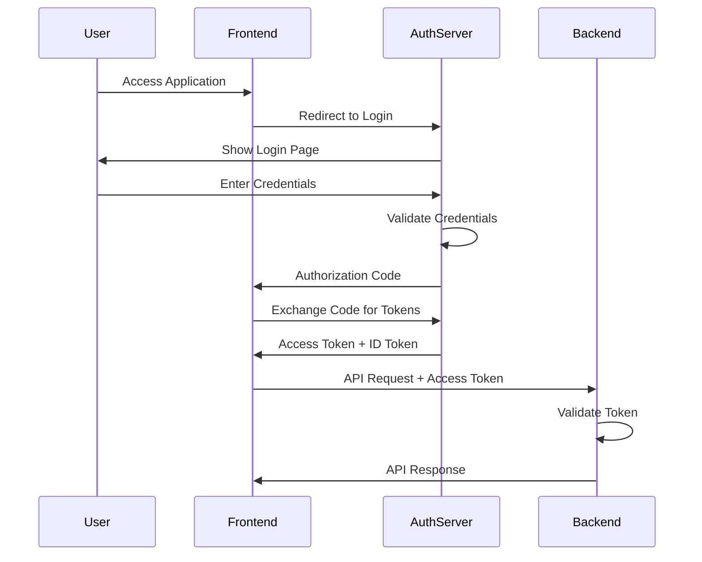

# Security Architecture
**School Management System - Security Design & Implementation**

**Version**: 1.0
**Date**: 2026-01-15
**Status**: Active

---

## Table of Contents

1. [Overview](#overview)
2. [Security Principles](#security-principles)
3. [Phase 1 Security (Current)](#phase-1-security-current)
4. [Authentication Strategy (Future)](#authentication-strategy-future)
5. [Authorization & RBAC](#authorization--rbac)
6. [Input Validation & Sanitization](#input-validation--sanitization)
7. [SQL Injection Prevention](#sql-injection-prevention)
8. [XSS Prevention](#xss-prevention)
9. [CSRF Protection](#csrf-protection)
10. [Data Protection](#data-protection)
11. [API Security](#api-security)
12. [Security Monitoring](#security-monitoring)

---

## Overview

### Security Posture

The School Management System implements a **defense-in-depth** security strategy with multiple layers of protection:

1. **Network Layer**: HTTPS, CORS, Rate Limiting
2. **Application Layer**: Authentication, Authorization, Input Validation
3. **Data Layer**: Encryption, Access Control, Audit Logging
4. **Infrastructure Layer**: Container Security, Secrets Management

### Security Scope

**Phase 1 (Current)**:
- Input validation and sanitization
- SQL injection prevention
- XSS prevention
- CSRF protection (basic)
- CORS configuration
- Secure database connections

**Phase 2 (Future)**:
- OAuth 2.0 / OpenID Connect authentication
- JWT-based authorization
- Role-Based Access Control (RBAC)
- API rate limiting
- Audit logging
- Encryption at rest

---

## Security Principles

### 1. Defense in Depth

Multiple layers of security controls:
- Validate at frontend AND backend
- Database constraints as last line of defense
- Network-level protections (firewall, HTTPS)

### 2. Principle of Least Privilege

- Database users have minimal required permissions
- API endpoints restrict access based on roles (future)
- Services access only their own databases

### 3. Fail Securely

- Default to deny access
- Graceful error handling without exposing internals
- Secure error messages (no stack traces in production)

### 4. Security by Design

- Security requirements in every user story
- Security review in code review process
- Regular security testing

### 5. Zero Trust

- Trust no input (validate everything)
- Verify every request
- Assume breach mentality

---

## Phase 1 Security (Current)

### Current Security Controls

| Control | Implementation | Status |
|---------|----------------|--------|
| Input Validation | Jakarta Validation, Drools | Implemented |
| SQL Injection Prevention | JPA/Hibernate Prepared Statements | Implemented |
| XSS Prevention | React auto-escaping, CSP headers | Implemented |
| CORS Configuration | Spring CORS filter | Implemented |
| CSRF Protection | SameSite cookies (future) | Planned |
| HTTPS | TLS 1.3 (production) | Planned |
| Authentication | External system (out of scope) | Future |
| Authorization | No role-based access | Future |

### Assumptions

1. **No Authentication**: Phase 1 assumes authentication is handled by an external system
2. **Single School**: No multi-tenancy, no data isolation between organizations
3. **Trusted Network**: Internal network or VPN required
4. **Basic Authorization**: All users have equal access (no role differentiation)

---

## Authentication Strategy (Future)

### Authentication Flow (Phase 2)

**Recommended Approach**: OAuth 2.0 with OpenID Connect (OIDC)


```mermaid
sequenceDiagram
    participant User
    participant Frontend
    participant AuthServer
    participant Backend

    User->>Frontend: Access Application
    Frontend->>AuthServer: Redirect to Login
    AuthServer->>User: Show Login Page
    User->>AuthServer: Enter Credentials
    AuthServer->>AuthServer: Validate Credentials
    AuthServer->>Frontend: Authorization Code
    Frontend->>AuthServer: Exchange Code for Tokens
    AuthServer->>Frontend: Access Token + ID Token
    Frontend->>Backend: API Request + Access Token
    Backend->>Backend: Validate Token
    Backend->>Frontend: API Response
```

### Token-Based Authentication

**JWT (JSON Web Token) Structure**:

```json
{
  "header": {
    "alg": "RS256",
    "typ": "JWT"
  },
  "payload": {
    "sub": "user@school.com",
    "name": "John Doe",
    "roles": ["ADMIN", "STAFF"],
    "iss": "https://auth.school.com",
    "exp": 1737036000,
    "iat": 1737032400
  },
  "signature": "..."
}
```

### Token Validation (Backend)

```java
@Configuration
@EnableWebSecurity
public class SecurityConfig {

    @Bean
    public SecurityFilterChain securityFilterChain(HttpSecurity http) throws Exception {
        http
            .oauth2ResourceServer(oauth2 -> oauth2
                .jwt(jwt -> jwt
                    .decoder(jwtDecoder())
                )
            )
            .authorizeHttpRequests(auth -> auth
                .requestMatchers("/actuator/health").permitAll()
                .requestMatchers("/api/v1/**").authenticated()
                .anyRequest().denyAll()
            );
        return http.build();
    }

    @Bean
    public JwtDecoder jwtDecoder() {
        // Configure JWT validation
        return NimbusJwtDecoder.withJwkSetUri("https://auth.school.com/.well-known/jwks.json")
            .build();
    }
}
```

### Token Storage (Frontend)

**Secure Storage Options**:

1. **HttpOnly Cookies** (Recommended)
   - Not accessible via JavaScript
   - Automatic inclusion in requests
   - Protects against XSS

2. **SessionStorage** (Alternative)
   - Cleared when tab closes
   - Not shared across tabs
   - Vulnerable to XSS

3. **LocalStorage** (NOT Recommended)
   - Persists across sessions
   - Shared across tabs
   - Vulnerable to XSS

**Implementation**:
```typescript
// Store token in HttpOnly cookie (backend sets cookie)
axios.defaults.withCredentials = true;

// OR store in memory (React Context)
const AuthContext = createContext<AuthContextType>(null);

export const AuthProvider = ({ children }) => {
  const [accessToken, setAccessToken] = useState<string | null>(null);

  // Token stored in component state, lost on refresh
  // Requires refresh token mechanism
};
```

---

## Authorization & RBAC

### Role Hierarchy

```
SUPER_ADMIN (Future: System-wide administration)
    ↓
ADMIN (School administrator - full access)
    ↓
STAFF (Clerical staff - student registration)
    ↓
TEACHER (Future: Limited access to student info)
    ↓
PARENT (Future: View own child's info only)
```

### Permission Matrix

| Operation | SUPER_ADMIN | ADMIN | STAFF | TEACHER |
|-----------|-------------|-------|-------|---------|
| Register Student | ✅ | ✅ | ✅ | ❌ |
| View All Students | ✅ | ✅ | ✅ | ✅ (Limited) |
| Update Student | ✅ | ✅ | ✅ (Restricted) | ❌ |
| Delete Student | ✅ | ✅ | ❌ | ❌ |
| Manage Configurations | ✅ | ✅ | ❌ | ❌ |
| View Configurations | ✅ | ✅ | ✅ | ✅ (Read-only) |

### Spring Security Authorization

```java
@PreAuthorize("hasRole('ADMIN') or hasRole('STAFF')")
@PostMapping("/api/v1/students")
public ResponseEntity<StudentResponse> registerStudent(@RequestBody StudentCreateRequest request) {
    // Only ADMIN and STAFF can register students
}

@PreAuthorize("hasRole('ADMIN')")
@DeleteMapping("/api/v1/students/{studentId}")
public ResponseEntity<Void> deleteStudent(@PathVariable String studentId) {
    // Only ADMIN can delete students
}

@PreAuthorize("hasAnyRole('ADMIN', 'STAFF', 'TEACHER')")
@GetMapping("/api/v1/students")
public ResponseEntity<List<StudentResponse>> listStudents() {
    // All authenticated users can view students
}
```

### Method-Level Security

```java
@Service
public class StudentApplicationService {

    @Secured("ROLE_ADMIN")
    public void deleteStudent(String studentId) {
        // Only ADMIN can call this method
    }

    @PreAuthorize("hasRole('ADMIN') or #studentId == authentication.principal.studentId")
    public Student getStudentDetails(String studentId) {
        // ADMIN can view any student, others only themselves
    }
}
```

---

## Input Validation & Sanitization

### Multi-Layer Validation

```
Frontend Validation (Zod)
    ↓
Backend DTO Validation (Jakarta Validation)
    ↓
Business Rules Validation (Drools)
    ↓
Database Constraints (PostgreSQL CHECK)
```

### Frontend Validation (Zod)

```typescript
import { z } from 'zod';

const studentSchema = z.object({
  firstName: z.string()
    .min(2, 'First name must be at least 2 characters')
    .max(100, 'First name cannot exceed 100 characters')
    .regex(/^[a-zA-Z\s]+$/, 'First name can only contain letters and spaces'),

  lastName: z.string()
    .min(2, 'Last name must be at least 2 characters')
    .max(100, 'Last name cannot exceed 100 characters')
    .regex(/^[a-zA-Z\s]+$/, 'Last name can only contain letters and spaces'),

  mobile: z.string()
    .regex(/^\d{10}$/, 'Mobile number must be exactly 10 digits'),

  email: z.string()
    .email('Please enter a valid email address'),

  dateOfBirth: z.string()
    .refine((dob) => {
      const age = calculateAge(dob);
      return age >= 3 && age <= 18;
    }, 'Student age must be between 3 and 18 years'),

  adhaarNumber: z.string()
    .regex(/^\d{12}$/, 'Adhaar number must be exactly 12 digits')
    .optional(),

  address: z.string()
    .min(10, 'Address must be at least 10 characters')
    .max(500, 'Address cannot exceed 500 characters')
});

type StudentFormData = z.infer<typeof studentSchema>;
```

### Backend DTO Validation (Jakarta)

```java
public class StudentCreateRequest {

    @NotBlank(message = "First name is required")
    @Size(min = 2, max = 100, message = "First name must be between 2 and 100 characters")
    @Pattern(regexp = "^[a-zA-Z\\s]+$", message = "First name can only contain letters and spaces")
    private String firstName;

    @NotBlank(message = "Last name is required")
    @Size(min = 2, max = 100, message = "Last name must be between 2 and 100 characters")
    @Pattern(regexp = "^[a-zA-Z\\s]+$", message = "Last name can only contain letters and spaces")
    private String lastName;

    @NotNull(message = "Date of birth is required")
    @Past(message = "Date of birth must be in the past")
    private LocalDate dateOfBirth;

    @NotBlank(message = "Mobile number is required")
    @Pattern(regexp = "^\\d{10}$", message = "Mobile number must be exactly 10 digits")
    private String mobile;

    @NotBlank(message = "Email is required")
    @Email(message = "Please provide a valid email address")
    private String email;

    @Pattern(regexp = "^\\d{12}$", message = "Adhaar number must be exactly 12 digits")
    private String aadhaarNumber;

    @NotBlank(message = "Address is required")
    @Size(min = 10, max = 500, message = "Address must be between 10 and 500 characters")
    private String address;
}
```

### Validation Exception Handler

```java
@RestControllerAdvice
public class GlobalExceptionHandler {

    @ExceptionHandler(MethodArgumentNotValidException.class)
    @ResponseStatus(HttpStatus.BAD_REQUEST)
    public ErrorResponse handleValidationException(MethodArgumentNotValidException ex) {
        Map<String, String> errors = new HashMap<>();

        ex.getBindingResult().getFieldErrors().forEach(error ->
            errors.put(error.getField(), error.getDefaultMessage())
        );

        return ErrorResponse.builder()
            .type("https://api.school.com/errors/validation-error")
            .title("Validation Error")
            .status(HttpStatus.BAD_REQUEST.value())
            .detail("One or more fields have validation errors")
            .errors(errors)
            .timestamp(Instant.now())
            .build();
    }
}
```

### Input Sanitization

**HTML Escaping** (Automatic in React):
```typescript
// React automatically escapes HTML
<div>{studentName}</div>  // Safe, even if studentName contains <script>
```

**Manual Sanitization** (for rich text - future):
```typescript
import DOMPurify from 'dompurify';

const sanitizedHtml = DOMPurify.sanitize(userInput);
```

---

## SQL Injection Prevention

### Strategy: Parameterized Queries

**Never concatenate SQL strings with user input**

### JPA Query Methods (Safe)

```java
public interface StudentRepository extends JpaRepository<Student, Long> {

    // Spring Data JPA generates safe queries
    Optional<Student> findByStudentId(String studentId);

    List<Student> findByLastNameContainingIgnoreCase(String lastName);

    boolean existsByMobileAndIdNot(String mobile, Long id);
}
```

### JPQL Queries (Safe with Named Parameters)

```java
@Query("SELECT s FROM Student s WHERE s.lastName LIKE %:lastName% AND s.status = :status")
List<Student> searchStudents(@Param("lastName") String lastName, @Param("status") String status);
```

### Native Queries (Safe with Parameter Binding)

```java
@Query(value = "SELECT * FROM students WHERE mobile = ?1 AND status = ?2", nativeQuery = true)
Optional<Student> findByMobileAndStatus(String mobile, String status);
```

### Dangerous Pattern (NEVER DO THIS)

```java
// ❌ VULNERABLE TO SQL INJECTION
String sql = "SELECT * FROM students WHERE last_name = '" + lastName + "'";
entityManager.createNativeQuery(sql);

// ✅ SAFE
String sql = "SELECT * FROM students WHERE last_name = :lastName";
entityManager.createNativeQuery(sql)
    .setParameter("lastName", lastName);
```

### Database Prepared Statements

**Hibernate/JPA automatically uses prepared statements**:

```sql
-- Hibernate generates
PREPARE stmt FROM 'SELECT * FROM students WHERE student_id = ?';
EXECUTE stmt USING @studentId;
```

---

## XSS Prevention

### Cross-Site Scripting (XSS) Attack Types

1. **Reflected XSS**: Malicious script in URL, reflected in response
2. **Stored XSS**: Malicious script stored in database, executed on retrieval
3. **DOM-based XSS**: Client-side script manipulation

### Frontend Protection

#### 1. React Auto-Escaping

React automatically escapes JSX content:

```typescript
// Safe: React escapes HTML entities
const studentName = "<script>alert('XSS')</script>";
return <div>{studentName}</div>;
// Renders: &lt;script&gt;alert('XSS')&lt;/script&gt;
```

#### 2. Dangerous Patterns to Avoid

```typescript
// ❌ DANGEROUS: dangerouslySetInnerHTML
<div dangerouslySetInnerHTML={{ __html: userInput }} />

// ❌ DANGEROUS: Direct DOM manipulation
document.getElementById('output').innerHTML = userInput;

// ✅ SAFE: Use React state and JSX
<div>{userInput}</div>
```

#### 3. Content Security Policy (CSP)

**HTTP Header**:

```
Content-Security-Policy:
  default-src 'self';
  script-src 'self' 'unsafe-inline' 'unsafe-eval';
  style-src 'self' 'unsafe-inline';
  img-src 'self' data: https:;
  font-src 'self' data:;
  connect-src 'self' http://localhost:8081 http://localhost:8082;
  frame-ancestors 'none';
```

**Implementation** (Spring Boot):

```java
@Configuration
public class SecurityHeadersConfig {

    @Bean
    public FilterRegistrationBean<ContentSecurityPolicyFilter> cspFilter() {
        FilterRegistrationBean<ContentSecurityPolicyFilter> registrationBean = new FilterRegistrationBean<>();

        registrationBean.setFilter(new ContentSecurityPolicyFilter());
        registrationBean.addUrlPatterns("/*");

        return registrationBean;
    }
}

public class ContentSecurityPolicyFilter implements Filter {
    @Override
    public void doFilter(ServletRequest request, ServletResponse response, FilterChain chain)
            throws IOException, ServletException {
        HttpServletResponse httpResponse = (HttpServletResponse) response;
        httpResponse.setHeader("Content-Security-Policy",
            "default-src 'self'; script-src 'self' 'unsafe-inline'; style-src 'self' 'unsafe-inline'");
        chain.doFilter(request, response);
    }
}
```

### Backend Protection

**Always encode output** (Spring MVC does this automatically):

```java
@RestController
public class StudentController {

    @GetMapping("/api/v1/students/{studentId}")
    public ResponseEntity<StudentResponse> getStudent(@PathVariable String studentId) {
        // Spring automatically JSON-encodes response
        // Special characters like <, >, & are escaped
        return ResponseEntity.ok(studentService.getStudent(studentId));
    }
}
```

---

## CSRF Protection

### Cross-Site Request Forgery (CSRF)

**Attack Scenario**:
1. User logs into schoolms.com
2. User visits malicious site evilsite.com
3. evilsite.com triggers hidden request to schoolms.com/api/students (DELETE)
4. Browser includes authentication cookies
5. Student deleted without user knowledge

### Protection Strategy

#### 1. SameSite Cookies (Primary Defense)

```java
@Bean
public CookieSerializer cookieSerializer() {
    DefaultCookieSerializer serializer = new DefaultCookieSerializer();
    serializer.setSameSite("Strict");  // or "Lax"
    serializer.setUseHttpOnlyCookie(true);
    serializer.setUseSecureCookie(true);
    return serializer;
}
```

**SameSite Values**:
- `Strict`: Cookie never sent on cross-site requests
- `Lax`: Cookie sent on top-level navigations (GET only)
- `None`: Cookie sent on all requests (requires Secure flag)

#### 2. CSRF Tokens (Future with Authentication)

```java
@Configuration
public class SecurityConfig {

    @Bean
    public SecurityFilterChain securityFilterChain(HttpSecurity http) throws Exception {
        http
            .csrf(csrf -> csrf
                .csrfTokenRepository(CookieCsrfTokenRepository.withHttpOnlyFalse())
            );
        return http.build();
    }
}
```

**Frontend Implementation**:

```typescript
// Axios automatically includes CSRF token from cookie
axios.defaults.xsrfCookieName = 'XSRF-TOKEN';
axios.defaults.xsrfHeaderName = 'X-XSRF-TOKEN';
```

#### 3. Custom Request Headers

**API requires custom header**:

```typescript
axios.defaults.headers.common['X-Requested-With'] = 'XMLHttpRequest';
```

**Backend validates header presence**:

```java
@Component
public class CustomHeaderFilter implements Filter {
    @Override
    public void doFilter(ServletRequest request, ServletResponse response, FilterChain chain)
            throws IOException, ServletException {
        HttpServletRequest httpRequest = (HttpServletRequest) request;

        if (!"XMLHttpRequest".equals(httpRequest.getHeader("X-Requested-With"))) {
            ((HttpServletResponse) response).sendError(HttpServletResponse.SC_FORBIDDEN);
            return;
        }

        chain.doFilter(request, response);
    }
}
```

---

## Data Protection

### Sensitive Data Handling

**Sensitive Fields**:
- Aadhaar Number (National ID)
- Email addresses
- Mobile numbers
- Home addresses

### Data Masking (Future)

**Mask sensitive data in logs**:

```java
@Data
public class Student {
    private String firstName;
    private String lastName;

    @JsonProperty(access = JsonProperty.Access.WRITE_ONLY)
    private String aadhaarNumber;  // Not included in JSON response

    @ToString.Exclude  // Lombok: Exclude from toString()
    private String mobile;
}
```

**Custom Masking**:

```java
public String getMaskedAadhaar() {
    return aadhaarNumber.replaceAll("\\d(?=\\d{4})", "*");
    // Result: "********1234"
}
```

### Encryption at Rest (Future)

**Database-level encryption**:

```sql
-- PostgreSQL pgcrypto extension
CREATE EXTENSION IF NOT EXISTS pgcrypto;

-- Encrypt sensitive column
ALTER TABLE students
ADD COLUMN aadhaar_encrypted BYTEA;

UPDATE students
SET aadhaar_encrypted = pgp_sym_encrypt(aadhaar_number, 'encryption_key');
```

**Application-level encryption**:

```java
@Entity
@Table(name = "students")
public class Student {

    @Convert(converter = AadhaarEncryptionConverter.class)
    @Column(name = "aadhaar_number")
    private String aadhaarNumber;
}

@Converter
public class AadhaarEncryptionConverter implements AttributeConverter<String, String> {

    @Override
    public String convertToDatabaseColumn(String attribute) {
        // Encrypt before storing
        return encryptionService.encrypt(attribute);
    }

    @Override
    public String convertToEntityAttribute(String dbData) {
        // Decrypt after retrieving
        return encryptionService.decrypt(dbData);
    }
}
```

### Password Hashing (Future)

**BCrypt for password storage**:

```java
@Service
public class PasswordService {

    private final PasswordEncoder passwordEncoder = new BCryptPasswordEncoder(12);

    public String hashPassword(String plainPassword) {
        return passwordEncoder.encode(plainPassword);
    }

    public boolean verifyPassword(String plainPassword, String hashedPassword) {
        return passwordEncoder.matches(plainPassword, hashedPassword);
    }
}
```

---

## API Security

### CORS Configuration

**Allow frontend to access backend APIs**:

```java
@Configuration
public class CorsConfig {

    @Bean
    public WebMvcConfigurer corsConfigurer() {
        return new WebMvcConfigurer() {
            @Override
            public void addCorsMappings(CorsRegistry registry) {
                registry.addMapping("/api/**")
                    .allowedOrigins(
                        "http://localhost:3000",  // Development
                        "https://schoolms.com"     // Production
                    )
                    .allowedMethods("GET", "POST", "PUT", "DELETE", "PATCH")
                    .allowedHeaders("*")
                    .allowCredentials(true)
                    .maxAge(3600);
            }
        };
    }
}
```

### Rate Limiting (Future)

**Prevent API abuse and DDoS attacks**:

```java
@Configuration
public class RateLimitConfig {

    @Bean
    public RateLimiter rateLimiter() {
        return RateLimiter.of("studentApi", RateLimiterConfig.custom()
            .limitForPeriod(100)  // 100 requests
            .limitRefreshPeriod(Duration.ofMinutes(1))  // per minute
            .timeoutDuration(Duration.ofSeconds(5))
            .build());
    }
}

@RestController
@RequestMapping("/api/v1/students")
public class StudentController {

    @GetMapping
    @RateLimited(name = "studentApi")
    public ResponseEntity<List<StudentResponse>> listStudents() {
        // Rate limited endpoint
    }
}
```

### API Versioning

**Version APIs to prevent breaking changes**:

```java
// URL versioning
@RequestMapping("/api/v1/students")

// Header versioning (alternative)
@RequestMapping(value = "/api/students", headers = "X-API-Version=1")
```

### HTTPS Enforcement

**Redirect HTTP to HTTPS**:

```java
@Configuration
public class HttpsConfig {

    @Bean
    public ServletWebServerFactory servletContainer() {
        TomcatServletWebServerFactory tomcat = new TomcatServletWebServerFactory() {
            @Override
            protected void postProcessContext(Context context) {
                SecurityConstraint securityConstraint = new SecurityConstraint();
                securityConstraint.setUserConstraint("CONFIDENTIAL");
                SecurityCollection collection = new SecurityCollection();
                collection.addPattern("/*");
                securityConstraint.addCollection(collection);
                context.addConstraint(securityConstraint);
            }
        };
        tomcat.addAdditionalTomcatConnectors(redirectConnector());
        return tomcat;
    }

    private Connector redirectConnector() {
        Connector connector = new Connector(TomcatServletWebServerFactory.DEFAULT_PROTOCOL);
        connector.setScheme("http");
        connector.setPort(8080);
        connector.setSecure(false);
        connector.setRedirectPort(8443);
        return connector;
    }
}
```

---

## Security Monitoring

### Audit Logging

**Log security-relevant events**:

```java
@Aspect
@Component
public class AuditLoggingAspect {

    @Around("@annotation(Audited)")
    public Object logAudit(ProceedingJoinPoint joinPoint) throws Throwable {
        String methodName = joinPoint.getSignature().getName();
        Object[] args = joinPoint.getArgs();

        log.info("AUDIT: Method {} called with args: {}", methodName, args);

        try {
            Object result = joinPoint.proceed();
            log.info("AUDIT: Method {} completed successfully", methodName);
            return result;
        } catch (Exception e) {
            log.error("AUDIT: Method {} failed with error: {}", methodName, e.getMessage());
            throw e;
        }
    }
}

@Service
public class StudentApplicationService {

    @Audited
    @Transactional
    public StudentResponse registerStudent(StudentCreateRequest request) {
        // Audited method
    }

    @Audited
    @Transactional
    public void deleteStudent(String studentId) {
        // Audited method
    }
}
```

### Security Headers

**Implement security best practice headers**:

```java
@Configuration
public class SecurityHeadersConfig implements WebMvcConfigurer {

    @Override
    public void addInterceptors(InterceptorRegistry registry) {
        registry.addInterceptor(new HandlerInterceptor() {
            @Override
            public boolean preHandle(HttpServletRequest request, HttpServletResponse response, Object handler) {
                // Prevent clickjacking
                response.setHeader("X-Frame-Options", "DENY");

                // Prevent MIME sniffing
                response.setHeader("X-Content-Type-Options", "nosniff");

                // Enable XSS protection
                response.setHeader("X-XSS-Protection", "1; mode=block");

                // Strict Transport Security (HTTPS only)
                response.setHeader("Strict-Transport-Security", "max-age=31536000; includeSubDomains");

                // Referrer policy
                response.setHeader("Referrer-Policy", "strict-origin-when-cross-origin");

                return true;
            }
        });
    }
}
```

### Vulnerability Scanning

**Regular security scans**:

```bash
# Dependency vulnerability scanning
mvn dependency-check:check

# OWASP Dependency Check
./gradlew dependencyCheckAnalyze

# Frontend vulnerability scanning
npm audit
npm audit fix
```

### Security Testing

**Automated security tests**:

```java
@SpringBootTest
class SecurityTests {

    @Test
    void shouldRejectSqlInjectionAttempt() {
        String maliciousInput = "'; DROP TABLE students; --";

        assertThatThrownBy(() -> studentService.searchStudents(maliciousInput))
            .isInstanceOf(ValidationException.class);
    }

    @Test
    void shouldEscapeXssInResponse() {
        Student student = new Student();
        student.setFirstName("<script>alert('XSS')</script>");

        String json = objectMapper.writeValueAsString(student);

        assertThat(json).doesNotContain("<script>");
        assertThat(json).contains("&lt;script&gt;");
    }
}
```

---

## Security Checklist

### Development Phase

- [ ] All user inputs validated on frontend AND backend
- [ ] Parameterized queries used for all database operations
- [ ] No sensitive data in logs
- [ ] Secrets stored in environment variables, not code
- [ ] HTTPS enforced in production
- [ ] Security headers configured
- [ ] CORS properly configured
- [ ] Error messages don't expose internal details

### Testing Phase

- [ ] SQL injection testing performed
- [ ] XSS vulnerability testing performed
- [ ] CSRF protection tested
- [ ] Authentication bypass attempts tested
- [ ] Authorization boundary testing performed
- [ ] Dependency vulnerabilities scanned

### Deployment Phase

- [ ] Database credentials externalized
- [ ] API keys stored in secrets manager
- [ ] TLS certificates valid and up-to-date
- [ ] Security headers verified
- [ ] Rate limiting enabled
- [ ] Monitoring and alerting configured
- [ ] Incident response plan documented

---

## Appendix

### OWASP Top 10 Mapping

| OWASP Risk | SMS Mitigation |
|------------|----------------|
| A01:2021 - Broken Access Control | RBAC (future), Input validation |
| A02:2021 - Cryptographic Failures | HTTPS, password hashing (future) |
| A03:2021 - Injection | Parameterized queries, input validation |
| A04:2021 - Insecure Design | Security by design, threat modeling |
| A05:2021 - Security Misconfiguration | Security headers, CSP, CORS |
| A06:2021 - Vulnerable Components | Dependency scanning, regular updates |
| A07:2021 - Authentication Failures | OAuth 2.0 (future), secure sessions |
| A08:2021 - Software and Data Integrity | Code signing, artifact validation |
| A09:2021 - Security Logging Failures | Audit logging, monitoring |
| A10:2021 - Server-Side Request Forgery | Input validation, URL allowlisting |

---

**End of Security Architecture Document**
