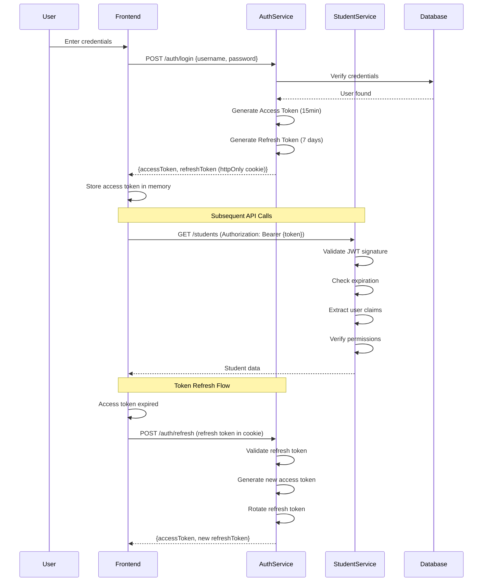
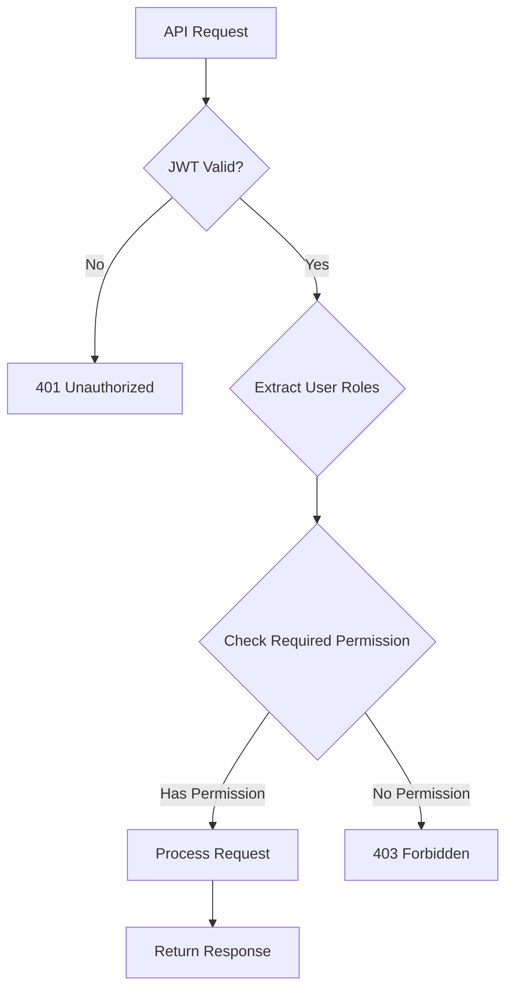

# Security Architecture

## 1. Overview

This document defines the security architecture for the School Management System (SMS). While Phase 1 assumes external authentication, this document provides a complete security blueprint for future implementation (Phase 2+) and current security best practices.

## 2. Security Principles

### 2.1 Defense in Depth
```yaml
Multiple Layers of Security:
  - Network Security (HTTPS, Firewall)
  - Application Security (Input Validation, CSRF Protection)
  - Data Security (Encryption at Rest/Transit)
  - Authentication & Authorization
  - Audit & Monitoring
```

### 2.2 Principle of Least Privilege
```yaml
Users and Services:
  - Grant minimum permissions necessary
  - Role-based access control (RBAC)
  - Service accounts with limited scope
```

### 2.3 Zero Trust Model
```yaml
Never Trust, Always Verify:
  - Verify every request
  - No implicit trust based on network location
  - Continuous authentication and authorization
```

## 3. Authentication Architecture (Phase 2)

### 3.1 JWT-Based Stateless Authentication

**Why JWT?**
- Stateless: Enables horizontal scaling
- Self-contained: Carries all required claims
- Standard: Industry-standard (RFC 7519)
- Cross-domain: Works across microservices

**JWT Structure:**
```yaml
Header:
  alg: RS256  # RSA Signature with SHA-256
  typ: JWT

Payload (Claims):
  iss: https://auth.school.com  # Issuer
  sub: user@school.com          # Subject (user ID)
  aud: school-management-api    # Audience
  exp: 1638864000               # Expiration (Unix timestamp)
  iat: 1638860400               # Issued at
  jti: unique-token-id          # JWT ID (for revocation)

  # Custom Claims
  userId: 12345
  username: admin
  email: admin@school.com
  roles: [ADMIN, STAFF]
  permissions: [student:read, student:write]

Signature:
  RSASHA256(
    base64UrlEncode(header) + "." +
    base64UrlEncode(payload),
    privateKey
  )
```

**Token Types:**

*Access Token:*
```yaml
Purpose: API access authorization
Lifetime: 15 minutes
Storage: Memory (React state/context)
Transmission: Authorization header
Format: Bearer {access_token}
```

*Refresh Token:*
```yaml
Purpose: Obtain new access tokens
Lifetime: 7 days
Storage: HttpOnly secure cookie
Transmission: Cookie (auto-sent)
Rotation: New refresh token issued on use
```

### 3.2 Authentication Flow


```mermaid
sequenceDiagram
    participant User
    participant Frontend
    participant AuthService
    participant StudentService
    participant Database

    User->>Frontend: Enter credentials
    Frontend->>AuthService: POST /auth/login {username, password}
    AuthService->>Database: Verify credentials
    Database-->>AuthService: User found
    AuthService->>AuthService: Generate Access Token (15min)
    AuthService->>AuthService: Generate Refresh Token (7 days)
    AuthService-->>Frontend: {accessToken, refreshToken (httpOnly cookie)}
    Frontend->>Frontend: Store access token in memory

    Note over Frontend,StudentService: Subsequent API Calls

    Frontend->>StudentService: GET /students (Authorization: Bearer {token})
    StudentService->>StudentService: Validate JWT signature
    StudentService->>StudentService: Check expiration
    StudentService->>StudentService: Extract user claims
    StudentService->>StudentService: Verify permissions
    StudentService-->>Frontend: Student data

    Note over Frontend,AuthService: Token Refresh Flow

    Frontend->>Frontend: Access token expired
    Frontend->>AuthService: POST /auth/refresh (refresh token in cookie)
    AuthService->>AuthService: Validate refresh token
    AuthService->>AuthService: Generate new access token
    AuthService->>AuthService: Rotate refresh token
    AuthService-->>Frontend: {accessToken, new refreshToken}
```

### 3.3 Password Security

```yaml
Hashing Algorithm: BCrypt
Work Factor: 12 rounds
Salt: Unique per password (auto-generated by BCrypt)

Password Requirements:
  - Minimum Length: 12 characters
  - Must contain: uppercase, lowercase, number, special character
  - No common passwords (dictionary check)
  - No personal information (name, email, username)
  - Password history: Last 5 passwords not allowed

Storage:
  - Never store plaintext passwords
  - Store only BCrypt hash
  - Hash format: $2a$12${salt}{hash}
```

**Implementation Example:**
```java
import org.springframework.security.crypto.bcrypt.BCryptPasswordEncoder;

public class PasswordService {
    private final BCryptPasswordEncoder encoder = new BCryptPasswordEncoder(12);

    public String hashPassword(String plainPassword) {
        return encoder.encode(plainPassword);
    }

    public boolean verifyPassword(String plainPassword, String hashedPassword) {
        return encoder.matches(plainPassword, hashedPassword);
    }
}
```

### 3.4 Multi-Factor Authentication (MFA) - Phase 3

```yaml
MFA Methods:
  - TOTP (Time-based One-Time Password)
  - SMS OTP (fallback)
  - Email OTP (fallback)

Implementation:
  - Use Google Authenticator compatible TOTP
  - 6-digit codes, 30-second window
  - Backup codes for recovery

Required For:
  - SUPER_ADMIN role
  - ADMIN role
  - Optional for STAFF and TEACHER
```

## 4. Authorization Architecture (RBAC)

### 4.1 Role Hierarchy

```yaml
Roles (Hierarchical):
  SUPER_ADMIN:
    Description: System administrator with full access
    Inherits: All permissions

  ADMIN:
    Description: School administrator
    Inherits: STAFF permissions
    Additional: Configuration management, user management

  STAFF:
    Description: Clerical staff
    Inherits: TEACHER permissions
    Additional: Student CRUD, enrollment management

  TEACHER:
    Description: Teaching staff
    Inherits: None
    Permissions: Student read-only, grades (future)
```

### 4.2 Permission Model

```yaml
Permission Format: {resource}:{action}
  - student:read
  - student:write
  - student:delete
  - configuration:read
  - configuration:write
  - user:manage

Role-Permission Mapping:
  SUPER_ADMIN:
    - *:*  # All permissions

  ADMIN:
    - student:*
    - configuration:*
    - user:manage
    - reports:read

  STAFF:
    - student:read
    - student:write
    - configuration:read
    - enrollment:*

  TEACHER:
    - student:read
    - grades:write  # Future
```

### 4.3 Authorization Flow


```mermaid
graph TB
    A[API Request] --> B{JWT Valid?}
    B -->|No| C[401 Unauthorized]
    B -->|Yes| D{Extract User Roles}
    D --> E{Check Required Permission}
    E -->|Has Permission| F[Process Request]
    E -->|No Permission| G[403 Forbidden]
    F --> H[Return Response]
```

### 4.4 Method-Level Security

```java
import org.springframework.security.access.prepost.PreAuthorize;

@RestController
@RequestMapping("/api/v1/students")
public class StudentController {

    @PreAuthorize("hasAuthority('student:read')")
    @GetMapping("/{studentId}")
    public ResponseEntity<StudentResponse> getStudent(@PathVariable String studentId) {
        // Implementation
    }

    @PreAuthorize("hasAuthority('student:write')")
    @PostMapping
    public ResponseEntity<StudentResponse> createStudent(@RequestBody StudentRequest request) {
        // Implementation
    }

    @PreAuthorize("hasAuthority('student:delete')")
    @DeleteMapping("/{studentId}")
    public ResponseEntity<Void> deleteStudent(@PathVariable String studentId) {
        // Implementation
    }

    @PreAuthorize("hasAnyRole('ADMIN', 'SUPER_ADMIN')")
    @GetMapping("/admin/stats")
    public ResponseEntity<StudentStats> getStudentStats() {
        // Implementation
    }
}
```

## 5. Input Validation & Sanitization

### 5.1 Validation Strategy

```yaml
Validation Layers:
  1. Client-side: Immediate user feedback (Zod schemas)
  2. API Gateway: Request format validation
  3. Controller: DTO validation (Bean Validation)
  4. Service: Business rule validation (Drools)
  5. Domain: Entity invariant validation

Never Trust Client Input:
  - Always validate on server-side
  - Client validation is for UX only
```

### 5.2 Bean Validation (Jakarta Validation)

```java
import jakarta.validation.constraints.*;

public class CreateStudentRequest {

    @NotBlank(message = "First name is required")
    @Size(min = 2, max = 100, message = "First name must be 2-100 characters")
    @Pattern(regexp = "^[a-zA-Z\\s]+$", message = "First name can only contain letters and spaces")
    private String firstName;

    @NotBlank(message = "Last name is required")
    @Size(min = 2, max = 100)
    private String lastName;

    @NotNull(message = "Date of birth is required")
    @Past(message = "Date of birth must be in the past")
    private LocalDate dateOfBirth;

    @NotBlank(message = "Mobile is required")
    @Pattern(regexp = "^\\d{10}$", message = "Mobile must be exactly 10 digits")
    private String mobile;

    @Email(message = "Invalid email format")
    private String email;

    @Pattern(regexp = "^\\d{12}$", message = "Aadhaar must be exactly 12 digits")
    private String aadhaarNumber;
}
```

### 5.3 SQL Injection Prevention

**Strategy: Parameterized Queries**

```java
// SECURE: Using JPA with parameterized queries
@Repository
public interface StudentRepository extends JpaRepository<Student, Long> {

    // JPA automatically uses prepared statements
    @Query("SELECT s FROM Student s WHERE s.lastName = :lastName")
    List<Student> findByLastName(@Param("lastName") String lastName);

    // Named parameters prevent SQL injection
    @Query(value = "SELECT * FROM students WHERE mobile = :mobile", nativeQuery = true)
    Optional<Student> findByMobile(@Param("mobile") String mobile);
}

// INSECURE: Never use string concatenation (DON'T DO THIS)
String query = "SELECT * FROM students WHERE last_name = '" + lastName + "'";
```

**Additional Protection:**
```yaml
Database User Privileges:
  - Grant only SELECT, INSERT, UPDATE, DELETE
  - Revoke DROP, ALTER, CREATE privileges
  - Use separate read-only user for reports

Input Sanitization:
  - Trim whitespace
  - Remove SQL keywords if found in input
  - Use allowlists for expected values
```

### 5.4 XSS (Cross-Site Scripting) Prevention

**Strategy: Output Encoding**

```yaml
Backend:
  - Spring automatically escapes HTML in JSON responses
  - Use @JsonRawValue only when absolutely necessary
  - Never return user input as HTML

Frontend:
  - React automatically escapes values in JSX
  - Never use dangerouslySetInnerHTML with user input
  - Sanitize HTML if absolutely required (DOMPurify)

Content Security Policy (CSP):
  - Set via HTTP header
  - Restrict script sources
  - Prevent inline scripts
```

**CSP Header Example:**
```yaml
Content-Security-Policy:
  default-src 'self';
  script-src 'self' 'unsafe-inline' https://trusted-cdn.com;
  style-src 'self' 'unsafe-inline';
  img-src 'self' data: https:;
  font-src 'self' https://fonts.googleapis.com;
  connect-src 'self' https://api.school.com;
  frame-ancestors 'none';
  base-uri 'self';
  form-action 'self';
```

### 5.5 CSRF (Cross-Site Request Forgery) Prevention

**Strategy: SameSite Cookies + CSRF Tokens**

```yaml
For Session-Based Auth (if used):
  - Use SameSite=Strict or SameSite=Lax cookies
  - Implement CSRF token validation
  - Double-submit cookie pattern

For JWT (Stateless):
  - Store JWT in memory or localStorage (NOT cookies)
  - Send via Authorization header (not vulnerable to CSRF)
  - If using refresh token cookies, use SameSite=Strict

Spring Security Configuration:
  http
    .csrf()
      .csrfTokenRepository(CookieCsrfTokenRepository.withHttpOnlyFalse())
    .and()
    .cors()
      .configurationSource(corsConfigurationSource());
```

## 6. Data Encryption

### 6.1 Encryption at Transit

```yaml
HTTPS/TLS:
  - TLS 1.2 minimum (TLS 1.3 preferred)
  - Strong cipher suites only
  - Certificate from trusted CA
  - HSTS header enabled

HSTS Header:
  Strict-Transport-Security: max-age=31536000; includeSubDomains; preload
```

### 6.2 Encryption at Rest

```yaml
Database Encryption:
  - PostgreSQL: Transparent Data Encryption (TDE)
  - Column-level encryption for PII (Aadhaar, etc.)
  - Encrypted backups

Sensitive Fields (Application-Level Encryption):
  - Aadhaar Number
  - Configuration values (when is_encrypted = true)

Algorithm: AES-256-GCM
Key Management: AWS KMS or HashiCorp Vault (recommended)
```

**Implementation Example:**
```java
import javax.crypto.Cipher;
import javax.crypto.spec.GCMParameterSpec;
import javax.crypto.spec.SecretKeySpec;
import java.security.SecureRandom;
import java.util.Base64;

public class EncryptionService {

    private static final String ALGORITHM = "AES/GCM/NoPadding";
    private static final int GCM_IV_LENGTH = 12;
    private static final int GCM_TAG_LENGTH = 128;

    private final SecretKeySpec keySpec;

    public EncryptionService(byte[] key) {
        this.keySpec = new SecretKeySpec(key, "AES");
    }

    public String encrypt(String plaintext) throws Exception {
        Cipher cipher = Cipher.getInstance(ALGORITHM);
        byte[] iv = new byte[GCM_IV_LENGTH];
        new SecureRandom().nextBytes(iv);

        GCMParameterSpec parameterSpec = new GCMParameterSpec(GCM_TAG_LENGTH, iv);
        cipher.init(Cipher.ENCRYPT_MODE, keySpec, parameterSpec);

        byte[] ciphertext = cipher.doFinal(plaintext.getBytes("UTF-8"));
        byte[] encrypted = new byte[iv.length + ciphertext.length];
        System.arraycopy(iv, 0, encrypted, 0, iv.length);
        System.arraycopy(ciphertext, 0, encrypted, iv.length, ciphertext.length);

        return Base64.getEncoder().encodeToString(encrypted);
    }

    public String decrypt(String encrypted) throws Exception {
        byte[] decoded = Base64.getDecoder().decode(encrypted);

        byte[] iv = new byte[GCM_IV_LENGTH];
        System.arraycopy(decoded, 0, iv, 0, iv.length);

        GCMParameterSpec parameterSpec = new GCMParameterSpec(GCM_TAG_LENGTH, iv);
        Cipher cipher = Cipher.getInstance(ALGORITHM);
        cipher.init(Cipher.DECRYPT_MODE, keySpec, parameterSpec);

        byte[] plaintext = cipher.doFinal(decoded, GCM_IV_LENGTH, decoded.length - GCM_IV_LENGTH);
        return new String(plaintext, "UTF-8");
    }
}
```

### 6.3 Key Management

```yaml
Encryption Keys:
  - Never hardcode in source code
  - Store in environment variables or secrets manager
  - Rotate keys annually
  - Use different keys for dev/staging/production

Recommended: HashiCorp Vault or AWS Secrets Manager
  - Centralized key storage
  - Automatic key rotation
  - Audit logging
  - Fine-grained access control
```

## 7. Session Management

### 7.1 JWT Token Security

```yaml
Access Token:
  - Short lifetime (15 minutes)
  - Stored in memory (React state)
  - Sent via Authorization header
  - Never stored in localStorage (XSS risk)

Refresh Token:
  - Longer lifetime (7 days)
  - Stored in HttpOnly cookie (CSRF protection via SameSite)
  - Rotation on use (prevent replay attacks)
  - Revocation list for logout

Token Revocation:
  - Maintain revocation list in Redis
  - Check on each request
  - Clear on logout
  - TTL matches token expiration
```

### 7.2 Logout Implementation

```yaml
Logout Process:
  1. Add access token JTI to revocation list (Redis)
  2. Add refresh token JTI to revocation list
  3. Clear refresh token cookie
  4. Clear access token from client memory

Revocation Check:
  - On each API request, check if token JTI is revoked
  - Fast lookup using Redis SET
  - TTL on revocation entries matches token expiration
```

**Implementation:**
```java
@Service
public class TokenRevocationService {

    @Autowired
    private RedisTemplate<String, String> redisTemplate;

    public void revokeToken(String jti, long expirationSeconds) {
        String key = "revoked:token:" + jti;
        redisTemplate.opsForValue().set(key, "true", expirationSeconds, TimeUnit.SECONDS);
    }

    public boolean isTokenRevoked(String jti) {
        String key = "revoked:token:" + jti;
        return Boolean.TRUE.equals(redisTemplate.hasKey(key));
    }
}
```

## 8. API Security Headers

```yaml
Required Security Headers:

X-Content-Type-Options: nosniff
  - Prevents MIME type sniffing

X-Frame-Options: DENY
  - Prevents clickjacking attacks

X-XSS-Protection: 1; mode=block
  - Enables browser XSS filter

Strict-Transport-Security: max-age=31536000; includeSubDomains
  - Enforces HTTPS

Content-Security-Policy: [see section 5.4]
  - Restricts content sources

Referrer-Policy: strict-origin-when-cross-origin
  - Controls referrer information

Permissions-Policy: geolocation=(), microphone=(), camera=()
  - Disables unnecessary browser features
```

**Spring Security Configuration:**
```java
@Configuration
@EnableWebSecurity
public class SecurityConfig {

    @Bean
    public SecurityFilterChain securityFilterChain(HttpSecurity http) throws Exception {
        http
            .headers(headers -> headers
                .contentTypeOptions(contentTypeOptions -> contentTypeOptions.disable())
                .xssProtection(xss -> xss.block(true))
                .frameOptions(frame -> frame.deny())
                .httpStrictTransportSecurity(hsts -> hsts
                    .includeSubDomains(true)
                    .maxAgeInSeconds(31536000))
                .contentSecurityPolicy(csp -> csp
                    .policyDirectives("default-src 'self'; script-src 'self'"))
            );

        return http.build();
    }
}
```

## 9. Audit Logging

### 9.1 Audit Requirements

```yaml
What to Log:
  - Authentication events (login, logout, failed attempts)
  - Authorization failures (403 Forbidden)
  - Data modifications (CREATE, UPDATE, DELETE)
  - Configuration changes
  - Sensitive data access (student PII)
  - Security events (rate limiting, suspicious activity)

What NOT to Log:
  - Passwords or password hashes
  - Full credit card numbers
  - Session tokens or JWTs
  - Encryption keys
```

### 9.2 Audit Log Format

```json
{
  "timestamp": "2024-12-06T10:30:00.123Z",
  "correlationId": "550e8400-e29b-41d4-a716-446655440000",
  "eventType": "STUDENT_CREATED",
  "severity": "INFO",
  "userId": "admin@school.com",
  "userRole": "ADMIN",
  "ipAddress": "192.168.1.100",
  "userAgent": "Mozilla/5.0...",
  "resource": "/api/v1/students",
  "method": "POST",
  "statusCode": 201,
  "resourceId": "STD-20241206-0001",
  "changes": {
    "action": "CREATE",
    "before": null,
    "after": {
      "firstName": "John",
      "lastName": "Doe",
      "mobile": "98*****210"
    }
  },
  "metadata": {
    "service": "student-service",
    "version": "1.0.0"
  }
}
```

### 9.3 Audit Log Storage

```yaml
Storage:
  - Primary: Elasticsearch (searchable, indexed)
  - Backup: S3 or file system (long-term retention)

Retention:
  - Active logs: 90 days in Elasticsearch
  - Archive: 7 years in S3 (compliance)

Access Control:
  - Read: ADMIN, SUPER_ADMIN only
  - Write: System only (append-only)
  - Tamper-proof: Write once, immutable
```

## 10. Rate Limiting & DDoS Protection

### 10.1 Rate Limiting Strategy

```yaml
Tiers:
  Anonymous:
    - 10 requests per minute

  Authenticated Users:
    - 100 requests per minute

  Admin Users:
    - 200 requests per minute

Endpoint-Specific Limits:
  POST /auth/login:
    - 5 attempts per 15 minutes (prevent brute force)

  POST /api/v1/students:
    - 20 requests per minute

  GET /api/v1/students (search):
    - 30 requests per minute

Implementation: Redis-based sliding window
```

**Implementation:**
```java
@Component
public class RateLimitingFilter extends OncePerRequestFilter {

    @Autowired
    private RedisTemplate<String, String> redisTemplate;

    @Override
    protected void doFilterInternal(HttpServletRequest request,
                                    HttpServletResponse response,
                                    FilterChain filterChain) throws ServletException, IOException {
        String clientId = getClientIdentifier(request);
        String key = "rate_limit:" + clientId;

        Long requestCount = redisTemplate.opsForValue().increment(key);

        if (requestCount == 1) {
            redisTemplate.expire(key, 60, TimeUnit.SECONDS);
        }

        if (requestCount > 100) {
            response.setStatus(429);
            response.setHeader("X-RateLimit-Limit", "100");
            response.setHeader("X-RateLimit-Remaining", "0");
            response.setHeader("X-RateLimit-Reset", String.valueOf(System.currentTimeMillis() + 60000));
            response.getWriter().write("{\"error\": \"Rate limit exceeded\"}");
            return;
        }

        response.setHeader("X-RateLimit-Limit", "100");
        response.setHeader("X-RateLimit-Remaining", String.valueOf(100 - requestCount));

        filterChain.doFilter(request, response);
    }

    private String getClientIdentifier(HttpServletRequest request) {
        String userId = // extract from JWT
        return userId != null ? userId : request.getRemoteAddr();
    }
}
```

### 10.2 DDoS Protection

```yaml
Layers:
  1. Network Layer: Cloudflare or AWS Shield
  2. Application Layer: Rate limiting (above)
  3. Database Layer: Connection pooling limits

Cloudflare Features:
  - DDoS mitigation
  - Bot detection
  - Rate limiting at edge
  - Web Application Firewall (WAF)

Response to Attack:
  - Automatic: Rate limiting kicks in
  - Manual: Block IP ranges via firewall
  - Emergency: Enable "Under Attack" mode
```

## 11. Secure Configuration Management

### 11.1 Environment Variables

```yaml
Sensitive Configuration (NEVER in code):
  - Database passwords
  - JWT signing keys
  - Encryption keys
  - API keys (third-party services)
  - Redis passwords

Storage:
  - Development: .env files (gitignored)
  - Production: Kubernetes Secrets, AWS Parameter Store, or HashiCorp Vault
```

**Example application.yml:**
```yaml
spring:
  datasource:
    url: ${DB_URL}
    username: ${DB_USERNAME}
    password: ${DB_PASSWORD}

jwt:
  secret: ${JWT_SECRET}
  expiration: ${JWT_EXPIRATION:900000}

encryption:
  key: ${ENCRYPTION_KEY}
```

### 11.2 Secrets Management

```yaml
Recommended Tools:
  - HashiCorp Vault (preferred)
  - AWS Secrets Manager
  - Azure Key Vault
  - Kubernetes Secrets

Best Practices:
  - Rotate secrets regularly
  - Use different secrets per environment
  - Audit secret access
  - Never commit secrets to version control
  - Use .env.example with dummy values for documentation
```

## 12. Compliance & Data Privacy

### 12.1 Data Protection Requirements

```yaml
Personal Identifiable Information (PII):
  - Student names
  - Date of birth
  - Mobile numbers
  - Email addresses
  - Aadhaar numbers
  - Addresses

Protection Measures:
  - Encrypt sensitive fields (Aadhaar)
  - Mask in logs (mobile: 98*****210)
  - Access control (RBAC)
  - Audit all access
  - Data retention policies
```

### 12.2 Right to Erasure (GDPR)

```yaml
Implement:
  - DELETE /api/v1/students/{id}/gdpr-erase
  - Anonymize instead of hard delete
  - Cascade to related records
  - Audit log retention exception

Anonymization:
  firstName: "Anonymized"
  lastName: "User"
  mobile: null
  email: null
  aadhaarNumber: null
  address: null
```

### 12.3 Data Retention

```yaml
Student Records:
  - Active: Indefinite
  - Inactive: 7 years after last activity
  - Graduated: 10 years
  - Deleted: Anonymized after 30-day grace period

Audit Logs:
  - Active: 90 days
  - Archive: 7 years (compliance)

Session Data:
  - Access tokens: 15 minutes
  - Refresh tokens: 7 days
  - Revocation list: Token lifetime + 1 day
```

## 13. Security Testing

### 13.1 Security Testing Types

```yaml
Static Analysis (SAST):
  - Tool: SonarQube, Checkmarx
  - Scan: Every commit (CI/CD)
  - Focus: Code vulnerabilities, hardcoded secrets

Dependency Scanning:
  - Tool: OWASP Dependency-Check, Snyk
  - Scan: Weekly
  - Focus: Known CVEs in dependencies

Dynamic Analysis (DAST):
  - Tool: OWASP ZAP, Burp Suite
  - Scan: Pre-production
  - Focus: Running application vulnerabilities

Penetration Testing:
  - Frequency: Annually
  - Scope: Full application
  - Report: Remediation within 30 days
```

### 13.2 Security Checklist

```yaml
Pre-Production Checklist:
  - [ ] All secrets in environment variables
  - [ ] HTTPS enabled with valid certificate
  - [ ] Security headers configured
  - [ ] CORS configured correctly
  - [ ] Rate limiting enabled
  - [ ] Input validation on all endpoints
  - [ ] SQL injection protection verified
  - [ ] XSS protection verified
  - [ ] CSRF protection enabled (if applicable)
  - [ ] Authentication & authorization tested
  - [ ] Audit logging enabled
  - [ ] Sensitive data encrypted
  - [ ] Error messages don't leak information
  - [ ] Default passwords changed
  - [ ] Unnecessary endpoints disabled
  - [ ] Database user has minimal privileges
```

## 14. Incident Response Plan

### 14.1 Security Incident Categories

```yaml
P0 - Critical:
  - Data breach
  - Authentication bypass
  - SQL injection exploit
  - Response: Immediate (within 1 hour)

P1 - High:
  - Unauthorized access
  - DDoS attack
  - XSS exploit
  - Response: Within 4 hours

P2 - Medium:
  - Failed login attempts spike
  - Rate limit exceeded
  - Response: Within 24 hours

P3 - Low:
  - Security scan findings
  - Configuration drift
  - Response: Within 1 week
```

### 14.2 Incident Response Steps

```yaml
1. Detect:
  - Monitoring alerts
  - User reports
  - Security scan findings

2. Contain:
  - Isolate affected systems
  - Block malicious IPs
  - Revoke compromised tokens

3. Investigate:
  - Review audit logs
  - Identify scope of breach
  - Preserve evidence

4. Remediate:
  - Patch vulnerability
  - Reset compromised credentials
  - Update security controls

5. Recover:
  - Restore services
  - Verify security
  - Monitor closely

6. Learn:
  - Post-mortem analysis
  - Update runbooks
  - Improve detection
```

---

**Document Version:** 1.0
**Last Updated:** 2025-12-06
**Status:** APPROVED
**Phase 1 Note:** Authentication is handled externally. This document provides blueprint for Phase 2+ implementation.
