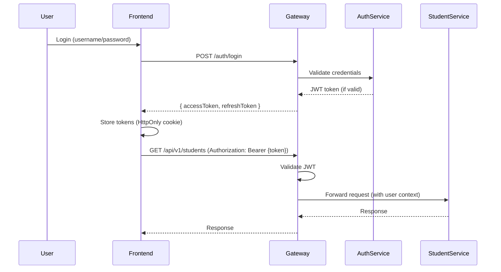

# Security Architecture - School Management System

**Version:** 1.0
**Date:** January 22, 2026
**Status:** Active
**Phase:** 1 - Student Management & Configuration

---

## Table of Contents

1. [Overview](#1-overview)
2. [Authentication Strategy](#2-authentication-strategy)
3. [Authorization & RBAC](#3-authorization--rbac)
4. [Data Protection](#4-data-protection)
5. [API Security](#5-api-security)
6. [Infrastructure Security](#6-infrastructure-security)
7. [Security Testing](#7-security-testing)
8. [Compliance & Standards](#8-compliance--standards)

---

## 1. Overview

### 1.1 Security Posture

**Phase 1 Scope:**
- Authentication is **ASSUMED EXTERNAL** (handled by organization's SSO/IAM)
- Focus on **data protection**, **input validation**, and **secure coding practices**
- Prepare architecture for **Phase 2 authentication integration**

**Future Phases (Phase 2+):**
- Spring Security integration
- JWT-based authentication
- Role-Based Access Control (RBAC)
- OAuth2/SAML integration

### 1.2 Security Principles

1. **Defense in Depth:** Multiple layers of security controls
2. **Least Privilege:** Users/services have minimum necessary permissions
3. **Secure by Default:** Deny-all, then explicitly allow
4. **Fail Securely:** Errors do not expose sensitive information
5. **Separation of Duties:** No single user has complete system control

### 1.3 Threat Model

**Primary Threats (Phase 1):**

| Threat | Likelihood | Impact | Mitigation |
|--------|------------|--------|------------|
| SQL Injection | Medium | Critical | Prepared statements (JPA), input validation |
| XSS (Cross-Site Scripting) | Medium | High | Output encoding, CSP headers |
| CSRF (Cross-Site Request Forgery) | Low | Medium | SameSite cookies, CORS config |
| Mass Assignment | Medium | Medium | DTO pattern, @JsonIgnore |
| Information Disclosure | Medium | High | Error sanitization, logging controls |
| Denial of Service | Low | Medium | Rate limiting (future), input size limits |

---

## 2. Authentication Strategy

### 2.1 Phase 1: External Authentication Assumption

**Current State:**
- NO authentication implemented in Phase 1
- Backend APIs are **unprotected** (development only)
- Frontend assumes authenticated user context

**Security Controls:**
- Deployment restricted to internal network only
- Firewall rules block external access to backend ports (8081, 8082)
- Database access restricted to backend service IPs

**Documentation Requirement:**
```
# README.md - Security Notice
⚠️ PHASE 1 SECURITY NOTICE:
This application DOES NOT implement authentication.
It is intended for deployment behind a corporate SSO/IAM gateway.
DO NOT expose backend services (ports 8081, 8082) to public internet.
```

### 2.2 Phase 2: Planned Authentication (Future)

**Technology:** Spring Security 6.x + JWT

**Authentication Flow:**

```mermaid
sequenceDiagram
    participant User
    participant Frontend
    participant Gateway
    participant AuthService
    participant StudentService

    User->>Frontend: Login (username/password)
    Frontend->>Gateway: POST /auth/login
    Gateway->>AuthService: Validate credentials
    AuthService-->>Gateway: JWT token (if valid)
    Gateway-->>Frontend: { accessToken, refreshToken }
    Frontend->>Frontend: Store tokens (HttpOnly cookie)
    Frontend->>Gateway: GET /api/v1/students (Authorization: Bearer {token})
    Gateway->>Gateway: Validate JWT
    Gateway->>StudentService: Forward request (with user context)
    StudentService-->>Gateway: Response
    Gateway-->>Frontend: Response
```

**JWT Structure (Future):**
```json
{
  "sub": "user@school.com",
  "roles": ["ADMIN", "STAFF"],
  "schoolId": "SCHOOL-001",
  "iat": 1674384000,
  "exp": 1674387600
}
```

**Spring Security Configuration (Future):**
```java
@Configuration
@EnableWebSecurity
public class SecurityConfig {

    @Bean
    public SecurityFilterChain filterChain(HttpSecurity http) throws Exception {
        http
            .csrf().disable()  // Use JWT instead
            .sessionManagement().sessionCreationPolicy(SessionCreationPolicy.STATELESS)
            .and()
            .authorizeHttpRequests(auth -> auth
                .requestMatchers("/actuator/health").permitAll()
                .requestMatchers("/api/v1/students/**").hasAnyRole("ADMIN", "STAFF")
                .requestMatchers("/api/v1/configurations/**").hasRole("ADMIN")
                .anyRequest().authenticated()
            )
            .addFilterBefore(jwtAuthenticationFilter(), UsernamePasswordAuthenticationFilter.class);

        return http.build();
    }
}
```

---

## 3. Authorization & RBAC

### 3.1 Role Hierarchy (Phase 2 Planning)

```
SUPER_ADMIN (System-wide control)
    ↓
ADMIN (School-level control)
    ↓
STAFF (Clerical operations)
    ↓
TEACHER (Read-only access to student records)
```

### 3.2 Permission Matrix

| Resource | Action | SUPER_ADMIN | ADMIN | STAFF | TEACHER |
|----------|--------|-------------|-------|-------|---------|
| **Students** | Create | ✓ | ✓ | ✓ | ✗ |
| **Students** | Read | ✓ | ✓ | ✓ | ✓ |
| **Students** | Update | ✓ | ✓ | ✓ (limited) | ✗ |
| **Students** | Delete | ✓ | ✓ | ✗ | ✗ |
| **Configurations** | Create/Update | ✓ | ✓ | ✗ | ✗ |
| **Configurations** | Read | ✓ | ✓ | ✓ | ✗ |
| **Configurations** | Delete | ✓ | ✓ | ✗ | ✗ |
| **System Settings** | Modify | ✓ | ✗ | ✗ | ✗ |

**Notes:**
- STAFF can only update student `firstName`, `lastName`, `mobile`, `status` (per requirements)
- TEACHER role is future-scoped (not in Phase 1)

### 3.3 Method-Level Security (Future)

```java
@Service
public class StudentService {

    @PreAuthorize("hasAnyRole('ADMIN', 'STAFF')")
    public StudentResponse registerStudent(StudentRequest request) {
        // Implementation
    }

    @PreAuthorize("hasRole('ADMIN')")
    public void deleteStudent(String studentId) {
        // Implementation
    }

    @PreAuthorize("hasAnyRole('ADMIN', 'STAFF', 'TEACHER')")
    public StudentResponse getStudent(String studentId) {
        // Implementation
    }
}
```

---

## 4. Data Protection

### 4.1 Data Classification

| Data Type | Classification | Protection Measures |
|-----------|----------------|---------------------|
| Student PII (Name, DOB, Aadhaar) | **Sensitive** | Encryption at rest, TLS in transit, access logging |
| Contact Info (Mobile, Email) | **Confidential** | TLS in transit, masked in logs |
| Student ID | **Internal** | TLS in transit |
| Configuration Settings | **Internal** | TLS in transit |
| System Logs | **Internal** | No PII, secure storage |

### 4.2 Encryption at Rest

**Phase 1:** Database-level encryption (PostgreSQL)

**Enable Transparent Data Encryption (TDE):**
```sql
-- PostgreSQL 18 with pgcrypto extension
CREATE EXTENSION IF NOT EXISTS pgcrypto;

-- Encrypt sensitive configuration values
UPDATE configurations
SET value = pgp_sym_encrypt(value, 'encryption-key')
WHERE is_encrypted = TRUE;
```

**Phase 2:** Application-level encryption using Jasypt

```java
@Configuration
@EnableEncryptableProperties
public class EncryptionConfig {

    @Bean
    public StringEncryptor stringEncryptor() {
        PooledPBEStringEncryptor encryptor = new PooledPBEStringEncryptor();
        encryptor.setAlgorithm("PBEWithHMACSHA512AndAES_256");
        encryptor.setPassword(System.getenv("ENCRYPTION_KEY"));
        encryptor.setKeyObtentionIterations(1000);
        return encryptor;
    }
}

@Entity
public class Configuration {
    @Convert(converter = EncryptedStringConverter.class)
    private String value;
}
```

### 4.3 Encryption in Transit

**TLS Configuration (Production):**

**Backend (application.yml):**
```yaml
server:
  port: 8443
  ssl:
    enabled: true
    key-store: classpath:keystore.p12
    key-store-password: ${SSL_KEYSTORE_PASSWORD}
    key-store-type: PKCS12
    key-alias: school-service
```

**Frontend (Nginx):**
```nginx
server {
    listen 443 ssl http2;
    server_name school.example.com;

    ssl_certificate /etc/ssl/certs/school.crt;
    ssl_certificate_key /etc/ssl/private/school.key;
    ssl_protocols TLSv1.2 TLSv1.3;
    ssl_ciphers HIGH:!aNULL:!MD5;

    location / {
        root /usr/share/nginx/html;
        try_files $uri $uri/ /index.html;
    }

    location /api/ {
        proxy_pass https://backend:8443;
        proxy_ssl_verify on;
    }
}
```

### 4.4 PII Masking in Logs

**Strategy:** Mask sensitive fields in logs using Logback filters.

**logback-spring.xml:**
```xml
<configuration>
    <appender name="CONSOLE" class="ch.qos.logback.core.ConsoleAppender">
        <encoder class="net.logstash.logback.encoder.LogstashEncoder">
            <provider class="com.school.logging.PIIMaskingProvider" />
        </encoder>
    </appender>
</configuration>
```

**PIIMaskingProvider.java:**
```java
public class PIIMaskingProvider implements JsonProvider {
    @Override
    public void writeTo(JsonGenerator generator, ILoggingEvent event) throws IOException {
        String message = event.getFormattedMessage();

        // Mask mobile numbers: 9876543210 → 98****3210
        message = message.replaceAll("\\b\\d{10}\\b", m -> maskMobile(m));

        // Mask Aadhaar: 123456789012 → ****89012
        message = message.replaceAll("\\b\\d{12}\\b", m -> maskAadhaar(m));

        generator.writeStringField("message", message);
    }

    private String maskMobile(String mobile) {
        return mobile.substring(0, 2) + "****" + mobile.substring(6);
    }

    private String maskAadhaar(String aadhaar) {
        return "****" + aadhaar.substring(8);
    }
}
```

---

## 5. API Security

### 5.1 Input Validation

**Strategy:** Multi-layer validation (Client → Server → Database)

**1. Client-Side (TypeScript + Zod):**
```typescript
const studentSchema = z.object({
  firstName: z.string().min(1).max(50).regex(/^[a-zA-Z\s]+$/),
  mobile: z.string().regex(/^\d{10}$/),
  email: z.string().email(),
  dateOfBirth: z.string().refine(date => {
    const age = calculateAge(new Date(date));
    return age >= 3 && age <= 18;
  }, "Age must be between 3 and 18")
});
```

**2. Server-Side (Jakarta Validation + Drools):**
```java
public class StudentRequest {
    @NotBlank
    @Size(min = 1, max = 100)
    @Pattern(regexp = "^[a-zA-Z\\s]+$")
    private String firstName;

    @NotBlank
    @Pattern(regexp = "^\\d{10}$")
    private String mobile;

    @NotBlank
    @Email
    private String email;

    @NotNull
    @Past
    private LocalDate dateOfBirth;
}
```

**3. Database-Level (CHECK constraints):**
```sql
CONSTRAINT chk_students_mobile CHECK (mobile ~ '^\d{10}$')
CONSTRAINT chk_students_age CHECK (
    date_of_birth <= CURRENT_DATE - INTERVAL '3 years' AND
    date_of_birth >= CURRENT_DATE - INTERVAL '18 years'
)
```

### 5.2 SQL Injection Prevention

**Strategy:** NEVER use string concatenation for SQL queries.

**Safe (JPA Parameterized Queries):**
```java
@Query("SELECT s FROM Student s WHERE s.lastName = :lastName")
List<Student> findByLastName(@Param("lastName") String lastName);
```

**Unsafe (DO NOT USE):**
```java
// ❌ NEVER DO THIS
String sql = "SELECT * FROM students WHERE last_name = '" + lastName + "'";
```

### 5.3 XSS (Cross-Site Scripting) Prevention

**Backend:** Automatic JSON encoding via Jackson (no HTML responses)

**Frontend:** React auto-escapes by default, but avoid `dangerouslySetInnerHTML`

**Content Security Policy (CSP) Header:**
```java
@Configuration
public class SecurityHeadersConfig implements WebMvcConfigurer {
    @Override
    public void addInterceptors(InterceptorRegistry registry) {
        registry.addInterceptor(new HandlerInterceptor() {
            @Override
            public void postHandle(HttpServletRequest request,
                                   HttpServletResponse response,
                                   Object handler,
                                   ModelAndView modelAndView) {
                response.setHeader("Content-Security-Policy",
                    "default-src 'self'; script-src 'self'; style-src 'self' 'unsafe-inline'");
                response.setHeader("X-Content-Type-Options", "nosniff");
                response.setHeader("X-Frame-Options", "DENY");
                response.setHeader("X-XSS-Protection", "1; mode=block");
            }
        });
    }
}
```

### 5.4 CSRF Protection

**Phase 1:** Not required (no session-based auth)

**Phase 2 (with session auth):**
```java
http.csrf()
    .csrfTokenRepository(CookieCsrfTokenRepository.withHttpOnlyFalse());
```

**Frontend (Axios):**
```typescript
axios.defaults.withCredentials = true;
axios.defaults.xsrfCookieName = 'XSRF-TOKEN';
axios.defaults.xsrfHeaderName = 'X-XSRF-TOKEN';
```

### 5.5 CORS Configuration

**Development (allow frontend dev server):**
```java
@Configuration
public class CorsConfig {
    @Bean
    public WebMvcConfigurer corsConfigurer() {
        return new WebMvcConfigurer() {
            @Override
            public void addCorsMappings(CorsRegistry registry) {
                registry.addMapping("/api/**")
                    .allowedOrigins(
                        "http://localhost:5173",  // Vite
                        "http://localhost:3000",  // Alternative
                        "http://localhost:4173"   // Vite preview
                    )
                    .allowedMethods("GET", "POST", "PUT", "DELETE", "OPTIONS")
                    .allowedHeaders("*")
                    .allowCredentials(true)
                    .maxAge(3600);
            }
        };
    }
}
```

**Production (restrict to production domain):**
```java
.allowedOrigins("https://school.example.com")
```

### 5.6 Mass Assignment Prevention

**Strategy:** Use DTOs to control which fields can be set by clients.

**Request DTO (Editable fields only):**
```java
public class StudentUpdateRequest {
    @NotBlank
    private String firstName;

    @NotBlank
    private String lastName;

    @Pattern(regexp = "^\\d{10}$")
    private String mobile;

    private StudentStatus status;

    // NO setters for: id, studentId, dateOfBirth, email, createdAt, version
}
```

**Entity Protection:**
```java
@Entity
public class Student {
    @JsonIgnore  // Prevent JSON serialization of internal ID
    private Long id;

    @JsonProperty(access = JsonProperty.Access.READ_ONLY)
    private String studentId;

    @JsonProperty(access = JsonProperty.Access.READ_ONLY)
    private LocalDateTime createdAt;
}
```

---

## 6. Infrastructure Security

### 6.1 Database Security

**PostgreSQL Hardening:**

```ini
# postgresql.conf

# Network Security
listen_addresses = 'localhost'  # Or specific internal IPs
ssl = on
ssl_cert_file = '/path/to/server.crt'
ssl_key_file = '/path/to/server.key'

# Authentication
password_encryption = scram-sha-256

# Logging
log_connections = on
log_disconnections = on
log_statement = 'ddl'  # Log schema changes
```

**User Permissions:**
```sql
-- Create service-specific users
CREATE USER student_service WITH PASSWORD 'strong_password';
CREATE USER config_service WITH PASSWORD 'strong_password';

-- Grant minimum necessary permissions
GRANT CONNECT ON DATABASE student_db TO student_service;
GRANT SELECT, INSERT, UPDATE, DELETE ON ALL TABLES IN SCHEMA public TO student_service;
GRANT USAGE ON ALL SEQUENCES IN SCHEMA public TO student_service;

-- Revoke dangerous permissions
REVOKE CREATE ON SCHEMA public FROM PUBLIC;
REVOKE ALL ON pg_catalog.pg_authid FROM PUBLIC;
```

**Connection Pooling Security (HikariCP):**
```yaml
spring:
  datasource:
    hikari:
      maximum-pool-size: 10
      minimum-idle: 5
      connection-timeout: 30000
      idle-timeout: 600000
      max-lifetime: 1800000
      leak-detection-threshold: 60000  # Detect connection leaks
```

### 6.2 Redis Security

**redis.conf:**
```ini
# Authentication
requirepass strong_redis_password

# Network
bind 127.0.0.1
protected-mode yes
port 6379

# Security
rename-command FLUSHDB ""
rename-command FLUSHALL ""
rename-command CONFIG "CONFIG_c0nf1g"
```

**Spring Boot Configuration:**
```yaml
spring:
  data:
    redis:
      host: ${REDIS_HOST}
      port: ${REDIS_PORT}
      password: ${REDIS_PASSWORD}
      ssl:
        enabled: true  # Production only
      timeout: 2000ms
```

### 6.3 Secrets Management

**Phase 1: Environment Variables**

**DO NOT commit secrets to Git:**
```bash
# .env (gitignored)
DB_PASSWORD=secure_password
REDIS_PASSWORD=secure_redis_password
JWT_SECRET=strong_jwt_secret_key
ENCRYPTION_KEY=encryption_master_key
```

**Docker Compose (development):**
```yaml
services:
  student-service:
    environment:
      - DB_PASSWORD=${DB_PASSWORD}
      - REDIS_PASSWORD=${REDIS_PASSWORD}
    env_file:
      - .env
```

**Phase 2: Secrets Manager (Production)**

Use cloud-native secrets managers:
- **AWS:** AWS Secrets Manager
- **Azure:** Azure Key Vault
- **GCP:** Google Secret Manager
- **HashiCorp Vault**

```java
// Example: AWS Secrets Manager integration
@Configuration
public class SecretsConfig {
    @Bean
    public DataSource dataSource(SecretsManagerClient secretsClient) {
        String secret = getSecret(secretsClient, "prod/db/password");
        return DataSourceBuilder.create()
            .password(secret)
            .build();
    }
}
```

---

## 7. Security Testing

### 7.1 Static Application Security Testing (SAST)

**Tools:**
- **SonarQube:** Code quality + security vulnerabilities
- **SpotBugs:** Java static analysis
- **OWASP Dependency-Check:** Vulnerable dependencies

**Maven Integration:**
```xml
<plugin>
    <groupId>org.owasp</groupId>
    <artifactId>dependency-check-maven</artifactId>
    <version>8.4.0</version>
    <executions>
        <execution>
            <goals>
                <goal>check</goal>
            </goals>
        </execution>
    </executions>
</plugin>
```

### 7.2 Dynamic Application Security Testing (DAST)

**Tools:**
- **OWASP ZAP:** Automated vulnerability scanner
- **Burp Suite:** Manual penetration testing

**Automated Scan (CI/CD):**
```bash
# Docker-based ZAP scan
docker run -v $(pwd):/zap/wrk/:rw \
  -t owasp/zap2docker-stable zap-baseline.py \
  -t http://localhost:8081 \
  -r zap_report.html
```

### 7.3 Dependency Vulnerability Scanning

**Renovate Bot (GitHub):** Auto-create PRs for dependency updates

**Snyk Integration:**
```bash
npm install -g snyk
snyk auth
snyk test  # Scan for vulnerabilities
snyk monitor  # Continuous monitoring
```

### 7.4 Security Test Cases

**Example: SQL Injection Test**
```java
@Test
@DisplayName("Should prevent SQL injection in lastName search")
void shouldPreventSQLInjection() {
    String maliciousInput = "'; DROP TABLE students; --";

    assertThatCode(() -> studentService.searchByLastName(maliciousInput))
        .doesNotThrowAnyException();

    // Verify table still exists
    assertThat(studentRepository.count()).isGreaterThan(0);
}
```

---

## 8. Compliance & Standards

### 8.1 Regulatory Compliance

**Applicable Standards:**
- **GDPR (if applicable):** Right to erasure, data portability
- **India Data Protection (future):** Aadhaar data handling
- **PCI DSS (future):** If payment integration added

### 8.2 Secure Coding Standards

**OWASP Top 10 Mitigation:**

| OWASP Risk | Mitigation Strategy |
|------------|---------------------|
| A01: Broken Access Control | RBAC enforcement (Phase 2) |
| A02: Cryptographic Failures | TLS, encryption at rest |
| A03: Injection | Prepared statements, input validation |
| A04: Insecure Design | Threat modeling, security reviews |
| A05: Security Misconfiguration | Security headers, default-deny |
| A06: Vulnerable Components | Dependency scanning (OWASP Dep-Check) |
| A07: Auth Failures | JWT, session timeout (Phase 2) |
| A08: Data Integrity Failures | HMAC signatures (future) |
| A09: Logging Failures | Centralized logging, no PII in logs |
| A10: SSRF | Input validation, allowlists |

### 8.3 Security Audit Checklist

**Pre-Production:**
- [ ] All secrets externalized (no hardcoded credentials)
- [ ] TLS enabled for all services
- [ ] Database encryption at rest configured
- [ ] PII masking in logs verified
- [ ] CORS restricted to production domain
- [ ] Security headers configured (CSP, X-Frame-Options)
- [ ] Dependency vulnerabilities resolved (critical/high)
- [ ] OWASP ZAP scan completed with no high-severity findings
- [ ] Rate limiting configured (future)
- [ ] Backup encryption enabled

---

## Appendix

### A. Security Configuration Checklist

**Backend Services:**
```yaml
# application-prod.yml
server:
  ssl:
    enabled: true
  error:
    include-message: never
    include-stacktrace: never

spring:
  jpa:
    show-sql: false  # Disable in production

logging:
  level:
    root: WARN
    com.school: INFO
```

**Frontend (Nginx production):**
```nginx
# Security headers
add_header Strict-Transport-Security "max-age=31536000; includeSubDomains" always;
add_header X-Content-Type-Options "nosniff" always;
add_header X-Frame-Options "DENY" always;
add_header X-XSS-Protection "1; mode=block" always;
add_header Referrer-Policy "strict-origin-when-cross-origin" always;
```

### B. Incident Response Plan (Future)

**Security Incident Workflow:**
1. **Detection:** Monitoring alerts, user reports
2. **Containment:** Isolate affected services
3. **Investigation:** Analyze logs, identify root cause
4. **Remediation:** Apply patches, update configurations
5. **Recovery:** Restore services, verify integrity
6. **Post-Mortem:** Document lessons learned, update runbooks

### C. Cross-References

- **System Architecture:** See `01-system-architecture.md` (Logging Strategy)
- **Database Design:** See `02-database-design.md` (Encryption, Constraints)
- **Backend Implementation:** See `05-backend-implementation-guide.md` (DTO Mapping, Validation)

---

**Document Control:**
**Created:** January 22, 2026
**Last Updated:** January 22, 2026
**Approved By:** Software Architect Agent
**Next Review:** Phase 2 Authentication Implementation
