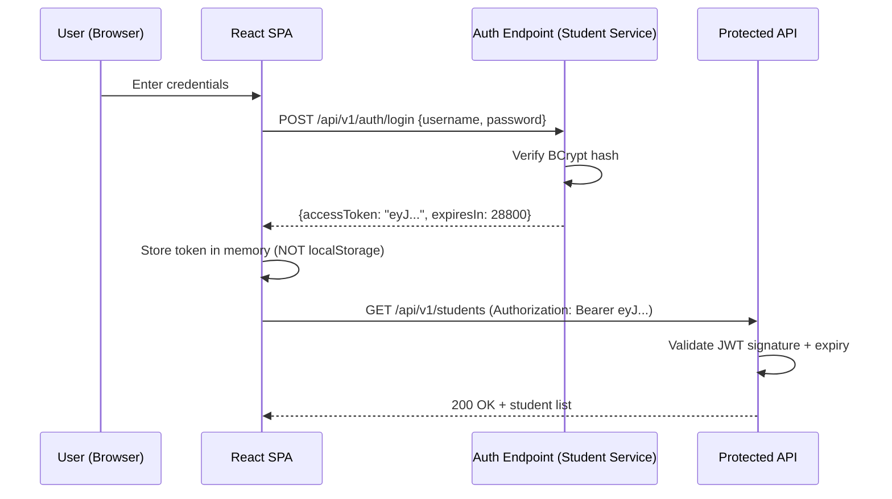
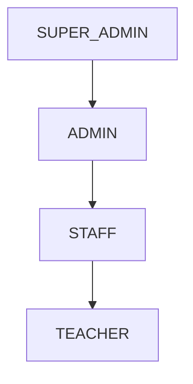

# 04 - Security Architecture

## Cross-Reference Index
- Business Requirements: `specs/REQUIREMENTS.md` (Section 8: Assumptions - auth handled externally in Phase 1)
- API Contracts: `specs/sms_api_specification.yaml`
- System Architecture: `specs/architecture/01-system-architecture.md`
- Backend Implementation Guide: `specs/architecture/05-backend-implementation-guide.md`

---

## 1. Phase 1 Security Scope

Per `specs/REQUIREMENTS.md` Section 8: Authentication is handled externally in Phase 1. The SMS services themselves enforce input validation, SQL injection prevention, and CORS policies. Full RBAC via Spring Security is defined here as the target state for Phase 2 and is partially implemented as a security skeleton in Phase 1.

---

## 2. Authentication Design (Phase 2 Target)

### 2.1 Mechanism

- Username/password authentication via HTTP Basic or JWT Bearer token
- Passwords stored using BCrypt with cost factor 12
- JWT signed with RS256 (RSA 2048-bit key pair); public key served at `/.well-known/jwks.json`
- Token expiry: 8 hours for access tokens; refresh tokens not in scope for Phase 1

### 2.2 Authentication Flow


```mermaid
sequenceDiagram
    participant U as User (Browser)
    participant SPA as React SPA
    participant AUTH as Auth Endpoint (Student Service)
    participant API as Protected API

    U->>SPA: Enter credentials
    SPA->>AUTH: POST /api/v1/auth/login {username, password}
    AUTH->>AUTH: Verify BCrypt hash
    AUTH-->>SPA: {accessToken: "eyJ...", expiresIn: 28800}
    SPA->>SPA: Store token in memory (NOT localStorage)
    SPA->>API: GET /api/v1/students (Authorization: Bearer eyJ...)
    API->>API: Validate JWT signature + expiry
    API-->>SPA: 200 OK + student list
```

**Security Note:** JWT stored in memory (React state/context), not `localStorage` or `sessionStorage`, to mitigate XSS token theft.

---

## 3. RBAC Role Hierarchy


```mermaid
graph TD
    SA[SUPER_ADMIN] --> A[ADMIN]
    A --> S[STAFF]
    S --> T[TEACHER]
```

| Role | Permissions |
|---|---|
| `SUPER_ADMIN` | All operations; school configuration admin; user management |
| `ADMIN` | Student CRUD; configuration read/write; enrollment management |
| `STAFF` | Student registration, search, status update; configuration read |
| `TEACHER` | Student read-only; enrollment read |

### 3.1 Endpoint Permission Matrix

| Endpoint | SUPER_ADMIN | ADMIN | STAFF | TEACHER |
|---|---|---|---|---|
| `POST /students` | YES | YES | YES | NO |
| `GET /students` | YES | YES | YES | YES |
| `GET /students/{id}` | YES | YES | YES | YES |
| `PUT /students/{id}` | YES | YES | YES | NO |
| `DELETE /students/{id}` | YES | YES | NO | NO |
| `GET /students/{id}/enrollment-history` | YES | YES | YES | YES |
| `POST /students/{id}/enrollment-history` | YES | YES | YES | NO |
| `GET /configurations` | YES | YES | YES | NO |
| `PUT /configurations/{cat}/{key}` | YES | YES | NO | NO |
| `DELETE /configurations/{cat}/{key}` | YES | NO | NO | NO |

### 3.2 Spring Security Method-Level Config (Phase 2)

```java
@Configuration
@EnableMethodSecurity
public class SecurityConfig {

    @Bean
    public SecurityFilterChain filterChain(HttpSecurity http) throws Exception {
        return http
            .csrf(csrf -> csrf.csrfTokenRepository(CookieCsrfTokenRepository.withHttpOnlyFalse()))
            .sessionManagement(sm -> sm.sessionCreationPolicy(SessionCreationPolicy.STATELESS))
            .authorizeHttpRequests(auth -> auth
                .requestMatchers("/actuator/health", "/actuator/info").permitAll()
                .requestMatchers(HttpMethod.DELETE, "/api/v1/students/**")
                    .hasAnyRole("SUPER_ADMIN", "ADMIN")
                .requestMatchers(HttpMethod.POST, "/api/v1/students")
                    .hasAnyRole("SUPER_ADMIN", "ADMIN", "STAFF")
                .requestMatchers(HttpMethod.GET, "/api/v1/**")
                    .hasAnyRole("SUPER_ADMIN", "ADMIN", "STAFF", "TEACHER")
                .anyRequest().authenticated()
            )
            .oauth2ResourceServer(oauth2 -> oauth2.jwt(Customizer.withDefaults()))
            .build();
    }
}
```

---

## 4. Phase 1 Security Controls (Active)

### 4.1 SQL Injection Prevention

**Primary defense:** All database interactions use Spring Data JPA with parameterized queries. No string concatenation in JPQL or native queries.

```java
// Correct - parameterized
@Query("SELECT s FROM StudentJpaEntity s WHERE s.lastName = :lastName")
List<StudentJpaEntity> findByLastName(@Param("lastName") String lastName);

// Forbidden - string interpolation
// "SELECT * FROM students WHERE last_name = '" + lastName + "'"
```

**Secondary defense:** PostgreSQL `CHECK` constraints validate data types at the DB layer.

### 4.2 Input Validation (XSS Prevention)

All request DTOs are validated with Jakarta Bean Validation annotations before reaching service logic:

```java
public class CreateStudentRequest {

    @NotBlank
    @Size(min = 2, max = 100)
    @Pattern(regexp = "^[a-zA-Z ]+$", message = "First name must contain only letters and spaces")
    private String firstName;

    @NotBlank
    @Pattern(regexp = "^\\d{10}$", message = "Mobile must be exactly 10 digits")
    private String mobile;

    @NotNull
    @Past
    private LocalDate dateOfBirth;

    @Email
    private String email;

    @Pattern(regexp = "^\\d{12}$", message = "Aadhaar must be exactly 12 digits")
    private String aadhaarNumber;
}
```

Pattern-based validation (`[a-zA-Z ]`) prevents script injection in name fields. All output is serialized as JSON (not HTML), eliminating stored XSS risk at the API level.

**Frontend XSS:** React's JSX auto-escapes all rendered values. `dangerouslySetInnerHTML` is forbidden.

### 4.3 CSRF Protection

**For Phase 1 (no auth):** CSRF attacks require an authenticated session; since auth is external, CSRF is not a direct risk.

**For Phase 2 (JWT-based):** JWT stored in memory (not cookies) is inherently CSRF-immune. For any cookie-based fallback, `CookieCsrfTokenRepository.withHttpOnlyFalse()` is configured so the SPA can read and resend the CSRF token.

### 4.4 CORS Configuration

```java
@Configuration
public class CorsConfig implements WebMvcConfigurer {

    @Override
    public void addCorsMappings(CorsRegistry registry) {
        registry.addMapping("/api/v1/**")
            .allowedOrigins(
                "http://localhost:5173",  // Vite dev server
                "https://school.com"      // Production SPA origin
            )
            .allowedMethods("GET", "POST", "PUT", "DELETE", "OPTIONS")
            .allowedHeaders("Content-Type", "Authorization", "X-Correlation-ID")
            .exposedHeaders("X-Correlation-ID")
            .allowCredentials(false)
            .maxAge(3600);
    }
}
```

### 4.5 Sensitive Data Handling

- Aadhaar numbers are stored in plaintext in Phase 1 (12-digit numeric, non-sensitive under current scope)
- `ConfigurationSetting.isEncrypted` flag is reserved for Phase 2: when `true`, value is encrypted at rest using AES-256 via a KMS key
- Database credentials are never committed to source code; injected via environment variables at container runtime
- API responses never include password fields or internal stack traces

### 4.6 HTTP Security Headers

Applied via `HttpSecurity` (Spring Security) or a servlet filter:

```java
.headers(headers -> headers
    .frameOptions(HeadersConfigurer.FrameOptionsConfig::deny)
    .xssProtection(xss -> xss.headerValue(XXssProtectionHeaderWriter.HeaderValue.ENABLED_MODE_BLOCK))
    .contentSecurityPolicy(csp -> csp.policyDirectives(
        "default-src 'self'; script-src 'self'; style-src 'self' 'unsafe-inline'"
    ))
)
```

### 4.7 Rate Limiting (Phase 2)

API Gateway or Nginx upstream rate limiting: 100 requests/minute per IP for mutation endpoints (POST, PUT, DELETE).

---

## 5. Secrets Management

| Secret | Storage | Injection Method |
|---|---|---|
| DB password (student-db) | OS environment / Docker secret | `SPRING_DATASOURCE_PASSWORD` env var |
| DB password (config-db) | OS environment / Docker secret | `SPRING_DATASOURCE_PASSWORD` env var |
| JWT private key (Phase 2) | OS environment / Vault | `JWT_PRIVATE_KEY` env var |
| Redis password (if set) | OS environment / Docker secret | `SPRING_DATA_REDIS_PASSWORD` env var |

Environment variable template (`.env.example` - never commit `.env`):
```
STUDENT_DB_URL=jdbc:postgresql://student-db:5432/student_db
STUDENT_DB_USER=student_user
STUDENT_DB_PASSWORD=<secret>
CONFIG_DB_URL=jdbc:postgresql://config-db:5433/config_db
CONFIG_DB_USER=config_user
CONFIG_DB_PASSWORD=<secret>
REDIS_HOST=redis
REDIS_PORT=6379
```

---

## 6. Audit Logging

All mutating operations (POST, PUT, DELETE) log a structured audit entry:

```json
{
  "level": "INFO",
  "event": "AUDIT",
  "action": "STUDENT_REGISTERED",
  "studentId": "STD-20260212-0001",
  "performedBy": "staff_user_001",
  "traceId": "4bf92f3577b34da6",
  "timestamp": "2026-02-12T10:00:00.000Z"
}
```

Audit log entries are emitted via the standard structured logger; they can be shipped to a SIEM in Phase 2.
