# Technology Stack

## Table of Contents
1. [Stack Overview](#stack-overview)
2. [Backend Technologies](#backend-technologies)
3. [Database Technologies](#database-technologies)
4. [Infrastructure Components](#infrastructure-components)
5. [Development Tools](#development-tools)
6. [Monitoring and Observability](#monitoring-and-observability)
7. [Technology Decision Matrix](#technology-decision-matrix)

## Stack Overview

### Technology Landscape

```mermaid
graph TB
    subgraph "Frontend (Future)"
        React[React 18]
        TailwindCSS[Tailwind CSS]
        ReactQuery[React Query]
    end

    subgraph "API Layer"
        Gateway[Spring Cloud Gateway]
        Eureka[Netflix Eureka]
    end

    subgraph "Backend Services"
        SpringBoot[Spring Boot 3.2]
        SpringData[Spring Data JPA]
        Hibernate[Hibernate 6.x]
    end

    subgraph "Database"
        PostgreSQL[PostgreSQL 15+]
        Flyway[Flyway Migrations]
    end

    subgraph "Infrastructure"
        Docker[Docker]
        DockerCompose[Docker Compose]
    end

    subgraph "Monitoring"
        Prometheus[Prometheus]
        Grafana[Grafana]
        ELK[ELK Stack]
    end

    Gateway --> SpringBoot
    SpringBoot --> SpringData
    SpringData --> Hibernate
    Hibernate --> PostgreSQL
    Flyway --> PostgreSQL
    SpringBoot --> Eureka

    style Backend Services fill:#4CAF50,color:#fff
    style Database fill:#2196F3,color:#fff
    style Infrastructure fill:#FF9800,color:#fff
```



## Backend Technologies

### 1. Java Platform

**Technology**: Java 21 LTS

**Rationale**:
- Long-term support (LTS) version
- Modern language features (records, sealed classes, pattern matching)
- Excellent performance
- Strong ecosystem
- Enterprise-grade stability

**Key Features Used**:
- Records for DTOs
- Text blocks for SQL/JSON
- Pattern matching for cleaner code
- Improved NullPointerException messages

**Version**: OpenJDK 17 or Oracle JDK 17

### 2. Spring Boot Framework

**Technology**: Spring Boot 3.2.x

**Rationale**:
- Production-ready framework
- Auto-configuration reduces boilerplate
- Excellent community and documentation
- Built-in monitoring and health checks
- Microservices support

**Key Dependencies**:

```xml
<parent>
    <groupId>org.springframework.boot</groupId>
    <artifactId>spring-boot-starter-parent</artifactId>
    <version>3.2.0</version>
</parent>

<dependencies>
    <!-- Web -->
    <dependency>
        <groupId>org.springframework.boot</groupId>
        <artifactId>spring-boot-starter-web</artifactId>
    </dependency>

    <!-- Data Access -->
    <dependency>
        <groupId>org.springframework.boot</groupId>
        <artifactId>spring-boot-starter-data-jpa</artifactId>
    </dependency>

    <!-- Validation -->
    <dependency>
        <groupId>org.springframework.boot</groupId>
        <artifactId>spring-boot-starter-validation</artifactId>
    </dependency>

    <!-- Actuator for monitoring -->
    <dependency>
        <groupId>org.springframework.boot</groupId>
        <artifactId>spring-boot-starter-actuator</artifactId>
    </dependency>
</dependencies>
```

### 3. Spring Cloud

**Technology**: Spring Cloud 2023.0.x (Leyton release train)

**Components**:

**Spring Cloud Gateway**:
- API Gateway implementation
- Request routing
- Load balancing
- Circuit breaker integration

```xml
<dependency>
    <groupId>org.springframework.cloud</groupId>
    <artifactId>spring-cloud-starter-gateway</artifactId>
</dependency>
```

**Netflix Eureka**:
- Service registry
- Service discovery
- Health monitoring

```xml
<dependency>
    <groupId>org.springframework.cloud</groupId>
    <artifactId>spring-cloud-starter-netflix-eureka-server</artifactId>
</dependency>
<dependency>
    <groupId>org.springframework.cloud</groupId>
    <artifactId>spring-cloud-starter-netflix-eureka-client</artifactId>
</dependency>
```

### 4. Persistence Layer

**Spring Data JPA**:
- Repository abstraction
- Query derivation
- Pagination support
- Specifications for dynamic queries

**Hibernate 6.x**:
- JPA implementation
- Advanced caching
- Batch operations
- N+1 query prevention

**Key Configuration**:
```yaml
spring:
  jpa:
    hibernate:
      ddl-auto: validate  # Never auto-create in production
    properties:
      hibernate:
        dialect: org.hibernate.dialect.PostgreSQLDialect
        format_sql: true
        jdbc:
          batch_size: 20
        order_inserts: true
        order_updates: true
    show-sql: false  # Use logging instead
```

### 5. DTO Mapping

**Technology**: MapStruct 1.5.5

**Rationale**:
- Compile-time code generation (no reflection)
- Type-safe mappings
- High performance
- Easy to debug

**Configuration**:
```xml
<dependency>
    <groupId>org.mapstruct</groupId>
    <artifactId>mapstruct</artifactId>
    <version>1.5.5.Final</version>
</dependency>
<dependency>
    <groupId>org.mapstruct</groupId>
    <artifactId>mapstruct-processor</artifactId>
    <version>1.5.5.Final</version>
    <scope>provided</scope>
</dependency>
```

**Example Mapper**:
```java
@Mapper(componentModel = "spring")
public interface StudentMapper {
    @Mapping(target = "age", expression = "java(calculateAge(student.getDateOfBirth()))")
    StudentDTO toDTO(Student student);

    Student toEntity(CreateStudentRequest request);

    default int calculateAge(LocalDate dateOfBirth) {
        return Period.between(dateOfBirth, LocalDate.now()).getYears();
    }
}
```

### 6. Utility Libraries

**Lombok**:
```xml
<dependency>
    <groupId>org.projectlombok</groupId>
    <artifactId>lombok</artifactId>
    <optional>true</optional>
</dependency>
```

**Features Used**:
- `@Data`, `@Getter`, `@Setter`
- `@Builder` for fluent object creation
- `@RequiredArgsConstructor` for DI
- `@Slf4j` for logging

**Apache Commons Lang**:
```xml
<dependency>
    <groupId>org.apache.commons</groupId>
    <artifactId>commons-lang3</artifactId>
</dependency>
```

**Features Used**:
- String utilities
- Null-safe operations
- Validation helpers

## Database Technologies

### 1. PostgreSQL

**Version**: PostgreSQL 15+

**Rationale**:
- ACID compliance
- Advanced data types (JSONB, arrays)
- Full-text search
- Rich constraint support
- Excellent performance
- Open-source

**Key Features**:
- Partial indexes
- Check constraints
- Triggers and functions
- Sequences for ID generation
- JSONB for flexible data

**Connection Configuration**:
```yaml
spring:
  datasource:
    url: jdbc:postgresql://localhost:5432/student_db
    username: ${DB_USERNAME}
    password: ${DB_PASSWORD}
    driver-class-name: org.postgresql.Driver
    hikari:
      maximum-pool-size: 10
      minimum-idle: 5
      connection-timeout: 30000
      idle-timeout: 600000
      max-lifetime: 1800000
      leak-detection-threshold: 60000
```

### 2. Flyway

**Version**: Flyway 9.x

**Rationale**:
- Version-controlled migrations
- Repeatable migrations for views/procedures
- Rollback support
- Spring Boot integration
- SQL-based (familiar to DBAs)

**Configuration**:
```yaml
spring:
  flyway:
    enabled: true
    locations: classpath:db/migration
    baseline-on-migrate: true
    baseline-version: 0
    validate-on-migrate: true
```

**Dependency**:
```xml
<dependency>
    <groupId>org.flywaydb</groupId>
    <artifactId>flyway-core</artifactId>
</dependency>
```

### 3. HikariCP

**Version**: Bundled with Spring Boot

**Rationale**:
- Fastest connection pool
- Minimal overhead
- Excellent production track record
- Default in Spring Boot

**Configuration**:
```yaml
spring:
  datasource:
    hikari:
      maximum-pool-size: 10
      minimum-idle: 5
      connection-timeout: 30000
      idle-timeout: 600000
      max-lifetime: 1800000
      leak-detection-threshold: 60000
      pool-name: ${spring.application.name}-pool
```

## Infrastructure Components

### 1. Docker

**Version**: Docker 24.x+

**Rationale**:
- Container standardization
- Environment consistency
- Easy deployment
- Resource isolation

**Dockerfile Example** (Student Service):
```dockerfile
# Build stage
FROM eclipse-temurin:17-jdk-alpine AS build
WORKDIR /app
COPY pom.xml .
COPY src ./src
RUN ./mvnw clean package -DskipTests

# Runtime stage
FROM eclipse-temurin:17-jre-alpine
WORKDIR /app
COPY --from=build /app/target/student-service-*.jar app.jar

# Create non-root user
RUN addgroup -S spring && adduser -S spring -G spring
USER spring:spring

EXPOSE 8081
ENTRYPOINT ["java", "-jar", "app.jar"]
```

### 2. Docker Compose

**Version**: Docker Compose 2.x

**Rationale**:
- Multi-container orchestration
- Simple local development
- Service dependencies
- Network isolation

**docker-compose.yml**:
```yaml
version: '3.8'

services:
  # Service Registry
  eureka-server:
    build: ./eureka-server
    ports:
      - "8761:8761"
    networks:
      - sms-network
    environment:
      - SPRING_PROFILES_ACTIVE=docker

  # API Gateway
  api-gateway:
    build: ./api-gateway
    ports:
      - "8080:8080"
    depends_on:
      - eureka-server
    networks:
      - sms-network
    environment:
      - SPRING_PROFILES_ACTIVE=docker
      - EUREKA_CLIENT_SERVICEURL_DEFAULTZONE=http://eureka-server:8761/eureka/

  # Student Database
  student-db:
    image: postgres:15-alpine
    ports:
      - "5432:5432"
    volumes:
      - student-data:/var/lib/postgresql/data
    networks:
      - sms-network
    environment:
      - POSTGRES_DB=student_db
      - POSTGRES_USER=student_user
      - POSTGRES_PASSWORD=student_pass
    healthcheck:
      test: ["CMD-SHELL", "pg_isready -U student_user"]
      interval: 10s
      timeout: 5s
      retries: 5

  # Student Service
  student-service:
    build: ./student-service
    ports:
      - "8081:8081"
    depends_on:
      student-db:
        condition: service_healthy
      eureka-server:
        condition: service_started
    networks:
      - sms-network
    environment:
      - SPRING_PROFILES_ACTIVE=docker
      - SPRING_DATASOURCE_URL=jdbc:postgresql://student-db:5432/student_db
      - SPRING_DATASOURCE_USERNAME=student_user
      - SPRING_DATASOURCE_PASSWORD=student_pass
      - EUREKA_CLIENT_SERVICEURL_DEFAULTZONE=http://eureka-server:8761/eureka/

  # Configuration Database
  config-db:
    image: postgres:15-alpine
    ports:
      - "5433:5432"
    volumes:
      - config-data:/var/lib/postgresql/data
    networks:
      - sms-network
    environment:
      - POSTGRES_DB=configuration_db
      - POSTGRES_USER=config_user
      - POSTGRES_PASSWORD=config_pass
    healthcheck:
      test: ["CMD-SHELL", "pg_isready -U config_user"]
      interval: 10s
      timeout: 5s
      retries: 5

  # Configuration Service
  configuration-service:
    build: ./configuration-service
    ports:
      - "8082:8082"
    depends_on:
      config-db:
        condition: service_healthy
      eureka-server:
        condition: service_started
    networks:
      - sms-network
    environment:
      - SPRING_PROFILES_ACTIVE=docker
      - SPRING_DATASOURCE_URL=jdbc:postgresql://config-db:5432/configuration_db
      - SPRING_DATASOURCE_USERNAME=config_user
      - SPRING_DATASOURCE_PASSWORD=config_pass
      - EUREKA_CLIENT_SERVICEURL_DEFAULTZONE=http://eureka-server:8761/eureka/

networks:
  sms-network:
    driver: bridge

volumes:
  student-data:
  config-data:
```

## Development Tools

### 1. Build Tool

**Technology**: Apache Maven 3.9.x

**Rationale**:
- Industry standard for Java
- Excellent dependency management
- Plugin ecosystem
- Spring Boot integration

**pom.xml Structure**:
```xml
<project>
    <modelVersion>4.0.0</modelVersion>

    <parent>
        <groupId>org.springframework.boot</groupId>
        <artifactId>spring-boot-starter-parent</artifactId>
        <version>3.2.0</version>
    </parent>

    <groupId>com.school.sms</groupId>
    <artifactId>student-service</artifactId>
    <version>1.0.0-SNAPSHOT</version>

    <properties>
        <java.version>21</java.version>
        <spring-cloud.version>2023.0.0</spring-cloud.version>
        <mapstruct.version>1.5.5.Final</mapstruct.version>
    </properties>

    <dependencies>
        <!-- Dependencies -->
    </dependencies>

    <build>
        <plugins>
            <plugin>
                <groupId>org.springframework.boot</groupId>
                <artifactId>spring-boot-maven-plugin</artifactId>
            </plugin>
        </plugins>
    </build>
</project>
```

### 2. IDE

**Recommended**: IntelliJ IDEA Ultimate or VS Code

**IntelliJ IDEA Plugins**:
- Spring Boot
- Lombok
- MapStruct Support
- Database Tools
- Docker

**VS Code Extensions**:
- Spring Boot Extension Pack
- Java Extension Pack
- Lombok Annotations Support
- Docker

### 3. Code Quality

**Checkstyle**:
```xml
<plugin>
    <groupId>org.apache.maven.plugins</groupId>
    <artifactId>maven-checkstyle-plugin</artifactId>
    <version>3.3.0</version>
    <configuration>
        <configLocation>checkstyle.xml</configLocation>
    </configuration>
</plugin>
```

**SpotBugs**:
```xml
<plugin>
    <groupId>com.github.spotbugs</groupId>
    <artifactId>spotbugs-maven-plugin</artifactId>
    <version>4.7.3.6</version>
</plugin>
```

**JaCoCo (Code Coverage)**:
```xml
<plugin>
    <groupId>org.jacoco</groupId>
    <artifactId>jacoco-maven-plugin</artifactId>
    <version>0.8.10</version>
    <executions>
        <execution>
            <goals>
                <goal>prepare-agent</goal>
            </goals>
        </execution>
        <execution>
            <id>report</id>
            <phase>test</phase>
            <goals>
                <goal>report</goal>
            </goals>
        </execution>
    </executions>
</plugin>
```

### 4. API Documentation

**SpringDoc OpenAPI**:
```xml
<dependency>
    <groupId>org.springdoc</groupId>
    <artifactId>springdoc-openapi-starter-webmvc-ui</artifactId>
    <version>2.2.0</version>
</dependency>
```

**Configuration**:
```java
@Configuration
public class OpenAPIConfig {

    @Bean
    public OpenAPI studentServiceAPI() {
        return new OpenAPI()
            .info(new Info()
                .title("Student Service API")
                .description("Student management service for School Management System")
                .version("1.0.0")
                .contact(new Contact()
                    .name("SMS Development Team")
                    .email("dev@school.com")))
            .servers(List.of(
                new Server()
                    .url("http://localhost:8080/api/v1")
                    .description("API Gateway"),
                new Server()
                    .url("http://localhost:8081")
                    .description("Direct Service")
            ));
    }
}
```

**Access**: `http://localhost:8081/swagger-ui.html`

## Monitoring and Observability

### 1. Spring Boot Actuator

**Configuration**:
```yaml
management:
  endpoints:
    web:
      exposure:
        include: health,info,metrics,prometheus
      base-path: /actuator
  endpoint:
    health:
      show-details: always
      show-components: always
  metrics:
    export:
      prometheus:
        enabled: true
```

**Endpoints**:
- `/actuator/health`: Health check
- `/actuator/info`: Application info
- `/actuator/metrics`: Metrics
- `/actuator/prometheus`: Prometheus metrics

### 2. Prometheus

**Version**: Prometheus 2.x

**Configuration** (prometheus.yml):
```yaml
global:
  scrape_interval: 15s
  evaluation_interval: 15s

scrape_configs:
  - job_name: 'student-service'
    metrics_path: '/actuator/prometheus'
    static_configs:
      - targets: ['student-service:8081']

  - job_name: 'configuration-service'
    metrics_path: '/actuator/prometheus'
    static_configs:
      - targets: ['configuration-service:8082']
```

**Dependency**:
```xml
<dependency>
    <groupId>io.micrometer</groupId>
    <artifactId>micrometer-registry-prometheus</artifactId>
</dependency>
```

### 3. Grafana

**Version**: Grafana 10.x

**Dashboards**:
- JVM metrics
- HTTP request metrics
- Database connection pool metrics
- Custom business metrics

### 4. Logging (SLF4J + Logback)

**Configuration** (logback-spring.xml):
```xml
<configuration>
    <appender name="CONSOLE" class="ch.qos.logback.core.ConsoleAppender">
        <encoder>
            <pattern>%d{yyyy-MM-dd HH:mm:ss} [%thread] %-5level %logger{36} - %msg%n</pattern>
        </encoder>
    </appender>

    <appender name="FILE" class="ch.qos.logback.core.rolling.RollingFileAppender">
        <file>logs/application.log</file>
        <rollingPolicy class="ch.qos.logback.core.rolling.TimeBasedRollingPolicy">
            <fileNamePattern>logs/application-%d{yyyy-MM-dd}.log</fileNamePattern>
            <maxHistory>30</maxHistory>
        </rollingPolicy>
        <encoder>
            <pattern>%d{yyyy-MM-dd HH:mm:ss} [%thread] %-5level %logger{36} - %msg%n</pattern>
        </encoder>
    </appender>

    <logger name="com.school.sms" level="DEBUG"/>
    <logger name="org.springframework" level="INFO"/>
    <logger name="org.hibernate" level="INFO"/>

    <root level="INFO">
        <appender-ref ref="CONSOLE"/>
        <appender-ref ref="FILE"/>
    </root>
</configuration>
```

### 5. ELK Stack (Future Enhancement)

**Components**:
- **Elasticsearch**: Log storage and search
- **Logstash**: Log processing and forwarding
- **Kibana**: Log visualization

**Logstash Appender**:
```xml
<dependency>
    <groupId>net.logstash.logback</groupId>
    <artifactId>logstash-logback-encoder</artifactId>
    <version>7.4</version>
</dependency>
```

## Technology Decision Matrix

### Backend Framework Comparison

| Framework | Pros | Cons | Decision |
|-----------|------|------|----------|
| **Spring Boot** | Enterprise-grade, huge ecosystem, auto-configuration | Learning curve, heavyweight | SELECTED |
| Micronaut | Fast startup, low memory | Smaller community, less mature | Not Selected |
| Quarkus | Native compilation, fast startup | Java 17 support maturing | Not Selected |

### Database Comparison

| Database | Pros | Cons | Decision |
|----------|------|------|----------|
| **PostgreSQL** | ACID, rich features, JSON support | More complex than MySQL | SELECTED |
| MySQL | Simple, popular | Less advanced features | Not Selected |
| MongoDB | Flexible schema | No ACID across collections | Not Selected |

### Service Discovery Comparison

| Tool | Pros | Cons | Decision |
|------|------|------|----------|
| **Eureka** | Spring Cloud integration, simple | Netflix no longer maintains | SELECTED for Phase 1 |
| Consul | Feature-rich, active development | More complex setup | Future Option |
| Kubernetes Service Discovery | Native k8s integration | Requires Kubernetes | Future for k8s deployment |

### API Gateway Comparison

| Tool | Pros | Cons | Decision |
|------|------|------|----------|
| **Spring Cloud Gateway** | Spring ecosystem, reactive | Spring-specific | SELECTED |
| Kong | Feature-rich, language-agnostic | External service | Not Selected |
| NGINX | High performance, mature | Requires lua scripting | Not Selected |

## Version Summary

| Component | Version | Notes |
|-----------|---------|-------|
| Java | 21 LTS | Long-term support |
| Spring Boot | 3.2.x | Latest stable |
| Spring Cloud | 2023.0.x | Leyton release train |
| PostgreSQL | 15+ | Latest stable |
| Docker | 24.x+ | Latest stable |
| Maven | 3.9.x | Latest stable |
| Flyway | 9.x | Bundled with Spring Boot |
| MapStruct | 1.5.5 | Latest stable |
| Lombok | 1.18.30 | Bundled with Spring Boot |

## Summary

The technology stack is selected based on:

1. **Enterprise Readiness**: Proven technologies for production use
2. **Spring Ecosystem**: Cohesive stack with excellent integration
3. **Developer Productivity**: Tools that accelerate development
4. **Maintainability**: Well-documented, widely adopted technologies
5. **Performance**: Efficient runtime characteristics
6. **Community Support**: Active communities and regular updates
7. **Long-term Viability**: LTS versions and stable projects

The next document ([Security Architecture](06-SECURITY-ARCHITECTURE.md)) covers security measures and validation strategies.

---

**Version**: 1.0
**Last Updated**: 2025-11-17
**Status**: Draft for Review
