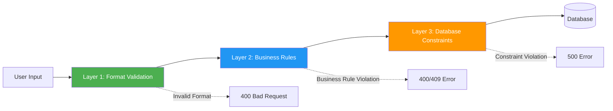

# Security Architecture

## Table of Contents
1. [Security Overview](#security-overview)
2. [Input Validation](#input-validation)
3. [Data Protection](#data-protection)
4. [API Security](#api-security)
5. [Database Security](#database-security)
6. [Network Security](#network-security)
7. [Security Best Practices](#security-best-practices)
8. [Compliance Considerations](#compliance-considerations)

## Security Overview

### Security Layers

```mermaid
graph TB
    subgraph "External Layer"
        Client[Client Application]
        Auth[External Auth Service]
    end

    subgraph "Network Layer"
        FW[Firewall]
        TLS[TLS/HTTPS]
    end

    subgraph "API Layer"
        Gateway[API Gateway]
        RateLimit[Rate Limiting]
        CORS[CORS Policy]
    end

    subgraph "Application Layer"
        InputVal[Input Validation]
        BizVal[Business Validation]
        Sanitize[Data Sanitization]
    end

    subgraph "Data Layer"
        Encrypt[Encryption at Rest]
        Access[Access Control]
        Audit[Audit Logging]
    end

    Client --> FW
    Auth --> Gateway
    FW --> TLS
    TLS --> Gateway
    Gateway --> RateLimit
    Gateway --> CORS
    Gateway --> InputVal
    InputVal --> BizVal
    BizVal --> Sanitize
    Sanitize --> Encrypt
    Encrypt --> Access
    Access --> Audit

    style "Network Layer" fill:#f44336,color:#fff
    style "API Layer" fill:#FF9800,color:#fff
    style "Application Layer" fill:#4CAF50,color:#fff
    style "Data Layer" fill:#2196F3,color:#fff
```

### Security Principles

1. **Defense in Depth**: Multiple security layers
2. **Least Privilege**: Minimum necessary access
3. **Fail Secure**: Default to secure state on failure
4. **Input Validation**: Never trust user input
5. **Audit Everything**: Comprehensive logging
6. **Encryption**: Protect sensitive data

### Phase 1 Security Boundaries

**Authentication**: External (not implemented in microservices)

**Authorization**: Assumed at API Gateway

**Focus Areas**:
- Input validation and sanitization
- SQL injection prevention
- XSS prevention
- Data encryption
- Secure communication
- Audit logging

## Input Validation

### Multi-Layer Validation Strategy



### Layer 1: Format Validation (Presentation Layer)

**Bean Validation (JSR-380)**:

```java
public class CreateStudentRequest {

    @NotBlank(message = "First name is required")
    @Size(min = 2, max = 50, message = "First name must be 2-50 characters")
    @Pattern(regexp = "^[A-Za-z\\s]+$", message = "First name must contain only letters")
    private String firstName;

    @NotBlank(message = "Last name is required")
    @Size(min = 2, max = 50, message = "Last name must be 2-50 characters")
    @Pattern(regexp = "^[A-Za-z\\s]+$", message = "Last name must contain only letters")
    private String lastName;

    @NotNull(message = "Date of birth is required")
    @Past(message = "Date of birth must be in the past")
    private LocalDate dateOfBirth;

    @NotBlank(message = "Mobile is required")
    @Pattern(regexp = "^[6-9][0-9]{9}$", message = "Invalid mobile number")
    private String mobile;

    @Email(message = "Invalid email format")
    private String email;

    @Pattern(regexp = "^[0-9]{12}$", message = "Aadhaar must be 12 digits")
    private String aadhaarNumber;

    @NotBlank(message = "Pin code is required")
    @Pattern(regexp = "^[1-9][0-9]{5}$", message = "Invalid pin code")
    private String pinCode;
}
```

**Controller Validation**:
```java
@RestController
@RequestMapping("/students")
@Validated
public class StudentController {

    @PostMapping
    public ResponseEntity<StudentDTO> createStudent(
            @Valid @RequestBody CreateStudentRequest request,
            @RequestHeader("X-User-ID") String userId) {
        // Validation happens automatically
        // If invalid, MethodArgumentNotValidException thrown
        return ResponseEntity.status(HttpStatus.CREATED)
            .body(studentService.registerStudent(request, userId));
    }
}
```

### Layer 2: Business Validation (Application Layer)

**Custom Validators**:

```java
@Component
public class AgeValidator {

    private static final int MIN_AGE = 3;
    private static final int MAX_AGE = 18;

    public void validate(LocalDate dateOfBirth) {
        if (dateOfBirth == null) {
            throw new IllegalArgumentException("Date of birth is required");
        }

        if (dateOfBirth.isAfter(LocalDate.now())) {
            throw new InvalidDateOfBirthException("Date of birth cannot be in the future");
        }

        int age = Period.between(dateOfBirth, LocalDate.now()).getYears();

        if (age < MIN_AGE || age > MAX_AGE) {
            throw new InvalidAgeException(
                String.format("Age must be between %d and %d years. Provided age: %d",
                    MIN_AGE, MAX_AGE, age)
            );
        }
    }
}

@Component
public class MobileValidator {

    private final StudentRepository studentRepository;

    public void validateUniqueness(String mobile, String excludeStudentId) {
        if (excludeStudentId != null) {
            if (studentRepository.existsByMobileAndStudentIdNot(mobile, excludeStudentId)) {
                throw new DuplicateMobileException(
                    "Mobile number already registered: " + mobile
                );
            }
        } else {
            if (studentRepository.existsByMobile(mobile)) {
                throw new DuplicateMobileException(
                    "Mobile number already registered: " + mobile
                );
            }
        }
    }
}
```

**Validation in Service**:
```java
@Service
@Transactional
public class StudentRegistrationService {

    private final AgeValidator ageValidator;
    private final MobileValidator mobileValidator;

    public StudentDTO registerStudent(CreateStudentRequest request, String userId) {
        // Business validation
        ageValidator.validate(request.getDateOfBirth());
        mobileValidator.validateUniqueness(request.getMobile(), null);

        // Proceed with registration
        // ...
    }
}
```

### Layer 3: Database Constraints

**Table Constraints** (as defined in database):
```sql
-- Check constraints
CONSTRAINT chk_student_status CHECK (status IN ('ACTIVE', 'INACTIVE')),
CONSTRAINT chk_mobile_format CHECK (mobile ~ '^[0-9]{10}$'),
CONSTRAINT chk_aadhaar_format CHECK (
    aadhaar_number IS NULL OR aadhaar_number ~ '^[0-9]{12}$'
),
CONSTRAINT chk_name_length CHECK (
    LENGTH(first_name) >= 2 AND LENGTH(last_name) >= 2
),

-- Unique constraints
CONSTRAINT uk_mobile UNIQUE (mobile),
CONSTRAINT uk_aadhaar UNIQUE (aadhaar_number) WHERE aadhaar_number IS NOT NULL
```

## Data Protection

### Sensitive Data Handling

**Sensitive Fields**:
- Aadhaar Number
- Mobile Number
- Email Address
- Personal Details (address, caste)

### Data Masking

**Logging Masking**:
```java
@Component
public class DataMaskingFilter {

    public String maskAadhaar(String aadhaar) {
        if (aadhaar == null || aadhaar.length() != 12) {
            return aadhaar;
        }
        return "XXXX-XXXX-" + aadhaar.substring(8);
    }

    public String maskMobile(String mobile) {
        if (mobile == null || mobile.length() != 10) {
            return mobile;
        }
        return "XXXXXX" + mobile.substring(6);
    }

    public String maskEmail(String email) {
        if (email == null || !email.contains("@")) {
            return email;
        }
        String[] parts = email.split("@");
        if (parts[0].length() <= 2) {
            return "XX@" + parts[1];
        }
        return parts[0].substring(0, 2) + "XXX@" + parts[1];
    }
}
```

**Logging with Masking**:
```java
@Service
@Slf4j
public class StudentService {

    private final DataMaskingFilter maskingFilter;

    public StudentDTO registerStudent(CreateStudentRequest request) {
        log.info("Registering student with mobile: {}",
            maskingFilter.maskMobile(request.getMobile()));

        // Process registration
    }
}
```

### Encryption at Rest

**Database-Level Encryption** (PostgreSQL):
```sql
-- Enable pgcrypto extension
CREATE EXTENSION IF NOT EXISTS pgcrypto;

-- Encrypt sensitive column
CREATE TABLE students_secure (
    student_id VARCHAR(50) PRIMARY KEY,
    first_name VARCHAR(50) NOT NULL,
    last_name VARCHAR(50) NOT NULL,
    aadhaar_encrypted BYTEA,  -- Encrypted Aadhaar
    -- other fields
);

-- Insert with encryption
INSERT INTO students_secure (student_id, aadhaar_encrypted)
VALUES ('STU-2025-00001', pgp_sym_encrypt('123456789012', 'encryption_key'));

-- Query with decryption
SELECT student_id, pgp_sym_decrypt(aadhaar_encrypted, 'encryption_key') as aadhaar
FROM students_secure;
```

**Application-Level Encryption** (Alternative):
```java
@Component
public class FieldEncryptor {

    private static final String ALGORITHM = "AES/GCM/NoPadding";
    private static final int GCM_TAG_LENGTH = 128;

    @Value("${encryption.key}")
    private String encryptionKey;

    public String encrypt(String plainText) throws Exception {
        SecretKey key = getKeyFromPassword(encryptionKey);
        Cipher cipher = Cipher.getInstance(ALGORITHM);
        GCMParameterSpec parameterSpec = new GCMParameterSpec(GCM_TAG_LENGTH, generateIv());

        cipher.init(Cipher.ENCRYPT_MODE, key, parameterSpec);
        byte[] cipherText = cipher.doFinal(plainText.getBytes(StandardCharsets.UTF_8));

        return Base64.getEncoder().encodeToString(cipherText);
    }

    public String decrypt(String cipherText) throws Exception {
        SecretKey key = getKeyFromPassword(encryptionKey);
        Cipher cipher = Cipher.getInstance(ALGORITHM);
        GCMParameterSpec parameterSpec = new GCMParameterSpec(GCM_TAG_LENGTH, extractIv(cipherText));

        cipher.init(Cipher.DECRYPT_MODE, key, parameterSpec);
        byte[] plainText = cipher.doFinal(Base64.getDecoder().decode(cipherText));

        return new String(plainText, StandardCharsets.UTF_8);
    }
}

// JPA Attribute Converter
@Converter
public class AadhaarEncryptionConverter implements AttributeConverter<String, String> {

    @Autowired
    private FieldEncryptor encryptor;

    @Override
    public String convertToDatabaseColumn(String attribute) {
        try {
            return attribute != null ? encryptor.encrypt(attribute) : null;
        } catch (Exception e) {
            throw new RuntimeException("Encryption failed", e);
        }
    }

    @Override
    public String convertToEntityAttribute(String dbData) {
        try {
            return dbData != null ? encryptor.decrypt(dbData) : null;
        } catch (Exception e) {
            throw new RuntimeException("Decryption failed", e);
        }
    }
}

// Entity with encrypted field
@Entity
public class Student {
    @Convert(converter = AadhaarEncryptionConverter.class)
    private String aadhaarNumber;
}
```

## API Security

### SQL Injection Prevention

**Use Parameterized Queries** (JPA does this automatically):
```java
// SAFE: JPA automatically parameterizes
@Repository
public interface StudentRepository extends JpaRepository<Student, String> {
    List<Student> findByLastName(String lastName);

    @Query("SELECT s FROM Student s WHERE s.lastName = :lastName")
    List<Student> findByLastNameCustom(@Param("lastName") String lastName);
}

// UNSAFE: Never construct queries with string concatenation
// DON'T DO THIS:
@Query(value = "SELECT * FROM students WHERE last_name = '" + lastName + "'", nativeQuery = true)
List<Student> unsafeQuery(String lastName);
```

**Safe Native Queries**:
```java
@Query(value = "SELECT * FROM students WHERE last_name = :lastName", nativeQuery = true)
List<Student> safeNativeQuery(@Param("lastName") String lastName);
```

### XSS Prevention

**Output Encoding**:
```java
@RestController
public class StudentController {

    // Jackson automatically escapes JSON
    @GetMapping("/{id}")
    public StudentDTO getStudent(@PathVariable String id) {
        return studentService.getStudent(id);
        // JSON response is automatically escaped
    }
}
```

**Content Security Policy**:
```java
@Configuration
public class SecurityConfig {

    @Bean
    public FilterRegistrationBean<ContentSecurityPolicyFilter> cspFilter() {
        FilterRegistrationBean<ContentSecurityPolicyFilter> registration =
            new FilterRegistrationBean<>();

        registration.setFilter(new ContentSecurityPolicyFilter());
        registration.addUrlPatterns("/*");
        registration.setOrder(1);

        return registration;
    }
}

public class ContentSecurityPolicyFilter implements Filter {

    @Override
    public void doFilter(ServletRequest request, ServletResponse response,
                         FilterChain chain) throws IOException, ServletException {
        HttpServletResponse httpResponse = (HttpServletResponse) response;

        httpResponse.setHeader("Content-Security-Policy",
            "default-src 'self'; script-src 'self'; style-src 'self' 'unsafe-inline'");
        httpResponse.setHeader("X-Content-Type-Options", "nosniff");
        httpResponse.setHeader("X-Frame-Options", "DENY");
        httpResponse.setHeader("X-XSS-Protection", "1; mode=block");

        chain.doFilter(request, response);
    }
}
```

### CORS Configuration

**API Gateway CORS**:
```yaml
spring:
  cloud:
    gateway:
      globalcors:
        cors-configurations:
          '[/**]':
            allowed-origins:
              - "http://localhost:3000"  # Frontend dev server
              - "https://school.example.com"  # Production domain
            allowed-methods:
              - GET
              - POST
              - PUT
              - PATCH
              - DELETE
              - OPTIONS
            allowed-headers:
              - "*"
            exposed-headers:
              - X-Request-ID
              - X-Response-Time
            allow-credentials: true
            max-age: 3600
```

**Service-Level CORS** (if accessed directly):
```java
@Configuration
public class CorsConfig {

    @Bean
    public WebMvcConfigurer corsConfigurer() {
        return new WebMvcConfigurer() {
            @Override
            public void addCorsMappings(CorsRegistry registry) {
                registry.addMapping("/**")
                    .allowedOrigins("http://localhost:3000", "https://school.example.com")
                    .allowedMethods("GET", "POST", "PUT", "PATCH", "DELETE")
                    .allowedHeaders("*")
                    .exposedHeaders("X-Request-ID", "X-Response-Time")
                    .allowCredentials(true)
                    .maxAge(3600);
            }
        };
    }
}
```

### Rate Limiting

**API Gateway Rate Limiting**:
```java
@Configuration
public class RateLimitConfig {

    @Bean
    public KeyResolver userKeyResolver() {
        return exchange -> Mono.just(
            exchange.getRequest()
                .getHeaders()
                .getFirst("X-User-ID")
        );
    }
}
```

```yaml
spring:
  cloud:
    gateway:
      routes:
        - id: student-service
          uri: lb://STUDENT-SERVICE
          predicates:
            - Path=/api/v1/students/**
          filters:
            - name: RequestRateLimiter
              args:
                redis-rate-limiter.replenishRate: 10  # requests per second
                redis-rate-limiter.burstCapacity: 20
                key-resolver: "#{@userKeyResolver}"
```

### Request Size Limits

**Application Configuration**:
```yaml
server:
  tomcat:
    max-http-post-size: 10MB
    max-swallow-size: 10MB

spring:
  servlet:
    multipart:
      max-file-size: 10MB
      max-request-size: 10MB
```

## Database Security

### Access Control

**Principle of Least Privilege**:
```sql
-- Create application user with limited privileges
CREATE USER student_app WITH PASSWORD 'strong_password';

-- Grant only necessary permissions
GRANT CONNECT ON DATABASE student_db TO student_app;
GRANT USAGE ON SCHEMA public TO student_app;

-- Table-level permissions
GRANT SELECT, INSERT, UPDATE, DELETE ON students TO student_app;
GRANT USAGE, SELECT ON SEQUENCE student_id_seq TO student_app;

-- NO DROP, TRUNCATE, or DDL permissions for application user

-- Separate user for migrations
CREATE USER student_migrator WITH PASSWORD 'migration_password';
GRANT ALL PRIVILEGES ON DATABASE student_db TO student_migrator;
```

### Connection Security

**SSL/TLS for Database Connections**:
```yaml
spring:
  datasource:
    url: jdbc:postgresql://db-host:5432/student_db?ssl=true&sslmode=require
    username: ${DB_USERNAME}
    password: ${DB_PASSWORD}
```

**Connection String Parameters**:
- `ssl=true`: Enable SSL
- `sslmode=require`: Require SSL connection
- `sslmode=verify-ca`: Verify CA certificate
- `sslmode=verify-full`: Verify CA and hostname

### Password Security

**Never Hardcode**:
```java
// BAD: Hardcoded password
@Value("mypassword")
private String dbPassword;

// GOOD: Environment variable
@Value("${DB_PASSWORD}")
private String dbPassword;
```

**Environment Variables**:
```bash
# .env file (never commit to git)
DB_USERNAME=student_user
DB_PASSWORD=secure_password_here
ENCRYPTION_KEY=encryption_key_here
```

**Docker Secrets** (for production):
```yaml
services:
  student-service:
    secrets:
      - db_password
      - encryption_key
    environment:
      - DB_PASSWORD_FILE=/run/secrets/db_password

secrets:
  db_password:
    external: true
  encryption_key:
    external: true
```

## Network Security

### HTTPS/TLS

**Production Requirement**: All external communication over HTTPS

**Certificate Configuration**:
```yaml
server:
  ssl:
    enabled: true
    key-store: classpath:keystore.p12
    key-store-password: ${KEYSTORE_PASSWORD}
    key-store-type: PKCS12
    key-alias: sms
```

**Redirect HTTP to HTTPS**:
```java
@Configuration
public class HttpsConfig {

    @Bean
    public ServletWebServerFactory servletContainer() {
        TomcatServletWebServerFactory tomcat = new TomcatServletWebServerFactory() {
            @Override
            protected void postProcessContext(Context context) {
                SecurityConstraint securityConstraint = new SecurityConstraint();
                securityConstraint.setUserConstraint("CONFIDENTIAL");
                SecurityCollection collection = new SecurityCollection();
                collection.addPattern("/*");
                securityConstraint.addCollection(collection);
                context.addConstraint(securityConstraint);
            }
        };

        tomcat.addAdditionalTomcatConnectors(redirectConnector());
        return tomcat;
    }

    private Connector redirectConnector() {
        Connector connector = new Connector(TomcatServletWebServerFactory.DEFAULT_PROTOCOL);
        connector.setScheme("http");
        connector.setPort(8080);
        connector.setSecure(false);
        connector.setRedirectPort(8443);
        return connector;
    }
}
```

### Network Isolation

**Docker Networks**:
```yaml
networks:
  frontend-network:
    driver: bridge
  backend-network:
    driver: bridge
    internal: true  # No external access

services:
  api-gateway:
    networks:
      - frontend-network
      - backend-network

  student-service:
    networks:
      - backend-network  # Not accessible from outside

  student-db:
    networks:
      - backend-network  # Not accessible from outside
```

## Security Best Practices

### 1. Secure Configuration Management

**Never Commit Secrets**:
```gitignore
# .gitignore
.env
application-*.properties
*-credentials.json
*.key
*.pem
```

**Use Environment Variables**:
```yaml
spring:
  datasource:
    username: ${DB_USERNAME:default_user}
    password: ${DB_PASSWORD}

encryption:
  key: ${ENCRYPTION_KEY}

jwt:
  secret: ${JWT_SECRET}
```

### 2. Audit Logging

**Security Events to Log**:
- Authentication attempts (success/failure)
- Authorization failures
- Data access (read sensitive data)
- Data modifications (create/update/delete)
- Configuration changes
- System errors

**Audit Log Implementation**:
```java
@Aspect
@Component
@Slf4j
public class AuditAspect {

    @AfterReturning(
        pointcut = "execution(* com.school.sms.student.application.service.*.*(..))",
        returning = "result"
    )
    public void logServiceCall(JoinPoint joinPoint, Object result) {
        String methodName = joinPoint.getSignature().getName();
        String className = joinPoint.getTarget().getClass().getSimpleName();
        Object[] args = joinPoint.getArgs();

        log.info("AUDIT: {}.{} called with args: {} returned: {}",
            className, methodName, args, result);
    }

    @AfterThrowing(
        pointcut = "execution(* com.school.sms.student.application.service.*.*(..))",
        throwing = "error"
    )
    public void logServiceException(JoinPoint joinPoint, Throwable error) {
        String methodName = joinPoint.getSignature().getName();
        String className = joinPoint.getTarget().getClass().getSimpleName();

        log.error("AUDIT: {}.{} threw exception: {}",
            className, methodName, error.getMessage());
    }
}
```

### 3. Error Handling

**Don't Expose Internal Details**:
```java
// BAD: Exposes internal structure
throw new RuntimeException("Database connection failed: " + dbConnection.getHost());

// GOOD: Generic message
throw new ServiceUnavailableException("Service temporarily unavailable");

// Log detailed error internally
log.error("Database connection failed", exception);
```

### 4. Dependency Security

**Scan Dependencies**:
```xml
<plugin>
    <groupId>org.owasp</groupId>
    <artifactId>dependency-check-maven</artifactId>
    <version>8.4.0</version>
    <executions>
        <execution>
            <goals>
                <goal>check</goal>
            </goals>
        </execution>
    </executions>
</plugin>
```

**Keep Dependencies Updated**:
```bash
# Check for updates
mvn versions:display-dependency-updates

# Update parent version
mvn versions:update-parent
```

### 5. Security Headers

**Comprehensive Security Headers**:
```java
@Component
public class SecurityHeadersFilter implements Filter {

    @Override
    public void doFilter(ServletRequest request, ServletResponse response,
                         FilterChain chain) throws IOException, ServletException {
        HttpServletResponse httpResponse = (HttpServletResponse) response;

        // Prevent XSS
        httpResponse.setHeader("X-XSS-Protection", "1; mode=block");

        // Prevent MIME sniffing
        httpResponse.setHeader("X-Content-Type-Options", "nosniff");

        // Prevent clickjacking
        httpResponse.setHeader("X-Frame-Options", "DENY");

        // HSTS
        httpResponse.setHeader("Strict-Transport-Security",
            "max-age=31536000; includeSubDomains");

        // Referrer policy
        httpResponse.setHeader("Referrer-Policy", "no-referrer-when-downgrade");

        // Permissions policy
        httpResponse.setHeader("Permissions-Policy",
            "geolocation=(), microphone=(), camera=()");

        chain.doFilter(request, response);
    }
}
```

## Compliance Considerations

### Data Privacy Regulations

**Applicable Regulations** (for India):
- **Digital Personal Data Protection Act (DPDPA), 2023**
- **Aadhaar Act, 2016** - Special handling for Aadhaar data
- **Information Technology Act, 2000**

**Key Requirements**:
1. **Consent**: Obtain consent for data collection
2. **Purpose Limitation**: Use data only for stated purpose
3. **Data Minimization**: Collect only necessary data
4. **Retention**: Delete data when no longer needed
5. **Access Rights**: Provide data access to individuals
6. **Security**: Implement reasonable security measures

### Aadhaar Data Handling

**Special Protections**:
```java
@Component
public class AadhaarValidator {

    // Never log Aadhaar in plain text
    public void validateAadhaar(String aadhaar) {
        if (aadhaar != null && !aadhaar.matches("^[0-9]{12}$")) {
            log.warn("Invalid Aadhaar format provided"); // Don't log value
            throw new InvalidAadhaarException();
        }
    }

    // Mask for display
    public String maskAadhaar(String aadhaar) {
        if (aadhaar == null || aadhaar.length() != 12) {
            return null;
        }
        return "XXXX-XXXX-" + aadhaar.substring(8);
    }
}
```

**Storage Requirements**:
- Encrypt Aadhaar at rest
- Never include in URLs or logs
- Limit access to authorized personnel
- Regular security audits

### Audit Requirements

**Maintain Audit Trail**:
- Who accessed what data
- When was data accessed/modified
- What changes were made
- Retain for required period (7 years recommended)

## Summary

The security architecture provides:

1. **Multi-Layer Validation**: Defense in depth approach
2. **Data Protection**: Encryption, masking, and secure handling
3. **API Security**: SQL injection prevention, XSS protection, CORS
4. **Database Security**: Access control, encrypted connections
5. **Network Security**: TLS, network isolation
6. **Audit Logging**: Comprehensive security event tracking
7. **Compliance**: Adherence to data protection regulations

The next document ([Deployment Architecture](07-DEPLOYMENT-ARCHITECTURE.md)) covers containerization and deployment strategies.

---

**Version**: 1.0
**Last Updated**: 2025-11-17
**Status**: Draft for Review
