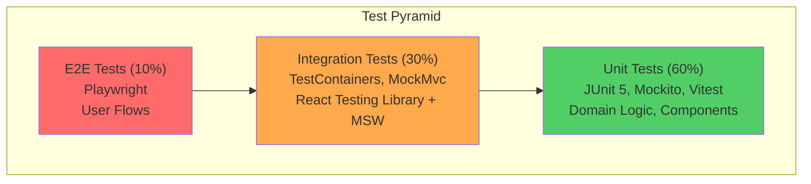

# Testing Strategy - School Management System

## 1. Overview

This document defines the comprehensive testing strategy for the School Management System, following the test pyramid approach with emphasis on automated testing, coverage targets, and quality gates.

## 2. Test Pyramid Approach



**Distribution Rationale:**
- **Unit Tests (60%)**: Fast, isolated, test individual components/functions
- **Integration Tests (30%)**: Test component interactions, API contracts
- **E2E Tests (10%)**: Test complete user journeys, critical paths

## 3. Backend Testing Strategy

### 3.1 Unit Tests (60%)

**Purpose**: Test individual classes, methods, and domain logic in isolation.

**Tools:**
- JUnit 5
- Mockito
- AssertJ

**Coverage Areas:**

#### 3.1.1 Domain Layer Tests

**Test: Student Aggregate**
```java
package com.school.sms.student.domain.model;

import org.junit.jupiter.api.Test;
import org.junit.jupiter.api.DisplayName;
import static org.assertj.core.api.Assertions.*;
import java.time.LocalDate;

class StudentTest {

    @Test
    @DisplayName("Should create student with valid age (3-18 years)")
    void shouldCreateStudentWithValidAge() {
        // Given
        LocalDate validBirthDate = LocalDate.now().minusYears(10);
        StudentId studentId = StudentId.of("STU-2025-00001");
        Mobile mobile = Mobile.of("+919876543210");

        // When
        Student student = Student.register(
            studentId,
            "Rajesh",
            "Kumar",
            "123 MG Road, Bangalore",
            mobile,
            validBirthDate,
            "Suresh Kumar",
            "Lakshmi Kumar",
            "Mole on left cheek",
            "rajesh@example.com",
            "123456789012",
            "admin"
        );

        // Then
        assertThat(student).isNotNull();
        assertThat(student.getStudentId()).isEqualTo(studentId);
        assertThat(student.getStatus()).isEqualTo(StudentStatus.ACTIVE);
        assertThat(student.getCurrentAge()).isEqualTo(10);
    }

    @Test
    @DisplayName("Should throw exception for invalid age (below 3 years)")
    void shouldRejectStudentBelowMinimumAge() {
        // Given
        LocalDate invalidBirthDate = LocalDate.now().minusYears(2);
        StudentId studentId = StudentId.of("STU-2025-00001");
        Mobile mobile = Mobile.of("+919876543210");

        // When & Then
        assertThatThrownBy(() -> Student.register(
            studentId, "John", "Doe", "Address", mobile, invalidBirthDate,
            "Father", "Mother", null, null, null, "admin"
        ))
        .isInstanceOf(IllegalArgumentException.class)
        .hasMessageContaining("Student age must be between 3 and 18 years");
    }

    @Test
    @DisplayName("Should throw exception for invalid age (above 18 years)")
    void shouldRejectStudentAboveMaximumAge() {
        // Given
        LocalDate invalidBirthDate = LocalDate.now().minusYears(19);
        StudentId studentId = StudentId.of("STU-2025-00001");
        Mobile mobile = Mobile.of("+919876543210");

        // When & Then
        assertThatThrownBy(() -> Student.register(
            studentId, "John", "Doe", "Address", mobile, invalidBirthDate,
            "Father", "Mother", null, null, null, "admin"
        ))
        .isInstanceOf(IllegalArgumentException.class)
        .hasMessageContaining("Student age must be between 3 and 18 years");
    }

    @Test
    @DisplayName("Should update editable fields only")
    void shouldUpdateOnlyEditableFields() {
        // Given
        Student student = createValidStudent();
        Mobile newMobile = Mobile.of("+918765432109");

        // When
        student.updateProfile("Updated First", "Updated Last", newMobile, "admin");

        // Then
        assertThat(student.getFirstName()).isEqualTo("Updated First");
        assertThat(student.getLastName()).isEqualTo("Updated Last");
        assertThat(student.getMobile()).isEqualTo(newMobile);
        assertThat(student.getDateOfBirth()).isNotNull(); // Unchanged
    }

    @Test
    @DisplayName("Should change student status")
    void shouldChangeStudentStatus() {
        // Given
        Student student = createValidStudent();
        assertThat(student.getStatus()).isEqualTo(StudentStatus.ACTIVE);

        // When
        student.changeStatus(StudentStatus.INACTIVE, "admin");

        // Then
        assertThat(student.getStatus()).isEqualTo(StudentStatus.INACTIVE);
        assertThat(student.isActive()).isFalse();
    }

    private Student createValidStudent() {
        return Student.register(
            StudentId.of("STU-2025-00001"),
            "Rajesh", "Kumar", "Address",
            Mobile.of("+919876543210"),
            LocalDate.now().minusYears(10),
            "Father", "Mother", null, null, null, "admin"
        );
    }
}
```

**Test: Value Objects**
```java
class StudentIdTest {

    @Test
    @DisplayName("Should create valid StudentId")
    void shouldCreateValidStudentId() {
        // When
        StudentId studentId = StudentId.of("STU-2025-00001");

        // Then
        assertThat(studentId.getValue()).isEqualTo("STU-2025-00001");
    }

    @Test
    @DisplayName("Should reject invalid StudentId format")
    void shouldRejectInvalidFormat() {
        assertThatThrownBy(() -> StudentId.of("INVALID"))
            .isInstanceOf(IllegalArgumentException.class)
            .hasMessageContaining("Invalid StudentId format");
    }
}

class MobileTest {

    @Test
    @DisplayName("Should accept valid mobile formats")
    void shouldAcceptValidFormats() {
        assertThat(Mobile.of("+919876543210").getNumber()).isEqualTo("+919876543210");
        assertThat(Mobile.of("9876543210").getNumber()).isEqualTo("9876543210");
    }

    @Test
    @DisplayName("Should reject invalid mobile format")
    void shouldRejectInvalidFormat() {
        assertThatThrownBy(() -> Mobile.of("12345"))
            .isInstanceOf(IllegalArgumentException.class)
            .hasMessageContaining("Invalid mobile number format");
    }
}
```

#### 3.1.2 Service Layer Tests

**Test: StudentService**
```java
@ExtendWith(MockitoExtension.class)
class StudentServiceImplTest {

    @Mock
    private StudentRepository studentRepository;

    @Mock
    private StudentIdGenerator studentIdGenerator;

    @Mock
    private RulesService rulesService;

    @Mock
    private StudentCacheService cacheService;

    @Mock
    private StudentMapper studentMapper;

    @InjectMocks
    private StudentServiceImpl studentService;

    @Test
    @DisplayName("Should create student successfully")
    void shouldCreateStudentSuccessfully() {
        // Given
        CreateStudentRequest request = createValidRequest();
        StudentId generatedId = StudentId.of("STU-2025-00001");
        Student student = createValidStudent(generatedId);
        StudentResponse expectedResponse = createStudentResponse(student);

        when(studentIdGenerator.generateNext()).thenReturn(generatedId);
        when(studentRepository.existsByMobile(any())).thenReturn(false);
        when(studentRepository.save(any())).thenReturn(student);
        when(studentMapper.toResponse(any())).thenReturn(expectedResponse);

        // When
        StudentResponse response = studentService.createStudent(request);

        // Then
        assertThat(response.getStudentId()).isEqualTo("STU-2025-00001");
        verify(rulesService).validateStudentRegistration(request);
        verify(studentRepository).save(any(Student.class));
        verify(cacheService).cacheStudent(any(Student.class));
    }

    @Test
    @DisplayName("Should throw exception for duplicate mobile")
    void shouldThrowExceptionForDuplicateMobile() {
        // Given
        CreateStudentRequest request = createValidRequest();
        when(studentRepository.existsByMobile(any())).thenReturn(true);

        // When & Then
        assertThatThrownBy(() -> studentService.createStudent(request))
            .isInstanceOf(DuplicateMobileException.class)
            .hasMessageContaining("already exists");

        verify(studentRepository, never()).save(any());
    }

    @Test
    @DisplayName("Should update student and invalidate cache")
    void shouldUpdateStudentAndInvalidateCache() {
        // Given
        Long studentId = 1L;
        UpdateStudentRequest request = createUpdateRequest();
        Student existingStudent = createValidStudent();

        when(studentRepository.findById(studentId)).thenReturn(Optional.of(existingStudent));
        when(studentRepository.existsByMobile(any())).thenReturn(false);
        when(studentRepository.save(any())).thenReturn(existingStudent);

        // When
        studentService.updateStudent(studentId, request);

        // Then
        verify(studentRepository).save(any(Student.class));
        verify(cacheService).evictStudent(existingStudent.getStudentId().getValue());
    }
}
```

#### 3.1.3 Drools Rules Tests

**Test: Student Rules**
```java
class StudentRulesTest {

    private KieSession kieSession;

    @BeforeEach
    void setup() {
        KieServices kieServices = KieServices.Factory.get();
        KieContainer kieContainer = kieServices.getKieClasspathContainer();
        kieSession = kieContainer.newKieSession();
    }

    @AfterEach
    void cleanup() {
        kieSession.dispose();
    }

    @Test
    @DisplayName("Should validate student age within range (3-18)")
    void shouldPassAgeValidationForValidAge() {
        // Given
        CreateStudentRequest request = CreateStudentRequest.builder()
            .dateOfBirth(LocalDate.now().minusYears(10))
            .mobile("+919876543210")
            .build();

        List<String> validationErrors = new ArrayList<>();
        kieSession.setGlobal("validationErrors", validationErrors);

        // When
        kieSession.insert(request);
        kieSession.fireAllRules();

        // Then
        assertThat(validationErrors).isEmpty();
    }

    @Test
    @DisplayName("Should fail age validation for age below 3")
    void shouldFailAgeValidationForYoungStudent() {
        // Given
        CreateStudentRequest request = CreateStudentRequest.builder()
            .dateOfBirth(LocalDate.now().minusYears(2))
            .mobile("+919876543210")
            .build();

        List<String> validationErrors = new ArrayList<>();
        kieSession.setGlobal("validationErrors", validationErrors);

        // When
        kieSession.insert(request);
        kieSession.fireAllRules();

        // Then
        assertThat(validationErrors).isNotEmpty();
        assertThat(validationErrors.get(0)).contains("age must be between 3 and 18 years");
    }

    @Test
    @DisplayName("Should fail validation for empty mobile")
    void shouldFailValidationForEmptyMobile() {
        // Given
        CreateStudentRequest request = CreateStudentRequest.builder()
            .dateOfBirth(LocalDate.now().minusYears(10))
            .mobile("")
            .build();

        List<String> validationErrors = new ArrayList<>();
        kieSession.setGlobal("validationErrors", validationErrors);

        // When
        kieSession.insert(request);
        kieSession.fireAllRules();

        // Then
        assertThat(validationErrors).contains("Mobile number is required");
    }
}
```

#### 3.1.4 MapStruct Mapper Tests

**Test: StudentMapper**
```java
@SpringBootTest
class StudentMapperTest {

    @Autowired
    private StudentMapper studentMapper;

    @Test
    @DisplayName("Should map Student entity to StudentResponse DTO")
    void shouldMapStudentToResponse() {
        // Given
        Student student = Student.builder()
            .id(1L)
            .studentId(StudentId.of("STU-2025-00001"))
            .firstName("Rajesh")
            .lastName("Kumar")
            .mobile(Mobile.of("+919876543210"))
            .dateOfBirth(LocalDate.now().minusYears(10))
            .status(StudentStatus.ACTIVE)
            .build();

        // When
        StudentResponse response = studentMapper.toResponse(student);

        // Then
        assertThat(response.getId()).isEqualTo(1L);
        assertThat(response.getStudentId()).isEqualTo("STU-2025-00001");
        assertThat(response.getFirstName()).isEqualTo("Rajesh");
        assertThat(response.getAge()).isEqualTo(10);
        assertThat(response.getStatus()).isEqualTo("ACTIVE");
    }
}
```

### 3.2 Integration Tests (30%)

**Purpose**: Test interactions between components, database, and external systems.

**Tools:**
- Spring Boot Test (@SpringBootTest)
- TestContainers (PostgreSQL, Redis)
- MockMvc (@WebMvcTest)
- AssertJ

#### 3.2.1 Repository Tests

**Test: StudentRepository**
```java
@DataJpaTest
@AutoConfigureTestDatabase(replace = AutoConfigureTestDatabase.Replace.NONE)
@Testcontainers
class StudentRepositoryTest {

    @Container
    static PostgreSQLContainer<?> postgres = new PostgreSQLContainer<>("postgres:18")
        .withDatabaseName("testdb")
        .withUsername("test")
        .withPassword("test");

    @DynamicPropertySource
    static void configureProperties(DynamicPropertyRegistry registry) {
        registry.add("spring.datasource.url", postgres::getJdbcUrl);
        registry.add("spring.datasource.username", postgres::getUsername);
        registry.add("spring.datasource.password", postgres::getPassword);
    }

    @Autowired
    private JpaStudentRepository repository;

    @Test
    @DisplayName("Should save and retrieve student")
    void shouldSaveAndRetrieveStudent() {
        // Given
        StudentJpaEntity student = StudentJpaEntity.builder()
            .studentId("STU-2025-00001")
            .firstName("Rajesh")
            .lastName("Kumar")
            .address("123 MG Road")
            .mobile("+919876543210")
            .dateOfBirth(LocalDate.now().minusYears(10))
            .fatherName("Suresh Kumar")
            .status("Active")
            .build();

        // When
        StudentJpaEntity saved = repository.save(student);
        Optional<StudentJpaEntity> retrieved = repository.findById(saved.getId());

        // Then
        assertThat(retrieved).isPresent();
        assertThat(retrieved.get().getStudentId()).isEqualTo("STU-2025-00001");
    }

    @Test
    @DisplayName("Should find student by StudentId")
    void shouldFindByStudentId() {
        // Given
        StudentJpaEntity student = createAndSaveStudent("STU-2025-00001");

        // When
        Optional<StudentJpaEntity> found = repository.findByStudentId("STU-2025-00001");

        // Then
        assertThat(found).isPresent();
        assertThat(found.get().getId()).isEqualTo(student.getId());
    }

    @Test
    @DisplayName("Should enforce unique mobile constraint")
    void shouldEnforceUniqueMobileConstraint() {
        // Given
        createAndSaveStudent("STU-2025-00001", "+919876543210");

        StudentJpaEntity duplicate = StudentJpaEntity.builder()
            .studentId("STU-2025-00002")
            .firstName("Another")
            .lastName("Student")
            .mobile("+919876543210") // Same mobile
            .dateOfBirth(LocalDate.now().minusYears(10))
            .fatherName("Father")
            .status("Active")
            .build();

        // When & Then
        assertThatThrownBy(() -> repository.saveAndFlush(duplicate))
            .isInstanceOf(DataIntegrityViolationException.class);
    }

    @Test
    @DisplayName("Should search students by last name")
    void shouldSearchByLastName() {
        // Given
        createAndSaveStudent("STU-2025-00001", "Kumar", "+919876543210");
        createAndSaveStudent("STU-2025-00002", "Kumar", "+919876543211");
        createAndSaveStudent("STU-2025-00003", "Sharma", "+919876543212");

        // When
        Page<StudentJpaEntity> results = repository.findByLastNameContainingIgnoreCase(
            "kumar", PageRequest.of(0, 10)
        );

        // Then
        assertThat(results.getTotalElements()).isEqualTo(2);
    }

    @Test
    @DisplayName("Should count students by StudentId prefix")
    void shouldCountByStudentIdPrefix() {
        // Given
        createAndSaveStudent("STU-2025-00001");
        createAndSaveStudent("STU-2025-00002");
        createAndSaveStudent("STU-2024-00001");

        // When
        long count = repository.countByStudentIdStartingWith("STU-2025-");

        // Then
        assertThat(count).isEqualTo(2);
    }

    private StudentJpaEntity createAndSaveStudent(String studentId) {
        return createAndSaveStudent(studentId, "Kumar", "+919876543210");
    }

    private StudentJpaEntity createAndSaveStudent(String studentId, String mobile) {
        return createAndSaveStudent(studentId, "Kumar", mobile);
    }

    private StudentJpaEntity createAndSaveStudent(String studentId, String lastName, String mobile) {
        StudentJpaEntity student = StudentJpaEntity.builder()
            .studentId(studentId)
            .firstName("Test")
            .lastName(lastName)
            .address("Address")
            .mobile(mobile)
            .dateOfBirth(LocalDate.now().minusYears(10))
            .fatherName("Father")
            .status("Active")
            .build();
        return repository.save(student);
    }
}
```

#### 3.2.2 Controller Tests

**Test: StudentController**
```java
@WebMvcTest(StudentController.class)
class StudentControllerTest {

    @Autowired
    private MockMvc mockMvc;

    @MockBean
    private StudentService studentService;

    @Autowired
    private ObjectMapper objectMapper;

    @Test
    @DisplayName("POST /api/v1/students should create student and return 201")
    void shouldCreateStudent() throws Exception {
        // Given
        CreateStudentRequest request = CreateStudentRequest.builder()
            .firstName("Rajesh")
            .lastName("Kumar")
            .address("123 MG Road, Bangalore")
            .mobile("+919876543210")
            .dateOfBirth(LocalDate.now().minusYears(10))
            .fatherName("Suresh Kumar")
            .build();

        StudentResponse response = StudentResponse.builder()
            .id(1L)
            .studentId("STU-2025-00001")
            .firstName("Rajesh")
            .lastName("Kumar")
            .status("Active")
            .build();

        when(studentService.createStudent(any())).thenReturn(response);

        // When & Then
        mockMvc.perform(post("/api/v1/students")
                .contentType(MediaType.APPLICATION_JSON)
                .content(objectMapper.writeValueAsString(request)))
            .andExpect(status().isCreated())
            .andExpect(jsonPath("$.studentId").value("STU-2025-00001"))
            .andExpect(jsonPath("$.firstName").value("Rajesh"));
    }

    @Test
    @DisplayName("POST /api/v1/students should return 400 for invalid data")
    void shouldReturn400ForInvalidData() throws Exception {
        // Given - Invalid request (missing required fields)
        CreateStudentRequest invalidRequest = CreateStudentRequest.builder()
            .firstName("") // Empty
            .build();

        // When & Then
        mockMvc.perform(post("/api/v1/students")
                .contentType(MediaType.APPLICATION_JSON)
                .content(objectMapper.writeValueAsString(invalidRequest)))
            .andExpect(status().isBadRequest())
            .andExpect(jsonPath("$.title").value("Validation Failed"));
    }

    @Test
    @DisplayName("GET /api/v1/students/{id} should return student")
    void shouldGetStudentById() throws Exception {
        // Given
        StudentResponse response = StudentResponse.builder()
            .id(1L)
            .studentId("STU-2025-00001")
            .firstName("Rajesh")
            .lastName("Kumar")
            .build();

        when(studentService.getStudentById(1L)).thenReturn(response);

        // When & Then
        mockMvc.perform(get("/api/v1/students/1"))
            .andExpect(status().isOk())
            .andExpect(jsonPath("$.studentId").value("STU-2025-00001"));
    }

    @Test
    @DisplayName("GET /api/v1/students/{id} should return 404 for non-existent student")
    void shouldReturn404ForNonExistentStudent() throws Exception {
        // Given
        when(studentService.getStudentById(999L))
            .thenThrow(new StudentNotFoundException("Student not found"));

        // When & Then
        mockMvc.perform(get("/api/v1/students/999"))
            .andExpect(status().isNotFound())
            .andExpect(jsonPath("$.title").value("Resource Not Found"));
    }
}
```

#### 3.2.3 Full Application Context Tests

**Test: Student Registration Flow**
```java
@SpringBootTest(webEnvironment = SpringBootTest.WebEnvironment.RANDOM_PORT)
@Testcontainers
class StudentRegistrationIntegrationTest {

    @Container
    static PostgreSQLContainer<?> postgres = new PostgreSQLContainer<>("postgres:18");

    @Container
    static GenericContainer<?> redis = new GenericContainer<>("redis:7.2")
        .withExposedPorts(6379);

    @DynamicPropertySource
    static void configureProperties(DynamicPropertyRegistry registry) {
        registry.add("spring.datasource.url", postgres::getJdbcUrl);
        registry.add("spring.datasource.username", postgres::getUsername);
        registry.add("spring.datasource.password", postgres::getPassword);
        registry.add("spring.redis.host", redis::getHost);
        registry.add("spring.redis.port", redis::getFirstMappedPort);
    }

    @Autowired
    private TestRestTemplate restTemplate;

    @Test
    @DisplayName("Should register student end-to-end")
    void shouldRegisterStudentEndToEnd() {
        // Given
        CreateStudentRequest request = CreateStudentRequest.builder()
            .firstName("Rajesh")
            .lastName("Kumar")
            .address("123 MG Road, Bangalore")
            .mobile("+919876543210")
            .dateOfBirth(LocalDate.now().minusYears(10))
            .fatherName("Suresh Kumar")
            .build();

        // When - Create student
        ResponseEntity<StudentResponse> createResponse = restTemplate.postForEntity(
            "/api/v1/students", request, StudentResponse.class
        );

        // Then - Verify creation
        assertThat(createResponse.getStatusCode()).isEqualTo(HttpStatus.CREATED);
        assertThat(createResponse.getBody()).isNotNull();
        assertThat(createResponse.getBody().getStudentId()).matches("STU-\\d{4}-\\d{5}");

        // When - Retrieve created student
        Long studentId = createResponse.getBody().getId();
        ResponseEntity<StudentResponse> getResponse = restTemplate.getForEntity(
            "/api/v1/students/" + studentId, StudentResponse.class
        );

        // Then - Verify retrieval
        assertThat(getResponse.getStatusCode()).isEqualTo(HttpStatus.OK);
        assertThat(getResponse.getBody().getFirstName()).isEqualTo("Rajesh");
    }

    @Test
    @DisplayName("Should prevent duplicate mobile registration")
    void shouldPreventDuplicateMobile() {
        // Given
        CreateStudentRequest request1 = createStudentRequest("+919876543210");
        CreateStudentRequest request2 = createStudentRequest("+919876543210"); // Same mobile

        // When - Create first student
        restTemplate.postForEntity("/api/v1/students", request1, StudentResponse.class);

        // When - Try to create duplicate
        ResponseEntity<ProblemDetail> duplicateResponse = restTemplate.postForEntity(
            "/api/v1/students", request2, ProblemDetail.class
        );

        // Then
        assertThat(duplicateResponse.getStatusCode()).isEqualTo(HttpStatus.CONFLICT);
        assertThat(duplicateResponse.getBody().getDetail()).contains("already exists");
    }
}
```

## 4. Frontend Testing Strategy

### 4.1 Unit Tests (60%)

**Tools:**
- Vitest
- React Testing Library
- @testing-library/user-event

#### 4.1.1 Utility Function Tests

**Test: formatters.ts**
```typescript
import { describe, it, expect } from 'vitest';
import { formatDate, formatMobile, calculateAge } from '@/utils/formatters';

describe('formatters', () => {
  describe('formatDate', () => {
    it('should format ISO date to DD-MM-YYYY', () => {
      expect(formatDate('2015-05-15')).toBe('15-05-2015');
    });

    it('should handle invalid date', () => {
      expect(formatDate('invalid')).toBe('Invalid Date');
    });
  });

  describe('formatMobile', () => {
    it('should format mobile with country code', () => {
      expect(formatMobile('+919876543210')).toBe('+91 98765 43210');
    });

    it('should format mobile without country code', () => {
      expect(formatMobile('9876543210')).toBe('98765 43210');
    });
  });

  describe('calculateAge', () => {
    it('should calculate age correctly', () => {
      const birthDate = new Date();
      birthDate.setFullYear(birthDate.getFullYear() - 10);
      expect(calculateAge(birthDate.toISOString().split('T')[0])).toBe(10);
    });
  });
});
```

#### 4.1.2 Custom Hook Tests

**Test: useDebounce.ts**
```typescript
import { renderHook, act } from '@testing-library/react';
import { describe, it, expect, vi } from 'vitest';
import { useDebounce } from '@/hooks/useDebounce';

describe('useDebounce', () => {
  it('should debounce value changes', async () => {
    vi.useFakeTimers();

    const { result, rerender } = renderHook(
      ({ value, delay }) => useDebounce(value, delay),
      { initialProps: { value: 'initial', delay: 500 } }
    );

    expect(result.current).toBe('initial');

    // Change value
    rerender({ value: 'updated', delay: 500 });

    // Before delay
    expect(result.current).toBe('initial');

    // After delay
    act(() => {
      vi.advanceTimersByTime(500);
    });

    expect(result.current).toBe('updated');

    vi.useRealTimers();
  });
});
```

#### 4.1.3 Component Unit Tests

**Test: StatusBadge.tsx**
```typescript
import { describe, it, expect } from 'vitest';
import { render, screen } from '@testing-library/react';
import { StatusBadge } from '@/features/student/components/StatusBadge';

describe('StatusBadge', () => {
  it('should render Active status with correct styling', () => {
    render(<StatusBadge status="Active" />);

    const badge = screen.getByText('Active');
    expect(badge).toBeInTheDocument();
    expect(badge).toHaveClass('bg-green-100', 'text-green-800');
  });

  it('should render Inactive status with correct styling', () => {
    render(<StatusBadge status="Inactive" />);

    const badge = screen.getByText('Inactive');
    expect(badge).toBeInTheDocument();
    expect(badge).toHaveClass('bg-gray-100', 'text-gray-800');
  });
});
```

**Test: Input.tsx**
```typescript
import { describe, it, expect, vi } from 'vitest';
import { render, screen } from '@testing-library/react';
import userEvent from '@testing-library/user-event';
import { Input } from '@/components/common/Input';

describe('Input', () => {
  it('should render label', () => {
    render(<Input label="First Name" />);
    expect(screen.getByText('First Name')).toBeInTheDocument();
  });

  it('should show required indicator', () => {
    render(<Input label="First Name" required />);
    expect(screen.getByText('*')).toBeInTheDocument();
  });

  it('should display error message', () => {
    render(<Input label="First Name" error="This field is required" />);
    expect(screen.getByText('This field is required')).toBeInTheDocument();
  });

  it('should handle user input', async () => {
    const user = userEvent.setup();
    const handleChange = vi.fn();

    render(<Input label="First Name" onChange={handleChange} />);

    const input = screen.getByLabelText('First Name');
    await user.type(input, 'John');

    expect(handleChange).toHaveBeenCalled();
  });

  it('should render as textarea when multiline', () => {
    render(<Input label="Address" multiline rows={3} />);
    expect(screen.getByLabelText('Address')).toBeInstanceOf(HTMLTextAreaElement);
  });
});
```

### 4.2 Integration Tests (30%)

**Tools:**
- React Testing Library
- MSW (Mock Service Worker)
- Vitest

#### 4.2.1 Form Integration Tests

**Test: StudentForm.tsx**
```typescript
import { describe, it, expect, vi } from 'vitest';
import { render, screen, waitFor } from '@testing-library/react';
import userEvent from '@testing-library/user-event';
import { StudentForm } from '@/features/student/components/StudentForm';

describe('StudentForm Integration', () => {
  it('should submit valid form data', async () => {
    const user = userEvent.setup();
    const onSubmit = vi.fn();

    render(<StudentForm onSubmit={onSubmit} />);

    // Fill form
    await user.type(screen.getByLabelText(/First Name/i), 'Rajesh');
    await user.type(screen.getByLabelText(/Last Name/i), 'Kumar');
    await user.type(screen.getByLabelText(/Mobile/i), '+919876543210');
    await user.type(screen.getByLabelText(/Date of Birth/i), '2015-05-15');
    await user.type(screen.getByLabelText(/Address/i), '123 MG Road, Bangalore');
    await user.type(screen.getByLabelText(/Father Name/i), 'Suresh Kumar');

    // Submit
    await user.click(screen.getByRole('button', { name: /Save Student/i }));

    await waitFor(() => {
      expect(onSubmit).toHaveBeenCalledWith(
        expect.objectContaining({
          firstName: 'Rajesh',
          lastName: 'Kumar',
          mobile: '+919876543210',
        })
      );
    });
  });

  it('should show validation errors for invalid data', async () => {
    const user = userEvent.setup();
    const onSubmit = vi.fn();

    render(<StudentForm onSubmit={onSubmit} />);

    // Submit without filling required fields
    await user.click(screen.getByRole('button', { name: /Save Student/i }));

    await waitFor(() => {
      expect(screen.getByText(/First name is required/i)).toBeInTheDocument();
      expect(screen.getByText(/Last name is required/i)).toBeInTheDocument();
      expect(onSubmit).not.toHaveBeenCalled();
    });
  });

  it('should validate age range', async () => {
    const user = userEvent.setup();
    const onSubmit = vi.fn();

    render(<StudentForm onSubmit={onSubmit} />);

    // Fill with invalid age (2 years old)
    const twoYearsAgo = new Date();
    twoYearsAgo.setFullYear(twoYearsAgo.getFullYear() - 2);

    await user.type(screen.getByLabelText(/Date of Birth/i), twoYearsAgo.toISOString().split('T')[0]);
    await user.click(screen.getByRole('button', { name: /Save Student/i }));

    await waitFor(() => {
      expect(screen.getByText(/must be between 3 and 18 years old/i)).toBeInTheDocument();
    });
  });
});
```

#### 4.2.2 API Integration Tests with MSW

**Test: useCreateStudent with MSW**
```typescript
import { describe, it, expect, beforeAll, afterAll, afterEach } from 'vitest';
import { renderHook, waitFor } from '@testing-library/react';
import { QueryClient, QueryClientProvider } from '@tanstack/react-query';
import { setupServer } from 'msw/node';
import { rest } from 'msw';
import { useCreateStudent } from '@/features/student/hooks/useCreateStudent';

const server = setupServer(
  rest.post('http://localhost:8081/api/v1/students', (req, res, ctx) => {
    return res(
      ctx.status(201),
      ctx.json({
        id: 1,
        studentId: 'STU-2025-00001',
        firstName: 'Rajesh',
        lastName: 'Kumar',
        status: 'Active',
      })
    );
  })
);

beforeAll(() => server.listen());
afterEach(() => server.resetHandlers());
afterAll(() => server.close());

describe('useCreateStudent with MSW', () => {
  it('should create student successfully', async () => {
    const queryClient = new QueryClient();
    const wrapper = ({ children }) => (
      <QueryClientProvider client={queryClient}>{children}</QueryClientProvider>
    );

    const { result } = renderHook(() => useCreateStudent(), { wrapper });

    const studentData = {
      firstName: 'Rajesh',
      lastName: 'Kumar',
      address: '123 MG Road',
      mobile: '+919876543210',
      dateOfBirth: '2015-05-15',
      fatherName: 'Suresh Kumar',
    };

    result.current.mutate(studentData);

    await waitFor(() => {
      expect(result.current.isSuccess).toBe(true);
      expect(result.current.data?.studentId).toBe('STU-2025-00001');
    });
  });

  it('should handle API errors', async () => {
    server.use(
      rest.post('http://localhost:8081/api/v1/students', (req, res, ctx) => {
        return res(
          ctx.status(409),
          ctx.json({
            title: 'Duplicate Resource',
            detail: 'Student with mobile already exists',
          })
        );
      })
    );

    const queryClient = new QueryClient();
    const wrapper = ({ children }) => (
      <QueryClientProvider client={queryClient}>{children}</QueryClientProvider>
    );

    const { result } = renderHook(() => useCreateStudent(), { wrapper });

    result.current.mutate({
      firstName: 'Rajesh',
      lastName: 'Kumar',
      mobile: '+919876543210',
      // ... other fields
    });

    await waitFor(() => {
      expect(result.current.isError).toBe(true);
    });
  });
});
```

### 4.3 End-to-End Tests (10%)

**Tools:**
- Playwright

#### 4.3.1 Student Registration Flow

**Test: student-registration.spec.ts**
```typescript
import { test, expect } from '@playwright/test';

test.describe('Student Registration Flow', () => {
  test('should register new student successfully', async ({ page }) => {
    // Navigate to student create page
    await page.goto('http://localhost:3000/students/create');

    // Fill personal information
    await page.fill('[name="firstName"]', 'Rajesh');
    await page.fill('[name="lastName"]', 'Kumar');
    await page.fill('[name="mobile"]', '+919876543210');
    await page.fill('[name="dateOfBirth"]', '2015-05-15');
    await page.fill('[name="email"]', 'rajesh.kumar@example.com');
    await page.fill('[name="aadhaarNumber"]', '123456789012');
    await page.fill('[name="address"]', '123 MG Road, Bangalore, Karnataka');

    // Fill guardian information
    await page.fill('[name="fatherName"]', 'Suresh Kumar');
    await page.fill('[name="motherName"]', 'Lakshmi Kumar');
    await page.fill('[name="identificationMark"]', 'Mole on left cheek');

    // Submit form
    await page.click('button:has-text("Save Student")');

    // Verify success
    await expect(page.locator('text=Student registered successfully')).toBeVisible();

    // Verify redirect to list page
    await expect(page).toHaveURL(/\/students$/);

    // Verify student appears in list
    await expect(page.locator('text=Rajesh Kumar')).toBeVisible();
    await expect(page.locator('text=STU-')).toBeVisible(); // StudentID format
  });

  test('should show validation errors for invalid data', async ({ page }) => {
    await page.goto('http://localhost:3000/students/create');

    // Submit without filling required fields
    await page.click('button:has-text("Save Student")');

    // Verify error messages
    await expect(page.locator('text=First name is required')).toBeVisible();
    await expect(page.locator('text=Last name is required')).toBeVisible();
    await expect(page.locator('text=Mobile is required')).toBeVisible();
  });

  test('should validate age range', async ({ page }) => {
    await page.goto('http://localhost:3000/students/create');

    // Fill with invalid age (2 years old)
    const twoYearsAgo = new Date();
    twoYearsAgo.setFullYear(twoYearsAgo.getFullYear() - 2);
    const dateString = twoYearsAgo.toISOString().split('T')[0];

    await page.fill('[name="firstName"]', 'John');
    await page.fill('[name="lastName"]', 'Doe');
    await page.fill('[name="mobile"]', '+919876543210');
    await page.fill('[name="dateOfBirth"]', dateString);
    await page.fill('[name="address"]', 'Address');
    await page.fill('[name="fatherName"]', 'Father');

    await page.click('button:has-text("Save Student")');

    // Verify age validation error
    await expect(page.locator('text=must be between 3 and 18 years old')).toBeVisible();
  });

  test('should prevent duplicate mobile number', async ({ page }) => {
    // Register first student
    await page.goto('http://localhost:3000/students/create');
    await fillStudentForm(page, {
      firstName: 'First',
      lastName: 'Student',
      mobile: '+919876543210',
      dateOfBirth: '2015-05-15',
      address: 'Address 1',
      fatherName: 'Father 1',
    });
    await page.click('button:has-text("Save Student")');
    await expect(page.locator('text=Student registered successfully')).toBeVisible();

    // Try to register second student with same mobile
    await page.goto('http://localhost:3000/students/create');
    await fillStudentForm(page, {
      firstName: 'Second',
      lastName: 'Student',
      mobile: '+919876543210', // Same mobile
      dateOfBirth: '2014-03-10',
      address: 'Address 2',
      fatherName: 'Father 2',
    });
    await page.click('button:has-text("Save Student")');

    // Verify duplicate error
    await expect(page.locator('text=already exists')).toBeVisible();
  });
});

async function fillStudentForm(page, data) {
  await page.fill('[name="firstName"]', data.firstName);
  await page.fill('[name="lastName"]', data.lastName);
  await page.fill('[name="mobile"]', data.mobile);
  await page.fill('[name="dateOfBirth"]', data.dateOfBirth);
  await page.fill('[name="address"]', data.address);
  await page.fill('[name="fatherName"]', data.fatherName);
}
```

#### 4.3.2 Student Search and Edit Flow

**Test: student-search-edit.spec.ts**
```typescript
import { test, expect } from '@playwright/test';

test.describe('Student Search and Edit Flow', () => {
  test('should search students by last name', async ({ page }) => {
    await page.goto('http://localhost:3000/students');

    // Search by last name
    await page.fill('input[placeholder*="Search"]', 'Kumar');

    // Verify results
    await expect(page.locator('text=Kumar').first()).toBeVisible();
  });

  test('should edit student information', async ({ page }) => {
    await page.goto('http://localhost:3000/students');

    // Click on first student
    await page.click('text=STU-').first();

    // Click edit button
    await page.click('button:has-text("Edit")');

    // Update information
    await page.fill('[name="firstName"]', 'Updated Name');
    await page.click('button:has-text("Save")');

    // Verify success
    await expect(page.locator('text=Student updated successfully')).toBeVisible();
    await expect(page.locator('text=Updated Name')).toBeVisible();
  });

  test('should filter students by status', async ({ page }) => {
    await page.goto('http://localhost:3000/students');

    // Select Active status filter
    await page.selectOption('select[name="status"]', 'Active');

    // Verify all displayed students are Active
    const statusBadges = await page.locator('[data-testid="status-badge"]').allTextContents();
    expect(statusBadges.every(status => status === 'Active')).toBeTruthy();
  });
});
```

## 5. Coverage Targets

### 5.1 Backend Coverage

```yaml
Minimum Coverage Thresholds:
  Line Coverage: 80%
  Branch Coverage: 75%
  Method Coverage: 80%

Layer-Specific Targets:
  Domain Layer: 95%
  Application Layer: 85%
  Infrastructure Layer: 70%
  Presentation Layer: 80%
```

**Maven Configuration:**
```xml
<plugin>
    <groupId>org.jacoco</groupId>
    <artifactId>jacoco-maven-plugin</artifactId>
    <version>0.8.10</version>
    <executions>
        <execution>
            <goals>
                <goal>prepare-agent</goal>
            </goals>
        </execution>
        <execution>
            <id>report</id>
            <phase>test</phase>
            <goals>
                <goal>report</goal>
            </goals>
        </execution>
        <execution>
            <id>check</id>
            <goals>
                <goal>check</goal>
            </goals>
            <configuration>
                <rules>
                    <rule>
                        <element>BUNDLE</element>
                        <limits>
                            <limit>
                                <counter>LINE</counter>
                                <value>COVEREDRATIO</value>
                                <minimum>0.80</minimum>
                            </limit>
                        </limits>
                    </rule>
                </rules>
            </configuration>
        </execution>
    </executions>
</plugin>
```

### 5.2 Frontend Coverage

```yaml
Minimum Coverage Thresholds:
  Statements: 70%
  Branches: 70%
  Functions: 70%
  Lines: 70%
```

**vitest.config.ts:**
```typescript
import { defineConfig } from 'vitest/config';

export default defineConfig({
  test: {
    coverage: {
      provider: 'v8',
      reporter: ['text', 'json', 'html'],
      lines: 70,
      functions: 70,
      branches: 70,
      statements: 70,
      exclude: [
        '**/node_modules/**',
        '**/dist/**',
        '**/*.config.{js,ts}',
        '**/types/**',
      ],
    },
  },
});
```

## 6. CI/CD Integration

### 6.1 GitHub Actions Workflow

**.github/workflows/test.yml:**
```yaml
name: Test Pipeline

on:
  push:
    branches: [main, develop]
  pull_request:
    branches: [main, develop]

jobs:
  backend-tests:
    runs-on: ubuntu-latest
    steps:
      - uses: actions/checkout@v3

      - name: Set up JDK 21
        uses: actions/setup-java@v3
        with:
          java-version: '21'
          distribution: 'temurin'

      - name: Run Unit Tests
        run: mvn test

      - name: Run Integration Tests
        run: mvn verify -P integration-tests

      - name: Generate Coverage Report
        run: mvn jacoco:report

      - name: Check Coverage Thresholds
        run: mvn jacoco:check

      - name: Upload Coverage to Codecov
        uses: codecov/codecov-action@v3

  frontend-tests:
    runs-on: ubuntu-latest
    steps:
      - uses: actions/checkout@v3

      - name: Set up Node.js
        uses: actions/setup-node@v3
        with:
          node-version: '18'

      - name: Install dependencies
        run: npm ci

      - name: Run Unit Tests
        run: npm run test:unit

      - name: Run Integration Tests
        run: npm run test:integration

      - name: Generate Coverage Report
        run: npm run test:coverage

      - name: Upload Coverage
        uses: codecov/codecov-action@v3

  e2e-tests:
    runs-on: ubuntu-latest
    steps:
      - uses: actions/checkout@v3

      - name: Set up Node.js
        uses: actions/setup-node@v3

      - name: Install Playwright
        run: npx playwright install --with-deps

      - name: Run E2E Tests
        run: npm run test:e2e

      - name: Upload Playwright Report
        if: always()
        uses: actions/upload-artifact@v3
        with:
          name: playwright-report
          path: playwright-report/
```

## 7. Test Data Management

### 7.1 Test Data Builders

**Java:**
```java
public class StudentTestDataBuilder {
    private String studentId = "STU-2025-00001";
    private String firstName = "Test";
    private String lastName = "Student";
    private String mobile = "+919876543210";
    private LocalDate dateOfBirth = LocalDate.now().minusYears(10);

    public StudentTestDataBuilder withStudentId(String studentId) {
        this.studentId = studentId;
        return this;
    }

    public StudentTestDataBuilder withFirstName(String firstName) {
        this.firstName = firstName;
        return this;
    }

    public Student build() {
        return Student.register(
            StudentId.of(studentId),
            firstName, lastName, "Address",
            Mobile.of(mobile), dateOfBirth,
            "Father", "Mother", null, null, null, "admin"
        );
    }
}

// Usage
Student student = new StudentTestDataBuilder()
    .withStudentId("STU-2025-99999")
    .withFirstName("Custom")
    .build();
```

**TypeScript:**
```typescript
import { faker } from '@faker-js/faker';
import { Student } from '@/types/student.types';

export const createMockStudent = (overrides?: Partial<Student>): Student => {
  const birthDate = faker.date.birthdate({ min: 3, max: 18, mode: 'age' });

  return {
    id: faker.number.int({ min: 1, max: 1000 }),
    studentId: `STU-${new Date().getFullYear()}-${faker.number.int({ min: 1, max: 99999 }).toString().padStart(5, '0')}`,
    firstName: faker.person.firstName(),
    lastName: faker.person.lastName(),
    address: faker.location.streetAddress(),
    mobile: faker.phone.number('+919#########'),
    dateOfBirth: birthDate.toISOString().split('T')[0],
    age: new Date().getFullYear() - birthDate.getFullYear(),
    fatherName: faker.person.fullName(),
    motherName: faker.person.fullName(),
    email: faker.internet.email(),
    status: 'Active',
    createdAt: faker.date.past().toISOString(),
    updatedAt: faker.date.recent().toISOString(),
    version: 0,
    ...overrides,
  };
};

// Usage
const student = createMockStudent({ firstName: 'Rajesh', lastName: 'Kumar' });
```

## 8. Summary

This testing strategy ensures:

- **Comprehensive Coverage**: 60% unit, 30% integration, 10% E2E
- **Quality Gates**: Enforced coverage thresholds (80% backend, 70% frontend)
- **Automated Testing**: CI/CD integration with GitHub Actions
- **Test Isolation**: TestContainers for integration tests
- **Realistic Testing**: E2E tests with Playwright
- **Maintainability**: Test data builders and factories

Following this strategy will result in a robust, well-tested, production-ready application.
