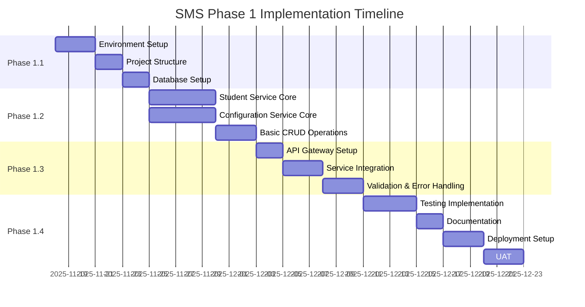

# Implementation Guide

## Table of Contents
1. [Development Roadmap](#development-roadmap)
2. [Environment Setup](#environment-setup)
3. [Phase-by-Phase Implementation](#phase-by-phase-implementation)
4. [Code Examples and Templates](#code-examples-and-templates)
5. [Best Practices](#best-practices)
6. [Troubleshooting](#troubleshooting)

## Development Roadmap

### Project Timeline (8 Weeks)



### Phase Overview

| Phase | Duration | Deliverables |
|-------|----------|--------------|
| **1.1 Foundation** | Week 1-2 | Dev environment, project structure, database schemas |
| **1.2 Core Features** | Week 3-4 | Student & Configuration services with CRUD operations |
| **1.3 Integration** | Week 5-6 | API Gateway, service discovery, error handling |
| **1.4 Deployment** | Week 7-8 | Testing, documentation, production deployment |

## Environment Setup

### Prerequisites

**Required Software**:
- Java 21 LTS (OpenJDK or Oracle JDK)
- Maven 3.9.x
- Docker 24.x+
- Docker Compose 2.x
- Git
- IDE (IntelliJ IDEA or VS Code)
- PostgreSQL Client (pgAdmin or DBeaver)
- Postman or curl for API testing

### Step 1: Install Java 21

**Windows**:
```bash
# Download from https://adoptium.net/
# Or use Chocolatey
choco install temurin21
```

**Linux/Mac**:
```bash
# Using SDKMAN
sdk install java 21-tem

# Verify installation
java -version
```

### Step 2: Install Docker

**Windows/Mac**: Download Docker Desktop from https://www.docker.com/products/docker-desktop

**Linux**:
```bash
# Ubuntu/Debian
curl -fsSL https://get.docker.com -o get-docker.sh
sudo sh get-docker.sh
sudo usermod -aG docker $USER
```

### Step 3: Clone Repository Structure

```bash
# Create project directory
mkdir school-management-system
cd school-management-system

# Initialize git
git init

# Create service directories
mkdir -p eureka-server api-gateway student-service configuration-service
mkdir -p monitoring/prometheus monitoring/grafana
mkdir -p scripts init-scripts
```

### Step 4: IDE Setup

**IntelliJ IDEA**:
1. Install plugins: Spring Boot, Lombok, MapStruct Support, Docker
2. Enable annotation processing: Settings → Build → Compiler → Annotation Processors
3. Configure Maven: Settings → Build Tools → Maven

**VS Code**:
```bash
# Install extensions
code --install-extension vscjava.vscode-java-pack
code --install-extension vscjava.vscode-spring-boot-dashboard
code --install-extension GabrielBB.vscode-lombok
```

## Phase-by-Phase Implementation

### Phase 1.1: Foundation (Weeks 1-2)

#### Task 1.1.1: Create Eureka Server

**pom.xml**:
```xml
<?xml version="1.0" encoding="UTF-8"?>
<project xmlns="http://maven.apache.org/POM/4.0.0"
         xmlns:xsi="http://www.w3.org/2001/XMLSchema-instance"
         xsi:schemaLocation="http://maven.apache.org/POM/4.0.0
         http://maven.apache.org/xsd/maven-4.0.0.xsd">
    <modelVersion>4.0.0</modelVersion>

    <parent>
        <groupId>org.springframework.boot</groupId>
        <artifactId>spring-boot-starter-parent</artifactId>
        <version>3.2.0</version>
    </parent>

    <groupId>com.school.sms</groupId>
    <artifactId>eureka-server</artifactId>
    <version>1.0.0-SNAPSHOT</version>

    <properties>
        <java.version>21</java.version>
        <spring-cloud.version>2023.0.0</spring-cloud.version>
    </properties>

    <dependencies>
        <dependency>
            <groupId>org.springframework.cloud</groupId>
            <artifactId>spring-cloud-starter-netflix-eureka-server</artifactId>
        </dependency>
    </dependencies>

    <dependencyManagement>
        <dependencies>
            <dependency>
                <groupId>org.springframework.cloud</groupId>
                <artifactId>spring-cloud-dependencies</artifactId>
                <version>${spring-cloud.version}</version>
                <type>pom</type>
                <scope>import</scope>
            </dependency>
        </dependencies>
    </dependencyManagement>

    <build>
        <plugins>
            <plugin>
                <groupId>org.springframework.boot</groupId>
                <artifactId>spring-boot-maven-plugin</artifactId>
            </plugin>
        </plugins>
    </build>
</project>
```

**EurekaServerApplication.java**:
```java
package com.school.sms.eureka;

import org.springframework.boot.SpringApplication;
import org.springframework.boot.autoconfigure.SpringBootApplication;
import org.springframework.cloud.netflix.eureka.server.EnableEurekaServer;

@SpringBootApplication
@EnableEurekaServer
public class EurekaServerApplication {
    public static void main(String[] args) {
        SpringApplication.run(EurekaServerApplication.class, args);
    }
}
```

**application.yml**:
```yaml
server:
  port: 8761

spring:
  application:
    name: eureka-server

eureka:
  client:
    register-with-eureka: false
    fetch-registry: false
  server:
    enable-self-preservation: false
```

#### Task 1.1.2: Setup Student Service Project Structure

```
student-service/
├── src/
│   ├── main/
│   │   ├── java/
│   │   │   └── com/school/sms/student/
│   │   │       ├── StudentServiceApplication.java
│   │   │       ├── presentation/
│   │   │       │   ├── controller/
│   │   │       │   ├── dto/
│   │   │       │   └── exception/
│   │   │       ├── application/
│   │   │       │   ├── service/
│   │   │       │   ├── mapper/
│   │   │       │   └── port/
│   │   │       ├── domain/
│   │   │       │   ├── entity/
│   │   │       │   ├── valueobject/
│   │   │       │   ├── exception/
│   │   │       │   └── repository/
│   │   │       └── infrastructure/
│   │   │           ├── persistence/
│   │   │           ├── config/
│   │   │           └── util/
│   │   └── resources/
│   │       ├── application.yml
│   │       ├── application-docker.yml
│   │       └── db/migration/
│   │           └── V1__create_students_table.sql
│   └── test/
│       └── java/
│           └── com/school/sms/student/
├── pom.xml
└── Dockerfile
```

**Student Service pom.xml** (key dependencies):
```xml
<dependencies>
    <!-- Spring Boot Starters -->
    <dependency>
        <groupId>org.springframework.boot</groupId>
        <artifactId>spring-boot-starter-web</artifactId>
    </dependency>
    <dependency>
        <groupId>org.springframework.boot</groupId>
        <artifactId>spring-boot-starter-data-jpa</artifactId>
    </dependency>
    <dependency>
        <groupId>org.springframework.boot</groupId>
        <artifactId>spring-boot-starter-validation</artifactId>
    </dependency>
    <dependency>
        <groupId>org.springframework.boot</groupId>
        <artifactId>spring-boot-starter-actuator</artifactId>
    </dependency>

    <!-- Database -->
    <dependency>
        <groupId>org.postgresql</groupId>
        <artifactId>postgresql</artifactId>
        <scope>runtime</scope>
    </dependency>
    <dependency>
        <groupId>org.flywaydb</groupId>
        <artifactId>flyway-core</artifactId>
    </dependency>

    <!-- Service Discovery -->
    <dependency>
        <groupId>org.springframework.cloud</groupId>
        <artifactId>spring-cloud-starter-netflix-eureka-client</artifactId>
    </dependency>

    <!-- MapStruct -->
    <dependency>
        <groupId>org.mapstruct</groupId>
        <artifactId>mapstruct</artifactId>
        <version>1.5.5.Final</version>
    </dependency>
    <dependency>
        <groupId>org.mapstruct</groupId>
        <artifactId>mapstruct-processor</artifactId>
        <version>1.5.5.Final</version>
        <scope>provided</scope>
    </dependency>

    <!-- Lombok -->
    <dependency>
        <groupId>org.projectlombok</groupId>
        <artifactId>lombok</artifactId>
        <optional>true</optional>
    </dependency>

    <!-- Monitoring -->
    <dependency>
        <groupId>io.micrometer</groupId>
        <artifactId>micrometer-registry-prometheus</artifactId>
    </dependency>

    <!-- OpenAPI -->
    <dependency>
        <groupId>org.springdoc</groupId>
        <artifactId>springdoc-openapi-starter-webmvc-ui</artifactId>
        <version>2.2.0</version>
    </dependency>

    <!-- Testing -->
    <dependency>
        <groupId>org.springframework.boot</groupId>
        <artifactId>spring-boot-starter-test</artifactId>
        <scope>test</scope>
    </dependency>
    <dependency>
        <groupId>org.testcontainers</groupId>
        <artifactId>postgresql</artifactId>
        <scope>test</scope>
    </dependency>
</dependencies>
```

#### Task 1.1.3: Database Setup

**Create Migration File**: `src/main/resources/db/migration/V1__create_students_table.sql`

(Use the DDL from Database Architecture document)

**Test Migration Locally**:
```bash
# Start PostgreSQL
docker run -d --name student-db \
  -e POSTGRES_DB=student_db \
  -e POSTGRES_USER=postgres \
  -e POSTGRES_PASSWORD=admin \
  -p 5432:5432 \
  postgres:15-alpine

# Run application (migrations execute automatically)
mvn spring-boot:run
```

### Phase 1.2: Core Features (Weeks 3-4)

#### Task 1.2.1: Implement Domain Entities

**Student.java**:
```java
package com.school.sms.student.domain.entity;

import com.school.sms.student.domain.valueobject.*;
import jakarta.persistence.*;
import lombok.*;
import java.time.LocalDate;
import java.time.LocalDateTime;

@Entity
@Table(name = "students")
@Getter
@Setter
@NoArgsConstructor
@AllArgsConstructor
@Builder
public class Student {

    @Id
    @Column(name = "student_id", length = 50)
    private String studentId;

    @Column(name = "first_name", length = 50, nullable = false)
    private String firstName;

    @Column(name = "last_name", length = 50, nullable = false)
    private String lastName;

    @Embedded
    private Address address;

    @Column(name = "date_of_birth", nullable = false)
    private LocalDate dateOfBirth;

    @Column(name = "mobile", length = 10, nullable = false, unique = true)
    private String mobile;

    @Column(name = "email", length = 100)
    private String email;

    @Column(name = "father_name_guardian", length = 100, nullable = false)
    private String fatherNameOrGuardian;

    @Column(name = "mother_name", length = 100)
    private String motherName;

    @Column(name = "caste", length = 50)
    private String caste;

    @Column(name = "moles", columnDefinition = "TEXT")
    private String moles;

    @Column(name = "aadhaar_number", length = 12)
    private String aadhaarNumber;

    @Enumerated(EnumType.STRING)
    @Column(name = "status", length = 20, nullable = false)
    @Builder.Default
    private StudentStatus status = StudentStatus.ACTIVE;

    @Column(name = "created_at", nullable = false, updatable = false)
    private LocalDateTime createdAt;

    @Column(name = "updated_at", nullable = false)
    private LocalDateTime updatedAt;

    @Column(name = "created_by", length = 50, nullable = false)
    private String createdBy;

    @Column(name = "updated_by", length = 50, nullable = false)
    private String updatedBy;

    @Version
    @Column(name = "version")
    private Long version;

    @PrePersist
    protected void onCreate() {
        createdAt = LocalDateTime.now();
        updatedAt = LocalDateTime.now();
    }

    @PreUpdate
    protected void onUpdate() {
        updatedAt = LocalDateTime.now();
    }

    public int calculateAge() {
        return java.time.Period.between(dateOfBirth, LocalDate.now()).getYears();
    }

    public boolean isActive() {
        return status == StudentStatus.ACTIVE;
    }

    public void activate() {
        this.status = StudentStatus.ACTIVE;
    }

    public void deactivate() {
        this.status = StudentStatus.INACTIVE;
    }
}
```

**Address.java** (Value Object):
```java
package com.school.sms.student.domain.valueobject;

import jakarta.persistence.Column;
import jakarta.persistence.Embeddable;
import lombok.*;

@Embeddable
@Getter
@Setter
@NoArgsConstructor
@AllArgsConstructor
@Builder
public class Address {

    @Column(name = "street", length = 200, nullable = false)
    private String street;

    @Column(name = "city", length = 100, nullable = false)
    private String city;

    @Column(name = "state", length = 100, nullable = false)
    private String state;

    @Column(name = "pin_code", length = 6, nullable = false)
    private String pinCode;

    @Column(name = "country", length = 50, nullable = false)
    @Builder.Default
    private String country = "India";

    public String getFullAddress() {
        return String.format("%s, %s, %s - %s, %s",
            street, city, state, pinCode, country);
    }
}
```

**StudentStatus.java**:
```java
package com.school.sms.student.domain.valueobject;

public enum StudentStatus {
    ACTIVE,
    INACTIVE
}
```

#### Task 1.2.2: Implement Repository

**StudentRepository.java**:
```java
package com.school.sms.student.domain.repository;

import com.school.sms.student.domain.entity.Student;
import java.util.Optional;
import java.util.List;

public interface StudentRepository {
    Student save(Student student);
    Optional<Student> findById(String studentId);
    List<Student> findAll();
    void deleteById(String studentId);
    boolean existsByMobile(String mobile);
    boolean existsByMobileAndStudentIdNot(String mobile, String studentId);
}
```

**JpaStudentRepository.java** (Infrastructure):
```java
package com.school.sms.student.infrastructure.persistence.repository;

import com.school.sms.student.domain.entity.Student;
import org.springframework.data.jpa.repository.JpaRepository;
import org.springframework.stereotype.Repository;

@Repository
public interface JpaStudentRepository extends JpaRepository<Student, String> {
    boolean existsByMobile(String mobile);
    boolean existsByMobileAndStudentIdNot(String mobile, String studentId);
}
```

**StudentRepositoryAdapter.java**:
```java
package com.school.sms.student.infrastructure.persistence.adapter;

import com.school.sms.student.domain.entity.Student;
import com.school.sms.student.domain.repository.StudentRepository;
import com.school.sms.student.infrastructure.persistence.repository.JpaStudentRepository;
import lombok.RequiredArgsConstructor;
import org.springframework.stereotype.Component;
import java.util.List;
import java.util.Optional;

@Component
@RequiredArgsConstructor
public class StudentRepositoryAdapter implements StudentRepository {

    private final JpaStudentRepository jpaRepository;

    @Override
    public Student save(Student student) {
        return jpaRepository.save(student);
    }

    @Override
    public Optional<Student> findById(String studentId) {
        return jpaRepository.findById(studentId);
    }

    @Override
    public List<Student> findAll() {
        return jpaRepository.findAll();
    }

    @Override
    public void deleteById(String studentId) {
        jpaRepository.deleteById(studentId);
    }

    @Override
    public boolean existsByMobile(String mobile) {
        return jpaRepository.existsByMobile(mobile);
    }

    @Override
    public boolean existsByMobileAndStudentIdNot(String mobile, String studentId) {
        return jpaRepository.existsByMobileAndStudentIdNot(mobile, studentId);
    }
}
```

#### Task 1.2.3: Implement Service Layer

**StudentRegistrationService.java**:
```java
package com.school.sms.student.application.service;

import com.school.sms.student.application.dto.StudentDTO;
import com.school.sms.student.application.mapper.StudentMapper;
import com.school.sms.student.domain.entity.Student;
import com.school.sms.student.domain.exception.*;
import com.school.sms.student.domain.repository.StudentRepository;
import com.school.sms.student.infrastructure.util.StudentIdGenerator;
import com.school.sms.student.presentation.dto.CreateStudentRequest;
import lombok.RequiredArgsConstructor;
import lombok.extern.slf4j.Slf4j;
import org.springframework.stereotype.Service;
import org.springframework.transaction.annotation.Transactional;
import java.time.LocalDate;
import java.time.Period;

@Service
@Transactional
@RequiredArgsConstructor
@Slf4j
public class StudentRegistrationService {

    private final StudentRepository studentRepository;
    private final StudentMapper studentMapper;
    private final StudentIdGenerator idGenerator;

    private static final int MIN_AGE = 3;
    private static final int MAX_AGE = 18;

    public StudentDTO registerStudent(CreateStudentRequest request, String userId) {
        log.info("Registering new student: {} {}", request.getFirstName(), request.getLastName());

        // Validate age
        validateAge(request.getDateOfBirth());

        // Check mobile uniqueness
        if (studentRepository.existsByMobile(request.getMobile())) {
            throw new DuplicateMobileException(
                "Mobile number already registered: " + request.getMobile());
        }

        // Generate student ID
        String studentId = idGenerator.generate();

        // Create entity
        Student student = studentMapper.toEntity(request);
        student.setStudentId(studentId);
        student.setCreatedBy(userId);
        student.setUpdatedBy(userId);

        // Save
        Student saved = studentRepository.save(student);

        log.info("Student registered successfully: {}", saved.getStudentId());
        return studentMapper.toDTO(saved);
    }

    private void validateAge(LocalDate dateOfBirth) {
        int age = Period.between(dateOfBirth, LocalDate.now()).getYears();
        if (age < MIN_AGE || age > MAX_AGE) {
            throw new InvalidAgeException(
                String.format("Student age must be between %d and %d years. Provided age: %d",
                    MIN_AGE, MAX_AGE, age));
        }
    }
}
```

#### Task 1.2.4: Implement Controller

**StudentController.java**:
```java
package com.school.sms.student.presentation.controller;

import com.school.sms.student.application.dto.StudentDTO;
import com.school.sms.student.application.service.*;
import com.school.sms.student.presentation.dto.*;
import jakarta.validation.Valid;
import lombok.RequiredArgsConstructor;
import org.springframework.http.*;
import org.springframework.web.bind.annotation.*;

@RestController
@RequestMapping("/students")
@RequiredArgsConstructor
public class StudentController {

    private final StudentRegistrationService registrationService;

    @PostMapping
    public ResponseEntity<StudentDTO> createStudent(
            @Valid @RequestBody CreateStudentRequest request,
            @RequestHeader(value = "X-User-ID", defaultValue = "SYSTEM") String userId) {

        StudentDTO student = registrationService.registerStudent(request, userId);
        return ResponseEntity.status(HttpStatus.CREATED).body(student);
    }

    @GetMapping("/{studentId}")
    public ResponseEntity<StudentDTO> getStudent(@PathVariable String studentId) {
        // Implementation
        return ResponseEntity.ok().build();
    }

    // Additional endpoints...
}
```

### Phase 1.3: Integration (Weeks 5-6)

**Follow similar patterns for**:
1. API Gateway setup with routing
2. Service discovery registration
3. Global exception handling
4. DTO validation
5. Integration testing

### Phase 1.4: Deployment (Weeks 7-8)

**Follow deployment architecture document for**:
1. Docker containerization
2. Docker Compose local setup
3. CI/CD pipeline configuration
4. Monitoring setup
5. Production deployment

## Best Practices

### 1. Clean Code Principles
- Single Responsibility Principle
- Meaningful naming conventions
- Small, focused methods
- Avoid code duplication

### 2. Error Handling
- Use domain-specific exceptions
- Implement global exception handler
- Return RFC 7807 problem details
- Log errors appropriately

### 3. Testing
- Write tests before pushing code
- Aim for 80%+ code coverage
- Use TestContainers for integration tests
- Mock external dependencies

### 4. Git Workflow
```bash
# Feature branch workflow
git checkout -b feature/student-registration
# Make changes
git add .
git commit -m "feat: implement student registration"
git push origin feature/student-registration
# Create pull request
```

### 5. Code Review Checklist
- [ ] Tests pass
- [ ] Code coverage meets threshold
- [ ] No security vulnerabilities
- [ ] Follows coding standards
- [ ] Documentation updated
- [ ] No hardcoded credentials

## Troubleshooting

### Common Issues

**Issue 1: Flyway Migration Fails**
```
Error: Validate failed: Migration checksum mismatch
```
**Solution**:
```bash
# Repair checksum
mvn flyway:repair

# Or clean and re-run
mvn flyway:clean flyway:migrate
```

**Issue 2: Port Already in Use**
```
Port 8081 is already in use
```
**Solution**:
```bash
# Find process
lsof -i :8081  # Mac/Linux
netstat -ano | findstr :8081  # Windows

# Kill process or change port in application.yml
```

**Issue 3: Lombok Not Working**
**Solution**:
- Enable annotation processing in IDE
- Rebuild project
- Install Lombok plugin

## Summary

This implementation guide provides:
1. **Phased Approach**: 8-week structured timeline
2. **Environment Setup**: Complete development environment configuration
3. **Code Templates**: Working examples for all layers
4. **Best Practices**: Industry-standard development practices
5. **Troubleshooting**: Common issues and solutions

The next document ([Testing Strategy](09-TESTING-STRATEGY.md)) provides comprehensive testing approach with examples.

---

**Version**: 1.0
**Last Updated**: 2025-11-17
**Status**: Draft for Review
