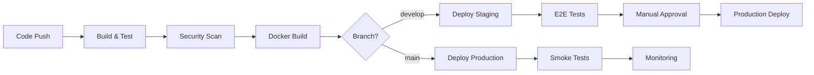

# DevOps & Deployment Guide - School Management System

**Version**: 1.0
**Date**: November 10, 2025
**Status**: Approved
**Author**: DevOps Team

---

## Table of Contents
1. [Overview](#overview)
2. [Local Development Setup](#local-development-setup)
3. [Containerization](#containerization)
4. [CI/CD Pipeline](#cicd-pipeline)
5. [Environment Configuration](#environment-configuration)
6. [Deployment Strategy](#deployment-strategy)
7. [Monitoring & Observability](#monitoring--observability)
8. [Logging](#logging)
9. [Backup & Disaster Recovery](#backup--disaster-recovery)
10. [Security & Compliance](#security--compliance)

---

## 1. Overview

### 1.1 DevOps Goals

- **Automation**: Automate build, test, and deployment processes
- **Reliability**: Ensure 99.5% uptime
- **Fast Feedback**: Quick detection and resolution of issues
- **Scalability**: Easy horizontal scaling
- **Security**: Secure deployment pipeline
- **Observability**: Comprehensive monitoring and logging

### 1.2 Technology Stack

| Component | Technology | Purpose |
|-----------|------------|---------|
| **Containerization** | Docker | Application packaging |
| **Orchestration** | Docker Compose (Dev), Kubernetes (Prod) | Container management |
| **CI/CD** | GitHub Actions | Automated pipeline |
| **Monitoring** | Prometheus + Grafana | Metrics and visualization |
| **Logging** | ELK Stack | Centralized logging |
| **Tracing** | Spring Boot Actuator | Application health |
| **Secrets Management** | AWS Secrets Manager / HashiCorp Vault | Secure credentials |
| **Reverse Proxy** | Nginx | Load balancing, SSL termination |
| **Database Backup** | pg_basebackup, WAL archiving | Point-in-time recovery |

### 1.3 Environments

| Environment | Purpose | Infrastructure |
|-------------|---------|----------------|
| **Development** | Local development | Docker Compose |
| **Testing** | Automated tests | CI/CD runners |
| **Staging** | Pre-production testing | Cloud (AWS/Azure) |
| **Production** | Live system | Cloud (AWS/Azure), High availability |

---

## 2. Local Development Setup

### 2.1 Prerequisites

```bash
# Required software
- Java 21 (OpenJDK)
- Node.js 20+
- Docker Desktop
- Maven 3.9+
- Git
- IDE (IntelliJ IDEA / VS Code)
```

### 2.2 Initial Setup

```bash
# 1. Clone repository
git clone https://github.com/school/school-management-system.git
cd school-management-system

# 2. Start infrastructure (PostgreSQL, Redis)
docker-compose up -d postgres redis

# 3. Backend setup
cd backend
mvn clean install
mvn spring-boot:run

# 4. Frontend setup (in new terminal)
cd frontend
npm install
npm run dev

# 5. Access application
# Backend API: http://localhost:8080
# Frontend: http://localhost:3000
# API Docs: http://localhost:8080/swagger-ui.html
```

### 2.3 Docker Compose for Local Development

```yaml
# docker-compose.yml
version: '3.8'

services:
  postgres:
    image: postgres:18
    container_name: school-sms-postgres
    environment:
      POSTGRES_DB: school_sms_db
      POSTGRES_USER: school_user
      POSTGRES_PASSWORD: school_pass
    ports:
      - "5432:5432"
    volumes:
      - postgres_data:/var/lib/postgresql/data
      - ./scripts/init-db.sql:/docker-entrypoint-initdb.d/init.sql
    healthcheck:
      test: ["CMD-SHELL", "pg_isready -U school_user"]
      interval: 10s
      timeout: 5s
      retries: 5

  redis:
    image: redis:7-alpine
    container_name: school-sms-redis
    ports:
      - "6379:6379"
    volumes:
      - redis_data:/data
    command: redis-server --appendonly yes
    healthcheck:
      test: ["CMD", "redis-cli", "ping"]
      interval: 10s
      timeout: 5s
      retries: 5

  backend:
    build:
      context: ./backend
      dockerfile: Dockerfile.dev
    container_name: school-sms-backend
    environment:
      SPRING_PROFILES_ACTIVE: dev
      SPRING_DATASOURCE_URL: jdbc:postgresql://postgres:5432/school_sms_db
      SPRING_DATASOURCE_USERNAME: school_user
      SPRING_DATASOURCE_PASSWORD: school_pass
      SPRING_REDIS_HOST: redis
      SPRING_REDIS_PORT: 6379
    ports:
      - "8080:8080"
      - "5005:5005"  # Debug port
    volumes:
      - ./backend:/app
      - maven_cache:/root/.m2
    depends_on:
      postgres:
        condition: service_healthy
      redis:
        condition: service_healthy
    command: mvn spring-boot:run -Dspring-boot.run.jvmArguments="-agentlib:jdwp=transport=dt_socket,server=y,suspend=n,address=*:5005"

  frontend:
    build:
      context: ./frontend
      dockerfile: Dockerfile.dev
    container_name: school-sms-frontend
    environment:
      VITE_API_BASE_URL: http://localhost:8080/api/v1
    ports:
      - "3000:3000"
    volumes:
      - ./frontend:/app
      - /app/node_modules
    depends_on:
      - backend
    command: npm run dev -- --host

volumes:
  postgres_data:
  redis_data:
  maven_cache:

networks:
  default:
    name: school-sms-network
```

### 2.4 Environment Variables

```bash
# backend/.env.dev
SPRING_PROFILES_ACTIVE=dev
DATABASE_URL=jdbc:postgresql://localhost:5432/school_sms_db
DATABASE_USERNAME=school_user
DATABASE_PASSWORD=school_pass
REDIS_HOST=localhost
REDIS_PORT=6379
JWT_SECRET=your-secret-key-change-in-production
ENCRYPTION_KEY=your-encryption-key-base64
LOG_LEVEL=DEBUG
```

```bash
# frontend/.env.local
VITE_API_BASE_URL=http://localhost:8080/api/v1
VITE_ENV=development
```

---

## 3. Containerization

### 3.1 Backend Dockerfile

```dockerfile
# backend/Dockerfile (Production)
FROM maven:3.9-eclipse-temurin-21-alpine AS build

WORKDIR /app

# Copy pom.xml and download dependencies (cached layer)
COPY pom.xml .
RUN mvn dependency:go-offline -B

# Copy source code and build
COPY src ./src
RUN mvn clean package -DskipTests -B

# Production stage
FROM eclipse-temurin:21-jre-alpine

WORKDIR /app

# Create non-root user
RUN addgroup -g 1001 appuser && \
    adduser -D -u 1001 -G appuser appuser

# Copy JAR from build stage
COPY --from=build /app/target/*.jar app.jar

# Change ownership
RUN chown -R appuser:appuser /app

USER appuser

EXPOSE 8080

HEALTHCHECK --interval=30s --timeout=3s --start-period=40s --retries=3 \
  CMD wget --no-verbose --tries=1 --spider http://localhost:8080/actuator/health || exit 1

ENTRYPOINT ["java", \
  "-XX:+UseContainerSupport", \
  "-XX:MaxRAMPercentage=75.0", \
  "-Djava.security.egd=file:/dev/./urandom", \
  "-jar", "app.jar"]
```

### 3.2 Frontend Dockerfile

```dockerfile
# frontend/Dockerfile (Production)
FROM node:20-alpine AS build

WORKDIR /app

# Copy package files and install dependencies
COPY package*.json ./
RUN npm ci --only=production

# Copy source and build
COPY . .
RUN npm run build

# Production stage with Nginx
FROM nginx:alpine

# Copy built files
COPY --from=build /app/dist /usr/share/nginx/html

# Copy custom Nginx configuration
COPY nginx.conf /etc/nginx/conf.d/default.conf

# Create non-root user
RUN addgroup -g 1001 appuser && \
    adduser -D -u 1001 -G appuser appuser && \
    chown -R appuser:appuser /usr/share/nginx/html && \
    chown -R appuser:appuser /var/cache/nginx && \
    chown -R appuser:appuser /var/log/nginx && \
    touch /var/run/nginx.pid && \
    chown -R appuser:appuser /var/run/nginx.pid

USER appuser

EXPOSE 80

HEALTHCHECK --interval=30s --timeout=3s --start-period=10s --retries=3 \
  CMD wget --no-verbose --tries=1 --spider http://localhost || exit 1

CMD ["nginx", "-g", "daemon off;"]
```

### 3.3 Nginx Configuration

```nginx
# frontend/nginx.conf
server {
    listen 80;
    server_name _;

    root /usr/share/nginx/html;
    index index.html;

    # Gzip compression
    gzip on;
    gzip_vary on;
    gzip_types text/plain text/css application/json application/javascript text/xml application/xml application/xml+rss text/javascript;

    # Security headers
    add_header X-Frame-Options "DENY" always;
    add_header X-Content-Type-Options "nosniff" always;
    add_header X-XSS-Protection "1; mode=block" always;
    add_header Referrer-Policy "strict-origin-when-cross-origin" always;

    # SPA fallback
    location / {
        try_files $uri $uri/ /index.html;
    }

    # Cache static assets
    location ~* \.(js|css|png|jpg|jpeg|gif|ico|svg|woff|woff2|ttf|eot)$ {
        expires 1y;
        add_header Cache-Control "public, immutable";
    }

    # API proxy (for development)
    location /api {
        proxy_pass http://backend:8080;
        proxy_http_version 1.1;
        proxy_set_header Upgrade $http_upgrade;
        proxy_set_header Connection 'upgrade';
        proxy_set_header Host $host;
        proxy_cache_bypass $http_upgrade;
    }
}
```

### 3.4 Build and Run

```bash
# Build images
docker build -t school-sms-backend:latest ./backend
docker build -t school-sms-frontend:latest ./frontend

# Run containers
docker run -d --name backend \
  -p 8080:8080 \
  -e SPRING_PROFILES_ACTIVE=prod \
  school-sms-backend:latest

docker run -d --name frontend \
  -p 80:80 \
  school-sms-frontend:latest

# Check logs
docker logs -f backend
docker logs -f frontend
```

---

## 4. CI/CD Pipeline

### 4.1 GitHub Actions Workflow

```yaml
# .github/workflows/ci-cd.yml
name: CI/CD Pipeline

on:
  push:
    branches: [main, develop]
  pull_request:
    branches: [main]

env:
  REGISTRY: ghcr.io
  IMAGE_PREFIX: school/school-sms

jobs:
  backend-build:
    name: Backend Build & Test
    runs-on: ubuntu-latest

    steps:
      - name: Checkout code
        uses: actions/checkout@v4

      - name: Set up JDK 21
        uses: actions/setup-java@v4
        with:
          java-version: '21'
          distribution: 'temurin'
          cache: 'maven'

      - name: Cache Maven packages
        uses: actions/cache@v3
        with:
          path: ~/.m2
          key: ${{ runner.os }}-m2-${{ hashFiles('**/pom.xml') }}
          restore-keys: ${{ runner.os }}-m2

      - name: Build with Maven
        working-directory: ./backend
        run: mvn clean package -DskipTests

      - name: Run unit tests
        working-directory: ./backend
        run: mvn test

      - name: Run integration tests
        working-directory: ./backend
        run: mvn verify -P integration-tests

      - name: Generate test coverage report
        working-directory: ./backend
        run: mvn jacoco:report

      - name: Upload coverage to Codecov
        uses: codecov/codecov-action@v3
        with:
          files: ./backend/target/site/jacoco/jacoco.xml
          flags: backend

      - name: SonarQube Scan
        working-directory: ./backend
        env:
          SONAR_TOKEN: ${{ secrets.SONAR_TOKEN }}
        run: |
          mvn sonar:sonar \
            -Dsonar.projectKey=school-sms-backend \
            -Dsonar.host.url=${{ secrets.SONAR_HOST_URL }} \
            -Dsonar.login=${{ secrets.SONAR_TOKEN }}

      - name: Build Docker image
        if: github.event_name == 'push' && github.ref == 'refs/heads/main'
        run: |
          docker build -t ${{ env.REGISTRY }}/${{ env.IMAGE_PREFIX }}-backend:${{ github.sha }} ./backend
          docker tag ${{ env.REGISTRY }}/${{ env.IMAGE_PREFIX }}-backend:${{ github.sha }} \
                     ${{ env.REGISTRY }}/${{ env.IMAGE_PREFIX }}-backend:latest

      - name: Log in to Container Registry
        if: github.event_name == 'push' && github.ref == 'refs/heads/main'
        uses: docker/login-action@v3
        with:
          registry: ${{ env.REGISTRY }}
          username: ${{ github.actor }}
          password: ${{ secrets.GITHUB_TOKEN }}

      - name: Push Docker image
        if: github.event_name == 'push' && github.ref == 'refs/heads/main'
        run: |
          docker push ${{ env.REGISTRY }}/${{ env.IMAGE_PREFIX }}-backend:${{ github.sha }}
          docker push ${{ env.REGISTRY }}/${{ env.IMAGE_PREFIX }}-backend:latest

  frontend-build:
    name: Frontend Build & Test
    runs-on: ubuntu-latest

    steps:
      - name: Checkout code
        uses: actions/checkout@v4

      - name: Set up Node.js
        uses: actions/setup-node@v4
        with:
          node-version: '20'
          cache: 'npm'
          cache-dependency-path: './frontend/package-lock.json'

      - name: Install dependencies
        working-directory: ./frontend
        run: npm ci

      - name: Lint code
        working-directory: ./frontend
        run: npm run lint

      - name: Run unit tests
        working-directory: ./frontend
        run: npm test -- --coverage

      - name: Upload coverage to Codecov
        uses: codecov/codecov-action@v3
        with:
          files: ./frontend/coverage/coverage-final.json
          flags: frontend

      - name: Build application
        working-directory: ./frontend
        run: npm run build

      - name: Build Docker image
        if: github.event_name == 'push' && github.ref == 'refs/heads/main'
        run: |
          docker build -t ${{ env.REGISTRY }}/${{ env.IMAGE_PREFIX }}-frontend:${{ github.sha }} ./frontend
          docker tag ${{ env.REGISTRY }}/${{ env.IMAGE_PREFIX }}-frontend:${{ github.sha }} \
                     ${{ env.REGISTRY }}/${{ env.IMAGE_PREFIX }}-frontend:latest

      - name: Log in to Container Registry
        if: github.event_name == 'push' && github.ref == 'refs/heads/main'
        uses: docker/login-action@v3
        with:
          registry: ${{ env.REGISTRY }}
          username: ${{ github.actor }}
          password: ${{ secrets.GITHUB_TOKEN }}

      - name: Push Docker image
        if: github.event_name == 'push' && github.ref == 'refs/heads/main'
        run: |
          docker push ${{ env.REGISTRY }}/${{ env.IMAGE_PREFIX }}-frontend:${{ github.sha }}
          docker push ${{ env.REGISTRY }}/${{ env.IMAGE_PREFIX }}-frontend:latest

  security-scan:
    name: Security Scanning
    runs-on: ubuntu-latest

    steps:
      - name: Checkout code
        uses: actions/checkout@v4

      - name: Run OWASP Dependency Check
        uses: dependency-check/Dependency-Check_Action@main
        with:
          project: 'school-sms'
          path: '.'
          format: 'HTML'
          out: 'reports'

      - name: Upload Dependency Check Report
        uses: actions/upload-artifact@v3
        with:
          name: dependency-check-report
          path: reports

      - name: Run Snyk Security Scan
        uses: snyk/actions/maven@master
        env:
          SNYK_TOKEN: ${{ secrets.SNYK_TOKEN }}
        with:
          args: --severity-threshold=high

      - name: Run Trivy vulnerability scanner
        uses: aquasecurity/trivy-action@master
        with:
          scan-type: 'fs'
          scan-ref: '.'
          format: 'sarif'
          output: 'trivy-results.sarif'

      - name: Upload Trivy results to GitHub Security
        uses: github/codeql-action/upload-sarif@v2
        with:
          sarif_file: 'trivy-results.sarif'

  e2e-tests:
    name: E2E Tests
    runs-on: ubuntu-latest
    needs: [backend-build, frontend-build]

    steps:
      - name: Checkout code
        uses: actions/checkout@v4

      - name: Set up Node.js
        uses: actions/setup-node@v4
        with:
          node-version: '20'

      - name: Install Playwright
        working-directory: ./frontend
        run: |
          npm ci
          npx playwright install --with-deps

      - name: Start services
        run: docker-compose -f docker-compose.test.yml up -d

      - name: Wait for services to be ready
        run: |
          ./scripts/wait-for-it.sh localhost:8080 -- echo "Backend is up"
          ./scripts/wait-for-it.sh localhost:3000 -- echo "Frontend is up"

      - name: Run Playwright tests
        working-directory: ./frontend
        run: npm run test:e2e

      - name: Upload Playwright report
        if: always()
        uses: actions/upload-artifact@v3
        with:
          name: playwright-report
          path: frontend/playwright-report

  deploy-staging:
    name: Deploy to Staging
    runs-on: ubuntu-latest
    needs: [backend-build, frontend-build, e2e-tests]
    if: github.event_name == 'push' && github.ref == 'refs/heads/develop'
    environment:
      name: staging
      url: https://staging.school.com

    steps:
      - name: Deploy to Staging
        run: |
          echo "Deploying to staging environment"
          # Add deployment commands (e.g., kubectl apply, AWS ECS deploy)

  deploy-production:
    name: Deploy to Production
    runs-on: ubuntu-latest
    needs: [backend-build, frontend-build, e2e-tests]
    if: github.event_name == 'push' && github.ref == 'refs/heads/main'
    environment:
      name: production
      url: https://app.school.com

    steps:
      - name: Deploy to Production
        run: |
          echo "Deploying to production environment"
          # Add deployment commands
```

### 4.2 Pipeline Stages



---

## 5. Environment Configuration

### 5.1 Configuration Management

```yaml
# backend/src/main/resources/application.yml
spring:
  application:
    name: school-management-system
  profiles:
    active: ${SPRING_PROFILES_ACTIVE:dev}

---
# Development profile
spring:
  config:
    activate:
      on-profile: dev
  datasource:
    url: ${DATABASE_URL:jdbc:postgresql://localhost:5432/school_sms_db}
    username: ${DATABASE_USERNAME:school_user}
    password: ${DATABASE_PASSWORD:school_pass}
  jpa:
    hibernate:
      ddl-auto: validate
    show-sql: true
  redis:
    host: ${REDIS_HOST:localhost}
    port: ${REDIS_PORT:6379}

logging:
  level:
    com.school.sms: DEBUG

---
# Staging profile
spring:
  config:
    activate:
      on-profile: staging
  datasource:
    url: ${DATABASE_URL}
    username: ${DATABASE_USERNAME}
    password: ${DATABASE_PASSWORD}
    hikari:
      maximum-pool-size: 20
      minimum-idle: 5
  jpa:
    hibernate:
      ddl-auto: validate
    show-sql: false
  redis:
    host: ${REDIS_HOST}
    port: ${REDIS_PORT}

logging:
  level:
    com.school.sms: INFO

---
# Production profile
spring:
  config:
    activate:
      on-profile: prod
  datasource:
    url: ${DATABASE_URL}
    username: ${DATABASE_USERNAME}
    password: ${DATABASE_PASSWORD}
    hikari:
      maximum-pool-size: 50
      minimum-idle: 10
      connection-timeout: 30000
      idle-timeout: 600000
      max-lifetime: 1800000
  jpa:
    hibernate:
      ddl-auto: validate
    show-sql: false
  redis:
    host: ${REDIS_HOST}
    port: ${REDIS_PORT}
    ssl: true

logging:
  level:
    root: WARN
    com.school.sms: INFO
```

### 5.2 Secrets Management

**AWS Secrets Manager**:

```java
@Configuration
public class SecretsManagerConfig {

    @Value("${aws.secretsmanager.secret-name}")
    private String secretName;

    @Bean
    public AWSSecretsManager secretsManager() {
        return AWSSecretsManagerClientBuilder.standard()
            .withRegion(Regions.US_EAST_1)
            .build();
    }

    @Bean
    public Map<String, String> secrets() {
        GetSecretValueRequest request = new GetSecretValueRequest()
            .withSecretId(secretName);

        GetSecretValueResult result = secretsManager().getSecretValue(request);
        String secretString = result.getSecretString();

        ObjectMapper mapper = new ObjectMapper();
        return mapper.readValue(secretString, Map.class);
    }
}
```

**Environment Variables (Kubernetes Secrets)**:

```yaml
# k8s/secrets.yaml
apiVersion: v1
kind: Secret
metadata:
  name: school-sms-secrets
type: Opaque
stringData:
  database-url: jdbc:postgresql://postgres:5432/school_sms_db
  database-username: school_user
  database-password: <base64-encoded>
  jwt-secret: <base64-encoded>
  encryption-key: <base64-encoded>
```

---

## 6. Deployment Strategy

### 6.1 Kubernetes Deployment

```yaml
# k8s/backend-deployment.yaml
apiVersion: apps/v1
kind: Deployment
metadata:
  name: school-sms-backend
  labels:
    app: school-sms-backend
spec:
  replicas: 3
  strategy:
    type: RollingUpdate
    rollingUpdate:
      maxSurge: 1
      maxUnavailable: 0
  selector:
    matchLabels:
      app: school-sms-backend
  template:
    metadata:
      labels:
        app: school-sms-backend
    spec:
      containers:
      - name: backend
        image: ghcr.io/school/school-sms-backend:latest
        imagePullPolicy: Always
        ports:
        - containerPort: 8080
          name: http
        env:
        - name: SPRING_PROFILES_ACTIVE
          value: "prod"
        - name: DATABASE_URL
          valueFrom:
            secretKeyRef:
              name: school-sms-secrets
              key: database-url
        - name: DATABASE_USERNAME
          valueFrom:
            secretKeyRef:
              name: school-sms-secrets
              key: database-username
        - name: DATABASE_PASSWORD
          valueFrom:
            secretKeyRef:
              name: school-sms-secrets
              key: database-password
        - name: JWT_SECRET
          valueFrom:
            secretKeyRef:
              name: school-sms-secrets
              key: jwt-secret
        resources:
          requests:
            memory: "512Mi"
            cpu: "500m"
          limits:
            memory: "1Gi"
            cpu: "1000m"
        livenessProbe:
          httpGet:
            path: /actuator/health/liveness
            port: 8080
          initialDelaySeconds: 60
          periodSeconds: 10
          timeoutSeconds: 5
          failureThreshold: 3
        readinessProbe:
          httpGet:
            path: /actuator/health/readiness
            port: 8080
          initialDelaySeconds: 30
          periodSeconds: 5
          timeoutSeconds: 3
          failureThreshold: 3
---
apiVersion: v1
kind: Service
metadata:
  name: school-sms-backend
spec:
  type: ClusterIP
  selector:
    app: school-sms-backend
  ports:
  - port: 8080
    targetPort: 8080
    protocol: TCP
```

### 6.2 Blue-Green Deployment

```yaml
# k8s/backend-blue-green.yaml
apiVersion: v1
kind: Service
metadata:
  name: school-sms-backend
spec:
  selector:
    app: school-sms-backend
    version: blue  # Switch to 'green' for deployment
  ports:
  - port: 8080
    targetPort: 8080

---
apiVersion: apps/v1
kind: Deployment
metadata:
  name: school-sms-backend-blue
spec:
  replicas: 3
  template:
    metadata:
      labels:
        app: school-sms-backend
        version: blue
    spec:
      # ... container spec

---
apiVersion: apps/v1
kind: Deployment
metadata:
  name: school-sms-backend-green
spec:
  replicas: 3
  template:
    metadata:
      labels:
        app: school-sms-backend
        version: green
    spec:
      # ... container spec (new version)
```

### 6.3 Horizontal Pod Autoscaler

```yaml
# k8s/hpa.yaml
apiVersion: autoscaling/v2
kind: HorizontalPodAutoscaler
metadata:
  name: school-sms-backend-hpa
spec:
  scaleTargetRef:
    apiVersion: apps/v1
    kind: Deployment
    name: school-sms-backend
  minReplicas: 3
  maxReplicas: 10
  metrics:
  - type: Resource
    resource:
      name: cpu
      target:
        type: Utilization
        averageUtilization: 70
  - type: Resource
    resource:
      name: memory
      target:
        type: Utilization
        averageUtilization: 80
```

---

## 7. Monitoring & Observability

### 7.1 Prometheus Configuration

```yaml
# prometheus/prometheus.yml
global:
  scrape_interval: 15s
  evaluation_interval: 15s

scrape_configs:
  - job_name: 'school-sms-backend'
    metrics_path: '/actuator/prometheus'
    static_configs:
      - targets: ['backend:8080']

  - job_name: 'postgres'
    static_configs:
      - targets: ['postgres-exporter:9187']

  - job_name: 'redis'
    static_configs:
      - targets: ['redis-exporter:9121']

  - job_name: 'node-exporter'
    static_configs:
      - targets: ['node-exporter:9100']
```

### 7.2 Grafana Dashboards

```json
// grafana/dashboards/school-sms-dashboard.json
{
  "dashboard": {
    "title": "School Management System - Overview",
    "panels": [
      {
        "title": "API Request Rate",
        "targets": [{
          "expr": "rate(http_server_requests_seconds_count[5m])"
        }]
      },
      {
        "title": "API Response Time (P95)",
        "targets": [{
          "expr": "histogram_quantile(0.95, rate(http_server_requests_seconds_bucket[5m]))"
        }]
      },
      {
        "title": "Error Rate",
        "targets": [{
          "expr": "rate(http_server_requests_seconds_count{status=~\"5..\"}[5m])"
        }]
      },
      {
        "title": "Database Connections",
        "targets": [{
          "expr": "hikaricp_connections_active"
        }]
      },
      {
        "title": "Redis Cache Hit Rate",
        "targets": [{
          "expr": "rate(cache_gets_total{result=\"hit\"}[5m]) / rate(cache_gets_total[5m])"
        }]
      },
      {
        "title": "JVM Memory Usage",
        "targets": [{
          "expr": "jvm_memory_used_bytes{area=\"heap\"}"
        }]
      }
    ]
  }
}
```

### 7.3 Alerting Rules

```yaml
# prometheus/alerts.yml
groups:
  - name: school_sms_alerts
    interval: 30s
    rules:
      - alert: HighErrorRate
        expr: rate(http_server_requests_seconds_count{status=~"5.."}[5m]) > 0.05
        for: 5m
        labels:
          severity: critical
        annotations:
          summary: "High error rate detected"
          description: "Error rate is {{ $value }} (threshold: 0.05)"

      - alert: HighResponseTime
        expr: histogram_quantile(0.95, rate(http_server_requests_seconds_bucket[5m])) > 0.5
        for: 5m
        labels:
          severity: warning
        annotations:
          summary: "High API response time"
          description: "P95 response time is {{ $value }}s (threshold: 0.5s)"

      - alert: DatabaseConnectionPoolExhausted
        expr: hikaricp_connections_active / hikaricp_connections_max > 0.9
        for: 5m
        labels:
          severity: warning
        annotations:
          summary: "Database connection pool near exhaustion"
          description: "{{ $value }} of connections are active"

      - alert: ServiceDown
        expr: up{job="school-sms-backend"} == 0
        for: 1m
        labels:
          severity: critical
        annotations:
          summary: "Service is down"
          description: "Backend service is unreachable"
```

### 7.4 Spring Boot Actuator Endpoints

```yaml
# application.yml
management:
  endpoints:
    web:
      exposure:
        include: health,info,metrics,prometheus
  endpoint:
    health:
      show-details: when-authorized
      probes:
        enabled: true
  metrics:
    export:
      prometheus:
        enabled: true
    tags:
      application: ${spring.application.name}
```

---

## 8. Logging

### 8.1 Structured Logging

```xml
<!-- backend/src/main/resources/logback-spring.xml -->
<configuration>
    <include resource="org/springframework/boot/logging/logback/defaults.xml"/>

    <springProperty scope="context" name="appName" source="spring.application.name"/>

    <!-- Console appender with JSON format -->
    <appender name="CONSOLE" class="ch.qos.logback.core.ConsoleAppender">
        <encoder class="net.logstash.logback.encoder.LogstashEncoder">
            <customFields>{"application":"${appName}"}</customFields>
            <includeMdcKeyName>correlation-id</includeMdcKeyName>
            <includeMdcKeyName>user-id</includeMdcKeyName>
        </encoder>
    </appender>

    <!-- File appender for production -->
    <appender name="FILE" class="ch.qos.logback.core.rolling.RollingFileAppender">
        <file>/var/log/school-sms/application.log</file>
        <rollingPolicy class="ch.qos.logback.core.rolling.TimeBasedRollingPolicy">
            <fileNamePattern>/var/log/school-sms/application.%d{yyyy-MM-dd}.log</fileNamePattern>
            <maxHistory>30</maxHistory>
            <totalSizeCap>10GB</totalSizeCap>
        </rollingPolicy>
        <encoder class="net.logstash.logback.encoder.LogstashEncoder">
            <customFields>{"application":"${appName}"}</customFields>
        </encoder>
    </appender>

    <root level="INFO">
        <appender-ref ref="CONSOLE"/>
        <appender-ref ref="FILE"/>
    </root>

    <logger name="com.school.sms" level="INFO"/>
    <logger name="org.springframework.web" level="INFO"/>
</configuration>
```

### 8.2 ELK Stack Configuration

```yaml
# elk/docker-compose.yml
version: '3.8'

services:
  elasticsearch:
    image: docker.elastic.co/elasticsearch/elasticsearch:8.11.0
    environment:
      - discovery.type=single-node
      - "ES_JAVA_OPTS=-Xms1g -Xmx1g"
    ports:
      - "9200:9200"
    volumes:
      - elasticsearch_data:/usr/share/elasticsearch/data

  logstash:
    image: docker.elastic.co/logstash/logstash:8.11.0
    ports:
      - "5000:5000"
    volumes:
      - ./logstash.conf:/usr/share/logstash/pipeline/logstash.conf
    depends_on:
      - elasticsearch

  kibana:
    image: docker.elastic.co/kibana/kibana:8.11.0
    ports:
      - "5601:5601"
    environment:
      ELASTICSEARCH_URL: http://elasticsearch:9200
    depends_on:
      - elasticsearch

volumes:
  elasticsearch_data:
```

```ruby
# elk/logstash.conf
input {
  tcp {
    port => 5000
    codec => json
  }
}

filter {
  if [logger_name] =~ /com.school.sms/ {
    mutate {
      add_field => { "app_component" => "school-sms" }
    }
  }
}

output {
  elasticsearch {
    hosts => ["elasticsearch:9200"]
    index => "school-sms-logs-%{+YYYY.MM.dd}"
  }
}
```

---

## 9. Backup & Disaster Recovery

### 9.1 Database Backup

```bash
#!/bin/bash
# scripts/backup-database.sh

DATE=$(date +%Y%m%d_%H%M%S)
BACKUP_DIR="/backups/postgres"
BACKUP_FILE="$BACKUP_DIR/school_sms_db_$DATE.tar.gz"

# Create backup directory
mkdir -p $BACKUP_DIR

# Full backup
pg_basebackup -h localhost -U backup_user -D /tmp/backup -Ft -z -P

# Move to backup directory
mv /tmp/backup.tar.gz $BACKUP_FILE

# Upload to S3
aws s3 cp $BACKUP_FILE s3://school-sms-backups/postgres/

# Clean up old backups (keep last 30 days)
find $BACKUP_DIR -name "*.tar.gz" -mtime +30 -delete

echo "Backup completed: $BACKUP_FILE"
```

### 9.2 WAL Archiving

```bash
# postgresql.conf
wal_level = replica
archive_mode = on
archive_command = 'cp %p /backups/wal/%f && aws s3 cp %p s3://school-sms-backups/wal/%f'
archive_timeout = 300  # 5 minutes
```

### 9.3 Disaster Recovery Plan

**RTO (Recovery Time Objective)**: 1 hour
**RPO (Recovery Point Objective)**: 15 minutes

**Recovery Steps**:

1. **Assess Damage**: Identify affected components
2. **Activate DR Site**: Switch to standby infrastructure
3. **Restore Database**: Point-in-time recovery from WAL
4. **Verify Data Integrity**: Run integrity checks
5. **Switch Traffic**: Update DNS/load balancer
6. **Monitor**: Verify system health
7. **Post-Mortem**: Document incident

```bash
#!/bin/bash
# scripts/disaster-recovery.sh

echo "Starting disaster recovery..."

# 1. Restore from latest backup
LATEST_BACKUP=$(aws s3 ls s3://school-sms-backups/postgres/ | sort | tail -n 1 | awk '{print $4}')
aws s3 cp s3://school-sms-backups/postgres/$LATEST_BACKUP /tmp/

# 2. Extract and restore
tar -xzf /tmp/$LATEST_BACKUP -C /var/lib/postgresql/data

# 3. Apply WAL files for point-in-time recovery
# Configure recovery.conf
cat > /var/lib/postgresql/data/recovery.conf <<EOF
restore_command = 'aws s3 cp s3://school-sms-backups/wal/%f %p'
recovery_target_time = '$(date -u +"%Y-%m-%d %H:%M:%S")'
EOF

# 4. Start PostgreSQL
pg_ctl start

echo "Database recovery completed"
```

---

## 10. Security & Compliance

### 10.1 Security Checklist

- [ ] All secrets stored in AWS Secrets Manager / Vault
- [ ] TLS 1.3 enforced for all connections
- [ ] Database connections encrypted
- [ ] Container images scanned for vulnerabilities
- [ ] Least privilege access (RBAC)
- [ ] Network policies in place
- [ ] Security headers configured
- [ ] Rate limiting enabled
- [ ] Audit logging enabled
- [ ] Regular security scans (OWASP ZAP, Snyk)

### 10.2 Compliance

**GDPR Compliance**:
- Data encryption at rest and in transit
- Right to erasure implementation
- Data portability (export functionality)
- Audit logging of data access
- 7-year data retention policy

**Security Audits**:
- Quarterly penetration testing
- Annual third-party security audit
- Monthly vulnerability scans
- Weekly dependency scans

---

## Document Control

| Version | Date | Author | Changes |
|---------|------|--------|---------|
| 1.0 | 2025-11-10 | DevOps Team | Initial version |

