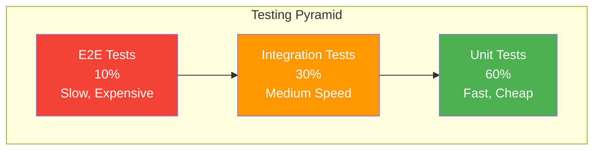

# Testing Strategy

## Table of Contents
1. [Testing Overview](#testing-overview)
2. [Unit Testing](#unit-testing)
3. [Integration Testing](#integration-testing)
4. [API Testing](#api-testing)
5. [End-to-End Testing](#end-to-end-testing)
6. [Performance Testing](#performance-testing)
7. [Test Data Management](#test-data-management)

## Testing Overview

### Testing Pyramid



### Testing Coverage Targets

| Test Type | Coverage Target | Execution Time | Frequency |
|-----------|----------------|----------------|-----------|
| Unit Tests | 80%+ | < 5 min | Every commit |
| Integration Tests | 70%+ | < 10 min | Every PR |
| API Tests | 100% endpoints | < 5 min | Every PR |
| E2E Tests | Critical paths | < 15 min | Before release |

### Test Framework Stack

**Backend Testing**:
- JUnit 5: Unit testing framework
- Mockito: Mocking framework
- AssertJ: Fluent assertions
- TestContainers: Integration testing with real databases
- REST Assured: API testing
- JaCoCo: Code coverage

**Test Dependencies** (pom.xml):
```xml
<dependencies>
    <!-- JUnit 5 -->
    <dependency>
        <groupId>org.springframework.boot</groupId>
        <artifactId>spring-boot-starter-test</artifactId>
        <scope>test</scope>
    </dependency>

    <!-- TestContainers -->
    <dependency>
        <groupId>org.testcontainers</groupId>
        <artifactId>testcontainers</artifactId>
        <version>1.19.3</version>
        <scope>test</scope>
    </dependency>
    <dependency>
        <groupId>org.testcontainers</groupId>
        <artifactId>postgresql</artifactId>
        <version>1.19.3</version>
        <scope>test</scope>
    </dependency>
    <dependency>
        <groupId>org.testcontainers</groupId>
        <artifactId>junit-jupiter</artifactId>
        <version>1.19.3</version>
        <scope>test</scope>
    </dependency>

    <!-- REST Assured -->
    <dependency>
        <groupId>io.rest-assured</groupId>
        <artifactId>rest-assured</artifactId>
        <version>5.3.2</version>
        <scope>test</scope>
    </dependency>

    <!-- AssertJ -->
    <dependency>
        <groupId>org.assertj</groupId>
        <artifactId>assertj-core</artifactId>
        <scope>test</scope>
    </dependency>
</dependencies>
```

## Unit Testing

### Domain Layer Testing

**StudentTest.java** (Entity Test):
```java
package com.school.sms.student.domain.entity;

import com.school.sms.student.domain.valueobject.*;
import org.junit.jupiter.api.*;
import static org.assertj.core.api.Assertions.*;
import java.time.LocalDate;

class StudentTest {

    @Test
    @DisplayName("Should calculate correct age from date of birth")
    void shouldCalculateCorrectAge() {
        // Given
        LocalDate dob = LocalDate.now().minusYears(10);
        Student student = Student.builder()
            .dateOfBirth(dob)
            .build();

        // When
        int age = student.calculateAge();

        // Then
        assertThat(age).isEqualTo(10);
    }

    @Test
    @DisplayName("Should activate student successfully")
    void shouldActivateStudent() {
        // Given
        Student student = Student.builder()
            .status(StudentStatus.INACTIVE)
            .build();

        // When
        student.activate();

        // Then
        assertThat(student.getStatus()).isEqualTo(StudentStatus.ACTIVE);
        assertThat(student.isActive()).isTrue();
    }

    @Test
    @DisplayName("Should deactivate student successfully")
    void shouldDeactivateStudent() {
        // Given
        Student student = Student.builder()
            .status(StudentStatus.ACTIVE)
            .build();

        // When
        student.deactivate();

        // Then
        assertThat(student.getStatus()).isEqualTo(StudentStatus.INACTIVE);
        assertThat(student.isActive()).isFalse();
    }
}
```

**AddressTest.java** (Value Object Test):
```java
package com.school.sms.student.domain.valueobject;

import org.junit.jupiter.api.*;
import static org.assertj.core.api.Assertions.*;

class AddressTest {

    @Test
    @DisplayName("Should generate full address correctly")
    void shouldGenerateFullAddress() {
        // Given
        Address address = Address.builder()
            .street("123 MG Road")
            .city("Bangalore")
            .state("Karnataka")
            .pinCode("560001")
            .country("India")
            .build();

        // When
        String fullAddress = address.getFullAddress();

        // Then
        assertThat(fullAddress)
            .isEqualTo("123 MG Road, Bangalore, Karnataka - 560001, India");
    }
}
```

### Service Layer Testing

**StudentRegistrationServiceTest.java**:
```java
package com.school.sms.student.application.service;

import com.school.sms.student.application.dto.StudentDTO;
import com.school.sms.student.application.mapper.StudentMapper;
import com.school.sms.student.domain.entity.Student;
import com.school.sms.student.domain.exception.*;
import com.school.sms.student.domain.repository.StudentRepository;
import com.school.sms.student.infrastructure.util.StudentIdGenerator;
import com.school.sms.student.presentation.dto.CreateStudentRequest;
import org.junit.jupiter.api.*;
import org.junit.jupiter.api.extension.ExtendWith;
import org.mockito.*;
import org.mockito.junit.jupiter.MockitoExtension;
import java.time.LocalDate;
import static org.assertj.core.api.Assertions.*;
import static org.mockito.ArgumentMatchers.*;
import static org.mockito.Mockito.*;

@ExtendWith(MockitoExtension.class)
class StudentRegistrationServiceTest {

    @Mock
    private StudentRepository studentRepository;

    @Mock
    private StudentMapper studentMapper;

    @Mock
    private StudentIdGenerator idGenerator;

    @InjectMocks
    private StudentRegistrationService service;

    private CreateStudentRequest validRequest;
    private Student validStudent;

    @BeforeEach
    void setUp() {
        validRequest = createValidRequest();
        validStudent = createValidStudent();
    }

    @Test
    @DisplayName("Should register student successfully with valid data")
    void shouldRegisterStudentSuccessfully() {
        // Given
        when(studentRepository.existsByMobile(anyString())).thenReturn(false);
        when(idGenerator.generate()).thenReturn("STU-2025-00001");
        when(studentMapper.toEntity(any())).thenReturn(validStudent);
        when(studentRepository.save(any(Student.class))).thenReturn(validStudent);
        when(studentMapper.toDTO(any(Student.class)))
            .thenReturn(new StudentDTO(/* ... */));

        // When
        StudentDTO result = service.registerStudent(validRequest, "ADMIN001");

        // Then
        assertThat(result).isNotNull();
        verify(studentRepository).existsByMobile(validRequest.getMobile());
        verify(idGenerator).generate();
        verify(studentRepository).save(any(Student.class));
    }

    @Test
    @DisplayName("Should throw InvalidAgeException when student is too young")
    void shouldThrowExceptionWhenStudentTooYoung() {
        // Given
        validRequest.setDateOfBirth(LocalDate.now().minusYears(2));

        // When & Then
        assertThatThrownBy(() -> service.registerStudent(validRequest, "ADMIN001"))
            .isInstanceOf(InvalidAgeException.class)
            .hasMessageContaining("Student age must be between 3 and 18 years");
    }

    @Test
    @DisplayName("Should throw InvalidAgeException when student is too old")
    void shouldThrowExceptionWhenStudentTooOld() {
        // Given
        validRequest.setDateOfBirth(LocalDate.now().minusYears(19));

        // When & Then
        assertThatThrownBy(() -> service.registerStudent(validRequest, "ADMIN001"))
            .isInstanceOf(InvalidAgeException.class)
            .hasMessageContaining("Student age must be between 3 and 18 years");
    }

    @Test
    @DisplayName("Should throw DuplicateMobileException when mobile already exists")
    void shouldThrowExceptionWhenMobileDuplicate() {
        // Given
        when(studentRepository.existsByMobile(anyString())).thenReturn(true);

        // When & Then
        assertThatThrownBy(() -> service.registerStudent(validRequest, "ADMIN001"))
            .isInstanceOf(DuplicateMobileException.class)
            .hasMessageContaining("Mobile number already registered");

        verify(studentRepository, never()).save(any());
    }

    private CreateStudentRequest createValidRequest() {
        CreateStudentRequest request = new CreateStudentRequest();
        request.setFirstName("Rajesh");
        request.setLastName("Kumar");
        request.setDateOfBirth(LocalDate.now().minusYears(10));
        request.setMobile("9876543210");
        request.setStreet("123 MG Road");
        request.setCity("Bangalore");
        request.setState("Karnataka");
        request.setPinCode("560001");
        request.setFatherNameOrGuardian("Suresh Kumar");
        return request;
    }

    private Student createValidStudent() {
        return Student.builder()
            .studentId("STU-2025-00001")
            .firstName("Rajesh")
            .lastName("Kumar")
            .dateOfBirth(LocalDate.now().minusYears(10))
            .mobile("9876543210")
            .build();
    }
}
```

### Parameterized Tests

**AgeValidationTest.java**:
```java
package com.school.sms.student.application.service;

import com.school.sms.student.domain.exception.InvalidAgeException;
import org.junit.jupiter.params.ParameterizedTest;
import org.junit.jupiter.params.provider.*;
import java.time.LocalDate;
import java.util.stream.Stream;
import static org.assertj.core.api.Assertions.*;

class AgeValidationTest {

    @ParameterizedTest
    @MethodSource("validAges")
    @DisplayName("Should accept valid ages (3-18 years)")
    void shouldAcceptValidAges(int yearsAgo) {
        // Given
        LocalDate dob = LocalDate.now().minusYears(yearsAgo);

        // When & Then
        assertThatCode(() -> validateAge(dob))
            .doesNotThrowAnyException();
    }

    @ParameterizedTest
    @MethodSource("invalidAges")
    @DisplayName("Should reject invalid ages (< 3 or > 18)")
    void shouldRejectInvalidAges(int yearsAgo) {
        // Given
        LocalDate dob = LocalDate.now().minusYears(yearsAgo);

        // When & Then
        assertThatThrownBy(() -> validateAge(dob))
            .isInstanceOf(InvalidAgeException.class);
    }

    static Stream<Integer> validAges() {
        return Stream.of(3, 5, 10, 15, 18);
    }

    static Stream<Integer> invalidAges() {
        return Stream.of(0, 1, 2, 19, 20, 25);
    }

    private void validateAge(LocalDate dob) {
        int age = java.time.Period.between(dob, LocalDate.now()).getYears();
        if (age < 3 || age > 18) {
            throw new InvalidAgeException("Invalid age: " + age);
        }
    }
}
```

## Integration Testing

### Repository Integration Tests

**StudentRepositoryIntegrationTest.java**:
```java
package com.school.sms.student.infrastructure.persistence;

import com.school.sms.student.domain.entity.Student;
import com.school.sms.student.domain.valueobject.*;
import com.school.sms.student.infrastructure.persistence.repository.JpaStudentRepository;
import org.junit.jupiter.api.*;
import org.springframework.beans.factory.annotation.Autowired;
import org.springframework.boot.test.autoconfigure.jdbc.AutoConfigureTestDatabase;
import org.springframework.boot.test.autoconfigure.orm.jpa.DataJpaTest;
import org.springframework.test.context.DynamicPropertyRegistry;
import org.springframework.test.context.DynamicPropertySource;
import org.testcontainers.containers.PostgreSQLContainer;
import org.testcontainers.junit.jupiter.Container;
import org.testcontainers.junit.jupiter.Testcontainers;
import java.time.LocalDate;
import java.util.Optional;
import static org.assertj.core.api.Assertions.*;

@DataJpaTest
@Testcontainers
@AutoConfigureTestDatabase(replace = AutoConfigureTestDatabase.Replace.NONE)
class StudentRepositoryIntegrationTest {

    @Container
    static PostgreSQLContainer<?> postgres = new PostgreSQLContainer<>("postgres:15-alpine")
        .withDatabaseName("test_db")
        .withUsername("test_user")
        .withPassword("test_pass");

    @DynamicPropertySource
    static void configureProperties(DynamicPropertyRegistry registry) {
        registry.add("spring.datasource.url", postgres::getJdbcUrl);
        registry.add("spring.datasource.username", postgres::getUsername);
        registry.add("spring.datasource.password", postgres::getPassword);
    }

    @Autowired
    private JpaStudentRepository repository;

    @Test
    @DisplayName("Should save and retrieve student successfully")
    void shouldSaveAndRetrieveStudent() {
        // Given
        Student student = createStudent("STU-2025-00001", "9876543210");

        // When
        Student saved = repository.save(student);
        Optional<Student> retrieved = repository.findById(saved.getStudentId());

        // Then
        assertThat(retrieved).isPresent();
        assertThat(retrieved.get().getStudentId()).isEqualTo("STU-2025-00001");
        assertThat(retrieved.get().getMobile()).isEqualTo("9876543210");
    }

    @Test
    @DisplayName("Should detect duplicate mobile numbers")
    void shouldDetectDuplicateMobile() {
        // Given
        Student student1 = createStudent("STU-2025-00001", "9876543210");
        repository.save(student1);

        // When
        boolean exists = repository.existsByMobile("9876543210");

        // Then
        assertThat(exists).isTrue();
    }

    @Test
    @DisplayName("Should update student with optimistic locking")
    void shouldUpdateWithOptimisticLocking() {
        // Given
        Student student = createStudent("STU-2025-00001", "9876543210");
        Student saved = repository.save(student);

        // When
        saved.setFirstName("Updated");
        Student updated = repository.save(saved);

        // Then
        assertThat(updated.getFirstName()).isEqualTo("Updated");
        assertThat(updated.getVersion()).isEqualTo(1L);
    }

    private Student createStudent(String id, String mobile) {
        return Student.builder()
            .studentId(id)
            .firstName("Test")
            .lastName("Student")
            .dateOfBirth(LocalDate.now().minusYears(10))
            .address(Address.builder()
                .street("123 Test St")
                .city("Test City")
                .state("Test State")
                .pinCode("123456")
                .country("India")
                .build())
            .mobile(mobile)
            .fatherNameOrGuardian("Test Father")
            .status(StudentStatus.ACTIVE)
            .createdBy("TEST")
            .updatedBy("TEST")
            .build();
    }
}
```

## API Testing

### REST Controller Tests

**StudentControllerTest.java**:
```java
package com.school.sms.student.presentation.controller;

import com.fasterxml.jackson.databind.ObjectMapper;
import com.school.sms.student.application.dto.StudentDTO;
import com.school.sms.student.application.service.StudentRegistrationService;
import com.school.sms.student.domain.exception.*;
import com.school.sms.student.presentation.dto.CreateStudentRequest;
import org.junit.jupiter.api.*;
import org.springframework.beans.factory.annotation.Autowired;
import org.springframework.boot.test.autoconfigure.web.servlet.WebMvcTest;
import org.springframework.boot.test.mock.mockito.MockBean;
import org.springframework.http.MediaType;
import org.springframework.test.web.servlet.MockMvc;
import java.time.LocalDate;
import static org.mockito.ArgumentMatchers.*;
import static org.mockito.Mockito.*;
import static org.springframework.test.web.servlet.request.MockMvcRequestBuilders.*;
import static org.springframework.test.web.servlet.result.MockMvcResultMatchers.*;

@WebMvcTest(StudentController.class)
class StudentControllerTest {

    @Autowired
    private MockMvc mockMvc;

    @Autowired
    private ObjectMapper objectMapper;

    @MockBean
    private StudentRegistrationService registrationService;

    @Test
    @DisplayName("POST /students should create student and return 201")
    void shouldCreateStudent() throws Exception {
        // Given
        CreateStudentRequest request = createValidRequest();
        StudentDTO responseDTO = new StudentDTO();
        responseDTO.setStudentId("STU-2025-00001");

        when(registrationService.registerStudent(any(), anyString()))
            .thenReturn(responseDTO);

        // When & Then
        mockMvc.perform(post("/students")
                .contentType(MediaType.APPLICATION_JSON)
                .header("X-User-ID", "ADMIN001")
                .content(objectMapper.writeValueAsString(request)))
            .andExpect(status().isCreated())
            .andExpect(jsonPath("$.studentId").value("STU-2025-00001"));
    }

    @Test
    @DisplayName("POST /students should return 400 for invalid age")
    void shouldReturn400ForInvalidAge() throws Exception {
        // Given
        CreateStudentRequest request = createValidRequest();
        request.setDateOfBirth(LocalDate.now().minusYears(2));

        when(registrationService.registerStudent(any(), anyString()))
            .thenThrow(new InvalidAgeException("Age must be between 3 and 18"));

        // When & Then
        mockMvc.perform(post("/students")
                .contentType(MediaType.APPLICATION_JSON)
                .header("X-User-ID", "ADMIN001")
                .content(objectMapper.writeValueAsString(request)))
            .andExpect(status().isBadRequest())
            .andExpect(jsonPath("$.title").value("Invalid Age"));
    }

    @Test
    @DisplayName("POST /students should return 409 for duplicate mobile")
    void shouldReturn409ForDuplicateMobile() throws Exception {
        // Given
        CreateStudentRequest request = createValidRequest();

        when(registrationService.registerStudent(any(), anyString()))
            .thenThrow(new DuplicateMobileException("Mobile already exists"));

        // When & Then
        mockMvc.perform(post("/students")
                .contentType(MediaType.APPLICATION_JSON)
                .header("X-User-ID", "ADMIN001")
                .content(objectMapper.writeValueAsString(request)))
            .andExpect(status().isConflict())
            .andExpect(jsonPath("$.title").value("Duplicate Mobile Number"));
    }

    @Test
    @DisplayName("POST /students should return 400 for validation errors")
    void shouldReturn400ForValidationErrors() throws Exception {
        // Given
        CreateStudentRequest request = new CreateStudentRequest();
        // Invalid: missing required fields

        // When & Then
        mockMvc.perform(post("/students")
                .contentType(MediaType.APPLICATION_JSON)
                .header("X-User-ID", "ADMIN001")
                .content(objectMapper.writeValueAsString(request)))
            .andExpect(status().isBadRequest())
            .andExpect(jsonPath("$.title").value("Validation Error"))
            .andExpect(jsonPath("$.errors").isArray());
    }

    private CreateStudentRequest createValidRequest() {
        CreateStudentRequest request = new CreateStudentRequest();
        request.setFirstName("Rajesh");
        request.setLastName("Kumar");
        request.setDateOfBirth(LocalDate.now().minusYears(10));
        request.setMobile("9876543210");
        request.setStreet("123 Test St");
        request.setCity("Bangalore");
        request.setState("Karnataka");
        request.setPinCode("560001");
        request.setFatherNameOrGuardian("Test Father");
        return request;
    }
}
```

### REST Assured API Tests

**StudentAPITest.java**:
```java
package com.school.sms.student.api;

import io.restassured.RestAssured;
import io.restassured.http.ContentType;
import org.junit.jupiter.api.*;
import org.springframework.boot.test.context.SpringBootTest;
import org.springframework.boot.test.web.server.LocalServerPort;
import org.springframework.test.context.DynamicPropertyRegistry;
import org.springframework.test.context.DynamicPropertySource;
import org.testcontainers.containers.PostgreSQLContainer;
import org.testcontainers.junit.jupiter.Container;
import org.testcontainers.junit.jupiter.Testcontainers;
import java.time.LocalDate;
import java.util.HashMap;
import java.util.Map;
import static io.restassured.RestAssured.given;
import static org.hamcrest.Matchers.*;

@SpringBootTest(webEnvironment = SpringBootTest.WebEnvironment.RANDOM_PORT)
@Testcontainers
class StudentAPITest {

    @LocalServerPort
    private int port;

    @Container
    static PostgreSQLContainer<?> postgres = new PostgreSQLContainer<>("postgres:15-alpine");

    @DynamicPropertySource
    static void configureProperties(DynamicPropertyRegistry registry) {
        registry.add("spring.datasource.url", postgres::getJdbcUrl);
        registry.add("spring.datasource.username", postgres::getUsername);
        registry.add("spring.datasource.password", postgres::getPassword);
    }

    @BeforeEach
    void setUp() {
        RestAssured.port = port;
        RestAssured.basePath = "/students";
    }

    @Test
    @DisplayName("Should create student via API and return 201")
    void shouldCreateStudentViaAPI() {
        Map<String, Object> requestBody = createStudentRequest();

        given()
            .contentType(ContentType.JSON)
            .header("X-User-ID", "ADMIN001")
            .body(requestBody)
        .when()
            .post()
        .then()
            .statusCode(201)
            .body("studentId", notNullValue())
            .body("firstName", equalTo("Rajesh"))
            .body("status", equalTo("ACTIVE"));
    }

    @Test
    @DisplayName("Should retrieve student by ID")
    void shouldRetrieveStudentById() {
        // First create a student
        String studentId = createStudent();

        // Then retrieve it
        given()
            .header("X-User-ID", "ADMIN001")
        .when()
            .get("/" + studentId)
        .then()
            .statusCode(200)
            .body("studentId", equalTo(studentId));
    }

    private Map<String, Object> createStudentRequest() {
        Map<String, Object> request = new HashMap<>();
        request.put("firstName", "Rajesh");
        request.put("lastName", "Kumar");
        request.put("dateOfBirth", LocalDate.now().minusYears(10).toString());
        request.put("mobile", "9876" + System.currentTimeMillis() % 1000000);
        request.put("street", "123 Test St");
        request.put("city", "Bangalore");
        request.put("state", "Karnataka");
        request.put("pinCode", "560001");
        request.put("fatherNameOrGuardian", "Test Father");
        return request;
    }

    private String createStudent() {
        return given()
            .contentType(ContentType.JSON)
            .header("X-User-ID", "ADMIN001")
            .body(createStudentRequest())
        .when()
            .post()
        .then()
            .statusCode(201)
            .extract()
            .path("studentId");
    }
}
```

## Test Data Management

### Test Data Builders

**StudentTestDataBuilder.java**:
```java
package com.school.sms.student.testutil;

import com.school.sms.student.domain.entity.Student;
import com.school.sms.student.domain.valueobject.*;
import java.time.LocalDate;

public class StudentTestDataBuilder {

    private String studentId = "STU-2025-00001";
    private String firstName = "Test";
    private String lastName = "Student";
    private LocalDate dateOfBirth = LocalDate.now().minusYears(10);
    private String mobile = "9876543210";
    private StudentStatus status = StudentStatus.ACTIVE;

    public static StudentTestDataBuilder aStudent() {
        return new StudentTestDataBuilder();
    }

    public StudentTestDataBuilder withStudentId(String studentId) {
        this.studentId = studentId;
        return this;
    }

    public StudentTestDataBuilder withName(String firstName, String lastName) {
        this.firstName = firstName;
        this.lastName = lastName;
        return this;
    }

    public StudentTestDataBuilder withAge(int years) {
        this.dateOfBirth = LocalDate.now().minusYears(years);
        return this;
    }

    public StudentTestDataBuilder withMobile(String mobile) {
        this.mobile = mobile;
        return this;
    }

    public StudentTestDataBuilder inactive() {
        this.status = StudentStatus.INACTIVE;
        return this;
    }

    public Student build() {
        return Student.builder()
            .studentId(studentId)
            .firstName(firstName)
            .lastName(lastName)
            .dateOfBirth(dateOfBirth)
            .mobile(mobile)
            .address(Address.builder()
                .street("123 Test St")
                .city("Test City")
                .state("Test State")
                .pinCode("123456")
                .country("India")
                .build())
            .fatherNameOrGuardian("Test Father")
            .status(status)
            .createdBy("TEST")
            .updatedBy("TEST")
            .build();
    }
}

// Usage:
Student student = StudentTestDataBuilder.aStudent()
    .withName("Rajesh", "Kumar")
    .withAge(12)
    .withMobile("9876543210")
    .build();
```

## Running Tests

### Maven Commands

```bash
# Run all tests
mvn test

# Run specific test class
mvn test -Dtest=StudentRegistrationServiceTest

# Run with coverage
mvn clean test jacoco:report

# Skip tests
mvn clean install -DskipTests

# Run integration tests only
mvn verify -P integration-tests
```

### Test Reports

**JaCoCo Coverage Report**: `target/site/jacoco/index.html`

**Surefire Test Report**: `target/surefire-reports/index.html`

## Summary

The testing strategy provides:
1. **Comprehensive Coverage**: Unit, integration, and API tests
2. **Test Pyramid**: 60% unit, 30% integration, 10% E2E
3. **Real Environment Testing**: TestContainers for database integration
4. **Automation**: CI/CD integration with automated test execution
5. **Best Practices**: Test data builders, parameterized tests, meaningful assertions

---

**Version**: 1.0
**Last Updated**: 2025-11-17
**Status**: Draft for Review
