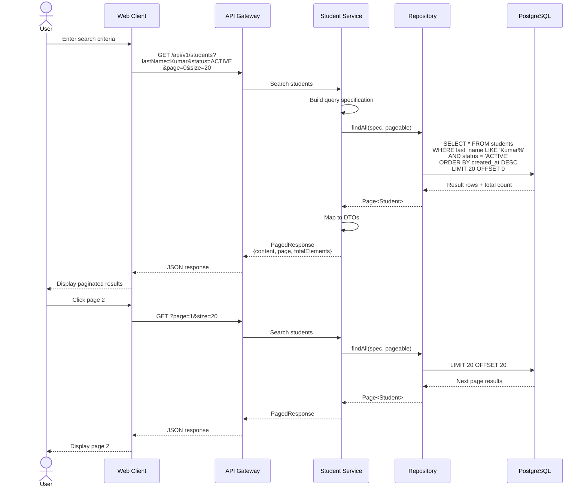

# Data Flow Diagrams

## Table of Contents
1. [Student Registration Flow](#student-registration-flow)
2. [Student Update Flow](#student-update-flow)
3. [Student Search Flow](#student-search-flow)
4. [Configuration Management Flow](#configuration-management-flow)
5. [Error Handling Flow](#error-handling-flow)
6. [System Startup Flow](#system-startup-flow)

## Student Registration Flow

### High-Level Process Flow

### Detailed Component Interaction

### Data Transformation Flow

## Student Update Flow

### Update Process with Optimistic Locking

### Concurrent Update Scenario

## Student Search Flow

### Search with Pagination

### Query Building Flow

## Configuration Management Flow

### Get Settings by Category

### School Profile Update

## Error Handling Flow

### Exception Handling Chain

### Error Response Flow

## System Startup Flow

### Service Initialization

### Service Discovery Flow

### Request Routing Flow

## Summary

The data flow diagrams illustrate:

1. **Student Registration**: Complete flow from form submission to database persistence
2. **Update Operations**: Optimistic locking and concurrent update handling
3. **Search Operations**: Query building and pagination
4. **Configuration Management**: Settings and school profile updates
5. **Error Handling**: Exception propagation and RFC 7807 responses
6. **System Startup**: Service initialization and discovery registration

These flows provide a clear understanding of how data moves through the system and how different components interact during various operations.

---

**Version**: 1.0
**Last Updated**: 2025-11-17
**Status**: Draft for Review
