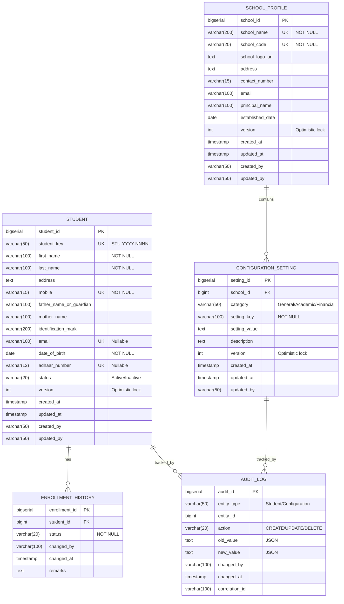

# Database Schema Design - School Management System (SMS)

## 1. Overview

This document defines the complete database schema for the School Management System. The design follows PostgreSQL 18 best practices with a focus on data integrity, performance, and auditability.

### 1.1 Design Principles
- **Normalization**: Third Normal Form (3NF) to minimize redundancy
- **Naming Convention**: `snake_case` for all database objects
- **Primary Keys**: `BIGSERIAL` for auto-incrementing IDs
- **Audit Columns**: Standard timestamps on all tables
- **Constraints**: NOT NULL, UNIQUE, CHECK, and FOREIGN KEY enforcement
- **Indexing**: Strategic indexes on search and foreign key columns
- **Optimistic Locking**: Version columns for concurrent update handling

### 1.2 Database Separation Strategy

The system uses **database per service** pattern for microservices isolation:
- **student_db**: Student Management Service database
- **config_db**: Configuration Service database

---

## 2. Entity Relationship Diagram

### 2.1 Complete ERD



---

## 3. Student Database (student_db)

### 3.1 Table: student

Stores all student registration and profile information.

#### Schema Definition

```sql
CREATE TABLE student (
    -- Primary Key
    student_id          BIGSERIAL PRIMARY KEY,

    -- Business Key (Human-readable, indexed)
    student_key         VARCHAR(50) NOT NULL UNIQUE,

    -- Personal Information (Required)
    first_name          VARCHAR(100) NOT NULL,
    last_name           VARCHAR(100) NOT NULL,
    date_of_birth       DATE NOT NULL,

    -- Contact Information
    mobile              VARCHAR(15) NOT NULL UNIQUE,
    email               VARCHAR(100) UNIQUE,
    address             TEXT,

    -- Guardian Information
    father_name_or_guardian VARCHAR(100),
    mother_name         VARCHAR(100),

    -- Identification
    identification_mark VARCHAR(200),
    adhaar_number       VARCHAR(12) UNIQUE,

    -- Status Management
    status              VARCHAR(20) NOT NULL DEFAULT 'Active',

    -- Optimistic Locking
    version             INTEGER NOT NULL DEFAULT 0,

    -- Audit Columns
    created_at          TIMESTAMP NOT NULL DEFAULT CURRENT_TIMESTAMP,
    updated_at          TIMESTAMP NOT NULL DEFAULT CURRENT_TIMESTAMP,
    created_by          VARCHAR(50),
    updated_by          VARCHAR(50),

    -- Constraints
    CONSTRAINT chk_student_status CHECK (status IN ('Active', 'Inactive')),
    CONSTRAINT chk_mobile_format CHECK (mobile ~ '^\+?[0-9]{10,15}$'),
    CONSTRAINT chk_email_format CHECK (email ~* '^[A-Za-z0-9._%+-]+@[A-Za-z0-9.-]+\.[A-Za-z]{2,}$'),
    CONSTRAINT chk_adhaar_format CHECK (adhaar_number IS NULL OR adhaar_number ~ '^[0-9]{12}$'),
    CONSTRAINT chk_dob_valid CHECK (date_of_birth <= CURRENT_DATE)
);

-- Indexes for performance
CREATE INDEX idx_student_last_name ON student(last_name);
CREATE INDEX idx_student_guardian ON student(father_name_or_guardian);
CREATE INDEX idx_student_mobile ON student(mobile);
CREATE INDEX idx_student_status ON student(status);
CREATE INDEX idx_student_created_at ON student(created_at DESC);
CREATE INDEX idx_student_composite_search ON student(last_name, first_name);

-- Trigger for updated_at
CREATE OR REPLACE FUNCTION update_updated_at_column()
RETURNS TRIGGER AS $$
BEGIN
    NEW.updated_at = CURRENT_TIMESTAMP;
    RETURN NEW;
END;
$$ LANGUAGE plpgsql;

CREATE TRIGGER trg_student_updated_at
    BEFORE UPDATE ON student
    FOR EACH ROW
    EXECUTE FUNCTION update_updated_at_column();

-- Comments
COMMENT ON TABLE student IS 'Stores student registration and profile information';
COMMENT ON COLUMN student.student_key IS 'Human-readable business key (e.g., STU-2025-0001)';
COMMENT ON COLUMN student.status IS 'Current enrollment status: Active or Inactive';
COMMENT ON COLUMN student.version IS 'Optimistic locking version for concurrent updates';
```

#### Column Specifications

| Column | Type | Nullable | Default | Description | Validation |
|--------|------|----------|---------|-------------|------------|
| student_id | BIGSERIAL | NO | AUTO | Primary key, auto-generated | - |
| student_key | VARCHAR(50) | NO | - | Business key (STU-YYYY-NNNN) | UNIQUE, Format: STU-{year}-{sequence} |
| first_name | VARCHAR(100) | NO | - | Student's first name | Length: 1-100 |
| last_name | VARCHAR(100) | NO | - | Student's last name | Length: 1-100, Indexed |
| date_of_birth | DATE | NO | - | Birth date for age calculation | Age 3-18 enforced in app |
| mobile | VARCHAR(15) | NO | - | Contact number | UNIQUE, Format: 10-15 digits |
| email | VARCHAR(100) | YES | - | Email address | UNIQUE, Valid email format |
| address | TEXT | YES | - | Residential address | Max 1000 chars |
| father_name_or_guardian | VARCHAR(100) | YES | - | Guardian name | Searchable field |
| mother_name | VARCHAR(100) | YES | - | Mother's name | - |
| identification_mark | VARCHAR(200) | YES | - | Physical identification mark | - |
| adhaar_number | VARCHAR(12) | YES | - | National ID (India) | UNIQUE, 12 digits |
| status | VARCHAR(20) | NO | 'Active' | Enrollment status | Active/Inactive |
| version | INTEGER | NO | 0 | Optimistic lock version | Auto-incremented |
| created_at | TIMESTAMP | NO | NOW() | Record creation timestamp | - |
| updated_at | TIMESTAMP | NO | NOW() | Last update timestamp | Auto-updated |
| created_by | VARCHAR(50) | YES | - | User who created record | Phase 2: User ID |
| updated_by | VARCHAR(50) | YES | - | User who last updated | Phase 2: User ID |

#### Sample Data

```sql
INSERT INTO student (
    student_key, first_name, last_name, date_of_birth, mobile, email,
    father_name_or_guardian, mother_name, identification_mark, adhaar_number, status
) VALUES
(
    'STU-2025-0001', 'Rahul', 'Sharma', '2012-05-15', '+919876543210', 'rahul.sharma@example.com',
    'Raj Sharma', 'Priya Sharma', 'Mole on left cheek', '123456789012', 'Active'
),
(
    'STU-2025-0002', 'Priya', 'Patel', '2014-08-22', '+919876543211', 'priya.patel@example.com',
    'Suresh Patel', 'Kavita Patel', 'Scar on right hand', '234567890123', 'Active'
),
(
    'STU-2025-0003', 'Amit', 'Kumar', '2010-12-10', '+919876543212', NULL,
    'Vijay Kumar', 'Sunita Kumar', NULL, NULL, 'Inactive'
);
```

---

### 3.2 Table: enrollment_history

Tracks all status changes for students (Active ↔ Inactive transitions).

#### Schema Definition

```sql
CREATE TABLE enrollment_history (
    -- Primary Key
    enrollment_id       BIGSERIAL PRIMARY KEY,

    -- Foreign Key to Student
    student_id          BIGINT NOT NULL,

    -- Status Change Information
    status              VARCHAR(20) NOT NULL,
    changed_by          VARCHAR(100),
    changed_at          TIMESTAMP NOT NULL DEFAULT CURRENT_TIMESTAMP,
    remarks             TEXT,

    -- Foreign Key Constraint
    CONSTRAINT fk_enrollment_student FOREIGN KEY (student_id)
        REFERENCES student(student_id)
        ON DELETE CASCADE,

    -- Constraints
    CONSTRAINT chk_enrollment_status CHECK (status IN ('Active', 'Inactive'))
);

-- Indexes
CREATE INDEX idx_enrollment_student_id ON enrollment_history(student_id);
CREATE INDEX idx_enrollment_changed_at ON enrollment_history(changed_at DESC);

-- Comments
COMMENT ON TABLE enrollment_history IS 'Audit trail for student status changes';
COMMENT ON COLUMN enrollment_history.status IS 'New status after change';
COMMENT ON COLUMN enrollment_history.changed_by IS 'User who made the change';
```

#### Column Specifications

| Column | Type | Nullable | Default | Description |
|--------|------|----------|---------|-------------|
| enrollment_id | BIGSERIAL | NO | AUTO | Primary key |
| student_id | BIGINT | NO | - | Reference to student table |
| status | VARCHAR(20) | NO | - | New status (Active/Inactive) |
| changed_by | VARCHAR(100) | YES | - | User who changed status |
| changed_at | TIMESTAMP | NO | NOW() | Timestamp of change |
| remarks | TEXT | YES | - | Reason for status change |

#### Sample Data

```sql
INSERT INTO enrollment_history (student_id, status, changed_by, remarks)
VALUES
(1, 'Active', 'admin', 'Initial registration'),
(2, 'Active', 'admin', 'Initial registration'),
(3, 'Active', 'admin', 'Initial registration'),
(3, 'Inactive', 'admin', 'Student transferred to another school');
```

---

## 4. Configuration Database (config_db)

### 4.1 Table: school_profile

Stores the school's basic information (single row expected).

#### Schema Definition

```sql
CREATE TABLE school_profile (
    -- Primary Key
    school_id           BIGSERIAL PRIMARY KEY,

    -- School Information (Required)
    school_name         VARCHAR(200) NOT NULL UNIQUE,
    school_code         VARCHAR(20) NOT NULL UNIQUE,

    -- Additional Information
    school_logo_url     TEXT,
    address             TEXT,
    contact_number      VARCHAR(15),
    email               VARCHAR(100),
    principal_name      VARCHAR(100),
    established_date    DATE,

    -- Optimistic Locking
    version             INTEGER NOT NULL DEFAULT 0,

    -- Audit Columns
    created_at          TIMESTAMP NOT NULL DEFAULT CURRENT_TIMESTAMP,
    updated_at          TIMESTAMP NOT NULL DEFAULT CURRENT_TIMESTAMP,
    created_by          VARCHAR(50),
    updated_by          VARCHAR(50),

    -- Constraints
    CONSTRAINT chk_school_contact_format CHECK (contact_number ~ '^\+?[0-9]{10,15}$'),
    CONSTRAINT chk_school_email_format CHECK (email ~* '^[A-Za-z0-9._%+-]+@[A-Za-z0-9.-]+\.[A-Za-z]{2,}$')
);

-- Trigger for updated_at
CREATE TRIGGER trg_school_updated_at
    BEFORE UPDATE ON school_profile
    FOR EACH ROW
    EXECUTE FUNCTION update_updated_at_column();

-- Comments
COMMENT ON TABLE school_profile IS 'Stores school basic information (single row)';
COMMENT ON COLUMN school_profile.school_code IS 'Unique identifier for the school';
```

#### Column Specifications

| Column | Type | Nullable | Default | Description |
|--------|------|----------|---------|-------------|
| school_id | BIGSERIAL | NO | AUTO | Primary key |
| school_name | VARCHAR(200) | NO | - | Official school name |
| school_code | VARCHAR(20) | NO | - | Unique school code |
| school_logo_url | TEXT | YES | - | URL to school logo image |
| address | TEXT | YES | - | School physical address |
| contact_number | VARCHAR(15) | YES | - | School contact number |
| email | VARCHAR(100) | YES | - | School official email |
| principal_name | VARCHAR(100) | YES | - | Current principal name |
| established_date | DATE | YES | - | School founding date |
| version | INTEGER | NO | 0 | Optimistic lock version |
| created_at | TIMESTAMP | NO | NOW() | Record creation timestamp |
| updated_at | TIMESTAMP | NO | NOW() | Last update timestamp |
| created_by | VARCHAR(50) | YES | - | User who created record |
| updated_by | VARCHAR(50) | YES | - | User who last updated |

#### Sample Data

```sql
INSERT INTO school_profile (
    school_name, school_code, address, contact_number, email, principal_name, established_date
) VALUES (
    'ABC International School',
    'ABC-2025',
    '123 Education Street, Learning City, State - 123456',
    '+919876543210',
    'info@abcschool.edu',
    'Dr. Rajesh Kumar',
    '2005-06-15'
);
```

---

### 4.2 Table: configuration_setting

Stores key-value configuration settings grouped by category.

#### Schema Definition

```sql
CREATE TABLE configuration_setting (
    -- Primary Key
    setting_id          BIGSERIAL PRIMARY KEY,

    -- Foreign Key to School
    school_id           BIGINT NOT NULL,

    -- Setting Information
    category            VARCHAR(50) NOT NULL,
    setting_key         VARCHAR(100) NOT NULL,
    setting_value       TEXT,
    description         TEXT,

    -- Optimistic Locking
    version             INTEGER NOT NULL DEFAULT 0,

    -- Audit Columns
    created_at          TIMESTAMP NOT NULL DEFAULT CURRENT_TIMESTAMP,
    updated_at          TIMESTAMP NOT NULL DEFAULT CURRENT_TIMESTAMP,
    updated_by          VARCHAR(50),

    -- Foreign Key Constraint
    CONSTRAINT fk_setting_school FOREIGN KEY (school_id)
        REFERENCES school_profile(school_id)
        ON DELETE CASCADE,

    -- Constraints
    CONSTRAINT chk_setting_category CHECK (category IN ('General', 'Academic', 'Financial')),
    CONSTRAINT uq_setting_key_per_school UNIQUE (school_id, category, setting_key)
);

-- Indexes
CREATE INDEX idx_setting_category ON configuration_setting(category);
CREATE INDEX idx_setting_key ON configuration_setting(setting_key);
CREATE INDEX idx_setting_school_category ON configuration_setting(school_id, category);

-- Trigger for updated_at
CREATE TRIGGER trg_setting_updated_at
    BEFORE UPDATE ON configuration_setting
    FOR EACH ROW
    EXECUTE FUNCTION update_updated_at_column();

-- Comments
COMMENT ON TABLE configuration_setting IS 'Stores school configuration as key-value pairs';
COMMENT ON COLUMN configuration_setting.category IS 'Setting category: General, Academic, or Financial';
COMMENT ON COLUMN configuration_setting.setting_key IS 'Unique key within category';
```

#### Column Specifications

| Column | Type | Nullable | Default | Description |
|--------|------|----------|---------|-------------|
| setting_id | BIGSERIAL | NO | AUTO | Primary key |
| school_id | BIGINT | NO | - | Reference to school_profile |
| category | VARCHAR(50) | NO | - | General/Academic/Financial |
| setting_key | VARCHAR(100) | NO | - | Configuration key name |
| setting_value | TEXT | YES | - | Configuration value (JSON supported) |
| description | TEXT | YES | - | Human-readable description |
| version | INTEGER | NO | 0 | Optimistic lock version |
| created_at | TIMESTAMP | NO | NOW() | Record creation timestamp |
| updated_at | TIMESTAMP | NO | NOW() | Last update timestamp |
| updated_by | VARCHAR(50) | YES | - | User who last updated |

#### Sample Data

```sql
-- General Settings
INSERT INTO configuration_setting (school_id, category, setting_key, setting_value, description)
VALUES
(1, 'General', 'school.timezone', 'Asia/Kolkata', 'School timezone'),
(1, 'General', 'school.language', 'en-US', 'Default language'),
(1, 'General', 'school.currency', 'INR', 'Currency for financial transactions'),
(1, 'General', 'school.working_days', '["Monday","Tuesday","Wednesday","Thursday","Friday","Saturday"]', 'Working days of the week');

-- Academic Settings
INSERT INTO configuration_setting (school_id, category, setting_key, setting_value, description)
VALUES
(1, 'Academic', 'academic.year.current', '2025-2026', 'Current academic year'),
(1, 'Academic', 'academic.year.start_date', '2025-04-01', 'Academic year start date'),
(1, 'Academic', 'academic.year.end_date', '2026-03-31', 'Academic year end date'),
(1, 'Academic', 'academic.class.max_capacity', '40', 'Maximum students per class'),
(1, 'Academic', 'academic.grading.system', 'CBSE', 'Grading system (CBSE/ICSE/State)');

-- Financial Settings
INSERT INTO configuration_setting (school_id, category, setting_key, setting_value, description)
VALUES
(1, 'Financial', 'fee.registration', '5000', 'One-time registration fee'),
(1, 'Financial', 'fee.tuition.monthly', '8000', 'Monthly tuition fee'),
(1, 'Financial', 'fee.late.penalty', '100', 'Late payment penalty per day'),
(1, 'Financial', 'fee.payment.methods', '["Cash","Card","UPI","Bank Transfer"]', 'Accepted payment methods');
```

---

## 5. Audit and Logging

### 5.1 Table: audit_log

Comprehensive audit trail for all CRUD operations across the system.

#### Schema Definition

```sql
CREATE TABLE audit_log (
    -- Primary Key
    audit_id            BIGSERIAL PRIMARY KEY,

    -- Entity Information
    entity_type         VARCHAR(50) NOT NULL,
    entity_id           BIGINT NOT NULL,

    -- Action Information
    action              VARCHAR(20) NOT NULL,
    old_value           JSONB,
    new_value           JSONB,

    -- User & Tracking
    changed_by          VARCHAR(100),
    changed_at          TIMESTAMP NOT NULL DEFAULT CURRENT_TIMESTAMP,
    correlation_id      VARCHAR(100),

    -- Constraints
    CONSTRAINT chk_audit_action CHECK (action IN ('CREATE', 'UPDATE', 'DELETE', 'STATUS_CHANGE'))
);

-- Indexes for efficient querying
CREATE INDEX idx_audit_entity ON audit_log(entity_type, entity_id);
CREATE INDEX idx_audit_changed_at ON audit_log(changed_at DESC);
CREATE INDEX idx_audit_correlation ON audit_log(correlation_id);
CREATE INDEX idx_audit_changed_by ON audit_log(changed_by);

-- Partitioning by month (for performance with large datasets)
-- This is an example; actual implementation would use declarative partitioning
COMMENT ON TABLE audit_log IS 'Comprehensive audit trail for all system changes';
COMMENT ON COLUMN audit_log.entity_type IS 'Type of entity (Student, Configuration, etc.)';
COMMENT ON COLUMN audit_log.old_value IS 'JSON snapshot of entity before change';
COMMENT ON COLUMN audit_log.new_value IS 'JSON snapshot of entity after change';
COMMENT ON COLUMN audit_log.correlation_id IS 'Request correlation ID for tracing';
```

#### Column Specifications

| Column | Type | Nullable | Default | Description |
|--------|------|----------|---------|-------------|
| audit_id | BIGSERIAL | NO | AUTO | Primary key |
| entity_type | VARCHAR(50) | NO | - | Entity name (Student/Configuration) |
| entity_id | BIGINT | NO | - | ID of the affected entity |
| action | VARCHAR(20) | NO | - | CREATE/UPDATE/DELETE/STATUS_CHANGE |
| old_value | JSONB | YES | - | Entity state before change |
| new_value | JSONB | YES | - | Entity state after change |
| changed_by | VARCHAR(100) | YES | - | User who made the change |
| changed_at | TIMESTAMP | NO | NOW() | Timestamp of change |
| correlation_id | VARCHAR(100) | YES | - | Zipkin correlation ID |

#### Sample Data

```sql
INSERT INTO audit_log (entity_type, entity_id, action, new_value, changed_by, correlation_id)
VALUES (
    'Student',
    1,
    'CREATE',
    '{"student_key":"STU-2025-0001","first_name":"Rahul","last_name":"Sharma","status":"Active"}',
    'admin',
    'a1b2c3d4-e5f6-7890-1234-567890abcdef'
);

INSERT INTO audit_log (entity_type, entity_id, action, old_value, new_value, changed_by, correlation_id)
VALUES (
    'Student',
    1,
    'UPDATE',
    '{"mobile":"+919876543210","status":"Active"}',
    '{"mobile":"+919876543299","status":"Active"}',
    'admin',
    'b2c3d4e5-f6a7-8901-2345-67890abcdef0'
);
```

---

## 6. Database Constraints Summary

### 6.1 Primary Keys
- All tables use `BIGSERIAL` for auto-incrementing primary keys
- Sufficient for billions of records (9,223,372,036,854,775,807 max)

### 6.2 Unique Constraints
| Table | Column(s) | Purpose |
|-------|-----------|---------|
| student | student_key | Business key uniqueness |
| student | mobile | One mobile per student |
| student | email | One email per student (if provided) |
| student | adhaar_number | National ID uniqueness |
| school_profile | school_name | Unique school name |
| school_profile | school_code | Unique school code |
| configuration_setting | (school_id, category, setting_key) | No duplicate keys per category |

### 6.3 Foreign Keys
| Table | Column | References | On Delete |
|-------|--------|------------|-----------|
| enrollment_history | student_id | student(student_id) | CASCADE |
| configuration_setting | school_id | school_profile(school_id) | CASCADE |

### 6.4 Check Constraints
| Table | Constraint | Purpose |
|-------|-----------|---------|
| student | status | Only 'Active' or 'Inactive' |
| student | mobile | Valid phone format (10-15 digits) |
| student | email | Valid email format |
| student | adhaar_number | 12-digit format |
| student | date_of_birth | Not future date |
| configuration_setting | category | Only 'General', 'Academic', 'Financial' |

### 6.5 Indexes Summary
| Table | Index | Type | Purpose |
|-------|-------|------|---------|
| student | student_key | UNIQUE | Fast lookup by business key |
| student | mobile | UNIQUE | Fast lookup & uniqueness |
| student | last_name | B-tree | Search by last name |
| student | father_name_or_guardian | B-tree | Search by guardian |
| student | (last_name, first_name) | Composite | Full name search |
| configuration_setting | (school_id, category) | Composite | Category-based retrieval |
| audit_log | (entity_type, entity_id) | Composite | Audit trail lookup |

---

## 7. Database Performance Optimization

### 7.1 Connection Pooling (HikariCP)
```yaml
spring:
  datasource:
    hikari:
      minimum-idle: 10
      maximum-pool-size: 50
      connection-timeout: 30000
      idle-timeout: 600000
      max-lifetime: 1800000
      pool-name: SMS-HikariPool
```

### 7.2 Query Optimization Strategies

#### Prevent N+1 Queries
```java
// Bad: N+1 queries
List<Student> students = studentRepository.findAll();
students.forEach(s -> s.getEnrollmentHistory().size()); // N queries

// Good: Single query with JOIN FETCH
@Query("SELECT s FROM Student s LEFT JOIN FETCH s.enrollmentHistory")
List<Student> findAllWithHistory();
```

#### Use Projections for Large Result Sets
```java
// DTO Projection (fetch only required columns)
public interface StudentSummaryProjection {
    String getStudentKey();
    String getFirstName();
    String getLastName();
    String getStatus();
}
```

#### Pagination for Large Datasets
```java
Pageable pageable = PageRequest.of(0, 20, Sort.by("lastName").ascending());
Page<Student> students = studentRepository.findAll(pageable);
```

### 7.3 Database-Level Optimizations

#### Analyze and Vacuum
```sql
-- Regular maintenance (schedule weekly)
ANALYZE student;
VACUUM ANALYZE student;

-- Check index usage
SELECT schemaname, tablename, indexname, idx_scan
FROM pg_stat_user_indexes
WHERE schemaname = 'public'
ORDER BY idx_scan ASC;
```

#### Query Performance Monitoring
```sql
-- Enable pg_stat_statements
CREATE EXTENSION IF NOT EXISTS pg_stat_statements;

-- Find slow queries
SELECT query, mean_exec_time, calls
FROM pg_stat_statements
WHERE mean_exec_time > 100
ORDER BY mean_exec_time DESC
LIMIT 10;
```

---

## 8. Data Migration & Seeding

### 8.1 Initial Setup Script

```sql
-- Create databases
CREATE DATABASE student_db
    WITH ENCODING 'UTF8'
    LC_COLLATE = 'en_US.UTF-8'
    LC_CTYPE = 'en_US.UTF-8'
    TEMPLATE template0;

CREATE DATABASE config_db
    WITH ENCODING 'UTF8'
    LC_COLLATE = 'en_US.UTF-8'
    LC_CTYPE = 'en_US.UTF-8'
    TEMPLATE template0;

-- Create application user
CREATE USER sms_app_user WITH PASSWORD 'secure_password_here';

-- Grant privileges
GRANT ALL PRIVILEGES ON DATABASE student_db TO sms_app_user;
GRANT ALL PRIVILEGES ON DATABASE config_db TO sms_app_user;
```

### 8.2 Flyway Migration Strategy

**Directory Structure:**
```
resources/
├── db/
│   └── migration/
│       ├── V1.0.0__Create_student_table.sql
│       ├── V1.0.1__Create_enrollment_history_table.sql
│       ├── V1.0.2__Create_audit_log_table.sql
│       ├── V1.1.0__Create_school_profile_table.sql
│       ├── V1.1.1__Create_configuration_setting_table.sql
│       └── V1.2.0__Insert_seed_data.sql
```

**Naming Convention:**
- `V{major}.{minor}.{patch}__{Description}.sql`
- Never modify executed migrations
- Use versioned migrations for schema changes
- Use repeatable migrations for views/functions

---

## 9. Backup & Recovery Strategy

### 9.1 Backup Schedule
- **Full Backup**: Daily at 2:00 AM
- **Incremental Backup**: Every 6 hours
- **WAL Archiving**: Continuous (for point-in-time recovery)
- **Retention**: 30 days for full backups, 7 days for incremental

### 9.2 Backup Commands
```bash
# Full backup
pg_dump -U sms_app_user -F c -b -v -f student_db_backup_$(date +%Y%m%d).backup student_db

# Restore
pg_restore -U sms_app_user -d student_db -v student_db_backup_20251208.backup

# Point-in-time recovery (restore to specific timestamp)
pg_restore --clean --if-exists -U sms_app_user -d student_db -v backup.dump
```

### 9.3 Disaster Recovery
- **RTO (Recovery Time Objective)**: 4 hours
- **RPO (Recovery Point Objective)**: 1 hour (via WAL archiving)
- **Backup Location**: AWS S3 (encrypted, versioned)
- **DR Environment**: Hot standby in different availability zone

---

## 10. Security Considerations

### 10.1 Data Protection

#### Encryption
- **At Rest**: PostgreSQL TDE (Transparent Data Encryption)
- **In Transit**: TLS 1.3 for all connections
- **Application**: Spring Boot datasource with SSL mode=require

#### Sensitive Data Handling
```sql
-- Masking function for logs
CREATE FUNCTION mask_mobile(mobile VARCHAR) RETURNS VARCHAR AS $$
BEGIN
    RETURN CONCAT(SUBSTRING(mobile, 1, 3), 'XXXXX', SUBSTRING(mobile, -2));
END;
$$ LANGUAGE plpgsql;

-- Usage: SELECT mask_mobile(mobile) FROM student;
-- Result: +91XXXXX10
```

### 10.2 Access Control

#### Row-Level Security (Future Enhancement)
```sql
-- Enable RLS on student table
ALTER TABLE student ENABLE ROW LEVEL SECURITY;

-- Policy: Users can only see students from their school
CREATE POLICY school_isolation ON student
    FOR ALL
    TO sms_app_user
    USING (school_id = current_setting('app.current_school_id')::bigint);
```

#### Database Roles
```sql
-- Read-only role for reports
CREATE ROLE sms_readonly;
GRANT SELECT ON ALL TABLES IN SCHEMA public TO sms_readonly;

-- Application role
CREATE ROLE sms_app_role;
GRANT SELECT, INSERT, UPDATE, DELETE ON ALL TABLES IN SCHEMA public TO sms_app_role;
```

---

## 11. Monitoring & Maintenance

### 11.1 Database Health Checks

```sql
-- Active connections
SELECT count(*) FROM pg_stat_activity WHERE datname = 'student_db';

-- Table sizes
SELECT
    schemaname,
    tablename,
    pg_size_pretty(pg_total_relation_size(schemaname||'.'||tablename)) AS size
FROM pg_tables
WHERE schemaname = 'public'
ORDER BY pg_total_relation_size(schemaname||'.'||tablename) DESC;

-- Index usage
SELECT
    indexrelname AS index_name,
    idx_scan AS times_used,
    pg_size_pretty(pg_relation_size(indexrelid)) AS index_size
FROM pg_stat_user_indexes
WHERE schemaname = 'public'
ORDER BY idx_scan ASC;
```

### 11.2 Performance Metrics
- **Query Response Time**: <50ms (95th percentile)
- **Connection Pool Utilization**: <80%
- **Cache Hit Ratio**: >95%
- **Index Scan Ratio**: >90%
- **Dead Tuple Ratio**: <5%

---

## 12. Appendix

### 12.1 Naming Conventions

| Object Type | Convention | Example |
|-------------|-----------|---------|
| Tables | `snake_case`, plural | `students`, `configuration_settings` |
| Columns | `snake_case` | `first_name`, `created_at` |
| Primary Keys | `{table}_id` | `student_id`, `setting_id` |
| Foreign Keys | `{referenced_table}_id` | `student_id` (in enrollment_history) |
| Indexes | `idx_{table}_{column(s)}` | `idx_student_last_name` |
| Constraints | `chk_{table}_{description}` | `chk_student_status` |
| Triggers | `trg_{table}_{event}` | `trg_student_updated_at` |
| Functions | `snake_case` | `update_updated_at_column` |

### 12.2 Data Types Reference

| Use Case | PostgreSQL Type | Java Type | Notes |
|----------|----------------|-----------|-------|
| ID (PK) | BIGSERIAL | Long | Auto-increment |
| Short Text | VARCHAR(n) | String | n = max length |
| Long Text | TEXT | String | Unlimited |
| Integer | INTEGER | Integer | -2B to +2B |
| Decimal | NUMERIC(p,s) | BigDecimal | Exact precision |
| Date | DATE | LocalDate | No time component |
| Timestamp | TIMESTAMP | LocalDateTime | Timezone-aware |
| Boolean | BOOLEAN | Boolean | TRUE/FALSE |
| JSON | JSONB | String/JsonNode | Binary JSON |

### 12.3 Version History

| Version | Date | Author | Changes |
|---------|------|--------|---------|
| 1.0 | 2025-12-08 | Software Architect | Initial schema design |

---

**Document Status**: Approved for Implementation
**Next Review Date**: 2025-12-22
**Database Version**: PostgreSQL 18+
