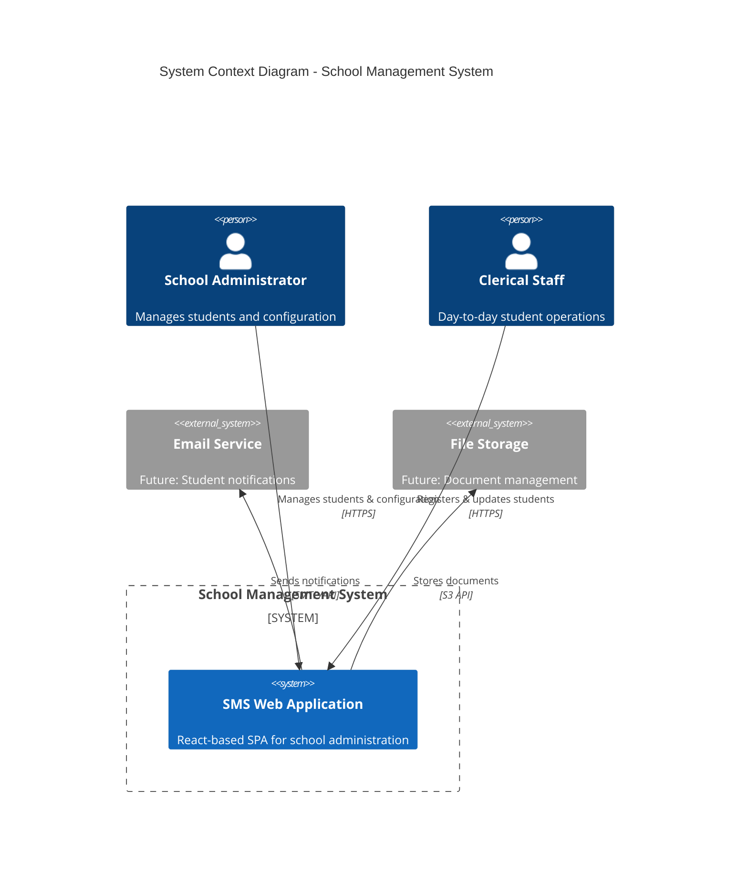
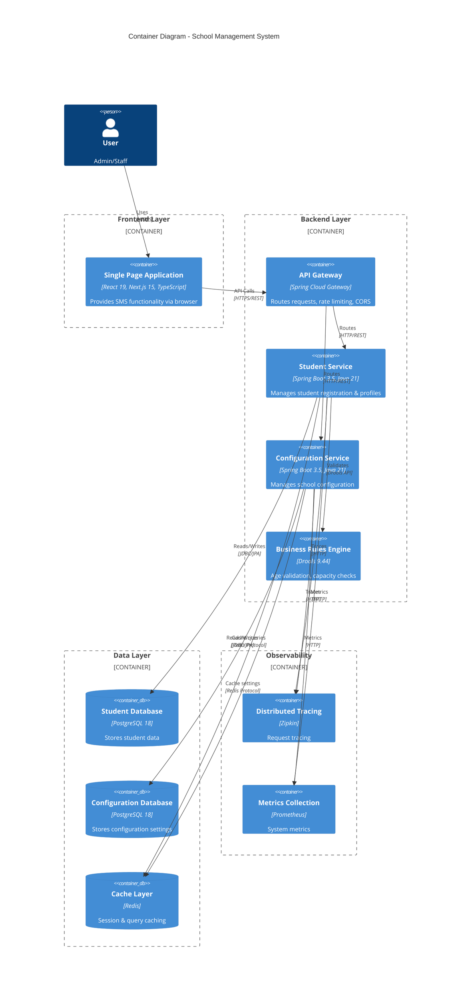
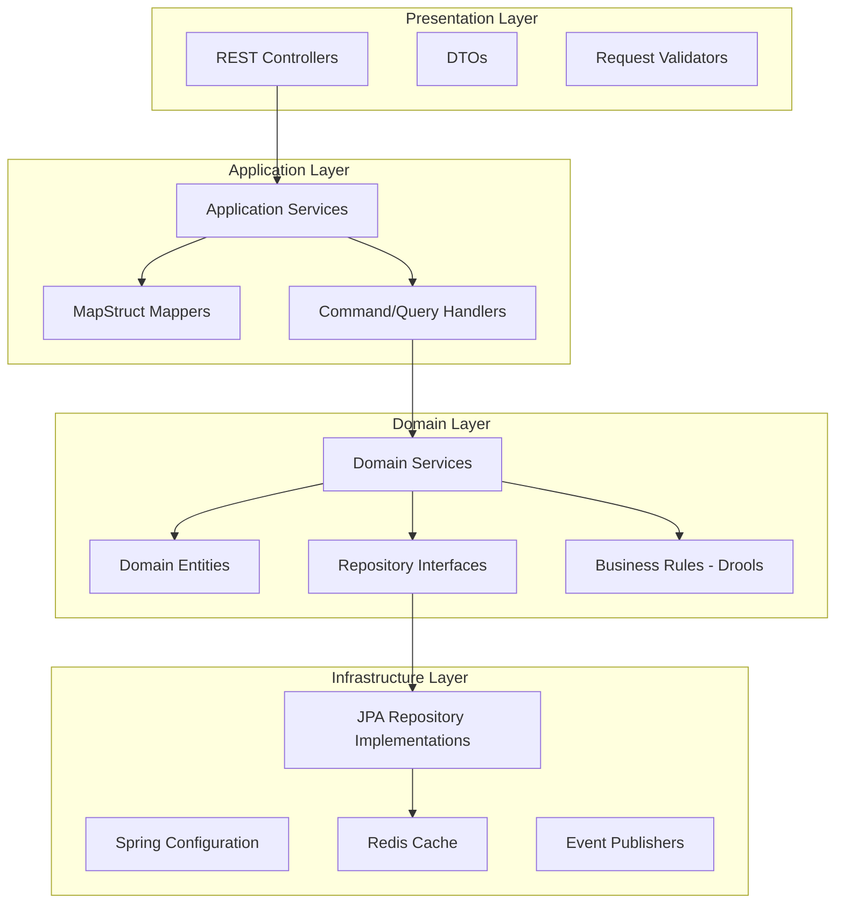
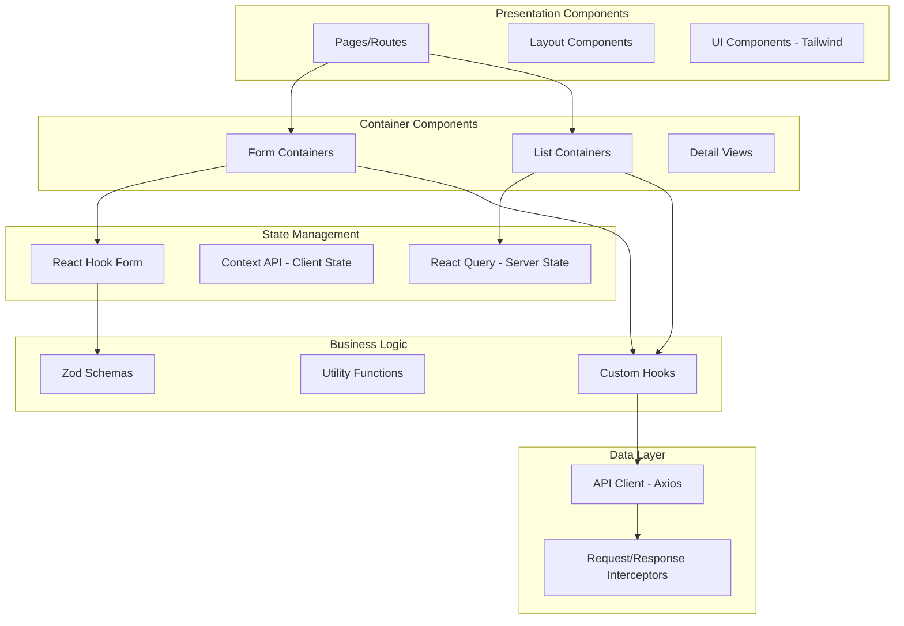
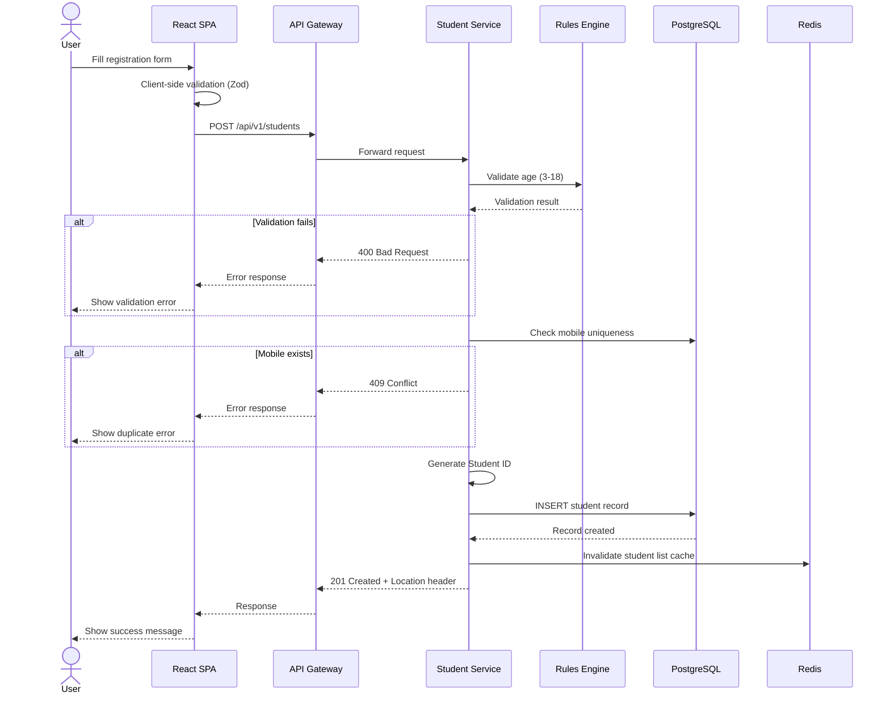
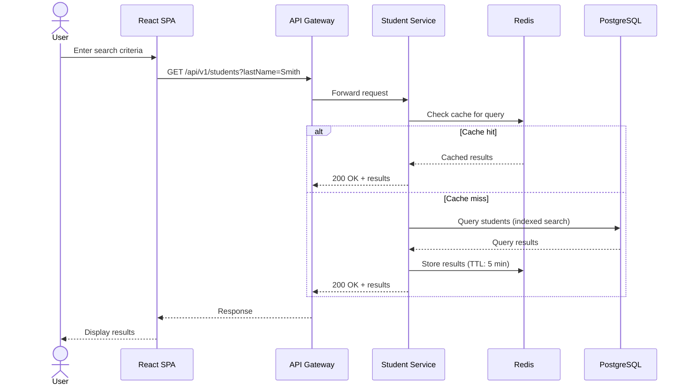
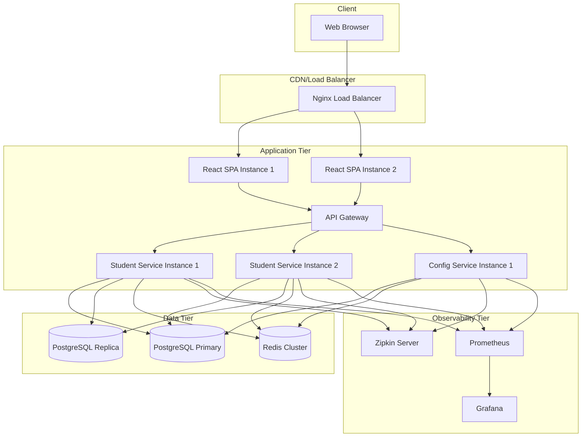

# System Architecture - School Management System (SMS)

## 1. Executive Summary

The School Management System (SMS) is a web-based platform designed for educational institutions to manage student registration, profiles, and school configuration settings. This document outlines the production-ready architecture for Phase 1 implementation.

### 1.1 Architectural Goals
- **Scalability**: Horizontal scaling capability for future growth
- **Maintainability**: Clean separation of concerns with microservices
- **Performance**: Sub-200ms response time for 95th percentile
- **Security**: Industry-standard security practices (prepared for Phase 2 auth)
- **Testability**: Comprehensive test coverage (60% unit, 30% integration, 10% E2E)

---

## 2. System Context

### 2.1 System Context Diagram



### 2.2 Key Stakeholders
- **School Administrators**: Full access to student and configuration management
- **Clerical Staff**: Student registration and profile updates
- **Future**: Teachers (view access), Parents (student portal)

---

## 3. Architecture Style & Principles

### 3.1 Architectural Style
**Microservices with Domain-Driven Design (DDD)**

The system is decomposed into two bounded contexts:
1. **Student Management Service**: Student registration, profiles, status management
2. **Configuration Service**: School settings and key-value configuration

### 3.2 Design Principles

#### SOLID Principles
- **Single Responsibility**: Each class/module has one reason to change
- **Open/Closed**: Open for extension, closed for modification
- **Liskov Substitution**: Subtypes must be substitutable for base types
- **Interface Segregation**: Clients should not depend on interfaces they don't use
- **Dependency Inversion**: Depend on abstractions, not concretions

#### Additional Principles
- **Separation of Concerns**: Layered architecture with clear boundaries
- **DRY (Don't Repeat Yourself)**: Shared logic in reusable modules
- **YAGNI (You Aren't Gonna Need It)**: Build only what's required
- **12-Factor App**: Configuration, stateless processes, disposability

### 3.3 Architectural Patterns
- **Layered Architecture**: Presentation → Application → Domain → Infrastructure
- **Repository Pattern**: Data access abstraction
- **DTO Pattern**: Data transfer between layers
- **Command Query Responsibility Segregation (CQRS)**: Separate read/write operations
- **Event-Driven**: Future-ready for inter-service communication

---

## 4. Container Architecture

### 4.1 Container Diagram



### 4.2 Container Responsibilities

#### Frontend Container (SPA)
- **Technology**: React 19, Next.js 15, TypeScript, Tailwind CSS
- **Responsibilities**:
  - User interface rendering
  - Client-side validation (Zod schemas)
  - State management (React Query + Context API)
  - API communication (Axios with interceptors)
- **Deployment**: Vercel/Nginx static hosting

#### API Gateway
- **Technology**: Spring Cloud Gateway
- **Responsibilities**:
  - Request routing to microservices
  - Rate limiting & throttling
  - CORS configuration
  - Request/response logging
  - Future: JWT validation
- **Port**: 8080

#### Student Service
- **Technology**: Spring Boot 3.5, Java 21, Spring Data JPA
- **Responsibilities**:
  - Student CRUD operations
  - Student search (by name, guardian, student ID)
  - Status management (Active/Inactive)
  - Business rule enforcement (age, mobile uniqueness)
  - Enrollment history tracking
- **Port**: 8081
- **Database**: PostgreSQL (student_db)

#### Configuration Service
- **Technology**: Spring Boot 3.5, Java 21, Spring Data JPA
- **Responsibilities**:
  - School profile management
  - Configuration CRUD (key-value pairs)
  - Category-based retrieval (General, Academic, Financial)
  - Settings versioning (audit trail)
- **Port**: 8082
- **Database**: PostgreSQL (config_db)

#### Business Rules Engine
- **Technology**: Drools 9.44.0.Final
- **Responsibilities**:
  - Age validation (3-18 years)
  - Class capacity enforcement (future)
  - Mobile number uniqueness validation
  - Configurable business rules without code changes

#### Data Layer
- **Student Database**: PostgreSQL 18 (optimized for OLTP)
- **Configuration Database**: PostgreSQL 18 (separate for isolation)
- **Cache Layer**: Redis (query results, session data)

#### Observability Stack
- **Zipkin**: Distributed tracing with correlation IDs
- **Prometheus**: Metrics collection (JVM, HTTP, custom business metrics)
- **Micrometer**: Metrics instrumentation
- **Future**: Grafana dashboards, ELK Stack for log aggregation

---

## 5. Component Architecture (Layered)

### 5.1 Backend Layered Architecture



### 5.2 Layer Responsibilities

#### Presentation Layer (REST API)
- **Controllers**: HTTP request handling, response formatting
- **DTOs**: Request/Response data transfer objects
- **Validators**: JSR-380 Bean Validation
- **Exception Handlers**: RFC 7807 Problem Details
- **Constraints**: No business logic, thin layer

#### Application Layer (Orchestration)
- **Services**: Transaction boundaries, orchestration
- **Mappers**: DTO ↔ Entity conversion (MapStruct)
- **Command Handlers**: Write operations (Create, Update, Delete)
- **Query Handlers**: Read operations (optimized queries)
- **Constraints**: No direct database access, delegates to domain

#### Domain Layer (Business Logic)
- **Entities**: Rich domain models with behavior
- **Value Objects**: Immutable types (Email, Mobile, AdhaarNumber)
- **Repository Interfaces**: Data access contracts
- **Domain Services**: Complex business logic
- **Business Rules**: Drools rule definitions
- **Constraints**: Framework-agnostic, testable in isolation

#### Infrastructure Layer (Technical Concerns)
- **Repository Implementations**: Spring Data JPA
- **Configuration**: Spring Boot auto-configuration
- **Cache**: Redis integration
- **Event Publishers**: Domain event propagation
- **Constraints**: Implements domain interfaces

### 5.3 Frontend Component Architecture



---

## 6. Data Flow & Interactions

### 6.1 Student Registration Flow



### 6.2 Student Search Flow



---

## 7. Cross-Cutting Concerns

### 7.1 Observability & Monitoring

#### Correlation IDs
- Generate UUID for each request at API Gateway
- Propagate via `X-Correlation-ID` header
- Log in all services with structured format
- Include in Zipkin traces

#### Structured Logging
```json
{
  "timestamp": "2025-12-08T10:15:30Z",
  "level": "INFO",
  "service": "student-service",
  "correlationId": "a1b2c3d4-e5f6-7890",
  "operation": "createStudent",
  "userId": "admin-001",
  "message": "Student created successfully",
  "studentId": "STU-2025-0001"
}
```

#### Metrics to Track
- **Business Metrics**:
  - `students.registered.total` (Counter)
  - `students.active.count` (Gauge)
  - `students.search.duration` (Histogram)
- **Technical Metrics**:
  - JVM memory/GC
  - HTTP request duration (p50, p95, p99)
  - Database connection pool stats
  - Cache hit/miss ratio

#### Health Checks
- **Liveness**: Service is running
- **Readiness**: Service can accept traffic (DB connected, cache available)
- **Endpoint**: `/actuator/health`

### 7.2 Error Handling Strategy

#### Error Response Format (RFC 7807)
```json
{
  "type": "https://api.sms.com/problems/validation-error",
  "title": "Validation Error",
  "status": 400,
  "detail": "Age must be between 3 and 18 years",
  "instance": "/api/v1/students",
  "correlationId": "a1b2c3d4-e5f6-7890",
  "timestamp": "2025-12-08T10:15:30Z",
  "errors": [
    {
      "field": "dateOfBirth",
      "message": "Student must be between 3 and 18 years old",
      "rejectedValue": "2022-01-01"
    }
  ]
}
```

#### HTTP Status Codes
- **200 OK**: Successful GET/PUT
- **201 Created**: Successful POST
- **204 No Content**: Successful DELETE
- **400 Bad Request**: Validation errors
- **404 Not Found**: Resource not found
- **409 Conflict**: Duplicate resource (mobile number)
- **422 Unprocessable Entity**: Business rule violation
- **500 Internal Server Error**: Unexpected server error
- **503 Service Unavailable**: Service temporarily down

### 7.3 Caching Strategy

#### Cache Layers
1. **Application Cache (Redis)**:
   - Student list queries (TTL: 5 minutes)
   - Configuration settings (TTL: 30 minutes)
   - Search results (TTL: 5 minutes)

2. **Database Query Cache**:
   - JPA second-level cache (Hibernate)
   - Entity-level caching for rarely changing data

#### Cache Invalidation
- **Write-through**: Update DB + invalidate cache
- **TTL-based**: Automatic expiration
- **Manual**: On configuration changes

### 7.4 Transaction Management

#### ACID Guarantees
- **Atomicity**: All-or-nothing operations
- **Consistency**: Business rules enforced
- **Isolation**: Read Committed isolation level
- **Durability**: WAL in PostgreSQL

#### Optimistic Locking
- Use `@Version` annotation in JPA entities
- Increment version on every update
- Throw `OptimisticLockException` on conflict

#### Transaction Boundaries
- Application layer services (`@Transactional`)
- Read-only transactions for queries
- Propagation: REQUIRED for writes, SUPPORTS for reads

---

## 8. Scalability & Performance

### 8.1 Horizontal Scaling Strategy

#### Stateless Design
- No server-side sessions (use JWT tokens in Phase 2)
- Redis for shared state (cache)
- Load balancer distributes requests

#### Database Scaling
- **Read Replicas**: For search-heavy workloads
- **Connection Pooling**: HikariCP (min: 10, max: 50)
- **Indexing**: On search columns (last_name, guardian_name, mobile)

### 8.2 Performance Optimization

#### Backend Optimizations
- **N+1 Query Prevention**: Use `@EntityGraph` or JOIN FETCH
- **Batch Processing**: Batch inserts for bulk operations
- **Pagination**: Limit result sets (max 100 per page)
- **Database Indexes**: On frequently queried columns
- **Projection Queries**: Fetch only required columns

#### Frontend Optimizations
- **Code Splitting**: Route-based lazy loading
- **Memoization**: React.memo, useMemo, useCallback
- **Virtual Scrolling**: For large student lists
- **Image Optimization**: Next.js Image component
- **Bundle Size**: Tree shaking, code minification

### 8.3 Performance Targets
- **API Response Time**: <200ms (95th percentile)
- **Page Load Time**: <2s (First Contentful Paint)
- **Database Query Time**: <50ms (95th percentile)
- **Cache Hit Ratio**: >80%

---

## 9. Security Architecture (Preparation for Phase 2)

### 9.1 Authentication & Authorization (Future)

#### JWT-Based Authentication
- Stateless tokens with RS256 signing
- Token structure: Header + Payload + Signature
- Expiration: 30 minutes (access), 7 days (refresh)

#### Role-Based Access Control (RBAC)
```
SUPER_ADMIN
  └── ADMIN (Full student & config access)
       └── STAFF (Student CRUD, limited config view)
            └── TEACHER (Read-only student view)
```

### 9.2 Current Security Measures

#### Input Validation
- **Client-side**: Zod schemas (immediate feedback)
- **Server-side**: JSR-380 Bean Validation (defense in depth)
- **Drools Rules**: Business logic validation

#### SQL Injection Prevention
- Parameterized queries (JPA/Hibernate)
- No string concatenation for queries
- Input sanitization

#### XSS Prevention
- React's automatic escaping
- Content Security Policy (CSP) headers
- Sanitize HTML inputs (DOMPurify)

#### CSRF Protection (Phase 2)
- Double-submit cookie pattern
- SameSite cookie attribute
- CSRF tokens for state-changing operations

### 9.3 Data Protection

#### Sensitive Data
- **PII Fields**: Mobile, Email, Adhaar Number, Address
- **Encryption**: TLS 1.3 in transit
- **Database**: Encrypted at rest (PostgreSQL TDE)
- **Masking**: Log sanitization (mask mobile, adhaar)

#### Audit Trail
- Track all CRUD operations
- Store: User ID, Action, Timestamp, Old/New values
- Immutable audit log table

---

## 10. Deployment Architecture

### 10.1 Infrastructure Diagram



### 10.2 Container Orchestration (Docker + Kubernetes)

#### Docker Containers
- **Frontend**: Node.js base image (Alpine)
- **Backend Services**: OpenJDK 21 (Alpine)
- **Databases**: Official PostgreSQL 18 image
- **Cache**: Official Redis 7 image

#### Kubernetes Resources
- **Deployments**: For stateless services (replicas: 2)
- **StatefulSets**: For databases
- **Services**: ClusterIP for internal, LoadBalancer for gateway
- **ConfigMaps**: Environment-specific configuration
- **Secrets**: Database credentials, JWT keys (Phase 2)
- **HPA**: Horizontal Pod Autoscaler (CPU: 70%)

### 10.3 CI/CD Pipeline

```mermaid
graph LR
    Dev[Developer] --> Git[Git Push]
    Git --> GitHub[GitHub Actions]
    GitHub --> Build[Build & Test]
    Build --> SonarQube[Code Quality]
    SonarQube --> Security[Security Scan]
    Security --> Docker[Docker Build]
    Docker --> Registry[Container Registry]
    Registry --> Deploy[Deploy to K8s]
    Deploy --> Smoke[Smoke Tests]
    Smoke --> Monitor[Monitor]
```



#### Pipeline Stages
1. **Build**: Compile Java/TypeScript, run linters
2. **Unit Tests**: JUnit 5, Vitest (coverage: 80%)
3. **Integration Tests**: TestContainers (30%)
4. **Code Quality**: SonarQube (Quality Gate)
5. **Security Scan**: OWASP Dependency Check, Trivy
6. **Docker Build**: Multi-stage builds
7. **Push to Registry**: Docker Hub/ECR
8. **Deploy**: Kubernetes manifests (Helm charts)
9. **E2E Tests**: Playwright (10%)
10. **Smoke Tests**: Critical path validation

---

## 11. Future Enhancements

### 11.1 Phase 2 Features
- **Authentication**: JWT-based login/logout
- **Authorization**: RBAC with granular permissions
- **Enrollment Management**: Class assignments, academic year
- **Attendance Tracking**: Daily attendance recording
- **Fee Management**: Payment tracking, receipts

### 11.2 Technical Improvements
- **Event Sourcing**: Full audit trail with event store
- **CQRS Separation**: Dedicated read/write databases
- **GraphQL API**: Flexible client queries
- **Real-time Updates**: WebSocket notifications
- **Mobile Apps**: React Native iOS/Android
- **Reporting**: Jasper Reports integration
- **Document Management**: AWS S3 integration
- **Email Notifications**: SendGrid/AWS SES

### 11.3 Architecture Evolution
- **Service Mesh**: Istio for traffic management
- **API Versioning**: v2 endpoints without breaking changes
- **Multi-tenancy**: Support multiple schools
- **Geo-distribution**: Multi-region deployment
- **Machine Learning**: Predictive analytics (dropout risk)

---

## 12. Decision Log

### 12.1 Architecture Decisions

| Decision | Rationale | Alternatives Considered |
|----------|-----------|------------------------|
| Microservices over Monolith | Better scalability, independent deployment, team autonomy | Modular monolith (simpler for Phase 1) |
| PostgreSQL over MySQL | Better JSON support, mature replication, ACID compliance | MySQL, MongoDB |
| Redis over Memcached | Richer data structures, persistence, pub/sub support | Memcached, Hazelcast |
| React over Angular | Larger ecosystem, easier learning curve, better performance | Angular, Vue.js |
| Spring Boot over Node.js | Type safety, mature ecosystem, better for complex domains | Node.js/NestJS, .NET |
| Drools over hardcoded rules | Business users can modify rules, better testability | Hardcoded in services |
| JWT over Sessions | Stateless, scalable, mobile-friendly | Server-side sessions |
| REST over GraphQL | Simpler for CRUD, better caching, standard tooling | GraphQL, gRPC |

### 12.2 Technology Selection Criteria
1. **Maturity**: Proven in production environments
2. **Community**: Active community, good documentation
3. **Performance**: Meets sub-200ms response time requirement
4. **Scalability**: Supports horizontal scaling
5. **Developer Experience**: Good tooling, debugging support
6. **Cost**: Open-source, no vendor lock-in

---

## 13. Non-Functional Requirements

### 13.1 Performance
- API response time: <200ms (95th percentile)
- Page load time: <2s (FCP)
- Database query time: <50ms (95th percentile)
- Concurrent users: 500+

### 13.2 Availability
- Uptime: 99.5% (43.8 hours downtime/year)
- Planned maintenance: Sunday 2-4 AM
- Recovery Time Objective (RTO): 4 hours
- Recovery Point Objective (RPO): 1 hour (database backups)

### 13.3 Scalability
- Horizontal scaling: Add instances without code changes
- Database: Read replicas for read-heavy workloads
- Cache: Redis cluster for distributed caching
- Load balancing: Round-robin with health checks

### 13.4 Maintainability
- Code coverage: >80% (unit + integration)
- Cyclomatic complexity: <10 per method
- Documentation: OpenAPI specs, architecture docs
- Code reviews: Required for all changes

### 13.5 Usability
- Responsive design: Mobile, tablet, desktop
- Accessibility: WCAG 2.1 Level AA
- Browser support: Chrome, Firefox, Safari, Edge (latest 2 versions)
- Form validation: Real-time feedback

---

## 14. Conclusion

This architecture provides a solid foundation for the School Management System Phase 1. Key strengths:

1. **Modular Design**: Microservices allow independent scaling and deployment
2. **Technology Choices**: Battle-tested stack (Spring Boot, React, PostgreSQL)
3. **Performance**: Caching, indexing, and optimization strategies
4. **Security**: Defense-in-depth approach, prepared for Phase 2 auth
5. **Observability**: Comprehensive monitoring and tracing
6. **Testability**: Clear layering enables isolated testing

The architecture is designed to evolve with future requirements while maintaining stability and performance for current needs.

---

**Document Version**: 1.0
**Last Updated**: 2025-12-08
**Author**: Software Architect
**Status**: Approved for Implementation
