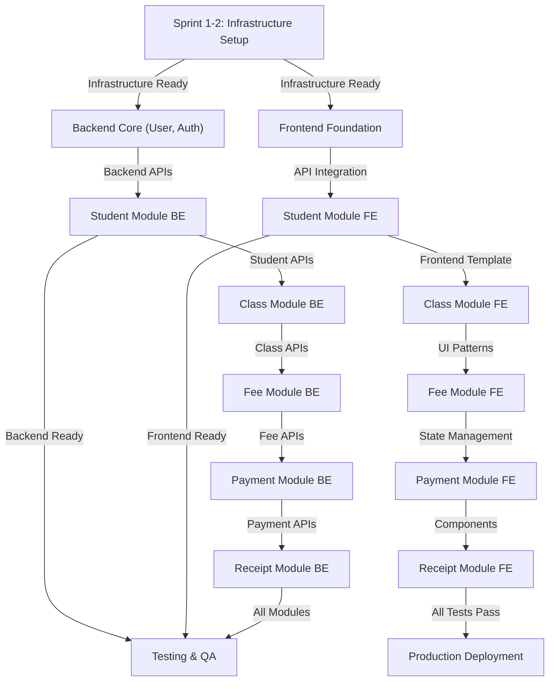

# Dependency Matrix & Critical Path Analysis

**Version**: 1.0
**Date**: November 11, 2025

---

## 1. High-Level Dependency Graph



---

## 2. Sprint-Level Dependencies

### Sprint 1: Infrastructure & Database Setup

**No dependencies** - Critical start point

**Blockers for other sprints if delayed**:
- All backend development
- All frontend setup
- CI/CD pipeline

---

### Sprint 2: Backend Core & API Foundation

**Dependencies**:
- BE-S1-01 (Maven setup) ✓
- BE-S1-02 (Configuration) ✓
- BE-S1-03 (Database schema) ✓
- BE-S1-04 (Flyway migrations) ✓
- BE-S1-08 (Security) ✓

**Critical for**:
- All backend modules (Sprints 3-7)
- Frontend API integration (Sprints 8-11)

---

### Sprint 3: Student Management Module

**Hard Dependencies**:
- BE-S2-01: User entity & repository
- BE-S2-02: Authentication APIs
- BE-S1-07: Base classes
- BE-S1-08: Security configuration

**Can start parallel**:
- FE-S1-* (Frontend foundation)

**Blocks**:
- BE-S4-* (Class management - enrollments depend on students)
- FE-S3-* (Student UI - must wait for APIs)

---

### Sprint 4: Class Management Module

**Hard Dependencies**:
- BE-S3-* (Student module complete)
- BE-S2-05: Academic year entity

**Can start parallel**:
- FE-S1-* (Component library)

**Blocks**:
- BE-S5-* (Fee module - fees linked to classes)
- BE-S6-* (Enrollment service)

---

### Sprint 5: Fee Management Module

**Hard Dependencies**:
- BE-S4-* (Class module complete)
- BE-S2-05: Academic year entity
- Drools configuration (included in BE-S1-08)

**Blocks**:
- BE-S6-* (Payment tracking)
- FE-S5-* (Fee UI)

---

### Sprint 6: Payment & Fee Journal

**Hard Dependencies**:
- BE-S5-* (Fee structures)
- BE-S3-* (Student module)
- BE-S1-03: Database schema (fee_journals, payments)

**Blocks**:
- BE-S7-* (Receipt generation)
- FE-S6-* (Payment UI)

---

### Sprint 7: Receipt & Reporting

**Hard Dependencies**:
- BE-S6-* (Payments complete)
- BE-S3-* (Student module)
- BE-S4-* (Class module for reporting)
- BE-S5-* (Fee module for reports)

**Blocks**:
- FE-S7-* (Receipt UI)
- QA-S7-* (Reporting tests)

---

### Sprint 8-10: Frontend Development

**Hard Dependencies by Sprint**:
- **FE-S8-01/02**: BE-S3-* (Student APIs)
- **FE-S9-01/02**: BE-S4-*, BE-S5-* (Class & Fee APIs)
- **FE-S10-01/02**: BE-S6-*, BE-S7-* (Payment & Receipt APIs)

**Can be done parallel** with backend if APIs are mocked

---

### Sprint 11: Integration & Cross-Component Testing

**Hard Dependencies**:
- BE-S7-* (All backend complete)
- FE-S10-* (All frontend complete)

**Blocks**:
- QA-S11-* (Integration testing)
- Sprint 12 (Performance testing)

---

### Sprint 12: Performance, Security & UAT

**Hard Dependencies**:
- QA-S11-* (Integration tests complete)
- All code merges to main

**Blocks**:
- Sprint 13 (Production deployment)

---

### Sprint 13: Production Deployment & Go-Live

**Hard Dependencies**:
- QA-S12-* (All tests passing)
- Security audit complete
- Performance targets met
- UAT signed off

---

## 3. Critical Path Analysis

**Critical Path** = Longest sequence of dependent tasks that determines minimum project duration

```
Start
  ↓
Sprint 1: Infrastructure (2 weeks)
  ├─ BE-S1-01: Maven setup (3 days)
  ├─ BE-S1-02: Configuration (2 days)
  ├─ BE-S1-03: Database schema (4 days)
  ├─ BE-S1-04: Flyway (2 days)
  ├─ BE-S1-06: CI/CD pipeline (4 days)
  └─ BE-S1-08: Security (4 days)
  ↓
Sprint 2: Backend Core (2 weeks)
  ├─ BE-S2-01: User entity (3 days)
  ├─ BE-S2-02: Auth APIs (5 days)
  └─ BE-S2-05: Academic year & Class (5 days)
  ↓
Sprint 3: Student Module (2 weeks)
  ├─ BE-S3-01: Student DTOs (3 days)
  ├─ BE-S3-02: Student APIs (5 days)
  └─ BE-S3-03: Student Service (5 days)
  ↓
Sprint 4: Class Management (2 weeks)
  ├─ BE-S4-01: Class DTOs (3 days)
  ├─ BE-S4-02: Class APIs (5 days)
  └─ BE-S4-03: Enrollment Service (5 days)
  ↓
Sprint 5: Fee Management (2 weeks)
  ├─ BE-S5-01: Fee DTOs (3 days)
  ├─ BE-S5-02: Fee APIs (5 days)
  └─ BE-S5-03: Fee Service & Calculations (5 days)
  ↓
Sprint 6: Payment Tracking (2 weeks)
  ├─ BE-S6-01: Payment DTOs (3 days)
  ├─ BE-S6-02: Payment APIs (5 days)
  └─ BE-S6-03: Journal & Payment Service (5 days)
  ↓
Sprint 7: Receipt & Reporting (2 weeks)
  ├─ BE-S7-01: Receipt DTOs (3 days)
  ├─ BE-S7-02: Receipt APIs (5 days)
  └─ BE-S7-03: Reporting APIs (5 days)
  ↓
Sprint 11: Integration Tests (2 weeks)
  ├─ Backend + Frontend integration (7 days)
  └─ E2E tests (7 days)
  ↓
Sprint 12: Performance & Security (2 weeks)
  ├─ Performance testing (7 days)
  └─ Security audit & fixes (7 days)
  ↓
Sprint 13: Deployment (2 weeks)
  ├─ Production setup (3 days)
  ├─ Data migration (4 days)
  └─ Go-live & support (7 days)
  ↓
Finish (26 weeks total)
```

**Critical Path Duration**: ~17 weeks

**Buffer Available**: ~9 weeks (26 total - 17 critical path)

---

## 4. Cross-Team Dependencies

### Backend → Frontend

| Backend Task | Frontend Task | Lead Time | Risk |
|-------------|---------------|-----------|------|
| BE-S3-02: Student APIs | FE-S3-01: Student List | API contracts | Medium |
| BE-S3-03: Student service | FE-S3-02: Student Form | API ready | Medium |
| BE-S4-02: Class APIs | FE-S4-01: Class mgmt | Enrollment changes | Medium |
| BE-S5-02: Fee APIs | FE-S5-01: Fee mgmt | Complex calculations | High |
| BE-S6-02: Payment APIs | FE-S6-01: Payment UI | Journal dependencies | High |
| BE-S7-02: Receipt APIs | FE-S7-01: Receipt UI | Report formats | Low |

### Backend → QA

| Backend Task | QA Task | Lead Time | Risk |
|-------------|---------|-----------|------|
| BE-S3-03: Student service | QA-S3-01: Unit tests | Implementation complete | Low |
| BE-S3-02: Student APIs | QA-S3-03: Integration tests | API stable | Low |
| BE-S5-03: Fee calculations | QA-S5-01: Fee tests | Complex rules tested | High |
| BE-S6-03: Payment service | QA-S6-01: Payment tests | Edge cases needed | High |

### Frontend → QA

| Frontend Task | QA Task | Lead Time | Risk |
|--------------|---------|-----------|------|
| FE-S3-01/02: Student UI | QA-S3-02: Component tests | Features complete | Low |
| FE-S6-01: Payment UI | QA-S6-02: E2E tests | Integration ready | Medium |

---

## 5. Task Dependency Matrix

### Student Module (Sprint 3)

```
FE-S1-01 (Project setup)
  ├─ FE-S1-02 (Dependencies)
  ├─ FE-S1-03 (API client)
  ├─ FE-S1-04 (Auth store)
  ├─ FE-S1-05 (Components)
  └─ FE-S1-06 (Routing)
      ↓
  FE-S3-01 (Student list)
  FE-S3-02 (Student form)
      ↓
  QA-S3-02 (Component tests)

BE-S2-01 (User entity)
BE-S2-02 (Auth APIs)
  ↓
BE-S3-01 (Student DTOs)
BE-S3-02 (Student APIs)
BE-S3-03 (Student service)
  ├─ BE-S2-04 (Guardian entity)
  ├─ BE-S2-06 (Enrollment entity)
  └─ BE-S1-08 (Security)
      ↓
  QA-S3-01 (Unit tests)
  QA-S3-03 (Integration tests)
```

---

## 6. Parallel Work Opportunities

### Backend and Frontend Can Work in Parallel

**Frontend can start with mocked APIs once contracts are defined:**

1. **After Sprint 1**: Frontend setup and component library
2. **During Sprint 3**: Frontend student module with mocked APIs
3. **During Sprint 4**: Frontend class module with mocked APIs
4. **etc.**

**Benefits**:
- Frontends not blocked by backend
- Parallel development increases throughput
- API contracts defined early

**Risks**:
- API changes require frontend updates
- Integration delays if contracts change

**Mitigation**:
- Define API contracts in Sprint 2
- Create API mocks immediately
- Use OpenAPI specifications
- Weekly integration checkpoints

---

## 7. Blocker Prevention Strategy

### High-Risk Blockers

| Blocker | Impact | Prevention | Mitigation |
|---------|--------|-----------|-----------|
| Database schema not ready | All development stops | Parallel completion in Sprint 1 | Use staging DB if prod delayed |
| Auth APIs not functional | Frontend + backend blocked | Sprint 2 critical task | Implement mock auth immediately |
| API contract changes | Rework required | API review before implementation | Use API versioning |
| Test infrastructure delays | Testing delays | Early setup in Sprint 1 | Use manual testing temporarily |
| Key person absence | Knowledge loss | Cross-training | Detailed documentation |

### Escalation Triggers

- Any task on critical path delayed >1 day
- Critical path slack reduced below 3 days
- Backend-frontend integration issues blocking
- Test infrastructure failures
- Production environment not ready 1 week before go-live

---

## 8. Resource Leveling

### Optimal Resource Allocation by Sprint

**Sprint 1 (Setup)**:
- Backend Team Lead (full)
- 1 Backend Engineer (full) - Database
- 1 DevOps Engineer (full)
- 1 Frontend Engineer (full) - Setup
- 1 QA Engineer (full) - Planning

**Sprints 2-7 (Core Development)**:
- 1 Backend Team Lead (0.5)
- 3 Backend Engineers (full)
- 1 Database Admin (0.5)
- 1 DevOps Engineer (0.5)
- 2 Frontend Engineers (full)
- 1 Frontend Team Lead (0.5)
- 2 QA Engineers (full)
- 1 QA Lead (0.5)

**Sprints 8-11 (Integrated Development)**:
- 1 Backend Team Lead (0.25)
- 2 Backend Engineers (0.5) - Bug fixes
- 1 DevOps Engineer (0.25)
- 2 Frontend Engineers (full)
- 1 Frontend Team Lead (0.5)
- 2 QA Engineers (full)
- 1 QA Lead (0.75)

**Sprints 12-13 (Testing & Deployment)**:
- 1 Backend Team Lead (0.5) - Support
- 1 Backend Engineer (0.5) - Hotfixes
- 1 DevOps Engineer (full)
- 1 QA Lead (full)
- 2 QA Engineers (full)
- Project Manager (full)

---

## 9. Schedule Risk Analysis

### Early Schedule Risks (Sprints 1-4)

**Risk**: Database schema issues discovered
- **Impact**: All development blocked
- **Probability**: Medium
- **Mitigation**: Database review by external expert in week 1

**Risk**: Authentication complexity underestimated
- **Impact**: Frontend + backend blocked
- **Probability**: Medium
- **Mitigation**: Implement JWT provider early, extensive testing

### Mid-Schedule Risks (Sprints 5-8)

**Risk**: Fee calculation rules complex
- **Impact**: Payment module delayed
- **Probability**: High
- **Mitigation**: Early Drools training, domain expert involvement

**Risk**: API contract misalignment
- **Impact**: Frontend rework required
- **Probability**: Medium
- **Mitigation**: Weekly API review, versioning strategy

### Late-Schedule Risks (Sprints 9-13)

**Risk**: Integration issues discovered
- **Impact**: UAT delays
- **Probability**: High
- **Mitigation**: Early integration testing, daily builds

**Risk**: Performance doesn't meet targets
- **Impact**: Production deployment delayed
- **Probability**: Medium
- **Mitigation**: Performance testing from Sprint 6

---

## 10. Dependency Slack Analysis

### Slack = Float = Flexibility in scheduling

**Task with slack can be delayed without affecting project**:

**Zero Slack (Critical Path)**:
- BE-S1-01 → BE-S1-02 → BE-S1-03 → BE-S1-04
- BE-S2-01 → BE-S2-02 → BE-S3-01 → ... → BE-S7-03
- FE-S1-01 → FE-S1-02 → FE-S1-03 (if not parallel with backend)
- All backend-dependent front tasks

**High Slack (Non-Critical)**:
- Some components library tasks (FE-S1-05)
- Some configuration tasks (BE-S1-02)
- Some documentation tasks

**Recommendations**:
1. Schedule critical path items first
2. Use slack for buffer against delays
3. Don't let slack reduce below 2 days
4. Reallocate resources from slack tasks when blockers arise

---

## 11. Version Control & Release Strategy

### Git Workflow

```
main (production)
  ↑
  └─ release/v1.0
      ↑
      └─ develop (integration)
          ├─ feature/student-mgmt
          ├─ feature/class-mgmt
          ├─ feature/fee-mgmt
          ├─ feature/payment
          ├─ feature/receipt
          ├─ bugfix/auth-issue
          └─ hotfix/security-patch
```

### Release Criteria

**Release to Staging**:
- All PRs merged to develop
- All tests passing
- Code review approved
- No critical/high severity bugs

**Release to Production (Main)**:
- All staging tests passing
- UAT approval
- Performance tests passing
- Security audit complete
- Deployment runbook verified

---

## 12. Dependency Review Checklist

**Weekly during standup**:
- [ ] Critical path still valid?
- [ ] Any blockers emerged?
- [ ] Task dependencies complete?
- [ ] Slack time adequate?
- [ ] Resource allocation optimal?
- [ ] Risk mitigation effective?

**Sprint Planning**:
- [ ] Next sprint dependencies met?
- [ ] External dependencies available?
- [ ] Team capacity sufficient?
- [ ] Contingency time allocated?

---

## Document Control

| Version | Date | Author | Status |
|---------|------|--------|--------|
| 1.0 | Nov 11, 2025 | Project Manager | Draft |

---

## Appendix: Quick Reference

**Critical Path Duration**: 17 weeks
**Total Project Duration**: 26 weeks
**Buffer Available**: 9 weeks
**Number of Task Dependencies**: ~120
**Critical Tasks**: ~35 (from total 359)

**Key Milestones on Critical Path**:
1. Week 2: Infrastructure complete
2. Week 4: Backend core ready
3. Week 6: Student module done
4. Week 10: All core modules done
5. Week 18: All testing complete
6. Week 26: Production live

